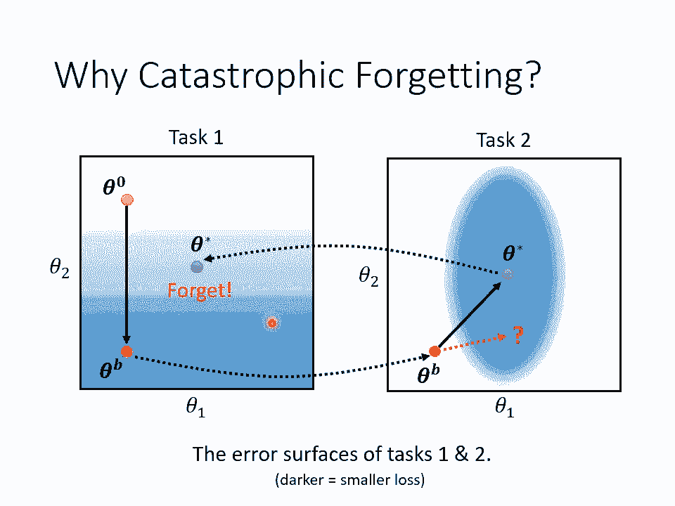

# P35：L20.2- 机器终身学习2：灾难性遗忘的克服之道 - ShowMeAI - BV1fM4y137M4

好，那我们就继续讲吧。我们就继续讲吧。好，那我们接下来呢就是要讲三个lifelong learning的可能解法。那第一个解法叫做selective的saptic呃plity。

那从字面上你可能一下子没有办法get到说这个方法到底想要做什么？这个saptic是图触的意思，就是我们神脑神经中这个神经跟神经之间的连接，哎，这个叫做图触。plasticity呢是可塑性的意思。

所以简单来说，这个方法想要做的事情就是我们只让我们的这个类神经网路中某一些神经元或某一些神经元间的连接具有可塑性，而selected的意思就是说只有部分的连接是有可塑性的。有一些连接必须被固化。

它必须不能够再移动，不能够再改变它的数值。好，那像这样的方法又叫做regization based的方法。那这这个面向啊，这个研究的面向在lifephone learning的领域里面。

我觉得是发展的最完整的所以等一下我们会花比较多的时间来讲selective syntic plasticity。那另外两个面向呢，我们都只用一两页投影片很快的带过。

那你会发现作业里面主要的问题也都集中在跟regization base有关的方法上面。

好，那我们先来想一下，为什么catatrophy forgetttting这件事情会发生呢？我们假设有任务一跟任务2这两个任务。而这两个任务呢。

我们假设我们的模型只有两个参数se达 one跟se达 two。那当然一个模型通常有上上百万上亿个参数了，我们假设只有两个参数。好。

那这个投影片上这这两张图代表的是任务一跟任务二的los function啊，也就是在任务一上面，如果你的se达 one跟se达 two设不一样的值，你就会有不一样的lo，那我们用颜色来代表lo的大小。

如果原颜色越偏蓝色就代表lo越大，颜色越偏白色，代表啊，我说错了，不好意思，我刚才说法，颜色越偏蓝色代表lo越小，颜色越偏白色，代表lo越大。好。

所以左右两张图分别就是任务一跟任务二的lo function，也就是他们的er surface。好，那我们现在先让模型训练任务一，那模型怎么训练任务一呢？你要有一个随机初始化的参数，我们这边叫它Z打0。

然后我们会用V点des的方法去调整C大0的参数。那那你就按照规点的方向呢去updC大零的参数，得到C大B。好，那假设upd够多次数，你觉得los降的够低了啊，那你就等于是把任务一学完了啊。

那假设任务一学完后，我们得到的参数是CWB。接下来我们得继续解任务2啊，你就把CWB同样的参数拷贝过来，拷贝到任务2的这个eral surface上面。啊注意一下。

虽然左右两边er surface是不一样的，但是C达B我们这边指的是同一组参数哦，CWB是用任务一训练出来的参数。我们现在把它用在任务2上，我们现在把C达B放在任务二上继续去做训练。那在任务二上啊。

我们有另外一个不一样的er surface。根据这个任务2的arrowero surface去再upate参数。那我们可能会把CWB往右上角移。那得到sda starseda star是训练完任务一。

接下来又训练完任务。2，依序训练两个任务以后所得到的参数。现在seda star来代表依序训练完两个任务以后所得到的参数。这个sta star它在任务2上是在一个eral surface比较低。

所以是在一个这个lo比较低的位置。所以它在任务二上会得到好我的表现。但如果你回头再把seet star拿回到任务一上去做使用，你会发现你并没有办法得到好的结果。而因为set star只是在任务二上好。

它在任务一上不见得会有低的lo。那这个就是forget这件事情产生的原因。那要怎么解决forget这个问题呢？对一个任务而言，也许有很多不同的地方，也许有很多组不同的参数都可以给某一个任务低的los。

对任务二而言，也许在这个蓝色椭圆形的范围内，结果都算是够好的。也许在这个蓝色椭圆形椭圆形范围内，los都算是够低的如果我们CWB移动的方向不要往右上移，而是只往左边移。那会不会把新的参数放到任务一上。

就不会有forget的情形呢？那这个就是我们等一下要跟大家分享的做法。

好，那怎么做呢？所以这边的基本的想法是说，呃，每一个参数对我们过去学过的任务，它的重要性是不一样的。有一些参数，也许对我们过去看过的任务特别重要。我们就希望在学新的参数的时候，那些旧的参数。

那些重要的参数，它的值尽量不要变新的任务只去改那些对过去的任务不重要的参数就好。好，我们现在假设C大B是在前一个任务所学出来的呃参数。

所以C大B在前一个任务上是好的那我们会让C达B在第二个任务上继续做学习。那在这个selective plasticity这样的做法里面呢，我们会给每一个参数一个保镖，一个首位。

我们这边用BI来表示哪个首位对每一个参数I我们都有一个首位BI这边所谓的每一个参数就是里面的每一个weight跟它的bias啊如果你的有呃100万个参数的话啊，那就有100万个BI的值。

那他们每一个参数的BI都是不一样啊，每一个参数都有一个各自的首位，这个首位代表什么？这个首位代表说这个参数对过去的任务而言到底重不重要。好，所以我们今天呢在新的任务上。

我们在update我们的参数的时候，我们会改写lo function。原来的lo function假设写成a lot of那我们不会直接去ise l如果我们直接ize l就会发生trophy forget的情形。

就会发生灾难性的遗忘。哦，所以我们要做的事情呢？是更改我们的lo function，我们有一个新的lo function叫做L这L才是我们真正要去minize的对象。

那这个L呢是原来的lo l后面再多加了一项，这一项是什么东西啊？这一项是我们先s over这边个s这边有个s所有的 over所有的参数。

那我们把我们要的那个参数那个代表我们要imize我们know的那个参数要找出来的那个参数去。减掉从过去的任务认出来的参数C达BC达BI达上标B下标I是C达B就是过去的任务认出来的那个模型。

下标I就是DI个参数啊，那我们要让C达I跟C达上标B下标I越接近越好。所以我们呢把C达I跟C达上标B下标I相减，然后取它们的平方。

但我们在前面呢会乘上个数值叫做BI这个BI就是要告诉我们说到底我们有多强烈的希望，C达I跟C达上标B下标I越靠近越好。如果BI的值很大，就代表说我们希望C达I跟C达BI非常靠近。如果BI的值很小。

代表我们觉得C达I没有跟C达BI很靠近也无所谓。好，那这个呢就是我们要optimize真这个L派呢就是我们真正要 optimizetimize的对象啊，它里面有两项，一个是原来的新的任务的lo。

另外一项呢就是要让se达I跟达BI越接近越好。但是要注意一下，我们并不是呃平等的去看待所有的参数要不要接近这件事。我们其实只要求谢达跟C达BI在某些参数上接近就好，并不需要所有参数都接近。

只要某些参数接近就好。那哪些参数要接近，就由BI来控制。如果某一个参数I第I个参数，它的BI很大，就代表我们希望第I个参数，它跟旧的参数。之前的任务认出来的那个参数要非常接近，反之BI等于零。

就代表我们根本不care新的参数跟旧的参数到底要不要接近。好，所以如果今天呢BI设为0，所有的参数，它的I所有的参数，它的BI我们都设为0，那意味着什么？那意味着就是我们没有给我们的se大I任何限制。

我们完全没有要求新的认出来的参数跟过去学出来的参数有什么样的关系。那这个时候就是一般的training就会有cattrophyforge的问题。但是你可会想说。

既然BI设零是不好的那我们就把BI给它设一个非常大的值，所有的I所有的参数都给它一个非常大的BI。那这样就不会有forgetting的问题。但是你会进入另外一个极端。

这个极端叫做intrans这个极这intrans的意思就是这个不肯妥协，不肯让步顽固的意思啊，所以intrans的意思是说，假设你现在BI非常的非常的大。那你最后认出来的结果。

C达I跟C达B就会非常的接近。你的新的参数跟旧的参数会非常接近。那你的模型可能在旧的任务上不会遗忘。但新的任务它学不好，他们有能力去把新的任务学好。那这种状况就叫做trans。好，讲到这边。

我们来看一下有没有同学有问题要问的。好，有同学说声音还是炸啊，希望现在有好很多。现在希现在希希望现在要好很多。好，有同学问说，BI是要人为设定，还是可以作为参数的一部分给机器训练？好，那再等一下啦。

在文献上啊，这个BI啊都是人为设定的。在lifelong learning的研究里面，关键的技术就在于我们怎么设定这个BI那如果BI用 learn到底行不行呢？你可以想见说在这个任务里面。

你恐怕不能让BI用 learn。如果你让BI自己学，他会学出什么，对他来说，他要让loose越小越好嘛。那怎么让loose最小，直接BI等于你lo就最小了。所以如果你让BI直接用认的。

你并没有办法达到lifelong learning的效果，所以BI是人为设的。但是接下来最关键的研究问题就是BI到底要怎么找到呢？我们怎么知道哪些参数对旧的任务是重要的，哪些参数对旧的任务是不重要的呢？

这个就是研究的重点。我们这边呢只跟大家用提示的方式简单的跟大家说，BI设计的大概念是什么。

好，那怎么知道某一个参数对某一个任务到底重不重要呢？那你可以在训练完一个模型之后，我们得到se达B之后，看看seWB里面每一个参数对这个任务的影响。举例来说，你把CWB在C达 one这个方向做一下移动。

发现说唉在C达 one这个方向上做移动，好像对los没有什么影响。那我们就知道说，哎，C达一没有很重要。C达一对任务一没有很重要，可以随便给他一个值。那既然C达一对任务一没有很重要，在新的任务上。

C达一就可以任意改变。所以我们就可以给C达一比较小的BI的值，也就是B one的值就会比较小。反过来说，如果我们观察C达 two这个方向，你会发现说当我们改变C达 two的值的时候，对lo的影响是大的。

我们改变CW two的值的时候，对los的影响是大的。代表说C达 two是一个很重要的参数。C two对task y是重要的参数，所以你就不要去动它，所以你要把C达 two的一设的大一点。

你要把B two舍得。大一点。好，这个就是selective stic plasticity的基本概念。而如果我们今天把B one呢设小一点B two设大一点。

那如果在task one two训练的时候会发生什么事呢？因为B one比较小，代表说我们可以把模型在这个方向上自由的移动。而B two比较大代表说在这个方向上自由的移动，是没有办法的。

所以如果我们把B one设小一点B two设大一点。那你把se达B做update的时候，它就不会往这个方向走。它就会倾向于往这个方向走。因为我们只希望模型去更新这个se达 one就好。

尽量不要动到se达 two，那你就可能把你的这个 gradient的方向呢，本来是这样update那就变成这样子update得到se达 star来再把se达 star拿回来原来的任务一。

那因为任务一呢在这个方向上移动，对lo的影响是小的。所以你在任务二上假设只有在这个方向上移动，那对任务。一的lo的影响就小了。那所以新的se star用在这个地方哦，它的对task一的伤害就不大。

也许你就可以借此做到避免caastrophphy forgett的问题。

好，那接下来这个呢是一个文献上真正的实验结果了。那这个结果呢是来自于EWC这篇paper。EWCpaper的连接也有放在下一页投影片里面。如果你有兴趣的话，再自己参考。好，那这个图怎么看呢？

你在看那个leon learning文献的时候啊，这种类似的图是非常常出现的啊，常常我paper几乎都会放类似这样子的图。这个横轴是什么？横轴代表依序训练的过程。在第一个虚线左边。

这个指的是训练任务A就我们ABC3个任务，我们先训练任务A然后呢在训练任务B在训练任务C这三个任务依序训练的结果。那纵轴呢这边有三个纵轴。第一个纵轴代表任务A的正确率。第二个纵轴是任务B的正确率。

第三个纵轴是任务C的正确率。那画这一个图，你就可以看出说，当我们依序学ABC3个任务的时候，任务ABC是三个任务，它的正确率会怎么样变化。我们先看任务A吧，我们先看任务A的变化情晰。好。

我们先看蓝色这一条线，蓝色这一条线是什么呢？蓝色这一条线就是我们完全不管catrotrophy forget getting的问题，就做一般的全ing，也就是BI永远都设为0。如果BI永远都设为零。

会发生什么状况呢？你会发现说我们看任务A的正确率。一开始刚学任务A的时候没有问题，正确率很高。接下来开始学任务B了，任务A的正确率就掉下来。接下来开始学任务C了，任务A的正确率又再更掉下来。那。

这个就是catatrophy forgetge。那L two呢L two这个实验呢是BI不管哪个参数通通设一。如果BI不管哪个参数通通设一。

你看task A确实有达到防止trotroforgetting的效果。举例来说，你看绿色这条线在任务B的时候没有下降很多。在任务C的时候也没有下降很多。就在训练任务B的时候，任务A的正确率没有掉很多。

在训练任务C的时候，任务A的正确率也没有掉很多。但是BI永远都设一你得到一个新的问题。这个问题呢就是我们刚才提过的trans。我们来看一下任务B跟任务C学习的状况。绿色这一条线。当BI永远等于一的时候。

我们在学任务B的时候，任务B的正确率却没有升的足够高哦，这边这呃这个第二个纵轴呢代表是任务B的正确率。然后这边代表是学任务B的时候，我们在学任务B的时候，照理说任务B的正确率就应该飙升呢。

但是没有绿色这一条线没有飙升，学不起来。任务B学不起来。任务C更惨，更学不起来哦，横轴是这边是训练任务C的时候，纵轴是任务C的正确率，你发现任务C的正确率没有其他方法高，代表任务C学不起来。

这个就是intrans。所以如果你给所有的参数一样的限制，那这个对你的模型来说限制太大了，会导致他新的任务学不起来。好，那如果我们给不同的参数，不同的BI就是有的参数BI大。

有的参数BI小只固定某些参数，某些参数可以任意更动，那也就得到红色这条线。那红色这条线在每一个任务上表现都是最好的哦，看任务A的话，哎一去学三个任务，正确率没有掉。看任务B的话，先在学任务B的时候。

正确率跟蓝色这条线比起来只掉了一点点。然后任务C也不会再掉。那如果看任务C的话呃，任务C的正确率，其实相较蓝色这条线还是有一还是比较低一点了。所以你有设这个BI的时候就是会有一些影响。

新的任务就是比较难学。但是没有BI都设一的时候，结果那么惨，还是学的比BI都设一的时候，结果还要更好的。好，那其实在课堂上啊，我们就没有真的告诉你BI怎么算呢。我们只讲了概念。那在助教的城市里面呢。

助教时做了各种不同的方法，实做了各种不同算BI的方法。那在选择题里面，你要回答的就是每一种方法，他的BI是怎么求出来的那你可以选择看呃文献来知道BI是怎么设的。你也可以选择直接读助教的城市。

看看BI是怎么被设出来的那我们这边呢就列了一大堆方法，有EWC有SI有NAS有Rwork，有SCP啊这边是按照那个年代设的了。啊，这边是按照年代呃，这边是按照年代放放的，有最旧的方法到最新的方法。

那每一个方法都有他自己的特色，还有他想要解决的问题，他想要考量的点那这个就是留在作业里面，让大家自己去发掘。那这个部分我们。就不在课堂上讲。

因为假设你对lifelong learning没有特别有兴趣的话，那每一个方法都讲一遍，你会觉得特种特别冗啊。但是假设你对lifelong learning有兴趣的话，那你把作业的选择题要好好看一下。

那你其实可以学到很多东西。好，我们来看一下有没有同学有问题。好，看来BI可以直接用算的算出来。对，BI是直接用算的算出来的。但是BI怎么算，每一个方法都不一样，而且每一个方法用的资料不一样。

有的方法只需要。model的input就好，有的方法要input加output，也就是假设是影像分类的问题的话，有的方法只要image过去任务的image就可以算出BI。

有的方法是需要过去任务的image加label才能算出BI。那助教每一个方法都会问你说这个方法有没有用到label。你再自己看一下助教code，看看有没有用到label。好，有同学问说。

改变训练task的顺序，训练出来的结果会不会差很多？这个问题太棒了。简单的回答就是会，然后等一下会举一个例子，告诉你说改变任务的顺序结果就会差很多。所以你会发现说在这些配per里面呢。

他们在做实验的时候，都不是只做一种任务的顺序，他们会穷举所有任务的顺序出来做实验，然后再取他的平均值。也就是假设你有三个任务，你不能说你只把任务ABC跑完，得到平均，就说你的方法是得到平均是这个样子。

在这些黑er里面常见的做法就是你会穷举所有的顺序。ABCCBA呃呃BCA通通都跑过一遍，得到个平均值才够代表说呢你的life你的方法做的好不好？好。

那这个是有关regularize regularization base的方法。

那其实在regization base方法，还有一个早年的做法呢，叫做G and gradientdient episodic memory。啊这个方法呢也是一个挺有效的方法，但它不是在参数上做限制。

而是在gradient updateate方向上所限制。那这个GN是怎么做的呢？这个GN的做法是这个样子。在任务二上，我们会计算任务二的gradient。但是我们要小心一下。

我们到底要不要按照这个任务二算出来的规点的方向去update我们的参数。那在update参数之前呢，我们会先回去任务一上面算一下，说这个参数，如果在任务一上做update的时候。

它的方向到底是哪一个方向。我们用蓝色的箭头代表se达B这个参数在任务一上面的时候，它update的方向。如果s达 b跟G啊，它们的方向不一致。那这些所谓方向不一致。

就是啊他们的inner product小于0。那这个时候怎么办呢？就修改一下你的G把它变成G派。那这边修改的条件修改的ion是你希望找到一个新的G派。这个g派呢跟GB呢。

他们做inner product以后要大于等于0。而且g跟G呢不能够差太多哦，所以本来你往这个方向update可能会产生trophy forge的情形，但是我们刻意去修改upate的方向从G变成。

败这样就可以减轻caastrophphy forget gettingtting所造成的问题。但讲到这边，你有没有发现这个方法有一点猫腻呢？有没有一点什么奇怪的地方呢？你仔细想想GB是怎么算出来的？

我们要算GB，我们要算task one的 gradient点，意味着我们有存有task one的资料。如果我们没有存task one的资料，那我们根本就没有办法把GB算出来。

所以居an这个方法的一个劣势就是它需要把过去方法的资料存下来。那这个跟lifelong learning想要追求的是有点不一致的。

因为我们一开始就有说lifelong learning就是不希望把过去的资料都存下来呀。如果过去的资料都存下来的话，资料累积的越来越多。那呃呃那你最终会没有办法把过去的资料都存下来。

所以居院有点违反lifelong learning的呃呃最初的精神，它是有偷偷存过去的资料的。但是也许这个问题并没有特别严重，为什么？因为居院这个方法只需要存非常少量的资料就好。

因为这个GB它最重要的工作只是去修改一下G的方向。所以也许算GB的时候，我们不需要非常大量的资料，只要存一点点的资料就好。

所以居院想要做的事情是希望透过只存一点点资料来达到避免catetrophy for getting的效果。啊，所以居院比较于其他方法，比如说我们刚才看到的EWC等等，有点不公平。因为它有拖存额外的资料。

但是其实你再更仔细想一下这个EWC这些方法，这些regization base的方法，他们有他们需要占用额外的空间来储存旧的模型跟储存BI。所以刚才讲的那些regization base的方法。

它也需要占用到额外的空间。这些额外额外的空间，包括一个旧的模型，还有BI这个首谓的数值。所以如果GEM它今天除虽然存了一些旧的资料。

只要它存的旧的资料所占用的呃记忆体的量没有比多存BI还有旧的模型多的话，也许也是可以接受的啊。所以如果GEM没有存太多资料的话，其实也是一个可以被接受的做法啊。

好，那接下来呢另外两个做法我们就是非常快的带过去。啊。第一个做法呢是addition neural resource location。也就是我们改变一下。

使用在每一个任务里面的 neuralural的 resource。什么意思呢？一个最早的做法叫做pro neuraluralnal，它的想法是这个样子的。我们训练任务一的时候，有一个模型。

那训练任务二的时候，你就不要再去动任务一学到那个模型呢，你另外再多开一个naval这个naval呢？

他会吃任务一的lay的 output作为输入。所以如果任务一有学到什么有用的资讯，任务2也是可以利用它的。但是任务一这边的参数，任务一学出来的参数都不要再去动它了。我们只多新增一些额外的参数。

我们只劝额外的参数。那任务三也是一样呃，我们有一组专门给任务三的参数，当训练任务三的时候，任务一任务2训练出来的参数就不要再动它了。那对于解决trotrophyfor getting而言。

这当然是一个有效的做法，你完全不会用trophy forget getting的问题，因为旧的参数你根本完全没有动到它嘛。但是progress neural它会它会造成的问题是呃。

你每一次训练一个新的任务的时候，你会需要额外的空间去产生额外的。你每一次加一个新的任务，你的模型就会长大一点。如果今天你的模型长大的速率，跟新增。跟任务是成正比的话。

那你最终你当年任务不断的新尖增下去的时候，最终你的呃memory还是会耗尽的。你的模型中就会太大大到你没有办法把它存下来。

所以progressive network看起来并没有完全解决catrotrophy forgett的问题。但是在任务量没有很多的时候，progressive内务仍然是可以派得上用场的。

然后有另外一个方法叫做pack它是progressive network的反过来。progress network是说呃每一次有新的任务进来，我们就多加一些new。那pack呢正好是用另外一个想法。

他说我们先开一个比较大的na。然后接下来啊每一次有新的任务进来的时候，我们只用这个大na word的其中一部分啊，就任务一的资料进来，我们就这边在这在这个图示里面啊。

我们就把每一个圈圈想成是na里面的一个参数。然后任务一的资料进来，只准使用这边有这个呃黑色框框的这些圈圈的参数啊，然后任务二的资料再进来，只准用这边橙色的参数。任务三的资料再进来，只准用这边绿色的参数。

那这样的好处就是唉你的参数量不会随着任务增多而不断增加。但是如果相较于pro network。的方法想想这个方法其实也只是朝三暮四而已。我们只是一开始开一个比较大的。

然后说每一个任务不要把所有的参数都用尽，只用部分的参数，然后这样子你就不会有troph forget的问题。但是相相较于不断增加新的参数，你只是呃提早把更更多的记忆体用完而已。那这个有点朝三暮四的感觉。

然后啊跟progress是可以结合在一起的那这个结合的方法也是一个很知名的做法，叫做CPGcompPG它就是我们的model既可以增加新的参数。那每一次呢又都只保留部分的参数可以拿来做训练。

那至于这些方法细节我们就不细讲，就留给大家慢慢研究。

好，我看一下到目前为止的同学有问题想问的。好，我看目前大家没有问题想问。好，那我们就继续了，我们就继续了。好，那第三个做法叫做memory replay。第三个做法非常直觉。我们之前有讲说。

只要把所有的资料通通倒在一起，就不会有catrophy forgetge的问题。但我们又说不能够存过去的资料。那我们干脆就训练一个genative的 model啊。

这个genative的 model就是会产生s data啊会产生呃就我们不能够存过去的资料。但是我们训练一个genative model，把过去的资料在训练的时候及时的产生出来。

啊，也就是说我们现在有第一个任务的训练资料，我们不止训练一个classifier来解任务一，我们同时训练一个gen，它会产生任务一的资料。接下来你在训练任务二的时候，如果你只把任务二的资料倒给mine。

那它可能会有catrophy for getting的问题。但是你又不能把任务一的资料拿出来，那怎么办？

用genator产生任务一的资料你用这个gener产生任务一的资料给第二个任务的classifier做训练。所以这个classifier，它在训练的时候，不是只看到任务二的资料。

它还看到gen产生出来的任务一的资料。所以用这个方法就可以避免cattrophy for getting的问题。然后接下来你又有任务二的资料。

那也许你就会把任务二的资料跟呃任务一产生出来的这个苏导的资料再倒在一起，在训练一个gen这个gen可以同时产生任务。一跟任务二的资料，然这个过程就反复继续下去。好，那这个方法到底合不合理呢？

就是见仁见智啦，因为你需要另外产生一个genator嘛，那这个gen当然也是会占用一些空间。但是如果这个gene占用的空间比你储存资料来讲还要更小的话，那也许这就是一个有效的方法。

那事实上呢呃我们实验室也有做过一些lifelong learning的 study。在我们的经验上，这一种generating data的方法呢，其实是非常有效的。

用这种generating data的方法啊，往往你都可以逼近lifelong learning的uper bound了，往往你都可以做到跟mtask learning差不多的结果。

好，那接下来啊呃如果你想想看我们刚才讲的lifelong learning的 scenario，我们都假设说每一个任务需要的模型就是一样的。我们甚至强迫限制说每一个任务。

我们要训练的classifier，他们需要的class量都是一样的。但假设不同的任务，他们的class数目不一样，有没有办法解呢？第一个任务有10个class，第二个任务有20个class。

第三个任务有100个class。你训练新的任务的时候，你同时要增加新的class有没有办法解呢？是有办法解的那这边就列一些文献啊。

比如说learningwith forgetWF还有ICRL incrementalcrclassify and representation learning给大家参考。

那助教呢在这个呃在我们的这个这个作业liphone learning的作业的选择题里面呢，我们也问大家一些有关这些做法的问题。如果你有兴趣，你再自己去读一下这些文献。

那其实啊我们今天讲的lifelong learning，也就是continuous learning，只是整个lifelong learning领域研究里面的其中一小块，其中某一个情境而已。

其实lifelong learning也就是continuous learning还有很多不同的情景。你可以阅读一下下面这边同整的文献，它会告诉你说，lifelong learning有三个情景。

我们今天讲的只是那三个情境里面最简单的一种而已，最容易的一种。剩下两个更有挑战性的情境要怎么解。我们留呃呃这个呃这这个剩下另外两种更有挑战性的情境是什么？我们留在选择题里面。

让大家自己去看看另外两种情境是什么样子。

好，那这个呢就是有关lifelong learning的三个研究方向。那刚才有同学问到说，如果我们调换学任务学习的顺序，会不会有非常不一样的结果呢？确实是会有的那这边就举一个具体的例子来跟大家说明。

在刚才我们一开头讲的lifelong learning的例子里面，我们说先让机器先学这一种有杂训的图片，接下来再学没有杂训的图片。但是反过来，如果先学没有杂训的图片，再学有杂训的图片。

会发生什么样的状况呢？如果让机器先学没有杂训的图片的话，啊，在任务二上正确率97，在任务一上正确率62，看起来能够解没有杂训图片的分类，看到有杂训的图片还是很陡不了的。

但是如果说我们更进一步让机器学任务一的话，这个时候你发现它任务一任务2都可以做好。这个时候没有catrotrophy forgetgetting的问题。所以看起来任务的顺序是重要的。

有一些顺序会有forgetting的问题，有一些顺序其实也没有forttting的问题。而研究什么样的顺序才是好的，什么样的顺序才对学习是有效的这个问题叫做curricicular learning。

