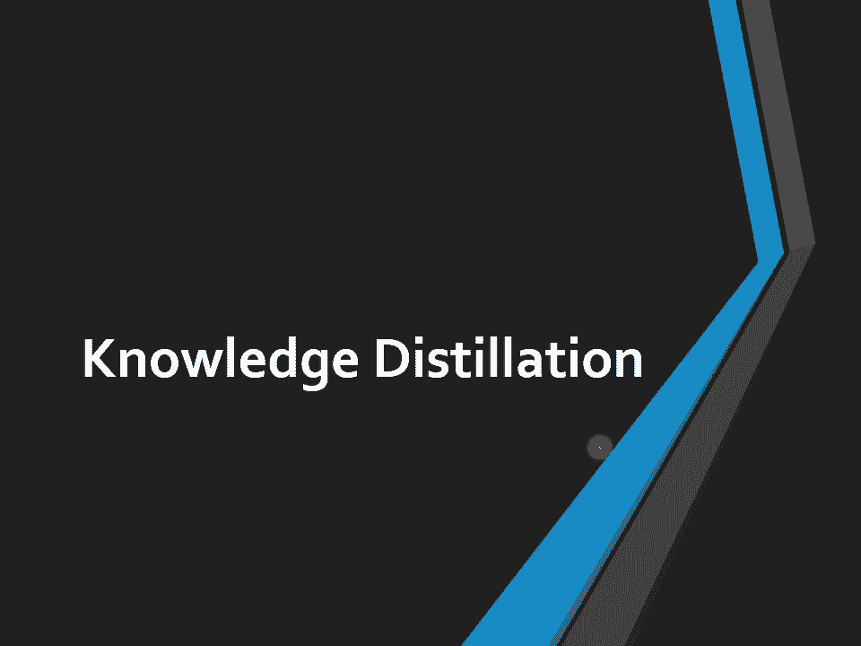
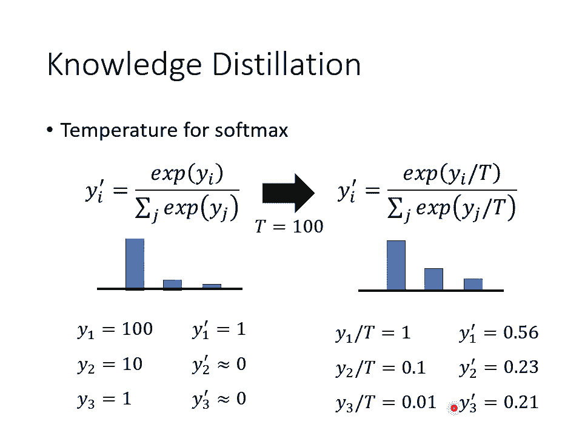
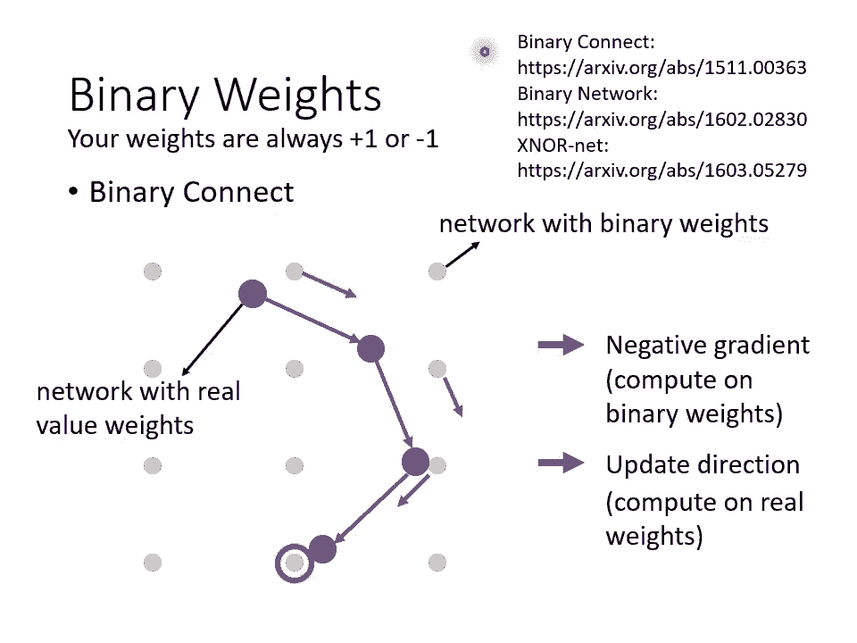
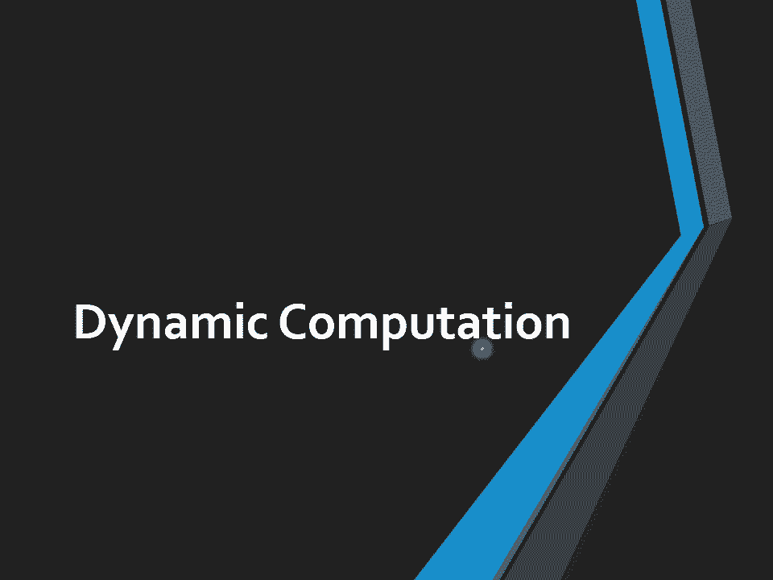
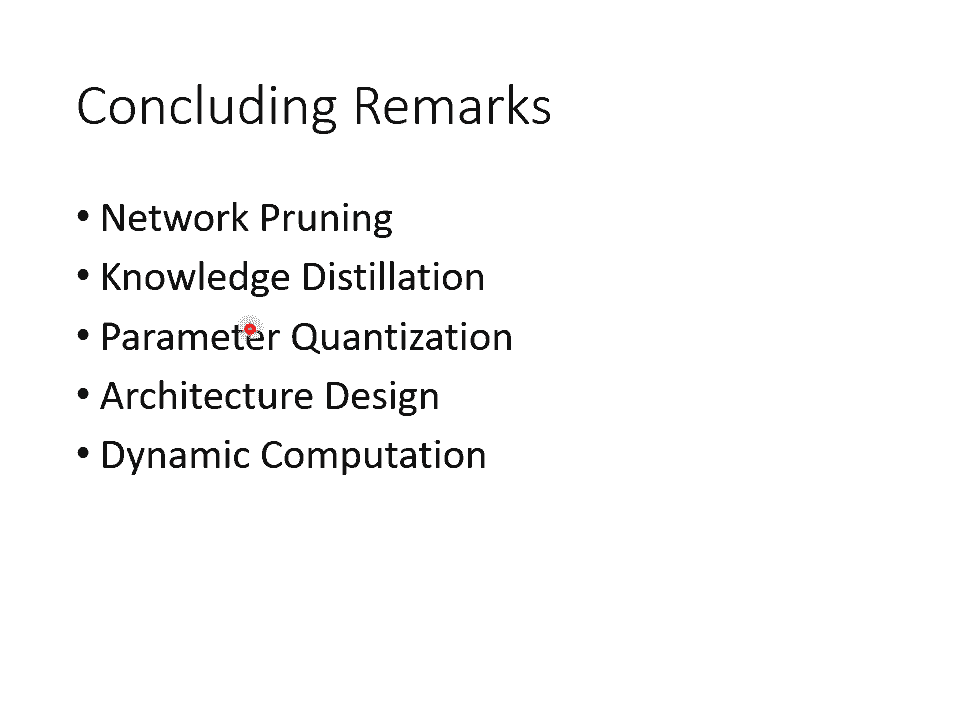

# P37：L21.2- 神经网络压缩2：从各种不同的面向来压缩神经网络 - ShowMeAI - BV1fM4y137M4

好，那我们来上课吧。那上周啊我们讲到nval planning。那接下来呢我们讲下一个可以让nval变小的方法。这个方法呢叫做knowledge destination。

那等一下你听完knowledge destination会发现它的精神呢跟nval planning其实也有一些类似的地方。

好，那knowledge是什么呢？它的概念是这样，我们先 train一个大的naval而这个大的naval啊在knowledge destination里面叫做teacherval，它是老师。

那你要train的你真正想要的那个小的val叫做student。你先 train一个大的naval叫做teacher，再根据这个大的naval来制造student。

那在nval print里面你是直接把那个大的naval啊做一些修剪，把大的naval里面其中一些参数拿掉，就把它变成小的naval。

那在knowledge destination里面呢是不一样的这个小的naval这个sdent是去根据这个teacher来学习。因为student是根据teacher来学习。

所以一个就叫做teacher，一个就叫做student。好，那这个student是怎么根据这个teacher来学习的呢？这个学习的方法是这个样子的。啊，假设我们现在要做的就是手写数字辨识啊。

那你就把你的训练资料都丢到teacher里面。然后teacher呢就产生outen。那因为今天是一个分类的问题，所以teacher的输出呢其实是一个distribution其实一个分布啊。举例来说。

teacher的输出可能是看到这张图片，一的分数啊是0。7啊，7的分数是0。29这个数字的分数是0。1等等。好，那接下来学生要做的事情就是给学生一模一样的图片。

但是学生呢不是去看这个图片的正确答案来学习，他把老师的输出就当做正确答案，也就是老师输出一要0。77要0。2，9要0。1。那学生的输出呢也就要尽量去逼近老师的输出，尽量去逼近一是0。7，7是0。2。

9是0。1这样的答案。那你可能会问说，那如果老师犯错了怎么办呢？如果老师的答案是错的怎么办呢？不要管他学生就是根据老师的答案学，就然老师的答案是错的，学生就去学一个错的东西。好，那讲到这边，你就会想说。

那为什么不直接称一个小的内窝就好了呢？为什么不直接把小的内沃？😡，去根据正确答案学习，我要多加一个步骤。

先让大的naval学再用小的naval去跟大的naval学习呢那这边的理由跟naval planning是一样的。就记得上周我们讲nval的时候。

我们讲说为什么不直接训练个小val呢最直觉最直觉最简单的答案就是因为你直接一个小的val往往结果就是没有从大的run来的好那knowge概念是一样的呃，为什么不直接劝小的naval。

因为直接训练一个小的val没有小的val根大的naval来学习，结果要来的好那其实nledge这个技术啊。

它也不是新的技术nledge最知名的一篇文章是inton在15年的时候就已经发表了很多人会得nge算是inton提出来的啊。

因为ton有一篇文章它的tle呢就是knowledge of neural network但是其实。提出norge destination这个概念之前呢，我其实就有看过其他文章使用了一模一样的概念。

举例来说，在一篇文章叫做呃它的title很 fancy啊，title叫做do deep never really need to be deep是一篇13年的文章里面。

他也提出了nval destination的想法。啊，那这个显然是一个比较早年的文章啊，在13年的时候，那个时候还不是所有人都已经被说服说deep learning就是很棒的啊。

所以那个时候呢你还需要写一些文章做一些研究，来 justify说哎，deep learning是好的哦。所以这篇文章它的标题就是deep network到底需不需要是deep到底deep的好处在哪里？

而那为什么nurge solution会有帮助呢？啊一个比较直觉的解释是说，teacher network其实会提供这个student network额外的资询。

那如果你直接跟student network说这个是一可能太难了。因为一可能跟其他的数字比如一跟七也有点像一跟9也长得有点像。所以对student network来说，你告诉他说看到这张图片你要输出一。

然后七啊九啊，他们的分数都是0，可能很难，他可能学不起来。所以让他直接去跟老师学，老师会告诉他说呃，就算一呢你没有办法让他是一分也没有关系，其实一跟七是有点像的，老师都分不出一跟7的差别。老师说一是0。

77是0。2，学生只要学到一是0。77是0。2就够了。那这样反而可以让小的new学的比呃直接全 from scratch，直接根据呃正确的答案要学来的要好。

那其nge the selection有些神奇的地方，如果你看那个 hintinton的 paperper里面啊。他甚至可以做到，光是teacher告诉student哪些数字之间有什么样的关系。

这件事情就可以让student在完全没有看到某些数字的训练资料下，他就可以把那个数字学会哦，假设今天训练资料里面完全没有七这个数字。但是teacher他在学的时候有看过七这个数字。

但是student从来没有看过七这个数字。但光是凭着teacher告诉student说一跟七有点像七跟九有点像这样子的资讯都有机会让student可以学到七长什么样子，就让他在训练的时候。

从来没有看过七的训练资料哦，这个是knowledge destination的基本概念。好那这个teacher network啊不一定要是单一一个巨大的na。

它甚至可以是多个na的unembleasseemble是什么呢？到目前为止，这门课啊，我们其实没有正式介绍过asseemble这个词汇。

虽然它是dep learning里面常尤其在机器学习的比赛里面常常用到的一个技巧。不过这个技巧非常的简单，所以其实也不太需要真的花太多时间介绍它的概念很简单，就是你就训练多个模型。

然后你输出的结果就是多个模型投票的结结果就结束了，或者是把多个模型的输出平均起来的结果，当做是最终的答案。那这个就是asseemble。那虽然在比赛里面呢，常常会使用到asseemble的方法。

今天如果在一个机器学习比赛里面，你要名列前茅，往往凭借的就是超级的asseemble啊，就是训练个。100个模型啊，1000个模型呢，把那么多的模型的结果通通平均起来。

往往你要在机器学习的这种leaderable上面名列前茅，靠的就是这种asseemble的技术。但是在实用上啊，asseemble会遇到的问题就是你训练了1000个模型进来一笔资料。

你要1000个模型都跑过再其他的平均，这个计算量也未免太大了吧。打比赛还勉强可以要用在实际的系统上显然是不行的那怎么办呢？

你可以把多个asseemble起来的n综合起来变成一个那这个就要用knowledge de的做法，你就把多个valasseemble起来的结果当做是teacher never的输出。

然后让student never去学这个asseemble的结果，就asseemble的输出是什么样子，就让student never去学这个asseemble的输出。

那这样子你就可以让student never去逼近这个emble一堆 enemble起来有。呃，这个正确率啊，那这个呢是knowledge destination在asseemble上的应用。

那在使用n的时候，有一个小技巧了，这个小技巧是你会稍微改一下sphm的 function。你会在sofphm的 function上面加一个temperature，这个temperature是什么呢？

我们马上就会看到好那跟大家简单的复习一下sof max。那我们呢在开学期初的时候再讲这个分类的时候就跟大家介绍过sofphm softm要做的事情就是你把呃每每一个 new的输出呃都取exponential。

然后再做normalize得到最终na的输出。那这样可以让你nal的输出变成一个几率的分布nal的输出，最终的输出和值都是介于0到1之间的。好。

那所谓的temperature的意思就是在做exponent之前呢，把每一个数值呢都除上一个大T。那这个大T呢是一个hyperparmeter，大T呢是一个你需要调的参数。那除这个大T有什么作用呢？

假设T大于一的话，那这个大T也就是temperature，它的作用就是把本来比较sharp比较集中的分布让它变得比较平滑一点。那为什么要让集中的分布变得比较平滑一点呢？我们这边举一个例子。

假设你的Y oneY twoY3在做sph make之前，它的值分别是110跟1。那做完sm以后，你会发现啊Y one就是som的结果，Y one pi是1Y two pi y3都趋近于0。

那假设这是你的输出，这个是你的teach的输出。你叫你的学生要叫你的dent去跟这个结果学。那跟直接按正确的答案学完全没有不同啊，跟teach学的一个好处，就是老师会告诉你说哪些类别其实是比较像的。

让student内在学的时候不会那么辛苦。但是假设老师的输出非常的集中，就是其中某一个class是一，其他都是零。那这样子跟正确答案学有什么不同呢？就没有不同了。所以你要取一个temperature。

假设我们这边temperature设为100，那就是把Y one y to y3都除100就变成10。1跟0。01。那对于老师来说啊，其实加上这个temperature分类的结果是不会变的。

做完sm以后，最高分的还是最高分。最低分的还是最低分，所有class的呃这个排序是不会变的，分类的结果是完全不会变的。但好处是每一个类别得到的分数啊会比较平滑比较平均。

那你拿这个结果去给student学才有意义，才能够把student呢学的好。那这个是knowledge selection的一个小技巧。

好。😊，好，那我们来看一下有没有同学有问题要问的那我刚才发现说呢，我犯了一个错误是什么呢？就是我忘了把我忘了在手机上把大家的那个留言打开了。所以呢我现在赶快请容我打开一下啊，我看一下啊。

哎呦我他的声音刚要放出来。好，来，我看一下。有没同学有。问题要问的。哎，讲到那个教育刚才在聊天室里面呢，我们有提到教育部的那个那个测验嘛。那哎我突然想到说。

假设你觉得说这个台湾的机器学习课程应该要有更多的运算资源，这样大家才能够做作业更顺利的话。哎，你去跟教育部讲，你去跟教育部讲。好。😊，那个。有同学问说，助教有说作业久什么时候公布吗？

应该下周就可以公布了。刚才有呃其实我回答了这个问题。好，我看看了。好，有同学问说，那拿som钱的输出拿来券会发生什么事呢？哦，你完全可以拿sofm前的输出拿来券。

其实还会有人拿这个new word每一层都拿来券。你可以说哎我有一个大的teacher network它是第一层，它有12层，小的student network6层。

那我要让student network的第六层，像大的n的第12层stdent network的第三层像大的nval的第六层，可不可以呢？可以。那往往你做这种比较多的限制，其实可以得到更好的结果。

那这是一个常用的在n常用的小技巧。好，那有同学想问lifelong learning的问题，可以，你可以问lifelong learning问题。我看你的问题是什么？上周有提到用gen产生资料。

让模型学习，但这样模型然后再学一次旧的资料有达到lifelong learning的宗旨吗？我可以了解你的问题，你说lifelong learning就是呃不要去看到旧的资料啊。

那我现在再产生一些旧的资料加到训练资料里面，有没有违反lifelong learning的精神呢？这是一个呃见仁见智的问题了。那假设我们把lifelong learning定义成。

你不能去看真正的旧的资料。但是如果你的n我自己有办法去产生旧的资料，它并没有去真的把旧的资料存下来啊，那个旧的资料是它自己生出来的那呃呃至少今天在lifelong learning的commun。

在如果你要写lifelong learning的 paper的话，这样子方法是会。被接受是一个lifelong learning的方法了。因为你并没有真的用到旧的资料，旧的资料是被产生出来的。哦。

有一个同学问说，如果学生和老师差太多的话，可以加一个介于中介nal，让学生学那个naval吗？可以，就是可以。那这样子的技术啊，等一下在助教的录音里面，助教会跟大家提示有这么样的一个方法。

然同学问到说T太大的话，模型会不会改变很多，temperature太大的话会不会改变很多？会你想假设你temperature是个接近无穷大，那这样所有的class的分数就变得差不多了啊。

这样这样子student network也学不到东西了。所以T又是另外一个 hyperperparameter，它就跟learning rate一样。

这个是你在做noise destination的时候要调的参数。好，有同学问说，老师请问asseemble的 destination只有把log合在一起的方式吗？

我猜这位同学想要问的问题是说在做asseemble的时候，就我刚才在举例告诉你什么是asseemble的时候，我是举说啊，我们可以把很多的na呢呃呃它的输出平均起来，这就是一种asseemble。

那有没有其他asseemble的方式呢其实是有的。呃这个说起来就有点话长了。呃，我之后呃这个asseemble的这个这个这个这个技术啊，其实之前在在过去的录影其实也是有提过的那我之后可以把这个录影呢。

也贴在呃社团上让大家再来研究。那其实asseemble呢是有很多各式各样不同的变形的了。举例来说，你在做asseemble的时候刚。才讲的是在那个呃nwork的 output上面做平均。

但事实上还有其他做法，比如说你有看过有人直接在network参数上面做平均。那这个newwork参数上面做平均的方法，在这门课里面，你甚至已经有用过了。在这个translation那个作业里面。

其实助教的这个城市就是有就是已经有帮你做好asseemble，就是有把不同的参数做平均这样子的小技巧。那这一招呢在translation上面不知道为什么特别有用哦，所以在助教的城市里面有始做这个方法。

好，希望这子有回答到大家的问题。好，那如果大家没有问题的话，那我们就继续了。那剩下的这个有关。呃，那个naval comparison部分没有太多了，我们就赶快把它讲完，接下来就可以放一下助教的录音。

好，那接下来下一个要跟大家讲的小技巧啊，叫做parameter的 quantization。不过这一招呢在我们的作业是用不上的。哎，为什么在我们的作业是用不上的呢？

因为我们的作业啊对大家naever大小的限制，并不是看那个na word的本身的大小，而是看你用了几个参数了。所以你如果不是减少参数的量，单纯是用其他方法来压缩naval的话。

在这个作业里面其实是不会得到比较好的结果的，是不会比较有利的。

不还是跟大家介绍一下这 quantization的做法啊这个 quantization的做法是什么意思呢？它的意思它的意思是说我们能不能够只用比较少的空间来储存一个参数。举例来说。

你现在存一个参数的时候，你可能是用64个你可能是用32个真的有必要精度这么高呢吗？会不会用16个就够了，会不会用8个就做就够了，会不会甚至少的就够了。

 quantization最简单的做法就是本来如果你存的时候，举例来说你是16个at存一个数值现在改成6个个存一个数值，那你的储存空，你的小直接就砍了。而且你的form呢不会掉很多。

甚至有时候你把你的这个储存个参数的精度低结果还会稍更好一点。好，那还有一个在更进一步压缩你的参数的方法呢，叫做we clusterweclass的意思是什么呢？我们直接举例来跟大家说明。

假设这些是你的na的参数然后呢你就做cster，你就做分群。按照这个参数的数值来分群数值接近的放在一群，那要分几群呢，你会先事先设定好。举例来说，我们这边事先设定好说我们要分四群。

那也就会发现说比较相近的数字就被当做是一群。那接下来每一群呢，我们都只拿一个数值来表示它，也就只要分到黄色这一群的，原来它的数值是多少，我们不管我们就说它都是-0。4，反正其他人可能其他参数也都跟-0。

4的结果可能都差不多了。啊，这个-0。4呢，可能就是这里面所有数值的平均啊，假设这里面所有数字的平均是-0。4，我们就-0。是来代表所有黄色的参数，用0。4来代表说我蓝色的参数，用2。

9来代表分到绿色这群的参数，用-4。2来代表分到红色这群的参数。这样做有什么好处呢？这样做的好处是你今天在除存你的参数的时候，你就只要记两个东西，一个是一个表格，这个表格是记录说每一群代表的数值是多少。

那另外一个呢，你要记录的就是每一个参数它属于哪一群。那假设你群的数目设少一点。比如说你设四群而已。那这样子你要存一个参数的时候，你就只要两个bet就可以存一个参数了，你就可以把本来你存一个参数。

你可能要16个be，8个beat再进一步压缩到存一个参数，只需要两个beat就好。哦，那你其实还可以把参数再更进一步做压缩。那假设你对通讯比较熟悉的话。

那你可能学过一个东西叫做hofman encoding啊homan encoding的概念就是比较常出现的东西就用比较少的be来描述它比较罕见的东西。

再用比较多的beat来描述它这样好处就是常出现的东西，用少的be来描述罕见东西多的beat的来描述这样平均起来，你需要储存你的资料，需要的bet的数目就变少了啊，所以这个就是homan encod。好。

所以你可以用这些技巧呢来压缩你的参数，让你储存每一个参数的时候，需要的空间呢是比较小的。好，那到底可以压缩到什么程度呢？最终极的结果就是你可以只拿一个be来存每一个参数。

你可以说你的naval里面的weight，要么就是正一，要么就是负一，只有这两种可能，没有其他的了。假设你可以做到说你所有的weight就只有正负一两种可能。

那你每一个weight就只需要一个bit就可以存下来的那像这样子的这种binary weight的研究啊，其实还蛮多的那我这边就是列了一些reference给大家参考。

那至于实际上要怎么训练出这种binary的na那这个细节我们就不讲。那一般人会对binary有的印象就是哇这个一个一个参数值要么是正一，要么是负一，会不会这个nal的 performance很差？

nave应该很惨吧，他应该做的很烂吧。这到未必这边呢就是取那个binary里面的其中一个经典的方法叫做binary connect它的结果来跟大家分享一下。

那 binaryary connect这篇 paper因为他跟你说他把binary connect这个技术用在三个影像辨识的问题上啊。

从最简单的还有稍微难一点的pher ten它是几个那他发现什么这个第一排是正常的naval不是 binaryary的naval一般的naval在上你的错误率是1。3这边是错误率了。

最值越小越好在pher ten上是10他发现用 binaryary connect也就是每一个参数要么是正一要么是负一结果居然是比较好的，所以你用 binary。

居然还比正常的naval的 performanceform好一点。那这边的理由可能是说，当我们用 binaryary network的时候，我们给了naval比较大的限制。

我们给nval capacity比较大的限制，所以它比较不容易overfi。所以用binary的 weight，它反而可以达到防止overfiing的效果。好。

所以这边是想要跟大家分享一下binary的呃呃厉害的地方。好，那我们看一下大家有没有问题要问。哦，我看一下呃。好，有同学问到说，关于上周lifelong learning讲到EWC的方法。

在劝每个新的tsask之前，为了算每个parameter的重要性，都会用之前的data去算 gradientient。这样是不是算根？GEN一样。存有部分之前的data呢哦，这边是不一样的。

因为那个g点呢，它不是看到新的任务才算的那个grad点就是我们要算parameter的重要性这件事情，在一个任务训练完之后，你就会马上计算了。所以你并不是等要做解新的任务的时候。

才去旧的任务的data上去计算说每个参数的重要性是旧的任务一训练完，马上就把参数性记录下来，把参数的重要性记录下来，那把参数的重要性记录下来以后，旧的任务的所有的资料就都可以被丢掉了。

所以它跟GN还是不太一样的。不过我上周我提示说，你如果是用EWC这种方法，其实你也用有用到额外的储存空间了。所以呃虽然它没有存资料，但是它需要储存参数的重要性。那这个也是会耗用一些储存的空间的。

这边要从消息理论那边讲吧哦，我猜你是指hofman codeing。好啊，也可以从消息理论那边讲资料压缩啊等等。你知道这个就是就是因为这个微 quanttization这一系列的方法。

跟这个课程的主轴比较没有关系了。所以在作业里面也我们就没有特别强调微onization这件这件事情。我只想要跟大家讲说，反正有这些技术就是了。好，有同学问说，we class要怎么做update。

每次update都要重新分群吗？其实we classroom有一个很简单的做法，你可能以为那个we classrooming是需要在训练的时候就考虑的。但是有一个简单的做法是你先把训练完。

再直接做we class。但你这样直接做可能会导致你的这个呃呃就是class后的参数跟原来的参数相差太大。所以有一个做法是什么呢？有一个做法是我们在训练的时候啊，要求内val的参数彼此之间比较接近。

你可以把这个训练的iterion当做是呃lo的其中一个环节，直接塞到你的群群训训练的过程中，让训练的过程中达到呢这个参数呢有群聚的效果。那这件事情是可以做到的。好。

有同学问说要压到什么程度才不会丢掉太多的资讯。那这个你就要自己算算看啦。那你就要呃呃到底要压到什么程度。那就你做压缩的时候，难免就是会掉一些资讯嘛，但到底掉多少资讯你能够接受，那这个就要看你的应用了。

好，那个we clustering里面，每个classer的数字要怎么决定呢？决定好每个classer区间之后取他们的平均吗？对，就是决定好每个classer的区间之后，取他们的平均。好有同学问说哦。

Binary weight加。dfer会比较好吗？不好意思，我我不太确定你这deer是指指什么。好，刚刚有一个同学问说，关于刚刚EWC的问题。

想请问老师那样不同的task data对model的重要性会不会冲突？怎么把不同task的importance merge？这边这个解法怎么把不同task的importance merge啊。

在文件上的做法比你想象的要简单，就是每一个task都会计算出一个重要性，然后把所有task的重要性加起来。就结束了啊，就是每一个参数在每一个task训练完以后，都会得到一个首位的值，都会得到个B。

把每一个任务的B通通加起来就结束了。好，希望酱友回答到。哦哦待er是加入nice，反而可以保留更多的资讯。好，我没有看过有人研究过dier加binary weight这个问题。

那呃所以这边我没有很好的答案，这听起来像是一个蛮有创意的方法。如果你有试出什么结果，再告诉我好了。好，那希望回答到大家的问题，那我们就继续喽。好，接下来啊要跟大家讲的是neve架构的设计。

透过neval架构的设计来达到减少参数量的效果。那等一下要跟大家介绍的叫做deswise separable的 convolution。那这个会是这次作业的阻力啦。你要过撞 baseline line。

就靠这个方法了。

好，那是这个方法啊呃在讲这个方法之前，我们先帮大家很快的秒复习一下CNN。那我们在开学习初的时候啊，已经跟大家讲过CNN那我们说CNN是什么呢？在CNN的这种convolution layer里面呢。

你每一个 layer的 input是一个feature map。那在这个例子里面呢，我们的feature map有两个chan如果你的feature map有两个channel。

那你的每一个这个filter啊，它的高度啊也得是2这个filter并不是一个长方形而是一个立方体，你的channel有多少，你的filter就得有多厚。好。

然后你再把这个filter呢扫过这个feature map你就会得到另外一个mat，另外一个正方形啊。

你有几个filteroutput featureature map就有几个channel这边有4个filter，每个filter都是立方体哦。那output的feature map就有4个。chan好。

那在这个例子里面总共有多少参数呢？我们总共有4个filter，每个filter的参数量是3乘以3乘以2，要注意一下，每个filter其实立方体，所以总共的参数量是3乘以3乘以2乘以4，总共72个参数。

好，那等一下跟大家介绍的方法叫做de why separable的 convolution。那这个de's why separ convolution它为什么会好呢？这个等一下再跟大家讲它的原理。

在讲它的原理之前，我们先直接讲它的操作。好这个dewise separ convolution它分成两个步骤。一个步骤呢叫做dewise convolution。

wisewise convolution做的是什么呢？它要做的事情是有几个chan，我们就有几个filter，而每一个filter只管一个channel。因为每一个filter只管一个chan。

所以有几个filter，有几个channel就有几个filter，举例来说，假设input future map是两个chan。那在dewise convolutional layer里面。

我们就只放两个filter。你像之前在一般的convolution layer里面，filter的数目跟channel数目是没有关系的。在前一个影片例子里面，channel只有两个。

但filter可有4个。但在des convolution里面几个chan几个filter，然后每个filter就只负责一个chan而已。

那其实我发我觉得啊这个des convol比较像是大家一般对CNN的。这个误解了，就假设有人对convolution不太熟悉的话。

一般都会误以为convolution的算法就跟dewise convolution是一样的。但，其实不是你已经学过这门课了，已经花很多时间跟大家介绍过CNN了。所以你已经知道说CNN不是这样算的。

但是CNN里面一个特别的变形，减少参数量的变形，其实跟大家一般对CNN的误解蛮像的，就是每一个filter是去管一个channel就好那一个filter怎么管一个channel呢？

假设这个浅蓝色的filter管第一个channel那就浅蓝色的filter在第一个channel上面划过去划过去划过去。然后就算出一个feature man。好。

然后呢深蓝色的这个filter管第二个channel，那它就在第二个channel上面做convolution，然后也得到另外一个feature man。所以在deswise convol里面。

你 inputput有几个 channel，你 outputput channel的数目会是一模一样的啊，这个跟一般的convolutional layer不一样。

一般convolution layer里面， inputput跟 outputput channel数目可以不一样。

但在deswise convol里面input跟 outputput channel数目是一模一样的。好，但是你会发现，如果你只做deswise convolution，它会遇到一个问题。

这个问题是channel和channel之间没有任何的互动。假设今天有某一个patter是跨chan才能够看得出来的那wisevol对这种跨chan的pa是无能为力的。所以怎么办呢？

在多加一个pointwise的 convolutionpointwise pointwise convolution的意思是说呢？我们现在一样有一堆filter。

这个跟一般的convolution layer是一样的。但我们这边做一个限制是我们的filter的大小，它的的 sizeize通通都是1乘以1在一般的convolution layer里面。

你的filter大小可能开2乘以23乘以34乘以4，但是在pointwise convolution里面。

我们限制大小一定是1乘以1那这个1乘以1的ter它的目标它的作用就是去考虑不同chan之间的关系。所以第一个这个。一的filter他做的事情就是去扫过这个呃FY con出来的feature map。

然后呢得到另外一个feature map。好那这边有另外三个filter，他们做的事情也是一样，每一个filter会产生一个feature map。

所以point wise point wise convol跟一般的convolutional layer是一是类一样的地方是输入跟输出的channel数目可以不一样。

但是point pointwisevol有一个非常大的限制，是我们强制要求说filter的大小只准是一乘以1。你只要考虑channel之间的关系就好了。你就不要考虑同一个channel内部的关系了。

同个channel内部关系已及dewise convol做完了，所以pointwise convol只专注于考虑channel和channel间的关系就好。好，那我们先来计算一下这个方法的参数量。

你看在deswise convol里面，两个filter，每个filter大小是3乘以3，所以就3乘以3乘以2，总共是8个参数。那在pointwise convol里面，4个filter。

每个filter的大小是2，每个filter只用了两个参数，所以总共是8个参数。好，左边这个图啊，这个是一般的convolution。

右边这个图是desswise加pointwise convolution。那我们现在来比较一下这两者参数量的差异。我们现在假设我们先预设好说input channel数目就是挨个chan。

output channel数目就是K个chan。然后呢呃这一个case跟这一个case，这边的 kernelnal size都是K乘以K。好，那如果是一般的convolution。

你要有K乘以K的 kernel size input挨个 channel，oppo o channel，那你到底会需要多少参数呢？那你能先算一下每一个filter的大小。

每一个filter大小应该是K乘以K kernel size乘上input channel的数目，也就是K乘以K乘以I。如果你要open over个 channel大 over个 channel。

那也需要大O个filter，所以总参数量是K乘以K乘以I一个这个filter的参数量再乘以大O。如果是deswise加pointwise convolution要达到 inputput挨个 channel。

oppo over channel，那要怎么做呢？deswise convolution。它的这个呃filter啊，它的filter是没有那个厚度的，它的filter是没有厚度的。

所以你会发现说that'swise的 convol所有的filter加起来，它的参数量只有K乘以K乘以I而已跟。一般的convolution里面的一个filter的参数量是一样的。

然后我们看point wise convol这边呢是呃I乘以O，就是假设你input channel的数目是I的话，那每一个一乘以一的convolution，它的高度呢会是I。那O是哪来的呢？

假设你要个的话，那也就要有大个一乘以一的volution。所以今天wise convolution它的总参数量是I乘以O。那你把这两者呢进行比较哦。

你把K乘以K乘以I加上I乘以O去除掉K乘以K乘以I乘以O，你把这两者相除，经过一番计算，你会发现这两者的比例是一除以O加一除以K加K。那为O通常是一个很大的值啊，你的channel数可开个256啊。

512啊，所以我们先把这个一除以O忽略不计。那K乘以K通常是比较在这一整项里面，它可能是比较关键的数值，这一整项的大小可能跟一除以K乘以K是比较有关系的那假设你的今用的。可能是3乘以3或者是2乘以2。

假设你选2乘以2，你把一般的convolution换成dewise加pointwise的组合的话，那na大小就变成2乘以2分之1。假设你的 kernel size是3乘以3。

当你从convolution变成deswise加 pointwise的时候，你的na大小就变成原来的9分之1了。好，那接下来想要跟大家解释的是，为什么这招有用呢？这一招的原理是哪来的呢？

那这个啊呃这个dewise加 pointwise这个招数啊，它其实是其来有之。在过去还没有这个呃desdewise separable的这个convolution之前呢。

就已经有一个方法是用low rank approximation来减少。一层lay word的参数量，但你不知道什么是low rank approximation没有关系。

这边就直接告诉你这个是怎么操作的。好，假设呢你有某一个layer，那这个layer呢输入有N个 neural输出有大N neural。那假设N或者是N其中一者非常大。

这边假设是N呢非常大那你的这个参数量啊就会非常的可观哦，这边的参数量W呢仅假设你的input是N个 neuralpo是 n neural，那你的参数量是多少呢？这两层之间的参数量是多少呢？

是N乘以N对不对？那只要N跟N其中一则很大，那你这个W的参数呢就很多了。好，那怎么减少这个参数量呢？有一个非常简单的方法是在N跟N中间呢，再插一层，这一层呢就不用activation function。

直接多插一层。这一层呢的newon的数目呢是大K，有本来只有一层，现在拆成两层。那这两层里面的第一层呢，我们用V来表示。第二层呢我们用大U来表示，你可能会想说这个把一层nave拆成两层n这个。哎呀。

参数量不是变多了吗？你仔细算算看这个两层的naval参数量反而是比较少的哦。怎么说呢？你看原来一层na，你的参数量是大N乘以N。现在我们拆成两层呢，我第一层是多少，第一层是大N乘以K，对不对？

大N乘以K，第二层是多少？第二层是大K乘以N大K乘以N。如果你今天的K呢远小于N跟N，那你就会发现说U跟V的参数量加起来是比大W还要少的多的。大W是N乘以N嘛。

那U跟V的参数量加起来是K乘上N加N就N跟N就没有相乘了。那你只道K够小，那整体而言，U加V的参数量就会变少哦，所以你常常之前过去常有的做法就是哦N1000N1000。没关系，我K塞个20塞个50，哎。

那这参数量呢就减少蛮多的了。好，那像这样子的方法算可以减少参数量。当然它还是会有一些限制了什么样的限制。因为你会发现说当你把W拆解成U乘上V的时候，当你把W分成用U跟V两层来分开表示的时候。

你会减少W的可能性。本来W它可以放任何的参数。但假设把W拆成U跟V的话，那这个W这个矩阵啊，它的rank会小于等于K。那你不知道rank是什么，也没有关系了。反正就是W会有一些限制了。

所以变成说它不是所有的W都可以变成用在呃不不是所有的W都可以变成当做你的参数，你的参数会变成有一些限制了。好。哦，那这个方法呢就是拿来减少参数的一个非常常用的做法。

那其实刚才讲的dswise加point wise的 convolution，其实它用的就是我们这边的概念，就是把一层拆成两层这样的概念。好，怎么说呢？我们先来看一下原来的convolution。

在原来的convolution里面，红色的这个矩阵左上角的这个参数是怎么来的？是不是有一个红色的这个filter放在feature input featureature map的左上角以后所得到的。

那今天一个一在这个例子里面，一个filter，一个filter的参数量是多少？一个filter的参数量是3乘以3乘以2，也就是18。

你把filter里面的18个参数跟input feature map左上角的这18个数值做in以后啊就会得到这边output feature map左上角这个值，所以你的每个filter有18个参数。

如果今天拆成deswise加pointwise两阶的话，那会怎么样呢？如果拆成deswise跟 pointwise两接的话。

左上角output feature map左上角这个数值来自于中间的deswise convolution的 output啊。

所以左上角这个值来自于中间这一个deswise convolution output的左上角的这两个值。

而这两个值来自于input的 future map第一个channel左上角这这9个值跟第二个channel左上角跟9个这9个值。哦，所以怎么从这边变到这边呢？你可以看成是我们有两个filter。

这两个filter呢，它分别是9个input，然后得到输出。然后接下来呢这两个filter的输出，再把它综合起来得到最终的输出。所以本来是直接从这18个数值变成一个数值。

现在是分两阶18个数值变两个数值再变一个数值。或者是如果我们今天看黄色的这个feature map左下角这个参数，黄色的feature map左下角这个数值来自于哪里呢？

来自于deswise convolution的 output左下角这两个数值。而左下角这两个数值来自于这个filter左下这来自于这个deswise来自于 inputput的这个呃呃feature map左下角的这18个数值。

所以其实今天你又可以在看成说呢是我们我们把这个当我们把这个一般的convolution拆成这个呃deswise加pointwise的时候，我们就可以看成是把一层的nal拆解成两层的nal。

所以它的原理跟刚才在前页头影片看到的no rank的 approximation是一样的。我们把一层拆成两层这个时候才对于参数的需求反而是减少了。好。

那这个是有关naval architecture的设计。那其实有关naval architecture的设计啊，还有非常多论文可以参考了。那这些文献其实也都放在助教的投影片里面。

那等下助教不会细讲这些naval的架构了。但是在这个作业里面，如果你可以成功实做出刚才讲讲的这个呃呃这个desswise加pointwise的相叠的话，把一层CNN拆成两层CNN的话。

那也就很有机会可以过strong baseline啊。好。我来看看看看同学们有没有问题。好，那如果同学没有问题的话呢，那我们就继续吧。

好，最后一个要跟大家分享的是dynamic的comp。那dynamicna computation要做的事情跟前几个方法想要达成的目标不太一样。在前几个方法里面想要做的事情，就是单纯的把变小。

那在dynamic computation里面要做的事情是什么呢？在dynamic computation里面要做的事情是我们希望never呢可以自由的调整它需要的运算量。

为什么我们期待never可以自由的调整它需要的运算量呢？因为有时候啊你可能同样的模型会想要跑在不同的div上面。而不同的divide上面，它有的运算资源是不太一样的。

所以你期待说你训练好一个newwork以后，你放到新的divide上面，你不需要再重这个l。因为这个你你训练一个神奇的模型，这个神奇的模型本来就可以自由调整它所需要的运算资源，所以运算资源少的时。

后他就只需要少的运算资源就可以运算。运算资源大的时候，他就可以充分利用充足的运算资源来进行运算。好，那另外一个可能是就算是在同个device上面，你也会需要不同的computation。比如说你有。

你比举例来说，假设你的手机非常有电的时候，那你可能就会以有比较多的运算资源。假设你的手机没有电的时候，那你可能就需要把运算资源留着做其他的事情。那na我可能可以分到的运算资源就比较少。

所以就算是在同的divy上面，我们也希望一个nawork可以根据现有的运算资源。比如说手机现在的电量还有多少来自由的调整它对运算量的需求。好，那有人可能会问说。

为什么我们不直接准备一大堆的nave就好了呢？假设我们今天需要各种应付各种不同运算资源的情况，我们为什么不训练10个nave从运算量最少的到运算量最大的，然后根据我们的运算的状况去选择不同的nava呢？

可是你知道假设今天呃呃呃假设你是在同一台手机上，你需要根据不同的状况做不同的音译，那你可能就需要训练一大堆的naval，而手机上的储存空间有限呢？那你今天我们就是要减少我们的运算量。

但是如果你需要训练一大堆的nave，那你需要一大堆的储存空间。那这个可能不是我们要的。所以我们其实期待可以做到说一个nal，它可以自由的调整它对运算资源的需求。好。

那怎么让naever自由的调整它对运算资源的需求呢？一个可能的方向是让naval自由的调整它的深度。怎么让nve自由调整它的深度呢？啊，你可以训练一般我们就是训练一个很深的naval啊。

然后呢它有input。比如说在做image classification的话，它就是输入一张图片，然后输出呢就是图片分类的结果。然后呢呃你可以在这个layer和layer中间呢。

再加上一个额外的layer。这个额外的layer它的工作呢是根据每一个he layer的out去决定现在分类的结果应该是什么？那这样子当你的运算资源比较充足的时候。

你可以让这张图片去跑过所有的layer得到最终的分类结果。当运算资源不充足的时候，你可以让lay我决定说它要在哪一个layer自行做输出。比如说运算资源比较不充足的时候。

通过第一个layer就直接丢到这个extra的 layerer one，然后呢就得到最终的结果了。那怎么训练这样一个naveval呢？那其实概念比你想象的还要简单。我们训练的时候都有label的资料。

那一般在训练的时候，我们只需要在意最后一层naveval它的outer是什么？我们希望它的outer跟光柱越接近越好。

但是我们今天呢也可以让光 truth呢跟每一个extra layer的 output越接近越好。那我们把所有的output跟光 truth的距离通通加起来。

把所有的output跟光 truth cross entropy通通加起来，得到大L，然后再去minise4个大L，然后就结束了。好，那这样子最基本的方法它能够运作的好吗？这个训练方法是可以用的。

你确实可以用我刚才讲的训练方法，就是每层接出来做训练，然后把所有接出来的结果去跟光tro算距离，然后minise所有接出来的结果跟光tro的距离，确实可以用这个方法达到 dynamic的深度。

但是其实它不是一个最好的方法。如果你想知道最好的方法是怎么做的。这个也不一定是现在最好的方法，但是假设想知道比较好的方法是怎么做的。也许你可以参考an sD net这篇文章。好。

另外啊还可以让naval自由的决定它的宽度哦，怎么让nave自由决定它的宽度呢？啊，你就是有设定好几个不同的宽度。然后呢，你今天同一张图片丢进去。在训练的时候，同一张图片丢进去。

那每一个nave呢每个不同宽度的nave呢会有不同的输出。我们在希望每一个输出都跟正确答案越接近越好就结束了，我们把所有的输出跟光tro的距离加起来，得到一个lo。

然后我们要去minise这个lo就结束了。那这边要跟大家强调一下，虽然在这个投影片上我画了三个na，但是这并不是三个不同的naval，它们是同的naval可以选择不同的宽度。

也就是说这个weight就是这个weight就是这个weight我标一样颜色的就是同一个，只是在最左边这个状况的时候，整个naval所有的 neural都会被用到。但是在中间这个状况的时候。

你可能会决定说有25的 neural不会用到。但你这个周会事哪些 neural不用到，你就事先决定好，就事先决定好说某一些 neural在你选择说只要用这个75的参数的时候。

拿25 neural我们不要用它我拿50per的 neural我们不要用它。然后在训练的时候，就把所有的状况一起考虑，然后所有的状况都得到一个out，所有的out都去跟光计算距离。

然后要要让所有的距离都越小越好就结束了。那你会发那但是实际上你会发现这样券也是有问题的，所以需要一些特别的想法来解决这个问题。

那有关deswise呃dynamicnas的宽度的naveval怎么训练这件事啊，大家可以参考slimable的 neuralnal。好，那刚才讲的是是我们可以圈一个naval。

我们可以自由去决定它的深度跟它的宽度。但是所谓的决定权还是在人这一边，你要自己去决定说啊今天电池电量少于多少的时候，我们就用多少层或者是多宽的nal，但是有没有办法让naval自行决定，根据它的环境。

根据我们的情境决定它的宽度或者是深度呢？这个也是有办法的。为什么我们需要naval自己去决定它的宽度跟深度呢？但是因为有时候就算是同样是影像分类的问题。那有一些影像可能特别难。有一些影像可能特别简单。

对那些比较简单的影像，也许你只要通过一层layerna我就已经可以知道答案了。对于一些比较难的问题。举例来说哦，同样是猫哦，这只猫呢是被做成一个墨西哥卷柄的样子了，所以这是一个。特别困难的问题。

也许这张图片只通过一个layer的时候，na沃会觉得它是一个卷笔。在通过第二个layer的时候，还是一个卷笔，要通过很多个layer的时候，nave才能够判断它是一只猫。如果是这种比较难的问题。

你就不应该在中间停下来。那我们能不能让na沃自己决定说这是一张简单的图片。所以通过第一层就停下来。这是一个比较困难的图片。所以要跑到最后一层才停下来呢？我们是可以这么做的那假设你想要知道怎么做的话。

可以参考以下几篇reference。好，所以像这样子的方法，其实就不一定限制在那个呃呃运算资源比较有限的状况了。有时候就算是你运算资源比较很充足，但是呃对一些简单的图片。

如果你可以用比较少的 layer就可以得到你要的结果。那其实也就够了，这样你就可以省下一些运算资源去做其他的事情，就好像说啊我可以了解说呢在这门课里面。

因为我们今天把这个呃呃做什么事情会得到几分都定的非常的明确。所以大家就会知道说啊你做了哪些事情，大概就可以拿到A加，然后所以后面的作业你拿到A加以后，可能后面的作业你就不想做了。好。

所以你就跟上面这个情况一样，做到中间呢，你就停下来得到A加以后，你就off你的结果就结束了。那这也是人之常情我也是可以接受的啦。

不像以前呢以前这个这学期呢这个成绩是这个原始成绩就直接定义定就直接对应到那个等地了。那过去其实有一阵子这个原始成绩是没有。直接定义到等地成绩是相对的啊，这个时候大家就会很痛苦啊。

有的同学就会哎他原始成绩拿到100多分哇，结果西减这样子。哎，以前如果是直接按照比例分配，就前4分之1的A加以此类推的话，那就有可能有点痛苦了。不过这学期我们就直接把原始成绩对应到等地。

让大家日子过得比较轻松一点。好，那以上呢就是跟大家介绍的5个技术。那前面四个技术啊都是让naor可以变小。那这四个技术呢，它们并不是互斥的。其实你今天要在做na word的压缩的时候。

你其实没有什么道理，只做一个技术，你可以即用navo的 architecture。也做knowledge destination，你还可以在做完knowledge destination以后。

再去做naval planning。你还可以在做完naval planning以后再去做parameter的 quantization。如果你今天真的想要把naval压缩到很小的话。

这些方法并不是互斥的，他们都是可以一起被使用的。好，那以上呢就是有关naval compression的介绍。那我们其实在这边呢nve到这边naval compression呢就讲到一个段落。

来看看大家有没有问题要问的。

