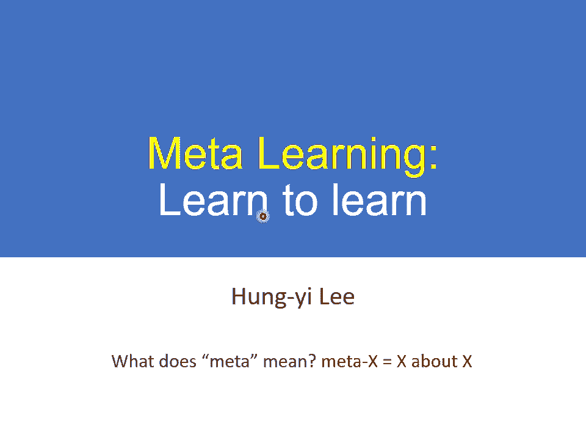
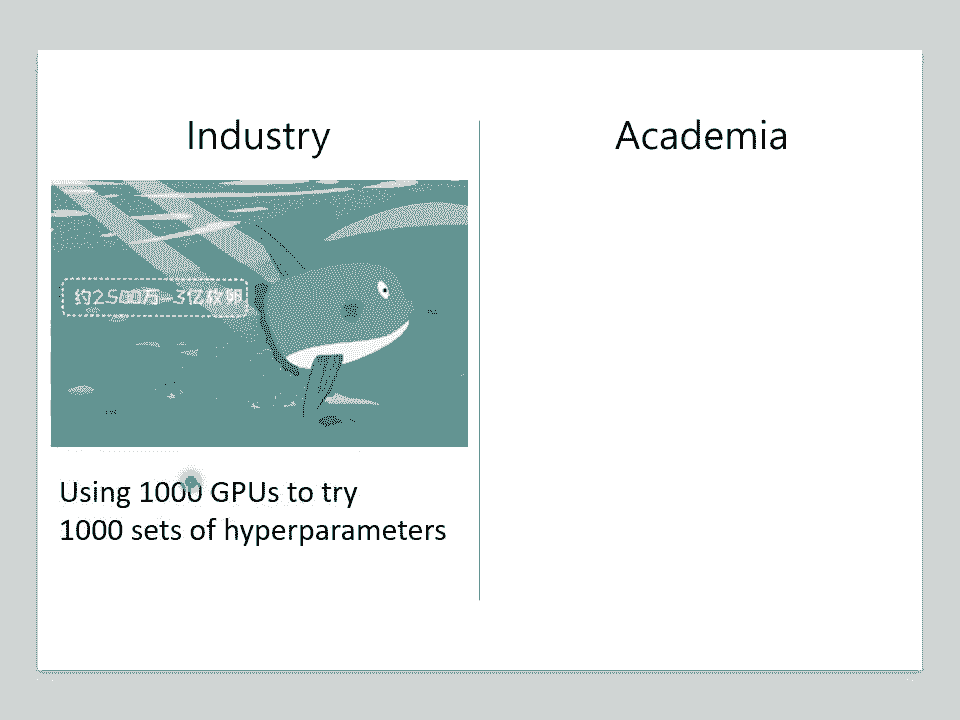
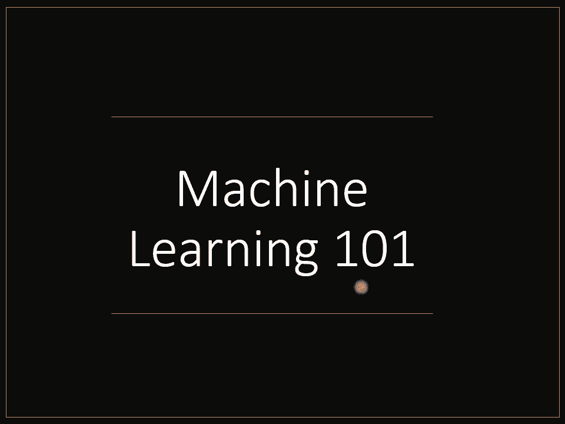
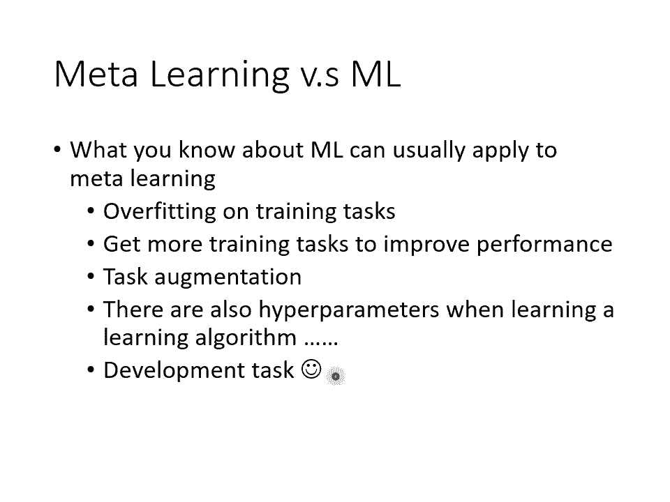

# P38：L22.1- 元学习1：元学习跟机器学习一样也是三个步骤 - ShowMeAI - BV1fM4y137M4

好，那这个现在要讲的啊是me learning。那这是这一门课最后一个主题了。那什么是meta learning呢？ metata这个词汇又是什么意思呢？meta这个词汇啊？如果你要翻成中文的话。

通常会翻译成元哪个元呢？就是一元复始那个元。好，那meta learning这个meta到底是什么意思呢？当你说一个东西是meta X的时候，代表说这个东西是X的X。

所以meta learning从它字面的意思来看，就是学习的学习。所以我这边说什么叫meta learning？ meta learning就是learn to learn。如果翻译成中文的话。

我觉得说me learning是学习如何学习。好，所以这个ma learning呢跟我们之前讲的machine learning已经是另外一个层次的东西了，拿来作为这一堂课的收尾。刚刚好。

就我们要迈向下一个领域。那为什么我们要学习如何学习呢？想想看你在这门课的作业都在做什么事情啊，也许你的朋友觉得你在做很潮的东西，这门课有很多很潮的作业，比如说呃动画人物的生成啊，比如说翻译啊。

比如说玩atari的游戏啊等等。好了你妈觉得你一直坐在电脑前面，那大众觉得这门课就是学些AI相关的很潮的东西。然后你的指导教授知道说machine learning背后有很多数学。

那你自己呢这个图的意思就是你觉得自己很强了啊，希望你觉得有有觉得自己很强。那事实上你在做的事情是什么呢？事实上你觉得调参数，对不对？你大部分的时候。

deep learning就是在调hyperparmeter，我其实不会否认这件事deep learning就是就是不能不调 hyperperparmeter。

那调hyperparameter真的是一件非常烦的事情，决定什么naval的架构啊，决定learning ray啊等等，真的是一件很烦的事情。那有什么好方法来调learning rate呢？

实际上没有什么好方法来调这些hyperparmeter。今天业界最长拿来解决调 hyperperparmeter high hyperperparmeter的方法呢，就是买很多张GPU了。哦。

对业界来说，他们劝model的时候，就像是这个翻车鱼一样，一次训练多个model。那有的劝不起来就丢掉，最后只看那些可以劝得起来的model，它会得到什么样的performance。所以在业界啊。

你做实验的时候，往往就是。你次开个1000张GPU啊，1000张GPU跑1000组不同的hyperparameter，看看哪一组 hyperperparameter可以给你最好的结果。好。

但是在学界呢在学界哇，你没有1000张GPU其实我这边说业界用1000张GPU这个都是低，这其实都是低估他们使用的GPU的量啊。然后这个flag那些大公司在采买GPU的时候，他们的单位都是用万来算的。

这次要买3万张GPU这种等级啊，所以这个呃业界今天在dip learning上的规模呢，真的是跟学界是不太一样啊，所以同学们去业界实习的时候。

很高兴一次可以用1000张GPU回来就突然不知道怎么做实验了啊，因为在学校每个人只有一张GPU那就好像说熊猫呢每次只升一台而已。

哦，所以那怎么办呢？通常这个时候你只能通顶啊祈祷说啊，凭着你的经验跟直觉定一组好的hyperparameter，祈祷这种 hyperperparameter可以给你好的结果。好。

但是有没有更好的方法来决定这些hyperparameter呢？今天既然我们说我们在做的是machine learning机器可以自动学出一个model，那hyperparmeter能不能用学的呢？

learning rate啊、 network架构啊这些东西能不能直接用 learn的，根据data去把它认出来呢，这就是meta learning其中一个可以帮助我们的事情。好。

那在讲mateta learning之前呢，我们再回头来复习一下machine learning。那为什么要再重头复习machine learning呢？你等下话。

你等一下会发现说mate learning最基本的想法跟machine learning最基本的想法其实并没有非常大的差异。

好，machine learning到底在做什么呢？我们这边要讲的东西跟我们第一堂课讲的是一模一样的，所以就首尾呼应。我们用me learningning做结，首尾呼应，回不过来复习。第一堂课的时候。

我们到底讲了些什么。第一堂课的时候，我告诉你说什么是machine learning。machine learning，就是找一个function。比如说你要做一个影像辨试的系统怎么办？

找一个function，输入是一张图片输出是影像辨试的结果。那我们说machine learning就是三个步骤，还记得吗？第一堂课就告诉你，machine learning就是三个步骤。

第一个步骤是什么？第一个步骤是第一个functionction，这个functionction里面有一些未知的参数。在deep learning这个领域里面。

所谓有未知参数的function其实就是一个network。而newwork里面的weight跟bias new的 weight跟 biasas就这些未知的参数，他们是准备要被学出来的。

那在这一门课里面呢，我们通常用seda来表示这些准备要被学出来的参数。那一个nameval呢在这堂课里面，我们常常把它写成F下标seda，代表说newval本身是一个function。

这个function里面有一些参数。这些参数，我们用seda来表示它。这是第一步。第二步是什么？第二步是我们要定一个los function。哦，这个los function是一个未知参数se达的方。

把se达带入los，我们就知道这个se达是好还是不好。怎么定这个los function呢？那你需要有一些训练资料。这些训练资料需要有label，那你把这些训练资料，假设是要做影像辨试的话。

就把这些图片丢到某一个 function里面，由se所 parameterize的那个 function里面，看看它会得到什么样的输出，再跟你的正确答案算一下距离。我们通常如果是分类问题。

就算cro entropy，把每一个exle的 cross entropy通通都加起来，就是我们的lo。那第三步呢第三步就是要找一个se塔，这个seda可以让los越小越好。所以我们会写一个这样的式子。

我们就是要找一个se塔，这个se塔可以让capital L越小越好。这个可以让los最小的se塔，我们用se塔 star来表示它。那要怎么解这一个问题呢？啊。

在这一堂课里面我们用的都是gradient de，找出seta star以后就结束了啊，你有一个se star，你就有一个F set star，那你就可以拿F set star来做你想要他做的事情。

你就可以拿F set star来做影像的分类。这个是机器学习，这个是我们在第一堂课就跟大家讲过的内容。好，接下来我们进入meta learning怎么学习如何学习？其实学习这件事。

它本身也是一个functionction。一个machine learning的 algorithm，你把它简化来看，其实它就是一个function。

这个function我们用大写的F来表示它这个 function的输入是什么？这个function的输入不是一张图片，而是一个data set。你把你的训练资料丢到这个function里面，它输出什么。

它输出训练完的结果。假设我们要训练的是一个classifier，那这个function就是吃训练资料作为输入输出就是classify，我们要拿来分类的那个classifier。

有了这个classifier以后，你就可以把测试资料丢进去，然后希望它输出来的结果是我们要的。好，所以一个learning的 algorithm，它是一个function，我们这边用大F来表示它。

而它的输入就是训练资料，它的输出是另外一个方向，它的输出是一个classify。但这个大F这个方程是怎么来的呢？它是handcrafted的，所谓handcrafted的意思就是它是人定的。

它是人想出来的。我们今天的这些lening algorithm deep learningning啊，然后gdientdescent啊等等，都是人想出来的。那我们能不能够直接学这个方向呢？

我们能不能够用machine learning的概念来学这个function呢？我们能不能够做到学习如何学习这件事怎么做呢？并没有那么异想天开。想想看在machine learning里面。

我们是怎么找一个function的。透过我们讲的三个步骤。在 metata learning里面，其实我们要找的也是一个function。

只是这个function跟machine learningning一般要找方不一样。我们要找的function是一个learning的 algorithmth。

但是我们也可以透过在machine learning里面学过的三个步骤来想办法把这个learning的alrith找出来，这个就是meta learning要做的事情。好。

我们在这边看一下有没有同学要问问题的。好，有同学说熊猫一生只生一胎，同熊猫只生一胎是啥？哦，我记得熊猫生那个它的后代的时候，它并没有像办法像翻车鱼一样，翻车鱼就是每次都会生好几亿个卵嘛。

然后只要有其中一只翻车鱼活下来就好了。那就我所知那个熊猫就是只生1到2胎，对不对？还好没有办法一次生产很多的后代，哎，就是这样。好。好，那我们刚才说machine learning透过三个步骤来找方。

那meta learningning透过三个步骤来找learning algorithm。第一个步骤是你的learning algorithm里面要有一些要被学的东西。

好像在 machineachine learning里面，我们说newon的 weight跟bias是要被学出来的那在learning algorithm里面有什么东西是要被学出来的呢？

那就看你什么东西，你想要让机器自己帮你决定，那那些就是要被学出来的东西，在deep learning里面，你可能会考虑想要自动学出newval的架构，你可能会考虑想要学初始化的参数。

那你可能会考虑想要学learning rate。那这些我们之前都是啊让机器自己决定。但是呃不是机器说错了，之前我们都是人自己决定的这些什么n的架构啊。arning啊，那个是你自己设的，你会设不同的参数。

看看哪一个参数可以得到最好的结果。现在我们期待他们是可以被学出来的。我们把这些在learning algorithm里面，我们想要它学的东西啊，统称为fi哦。

之前我们是用se达来代表一个function里面，我们要学的东西。那我们现在用fi来代表一个learning algorithm里面，我们想要它学的东西。

哦所以一个learning algorithm在接下来的投影片里面，我们都把它写成Ffi orF下标fin代表说这个learning algorithm里面有些是未知的，有fin这个参数，它是未知的。

好，那其实不同的meta learning的方法，它就是想办法去学不同的呃component，它就是想办法去学一个learning algorithm里面不同的component。

当我们去学不同的component的时候，我们就有了不同的me learning的方法。好，那第二步呢第二步我们说要定一个lo function。这个lo function会决定说某一组参数它有多好。

那现在我们的lo function在 metata learning里面，我们的lo function就是要决定一个learning的 algorithm，它有多好。

那我们这边用同样用大L来代表这个lo function，大L的fin就代表说现在这个al，用fin来作为这个参数的这个alri，它到底有多好。如果L的fi哦，它的值很小lo很小。

就代表它是的好的learning algorithm，反之它就是一个不好的learning algorithm。但是我们要怎么决定这个大L呢？

在一般的 machineine learningarning里面，我们说大L来自于训练资料。在 metata learning里面，大L是如何决定的呢？我们的训练资料是什么呢？

在 metata learning里面，我们收集的是训练的任务。假设你今天想要训练一个binary的classifier，想要训练一个2元的分类器，那你就要准备很多2元分类的任务。哎。

我们就要准备很多2元分类的任务啊，举例来说啊，你有一个任务一，这个任务一呢就是要分别苹果跟橘子的差别哦，你有一个任务2，它就是要分别车跟脚踏车的差别。而每一个任务里面我们都会有分训练资料跟测试资料哦。

所以这个me learning呢它是有点复杂的。我们有训练的任务，每一个任务里面有训练资料，有测试资料。好，那接下来我们就是要来定这个大L应该长什么样子。好，那有了这些训练任务以后。

我们怎么知道一个alrith好不好呢？那就把某一个任务里面的训练资料，拿出来给这个al学看看。好，所以我们一个任务一任务一是分辨苹果跟橘子。

我们就把任务一里面的训练资料拿出来丢给这个learning的 algorithm，让他去根据这些训练资料进行学习，那就会学出一个classifier。

我们这边用F set这个上标一2来代表说啊这个是任务一的classifier，它的工作呢是分辨苹果跟橘子，那它是根据这个learning algorithm，它找出来的最好的classifier。好。

那我们怎么知道这个classify好不好呢？如果这个classify是好的那就代表我们的alig是好的。反之，如果这个classify是不好的，就代表说这个alig则是不好的那不好的alig。

我们就会给它比较大的这个大写的L的这个lo。那怎么知道这个classify好不好呢？我们就把这个classify跑在训练资料上哦，所以不要忘了每一个任务里面呃，说错了。

我们就把这个classify跑在测试资料上。那不要忘了这边每一个任务里面都是有训练资料跟测试资料的。所以我们就用训练资料得到一个classify以后把测试资料拿出来。

然后用这个classify来分类看看看看会得到什么样的结果。那你知道我们的这个测试资料啊是有标注的哦，在我们的每一个任务里面，我们的训练资料是有标注的测试资料也是有标注的。

所以我们可以把测试资料的这些图片丢到F学出来的这个classify里面，得到classify predict的结果，然后再跟正确答案做一下比较。然后呢，我们就得到一个L上标一。

那这个L上标一就代表说这个classify。用在这些测试资料上的时候，它的表现如何？那如果这个L上哦，这边讲一下这个L上标一是怎么被计算出来的那，怎么计算L上标一呢？

其实跟我们在做我们训 learning的时候是很像的。我们就是把测试的这些资料丢到FC达上标一star里面。好吧，这测试资料丢到FC达上标一star里面，然后它会得到输出。

然后计算输出跟正确答案之间的差异，计算cros entropy，把cros entropy通通加起来就得到L上标一。如果这个L上标一的值越小啊，这个los越小，在测试资料上面的这个lo越小。

就代表我们训练出来的classify越好。那这样就代表我们的learning algorithm越好，它是一个lo小的learning algorithm。好，那反之呢如果这个L越大。

也就是我们认出来的这个classify用在测试资料上的结果越差，就代表说我们现在的这个learning algorithm是一个不好的learning algorithm。那到目前为止啊。

我们都只考虑了一个任务。那在 metata learning里面，你不会只考虑一个任务，你准备了一大堆的训练的任务。

所以你不会只用苹果跟橘子的分类来看一个binary classify learningning的 algorithm它的好坏这是一个可以学binaryclassify的 algorithm。

但我们不会只拿苹果跟橘子分类来看它好不好？你还会拿别的2元分类任务来测试它。比如说你就把那个呃分脚踏车跟汽车的训练资料丢给这个classifier，叫它丢给这个learning的 algorithm。

叫他学一个classify。像这两个learning的al是一样的。但是会丢进去的训练资料不一样，所以产生的classifier也不一样。上标一star代表的是说呢这个。呃。

这这一个classify他做的事情是分类苹果跟橘子。那这个赛达上标2star是分类脚踏车跟汽车。好，那我们一样这个测任务2呢，它有一些testing的data。

我们一样把它的testing data呢丢给这个FC set上标2 star，然后看看所得到的正确率怎么样。我们就计算出L2L2就是这个learning的 algorithm，它在第二个任务上的表现。

我们现在知道说这个learning的 algorithm FI在任务一跟任务二上的表现以后，我们就把任务一跟任务二上的表现把它加起来就得到这个al的total loss。

那这边呢我们在做我们在做举例的时候呢，只讲了两个任务。但是实际上你在做 meta learningning的时候，你不会只准备两个任务，你会准备一大堆的任务。哦所以你今天的大L的这个fi到底有多好呢？

你会看在所有任务上面lo的平均值。你会准备大N个任务。这个N可以是一个很大的数字，你准备一个大N个 binary二元分类的任务。

然后把用fin来当做参数的这个learning algorithm去这个些大N个任务上都跑过一遍，在这大N个任务上都训练出大N个classifier。

然后在大N个任务的测试资料上去看看说这个classifier这大N个classifier表现怎么样，然后计算出大N个lo。

把所有的lo平均起来就代表了现在这个learning algorithm它的表现有多好。好，讲到这边呢，有一件事情你可能会觉得有点怪怪的。这边在每一个任务我们要计算一个los的时候。

对每一个任务要计算los的时候，我们是用测试资料来进行计算。而在一般的machine learning里面，一般的machine learning里面，所谓的los其实是用训练资料来进行计算的，对不对？

在一般的 machineachine learning里面，我们的大L是用训练资料进行计算。但是在 metata learning里面，我们的这个小L是用测试资料进行计算。

你一听到什么用测试资料是不是就觉得让你先跳一下，咦这边怎么可以用测试资料呢？我们在第一堂课就有学过说你是在训练资料上面进行训练，然后把你的classifier用在测试资料上啊，在训练资料上训练一个模型。

然后用在测试资料上啊，你怎么会把测试资料拿来做使用呢？但是这边呢跟一般machine learning不一样的地方是我们做的是 meta learning，我们的训练的单位是task，是任务。

所以你可以用训练的任务里面的测试资料哦，训练的任务里面的测试资料是可以在 metata learning的训练的过程中被使用到的那我只要听到这边，也许你会有一点confuse。呃，这个在胡说什么。

怎么又有训练任务，然后训练任务里面又有训练的资料，也有测试资料听起来乱乱的那等一下呢，我们把meta learning的演算法介绍完以后。

我们会把 metata learning跟 machineine learning再做一次比较，希望那个比较可以让你更清楚meta learning跟一般machine learning。

他们相同的不相同的地方在哪里。好，我们讲完了两个step，我们现在已经知道要劝什么，我们也可以定出lo。第三个任务就是要找一个learning的 algorithm，找一个fin，让los越小越好。

这件事怎么做呢？我们已经写出了那个los的 function哦，叫L到fin l的fi是 sub over大N个任务的LN。那我们现在要找一个fin去让L的 find它的值最小，那怎么做呢？

你就是找一个fi，让L的 find的值最小。那这个可以让L的 find的值最小的这个fi，我们叫做fin star。那怎么解这个optimization的问题呢？就看看你要用什么方法解都可以啊。

看你知道什么，你可以解optimization问题的方法。假设今天呢我们知道怎么计算partial fine partialial of find。假是我们会计算这个规点，那没有问题。

直接用 gradient就结束了。但是有时候你会遇到一些问题，就是如果这一项是没有办法计算的呢？因为这个f它可能是一些什么架构啊之类很复杂的东西，如果。

partial five partialial l的这个fi对大L的 gradient是无法计算的那怎么办呢？那你记不记得我告诉你说。

如果你在解一个 optimizationtimization的 problem的时候，如果你没有办法计算 gradient，没有办法计算为分的时候怎么办呢？

用reinment learningning硬衬下去就结束了。所以假设今天L的 find没有办法对fin做为分，那没关系，也许你可以考虑用IL硬做。

或者是也有人会用一些evolutionary的al硬做，反正就是in把这个optimization问题解开，你就得到一个learning的al叫做f star。好，那假设反正呢不管用什么方法。

我们现在把这个 optimizationtimization的问题解开了，得到find star了，那就结束了。我们就让机器自己找出来的一个。

learning的 algorithm这个learning的 algorithm是一个被认出来的learning的 algorithm，它是一个被学出来的学习的演算法。我们叫它F下标fi star。好。

所以整个mat learning的 frameworkwork是这个样子，你收集了一大堆训练资料。根据这些训练资料，透过我们刚才讲的三个步骤，你就学出来了一个学习的al啊。

就这个学习 algorithm是学出来的。你有一个learnlearning algorithm。听起来有点拗口啊，它是一个learlening algorithm。我们叫做F five star。

然后接下来呢你有测试的任务啊，假设训练的时候训练的任务是教机器分苹果跟橘子，交机器分脚踏车跟汽车。测试的时候是要分猫跟狗。那每一个任务里面都有训练资料，都有测试资料。那你就把测试任务里面的训练资料。

这个有点好口哦，它是测试任务里面的训练资料。你把测试任务里面的训练资料丢到这个学习演算法里面，让他进行学习，学出一个classifier。然后呢再把这个classify用在测试任务里面的测试资料上。

然后你就可以得到你想要的结果。好，那测试的任务是我们真正关心真正要解的，真正希望我们有好结果的任务。而训练任务是跟测试任务无关的那些任务。这些训练的任务，它的目标是要来找出学习的演算法。

那用这一些训练的任务找出学习的演算法以后，用在测试的任务上，希望会有好的结果。那像这种啊学习的演算法，它厉害在哪里呢？呃，不知道大家有没有听过fu learning翻成中文通往是翻成那个小样本学习啊。

fu learning就期待机器只看几个ex，每个类别都只给他三张图片，他就可以学会做分类。那很多人听到fu learning往往会跟 meta learning搞混在一起。

就想说 meta learning其实就是fu learning那其实他们两者是有不太一样的区别的fu learning比较像是我们期待机器达成的目标，就是只用一点点训练资料，就可以训练出我们要的结果。

 meta learning是学习如何学习这件事情。但是为什么大家会觉得fu learning meta learning非常的像呢。那就是因为今天你想要达到fu learning。

你想要有一个什么学习的演算法，他只要看到一点点的资料就可以学起来，往往不是人类可以想得出来的学习演算法。所以那些fu learning algorithm通常就是用 meta learning得到。

所以大家往往会觉得说哎future learning几乎就等同于是meta learning。不过两者还是有微妙的区别的。好，我们到这边看一下同学们有没有问题要问的。好，我看一下。好。

这个建成说等于测试任务是不能碰的，对照一般an的话，没错，对照一般anL的话，这个是你的训练资料，这个是你的测试资料。不过我觉得在me learning里面。

我们就不要我们讲这个训练资料这句话的时候要非常的小心啊。这个很容易跟训练任务里面的训练资料搞混哦，所以我们有一堆训练任务，我们有堆测试任务，训练的任务拿来训练fi star，然后用在测试任务上。

每有有个同学说，每个task的testing data。对于mateta learningarning算是全年data。对。

就是training task里面的training data跟ting data，就是我们的training data。但是在meta learning里面。

我们要避免用training data这个词那个很多 paper在写这个meta learning理相关的事情的时候，他其实就没那么讲究。他就会告诉你说哦，我用了一些training data。

他就没有讲清楚说他的training data到底是指training task，还是说testing task里面training data，那个这个就非常容易造成误解。所以在这一堂课里面。

我们就说训练的任务里面有训练资料跟测试资料。测试的任务里面有训练资料跟测试资料。就想成是training task跟testing task就好。对对对。

就是要想成training task跟testing task。testing task的train data在 metata learning里面是不能碰的对。

testing task的training data是不能碰的。好，那个建成说feel下是目标mata是手段。对对，就是这个意思。那看起来大家都还这观念观念都还蛮正确的。好。

那接下来呢呃就先跟大家稍微比较一下machine learningning跟 meta learning的差异。然后呢我们再休息10分钟。好。

我们来看一下achine learning meta learning的目标。machine learning的目标是要找一个function。

我们这边用小F来表示那个function可能是一个classify，把张图片丢进去，它就告诉你分类的结果。 learning一样是找一个。但他要找的，我们这边用大F来表示我们要找一个大F。

这个大F是一个可以找小F的大F。不知道大家听不听得懂我在说什么。总之你有一个learning的叫做大F这个大F吃训练资料作为输入，它直接输出训练的结果，也就是一个classify。

希望这个classify可以被拿来使用。希望这个classify可以丢一张图片进去就输出分类的结果。好，那训练资料呢这边这在 machineine learningning里面。

你是拿某一个任务里面的训练资料来进行训练。在 meta learning里面呢，我们是拿训练的任务来进行训练，而每一个训练任务里面都有训练资料跟测试资料。不过啊因为训练任务里面有训练资料跟测试资料。

这个很容易搞混。所以你会发现很多文献为了解套，怎么解套呢？他们不把任务里面的训练资料跟测试资料叫做训练资料跟测试资料。在文献上常常有一个解套的方法是把任务里面的训练资料叫做sup set。

把测试资料叫做query set，尤其是在一个叫做learning to compare那个系列的work里面更常使用support跟query say这个词汇啊。

所以你看到个paper说他用sup做了做了什么，再用query set怎样怎样怎样这个sup跟query set指的就是一个任务里面的训练资料跟测试资料。好，那在ine learning里面呢。

我们就是有一个handcrafted的 learning algorithm训练资料丢进去训练结果也就是一个classifier跑出来。在meta learning里面，我们是有一堆训练的任务。

我们要用这些训练的任务，找出一个lening的 algorithm。那因为 metata learning它所谓的训练呢，是involve一大堆任务的。所以在这堂课里面。

我们把 metata learning的 learning叫做accros task learningaccros task training，它是跨任务的学习。

我们把一般的 machine learning的学习叫做with task的train。因为如果我们讲training的时候，你很容易误解。

不知道它是这样子的training一个lening algorithm的 training还是有了lening algorithm以后。

找出某一个classifier的 training这两个ing都是不这两个。也是不一样的哦，所以这个也是一个training的过程。这也是一个training的过程。

但为了区别这两种training的过程，我们把根据一堆任务学出learning algorithm这件事叫做across task的 training。

把只用一个任务里面的训练资料来学出一个classify这件事叫做within task的 training。好，那所以在 machine在 machine learning里面呢。

完整的framemework就是你有训练资料。然后你把这一些训练资料拿去产生一个classify，然后把testing的 data丢到这个classify里面，你就得出classify的结果。

而在 meta learning里面，你是有一堆训练的任务，把这些训练的任务拿来产生一个学出来的learning algorithm叫做 star。

然后接下来列个测试的任务测试的任务里面有query set跟 testing set，也就是这个supquery set啊。

你把这个测试任务里面的训练资料丢到learning的认出来的learning algorithm里面，得到一个classify，再把测试资料丢进去，然后得到分类的结果。

那我们把这个 meta learning里面呢的这个测试呢叫做accrost的test，因为它不是一般的test。一般的 machine learning你的这个testing呢。

我们叫做with task的t，就是你就是把测试只要丢进去就结束了。但在 meta learning里面，我们要测试的不是一个classify表现的好坏。

而是一个lening algorithm表现的好坏。所以在 meta learning里面，我们的test还包含了training。大家了解吗？在 metata learning里面。

我们的test还包含了with task的training。就以为了要强调说meta learning的testing不是一般的test。我这边叫做acrost的test跨任务的测试。

在这个跨任务的测试里面，在acrost的t里面包含了with task的train跟with task的t，所以今天在acros task的t里面有。

within task的 training加within test的t。那有时候呢我们也你在一些文件上会看到说这整个流程。

一次within task的 training加一次within task的 testing这两个这个流程合起来叫做一个episode叫做一个epis。好。

那los呢那在machine learning里面，我们有一个大写的L ofse塔。那这个L是sum mentionion over所有的training data。

但这个training data是来自于某一个任务。在 metata learning里面呢，我们是sum mentionion。Over。呃，在在 metata learning里面呢，这个小写的L。

它是sub mentionion over某一个任务里面所有的测试资料。而这个sumion呢是smenion over所有的任务。所以machine learning你的大L是用一个任务算出来的。

meta learning你的大L是用一把任务大N个任务算出来的。好，那接下来呢我们来稍微讲一下training的时候会发生什么样的状况。在 meta learning里面呢。

假设你training的时候需要算小L of five小小L说错了。小L of。因为因为一般我们在做training的时候，假设你今天要用grad。那通常会需要把你的lo呢，能够求出来。

你当然要能够求出你的lo。那你要能够求出这个大L，我们就要能够算每一个任务的小L，要算每一个任务的小L，其实没有那么容易要算每一个任务的小L，你需要经过一次with task的 training。

一次with task testing，也就是一个完整的ep，你才能够算出一个小L哦，所以这边要算一个小L啊。这个运算量往往非常大，你光是要算一个任务的小L，然后把它统通加起来变成大L。

你就要做一次完整的训练，再做一次测试，你才能够把这个小L把它给算出来。好，那假设啊我们今天这个optimization的 algorithm里面，你要找一个fin让L的发最小这件事情的时候。

你需要算这个大L很多次的话，哇，那你的across test trend里面就要包含做。within test training跟within test testing好多次。

也就是你的acros test training里面将要包含很多个exel。那在文献上啊，尤其是learning to initialize，也就是非常知名的memo那系列的work里面。

往往把acro test training叫做out loop把with test training叫做 inner loop因为你acro test training里面你要跑好几次with training所ac test training是out loop那with test training是in loop不过out loop inner loop这个称呼啊。

通常只有在learning to initialize那个系列的work上才会有了。如果不是ning to initialize那个系列work通常也不会这样叫。因为有时候你的那个lening的。

它不见得是iterative我们在做 gradientcent的时候，那个learning algorithm就是要反复跑嘛，去跑嘛。

所以它很多所以这边叫out loop跟 inner loop但有些 learningning其实有那这样叫out loop跟 inner loop就有点怪了。

所以我这边就叫做with training跟ac test training但是在 learningning to initialize那个系列的文章里面。

叫inner loopac across test training叫做outer loop。好，刚才讲的都是 meta learning跟machine learning的差别。

那他们有没有什么一样的地方呢？他们其实也有蛮多一样的地方的。事实上很多你在 machineine learning那边学到的知识跟基本概念都可以直接搬到 meta learning来用。举例来说。

在machine learning上面，你会害怕overfe在你的training data上，对不对？你会害怕说你在training data上做的很好，但是在testing data上做的不好。

在 meta learning里面也有一样的问题，你会害怕说你你 machine找了一个learning algorithm。

但这个learning algorithm只有在training的 task上做的好，来一个新的test的 task反而会做的不好。所以 meta learning也有可能有overfi的问题。

如果遇到overfiing问题怎么办呢？在mine learning里面，你是不是最釜底抽心的方法，就是收集更多的训练资料。在 meta learning里面也。可以做一样的事。

你要me他 learningning真的做的好，那你就收集更多的训练的任务啊，就你看有些你你你如果训练的任务越多，就代表你的training example越多。那你训练。

你在这些training任务上学出来learning algorithm，就越有机会可以generalize用到新的任务上面。

那我们在machine learning上会做data augmentation，你会用一些方法来增加在无在没有增加太多额外负担的情况下增加你的训练资料。在meta learning里面。

你也可以做tsask augmentation。你也可以想一些方法来增加你的训练的任务。好，那这边有一个小这边有一个meta learning的问题。你知道在做 metata learning的时候。

我们还是要做 optimizationtimization。你还是要想办法去找一个fin，可以让L的fi越小越好。但是假设你今天minise find方法一样用的是 gradientd。

难道那个 gradientdient就不用调参数了吗？假设你要 learnlening rate，但是你 learnlening rate的时候，你也要用。你不是有另外一组lening要调吗？

对你就是有另外一组lening要调。所以你在自己做me learningning的时候啊，也是要爆调一波参数的，只是你爆调的不是每一个任务训练的参数，而是 learningning的时候的参数。

所以你有时候会觉得哇做 meta learning好像是为了避免让自己压力更大，反而压力更大。为了避免凸头然后让自己压力更大结果反而凸头所以做 learning也是需要调参数的。

但是 learningning待做到目标是假设我们假设花了很多力气爆调一波参数找到一个好的lening algorithm以后，他可以用在任何新的任务上以后在新的任务上就再也不用调参数了一劳永。

我们报调一次参数，找出一个好的learning algorithm，这个好的learning algorithm就不必调参数了，可以用在任何新的任务上。好，那既然讲到要调参数啊，那就遇到一个问题了。

就记得在说我们去learning的时候，我们把我们不是只有training second testing set，我们是有training set，有develop set，有testing set。

你用develop set来选择你的模型，对不对？你用develop set来决定。比如说你的nval架构应该长什么样子。而meta learning我们也有参数要调啊。

那 meta learning是不是应该要有develop task呢？我认为 meta learning应该要有develop task。所以在 metata learning里面。

你应该要有training task，要有develop task来决定训练那个lening algorithm的时候的一些 hyperparmeter，然后才跑在testing的t上面。

不过如果你读 metata learning的文献，你会发现说很多meta learning的文献，哎，它是没有develop task的，它是只有training task跟t task。

但是我认为me learning应该要有develop task。好，那我看看大家有没有问题要问的。好，我看一下哦。有同学问说，这样会不会无限递回学习如何学习，如何学习之类的对，就是有可能会有这个问题。

这就是一个梗了，就是现在我meta learning对不对？以后就会有人去提meta meta learning，还会有人在提meta meta meta learning，不知道什么时候才会停止。

什么状况L of会没办法对fi做为分，取决于你的有同学问说L的fi什么时候没办法对fi做为分，取决于你的fi是什么，对不对？就是假设你的fi是比如说learning，你要能够做为分啊。

你的你要那个东西就是你拿fi去对L的做为分的时候，你要能够计算当fi做小小变化的时候，L of会有什么样的影响。那假设你的fi它根本就是dire的东西，它是离散的东西。比如说架构一层两层三层。

那它根本没有办法做小小的变化啊，你根本没有办法说从三层变到3。1层，看它会发生什么事嘛。所以如果你的fi是一些离散的东西，那你没办法做为分。我下面有同学回答说，fi包含神经元连接的资讯之类的对。然后。

对，有个同学说，像meta learningning里面IGA之类的都可以用。对，IGA之类的都可以用development task是什么？这个。

这个就是你想想看你在做 meta learning的时候，呃，你不是比如说你用 gradient来解那个吗？那 gradientcent里面不是也要调lening吗？

那你那个ning要怎么怎么决定你是不是要试不同的lening那你试不同的lening有得到不同的learning以后，就我们现在的lening是要找ning algorithm的那个lening。

我们是不同lening得到一把lening以后，你怎么知道哪一个是最好的呢？那你应该用develop set来挑嘛，然后用挑出develop最好的那个lening，然后才把它用在testing的t上面。

对不对？这样你才不会fe到那你才不会等于是拿那个test task来调你的。好，希望这我回答到大家的问题。很多人不知道用develop task这件事，大家其实也不必太讶抑。

我觉得这个一个新的技术在发展的过程中啊，本来就会有很多的磕磕绊绊那今天不是说有的论文，你会发很多论文，他没有develop。但是我相信在比如说1年后大家都会知道应该要用develop。

那就好像说哎我1年前其实修过林轩田老师机器学习啊，其实我没有修，我没签我其实你知道你知道就是机继学这种课都不是你想要修就可以修的嘛。我当时也没签到了，我是旁听而已了。

那那个时候林田老师就说哎不是每个人都知道要用develop你读了很多论文，有些论文就没有用develop就是上直接来参数林田老师就说这个是che，那我们要知道不要这么做。

但今天大家都知道说 learning就。development set跟t set。那未来大家也都会知道说没啥能你。

你就是要写training taskdevelop task跟testing task。好，希望这样有回答到大家的问题。好，我们在这边休息一下，我们休息一下我们。10分钟后回来，我们就是5点46分回来。

