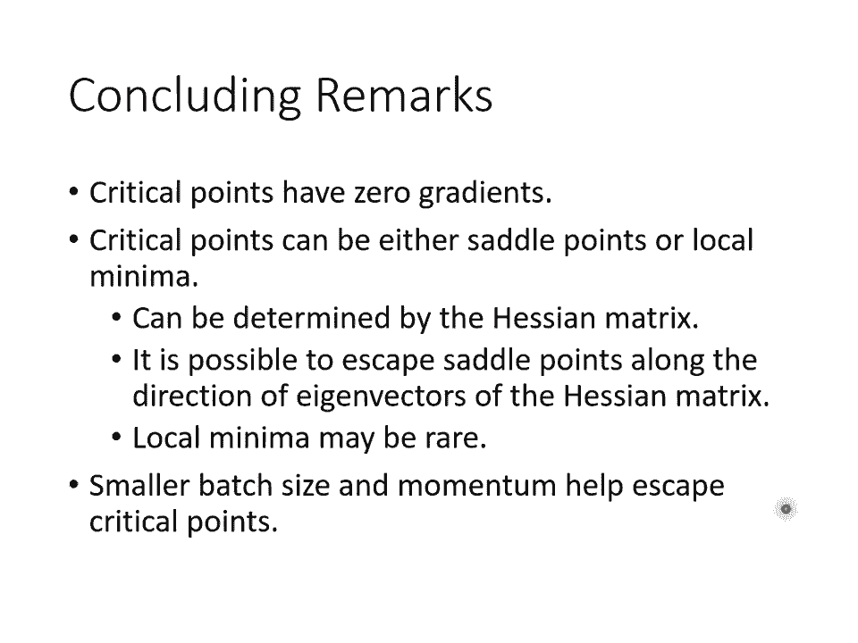

# P5：L3.2- 网络训练2：批次与动量 - ShowMeAI - BV1fM4y137M4

好，今天呢我们要讲H跟moment这两个训练的技巧，希望我们在剩下的30分钟内可以讲完。

好，第一个是啊，好多同学都问我说，为什么我要用be，为什么的时候要be我本来第一周的时候是不打算讲这个东西的。因为我相信讲了以后大家就会有好多好多的问题。因为这好像不是一个一般常理会想要采取的方式。

但是注教的城市里面有这一段，所以我决定先告诉大家有这个东西。那是怎么做的呢？上次我没有讲说我们实际上在算维分的时候，你还不是真的对所有data算出来的L做为分呢。

你是把所有的data分成一个一个的那有的人是叫做min啊，那我这边叫做其实指的是一样的东西，最要说里面里面是写min然后这边每一个的大小呢就是大资。我们每次在up参数的时候。

我们是拿大资料出来算个算个参数那另外。资料再算个lo，再算个规律，再update参数，以此类推。所以我们不会拿所有的资料一起去算出love，我们只会拿一个bech的资料拿出来算lo。

那我们说所有的带看过一遍，叫做一个apppar。那事实上啊，你今天在做这些bech的时候，在把你所有的资料分成一个一个 batchch的时候，你会做一件事情叫做瞎le。瞎le很多不同的做法。

但一个常见的做法就是我们呃每在每一个app开始之前会分一次 batchch。然后呢，每一个ipad的bach都不一样。对，就是第一个appad，我们分这样子的bach。

第二个appad会重新再分一次bech。所以哪些资料在同一个 batchch里面，每一个ipad都不一样。那这件事情叫做shuffle。那刚才主教程市里面其实也有提到shuffle这件事情。好。

再一个问题就是为什么要用bech呢？我们先解释为什么要bech再说bech对圈里带来了什么样的帮助。他为什么要用bech呢？我们来比较左右两边这两个case。那假设现在我们有20笔训练资料。

然后呢呃左边的case就是没有用bech或者是说我的bech size直接设的跟我训练资料一样多，这种状况啊叫做ch，就或者是就是没有用be的意思了。那右边的case就是bech size等于一。

这是两个最极端的状况。我们先来看左边的case，在左边的case里面，因为没有用bech，我们有20笔训练资料，我们的model必我们的城市必须把20笔训练资料都看完，才能够计算lo才能够计算。哦。

所以我们必须要把所有的example，也就20Bexample都看完以后，我们妈参数才能够upd一次，就假设开始的地方SP把所这要都看完以后，update参数就从这里移动到这里。好。

那如果是一个be的话会怎么样呢？如果是一个be，如果bech size等于一的话，代表我们每次update参数的时候，我们只要看一笔资料就好。bech size等于一代表我们只需要拿一笔资料出来算。

我们就可以update我们的参数。所以每次我们upd参数的时候看一笔资料就好。哦。所以我们开始点在这边开一笔资料叫upate一次参数，再看一笔资料叫upate一次参数，再开一笔资料叫update参数。

如果今天总共有20笔资料的话，那在每在一个app里面，我们的参数会upate20。那，不过因为我们现在是只看一笔资料，就update参数，所以用一笔资料算出来的lo显然是比较nois的。

所以我们今天update的方向，你会发现它是曲曲折折的。哦，所以如果我们比较左边跟右边哪一个比较好呢？他们有什么差别呢？你会发现左边这种方式啊，没有用被的方式啊，它蓄力的时间比较长。

对它技能冷却的时间比较长，你要把所有的资料都看过一遍，才能够upate一次参数，而右边的这个方法，be size等于一的时候，蓄力的时间比较短，每次看到一笔参数，每次看到一笔资料你就会更新一次你的参数。

所以今天假设2比10笔资料看完所有资料看过一遍，你已经更新了20次的参数。但是左边这样子的方法有一个优点，就是他这一步走的是稳的那右边这个方法。

它的缺点就是它每一步走的是不稳的那左边跟右边到底哪边比较好呢？看起来左边的方法跟右边的方法，他们各自都有擅长跟不擅长的东西，左边是蓄力时间长，但是威力比较大，右边技能冷却的时间短，但是它是比较不准的。

它是乱枪打鸟型的，到底谁比较好呢？看起来各自有各自的优缺点。但是呃你会觉得说左边的方法技能冷却时间长，右边的方法技能冷却时间短，那只是你没有考虑平行运算而已。实际上考虑平行运算的话。

左边这个并不一定时间比较长。怎么说呢？怎么说呢？这边呢是呃真正的实验结果了。事实上啊比较大的h size。你要算在进额算点所需要的时间不一定比小的H size要花的时间长。

那以下呢是做在一个叫做ist的上面那ist是手写数字辨的啊，就机器要做的事情就是给他一张图片然判断这张图片是0到9的哪一个数字啊他要做数字的分类。那ist呢是机器学习的果，就是啊呃假设你。

天呃从来没有做过机器学习任务，一般大家第一个会尝试机器学习任务，往往就是做miss做手写数字辨试啊，那边我们这边我们就做了一个实验，我们想要知道说呃给机器一个它要计算出规进up参数到底需要花多少的时间。

这边列出了等于一等于十等于100等于100所需要耗费的时间，你会发现说 size啊从一到1000需要耗费的时间几乎是一样的，为什么呢？你可能说唉直觉上有100笔资料，那需要计算。

然后计算规点花的时间不会是一笔资料的10倍吗？那但是实际上并不是这样的。因为实际上做运算的时候，我们有GPU你可以做平行运算，所以你可以做平行运算算的关系。

这1000笔资料是平行处理的所以1000笔资所花的时间并不是一笔资。要的1000倍。好，当然GPU平行运算的能力还是有它的极限。当你的bech size真的非常非常巨大的时候，呃。

GPU在跑完一个bech计算出规点所花费的时间还是会随着 size的增加逐渐增长。所以今天如果 size是从1到1000所需要的时间几乎是一样的。但是当你的bech size增加到1万。

乃至增加到6万的时候，你就会发现GPU要算完一个bech把这个ch里面资料都拿出来算在进能算规点主要耗费的时间确实有随着ch size的增加和逐渐增长但你会发现这边用的是10啊，所以它害的。

给他6万笔资料一个里面了6万笔资料，它在10秒钟之也是把就算出来。而了这个bech size的大小跟时间的关系啊，其实每年都会做这个实验啊，我特别把旧的投影片放在这边啊。如果你有兴趣的话可以看一下。

可以看到什么呢？可以看到这个时代的眼镜这样嘿17年的时候用的是那个980啊，2015年的时候用的是那个760啊，然后980要跑什么6万个bech，那要跑好几分钟才跑得完啊。

现在只要10秒钟就可以跑得完的，你可以看到这个时代的眼镜。好，所以GPU虽然有平行运算能力，但它平行运算能力终究是我个极限。所以你被在真的很大的时候，时间还是会增加的。好，但是因为有平行运算的能力。

因此实际上啊当你的b size小的时候，你要跑完一个apple，花的时间是大的b size是比大的b size还要多的。怎么说呢？如果今天假设我们的训练资料是有6万笔。那base赛一。

那你要6万个update才能跑完一个apple。如果今天是base size等于1000，你要60个upate才能跑完一个app。假设今天一个b size等于一个b size等于1000。

要算规点的时间根本差不多。那6万次update跟60次up比起来。它的时间的差距量就非常可怕的。所以左边这个图是upd一次参数，哪一个b出来计算一个规点upd一次参数所需要的时间。

右边这个图是跑完一个完整的app需要花的时间。你会发现左边的图跟右边的图它的趋势正好是相反的。假设你b一跑完一个app你要upd6万次参数，它的时间是非常可观的。但是假设你的b size00。

你只要跑60次up60次参数就会跑完一个app，所以你跑完一个app看完所有资料的时间，如果你的base size00其实是比较短的。0的时候把所有资要看过一遍。其实是比被赛色衣还要更快。

所以如果我们看右边这个图的话，看完一个bech，把所额资料看过一次这件事情，大的bech size反而是比较有效率的。老是跟你直觉想的不太一样哦。在没有考虑平行运算的时候，你觉得大的bech比较慢。

但实际上在有考虑平行运算的时候，一个appon大的bech花的时间反而是比较少的。好，所以这边我们如果要比较这个H size大小的差异的话，看起来直接用技能时间冷却的长短，并不是一个精确的描述。

看起来在技能时间上面大的be并没有比较吃亏，甚至还占到优势了。哦，所以事实上呢这边upate一次的时间20笔资料upate一次的时间跟这边看一笔资料，upate一次的时间。如果你用GPU的话。

其实可能根本就是一样。所以大的的技能时间它技能冷却的时间并没有较长。那所以这时候你可能就会说那大的的劣势消失了，那难道他的就的这看起来的应该比较好。

你说的这个up比较稳定啊的它的bra点的方向比较nois吗？那这样看起来的好像应该比较好，小的应该比较差哦。因为现在大劣势已经为平行运算时间被拿，只下优势优势而那神奇的地方是noisy的反而可以帮助。

这个也是跟直觉正好相反的。如果你今天拿不同的bech来训练你的模型，你可能会得到这样子的结果哦，左边是坐在anist上，右边是坐在s发 ten上。那不管是ist还是s ten都是影像电视的问题好。

那横轴啊代表的是bech size，从左到右越来越大，纵轴代表的是正确率啊，越上面正确率越高啊，当然正确率越高越好。而如果你今天看validation set上的结果啊。

如果你今天看如果你今天看validation set上的结果会发现说bech size越大validation set上的结果越差。但这个是overfi吗？这个不是overfi。

因为如果你看你的training的话，会发现说bech size越大training的结果也是越差的。而我们现在用的是同一个模型呢同一个模型，同一个naval照理说他们可以表示的方就是一模一样的。

但神奇的事情是大的be size往往在training的时候会给你带来比较差的结果。哦，所以这个是什么样的问题？同样的model，所以这个不是model bias的问题。

这个是optimization的问题。代表当你用大的b size的时候，你的optimization可能会有问题，小的b size optimizationim的结果反而是比较好的。好。

为什么会这样子呢？为什么小的 size在上会得到比较好的结果，为什么noisy的up noisy的 gradient会在training的时候给我们比较好的结果呢？一个可能的解释是这样子的。

假设你是那你今天在update你的参数的时候，你就是沿着一个lo function来upd参数。那今up参数的时候走到一个local mini，走到一个s point显然就停下来了。

规这里如果有个特别去看ha的话，那你用规方法，你就没有办法再更新你的参数。但是假s，你有用的话会发生什么事呢？因为我们每次是挑一个出来算它的，所以等于等于你每次update你的参数的时候。

你用的lo function都是略有差异的。你选第一个的时候，你是用L one来算你的规点。你选到第二个的时候，你用L来算你的点。假设你用L one算规点的时候发现规点是零卡住了。

但L它的方跟L one又不一样。所以L one卡住了L two不一定会卡住啊，所以L one卡住了没关系，换下一个来L再算规点，你还是有办法能还是有让你的变所今天这种no方结而对其是有帮助。

那这边还有另外一个更神奇的事情啊，那这个神奇的事情是什么呢？这个神奇的事情是呃，其实小的bech也对testing有帮助。就假设我们今天在确的时候，都不管是大的ch还是小的都劝到一样好。

刚才case的时候就已经劝不好了。那假设你有一些方法，你努力的调大的想办法把一结果你会发的会是比较好那以下这个实验结果啊引用至on large验结这边作者了个有这实验很用的在很多不同case都观察到一的结果。

那面有25就就个里面有60笔。质料。😊，好，然后他想办法在大的bech跟小的bech都劝到差不多的training的 accuracy。哦，所以刚才我们看到结果是bech size大的时候。

training accuracy就已经擦掉了。但不是想办法劝到大的bech的时候，training accuracy跟小的bech其实是差不多的。但是就算是在圈的时候，结果差不多testing的时候。

你还是看到了小的bech居然比大的bech差。圈ing的时候都很好。testing的时候小的bech差那代表什么？代表overfitting，这个才是overfitting，对不对？好。

那为什么会有这样子的现象呢？啊，在这篇文章里面也给出了一个解释，他是呃解释是这个样子的。假设这个是我们的traing love。那在这个ing loss上面呢，可能有很多个local mini。

有有不止一个local mini。那这些local mini，他们的lo都很低，他们lo可能都趋近于你。但是这个loc mini还是有好min坏之分。

什么叫做好 mini坏min呢我们会认为如果一个loc mini它在一个峡谷里面它是坏的min。然后它在一个平原上它是好的min为什么会有这样的差异呢。

因为假设现在training跟t中间有一个missmatchtraining的跟test，他们那个不一样。为什么不一样呢？有可能是本来 testing就不一样。

那也有可能是因为training testing你的你都是simple的 data算出来的，也许到的不一样啊，那所以算出来。还是有一点差距。

那我们就假设说它这个trainingtesting它的差距就是把training的这个方向往右平移一点。这个时候你会发现对这个呃对左边这个min码来说啊，对这个在一个盆地里面min来说。

它的在ingtesting上面结果不会差太多，只差了一点点。但是对右边这个在峡谷里面min码来说啊，一插就可以天差地远啊，它在这个呃ing线上算出来lo很低。

但是因为training跟testing之间的不一样。所以testing的时候哇这个呃 service一变，它算出来lo就变得。嗯嗯。而很多人相信说呢这个。

大的bech size会让我们倾向于走到峡谷里面，而小的bech size倾向于让我们走到盆地里面。那它直觉上的想法是这样，就是小的be，它有很多的no，它每次upd的方向都不太一样。

所以如果今天这个峡谷非常的窄，它可能一个不小心就跳出去了。因为每次update的方向都不太一样嘛，它的upate的方向就随机性，所以一个很小的峡谷没有办法困住小的bech呃，有如果峡谷很小。

它可能动一下就跳出去做停下来呢，如果有一个非常宽的盆地，它才会停下来。那对于大的bech size，反正它就是顺着规定upate啊，它就很有可能走到一个比较小的峡谷里面。但这只是一个解释啦。

那呃也不是每个人都呃相信这个解释。那这个其实还是一个上代可以研究的问题。好，那这边就是比较了一下大的bech跟小的bech。好，左边这个是第一个colance是小的bech。

第二个colance是大的bech。如果在没有平行运算的情况下，我们会觉得小的bech比较有效。大的bech你一个ch时间要算的比较长。但是在有平行运算的情况下。

小的be跟大的be其实运算的时间并没有太大的差距，除非你的大的bech那个大是真的非常大，才会显示出差距来。但是一个app park需要的时间，小的bach比较长，大的bech反而是比较快的。

所以从一个appPa需要的时间来看，大的bech其实是占到优势的。而小的bech你会update的方向叫noisy大的bech update的方向比较稳定。

但是noisy的update方向反而在upimization的时候会占到优势，而且在的时候也会占到优势。所以大的bech跟小的bech他们各自有他们擅长的地方。

所以bech size变成另外一个hyperparmeter这个hyperparmeter是你需要去调它的，这个也是一个你需要去调整的parmeter。那巧后这边有人就会想说。

那我们能不能够呃鱼与熊掌兼得呢？我们能不能够截取大的bech的优点跟小的bech的优点，有们用大的bech size来做训练，用平行运算的能力来增加训练的效率。

但是训练出来的结果同时又得到好的结果呢又得到好的训练结果呢？这是有可能的有很。文章都在探讨这个问题啊，今天我们就不细讲，我们把些reference这边给大家参考。

那发现这些paper往往他想要做的事情都是什么？哇，76分钟 bird15分钟re一分钟 image等等啊，这为什么他们可以做那么快，就是因为他们ch size是真的开很大。

比如说在第一篇paper里面 size里面有3万笔examp这样的 size开很大b size开大，真的就可以算很快，你可以在很短时间内看到大量的资料。

那他们需要有一些特别的方法来解决age size可能会带来的劣势。好，那最后想要跟大家下课前想要跟大家分享的另外一个技术啊，是moment。

这也是另外一个有可能可以对抗s point或loc空 mini的技术。而这个mo是怎么运作的呢？moment的运作是这个样子的。它的概念啊你可以想象成在物理的世界里面呃。

假设ero surface就是真正的斜坡，而我们的参数是一个球，你把球从斜坡上滚下来。如果今天是 gradient，它走到loc mini就停住了，走到 point就停住了。它是在物理的世界里面。

一个球会这样子吗？一个球如果从高处滚下来，从高速滚下来就算滚到s point，如果有惯性，它从左边滚下来，因为惯线关系它还是会继续往右走，甚至他走到一个loc mini，如果今天它的动量够大的话。

它还是会继续往右走，甚至翻过这个小坡，然后继续往右走。那所以今天在物理的世界里面，一个球从高速滚下来的时候，它并不会被s point或local mini码卡住。

不一定会被s point或logo mini码卡住。我们有没有办法运用这样子的概念到braiancent里面呢？那这个就是我们等一下要讲的moment这个技术。好。

那我们先很快的复习一下原来的gradiandescent长得是什么样子啊，这个是ve妮娜的 gradientiandescent。ve妮娜意思就是呃一般的的意思啊，它指意是香草的。

但就其实一般的一般的gradiandescent长什么样子呢？一般gradiandescent是说哦，我们有一个初始的参数叫做塞拉里。我们计算一下bra点，然后计算完这个bra点以后呢。

我们跟我们往bra点的反方向去update参数。我们到了新的参数以后，再计算一次规点，再往规点的反方向，再update一次参数。到了新的位置以后，再计算一次规点，再往规点反方向去upd参数。

这个buses呢就一直这样子下去。好，那如果加上moment的话，会是什么样子呢？加上moment以后，bradientdescent变成这个样子。每一次我们在移动我们的参数的时候。

我们不是只往bradientdescent，反我们不是只往bradient的反方向来移动参数。在一般的bradescent里面，我们都是往braient的反方向去移动参数。

但现在不只往braient的反方向去移动参数，我们是braient的反方向加上前一步移动的方向，两者加起来的结果去调整去移动我们的参数。那具体说起来是这个样一样找一个初始的参数。然后呢。

我们假设前在一开始的时候，前一步的呃变化量，前一步的呃参数的update量呢，就设为0。而接下来呢在达零的地方，你要计算居零计算居零计算bradian的方向。然后接下来你要决定下一步要怎么走。

那我们说下一步怎么走呢？它是bradian的方向加上前一步的方向。不过因为前一步呢正好是零了，现在是刚初始的时候，所以前一步呢是零，所以upd的方向呢，跟原来的bradient是一样的。

这没有什么有趣的地方。但从第二步开始有加上moment以后就不太一样了。从第二步开始，我们计算居 one，然后接下来我们upd的方向不是居外的反方向，而是根据。上一次update的方向。

也就是NY减掉GY当做我们新的update的方向，这边写成ent。如果你看数学式子觉得有点模糊的话，那我们就看左边这个图。G外告诉我们，brare点告诉我们要往这边走。但是我们不是只听规点的话。

加上moment以后，我们不是只根据规点的反方向来调整我们的参数，我们也会看前一次upd的方向。如果前一次说要往这个方向走，规点说要往这个方向走，就把两者相加起来走两者的折中，也就是往这一个方向走。

所以我们就呃移动了N two走到CWQ这个地方。好后接下来就反复进行同样的过程。在这个位置，我们计算出规点，但我们不是只根据规点反方向走，我们看前一步怎么走，前一步走这个方向走这个蓝色虚线的方向。

我们把蓝色的虚线加红色的虚线前一步指示的方向跟规点指示的方向，当做我们下一步要移动的方向，以此类推，反复进行好后的操作，规点在这个地方说要往这个方向走。然后前一步说往这个方向走，两者综合起来。

就往左下走。所以这个一般规点底线不一样。我们不是只看规的方向来调整参数，我们还会考虑之前的之前移动的方向来调整参数。好，那这边的每一步的移动啊，我们都用N来表示，我们都用N来表示。

那这个N呢其实可以写成之前所有算出来的规点的V上怎么说呢？从右边的这个式子其实就可以轻易的看出来N0我们把它设为0NN是N0减掉0N0为0。

所以N就是居0乘上负的A塔N呢是让达乘上N让达就是另外一个参数了，就跟ning样是要调的，就塔是ning我们要调啊让也是另外一个参数，这个是需要调的了。N等于让乘上N减掉塔乘上G然后N在哪里呢？

N在这边啊你把N带进来就知道说N等于负的让达乘上A塔0减掉塔乘上G是0跟G的以此类。所以你会发现说现这个加上moment以后啊，一个解读是moment是gradian的复反方向，加上前一次移动的方向。

那但另外一个解读方式是所谓的moment。当加上moment的时候，我们update的方向不是只考虑现在的bradian，而是考虑过去所有bradian的总和。好，那假设呃你这边也没有听得很懂的话。

那这边有一个更简单的例子，希望帮助你了解moment是怎么回事。好，那我们从这个地方开始upd参数，根据gra的方向告诉我们应该往右upd参数。那现在没有前一次update的方向。

所以我们就完全按照bra呢给我们的指是往右移动参数。好那我们的参数呢就往右移动了一点到这个地方变得很小告诉我们往右移动，但是只有往右移动一点点。

那前一步是往右移动的我们把前一步的方向用虚线来表示放在这个地，我们把之前告诉我们要走的方向跟前一步移动方向加起来得到往右走的方向。

那再往右走走到一个loc mini照理说走到loc mini一般就无法向前走了，因为已经没有这个的方向，那走到也一没有的方向已经无法前走。但没有关系，如果有mo的话，你还是有办法继续走下去。

因为不是只看就在这里你还有前一步的方向，前一步的方向告。我们向右走，我们就继续向右走。甚至你走到这种地方，规点告诉你应该要往左走了。但是假设你前一步的影响力比规点要大的话，你还是有可能继续往右走。

甚至翻规的小秋搞不好就可以走到更好的local mini码。那这个就是moment，有可能带来的好处。好，那这个就是今天想跟大家说的内容。那没想到就讲到6点20了，我们在这边就只好下课了，谢谢大家。

谢谢。谢谢谢谢。😊。

