# P9：L8.1- 自注意力机制 (Self-attention) 1 - ShowMeAI - BV1fM4y137M4

好，接下来要讲什么呢？讲完了CNN以后，我们要讲另外一个常见的nl架构，这个架构叫做self attention。啊这个se attention想要解决的问题是什么呢？他想要解决的问题是，到目前为止啊。

我们的new word input都是一个向量。不管是在预测这个youtube观看人数的问题上啊，还是影像处理上啊，我们的输入都可以看作是一个向量。然后我们的输出可能是一个数值。

这个是regression，可能是一个类别，这是classification。但假设我们遇到更复杂的问题呢，假设我们说输入是一排向量呢，而且这个输入的向量的数目是会改变的呢。我们刚才在讲影像变色的时候。

我还特别跟你强调说，我们假设输入的影像大小都是一样。那现在假设我们的输入会不一样呢，每次我们model输入的sequence的数目，sequence的长度都不一样呢。那这个时候应该要怎么处理？

好那有什么样的例子是输入是一个sequence，而且长度会改变的呢？第一个例子是文字处理啊，假设我们今天要内的输入是一个句子的话，那到每个句子长度都不一样嘛，每个句子里面词汇的数目都不一样嘛。

如果我们把一个句子里面的每一个词汇都描述成一个向量，要个向量来表示的话，那我们的model的输入就会是一个actctor set，而且这个vector set的大小，每次都不一样。你句子长度不一样。

那你的vector set大小就不一样。

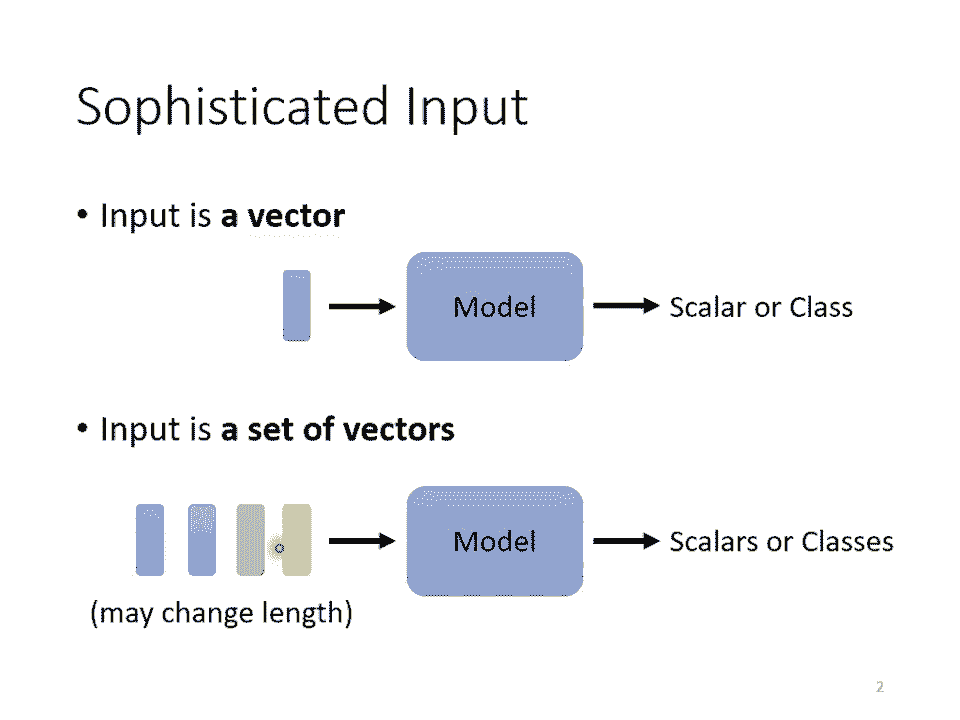

那有同学可能会问说，那怎么把一个词汇表示成一个向量呢？那简单来说，最简单的做法是one hard的encoding，你就开一个很长很长的向量，这个向量的长度啊，跟世界上存在的词汇的数目是一样多的。

假设英文是10万个词汇，就开一个10万维的向量，每一个维度对应到一个词汇，apple就是100bg就是010ca就是001，以此类推。但是这样子的表示方法有一个非常严重的问题。怎么样严重的问题呢？

它假设所有的词汇彼此之间都是没有关系的。从这个向量里面，你看不到说也许cat跟dog都是动物，所以他们比较接近cat跟apple一个动物一个植物，所以他们比较不相像，你看不出来这件事情。

这个向量里面没有任何语义的资讯。有另外一个方法叫做we embedding。我 embedding就是我们会给每一个词汇一个向量，而这个向量是有语义的资讯的。

如果你把word embedding画出来的话，你会发现所有的动物可能聚集成一团，所有的植物可能聚集成一团，所有的动词可能聚集成一团等等。那we bedding是怎么得到的呢？

这个就不是今天讲课的重点了。如果你有兴趣的话，可以看一下以下个录影。总之，你现在在网络上可以载到一种东西叫做webedding这个we bedding会给每一个词汇一个向量。

而一个句子就是一排程度不一的向量。好，那接下来还有什么样的例子，我们需要把这个一个向量的sequ当做输入呢？举例来说，作业2一段声音讯号其实是一排向量。怎么说呢？我们会把一段声音讯号取一个范围。

这个范围叫做一个window把这个window里面的资讯呢描述成一个向量。这个向量就叫做一个fend。我在语音上我们会把一个向量叫做一个fend。通常这个window的长度啊。

就是25个misesecond。那怎么把这么一个小段的声音讯号变成一个fend变成一个向量呢啊，这边就有白白种做法了啊，这边就不细讲，那就是个数量的做法，可以用一个向量来描述一小段。

25个misecond里面的语音讯号。然后呢，你未来要描述一整段的声音讯号，你会把这个window往右移一点，通常移动的大小是10个mi。那，有人就会问说，为什么这边是25。

为什么这个十这个问题呢就很难回答这个古圣先贤帮你调好了，你知道吗？这个你自己调放都是比较差。这古圣先贤已经把所有的可能都试过了，然后调一个最好的结果，然后就这样。好。

那总之呢一段声音讯号你就是用一串向量来表示。而，因为每一个window啊，他们往右移都是移动10个miseac，所以一秒钟的声音讯号有几个向量呢，有100个。

所以一分钟的声音讯号就有这个1100乘以60，就6000个向量。所以语音其实很复杂的一小段声音讯号，它里面包含的资讯量其实是非常可观的。所以声音讯号也是一堆向量。

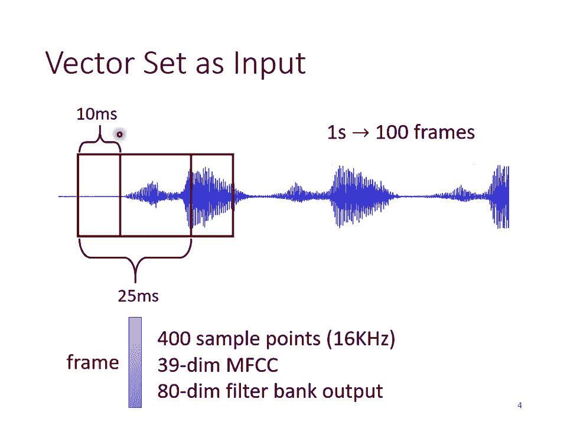

还有什么东西一堆向量呢？一个graph一个graph一个图也是一堆向量。怎么说呢？啊，我们知道说social network就是一个graph在social network上面每一个节点就是一个人。

然后节点跟节点之间的H就是他们两个，比如说是不是朋友等等。而每一个节点可以看作是一个向量。你可以拿每一个人的啊比如说他的profile里面的资讯啊，他的性别啊，他的年龄啊，他的工作啊，他讲过的话等等。

把这些资讯用一个向量来表示，所以一个social network一个graph你也可以看作是一堆的向量所组成的。

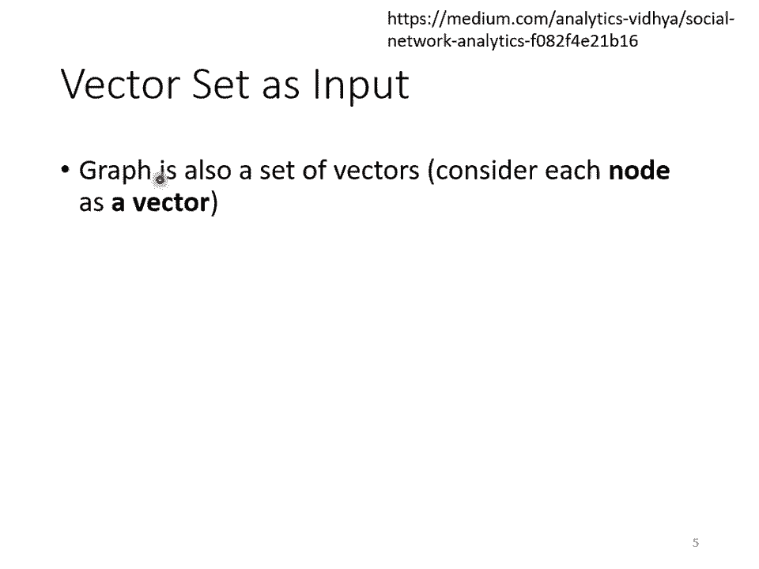

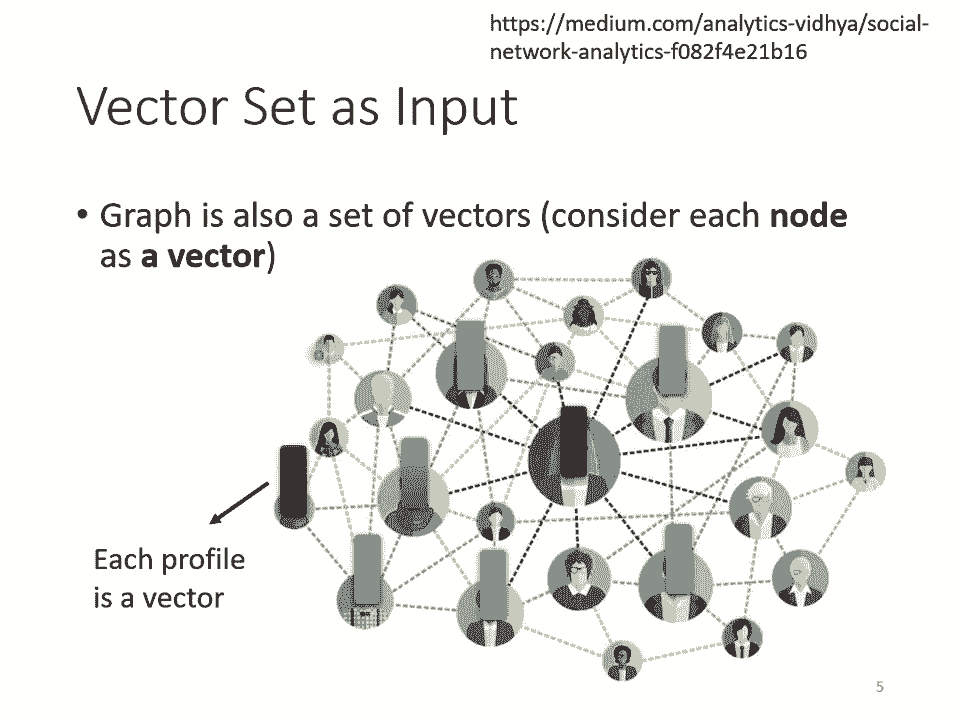

那还有什么例子跟graphra有关呢？举例来说，一个与分子它也可以看作是一个graph。那现在像这种dr discovery的应用，非常的受到重视，尤其是在co nineteen这段时间。

很多人都期待也许用机器学习可以在dr discovery上面做到什么突破。那这个时候你就需要把一个分子当做是你的模型的输入。有一个分子可以看作是一个G分子上面的每一个求就是一个原子，你就是一个向量。

那一个原子怎么用的向量来表示呢，你可以用one vector来表示，你可以说氢就是1000，看就是0100。然后这个氧就是0010。你可one factor来表示每个原子。

那一个分子就是一个graph它就是一堆向量。

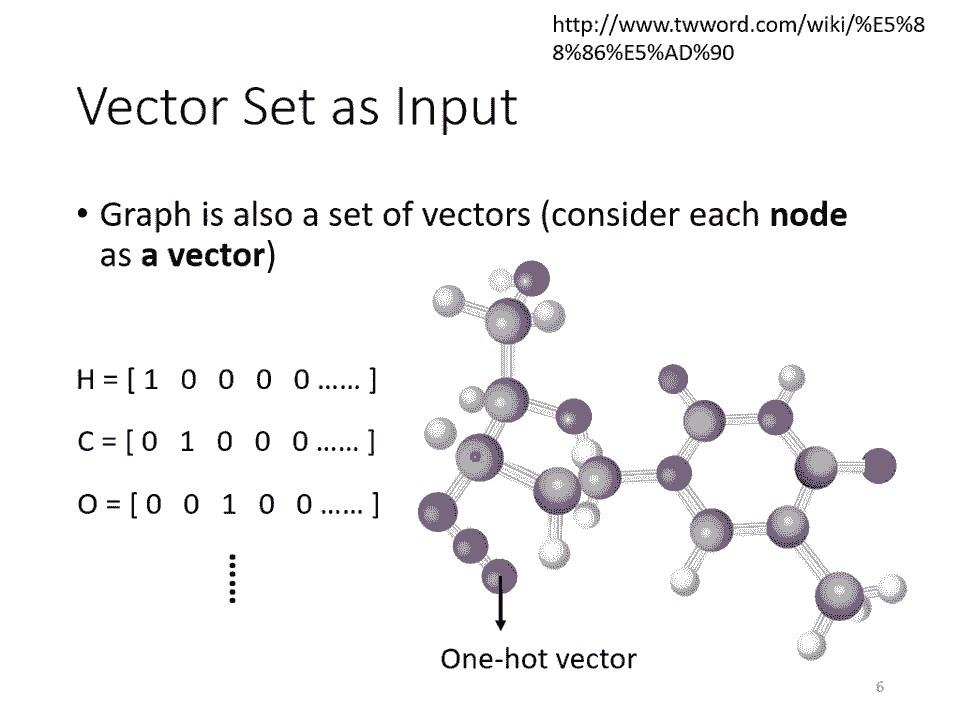

好，那输出是什么？我们刚才已经看说输入是一堆向量，它可以是文字，可以是语音，可以是g。那这个时候我们有可能有什么样的输出呢？有三种可能性。第一种可能性是每一个向量都有一个对应的label。

也就是说当你的模型看到输入是4个向量的时候，它就要输出4个label那每个label它可能是一个数值，那就是regress的问题。如果每一个label是一个class。

那就是一个classification的问题。但是在第一种可能性里面输入跟输出的长度是一样的。所以模型不需要去烦恼，要输出多少的label输出多少的sner，反正输入是4个向量，输出就是4个向量。

输入5个向量，呃输入5个向量输出就是5个label。这是第一种类型。那什么样的呃application会用到第一种类型的输出呢？举例来说，在文字处理上。

假设你今今天要做的是POStaOS taking是什么呢？POSta就是磁性标。住你要让机器自动决定说每一个词汇它是什么样的词性，还是名词，还是动词，还是形容词等等。那这个任务啊其实并没有很容易。

举例来说，你现在看到个句子，Iso a so，这并不是打错，并不是你看一个看，而是呃我看到一个句子。这个第二个so当名词用的时候，它是句子，它是句子，而不是 sentence那个句子是可以句东西的句子。

知道吗？好，那所以机器要知道说第一个so是个动词，第二个so虽然它也是个so，但它是名词，但是每一个输入的词汇都要有一个对应的输出的词性，这个任务就是啊输入跟输出的长度是一样的case。

这个就是属于第一个类型的输出。那如果是语音的话，你可以想想看我们作业就是这样子的任务像我们作业没有给大家一个完整的sequence吧，我们是把每一个每一个每个 vector分开给大家了了。

但是串起来就是一段声音信号里面有一串每一个 vectorctor你都要决定它是哪一个风也就是一个高是什么？就是一当音标来看，就是哪一个音标。当然这个不是真正的语音辨啊。

这是一个语音辨的简化版或者是如果是social network的话啊就是给一个graph给一个social network那你的呢你的model呢要决定每一个节点，它有什么。样的特性。

比如说他会不会买某一个商品，这样我们才知道说要不要推荐某一个商品给他。好，所以以下以上呢就是举输入跟输出数目一样的例子。好，这是第一种可能的输出。第二种可能输出是什么？第二种可能的输出是。

我们一整个sequence只需要输出一个label就好。举例来说，如果是呃文字的话，我们就说 sentimentment analysis sentimentment analysis是什么呢？

sentment analysis就是给机器看一段话，然后决定说这段话呢是正面的还是负面。那可以想象说这种应用很有用啊，假设你个公司开发了一个产品啊，这个产品上线了，你想要知道网友的评价怎么样。

但是你又不可能一则一则网友的留言都去分析，那也许你就可以用这从centment analysis的技术，让机器自动去判图说当一则天文里面有提到某个产品的时候。

它是正面的还是负面的那就可以知道你的产品在网友心中的评价怎么样。这个是centment analysis给一整个句子只需要一个label，那positive或 negative。那这个就是第二类的输出。

那如果是语音的例子的话呢，在作业室里面我们会做语者辨认，机其要听一段声音，然后决定他是谁讲的。这个也是第二种输出的例子。或者是如果是graphra的话呢，今天你可能想要给一个分子，然后要预测说这个分子。

比如说它有没有毒性或者是它的清水性如何，那这就是给一个graph输出一个label，这也是第二个例子。啊，那还有第三个可能的输出。第三个可能的输出就是我们不知道应该输出多少个label机器要自己决定。

应该要输出多少个label哦，可能你输出是N个向量，输出可能是N派的label。为什么是N派机器自己决定。好，那这种任务啊又叫做sequence to sequence的任务。

那我们在作业5呢会有sequ to sequence的作业。所以这个之后我们还会再讲啊。那可以想象说翻译就是 sequenceequ to sequence的任务。因为输入输出是不同的语言。

他们的词汇的数目本来就不会一样多，或者是语音辨识也是真正的语音辨识也是一个sequ to sequence的任务，输入一句话，然后输出一段文字，这也是一个sequ to sequence的任务。好。

那第三种类型之后会讲今天我们只讲第一种类型。第二种类型，呃，我们有作业式，你可以把作你可以自己去看看作业式的城市，看看第一种类型的问题是怎么处理的那因为上课时间有限。所以上课我们今天就先只讲第一个类型。

也就是输入跟输出数目一样多的状况。那这种输入跟输出数目一样多的状况啊，它又叫做s。

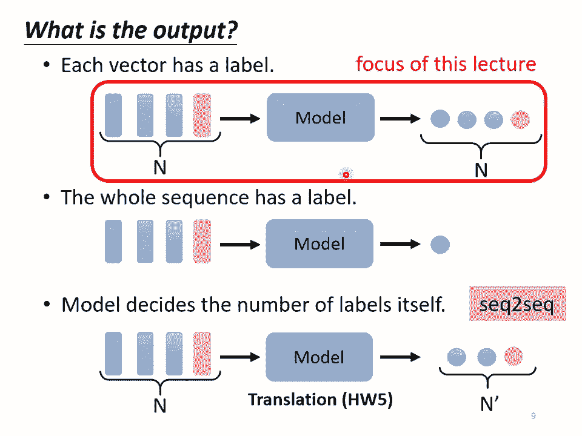

labelling然后给sequence里面的每一个向量都给他一个label，那要怎么解sequence labeling的问题呢？那直觉的想法就是哎就跟作业二一样。哎。

呃我们就拿着 fully connectedect。然后虽然这个输入是一个sequence。但我们就各个击迫，不要管它不要管它是不是一个sequence各个击破。

把每一个向量分别输入到呃fully connectedect里面，然后呢fully connectedect network就会给我们输出。

那现看看你要做的是regress还是classification产生正确的对应的输出就结束了。但这么做显然有非常大的瑕疵，什么样非常大的瑕疵呢？假设今天是呃磁性标记的问题，你给机器一个句子。

i so a soul对 fullyly connected来说，这个so跟这个so完全一模一样啊，他们是同一个词汇啊，既然 fullyly connected never输入同一个词汇。

他没有理由输出不同的东西啊。但实际上你期待第一个so要输出动词，第二个so要输出名词，但对来说，他不可能做到。因为这两个so明明是一模一样的。你叫他这个要输出动词，要输这个要输出名词，他会非常的困惑。

完全不知道要怎么处理。所以怎么办？有没有可能让fully connected network考虑更多的？比如说上下文的context的资讯呢，这是有可能的。怎么做？呃，你就把这一个向量。

前后几个向量都串起来一起丢到fr connectedect的 network就结束了。而事实上在作业二里面，助教也已经这么做了。在作业二里面。

我们不是只看一个fend去判断这个fend属于哪一个风ing，也就属于哪一个音标，而是看这个fend的前面5个加后面5个，也就总共看11个fend来决定他是哪一个音标。哦。

所以我们可以给 fullyly connectedect的 network一整个window的资讯，让他可以考虑一些上下文的跟我现在要考虑的这个向量相邻的其他向量的资讯。但是这样子的方法还是有极限。

如果是在作业2，其实用这个方法就够好了。作业2就算是给你sequence的资讯，你考虑整个sequ，你可能也很难再做的更好了。作业2考虑前后5个fend其实就可以得到很不错的结果了。

所以你要过str base line，重点并不在于考虑整个sequence，你就不需要往那个方向想了。就用住叫现有给你的data，你就可以轻易的过str。好，但是真正的问题。

但是如果今天我们有某一个任务，不是考虑一个window就可以解决的，而是要考虑一整个sequence才能够解决的话，那要怎么办呢？那有人可能会想说这个还不容易，我就把window开大一点呢。

大到可以把整个sequence盖住，不就结束了吗？但是不要忘了今天sequ的长度是有长有短的。我们刚才我说我们输入给我们的model的 sequenceequ的长度每次可能都不一样。

如果你今天说我真的要开一个window，把整个sequence盖盖住，那你可能要统计一下你的训练资料，然后看看你的训练资料里面最长的sequence有多长，然后开一个window比最长的sequ还要长。

你才有可能把整个sequence盖住。但是你开的这么大的window，意味着说你的 fullyly connectedect的 network，它需要非常多的参数。那可能不止运算量很大。

可能还容易overfi。所以有没有更好的方法来考虑整个imer sequence的资讯呢？这就要用到我们接下来要跟大家介绍的sell attention这个技术了。

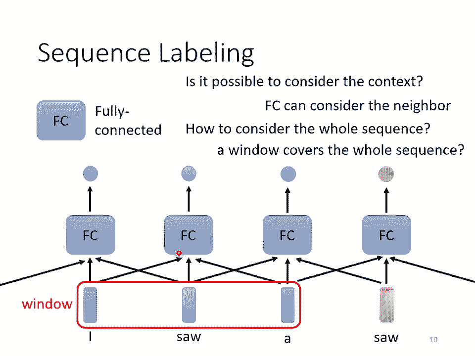

好那self attention是怎么运作的呢？self attention的运作方式就是self attention会持一整个sequence的资讯。然后你input几个ve，它就输出几个ve。

比如说你这边input一个深蓝色的 vectorctor，这边就给你一个另外一个bector，这边给一个浅蓝色，它就给你另外一个bector。你这边输入4个vector。

它就oppo4个factorctor。那这四个ctor有什么特别的地方呢？这四个 vector啊，他们都是考虑一整个sequ以后才得到的。

那等一下我会讲说self attention怎么考虑一整个sequence的资讯哦，所以这边每一个向量啊，我们特别给他一个黑色的框框代表说它不是一个普通的向量，它是考虑了整个句子以后才得到的资讯。

再把这个有考虑整个句子的向量丢进fully connected，然后再来决定说啊它应该是什么样的东西，什么样的类别或oppo什么样的数字。那你用这个方法如此一来，你这个 fully connected。

它就不是只考虑一个非常小的范围或一个小的window，而是考虑整个sequence的资讯再来决定现在应该要输出什么样的结果。那这个就是lf attention。

那self attention呢不是只能用一次你可以叠加很多次。你可以说啊我这个self attention的输出呢通过以后得到的输出。

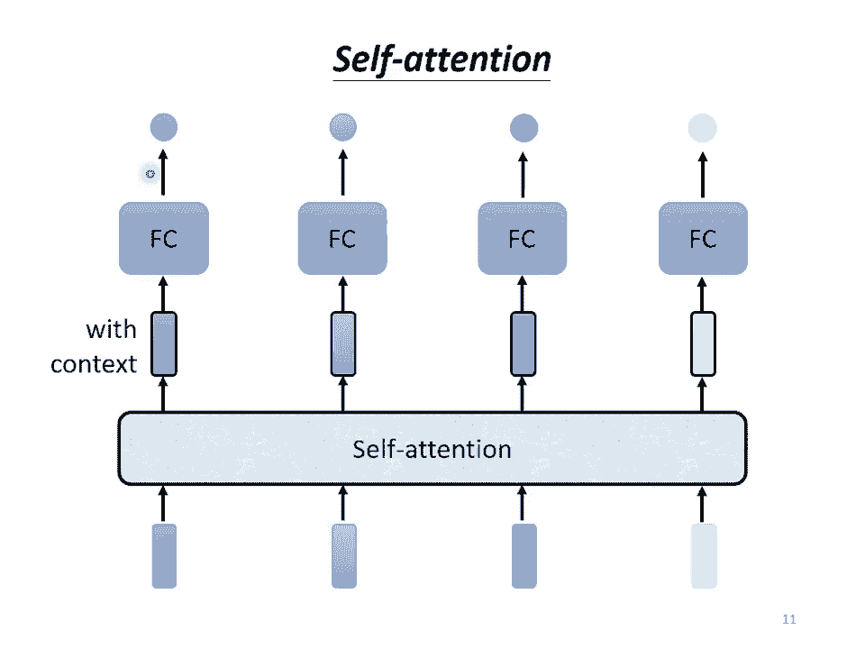

输出再做一次self attention， fully connected network再过一次self attention，再重新考虑一次整个iner sequence的资讯。

再丢到另外一个 fully connected network，最后再得到最终的结果。所以你可以把 fully connected network跟self attention交替使用。

就是self attention处理整个sequence的资讯，fullyly connected network，专注于处理某一个位置的资讯，然后你可以再用self attention。

再把整个sequence资讯再处理一次，然后交替使用self attention跟fully connected的。

那有关self attention呢最知名的相关的文章就是attention is o you need。那在这篇paper里面呢，google提出了transformer这样的naval架构。

那transformer就是变形金刚了。所以提到这个的时候呢，我们就会有形金刚这个形象。那在transformer里面一个最重要的modtransformer我们今天还不会讲到。

但我们之后会讲到transformer里面个最重要的module呢就是self attention，啊就是变形金刚的火种源。

那这边最厉害的地方就是它一个霸气的名字啊那霸气的名字就是attention is o you need。那其实像self attention这样的架构啊。

最早我并不会说它是出现在attention is o这样的paper。因为其实很多更早的paper就有提出过类似的架构，只是不见得叫做self attention。

比如说叫做self matching或者是叫别的名字，不过呢是attention is o you这边self attention这个把它发扬光大。

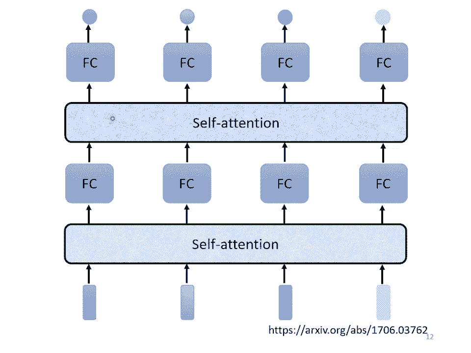

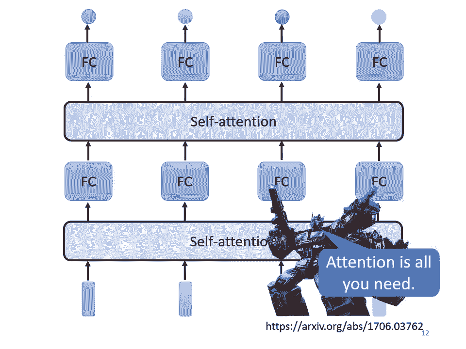

哦那se attention是怎么运作的呢？s attention的 inputput啊，它就是一串的ve。那这个ve可能是你整个内val的 inputput。

它也可能是某个heden layer的output。所以我们这边不是用X来表示它我们用A来表示它代表说它有可能是前面已经做过一些处理。它是某个heden layer的output。

那input一排A这个向量以后，se attention要open另外一排B这个向量。那这个B呢每个B呢都都是考虑了所有的A以后才生成出来的。所以我这边特意画了非常非常多的箭头。

告诉你说BY考虑了A one到F产生的B two考虑A one到F产生的。B3B4也是一样。考虑了整个input的 sequence才产生出来。好，那接下来呢就是要跟大家说明怎么产生B one这个向量。

那你知道怎么产生B one这个向量以后，你就知道怎么产生剩下B oneBB two B3B4剩下的向量。好，怎么产生B one这个向量呢？第一个步骤啊。

是根据A one找出这个sequence里面跟A one相关的其他向量。我们知道说今天我们要做self attention，目的就是为了要考虑整个sequence。

但是我们又不希望把整个sequence所有的资讯包在一个window里面。所以我们有一个特别的机制，这个机制是根据A one这个向量找出说整个很长的sequence里面到底哪些部分是重要的。

哪些部分跟判断A one是哪一个label是有关系的。哪些部分是我们要决定A one的class决定A one的 regression的数值的时候，所需要用到的资讯。好。

那每一个向量跟A one的关联的程度，我们用一个数值叫阿尔法来表示。那再来的问题就是这个self attention的 moduleule怎么自动决定两个向量之间的关联性呢？

你给他两个向量A one跟app，它怎么决定A one跟app有多相关，然后给他一个数值阿尔法呢？

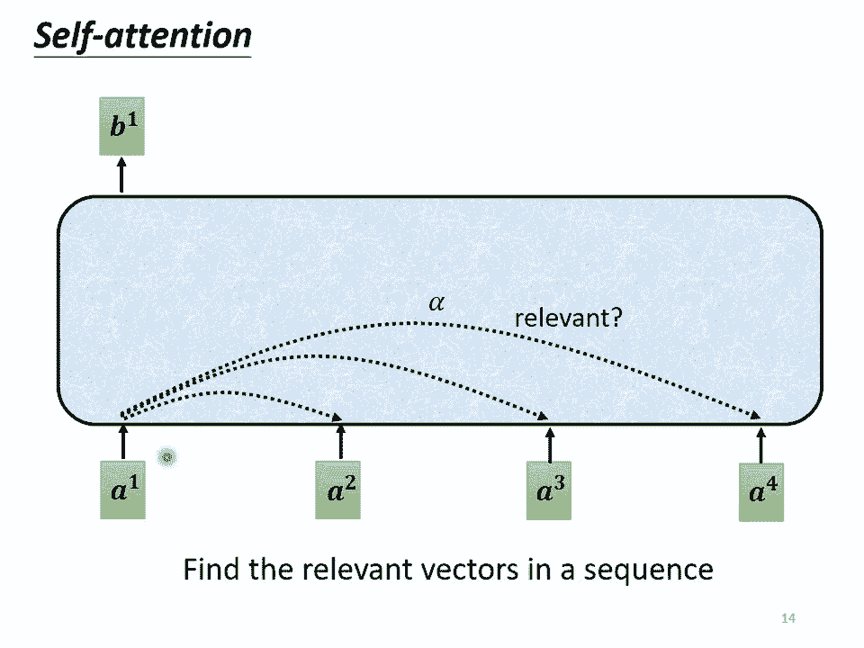

好，那这边呢你就需要一个计算attention的模组。那这个计算attention的模组呢，它就是拿两个向量作为输入，然它就直接输出阿尔法那个数值，那就可以把阿尔法那个数值当做两个向量的关联的程度。

那怎么计算这个阿尔法的数值呢，这边就有各种不同的做法。那比较常见的做法呢叫做用。那怎么做呢？你把输入的这两个向量分别乘上两个不同的矩阵啊，左边这个向量乘上WQ这个矩阵，右边这个向量乘上WK这个矩阵。

接下来得到Q跟K这两个向量。那再把Q跟K做达就是把它们做anwise的相乘再全部加起来以后就得到就把Q跟K做以后得到这个就是阿法这是一种计算阿法的方式。那其实还有其他的计算方式，比如说右边呢。

另外一个叫做aditive的计算方式。它的计算方法就是啊同样这两个向量通过WQWK得到Q跟K那我们不是把它做大发的，是把它这个串起来，然后丢到这个过一个act function。

然后再通过一个transform，然后得到阿尔法。总之有非常不不同的方法，可以计算attention啊，可以计算这个阿尔法的数值可以计算这个关联的程度。但是哎在接下来的讨论里面，我们都只用左边这个方法。

这也是今日最常用的方法，也是用在transformer里面的方法。好，那接下来啊我们就要讲怎么计算出这个阿尔法。好，那讲完这个呃，就讲。哎，我们这边我们就快要讲到一个段落啊，那讲到一个段落呢。

我们就可以下课或是看看大家有没有问题。好，总之呢我们就是用这两个 vectorctor可以计算出阿尔法。那接下来怎么把它套用在self attention里面呢？

那你就要把这边的A one去跟这边的A twoA3A4分别都去计算它们之间的关联性，也就是去计算他们之间的阿尔法。

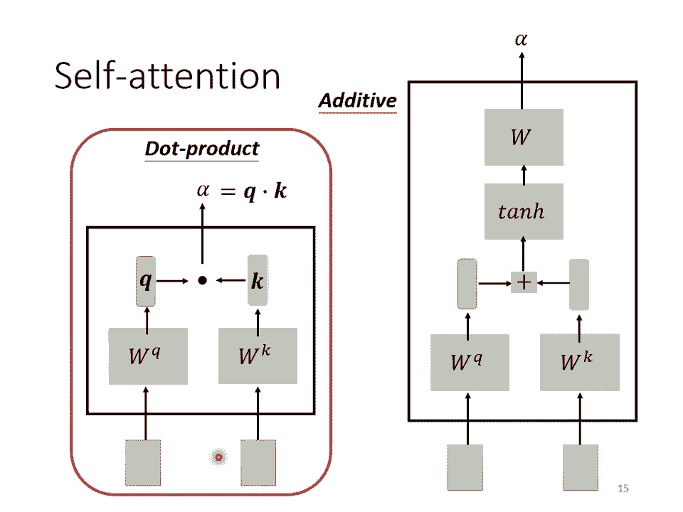

那怎么做呢？你把A one乘上WQ得到Q one。那这个Q有一个名字啊，我们叫做query，它就像是你搜寻引擎的时候去搜寻相关文章的问题，就要搜寻相关文章的关键字。所以这边叫做query。然后接下来呢。

A2A3A4啊，你都要去把它乘上WK得到K这个vector那K这个vector呢有个名字叫做P。那你把这个query啊，Q one跟这个K啊，K two算in就得到阿尔法。

我们这边用阿法一2来代表说呢是呃query是一提供的key是二提供的时候啊，这个一跟2他们之间的关联性。这个我们用阿尔法一2来表示。那这个阿尔法这个关联性呢。

也有一个称号叫做attention的 score，叫做attention的分数。好，那Q one跟K two也就A one跟A2计算出他们的attention的分数计算出他们的关联性以后。

接下来也要跟A3A4来计算。那怎么跟A3A4计算呢？你就把A3乘上WK得到K3得另外个A4乘上WK得K4得到另外个。

然后你再把K3这个key跟Q1这个que做得到一跟三之间的关联性得到一跟三的tention。你把K4跟Q1做得到阿法A4得到一跟4之间的关联。就把A one去计算。

它跟AA3A4的关联这个关联用attion score阿法来表示它。那其实啊一般在实作的时候，Q one也会跟自己算关联性啊。

所以你也要把A one乘上WK得到K one把Q one跟K one去计算它的关联性，自己跟自己计算关联性。那自己跟自己计算关联性这件事情有多重要呢？呃。

你可以自己在做作位的时候试试看看看这件事情的影响大不大。好，那我们计算出呃A one跟每一个向量的关联性以后，接下来啊这边会做一个sph max。

边有点有这边这边这个sofph max啊跟分类的时候的那个sof max是一模一样的。我们就把这边的阿法呢全部乘上expon。然后呢再把expon的值全部加起来做nmalize得到阿法派。

所以so max的输出就是一排阿法派。所以本来有一排阿尔法通过sof max就得到阿尔法。那你可能会问说这边为什么要用s max。刚才你说啊这个分类用sofm，你说有一串道理只是没有讲而已。

那这边有道理吗？这边就没有什么道理这样这边你不一定要用s你可以用别的东西也没问题。比如说有人尝试过说做个路啊，啊，这边通通做个路啊，那结果发现还比sm好一点。

所以这边你不一定要用sofm这边你你要用什么方向都行。哎，你高兴就好，你可以试试看看那sm是最常见的啦。那你可以自己试试看看能问试出比s max更好的结果。好，那得到这个阿尔法判以后。

接下来呢得到这个阿尔法判以后，接下来呀我们就要根据这个阿尔法判去抽取出这个sequence里面重要的资讯。根据这个阿尔法，我们已经知道说哪些向量跟A one是最有关系的。接下来我们要根据这个关联性。

根据这个attion的分数来抽取重要的资讯。怎么抽取重要的资讯呢？我们会把A one到F这边每一个向量乘上WV得到新的向量。那这边分别就是用V one B two V3V4来表示。

接下来啊把这边的V one到V4，每一个向量都去乘上attention的分数都去乘上阿尔法 point，然后呢再把它加起来。我们把式子写在这边，我们就是把这边的每一个V都乘上阿法派得到B one。

那你可以想见说，如果某一个向量，它得到的分数越高，比如说如果A one跟A two的关联性很强。这个阿法派得到值很大。那我们今天在做V上以后得到的BY的值就可能会比较接近B two。所以这边谁的值最大。

谁呃谁的那个attention的分数最大，谁谁的那个V就会dom抽出来的结果。

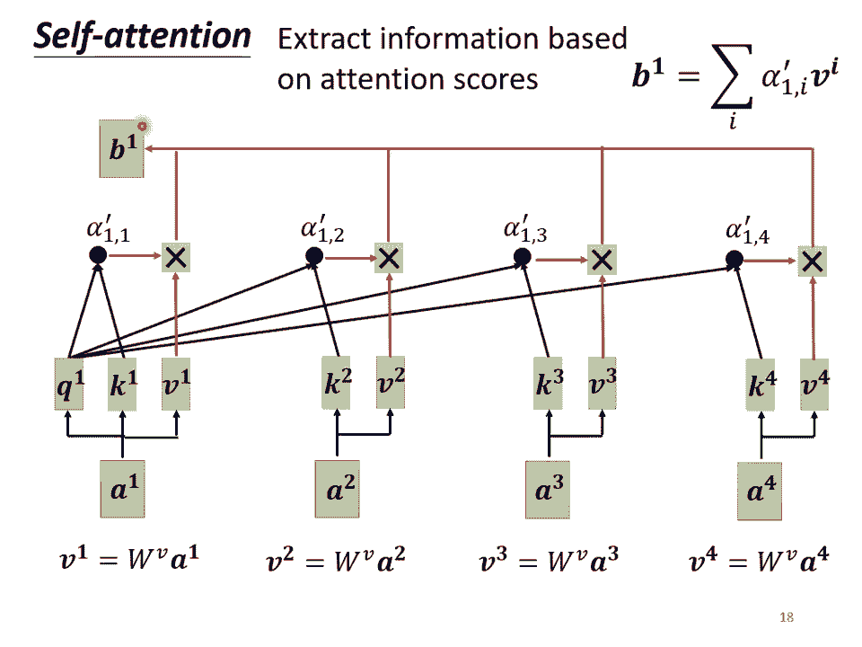

好，所以这边呢我们就讲了怎么从一整个secequ得到B one。