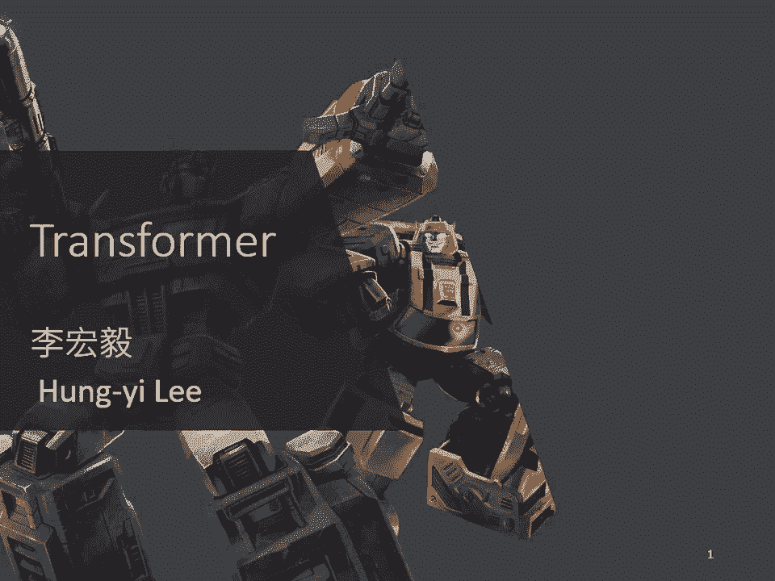
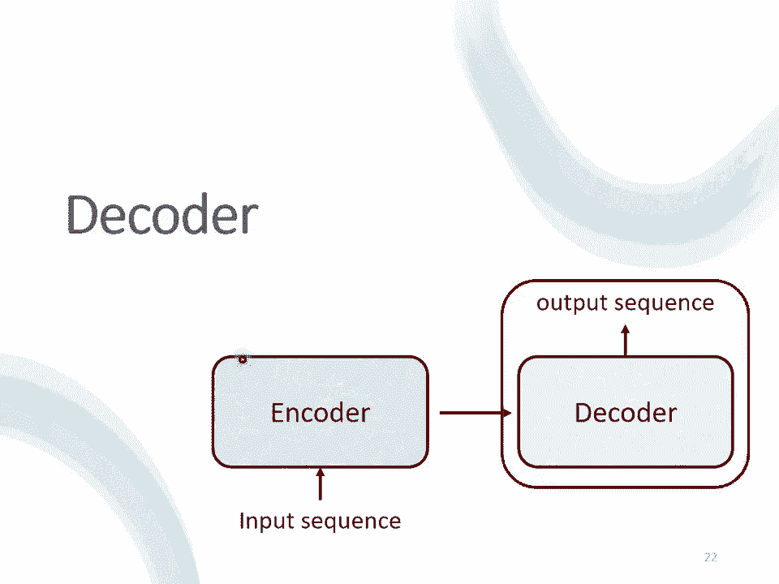

# 【国语+资料下载】李宏毅 HYLEE ｜ 机器学习(深度学习)(2021最新·完整版) - P12：L11.1- Transformer1 - ShowMeAI - BV1fM4y137M4

好，那接下來呢，我們要講這個作業5呢，大家會用上的Transformer，那我們其實在之前已經提了Transformer，提了不下N次，那如果你還不知道Transformer是什麼的話。

Transformer其實就是那個變形金剛，知道嗎？變形金剛的英文呢，就是Transformer。

那Transformer呢，也跟我們之後會提到的Bert有非常強烈的關係，所以這邊有一個Bert探出頭來，代表說Transformer跟Bert是很有關係的，那Transformer是什麼呢？

Transformer就是一個Sequence to Sequence的Model，那Sequence to Sequence的Model呢，它的縮寫我們會寫作Seq to Seq。

那Sequence to Sequence的Model又是什麼呢？我們之前在講Input是一個Sequence的Case的時候，我們說Input是一個Sequence，那Output呢，有幾種可能？

一種是Input跟Output的長度一樣，那這個是在作業2的時候做的，那有一個Case是這個Output只Output一個東西，那這個是在作業4的時候做的。

那接下來作業5的Case是我們不知道應該要Output多長，由機器自己決定Output的長度，好，那有什麼樣的例子，有什麼樣的應用。

是我們需要用到這種Sequence to Sequence的Model，也就是Input是一個Sequence，Output是一個Sequence，但是我們不知道Output應該有的長度。

應該要由機器來自己決定Output長度有什麼樣的應用呢？舉例來說，一個很好的應用就是語音辨識，在做語音辨識的時候，輸入是聲音訊號，那我們在這門課裡面已經看過好多次說輸入的聲音訊號。

其實就是一串的Vector，輸出是什麼？輸出是語音辨識的結果，也就是輸入的這段聲音訊號所對應的文字，我們這邊用圈圈來代表文字，每一個圈圈就代表比如說中文裡面的一個方塊字。

那今天輸入跟輸出的長度當然是有一些關係，但是卻沒有絕對的關係，我們說輸入的聲音訊號它的長度是大T，我們並沒有辦法知道說根據大T輸出的長度N一定是多少，那怎麼辦呢？由機器自己決定。

由機器自己去聽這段聲音訊號的內容，自己決定它應該要輸出幾個文字，它輸出的語音辨識結果輸出的句子裡面應該包含幾個字，由機器自己來決定，這個是語音辨識，還有很多其他的例子，比如說作業5我們會做機器翻譯。

讓機器讀一個語言的句子輸出另外一個語言的句子，那在做機器翻譯的時候輸入的文字的長度是N，輸出的句子的長度是N'，那N跟N'之間的關係也要由機器自己來決定。

我們說輸入機器學習這個句子輸出是Machine Learning，那這個輸入是有四個字輸出有兩個英文的詞彙，但是並不是所有中文跟英文的關係都是輸出就是輸入的二分之一。

到底輸入一段句子輸出英文的句子要多長由機器自己決定，甚至你可以做更複雜的問題比如說做語音翻譯，什麼叫做語音翻譯，語音翻譯就是你對機器說一句話比如說Machine Learning，它輸出的不是英文。

它直接把它聽到的英文的聲音訊號翻譯成中文，你對它說Machine Learning它輸出的是機器學習，那你可能會問說為什麼我們要做Speech Translation這樣的任務呢。

為什麼我們不說我們直接做一個語音辨識再做一個機器翻譯，把語音辨識系統跟機器翻譯系統接起來就直接是語音翻譯呢，那是因為其實世界上有很多語言它根本連文字都沒有，世界上有超過7000種語言。

那其實在這7000種語言有超過半數其實是沒有文字的，對這些沒有文字的語言而言，你要做語音辨識可能根本就沒有辦法，因為它沒有文字啊，所以你根本就沒有辦法做語音辨識，但我們有沒有可能對這些語言做語音翻譯。

直接把它翻譯成我們有辦法閱讀的文字呢，一個很好的例子也許就是台語的語音辨識，但我不會說台語沒有文字啦，很多人覺得台語是有文字的，但台語的文字並沒有那麼普及，如果現在聽說小學都有教台語的文字了。

但台語的文字並不是一般人能夠看得懂的，所以如果你做語音辨識你給機器一段台語，然後它可能輸出是母湯，那你根本就不知道這個段話在說什麼對不對，所以我們期待說機器也許可以做翻譯，做語音的翻譯對它講一句台語。

它直接輸出的是同樣意思的中文的句子，那這樣一般人就可以看得懂，那有沒有可能做到這件事呢，有沒有可能訓練一個類神經網路，這個類神經網路聽某一種語言的聲音訊號，輸出是另外一種語言的文字呢，其實是有可能的。

那對於台語這個例子而言，我們知道說今天你要訓練一個Neural Network，你就需要有Input跟Output的Pair，你需要有台語的聲音訊號跟中文文字的對應關係，那這樣的資料好不好收集呢。

這樣子的資料並不是沒有可能收集的，比如說YouTube上面有很多的鄉土句，那叫鄉土句就是台語語音中文字幕，所以你只要把他的台語語音載下來，中文字幕載下來，你就有台語聲音訊號跟中文之間的對應關係。

你就可以硬Train一個模型，你就可以Train我們剛才講，我們等一下要講的Transformer，然後叫機器直接做台語的語音辨識，輸入台語輸出中文，好那你可能會覺得這個想法很狂。

而且好像聽起來有很多很多的問題，那我們實驗室就載了1500個小時的鄉土句的資料啦，然後呢就真的拿來訓練一個語音辨識系統啦，那你可能會覺得說這聽起來有很多的問題，舉例來說這個鄉土句有很多的雜訊啊。

有很多的音樂啊，就不要管他這樣子，然後這個鄉土句的字幕不一定跟聲音有對起來啊，就不要管他這樣子，然後你可能會想說台語不是還有一些，比如說台羅拼音啊，台語也是有類似音標這種東西。

也許我們可以先辨識成音標當作一個中介，然後再從音標轉成中文，也沒有這樣做，直接訓練一個模型，輸入是聲音訊號，輸出直接就是中文的文字，這種沒有想太多，直接資料倒進去，就訓練一個模型的行為呢。

就叫做硬勸一發，知道嗎，那你可能會想說這樣子硬勸一發，到底能不能夠做一個台語語音辨識系統呢，其實還真的是有可能的，以下是一些真正的結果啦，那機器在聽了1500個小時的這個鄉土句以後啊。

你可以對他輸入一句台語，然後他就輸出一句中文的文字，以下是真正的例子啦，機器聽到的聲音是這樣子的，那你可以做一下台語的語音聽力測驗，看看你辨識出來的跟機器是不是一樣的，機器聽到這樣的句子。

機器輸出是什麼呢，他的輸出是你的身體撐不住，這個聲音訊號是你身體不堪，但機器並不是輸出無堪，而是他就輸出撐不住，或者是機器聽到的是這樣的聲音訊號，沒台沒字你是怎樣要清港，機器聽到沒台沒字。

他並不是輸出沒代沒字，他是輸出沒事這樣，只要聽到四個音節沒台沒字，但他知道說台語的沒台沒字翻成中文，也許應該輸出沒事，所以機器的輸出是沒事你為什麼要請假，但機器其實也是蠻容易犯錯的啦。

以下特別找幾個犯錯的例子給你聽一下，比如說你聽聽這段聲音訊號，他說要生喔，我自己聽到的時候我覺得，我跟機器的答案是一樣，就是說要生了嘛，但其實這句話正確的答案就是，不會生喔，不會膩嘛，但機器在倒裝。

你知道有時候你從台語轉成中文，句子需要倒裝，在倒裝的部分感覺就沒有太學起來，舉例來說他聽到這樣的句子，他說我有跟廠長拜託，那機器的輸出是我有幫廠長拜託，但是你知道說這句話其實是倒裝，我有跟廠長拜託。

是我拜託廠長，但機器對他來說如果台語跟中文的關係，卻需要倒裝的話，看起來學習起來還是有一點困難，這個例子想要告訴你說，直接台語聲音訊號轉繁體中文，不是沒有可能是有可能可以做得到的。

那其實台灣有很多人都在做台語的語音辨識啦，如果你想要知道更多關於台語語音辨識的事情的話，可以看一下下面這個網站，好那台語語音辨識反過來，就是台語的語音合成對不對，我們如果是一個模型。

輸入台語聲音輸出中文的文字，那就是語音辨識，反過來輸入文字輸出聲音訊號，就是語音合成，這邊呢就是demo一下台語的語音合成，這個資料用的是台灣水蝦的資料，那你只要google台灣水蝦。

就可以找到這個資料集，裡面就是台語的聲音訊號，那聽起來像是這個樣子，比如說你跟他說，歡迎來到台灣台大語音處理實驗室，不過這邊是需要跟大家說明一下，現在還沒有真的做end to end的模型。

這邊模型還是分成兩節，他會先把這個中文的文字，轉成台語的台羅拼音，就像是台語的KK音標，再把台語的KK音標轉成聲音訊號，不過從台語的KK音標轉成聲音訊號這一段。

就是一個像是transformer的network，其實是一個叫做techochrome的model，他本質上就是一個sequence to sequence的model，大概長的是這個樣子。

所以你輸入文字，歡迎來到台大語音處理實驗室，機器的輸出是這個樣子，歡迎來到台大語音處理實驗室，或者是你對他說這一句中文，然後他輸出的台語是這個樣子，最近氣氛很嚴重，會一直嘴暗常洗手，不然就要看醫生。

所以你真的是可以，合出台語的聲音訊號的，就用我們在這一門課裡面學到的transformer，或者是sequence to sequence的model，好那剛才講的是跟語音比較有關的。

那在文字上也可以很廣泛的，使用了sequence to sequence的model，舉例來說你可以用sequence to sequence的model，來訓練一個聊天機器人，那你知道聊天機器人。

就是你對他說一句話，他要給你一個回應，輸入輸出都是文字，文字就是一個factor sequence，所以你完全可以用sequence to sequence的model，來做一個聊天機器人。

那怎麼訓練一個聊天機器人呢，你就要收集大量人的對話，那像這種對話你可以收集那個，電視劇、電影的台詞等等，你可以收集到一堆人跟人之間的對話，那假設在對話裡面有出現，某一個人說hi，另外一個人說hello。

 how are you today，那你就可以教機器說，看到輸入是hi，那你的輸出就要跟，hello， how are you today，越接近越好。

那就可以訓練一個sequence to sequence的model，然後跟他說一句話，他就會給你一個回應，那事實上sequence to sequence的model，在NLP的領域。

在NLP的領域的使用，是比你想像的更為廣泛，那其實呢，很多NLP的任務，都可以想成是question answering，QA的任務，怎麼說呢，所謂的question answering就是。

給機器讀一段文字，然後你問機器一個問題，希望他可以給你一個正確的答案，而很多你覺得跟question answering，沒什麼關係的任務，都可能可以想像成是QA，怎麼說呢，舉例來說。

假設你今天想做的是翻譯，那機器讀的文章，就是一個英文的句子，問題是什麼，問題就是，這個句子的德文翻譯是什麼，然後輸出的答案就是德文，或者是，你想要叫機器自動做摘要，摘要就是給機器讀一篇長的文章。

叫他把長的文章的重點，節錄出來，那你就是給機器一段文字，然後問題是，這段文字的摘要是什麼，然後期待他就可以輸出一個摘要，或者是你想要叫機器做，sentiment analysis。

什麼是sentiment analysis呢，就是機器要自動判斷一個句子，是正面的還是負面的，那像這樣子的應用在，假設你有做了一個產品，然後上線以後，你想要知道網友的評價，但是你又不可能一直找人。

在PTT上把每篇文章都讀過，所以怎麼辦，你就做一個sentiment analysis的model，看到有一篇文章裡面，有提到你的產品，然後就把這篇文章丟到你的model裡面。

去判斷說這篇文章是正面還是負面，那怎麼把sentiment analysis，這個問題看成是QA的問題呢，你就給機器，你要判斷正面還是負面的文章，那你的問題就是，這個句子是正面還是負面的。

然後希望機器可以告訴你答案，所以各式各樣的NLD的問題，往往都可以看作是QA的問題，而QA的問題，又可以用sequence to sequence的model來解，那QA的問題。

怎麼用sequence to sequence的model來解呢，就是有一個sequence to sequence的model，輸入就是問題跟文章把它接在一起，輸出就是問題的答案，就結束了。

有問題加文章合起來，是一段很長的文字嘛，答案是一段文字嘛，那sequence to sequence的model，只要是輸入一段文字，輸出一段文字，只要是輸入一個sequence。

輸出一個sequence，就可以解，所以你可以把QA的問題，硬是用sequence to sequence的model解，叫他讀一篇文章，讀一個問題，然後就直接輸出答案，所以這樣子的。

所以各式各樣的NLP的任務，其實都有機會使用sequence to sequence的model，但是我這邊必須要強調一下，對多數NLP的任務，或對多數的這個語音相關的任務而言。

往往為這些任務特製化模型，你會得到更好的結果，就什麼問題都用sequence to sequence的model，就好像說，你不管是做什麼事情，都用瑞士刀一樣，對不對，瑞士刀可以做各式各樣的問題。

砍柴也可以用瑞士刀，切菜也可以用瑞士刀，但是他不見得是一個最好用的，所以如果你為各式各樣不同的任務，客製化各式各樣的模型，往往可以得到比單用sequence to sequence的model。

更好的結果，但是各個任務客製化的模型，就不是我們這一門課的重點了，如果你對人類語言處理，包括語音，包括自然語言處理，這些相關的任務有興趣的話，可以參考一下以下課程網頁的連結，就是去年上的這個。

深度學習與人類語言處理，這一門課的內容，裡面就會教你各式各樣的任務，最好的模型應該是什麼，舉例來說，在做語音辨識，我們剛才講的是一個sequence to sequence的model。

輸入一段聲音訊號，直接輸出文字，今天啊，Google的Pixel 4，Google官方也告訴你說，Pixel 4也是用一個end-to-end的neural network。

Pixel 4裡面就是有一個neural network，輸入聲音訊號，輸出就直接是文字，但它其實用的不是sequence to sequence的model。

它用的是一個叫做RNN Transducer的model，像這些模型，它就是為了語音的某些特性所設計，所以其實可以表現得更好，至於每一個任務，有什麼樣客製化的模型，這個就是另外一門課的主題。

就不是我們今天想要探討的重點，好 那我剛才講了很多sequence to sequence model，在語音還有自然語言處理上的應用，其實有很多應用。

你不覺得它是一個sequence to sequence的model的問題，但你都可以應用sequence to sequence的model的問題，硬解它，舉例來說，文法剖析，文法剖析要做的事情就是。

給機器一段文字，比如說deep learning is very powerful，機器要做的事情是產生一個文法的剖析術，告訴我們說，deep+learning合起來是一個名詞片語。

然後very+powerful合起來是一個形容詞片語，這個形容詞片語加意思以後會變成一個動詞片語，動詞片語加名詞片語合起來是一個句子，那文法剖析要做的事情。

就是產生這樣子的一個parsing的treat，所以在文法剖析的任務裡面，假設你想要deep+learning解的話，輸入是一段文字，它是一個sequence，但輸出看起來不像是一個sequence。

輸出是一個樹狀的結構，但事實上一個樹狀的結構，可以硬是把它看作是一個sequence，怎麼說呢，這個樹狀結構可以對應到一個這樣子的sequence，從這個sequence裡面。

你也可以看出這個樹狀的結構，有一個S，有一個左括號，有一個右括號，然後S裡面有一個non-phrase，有一個左括號，有一個右括號，NP裡面有一個NP，也有一個左括號，也有一個右括號。

然後NP裡面有ease，然後有這個形容詞片語，它有一個左括號，有一個右括號，這一個sequence，它就代表了這一個treat的structure。

你先把treat的structure轉成一個sequence以後，你就可以用sequence to sequence的model，硬解它。

你就train一個sequence to sequence的model，讀這個句子，然後直接輸入這一串文字，再把這串文字轉成一個樹狀的結構。

你就可以硬是用sequence to sequence的model，來做文法剖析這件事，這個概念聽起來非常的狂，但這還是，這是真的可以做得到，你可以讀一篇文章。

叫做Grammar as a Foreign Language，那這篇文章其實不是太新的文章，你會發現它放到archive上面的時間，是14年的年底，所以其實也是一個上古神獸等級的文章。

那在這篇文章問世的時候，那個時候sequence to sequence的model還不流行，那時候sequence to sequence的model，主要只有被用在翻譯上。

所以這篇文章的title才會取說，Grammar as a Foreign Language，就是說它把這個文法剖析這件事情，當作是一個翻譯的問題，把文法當作是另外一種語言，直接套用一個當時人們認為。

只能用在翻譯上的模型，硬做，結果它得到state of the art的結果，那我其實在國際會議的時候，其實有遇過這個第一作者，有遇過這個Oriel Vineyard。

然後那個時候sequence to sequence的model，還是一個非常潮的東西，然後那時候在我的認知裡面，我覺得這個模型應該是挺難train的，我問他說。

這個train這種sequence to sequence的model，有沒有什麼tips啊，沒想到你這個做個文法剖析，用sequence to sequence的model。

居然可以硬做到state of the art，這應該有什麼很厲害的tips吧，他說沒有什麼tips，他說我連addon都沒有用，我直接gradient descent就train起來了。

我第一次train就成功了，只是我要train到state of the art，還是稍微調了一下參數而已，我也不知道是真的還假的啦，不過今天sequence to sequence的model。

真的是已經被很廣泛的，應用在各式各樣的應用上了，那還有一些任務可以用sequence to sequence的model，舉例來說multi-label的classification。

什麼是multi-label的classification呢，這邊你要比較一下multi-class的classification，跟multi-label的classification。

multi-class的classification跟multi-label的classification，聽起來名字很像，但他們其實是不一樣的事情。

multi-class的classification意思是說，我們有不只一個class，機器要做的事情是從數個class裡面，選擇某一個class出來。

但是multi-label的classification意思是說，同一個東西它可以屬於多個不只一個class，舉例來說你在做文章分類的時候，可能這篇文章屬於class1跟3。

這篇文章屬於class3、9、10、11等等，那你可能會說，這種multi-label classification的問題，要怎麼解呢。

能不能直接把它當作一個multi-class classification的問題來解呢，舉例來說，我把這些文章丟到一個classifier裡面，那本來classifier只會輸出一個答案嘛。

輸出分數最高的那個答案，我現在就輸出分數最高的前三名，看看能不能解multi-label classification的問題，但這種方法呢，可能是行不通的，為什麼。

因為每一篇文章對應的class的數目根本不一樣啊，有些文章對應的class的數目是兩個，有的是一個有的是三個，所以如果你說，我直接取一個threshold，我直接取分數最高的前三名。

classifier output的分數最高的前三名，來當作我的輸出，顯然不一定能夠得到好的結果，那怎麼辦呢，這邊可以用sequence to sequence 映作，你知道嗎，輸入一篇文章。

輸出就是class，就結束了，機器自己決定，它要輸出幾個class，我們說sequence to sequence model，就是機器自己決定，輸出幾個東西。

輸出的output sequence的長度是多少，那既然你沒有辦法決定class的數目，怎麼辦，機器幫你決定，它自己決定，每一篇文章要屬於多少個class，或者是object detection。

這個看起來跟sequence to sequence model，應該八竿子打不著的問題，它也可以用sequence to sequence model，硬解啊。

object detection就是給機器一張圖片，然後它要把圖片裡面的物件框出來，它要框出說這個是斑馬，這個也是斑馬，這個也是斑馬，這種問題可以用sequence to sequence映作。

至於怎麼做，我們這邊就不細講，我這邊放了一篇文獻，放一個連結給大家參考，好那講這麼多，就是要告訴你說sequence to sequence model，它是一個很powerful的model。

它是一個很有用的model，那我們現在就是要來學，怎麼做sequence to sequence這件事，好那一般的sequence to sequence model，它裡面會分成兩塊。

一塊是encoder，另外一塊是decoder，你input一個sequence，由encoder負責處理這個sequence，再把處理好的結果丟給decoder，由decoder決定。

它要輸出什麼樣的sequence，那等一下我們都還會再細講，encoder跟decoder內部的架構，那sequence to sequence model的起源，其實非常的早，在14年的9月。

就有一篇sequence to sequence model，用在翻譯的文章，被放到archive上，那你可以想像，當時的sequence to sequence model，看起來還是比較陽春的。

那今天講到sequence to sequence model的時候，大家第一個會浮現在腦中的，可能都是我們今天的主角，也就是transformer，它有一個encoder的架構。

有一個decoder的架構，裡面有很多花花綠綠的block，那等一下就會講一下，這裡面每一個花花綠綠的block，分別在做的事情是什麼，那接下來呢，我們就來講encoder的部分。

那sequence to sequence model，encoder要做的事情呢，就是給一排向量，輸出另外一排向量，那給一排向量，輸出一排向量這件事情，很多模型都可以做到，那可能第一個想到的是。

我們剛講完的self-attention，那其實不只是self-attention，RNN CNN其實也都能夠做到，in-pre-排向量，output另外一個同樣長度的向量。

那在transformer裡面，transformer的encoder，用的就是self-attention，那這邊看起來有點複雜，我們用另外一張圖呢，來仔細的解釋一下，這個encoder的架構。

等一下呢，再來跟這個原始的transformer的論文裡面的圖呢，進行比對，那現在的encoder裡面，會分成很多很多的block，每一個block都是，輸入一排向量，輸出一排向量。

你輸入一排向量到第一個block，第一個block輸出另外一排向量，再輸給另外一個block，到最後一個block，會輸出最終的vector sequence，那每一個block，其實並不是NN的一層。

這邊之所以不稱說，每一個block是一個layer，是因為每一個block裡面做的事情，是好幾個layer在做的事情，在transformer的encoder裡面，每一個block做的事情。

大概是這樣子的，先做一個self-attention，input一排vector以後呢，做self-attention，考慮整個sequence的資訊，output另外一排vector。

接下來這一排vector啦，會再丟到，fully connected的free-forward network裡面，丟到fully connected的network裡面。

再output另外一排vector，這一排vector就是block的輸出，那事實上在原來的transformer裡面呢，他做的事情是更複雜的，實際上做的事情是這個樣子的。

這是self-attention的layer，在我們剛才講self-attention的時候，我們說輸入一排vector，就輸出一排vector，這邊的每一個vector。

他是考慮了所有的input以後，所得到的結果，在transformer裡面呢，他加入了一個設計，是說我們不只是輸出這個vector，我們還要把這個vector呢，加上他的input。

他會把input拉過來，直接加給輸出，得到新的output，也就是說這邊假設這個vector叫做A，這個vector叫做B，你會把AB加起來，當作是新的輸出，那這件事情呢，這樣子的network架構啊。

叫做residual connection，那其實這種residual connection，在deep learning的領域，用的是非常的廣泛啦，之後如果我們有時間的話，再來詳細介紹。

為什麼要用residual connection，那你現在就先知道說，有一種connection，有一種network的設計的架構，叫做residual connection。

他會把input直接跟output加起來，得到新的vector，而得到這個residual的這個結果以後呢，再把他做一件事情，叫做normalization。

那這邊用的不是batch normalization，這邊用的叫做layer normalization，那layer normalization做的事情呢。

比batch normalization更簡單一點，layer normalization做的事情是這個樣子的，輸入一個向量，輸出另外一個向量，這邊不需要考慮batch。

剛才在講batch normalization的時候，需要考慮batch，但這邊這個layer normalization，不用考慮batch的資訊，輸入一個向量，輸出另外一個向量。

那這個layer normalization，做的事情是什麼呢，他會把輸入的這個向量，計算他的mean跟standard deviation，但是要注意一下。

剛才在講batch normalization的時候，我們是對同一個dimension，不同的feature，我們是對不同example，不同的feature的同一個dimension。

去計算mean跟standard deviation，但layer normalization，他是對同一個feature，同一個example裡面，不同的dimension。

去計算mean跟standard deviation，那計算出mean跟standard deviation以後呢，你就可以做一個normalize，output的這邊的每一個vector呢。

就是把原來input的vector，我發現這邊有一個bug，這個bug是什麼呢，這個bug就是這邊不需要prime，不好意思，記得把這個prime拿掉，這邊不需要prime，把input的vector。

input的這個vector裡面，每一個dimension，減掉end減掉mean，再處理standard deviation以後，得到x'，就是layer normalization的輸出。

那得到layer normalization的輸出以後呢，他的這個輸出啊，才是fully connected network的輸入，而fully connected network這邊。

也有residual的架構，所以我們會把fully connected network的input，跟他的output加起來，做一下residual，得到新的輸出。

這個才是transformer encoder裡面，一個bug的輸出，這邊還有一件事情是漏講了，這個fully connected network，做完residual以後，還不是結束。

你要把這個residual的結果呢，再做一次layer normalization，這邊已經做過一次了，這邊還要再做一次，得到的輸出，才是residual network裡面，一個bug的輸出。

所以這個是挺複雜的，所以我們這邊講的這個圖啊，其實就是我們剛才講的那件事情啦，首先呢，你有self-attention，然後其實在input的地方呢，還有加上positional encoding。

我們之前已經有講過說，如果你只光用self-attention，你沒有位置的資訊，所以你需要加上，positional的information，然後在這個圖上呢。

有特別畫出positional的information，那這一塊呢，他這邊寫一個multi-head attention，那這個就是self-attention的bug啦，那這邊有特別強調說。

他是multi-head self-attention，那這邊有一個add and none，add and none是什麼意思呢，就是residual加layer normalization的意思。

我們剛才有說self-attention，有加上residual的connection，接下來還要過layer normalization，這邊這個圖上的add and none。

就是residual加layer none的意思，然後接下來呢，這邊要過free-forward network，fully-connected free-forward network。

以後再做一次add and none，再做一次residual加layer none，才是一個bug的輸出，然後這個bug會重複N次，那這個複雜的bug啊，其實在之後會講到的。

一個非常重要的模型BERT裡面，會再用到，那BERT他其實就是，transformer的encoder，那講到這邊呢，你心裡一定充滿了問號，就是為什麼這個transformer的encoder。

要這樣設計呢，不這樣設計行不行呢，行！不一定要這樣設計，這個encoder的neural架構，現在這個設計的方式，我是按照原始的論文講給你聽的，那原始論文的設計，並不代表它是最好的。

最optimal的設計，舉例來說有一篇文章叫，on layer normalization in the transformer architecture，他問的問題就是。

為什麼layer normalization，是放在那個地方呢，為什麼我們是先做residual，再做layer normalization呢，能不能夠把layer normalization。

放到每一個block的input，也就是你做residual以後，再做layer normalization，再加進去，你可以看到說左邊這個圖，是原始的transformer，右邊這個圖。

是稍微把block，更換一下順序以後的transformer，然後更換一下順序以後，結果是會比較好的，所以這就代表說，原始的transformer的架構，並不是一個最optimal的設計。

你永遠可以思考看看，有沒有更好的設計方式，那再來還有一個問題就是，為什麼是layer norm，為什麼是別的，不是別的為什麼不做batch normalization，那也許這篇文章可以回答你的問題。

這篇文章是power norm，rethinking batch normalization in transformer，他首先告訴你說，為什麼batch normalization。

不如layer normalization，那接下來再說，他提出了一個power normalization，一聽就是很power的意思，就可以比layer normalization。

還要performance差不多，甚至好一點，好，因為已經快六點了，我想decoder的部分，我們是不太可能講完，所以也許我們先停在這邊好了，看看大家有沒有問題想要問的，看大家有沒有問題想要問的。

有什麼話要說嗎？