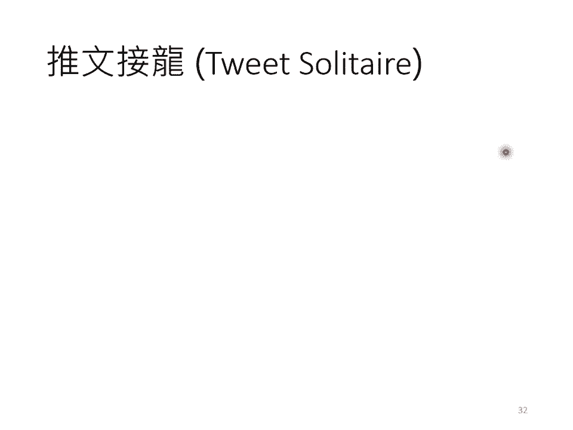
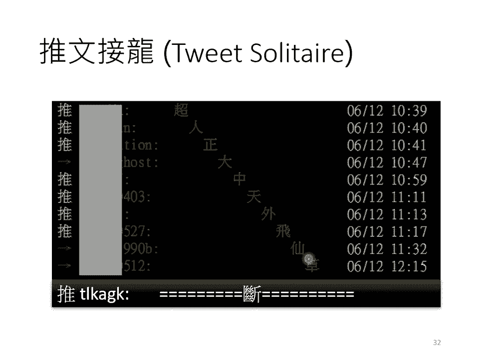
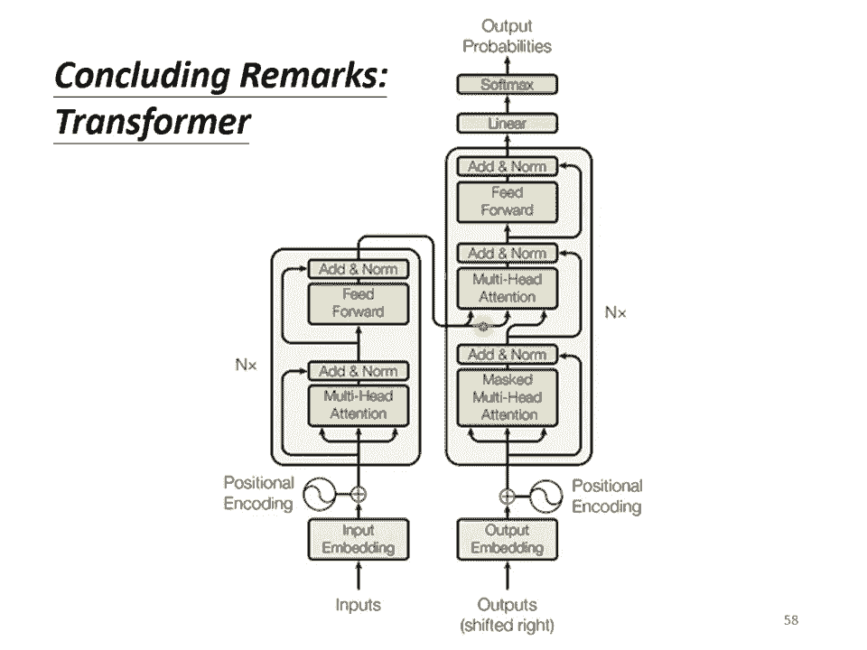

# 【国语+资料下载】李宏毅 HYLEE ｜ 机器学习(深度学习)(2021最新·完整版) - P13：L11.2- Transformer2 - ShowMeAI - BV1fM4y137M4

各位同學大家好，我們來上課吧！接下來我們要講Decoder，我們上上週已經講了Encoder，接下來我們要講Decoder，Decoder其實有兩種，等一下會花比較多時間介紹你比較常見的。

這個叫做Auto-Regressive的Decoder，這個Auto-Regressive的Decoder是怎麼運作的呢？等一下我們是用語音辨識來當作例子跟大家說明。

不過用在作業裡面的機器翻譯其實是一模一樣的，你只是把輸入輸出改成不同的東西而已，語音辨識是怎麼做的呢？你知道語音辨識就是輸入一段聲音輸出一串文字，你會把一段聲音輸入給Encoder。

比如說你對機器說機器學習，機器收到一段聲音訊號，聲音訊號進入Encoder以後，輸出會是什麼呢？輸出會變成一排Vector，那我們上週花了很多時間講Encoder裡面有什麼樣的內容，它裡面非常的複雜。

如果你忘了的話就算了，你就記得Encoder做的事情就是輸入一個Vector Sequence輸出另外一個Vector Sequence，接下來就輪到Decoder運作了。

Decoder要做的事情就是產生輸出，接下來輪到Decoder產生語音辨識的結果，Decoder怎麼產生語音辨識的結果呢？Decoder做的事情就是把Encoder的輸出先讀進去，至於怎麼讀進去。

這個我們等一下再講，你先假設商號就是有某種方法把Encoder的輸出讀到Decoder裡面，這部我們等一下再處理，Decoder怎麼產生一段文字呢？語音辨識機器的輸出就是一段文字。

Decoder怎麼產生一段文字呢？首先你要先給它一個特殊的符號，這個特殊的符號代表開始，在助教投影片裡面是寫Begin of Sentence，所寫是BOS，我這邊因為怕你知道BOS是什麼。

所以我就把它的意思明確的寫出來，就是開始，就是Begin的意思，這個是一個Special的Token，就是在你的Lesson裡面，就是在你本來Decoder可能產生的文字裡面，多加一個特殊的符號。

多加一個特殊的字，這個字就代表了Begin，代表了開始這個事情，所以Decoder就吃到這個特殊的符號，那在這個機器學習裡面，假設你要處理NLP的問題。

每一個Token你都可以把它用一個One-Hot Factor來表示，One-Hot Factor就其中一位是1，其他都是0，所以Begin也是用One-Hot Factor來表示，其中一位是1。

其他是0，那接下來Decoder會吐出一個向量，這個向量裡面有什麼呢？這個Vector裡面有什麼呢？這個Vector的長度，它很長，它的長度跟你的Vocabulary的Size是一樣的。

這邊的Vocabulary指的是什麼意思呢？你就先想好說你的Decoder輸出的單位是什麼，假設我們今天做的是中文的語音辨識，我們Decoder輸出的是中文。

那你這邊的Vocabulary的Size可能就是中文的方塊字的數目，那中文的方塊字有多少呢？不同的字典給你的數字可能是不一樣的，常用的中文的方塊字大概兩三千個，一般人可能認得的四五千個。

再更多都是罕見字，冷屁的字，你可能看到也不知道它要怎麼念，你平常寫也寫不出來，所以你就看看說你要讓你的Decoder輸出哪些可能的中文的方塊字，你就把它列在這邊，舉例來說。

你覺得這個Decoder能夠輸出常見的三千個方塊字就好了，你就把它列在這個地方，那不同的語言，它輸出的單位不會不一樣，這個取決於你對那個語言的理解，比如說英文，你可以選擇輸出字母，A到Z輸出英文的字母。

但你可能會覺得字母這個單位太小了，那有人可能會選擇輸出英文的詞彙，英文的詞彙是用空白作為間隔的，但如果用詞彙當作輸出又太多了，所以你會發現剛才在助教投影片裡面，助教說他是用Subword當作英文的單位。

所以有一些方法可以把英文的字首字根切出來，拿字首字根當作單位，那如果中文的話呢，我覺得就比較單純，通常今天你可能就用中文的方塊字來當作單位，那在這個項量裡面，這個項量的長度就跟中文裡面的方塊字。

你希望機器可以輸出的方塊字的數目是一樣多的，那每一個中文的字都會對應到一個數值，那因為在產生這個項量之前，你通常會先跑一個Solve Max，就跟做分類一樣。

在得到最終的輸出前我們不是會跑一個Solve Max嗎？跑一個Solve Max，所以這個項量裡面的分數啊，它是一個distribution，也就是它這個項量裡面的值呢，它全部加起來總和會是1。

那得到這個項量以後，還不是最終輸出的結果，這個項量會給每一個中文的字一個分數，那分數最高的那個中文字，它就是最終的輸出，那在這個例子裡面，機的分數最高，所以機就當作是這個Decoder第一個輸出。

接下來，你把機當作是Decoder新的input，原來Decoder的input只有begin這個特別的符號，現在它除了begin以外，它還有機作為它的input，那機呢。

也是表示成一個one-hot vector當作Decoder的輸入，所以Decoder現在還有兩個輸入，一個是begin這個符號，一個是機，根據這兩個輸入呢，它就要得到一個輸出，它輸出一個藍色的項量。

根據這個藍色的項量裡面給每一個中文字的分數，那我們會決定第二個輸出是什麼，誰哪一個字的分數最高，它就是輸出，假如是氣的分數最高，那氣就是輸出，那Decoder接下來會拿氣當作輸入。

然後現在Decoder看到了begin，看到了機，看到了氣，那它接下來還要再決定，接下來要輸出什麼，那它可能就輸出學，那這個過程就反覆地持續下去，機器輸出學以後，學會再被當作輸入。

所以現在Decoder呢，它看到了begin、機、氣、還有學，那encoder這邊其實也有輸入啦，那我們等一下再講encoder的輸入，decoder是怎麼處理的。

所以Decoder看到encoder這邊的輸入，看到機、看到氣、看到學，決定接下來呢，要輸出習，它會輸出一個項量，這個項量裡面，習這個中文字的分數最高的，所以它就輸出習。

這個process就反覆持續下去，那這邊有一個關鍵的地方，我們特別用紅色的虛線把它標出來，也就是說Decoder看到的輸入，其實是它在前一個時間點自己的輸出。

Decoder會把自己的輸出當作接下來的輸入，所以當我們Decoder在產生一個句子的時候，它其實有可能看到錯誤的東西，因為它看到的是自己的輸出嘛，那如果今天Decoder有語音辨識的錯誤。

它把機器的氣辨識錯成天氣的氣，那接下來Decoder就會看到錯誤的辨識結果，它還是要想辦法根據錯誤的辨識結果產生，它想要產生的，期待是正確的輸出，那你可能會覺得說，讓Decoder看到錯誤的輸入。

讓Decoder看到自己產生出來的錯誤的輸入，再被Decoder自己吃進去，會不會造成問題呢？會不會造成Error Propagation的問題呢？

所謂Error Propagation的問題就是一步錯，步步錯，就是在這個地方，如果不小心把機器的氣，不小心寫成天氣的氣，會不會接下來就整個句子都壞掉了，都沒有辦法再產生正確的詞彙了，有可能。

這個等一下我們最後會稍微講一下，這個問題要怎麼處理，我們現在先無視這個問題，繼續走下去，那我們來看一下這個Decoder，它內部的結構長什麼樣子，那我們這邊把Encoder的部分先暫時省略掉。

那在Transformer裡面，Decoder的結構長的是這個樣子的，看起來有點複雜，比Encoder還稍微複雜一點，那我們現在先把Encoder跟Decoder放在一起，稍微比較一下他們之間的差異。

那你會發現說，如果我們把Decoder中間這一塊，中間這一塊，把它蓋起來，其實Encoder跟Decoder並沒有那麼大的差別，你看Encoder這邊，Multi-head attention。

Add and None，V-forward，Add and None，重複N次，Decoder其實也是一樣，當我們把中間這一塊遮起來以後，我們等一下再講遮起來這一塊裡面做了什麼事。

但當我們把中間這一塊遮起來以後，那Decoder也是有一個Multi-head attention，Add and None，V-forward，Add and None。

所以Encoder跟Decoder其實並沒有非常大的差別，除了中間這一塊不一樣的地方，被遮起來的地方以外，其實Encoder跟Decoder是一樣的，那只是最後我們可能會再做一個Solve-max。

使得它的輸出變成一個機率，那這邊有一個稍微不一樣的地方是，在Decoder這邊，Multi-head attention這個block上面，還加了一個Mask，這個Mask是什麼意思呢。

這個Mask的意思是這樣子的，這是我們原來的Self-attention，Input一排Vector，Output另外一排Vector，這一排Vector每一個輸出都要看過完整的Input以後才做決定。

所以輸出B1的時候，其實是根據A1到A4所有的資訊去輸出B1，當我們把Self-attention轉成Mask-attention的時候，它的不同點在哪裡呢，它的不同點是現在我們不能再看右邊的部分。

也就是產生B1的時候我們只能考慮A1的資訊，你不能夠再考慮A2、A3、A4，產生B2的時候你只能考慮A1、A2的資訊，不能再考慮A3、A4的資訊，產生B3的時候你就不能考慮A4的資訊。

產生B4的時候你可以用整個Input-sequence的資訊，這個就是Mask的Self-attention，講得更具體一點，你做的事情是這樣，當我們要產生B2的時候，我們只拿B2的。

我們只拿第二個位置的Query，去跟第一個位置的Key和第二個位置的Key去計算Attention，第三個位置跟第四個位置就不管它，不去計算Attention，我們這樣子不去管A2右邊的地方。

只考慮A1跟A2，只考慮Q1、Q2只考慮K1、K2，Q2只跟K1跟K2去計算Attention，最後只計算B1跟B2的Weighted sum，當我們輸出這個B2的時候，B2就只考慮了A1跟A2。

就沒有考慮到A3跟A4，那為什麼會這樣呢？為什麼需要加Masking呢？這件事情其實非常的直覺，你想想看我們一開始Decoder的運作方式，它是一個一個輸出，它的輸出是一個一個產生的。

所以是先有A1再有A2再有A3再有A4，這跟原來的Self-Attention不一樣，原來的Self-Attention，A1跟A4是一次輸進去你的Model裡面的，在我們講Encoder的時候。

Encoder是一次把A1跟A4整個都讀進去，但是對Decoder而言，先有A1才有A2才有A3才有A4，所以實際上當你有A2，你要計算B2的時候，你是沒有A3跟A4的。

所以你根本就沒有辦法把A3、A4考慮進來，所以這就是為什麼在Decoder的圖上面，Transformer原始的Paper特別跟你強調說，那不是一個一般的Attention。

這是一個Masked Self-Attention，意思只是想要告訴你說Decoder，它的Token，它輸出的東西是一個一個產生的，所以它只能考慮它左邊的東西，它沒有辦法考慮它右邊的東西。

但是講到這裡，我們講了一下Decoder的運作方式，但是這邊還有一個非常關鍵的問題，這個關鍵的問題是Decoder必須自己決定輸出的Sequence的長度。

可是到底輸出的Sequence的長度應該是多少呢？我們不知道，你沒有辦法輕易地從輸入的Sequence的長度，就知道輸出的Sequence的長度是多少，並不是說輸入是四個向量，輸出一定就是四個向量。

這邊在這個例子裡面輸入跟輸出的長度是一樣的，但是你知道實際上在你真正的應用裡面並不是這樣，輸入跟輸出長度的關係是非常複雜的，我們其實是期待機器可以自己學到。

今天給它一個Input Sequence的時候，Output的Sequence應該要多長，但在我們目前的這整個Decoder的運作機制裡面，機器不知道它什麼時候應該停下來，它產生完錫以後。

它還可以繼續重複一模一樣的process，就把錫當作輸入，然後也許Decoder就會接一個罐，然後接下來就一直持續下去，永遠都不會停下來，這讓我想到什麼呢？這讓我想到推文接龍。

我不知道大家知不懂是什麼，這是一個古老的民俗傳統，流傳在PTT上面，這個民俗傳統是怎麼運作的呢？有一個人先推一個中文字，推一個抄，接下來就會有另外一個鄉民去推另外一個字，然後可以接上去的。

就可以產生一排的詞彙、一排字，就是超人、政大、冬天、外飛仙、草尾包再說些什麼，這個process可以持續好幾個月都不停下來，我也不知道為什麼，那怎麼讓這個process停下來呢？要怎麼讓它停下來呢？

要有人冒險去推一個段，推一個段，它就停下來了，所以我們要讓Decoder做的事情也是一樣。

它可以輸出一個段，所以你要準備一個特別的符號，這個符號就叫做段，這邊用END來表示這個特殊的符號，所以除了所有中文的方塊字還有begin以外，你還要準備一個特殊的符號叫做段，其實在助教的程式裡面。

它是把begin跟end，就是開始跟這個段用同一個符號來表示，反正這個begin只會在輸入的時候出現，段只會在輸出的時候出現，所以在助教程式裡面，如果你仔細研究一下的話。

會發現end跟begin用的其實是同一個符號，但你用不同的符號也是完全可以的，也完全沒有問題，所以我們現在呢，這樣Decoder它可以輸出段這個符號，輸出end這個符號，那我們期待說。

當今天產生完習以後，再把習當作Decoder的輸入以後，Decoder就要能夠輸出段，也就是說，當把習當作輸入以後，就Decoder看到encoder輸出的這個embedding，看到了begin。

然後機器學習以後，看到這些資訊以後，它要知道說，這個語音辨識的結果已經結束了，不需要再產生更多的詞彙了，它產生出來的向量裡面，這個end，就是段的那個符號，它的機率必須要是最大的。

然後你就輸出段這個符號，那整個運作的過程，整個Decoder產生sequence的過程，就結束了，好，那這個呢，就是Auto-Regressive的Decoder，它運作的方式，好，那接下來呢。

我們用兩頁投影片，非常簡短的，講一下Non-Auto-Regressive的model，Non-Auto-Regressive的model呢，通常縮寫成NAT。

所以有時候Auto-Regressive的model，也縮寫成AT，Non-Auto-Regressive的model是怎麼運作的呢？這個Auto-Regressive的model是，先輸入begin。

然後出現W1，然後再把W1當作輸入，再輸出W2，直到輸出end的為止，那NAT是這樣，它不是一次產生，就假設我們現在要產生的是中文的句子，它不是一次產生一個字，它是一次把整個句子都產生出來。

怎麼一次把整個句子都產生出來呢？NAT的Decoder啊，它可能吃的是一整排的begin的token，你就把一堆一排begin的token都丟給它，讓它一次產生一排token就結束了，舉例來說。

如果你丟給它四個begin的token，它就產生四個中文的字，變成一個句子，就結束了，一個步驟就可以完成句子的生成，這邊你可能就會問一個問題，剛才不是說不知道要有多，輸出的長度應該是多少嗎？

那我們這邊怎麼知道begin要放多少個，當作NAT Decoder的輸入呢？沒錯，這件事沒有辦法很自然的知道，沒有辦法很直接的知道，所以有幾個做法，一個做法是你另外認一個classifier。

這個classifier呢，它吃encoder的input，然後輸出是什麼？輸出是一個數字，這個數字代表decoder應該要輸出的長度，所以你就認一個classifier。

這個classifier可能吃encoder的input，可能把encoder output的那些項量讀進去，它output一個數字，比如說output4，它output4以後。

NAT的Decoder就會吃到四個begin的token，然後它就產生四個中文的字，這是一種可能的做法，另一種可能的做法就是，你就不管3721，給它一堆begin的token。

你就假設說你現在輸出的句子的長度絕對不會超過300個字，你就假設一個句子長度的上限，然後begin呢，你就給它300個begin，然後就會輸出300個字嘛，然後呢，你再看看說什麼地方輸出了段。

什麼地方呢，輸出end，輸出end的右邊的就當作它沒有輸出，就結束了，這是另外一種處理NAT的Decoder，它應該輸出的長度的方法，那NAT的Decoder它有什麼樣的好處呢，它第一個好處是平行化。

這個AT的Decoder，它在輸出它的句子的時候，是一個一個一個字產生的，所以假設你要輸出長度100個字的句子，那你就需要做100次的Decode，但是NAT的Decoder不是這樣。

不管句子的長度如何，都是一個步驟就產生出完整的句子，所以在速度上，NAT的Decoder它會跑得比AT的Decoder要快，那你可以想像說這個NAT的Decoder的想法。

顯然是在由這個Transformer以後，有這種SELF-ATTENTION的Decoder以後才有的，因為以前如果你是用LSTM，用RNN的話，那你就算給它一排Begin。

它也沒有辦法同時產生全部的輸出，它的輸出還是一個一個產生的，所以在沒有這個SELF-ATTENTION之前，只有RNN，只有LSTM的時候，根本就不會有人想要做什麼NAT的Decoder。

不過自從有了SELF-ATTENTION以後，NAT的Decoder現在就算是一個熱門的研究的主題了，那NAT的Decoder還有另外一個好處就是，你比較能夠控制它輸出的長度，怎麼說呢？

舉語音合成為例好了，其實在語音合成裡面，NAT的Decoder算是非常常用的，它並不是一個什麼稀罕罕見的招數，比如說語音合成今天你都可以用Sequence-to-Sequence的模型來做。

最知名的是一個叫做Tekortron的模型，它是AT的Decoder，那有另外一個模型叫Fast Speech，它是NAT的Decoder，那NAT的Decoder有一個好處就是。

你可以控制你輸出的長度，那我們剛才說，怎麼決定NAT的Decoder輸出多長呢？你可能有一個Classifier，來決定NAT的Decoder應該輸出的長度，那如果在做語音合成的時候。

假設你現在突然想要讓你的系統講快一點，加速，那你就把Classifier的output除以2，它講話速度就變兩倍快，然後如果你想要講話放慢速度，那你就把Classifier輸出的長度。

它predict出來的長度乘兩倍，那你的Decoder說話的速度就變兩倍慢，所以你可以，如果有這種NAT的Decoder，你有explicit的去model output的長度應該是多少的話。

你就比較有機會去控制你的Decoder輸出的長度應該是多少，你就可以做種種的變化，那為什麼NAT的Decoder最近是一個熱門的研究主題呢？它之所以是一個熱門的研究主題就是。

它雖然表面上看起來有種種的厲害之處，尤其是平行化是它最大的優勢，但是NAT的Decoder它的performance往往都不如AT的Decoder，所以發現有很多很多的研究。

試圖讓NAT的Decoder的performance越來越好，試圖去逼近AT的Decoder，不過今天你要讓NAT的Decoder跟AT的Decoder的performance一樣好。

你必須要用非常多的trick才能辦到，就AT的Decoder隨便train一下，NAT的Decoder你要花很多力氣才有可能跟AT的Performance差不多。

那為什麼NAT的Decoder的performance不好呢？有一個問題我們今天就不細講了，叫做Multi-Modality的問題，那如果你想要深入了解NAT。

就把之前助教上課補充的內容連結放在這邊給大家參考，NAT也是一個大坑啊，助教也是講了一個半小時，才稍微給大家一個NAT的大概大致的描述，所以這個大坑不是我們今天可以講的。

就只是告訴大家說世界上有NAT這個東西而已，那接下來呢，我們就要講Encoder跟Decoder他們中間是怎麼傳遞資訊的了，也就是我們要講剛才我們刻意把它遮起來的那一塊，那如果你仔細觀察這一塊的話。

這一塊呢叫做Cross-Attention，它是連接Encoder跟Decoder之間的橋樑，那這一塊裡面啊，你會發現有兩個輸入來自於Encoder，Encoder提供兩個箭頭。

然後Decoder提供了一個箭頭，所以從左邊這兩個箭頭，Decoder可以讀到Encoder的輸出，那這個模組實際上是怎麼運作的呢？我就實際把它運作的過程跟大家展示一下。

這個是你的Encoder輸入一排向量，輸出一排向量，我們叫它A1、A2、A3，接下來呢，輪到你的Decoder，你的Decoder呢，會先吃Begin當作Begin這個Special的Token。

那Begin這個Special的Token讀進來以後，你可能會經過Self-Attention，這個Self-Attention是有做Mask的，然後得到一個向量。

就像Self-Attention就算是有做Mask，還是一樣輸入多少長度的向量，輸出就是多少向量，所以輸入一個向量，輸出一個向量，然後接下來把這個向量呢，乘上一個矩陣，做一個Transform。

得到一個Query叫做Q，然後這邊的A1、A2、A3呢，也都產生Key，Key1、Key2、Key3，那把這個Q跟K1、K2、K3，去計算Attention的分數，得到α1、α2、α3。

當然你可能一樣會做Self-Mask，把它稍微做一下Normalization，所以我這邊加一個π，代表它可能是做過Normalization，接下來再把α1、α2、α3，乘上V1、V2、V3。

再把它Weighted上加起來，你得到V，那這個V啊，就是接下來會丟到，Fully Connected的Network，做接下來的處理，那這個步驟，就是Q來自於Decoder。

K跟V來自於Encoder，這個步驟就叫做Cross-Attention，所以Decoder，就是憑藉著產生一個Q，去Encoder這邊抽取資訊出來，當作接下來的，Decoder裡面的。

Fully Connected Network的Input，好，那這個就是，Cross-Attention的運作的過程，當然，就現在假設產生，第一個中文的字產生一個G，接下來的運作也是一模一樣的。

輸入begin，輸入G產生一個向量，這個向量一樣乘上一個Linear的Transform，得到Qπ，得到一個Query，這個Query一樣跟K1、K2、K3，去計算Attention的分數。

一樣跟V1、V2、V3，做Weighted上，做加權，然後加起來得到Vπ，交給接下來的，Fully Connected的Network做處理，好，所以這就是，Cross-Attention的運作的過程。

那這邊呢，有一個實際的文獻上的，Cross-Attention，它所做的事情的效果展示，不過我這邊要稍微說明一下，這個圖並不是來自於Transformer，這篇Paper呢，它的Title叫做。

Listen， Attend， and Spill，是比較早的，使用Sequence-to-Sequence Model，成功做語音辨識的一篇文章，它發表在ICAS，2016年的ICAS。

我記得那一次是在上海辦的，我還特別有親耳聽了這篇文章的報告，現場還是人山人海，大家都覺得，哇，這個非常的神奇，Sequence-to-Sequence，運作居然可以做語音辨識。

而且跟State-of-the-art的結果，當時也就只差了一點點而已，當然這篇文章裡面的結果，它展現的Sequence-to-Sequence Model。

其實沒有贏過State-of-the-art，就是當時最好的語音辨識系統，但是只差一點點而已，所以讓大家覺得說，Sequence-to-Sequence，用在語音辨識上，似乎是有潛力的。

所以它其實不是Transformer，那時候的Encoder跟Decoder，都是用LSTM，不過那個時候就已經有，Cross-Attention這樣的機制了，所以在有Transformer之前。

其實就已經有，Cross-Attention這樣的機制，只是沒有Self-Attention的機制，所以是先有Cross-Attention，後來才有Self-Attention，那個時候。

如果你是用Sequence-to-Sequence Model，不知道為什麼Paper的Title，一定要有三個動詞，那個時候一定要有三個動詞，才能夠代表你是在做。

Sequence-to-Sequence Model，所以像這篇，就是Listen， Attend， and Spell，告訴它說機器要聽聲音，然後做Attention。

就Cross-Attention，Spell就是把它聽到的東西，把它拼出來，我特別放這個圖是想要，讓你比較容易想像，這個Cross-Attention是怎麼運作的，這一段是聲音訊號，是機器的輸入。

聲音訊號輸入給Encoder的時候，它是用一串向量來表示，一排向量來表示，所以這是時間，然後這邊是一排一排，一個一個的向量，然後這一排是Decoder的輸出，Decoder一次只吐一個英文的字母。

所以它會吐H，吐O，吐W就代表HOW，那如果它已經到一個詞彙的邊界，它會自動吐出空白，空白當作是一個特殊的字母來處理，所以機器Decoder有可能輸出空白，代表一個詞彙結束了，換一個新的詞彙。

接下來輸出Much，然後再輸出空白，再輸出W，這句話其實是一個英文的繞口令，這句話完整的句子是，How much wood would a woodchuck charge？

實際上內容是什麼其實不太重要，它就是一句繞口令就是了，那很神奇，機器可以一次吐一個字母，而且它可以拼對正確的詞彙，那這邊這個值是什麼呢？這個值就是Attention的分數，所以當你要產生這個H的時候。

在產生這個H之前，你的Decoder會去對Encoder的輸出做Attention，所以它就Attent在這個地方，然後產生H，然後Attent在這個地方產生O，Attent在這個地方產生W。

這邊顏色越深就代表說，那個Attention的那個分數，就那個alpha的值越大，所以你會發現說它在產生H的時候，它就是聽到這個地方有H的聲音，所以產生H，那接下來再往右移一點產生O。

再往右移一點產生W，然後接下來呢，Attent在這個地方產生Space，然後Attent在這個地方產生N，那你會看到說這個Attention的這個位置，是由左上到右下移動的。

那跟你想像Attention應該運作的機制很像，因為當我們這邊每次產生一個詞彙的時候，我們想要專注，我們想要考慮的聲音訊號，應該就是由左向右，所以確實如果你看Model的Attention的話。

它可能是從左上，它的這個分數高的地方，可能是從左上一直排到右下，那講到這邊也許有同學會問說，那這個Encoder有很多層啊，Decoder也有很多層啊，從剛才的講解裡面好像聽起來。

這個Decoder不管哪一層，都是拿Encoder最後一層的輸出，這樣對嗎，對，在原始paper裡面的實作是這樣子的，那一定要這樣嗎，不一定要這樣，你永遠可以自己兜一些新的想法。

所以我這邊就是引用一篇論文告訴你說，也有人嘗試不同的Cross-Attention的方式，Encoder這邊有很多層，Decoder這邊有很多層，為什麼Decoder這邊每一層都一定要看。

Encoder最後一層的輸出呢，能不能夠有各式各樣不同的連接方式，這完全可以當作一個研究的問題來study，好那最後呢，我們就要講訓練這件事了，我們已經講了Encoder，講了Decoder。

講了Encoder、Decoder怎麼互動的，你已經清楚說Inbringer Sequence，是怎麼得到最終的輸出，那接下來就進入訓練的部分，我們剛才都還沒有講訓練的部分喔，我們剛才講的都還只是。

假設你模型訓練好以後，它是怎麼運作的，它是怎麼做Testing的，它是怎麼做Inference的，Inference就Testing啦，所以當我說Inference的時候，我指的就是Testing。

我指的是同一件事情，那是怎麼做訓練的呢，接下來就要講怎麼做訓練，那如果是做語音辨識，那你要有訓練資料，需要什麼樣的訓練資料呢，你要收集一大堆的聲音訊號，每一句聲音訊號都要有工讀生，來聽打一下。

打出說它的這個對應的詞彙是什麼，工讀生聽這段是機器學習，他就把機器學習四個字打出來，所以就知道說，你的這個Transformer，應該要學到，聽到這段聲音訊號，它的輸出就是機器學習，這四個中文字。

那怎麼讓機器學到這件事呢，我們已經知道說，輸入這段聲音訊號，第一個應該要輸出的中文字是機，所以今天當我們把begin，丟給這個decoder的時候，它第一個輸出，應該要跟機越接近越好。

怎麼叫做跟機越接近越好呢，機這個字啊，會被表示成一個one-hot vector，在這個vector裡面，只有機對應的那個維度是1，其他都是0，這是正確答案，那我們的decoder它的輸出。

是一個distribution，是一個機率的分布，我們會希望這個機率的分布，跟這個one-hot vector，越接近越好，所以你會去計算，這個Ground truth，跟這個distribution。

它們之間的cross entropy，然後我們希望，這個cross entropy的值，越小越好，就這樣，那你可能會發現說，這件事情跟分類很像，沒錯 它就跟分類很像，剛才助教在講解作業的時候。

也有提到這件事情，你可以想成，每一次我們在產生，每一次decoder在產生一個，中文字的時候，其實就是做了一次分類的問題，中文字假設有4000個，那就是做有4000個類別的，分類的問題啦。

所以實際上訓練的時候這個樣子，我們已經知道，輸出應該是機器學習，這四個字，那你就告訴機器說，你就告訴你的decoder說，現在你第一次的輸出，第二次的輸出，第三次的輸出，第四次的輸出，應該分別就是。

機器學跟習，這四個中文字的one-hot vector，我們希望我們的輸出，跟這四個字的one-hot vector，越接近越好，在訓練的時候，每一個輸出，都會有一個cross entropy。

每一個輸出跟one-hot vector，跟它對應的正確答案，都有一個cross entropy，都有一個cross entropy，都有一個cross entropy。

都有一個cross entropy，我們要希望，所有的cross entropy的總和，最小，越小越好，所以這邊做了四次分類的問題，我們希望這些分類的問題，它總和起來的cross entropy。

越小越好，但這邊不要忘了，還有段這個東西，還有end這個東西，所以其實今天假設這個句子，它的中文字是4個，但是你學習的時候，你要decoder輸出的，不是只有這四個中文字，你還要叫它記得說。

這四個中文字輸出完以後，你還要記得輸出段，這個特別的符號，所以你要告訴你的decoder說，你最終第五個位置，輸出的這個向量，應該跟段的one-hot vector，它的cross entropy。

越小越好，那這個就是decoder的訓練，你把one-truth給它，正確答案給它，希望decoder的輸出，跟正確答案越接近越好，那這邊有一件，值得我們注意的事情，這件事是這樣的。

你看看decoder的輸入是什麼，decoder的輸入是正確答案，我們會給decoder，在訓練的時候，我們會給decoder看正確答案，也就是我們會告訴它說，在已經有begin有機的情況下。

你就要輸出起，有begin有機有氣的情況下，輸出學，有begin有機有氣有學的情況下，輸出習，有begin有機有氣有學有習的情況下，你就要輸出段，在decoder訓練的時候，我們會在輸入的時候。

給它正確的答案，那這件事情呢，叫做teacher forcing，其實我不太確定，為什麼叫teacher forcing，好像是老師會強迫你，做什麼事情一樣，聽起來好像沒有很好，但是這個技術呢。

就叫做teacher forcing，也就是我們把正確的答案，當作decoder的輸入，那這個時候你馬上就會有一個問題了，這個訓練的時候，decoder有偷看到正確答案了，但是測試的時候。

顯然沒有正確答案，可以給decoder看啊，剛才也有強調說，在真正使用這個模型，在influence的時候，decoder看到是自己的輸入，這中間顯然有一個mismatch，對！

這中間有一個mismatch，等一下我們會有一頁投影片說明，有什麼樣可能的解決方式，那接下來呢，就是要講訓練transformer的一些，不侷限於transformer啦。

訓練這種sequence to sequence model的一些tips，第一個tips是copy mechanism，對很多任務而言，在我們剛才的討論裡面，我們都要求decoder自己產生輸出。

但是對很多任務而言，也許decoder沒有必要自己創造輸出出來，他需要做的事情，也許是從輸入的東西裡面，複製一些東西出來，那我們有沒有辦法，讓decoder複製，從輸入複製一些東西出來呢。

其實是有辦法的，那像這種複製的行為，在哪些任務會用得上呢，一個例子是做聊天機器人，舉例來說，人對機器說你好我是庫洛洛，庫洛洛就是團長啦，他是誰其實也沒那麼重要，已經很久沒有見到他了，我是庫洛洛。

那機器應該要回什麼呢，機器應該要回答說，庫洛洛你好很高興認識你，那對機器來說，他其實沒有必要創造庫洛洛這個詞彙，這對機器來說，顯然一定會是一個非常怪異的詞彙，所以他可能很難，在訓練資料裡面。

他可能一次也沒有出現過，所以他不太可能正確的產生，這段詞彙出來，這段句子出來，但是假設今天機器，他在學的時候，他學到的並不是，他要產生庫洛洛這三個中文字，他學到的是，看到輸入的時候說，我是某某某。

就直接把某某某，不管這邊是什麼，複製出來說某某某你好，那這樣子機器的訓練，顯然會比較容易，他顯然比較有可能，得到正確的結果，所以複製對於對話來說，可能是一個需要的，需要的技術需要的能力。

或這邊舉另外一個例子，小傑不能用念能力了，他不能用念能力了，你很快回答說，你所謂的不能用念能力，是什麼意思，對機器來說，他要做的事情去複述這一段，他聽不懂的話，他不需要從頭去創造這段文字。

他要學的也許是，從使用者人的輸入，去copy一些詞彙，當作他的輸出，或者是在做摘要的時候，你可能更需要copy這樣子的技能，所謂的摘要就是，你要訓練一個模型，然後這個模型去讀一篇文章。

然後產生這篇文章的摘要，這個任務完全是有辦法做的，你就是收集大量的文章，那每篇文章都有人寫的摘要，然後你就訓練一個，sequence to sequence的model，就結束了，那你要做這樣的任務。

只有一點點的資料是做不起來的，有同學收集個幾萬篇文章，然後訓練一個這樣的sequence to sequence的model，發現結果有點差，然後來問我為什麼，這時候我就告訴你說，你要訓練這種。

你要叫機器說合理的句子，通常這個百萬篇文章是需要的，所以如果你有百萬篇文章，那些文章都有人標的摘要，你就可以直接把文章標題當作摘要，那這樣就不需要花太多的人力來標，你只可以訓練一個。

直接可以幫你讀一篇文章，就下一個標題做個摘要的模型，但是我們知道說做摘要的時候，有時候很多的詞彙，你其實就是直接從原來的文章裡面複製出來的，對不對，小時候老師叫我們寫國文課的課文的摘要的時候。

其實你也沒有自己創造詞彙對不對，你只要從這個課文裡面找一些句子出來，然後把它改寫一下，其實就變成摘要了，所以對摘要這個任務而言，其實從文章裡面直接複製一些資訊出來，可能是一個很關鍵的能力。

那Sequence to Sequence Model，有沒有辦法做到這件事呢，簡單來說就是有，那我們就不會細講，最早有從輸入複製東西的能力的模型，叫做Point Neural，這個過去上課是有講過的。

所以放在這邊給大家參考，那後來還有一個變形叫做Copying Network，可以看一下這篇，Copying Mechanism in Sequence to Sequence Learning。

看看Sequence to Sequence Model，是怎麼做到從輸入複製東西到輸出來的，那其實這個Sequence to Sequence Model，因為你知道機器就是一個黑盒子。

有時候它裡面學到什麼東西，你實在是考不清楚，有時候它會犯非常低級的錯誤，什麼樣低級的錯誤呢，這邊就舉一個真實的低級錯誤的例子，這邊舉的例子是語音合成，那今天語音合成。

你完全可以訓練一個Sequence to Sequence Model，大家都很熟嘛，Transformer就是一個例子，你就拿出來，然後輸入是什麼，你就收集很多的文字跟聲音訊號的對應關係。

然後接下來告訴你的Sequence to Sequence Model說，看到這段中文的句子，你就輸出這段聲音，然後就沒有然後，就一圈一發，就結束了，然後機器就可以學會做語音合成了。

那像這樣的方法做出來的結果怎麼樣呢，其實還不錯，舉例來說，我叫機器連說四次發財，看看它會怎麼講，機器輸出的結果是這樣子，發財發財發財發財，發現很神奇耶，我輸入的發財明明是同樣的詞彙，只是重複四次。

機器居然自己有一些異樣頓挫，你說它為什麼有異樣頓挫，發財發財發財發財，四個發財的聲音不是一樣的，發財發財發財發財，它是有異樣頓挫的，它怎麼學到這件事，不知道啊，它自己訓練出來就是這個樣子。

那你讓它講三次發財，發財發財發財，也沒問題，讓它講兩次發財，發財發財發財，也沒問題，讓它講一次發財，發財發財發財，發現怎麼沒有唸發，它不發啊，為什麼，就是不知道為什麼這樣子。

就是你的sequence to sequence model，都train出來就是，會產生莫名其妙的結果，也許在訓練資料裡面，這種非常短的句子很少，所以機器它根本沒有辦法處理。

不知道怎麼處理這種非常短的句子，你叫它唸發財，它把發省略掉，只唸財，你居然叫它唸四次發財，重複四次沒問題，叫它只唸一次，居然會有問題，就是這麼的奇怪，但其實這個例子並沒有那麼常出現啦。

就這個用sequence to sequence，認出來TTS也沒有你想像的那麼差，這個要找這種差的例子，也是挺花時間的，要花很多時間才找得到這種差的例子，但這樣子的例子是存在的，好，所以怎麼辦呢。

有一個可能的方法是，因為我們剛才發現說，機器居然漏字了，輸入有一些東西它居然沒有看到，我們能不能夠強迫它，一定要把輸入的每一個東西，通通看過呢，這個是有可能的。

這招就叫做guided attention，那像這種guided的任務都用得上，我覺得它最適合的是像這種，語音辨識、語音合成這種任務，像語音辨識這種任務，其實很難接受說，欸你講一句話，今天辨識出來。

居然有一段機器沒聽到，或語音合成你輸入一段文字，語音合出來居然有一段沒有念到，這個人很難接受，那如果是其他應用，比如說checkbox啊或者是summary啊，可能就沒有那麼嚴格。

因為對一個checkbox來說，你輸入一句話它就回一句話，它到底有沒有把整句話看完，其實你傷害也不在乎，其實也搞不清楚，但是對語音辨識、語音合成，guided attention。

可能就是一個比較重要的技術，guided attention要做的事情就是，要求機器，我們要去蓋的去領導，這個attention的過程，要求機器它在做attention的時候，是有固定的方式的。

舉例來說，對語音合成或者是語音辨識來說，我們想像中的attention，應該就是由左向右，在這個例子裡面，我們用紅色的這個曲線，來代表attention的分數，這個越高就代表attention的值越大。

那如果今天不管是做語音辨識，還是語音合成，我們以語音合成為例好了，那你的輸入就是一串文字嘛，那你在合成聲音的時候，顯然是由左念到右，所以機器應該是，先看最左邊輸入的詞彙產生聲音，再看中間的詞彙產生聲音。

再看右邊的詞彙產生聲音，如果你今天在做語音合成的時候，你發現機器的attention，是顛三倒四的，它先看最後面，接下來再看前面，再胡亂看整個句子，那顯然有些事做錯了，顯然有些事做錯了。

那顯然這樣子的attention是有問題的，你在做語音合成的時候，你顯然沒有辦法合出好的結果，所以該地的attention，要做的事情就是，強迫attention有一個固定的樣貌，那如果你對這個問題。

本身就已經有理解，知道說語音合成，TTS這樣的問題，你的attention的分數，attention的位置都應該由左向右，那不如就直接把這個限制，放進你的training裡面。

要求機器學到attention，就應該要由左向右，那這件事怎麼做呢，有一些關鍵詞彙，我就放在這邊讓大家自己google啦，比如說monotonic attention。

或location aware的attention，那這個部分也是大坑，也不細講，那就留給大家自己研究，還有一個東西叫做bin search，bin search這個東西，剛才助教在講解作業的時候。

也是有提到這個詞彙的，bin search是什麼呢，我們這邊舉一個例子，在這個例子裡面，我們假設說，我們現在的decoder，他就只能產生兩個字，我們假設說，這個世界上就只有兩個可能的輸出。

一個叫做A一個叫做B，假設世界上只有兩個字，A跟B，那對decoder而言，他做的事情就是，每一次在第一個time step，他在AB裡面決定一個，然後決定了A以後，再把A當作輸入。

然後再決定AB要選哪一個，舉例來說他可能選B當作輸入，再決定AB要選哪一個，那在我們剛才講的process裡面呢，每一次decoder，都是選分數最高的那一個，對不對。

記不記得我們每次都是選max的那一個，所以假設A的分數0。6，B的分數0。4，decoder第一次就會輸出A，然後接下來，假設B的分數0。6，A的分數0。4，decoder就會輸出B。

然後再假設把B當作input，現在輸入已經有A有B了，然後接下來呢，A的分數0。4，B的分數0。6，那decoder就會選擇輸出B，所以輸出就是A跟B跟B，那像這樣子每次找分數最高的，那個token啊。

每次找分數最高的那個字，來當作輸出這件事情，叫做Greedy Decoding，但是Greedy Decoding，一定是更好的方法嗎，有沒有可能我們在第一步的時候，先稍微捨棄一點東西。

比如說第一步雖然B是0。4，但我們就先選0。4這個B，然後接下來我們選了B以後，也許接下來的B的可能性就大增，就變成0。9，然後接下來第三個步驟，B的可能性也是0。9，如果你比較紅色的這一條路。

跟綠色的這一條路的話，你會發現說綠色這一條路，雖然一開始第一個步驟，你選了一個比較差的輸出，但是接下來的結果是好的，這個就跟那個天龍八部的，真龍棋局一樣對不對，先毒死自己一塊，結果接下來反而贏了。

所以如果你比較紅色這一條路，跟綠色這一條路，紅色這一條路第一步不好，第一步好，但接下來全部乘起來是不好，比較差的，然後綠色這一條路一開始比較差，但最終的結果其實是比較好的，那我們其實是不是應該要選。

綠色這一條路呢，這就讓我想到什麼，讓我想到牽柏啦，你知不知道，我知道這個假設是你人生的轉捩點，你正在決定要牽下去，還是不牽下去，然後牽下去，雖然短時間內比較辛苦，但也許未來是比較好的，不牽下去。

你就去找工作，短時間內可以賺到比較多錢，但也許未來是比較不好的，所以你到底應該是牽下去，還是不牽下去呢，我知道現在都沒什麼人念柏班啦，所以我們上課的時候，就是要忍不防的開始業配念柏班，這件事情，好那。

所以我們要怎麼找到，這個最好的綠色這一條路呢，也許一個可能是報收所有可能的路徑，但問題是，我們實際上並沒有辦法報收所有可能的路徑，因為實際上每一個轉捩點，可以的選擇太多了，如果是在對中文而言。

我們中文有四千個字啊，所以這個數啊，每一個地方的分岔，都是四千個可能的路徑，你走兩三步以後，你就無法窮局了，所以怎麼辦呢，有一個演算法叫做bin search，他用比較有效的方法。

找一個approximate，找一個估測的solution，找一個不是很精準的，不是完全精準的solution，這個技術叫做bin search，這個也留給大家自己google。

好那這個bin search這個技術，到底有沒有用呢，有趣的事就是，他有時候有用，有時候沒有用，你會看到有些文獻告訴你說，bin search是一個很爛的東西，怎麼說呢，舉例來說這篇paper叫做。

The Curious Case of Neurotext Degeneration，這個任務要做的事情呢，是sentence completion，也就是機器先讀一段句子，接下來呢。

他要把這個句子的後半段，把它完成，你給他一則新聞，或者是一個故事的前半部，他自己發揮他的想像創造力，把這個文章，把故事的後半部，把它寫完，那你會發現說bin search，在這篇文章裡面。

一開始我就告訴你說，bin search自己有問題啊，如果你用bin search的話，會發現說機器不斷講重複的話，他不斷開始陷入鬼打牆啊，無窮迴圈啊，不斷說重複的話。

那如果你今天不是用bin search，有加一些隨機性，雖然結果不一定完全好，但是看起來至少是，比較正常的句子，所以有趣的事情是，有時候對decoder來說，沒有找出分數最高的路，反而結果是比較好的。

那這個時候你又覺得亂亂的，對不對，剛才前一頁的投影片才說，要找出分數最高的路，現在又突然又講說，找出分數最高的路，不見得比較好，到底是怎麼回事呢，那其實這個就是要看你的，任務的本身的特性。

就假設一個任務，他的答案非常的明確，舉例來說，什麼叫答案非常明確呢，比如說語音辨識，說一句話，辨識的結果就只有一個可能，那一串文字就是你，唯一可能的正確答案，並沒有什麼模糊的地帶，我覺得對這種任務而言。

通常bin search就會比較有幫助，那什麼樣的任務，bin search比較沒有幫助呢，就是你需要機器，發揮一點創造力的時候，這時候bin search，就比較沒有幫助，舉例來說在這邊的。

sentence completion，給你一個句子，給你故事的前半部，後半部有無窮多可能的，發展方式啊，那這種需要有一些創造力的，不是只有一個答案的任務，往往會比較需要。

在decoder裡面加入隨機性，還有另外一個decoder，也非常需要隨機性的任務，叫做語音合成，TTS就是語音合成的縮寫，那這個我印象很深刻，因為我們實驗室一開始，想要用這個。

seqn to seqn model，做語音合成的時候，有很長一段時間，都做不起來，都合不出聲音來，有一次有個google的人，來我們實驗室visit，我們就拿這個問題，來跟他請教，他就說。

你們不知道在做TTS的時候，decoder要加noise嗎，這聽起來很神奇，這完全違背，就是正常的machine learning，會做的想法，你知道在machine learning。

有時候你在訓練的時候，會加noise，比如說你訓練的時候，會加抓抱，雖然我們這門課還沒有講抓抱，但有些同學可能知道，那如果不知道的話，就想像說我們在訓練的時候，我們會加上一些雜訊，讓我們在訓練的時候。

機器看過更多不同的可能性，所以訓練的時候，會比較強健，比較能夠對抗他，在測試的時候，沒有看過的狀況，那沒有人會傻到說，你在測試的時候，居然還要加一些雜訊，那也不是把測試的狀況，弄得更困難，結果會更差嗎。

但TTS神奇的地方是，測試的時候，模型訓練好以後，測試的時候，你要加入一些雜訊，合出來的聲音才會好，這樣非常的神奇，你用正常的decode的方法，傳出來的聲音，就有點像是機關槍那樣。

根本聽不太出來是人聲，你要產生出比較好的聲音，居然是需要一些隨機性的，所以這也是一個，非常神奇的地方，有時候我們其實期待decode，有隨機性，反而會得到比較好的結果，這也許就呼應了一個，英文的諺語。

就是要接受，沒有事情是完美的，真正的美，也許就在不完美之中，對於TTS或sentence Completion來說，decode找出最好的結果，不見得是人類覺得最好的結果，反而是奇怪的結果。

那你加入一些隨機性，結果反而會是比較好的，好那接下來還有另外一個問題，大家知道說我們今天，我們就拿我們的作業為例，我們在我們的作業裡面，我們評估的標準，用的是Blue Score。

那Blue Score怎麼量呢，Blue Score是你的decoder，先產生一個完整的句子以後，再去跟正確的答案，一整句做比較，我們是拿兩個句子之間做比較，才算出Blue Score。

那我們在訓練的時候，顯然不是這樣啊，訓練的時候，這邊每一個詞彙是分開考慮的，訓練的時候，我們minimize的是Cross Entropy，Minimize Cross Entropy。

真的可以Maximize Blue Score嗎，不一定，因為這兩個根本就是，他們可能有一點點的關聯，但他們又沒有那麼直接相關，他們根本就是兩個不同的數值嘛。

所以我們Minimize Cross Entropy，不見得可以讓Blue Score，Blue Score比較大，所以你發現說，在助教的程式裡面，比如說在助教在做Validation的時候。

並不是拿Cross Entropy，來挑最好的model，他並不是挑Cross Entropy，最低的那個model，而是挑Blue Score，最高的哪一個model，所以我們訓練的時候。

是看Cross Entropy，但是我們實際上，你作業真正評估的時候，看的是Blue Score啊，所以你Validation Set，其實應該考慮用Blue Score，對不對，那接下來有人就會想說。

那我們能不能在training的時候，就考慮Blue Score呢，我們能不能夠訓練的時候就說，我的Loss啊，就是Blue Score成一個負號，那我們要Minimize那個Loss嘛。

假設你的Loss是Blue Score成一個負號，那你就是Maximize Blue Score，但是這件事實際上沒有那麼容易，你當然可以把Blue Score，當作你訓練的時候，你要最大化的一個目標。

但是Blue Score本身很複雜，它是不能為分的，你把它當作你的Loss，你根本不知道你要怎麼算，回一點Decent，這邊之所以採用Cross Entropy，而且是每一個中文的字分開來算。

就是因為這樣我們才有辦法處理，如果你是要計算，兩個句子之間的Blue Score，這一個Loss根本就沒有辦法做為分，那怎麼辦呢，這邊就教大家一個口訣啦，這個口訣就是。

遇到你在Optimization無法解決的問題，用RL硬勸一發就對了，遇到你無法Optimize的Loss Function，把它當作是RL的Reward，把你的Decoder當作是Agent。

把它當作是RL，Reinforcement Learning的問題，硬做其實也是有可能可以做的，那有人真的這樣試過嗎，有人真的這樣試過，我把Reference列在這邊給大家參考。

當然這是一個比較難的做法啦，並沒有特別推薦你在作業裡面用這一招，好，那我們要講到我們剛才反覆提到的問題了，就是訓練跟測試居然是不一致的，測試的時候Decoder看到的是自己的輸出。

所以測試的時候Decoder會看到一些錯誤的東西，但是在訓練的時候Decoder看到的是完全正確的，那這個不一致的現象叫做Exposure Bias，那假設Decoder在訓練的時候。

永遠只看過正確的東西，那在測試的時候你只要有一個錯，那就會一步錯步步錯，因為對Decoder來說，他從來沒有看過錯的東西啊，他看到錯的東西會非常的驚奇，然後接下來他產生的結果可能都會錯掉。

所以要怎麼解決這個問題呢，有一個可以的思考的方向是，給Decoder的輸入加一些錯誤的東西，就這麼直覺，你不要給Decoder都是正確的答案啊，偶爾給他一些錯的東西，他反而會學得更好。

這一招叫做Schedule Sampling，他不是那個Schedule Learning Rate，剛才助教有講Schedule Learning Rate，另外一件是不相干的事情。

這個是Schedule Sampling，Schedule Sampling其實很早就有了，這個是2015年的paper，很早就有Schedule Sampling，在還沒有Transformer。

只有LSTM的時候就已經有Schedule Sampling，那Schedule Sampling這一招啊，他其實會傷害到Transformer的平行化的能力，那細節你可以再自己去了解一下。

所以對Transformer來說，他的Schedule Sampling另有招數，跟傳統的招數，跟原來最早在這個LSTM上被提出來的招數，也不太一樣，我把一些Reference列在這邊給大家參考，好。

那以上呢，我們就講完了Transformer和種種的訓練技巧，我們已經講完了Encoder，講完了Decoder，也講完他們中間的關係，也講了怎麼訓練。

也講了種種的Pin。