# 【国语+资料下载】李宏毅 HYLEE ｜ 机器学习(深度学习)(2021最新·完整版) - P16：L12.3- 生成式对抗网络3：生成器评估与条件式生成 - ShowMeAI - BV1fM4y137M4

好，我們就開始來上課吧，那上週講到哪裡呢？上週講到WGAN，然後我們還說實際上呢，如果你要實作WGAN的話，其實有很多不同的做法，那今天看起來呢。

效果最好的其實是Spectral Normalization，很多人會縮寫成這個SNGAN，SN就是Spectral Normalization的意思，但是雖然說已經有WGAN。

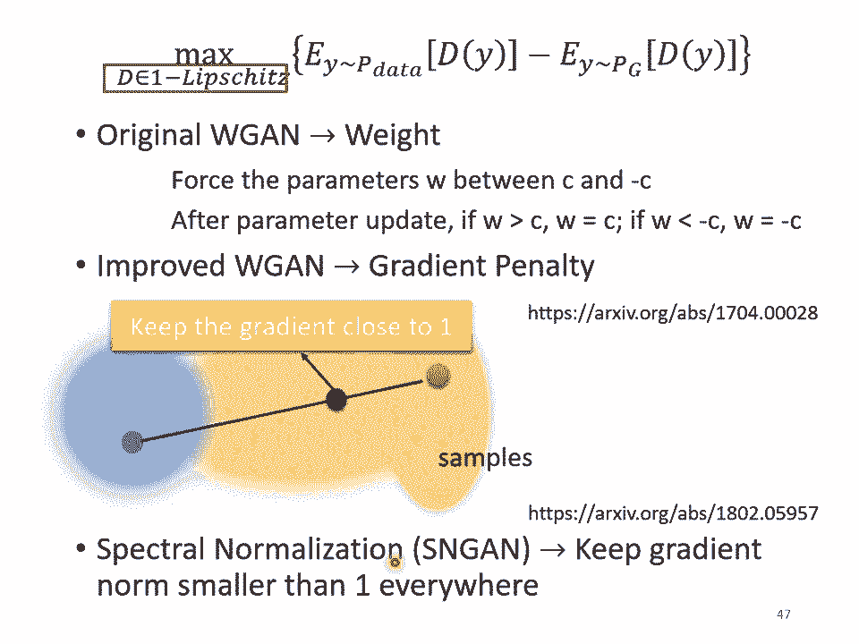

但其實並不代表說GAN就一定特別好train，GAN仍然是以很難把它train起來而聞名的，那為什麼GAN很難被train起來呢，它有一個本質上困難的地方。

我們來想想看Discriminator跟Generator，他們各自在做的事情是什麼，Discriminator做的事情，是要分辨真的圖片跟產生出來的，也就是假的圖片的差異。

這是Discriminator在做的事情，而Generator在做的事情，它是要去產生假的圖片騙過Discriminator，而事實上這兩個network。

這個Generator跟Discriminator，他們是互相砥礪才能互相成長的，只要其中一者發生什麼問題停止訓練，另外一個人就會跟著停下訓練，就會跟著變差跟著慘掉。

所以今天假設你在trainDiscriminator的時候，一下子沒有train好，你的Discriminator沒有辦法分辨，真的跟產生出來的圖片的差異，那Generator他就失去了可以進步的目標。

Generator就沒有辦法再進步了，Generator沒有辦法再進步了，Discriminator也會跟著停下來，如果Generator沒有辦法再進步，他沒有辦法再產生更真實的圖片。

那Discriminator就沒有辦法再跟著進步了，所以Discriminator跟Generator他們在訓練的時候，只要其中一者不再進步，另外一個人就會跟著停下來，但是到目前為止。

大家已經train過了很多次的network，你有辦法保證說你train下去，他的loss就一定會下降嗎，不一定對不對，你要讓networktrain起來，往往你需要調一下hyperparameter。

才有可能把他train起來，那今天這個Discriminator跟Generator，他們互動的過程是自動的，一旦在某一個步驟，因為我們不會在中間每一次trainDiscriminator的時候。

你都換hyperparameter，所以只能祈禱說每一次trainDiscriminator的時候，他的loss都是有下降的，那如果有一次沒有下降，那整個training很有可能就會慘掉。

整個Discriminator跟Generator彼此砥礪的這個過程，就可能會停下來，所以今天Generator跟Discriminator在train的時候，他們必須要齊逢敵手。

任何一個人放棄了這場比賽，另外一個人也就玩不下去了，所以game本質上他的training，仍然不是一件容易的事情，當然他是一個非常重要的技術，所以雖然他是一個前瞻的技術，有人可能會覺得說。

你不要把這種你自己都不見得train起來的network，放到那個作業裡面啦，但是我覺得說這是一個重要而前瞻的技術，所以我們還是應該要讓大家有機會，接觸這種最前瞻的技術，你至少可以知道說。

train game不是一件那麼容易的事情，當然其實從另外一個角度而言，因為很多人都在做類似的研究，所以在網路上你可以找到滿坑滿谷相關的程式，所以其實從這個角度而言，他其實也沒有你想像的那麼困難。

不過train game仍然不是一件容易的事就是了。

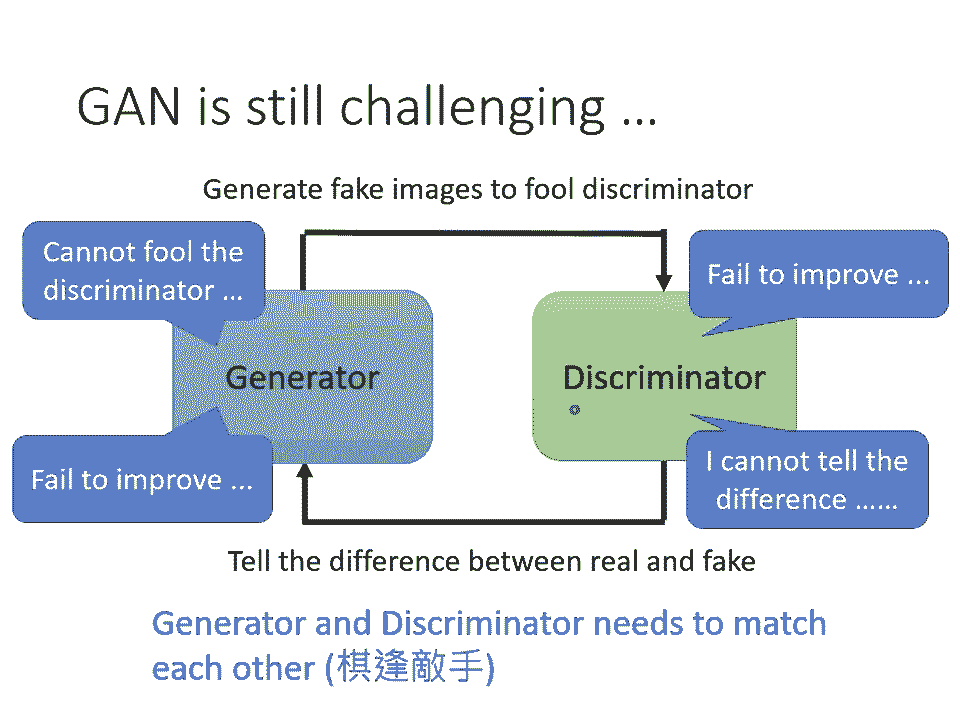

好你可以在網路上找到滿坑滿谷的game的tips，那這些有沒有用呢，不好說不好說，就是把一些相關的，跟train game的訣竅有關的文獻，還有連結列在這邊，其實就給大家自己參考。

好那train game最難的，其實是要拿game來生成文字，如果你要拿game生成一段文字，這個會是最困難的，為什麼用game生成一段文字會是最困難的呢，我們知道說如果你要生成一段文字。

那你可能會有一個sequence to sequence的model，你有一個decoder，那這個decoder會產生一段文字，那我們現在這個sequence to sequence的model。

就是我們的generator，就是在過去在講transformer的時候，這是一個decoder，但他現在在game裡面，他就扮演了generator的角色，負責產生我們要他產生的東西，比如說一段文字。

那你說這個會跟原來的game，在影像上的game有什麼不同呢，就最high level來看，就演算法來看，可能沒有太大不同，因為接下來就是訓練一個discriminator。

discriminator把這段文字讀進去，去判斷說這段文字是真正的文字，還是機器產生出來的文字，而decoder就是想辦法去騙過，discriminator。

generator就是想辦法去騙過discriminator，你去調整你的generator的參數，想辦法讓discriminator覺得generator產生出來的東西，是真正的，但是真正的。

但是這邊的難點在哪裡呢，這邊的難點在於，你如果要用gradient descent，去train你的decoder，去讓discriminator output的分數越大越好，你會發現你做不到。

為什麼你做不到呢，大家知道在計算這個微分的時候，所謂的gradient，所謂的微分其實就是某一個參數，它有變化的時候，對你的目標造成了多大的影響，我們現在來想想看，假設我們改變了discoder的參數。

我們這個generator，也就是decoder的參數，有一點小小的變化的時候，到底對discriminator的輸出有什麼樣的影響，decoder的參數如果有一點小小的變化。

那它現在輸出的distribution，也會有小小的變化，那因為這個變化很小，所以它不會影響最大的，那個token是什麼東西，我知道說token可能對各位同學來講，可能會覺得有點抽象。

那如果你要想得更具體一點，token就是你現在在處理這個問題，處理產生這個sequence的單位，那token是人定的，所以假設我們今天在產生一個中文的句子的時候，我們是每次產生一個character。

一個方塊字，那方塊字就是我們的token，那假設你在處理英文的時候，你每次產生一個英文的字母，那字母就是你的token，假設你一次產生一個英文的詞，英文的詞和詞之間，是以空白分開的。

那就是詞就是你的token，所以token的定義是你自己決定的，看你要拿什麼樣的東西當作，你產生一個句子的單位，好 那今天這個distribution只有小小的變化，在取max的時候。

在找分數最大的那個token的時候，你會發現，分數最大的那個token，是沒有改變的，因為distribution只有小小的變化，所以分數最大的那個token是同一個。

那對discriminator來說，他輸出的分數，他輸出是一模一樣的啊，但輸出的分數就沒有改變，所以你會發現說，當decoder的參數有一點變化的時候，discriminator輸出是沒有改變的。

所以你根本就沒有辦法算微分，你根本就沒有辦法做gradient descent，那有同學可能會說，欸這個這邊不是max，是因為max造成不能做gradient descent嗎。

啊那這個CNN裡面不是有那個max pooling嗎，那怎麼還可以做gradient descent，這個問題就留給你，自己深思一下，為什麼在這個地方有max，不能做gradient descent。

而在CNN有max pooling，卻可以做gradient descent，好但是就算是不能做gradient descent，你也不用害怕，記不記得我們上週有講說。

遇到不能用gradient descent train的問題，就當作reinforcement learning的問題，硬做一下就結束了，所以你確實可以用reinforcement learning。

來train你的generator，在你要產生一個sequence的時候，你可以用reinforcement learning，來train你的generator，但這會發生什麼問題呢。

reinforcement learning，是以難train而聞名，Game也是以難train而聞名，這樣的東西加在一起就大炸裂，這樣就train不起來，非常非常的難訓練。

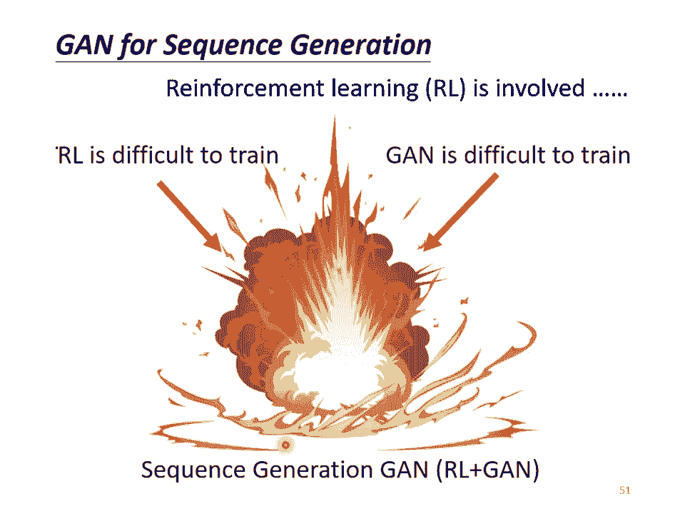

所以要用game產生一段文字，過去一直被認為是一個非常大的難題，只有很長一段時間，沒有人可以成功的把generator訓練起來，沒有人成功的可以訓練一個generator。

用game的方式訓練一個generator產生文字，通常你需要先做pre-train，pre-train這件事情，其實我們等一下馬上就會提到，如果你現在還不知道pre-train是什麼的話，也沒有關係。

總之過去你沒有辦法用正常的方法，讓game產生一段文字，直到有一篇paper叫做Squash Game，它的title就開宗明義跟你炫耀說。

它可以train language game from squash，from squash就是不用pre-train的意思，所以它可以直接從隨機的初始化參數開始，train它的generator。

然後讓generator可以產生文字，那它怎麼做到的呢，最關鍵的就是爆條hyperparameter，跟一大堆的tips，那你可以想像這就是google的paper，它爆收了參數以後。

然後再加上了這邊就講了很多的tips，比如說呢，這個橫軸是他們的measure，這個叫做FED，那這個是用在文字上的，我們今天就不講這不重要，總之這個值越低越好。

一開始要有一個叫做sequence game step的技術，沒這個完全train不起來，然後接下來要有一個很大的batch size，多大呢，通常就是上千，沒有你自己在家沒辦法這麼做的。

discriminator加regularization，embedding要pre-train，改一下reinforcement learning algorithm，最後就有squash game。

就可以從真的把gametrain起來，讓它來產生sequence。

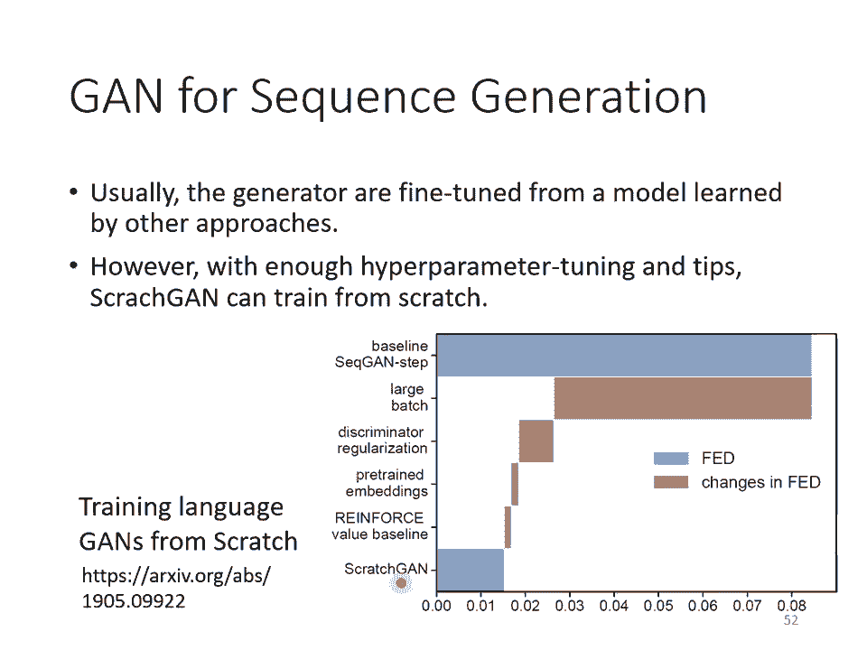

好那今天有關game的部分，我們只是講了一個大概，那如果你想要學最完整的內容，我在這邊留下一個連結，給大家參考，那其實有關generative的model。

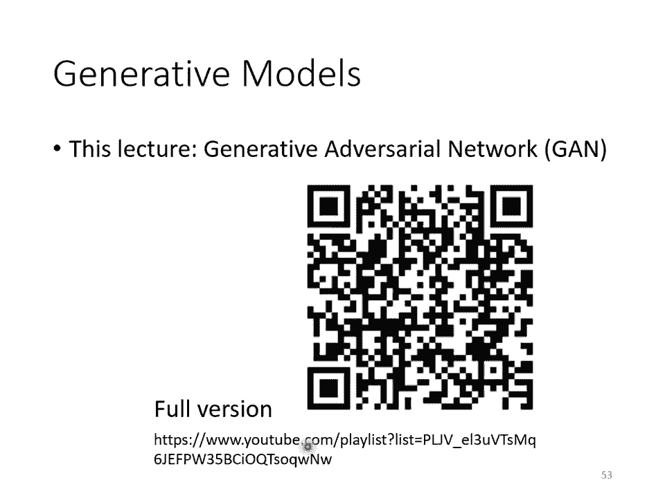

不是只有game而已，還有其他的比如說VAE，比如說flow-based model，那我在這邊也列了兩個影片的連結，給大家參考，那我想要強調一下就是，這邊的影片連結並不是說，我要趕快去把。

我一定要看過這些影片連結，才能夠學習接下來的內容，因為機器學習可以講的東西實在太多了，所以如果假設你沒有太多的時間，那你唯一真正需要聽的，只有我上課講的內容，上課講的內容是self-contained。

它本身是consistent的，你只要每一堂課都有聽，你接下來的內容你應該都可以依序聽下去，應該都可以聽懂，然後在上課中會放一些影片的連結，這個就等於是額外分出去的分支，如果你真的很有興趣的話。

可以進行深入的研究，那為什麼我們不再講更多東西呢，因為在上課的設計呢，這課程的內容是以，真正能夠對你有幫助以實務為導向的，就假設你想要train一個generator，你想要讓機器可以產生東西。

你有很多方法，你可以用game，你可以用VAE，可以用flow-based model，我們這邊就選擇告訴你game，所以以後你如果有人叫你train一個generator model。

你有辦法去train他，那如果你想要深入研究，你可以再研究VAE跟flow-based model，那有人可能會問說，為什麼選擇game，為什麼不是選擇其他的model呢。

一個最直覺的理由是game的performance是比較好的，如果你要產生非常好的圖片的話，你還是今天要用game，通常VAE或flow-based model。

他們產生的結果都是跟game有非常大的一段差距啦，他們通常都是claim說，我經過了一番努力，爆調了一堆餐，爆弄了一堆tips，最後可以跟game差不多而已。

所以game通常他產生出來的結果還是比較好的，那你可能會說game比較難train啊，這個比較難train吧，VAE或flow會不會比較好train，這個是，如果你真的有實作VAE或flow的話。

他們沒有比較好train老實說，你可能會覺得說從他的事實上看起來，game很神秘，有一個discriminator generator他們要互動，然後像flow-based model VAE。

他們都比較像是直接train一個一般的模型，他們有一個很明確的objective，但實際上train起來發現說，他們也沒有那麼容易成功的被訓練起來，他們的objective裡面有很多項。

他們的loss裡面有很多項，你要把每一項都平衡才能夠有好的結果，要達成平衡也非常的困難，跟game我覺得train的難度只不遑多讓，所以我們這邊就選擇game作為我們課堂上介紹的。

生成式的generative的model，那至於其他model你可以再多多。

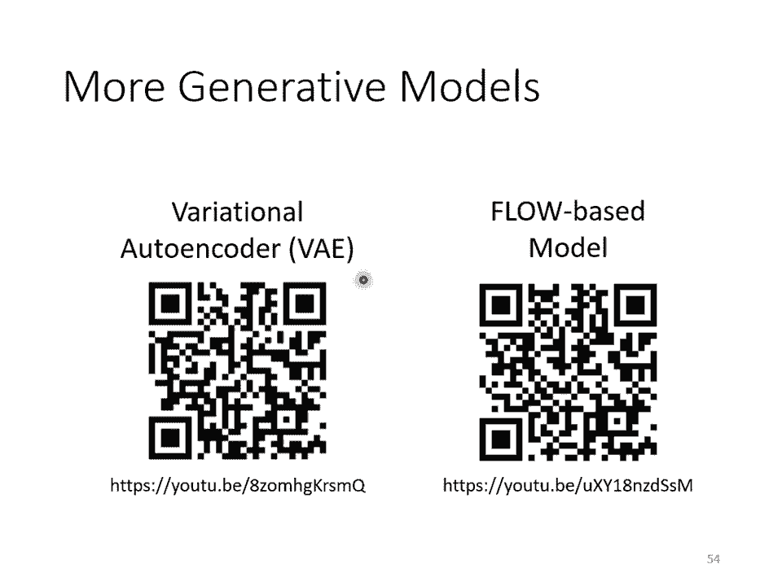

如果你有興趣你可以再自己涉獵，好那有講到這邊也許有同學會想說，為什麼我們要特別用一些，提出一些新的做法來做generative這件事，如果我們今天的目標就是。

輸入一個Gaussian的random的variable，輸入一個從Gaussian的random variable，sample出來的vector，把它變成一張圖片。

那我們能不能夠用supervised learning的方法來做呢，怎麼做你就說我有一堆圖片，我把這圖片拿出來，每一個圖片都去配一個vector，都去配一個從Gaussian distribution。

sample出來的vector，那接下來呢，接下來就當做supervised learning的方法，硬做就結束了，這樣，大家懂嗎，就是train一個network，這個network你已經說這張圖片。

就是對到這個vector，這張圖片就是對到這個vector，train一個network，輸入一個vector，輸出就是他對應的圖片，把對應的圖片當作你訓練的目標，訓練下去就結束了，能不能這麼做呢。

能這麼做，真的有這樣子的生成式的模型，那難的點是說，如果這邊純粹放隨機的向量，train起來的結果會很差，你可能根本連train都train不起來，所以怎麼辦，你需要有一些特殊的方法。

至於什麼樣特殊的方法，你要一些特殊的方法去安排這些vector，那至於有什麼特殊的方法，我在這邊一樣放兩篇論文的連結，那你發現說這都不是很舊的論文。

像這個什麼gradient original network，這個是去年20年7月的文章，這都是比較新的論文，有比較新的方法，那我把連結放在這邊給大家參考。

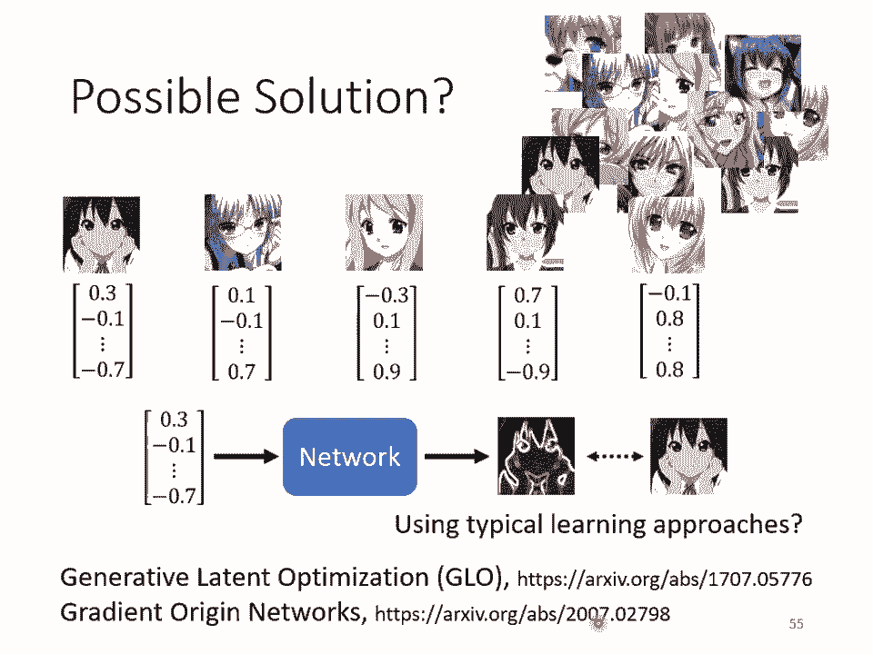

那接下來我們要講的，就是Gain的評量，怎麼說怎麼看說，我們現在產生出來的generator，他好或者是不好呢，那要評估一個generator的好壞，並沒有那麼容易，最直覺的做法也許是找人來看。

你要知道今天這個generator產生出來的圖片，到底像不像動畫的人物，那就找人直接來看，也許就結束了，所以其實很長一段時間，尤其是人們剛開始研究generative，這樣的技術的時候。

很長一段時間沒有好的measure，那時候要評估generator的好壞，都是人眼看然後直接用吹的這樣，就說在paper最後就放幾張圖說，你看這個，我覺得應該是比文獻上，目前的結果都還要好。

太棒了這應該是stay of the art，然後就結束了，所以發現比較早年的Gain的paper，他沒有數字，整篇paper裡面沒有這個measure，沒有accuracy，他就是放幾張圖片告訴你說。

這個應該是比過去的文章都好，然後就結束了，但是你知道這樣顯然是不行的，就是完全用人來看，顯然有很多的問題，比如說不客觀不穩定等等諸多的問題，所以有沒有比較客觀而且自動的方法。

來想辦法量一個generator的好壞呢，如果針對特定的一些任務，是有辦法設計一些方法的，舉例來說在作業6裡面，我們就是要叫大家生成二次元人物的頭像，那在作業裡面一個評估的標準。

就是我們跑一個動畫人物人臉偵測的系統，然後看說你提供的那些圖片裡面，抓到幾個動畫人物的人臉，那如果你提供1000張圖片裡面，抓到900個人臉，跟提供1000張圖片抓到300個人臉。

那顯然900個人臉的那一個generator，他做出來的結果是比較好的，但是這是針對作業6的設計，那如果是更一般的case呢，如果我們不侷限在我們的作業。

更一般的case我隨便訓練了一個generator，他不一定是產生動畫人物的，因為他產生別的，他專門產生貓 專門產生狗，專門產生斑馬等等，那我們怎麼知道他做得好不好呢，那有一個方法呢。

是一樣跑一個影像的分類系統，把你的game產生出來的圖片，丟到一個影像的分類系統裡面，看他產生什麼樣的結果，影像分類系統輸入是一張圖片，我們這邊叫做y，輸出呢是一個機率分布，我們這邊叫他P(c|y)。

P(c|y)是一個機率的分布，然後接下來我們就看說，這個機率的分布如果越集中，就代表說現在產生的圖片可能越好，雖然我們不知道這邊產生的圖片裡面有什麼東西，不知道他是貓 還是狗 還是斑馬。

我們不知道他是什麼，但是如果丟到一個影像分類系統以後，他輸出來的結果，他輸出來的這個分布非常集中，代表影像分類系統他非常肯定他現在看到什麼樣的東西，他非常肯定他看到了狗，他非常肯定他看到了斑馬。

那代表說你產生出來的圖片，也許是比較接近真實的圖片，所以影像辨識系統才辨識的出來，如果產生出來的圖片是一個四不像，根本看不出是什麼動物，那影像辨識系統就會非常的困惑。

他產生出來的這個機率分布就會非常的平坦，非常的平均分布，那如果是平均分布的話，那就代表說你的game產生出來的圖片可能是比較奇怪的，所以影像辨識系統才會辨識不出來，所以這個是靠影像辨識系統。

來判斷你產生出來的圖片好壞，這是一個可能的做法，但是光用這個做法是不夠的，光用這個做法會有什麼問題呢，光用這個做法你會被一個叫做，這個evaluation的方法，評估的方法會被一個叫做。

Mockless的問題騙過去，什麼叫Mockless呢，Mockless是說你在train game的時候，你有時候train著train著就會遇到一個狀況是，假設這些藍色的星星是真正的資料的分布。

紅色的星星是你的game，你的generative model它的分布，你會發現說generative model它輸出來的圖片，來來去去就是那幾張，來來去去就是那幾張，可能單一張拿出來。

你覺得好像還做得不錯，但讓它多產生幾張就露出馬腳，發現說原來它就是成咬金只有三斧頭，原來產生出來就只有那幾張圖片而已，好那以下是一個Mockless的例子啦，就是我們在上週有看到說。

我就train了一個generator讓它產生二次元的人物，那train著train著train到最後，我就發現變成這樣的一個狀況，這一張臉越來越多，而且它有不同的髮色，這個髮色比較偏紅。

這個髮色比較偏黃，越來越多，最後就通通都是這張臉，那這就是一種Mockless的現象，那為什麼會有Mockless這種現象發生呢，就直覺上你還是比較容易理解，你可以想成說。

這個地方就是discriminator的一個盲點，當generator學會產生這種圖片以後，它就永遠都可以騙過discriminator，discriminator沒辦法看出說這樣子的圖片是假的。

那這是一個discriminator的盲點，generator抓到這個盲點就硬打一發，就發生Mockless的狀況，那可是到底要怎麼避免Mockless的狀況呢，我認為今天其實還沒有一個非常好的解答。

舉例來說，我們在上週給大家看到了Big Game的結果，就是產生網球狗那個結果，那是Google做的，它也報收了參數，但就算是它報收了參數，它發現最終它仍然沒有辦法真的避免Mockless的狀況。

Big Game train到最後還是Mockless，那Big Game那篇文怎麼解決這個問題呢，其實很簡單，model在generator在訓練的時候，一路上都會把那個checkpoint存下來。

在Mockless之前把training停下來，就train到Mockless了，然後就把之前的model拿出來用就結束了，所以就算是強如Google報收參數。

現在還是沒有辦法徹底解決Mockless的問題，不過Mockless這種問題，至少你知道有這個問題，你可以看得出有這個問題，你的generator總是產生這張臉的時候。

你不會說你的generator是個好的generator，你知道說發生了一些狀況，你的generator不是特別的好，但是有另外一種跟Mockless有點像。

但是更難被偵測到的問題叫做Model dropping，Model dropping的意思是說，你的真實的資料的分佈可能是這個樣子，但是你的產生出來的資料，只有真實資料的一部分，單純看產生出來的資料。

你可能會覺得還不錯，而且分佈它的多樣性也夠，但你不知道說真實的資料，它的多樣性的分佈其實是更大的，我這邊舉一個例子，這邊是一個真實的例子，就有一個同學他train了這個人臉生成的game。

在某一個iteration的時候，他的generator產生出這些人臉，你會覺得說沒有問題，而且人臉的多樣性也夠，有男有女有向左看有向右看，各式各樣的人臉都有。

這個是第七個iteration的時候的generator，你也不覺得它的多樣性有問題，但如果你在看下一個iteration。

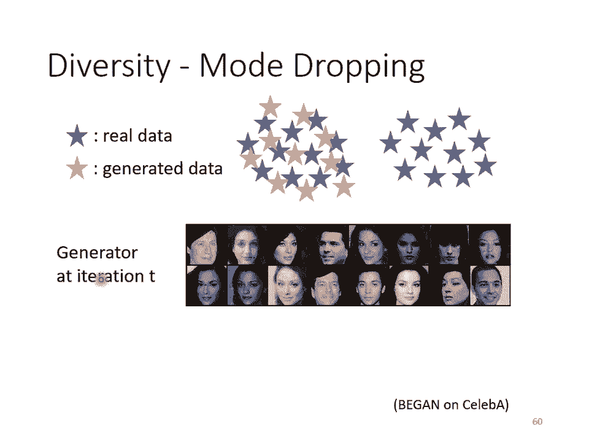

generator產生出來的圖片是這樣子的，有沒有發現問題，他的膚色有問題，所以他之前你看有男有女沒有問題，但他膚色偏白，這邊膚色偏黃，你沒弄好人家都覺得你的generator有種族歧視。

所以這種more dropping的問題，是不太容易被偵測出來的，事實上今天到底，今天這些非常好的game，big game progressive game，可以產生非常真實人臉這些game。

到底有沒有more dropping的問題，可能還是有的，如果你看多了game產生出來的人臉，你會發現說雖然非常真實，但好像來來去去就是那麼幾張臉而已，還有一個非常獨特的特徵。

是你看多了以後就覺得這個臉好像是被生成出來的，所以今天也許more dropping的問題，都還沒有獲得本質上的解決，但是我們會需要去量說。

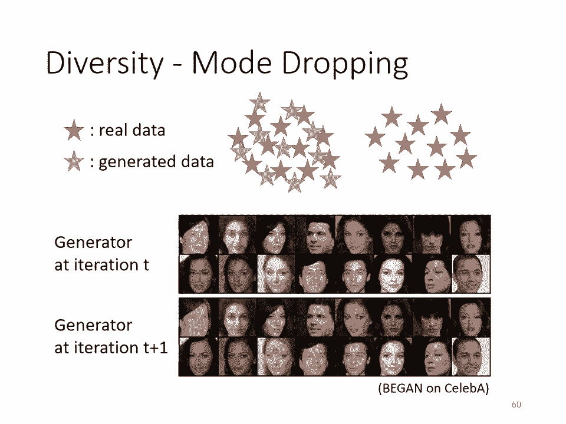

現在我們的generator他產生出來的圖片，到底多樣性夠不夠，所以怎麼做呢，過去有一個做法呢，一樣是藉助我們的image classifier，你就把一堆圖片。

就像你的generator產生一千張圖片，把這一千張圖片裡都丟到image classifier裡面，看他被判斷成哪一個class，每一張圖片都會給我們一個distribution。

給我們一個distribution，你把所有的distribution平均起來，接下來看看平均的distribution長什麼樣子，如果平均的distribution非常集中，就代表現在多樣性不夠。

如果什麼圖片丟進去，你的影像分類系統都說是看到class 2，看到裡面有class 2這樣的東西，那代表說每一張圖片也許都蠻像的，你的多樣性是不夠的，那如果另外一個case，不同當張圖片丟進去。

不同張你的generator產生出來的圖片，丟到image classifier的時候，他產生出來的輸出的分佈都非常的不同，你平均完以後發現，平均完後的結果是非常平坦的，那這個時候代表什麼。

這個時候代表說，也許你的多樣性是足夠的，那你會發現說在評估的標準上，當我們用這個image classifier，來做評估的時候，diversity跟quality好像是有點互斥的。

因為我們剛才在講quality的時候，我們說越集中代表quality越高，但是diversity是越平坦，越分佈越平均代表diversity越大，不過我要強調一下。

這個quality跟diversity，他們評估的範圍不一樣，quality是只看一張圖片，一張圖片丟到classifier的時候，分佈有沒有非常的集中，而diversity看的是一堆圖片。

他分佈的平均，一堆圖片你的image classifier輸出的平均，越輸出越平均，那就代表如果輸出的這個平均，越平均的話，這邊有兩個平均，我想大家應該知道我的意思，如果輸出的平均越平均的話。

就代表說現在diversity越大，那過去有一個非常常被使用的分數，叫做Inception Score，那它的縮寫是IS，所謂Inception Score，顧名思義就是這邊用的這個CNN。

是用一個叫做Inception來做的，所以叫Inception Score，那這個Inception Score，是怎麼定出來的呢，你就量一下用Inception Level，量一下quality。

如果quality高，那個diversity又大，那Inception Score就會比較大，不過在作業裡面，我們並不會用Inception Score，為什麼我們不用Inception Score呢。

你想想看，假設把你產生出來的二次元人物，丟到Inception Net裡面，他輸出可能就是都看到人臉嘛，你可能diversity很大，產生不同的髮色，產生不同的眼睛的顏色的人物。

但是對Inception Network來說，他都是人臉啊，所以你可能算出來diversity其實是小的，所以Inception Score，在我們這個作業中可能是不適用的，那在我們的作業中。

會採取另外一個evaluation的measure，叫Fetching的Inception Distance，這個東西是什麼呢，它的縮寫叫做FID，這個東西是什麼呢，你先把你產生出來的二次元的人物。

丟到Inception Net裡面，那如果你把這個二次元人物，一路丟丟丟到最後，讓那個Inception Network輸出他的類別，那你得到可能就是人臉，那每一張二次元人物看起來都是人臉。

那我們不要拿那個類別，我們拿進入SoftMAC之前的，Hidden Layer的輸出，進入SoftMAC之前，你的Network不是會產生一個向量嗎，那可能是上千維，長度是上千維的一個向量。

把那個向量拿出來，代表這張圖片，那如果我們拿出來的是一個向量，而不是最後的類別，那雖然最後分類的類別可能是一樣的，但是在決定最後的類別之前，這個向量就算都是人臉，可能還是不一樣的，可能會隨著膚色髮型。

這個向量還是會有所改變的，所以我們就不取最後的類別，只取這個Inception Network，中間的其實是最後一層的，這個Hidden Layer的輸出，來代表一張圖片，那在這個投影片上。

所有紅色的點，代表你把真正的圖片，丟到Inception Network以後，拿出來的向量，那這個向量其實非常高維度，是上千維的，那我們就把它，假設我們可以把它畫在二維的平面上，那這個藍色的點呢。

藍色的點是你自己的Gain，你自己的Generator產生出來的圖片，它丟到Inception Network以後，進入SoftMate之前的向量，把它畫出來，假設是長這個樣子，接下來呢。

你就假設這兩組資料，假設真實的圖片，跟產生出來的圖片，它們都是Gaussian的Distribution，然後去計算這兩個Gaussian Distribution。

之間的Fragile Distance就結束了，那至於Fragile Distance是什麼，你有興趣再自己看一下文獻，反正在作業裡面，我們的Judge System會幫大家算好，但是這邊。

因為它是一個Distance，所以這個值就是越小越好，距離就是越小越好，距離越小代表這兩組圖片越接近，那當然就是產生出來的品質越高，那這邊你一定心裡還是有很多問號，第一個問號就是。

當作Gaussian Distribution沒問題嗎，這個應該不是Gaussian Distribution吧，會有問題就這樣子，然後另外一個問題就是，如果你要準確的得到你的Network的分布。

那你可能需要產生大量的Sample才能做到，這需要一點運算量，那這個也是要做FID不可避免的問題，所以其實我們在作業裡面，我們也不會只看FID，只看FID其實結果會怪怪的。

因為你假設你的輸出的分布一定是Gaussian，實際上不是Gaussian，你假設它是Gaussian沒有怪怪的，會怪怪的，所以我們是同時看FID，跟動畫人物人臉的這個，偵測出來的人臉的數目這兩個指標。

我們會同時看這兩個指標，那這樣可以得到比較合理而精確的結果。

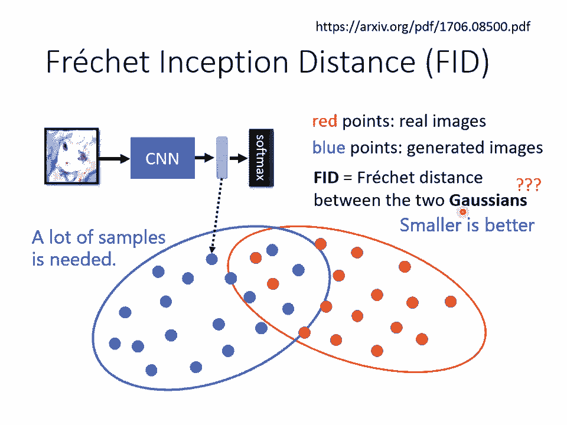

那FID算是今天比較常用的一種Measure，那有一篇Paper叫做，Games Created Equally，Large Scale Study，可以想聽說這個也是Google做的啦。

就是暴做了各式各樣不同的Game，那個時候他就列舉了好多不同的各式各樣的Game，每個Game當然他訓練的Objective訓練的Loss有點不太一樣，這邊就不細講，各式各樣的Game。

每一種Game他都用不同的Random Z，去跑過很多次以後，看看結果怎麼樣，那以下呢，下面這個圖呢就是在四個，不同的資料庫上面得到的結果，那橫軸這邊代表的是不同的Game，那這邊的紙啊是越小越好。

它是F。它是F。I。欸我這邊怎麼寫了FIT呢，這我寫錯了不好意思，我記得改一下，這個是FID，這個是FID的分數，那這FID的分數就是越小越好啦，那你會發現說這邊每一個方法呢，他都不是只得到一個數值。

他都得到一個分布，為什麼他得到一個分布呢，因為你要用那個不同的Random Z去跑嘛，用不同的Random Z去跑每次跑出來的結果，都不太一樣，那這邊混了一個不是Game的做法，混了一個VAE在這裡。

混了一個VAE在這裡，那你會發現說如果比較這些Game的方法，跟VAE的方法，VAE的方法顯然是比較穩定的，不同的Random Z看起來差距還是比較小的。

那Game的方法不同Random Z差距是很大的，那你又可以很明顯的看出，VAE跟Game它的這個好的程度啊，不在同一個量級上，Game呢可以產生遠比VAE更好的結果，不過你會發現說。

不同的Game好像結果差不多，所以這邊就有文章的Title就是，Game Created Equally，然後看起來所有的Game都差不多，農場文最喜歡這種文章，他就說，所有的Game都差不多啦。

所以他跟Game有關的研究都是白忙一場，但是其實事實上也未必是如此，如果你仔細看那篇文章的話，在做實驗的時候，所有這些不同的Game用的Network架構，都是同一個，他只是報收了那個Random Z。

跟Learning Rate而已，所以Network架構還是同一個，所以我們不知道說，是不是有某些Network架構，特別Favor某些，某些種類的Game，或者是某些種類的Game。

會不會在不同的Network架構上，表現的比較穩定，比如說如果你看WGame的話，WGame最原始的Paper，他標榜的其實是，他Network架構胡亂設計，他胡亂兜個什麼100層的東西。

他胡亂兜個什麼100層的Generator，沒有必要，弄個100層的Generator，他也Trend的起來，也許WGame是在不同的Network架構的時候比較穩定，那是不同的Random Z。

可能沒有特別穩定，不知道這篇Paper，並沒有給我們這方面的答案。

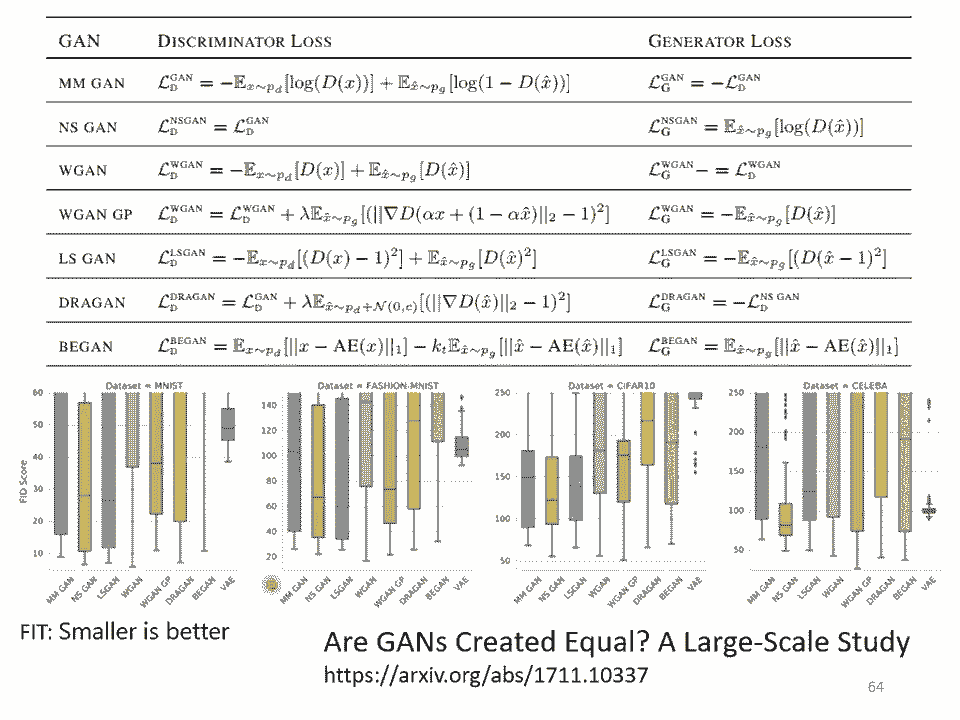

那其實剛才那些Major，也並沒有完全解決Game的問題，Evaluation的問題，因為還有什麼Evaluation的問題呢，你想想看以下的狀況，假設這是你的真實資料。

你不知道怎麼回事訓練了一個Generator，他產生出來的Data，跟你的真實資料，一模一樣，所以如果你不知道真實資料長什麼樣子，你光看這個Generator的輸出，你會覺得太棒了，他做得很棒。

FID算出來一定是非常小的，但問題是，這個是你要的嗎，如果他產生出來的圖片，都跟資料庫裡面的訓練資料的一模一樣，訓練資料就在你手上，直接從訓練資料裡面Sample一些Image出來不是更好。

幹嘛要Trend Generator，我們Trend Generator其實是希望他產生，新的圖片啊，訓練資料裡面沒有的人臉啊，如果訓練資料裡面有一模一樣的人臉，直接用訓練資料裡面的人臉就好了。

何必用Game呢，所以有時候你的Game產生出來的結果，很好，也許你在作業裡面FID算出來也很低，然後人臉辨識系統也給你很高的分數，但是他不一定是一個好的Game，像這種問題。

就不是我們作業的Manager可以偵測的，但是他是一個問題，那怎麼解呢，你可能會說，那我們就把我們Generator產生出來的圖片，跟真實資料比個相似度嘛，看看是不是一樣嘛，如果很多張都一樣就代表說。

Generator只是把訓練資料背起來而已，他沒有很厲害，但是那如果我問另外一個問題，假設你的Generator學到的是，把所有訓練資料裡面的圖片都左右翻轉了，那他也是什麼事都沒有做啊，假設他學到就是。

把訓練資料裡面所有的圖片都左右翻轉，那你會覺得，他看起來很棒，他實際上也是什麼事都沒有做，但問題是你比相似度的時候，又比不出來，所以Getting Evaluation，是非常的困難的。

光要如何評估一個Generator，做得好不好。

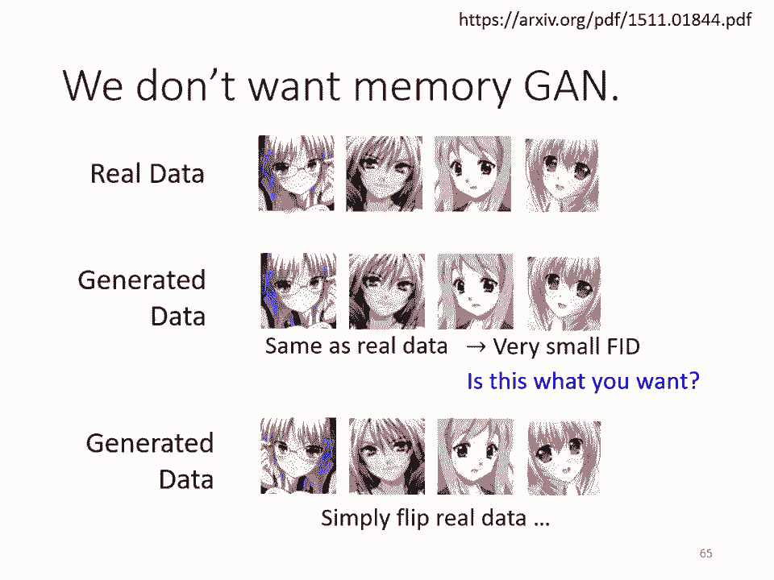

這件事情都是一個，可以研究的題目，如果你真的很有興趣的話，這邊放了一篇相關的文章啦，裡面就列舉了20幾種，GEN Generator的評估的方式，給大家參考，好，接下來呢。

我們要講Conditional的Generation，那也許我們講完Conditional的Generation，以後再下課，然後接下來就是讓助教來講一下GEN的作業。

那什麼是Conditional的Generation呢，剛才我們講的那個Generator，到目前為止我們講的Generator，他輸入都是一個，隨機的分佈而已，那這個不見得非常有用。

我們現在想要更進一步的是，我們可以操控，Generator的輸出，我們給他一個Condition X，讓他根據X跟Z，來產生Y，那這樣的Conditional Generation，有什麼樣的應用呢。

那就是你可以做文字對圖片的生成，那如果你要做文字對圖片的生成，他其實是一個，Supervised Learning的問題，你需要一些Label的Data，你需要去，收集一些圖片，收集一些人臉。

然後這些人臉都要有文字的描述，告訴我們說這個是紅眼睛，這個是黑頭髮，這個是黃頭髮，這個是有黑眼圈等等，告訴我們這樣子，Conditional的Generator，所以在Text to Image。

這樣的任務裡面，我們的X就是一段文字，那你可能問說一段文字怎麼輸入給Generator呢，那就要問你自己了，你要怎麼做都可以，以前會用RNN把它讀過去，然後得到一個向量，再丟到Generator。

今天也許你可以把它丟到一個，Transformer的Encoder裡面去，把Encoder Output的這些向量通通平均起來，丟到Generator裡面去，怎麼樣都可以，用什麼方法都可以。

只要能夠讓Generator讀一段文字就行，那你期待說你輸入，Red Eyes，然後機器就可以畫一個紅眼睛的角色，但每次畫出來的角色，都不一樣，那這個畫出來什麼樣的角色，取決於什麼呢。

取決於你Sample到什麼樣的Z，Sample到不一樣的Z畫出來的角色就不同，但是通通都是紅眼睛的，這個就是Text to Image，想要做的事情，真的可以做到這樣子的事情嗎，可以，過去有這個作業。

就是輸入紅頭髮，這個是之前助教做的結果，輸入紅頭髮，輸入綠眼睛，那產生的結果就是這個樣子，產生各式各樣紅頭髮綠眼睛的角色，輸入藍頭髮紅眼睛，就產生各式各樣，藍頭髮紅眼睛的角色。

你發現有時候機器也是會犯錯的，比如說這邊有一個異色瞳，雖然說要畫紅眼睛，但他覺得畫一隻紅色的眼睛，就可以矇混過去。

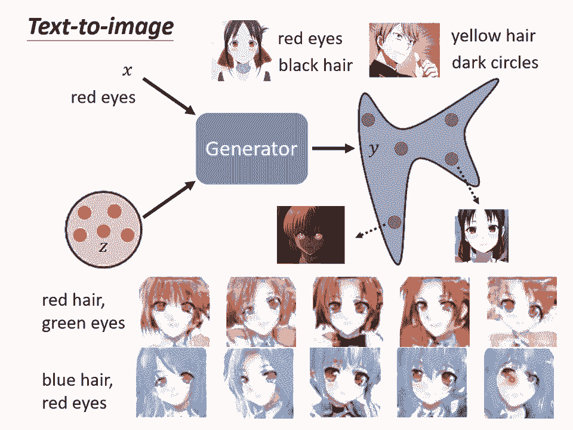

另外一隻眼睛仍然是藍色的，那要怎麼做，Conditional的Game呢，我們現在的Generator有兩個輸入，一個是從Normal Distribution，Sample出來的Z。

另外一個是X也就是一段文字，那我們的Generator會產生一張圖片Y，那我們需要一個Discriminator，那如果按照我們過去，所學過的東西，Discriminator他就是。

是一張圖片Y當作輸入，輸出一個數值，這個數值代表輸的圖片，多像真實的圖片，是真實的還是生成的，那怎麼訓練這個Discriminator呢，你就說，如果看到真實的圖片，你就輸出1。

如果看到生成的圖片就輸出0，就可以訓練Discriminator，那Discriminator跟Generator反覆訓練，就可以把Generator訓練出來，但這樣的方法。

沒辦法真的解Conditional Game的問題，為什麼呢，因為如果我們只有Train這個Discriminator，這個Discriminator只會看Y當作輸入的話。

那Generator會學到的是，他會產生可以騙過Discriminator的，非常清晰的圖片，他會產生清晰的圖片，但是跟輸入完全沒有任何關係，因為對Generator來說，他只要產生清晰的圖片。

就可以騙過Discriminator，那對Generator來說，他只要產生清晰的圖片，就可以騙過Discriminator了，他何必要去管Input的文字敘述是什麼呢。

你的Discriminator又不看文字的敘述，所以他根本就不需要管文字的敘述，你不管輸入什麼文字就無視這個X，反正就是產生一個圖片，可以騙過Discriminator就結束了，但這顯然不是我們要的。

所以在Conditional Game裡面，你要做有點不一樣的設計，你的Discriminator不是只吃圖片Y，他還要吃Condition X，所以你的Discriminator，他有Y作為輸入。

X作為輸入然後產生一個數值，那這個數值不只是看Y好不好，光圖片好沒有用，光圖片好Discriminator還是不會給高分，什麼樣的情況下Discriminator才會給高分呢，一方面圖片要好。

另外一方面圖片跟X，這是文字的敘述，他們必須要配得上，圖片跟文字的敘述，必須要是相同的，所以你如果把圖片跟X，圖片跟文字的敘述，必須要是相配的，才會給高分。

那怎麼樣訓練這樣的Discriminator呢，那你需要文字，跟影像成對的資料，所以Conditional Game，一般的訓練是需要，這個Pair的Data，是需要有標準的資料，是需要成對的資料。

有這些成對資料，那你就告訴你的Discriminator說，看到這些真正的成對的資料，就給他一分，看到Red Eyes，但是搭配，這邊我也不知道為什麼會是這個樣子，不過沒有關係。

反正我這邊本來就是沒有要放什麼特別的東西，就放個亂七八糟的圖而已，Red Eyes跟機器產生出來的圖片，那就是給零分，然後訓練下去，就可以產生，就可以做到Conditional Game。

那其實在實作上啊，光是這樣子，的Positive Example，還有Negative Example，來訓練這樣的Discriminator，其實你得到的結果往往，不夠好。

光是告訴Discriminator說，這樣子的狀況是好的，這樣子的狀況是不好的，這樣是不夠的，你還需要加上一種不好的狀況是，已經產生好的圖片，但是文字敘述，配不上的狀況。

所以你通常會把你的訓練資料拿出來，然後故意把文字跟圖片亂配，故意配一些錯的，然後告訴你的Discriminator說，看到這種狀況你也要說是不好的，用這樣子的資料。

你才有辦法把Discriminator訓練好，然後Generator跟Discriminator，反覆的訓練，最後才會得到好的結果，這個就是Conditional Game，在目前的例子裡面。

都是看一段文字產生圖片，那Conditional Game的應用不只看一段文字產生圖片啦，也可以看一張圖片，產生圖片，那看一張圖片產生圖片，也有很多的應用，比如說給他房屋的設計圖。

然後讓你的Generator直接把房屋產生出來，給他黑白的圖片，然後讓他把顏色著上，給他這個，樹苗的圖，讓他把它變成實景，實物，給他這個白天的圖片，讓他變成晚上的圖片，有時候你會給他比如說起霧的圖片。

讓他變成沒有霧的圖片，把霧去掉，所以Conditional Game除了輸入文字產生影像以外，也可以輸入影像產生影像，也可以輸入影像產生影像，那像這樣子的應用啊，叫做Image Translation。

那有人又叫做Pix2Pix，那有人又叫做Pix2Pix，這個Pix就是Pixel就是像素的縮寫啦，所以叫做Pix2Pix，那怎麼做呢，跟剛才講的從文字產生影像，沒有什麼不同，現在只是從影像產生影像。

把文字的部分用影像取代掉而已，把文字的部分用影像取代掉而已，那當然同樣的做法，同樣要產生這樣的Generator，產生一張圖片，輸入一張圖片產生一張圖片。

你當然可以用Supervised Learning的方法，那在文獻上你會發現說，如果你用Supervised Learning的方法，你得不到非常好的結果。

通常你用Supervised Learning的方法，訓練一個圖片生圖片的Generator，你產生出來的結果可能是這個樣子，這是你的Generator的輸入，這個是你Generator的輸出。

那你會發現說，它非常的模糊，為什麼它非常的模糊呢，你可以直覺想成說，因為同樣的輸入，可能對應到不一樣的輸出，就好像我們在講GAME剛開場的時候，講的那個例子，今天在同一個轉角。

那個小精靈可能左轉也可能右轉，最後學到的就是，同時左轉跟右轉，那對於Image to Image的case，也是一樣的，輸入一張圖片輸出有不同的可能，機器學到的Generator學到的。

就把不同的可能平均起來，結果變成一個模糊的結果，所以這個時候，我們需要用GAME來Train，你需要加一個Discriminator，Discriminator它是輸入一張圖片。

還有輸入Condition，那它會同時看這個圖片跟這個Condition，有沒有匹配來決定它的輸出，那這個是文獻上用GAME的輸出，從右上角這邊Paper擷取出來的，你會發現說，如果單純用GAME的話。

它有一個小問題，所以它產生出來的圖片呢，比較真實，但是它的問題是，它的創造力呢，想像力過度豐富，它會產生一些輸入沒有的東西，沒有叫它輸入的東西，舉例來說這是一個房子，左上角明明沒有其他東西。

這邊它卻在屋頂上，加了一個不知道是煙囪，還是窗戶的東西，那文獻上如果你要做到最好，往往就是GAME跟Supervised Learning，同時使用啦，同時使用往往可以給你，最好的結果。

那所謂同時使用的意思就是，Generator在訓練的時候，一方面它要去騙過Discriminator，這是它的一個目標，但同時它又想要產生一張圖片跟標準答案，越像越好，它同時去做這兩件事。

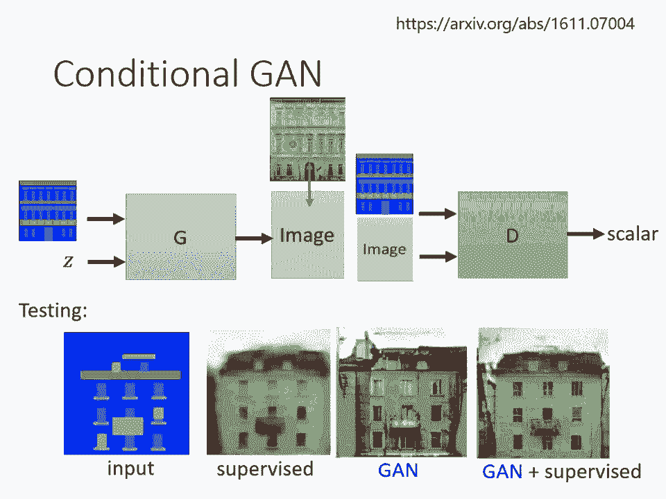

這是最好的，那Conditional GAME還有很多應用，這邊給大家看一個莫名其妙的應用，就是給GAME聽一段聲音，然後它產生一個對應的圖片，什麼意思呢，比如說給它聽一段狗叫聲。

看它能不能夠畫出一隻狗，那我剛才講說，Conditional GAME需要，這個Label的資料，需要成對的資料，那這個聲音跟影像成對的資料，其實並沒有那麼難收集，因為你可以爬到，大量的影片。

影片裡面有影像有畫面，也有聲音訊號，那你就知道說，這個畫面這一幀，這一幀的畫面，對應到這一小段聲音，把這些資料收集起來，你就可以Train一個，Conditional GAME，聽一段聲音。

讓它想像它聽到的場景是什麼樣子。

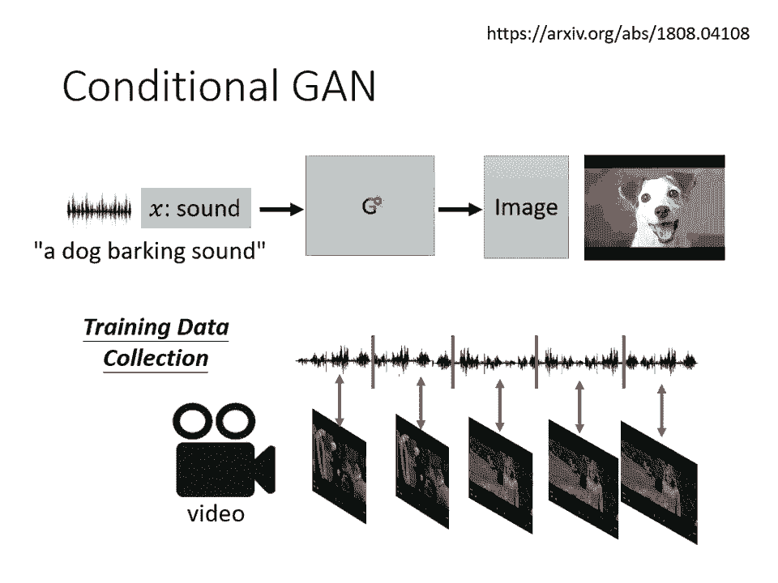

好，這個是一個，真正的Demo啦，機器聽這樣的聲音，這聽起來，有點像是，電視機壞掉的聲音，那機器覺得它聽到什麼呢，剛才那段聲音機器覺得，它聽到一個小溪，聽到一個小瀑布，或者是我們再聽，另外一段聲音。

機器覺得，它聽到一艘快艇，在海上奔馳，當然我有點擔心說，這個會不會，機器並沒有真的學到，聲音跟圖片之間的關係，會不會它只是把，它在訓練資料裡面有看過的圖片，存起來而已，所以我決定把聲音調大，你聽看看。

結果會怎樣，所以我們把聲音調大，接下來真的會很大聲，聲音越來越大，你就發現說，這個溪流裡面的水花，就越來越多，從一條小溪變成尼加拉瓜瀑布，然後剛才的快艇的例子，也是一樣，我們就把快艇的聲音變大。

你聽看看會怎樣，當聲音越來越大的時候，你發現快艇旁邊的水花，就越來越多，好像快艇開得越來越快，不過我要承認這個其實是，稍微cherry pick的結果，很多時候generator產生出來的東西。

就是這個樣子，不知所云，這給他一個鋼琴聲，他好像想畫一個鋼琴，這個是給他聽狗叫聲，好像想畫一個動物，但又不知道要畫些什麼。

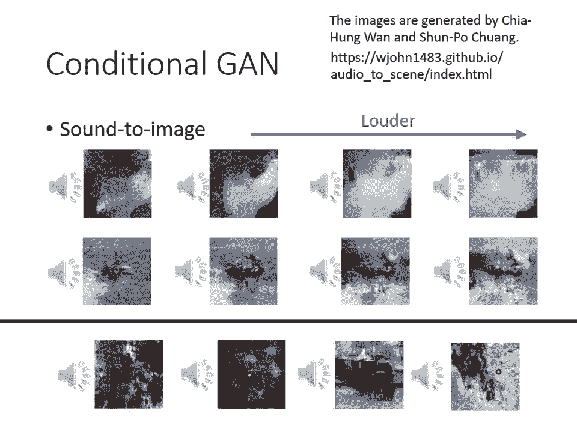

這個是聲音到影像的產生，那我看到最近最驚人的，conditional game的應用，是有人用conditional game，來畫一些會動的圖片，我們知道在哈利波特裡面，那些人物的畫像，是會動的。

是會說話的，那Samsung就做了一個類似的應用。

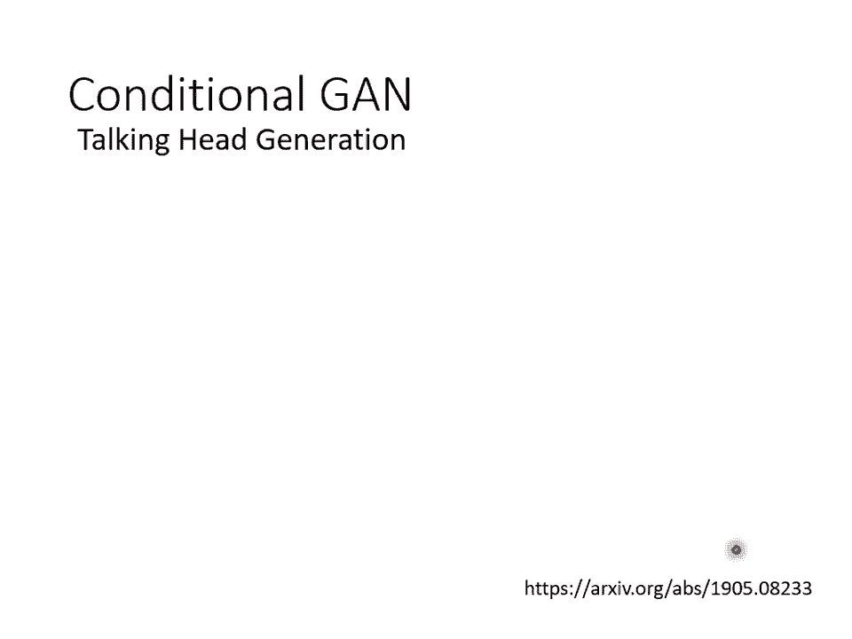

用game做的，給他一張圖片。

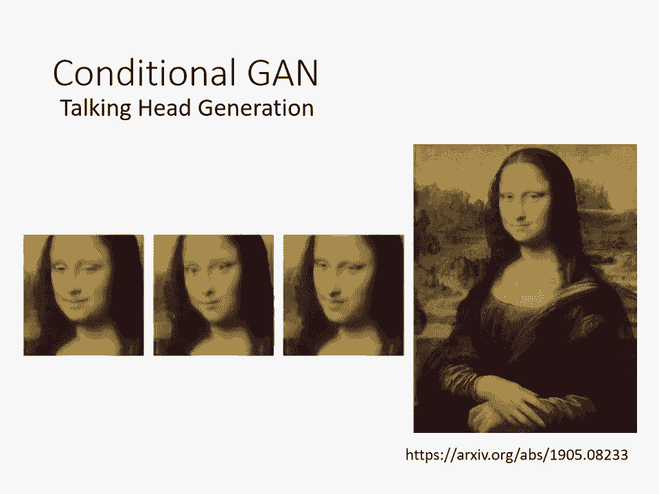

比如說蒙娜麗莎的畫像，然後就可以讓蒙娜麗莎開始講話，這個是conditional game的其中一個應用，我把論文放在這邊，給大家參考，好那講到這邊呢，我們先休息一下，我們十分鐘再回來，等一下呢。

助教會講作業六。