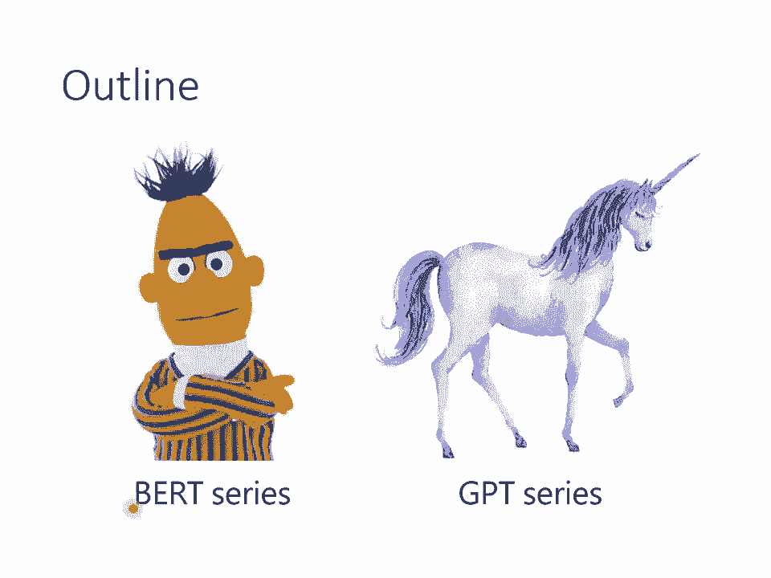

# 【国语+资料下载】李宏毅 HYLEE ｜ 机器学习(深度学习)(2021最新·完整版) - P18：L13.1- 自督导式学习1：芝麻街与进击的巨人 - ShowMeAI - BV1fM4y137M4

好，那我們就講下一個主題，我們接下來要講的主題呢，叫做Sales Supervised Learning，那在講Sales Supervised Learning之前呢，就不能不介紹一下芝麻街啊。

為什麼呢？因為不知道為什麼Sales Supervised Learning的模型都是以芝麻街的人物命名的，我今天特別穿了芝麻街的T-shirt給大家看一下，芝麻街的T-shirt，看不清楚的同學呢。

或線上的同學呢，這個照片在這邊啦，是同一件，這個是我本人，然後這些角色就是芝麻街的角色，那這些芝麻街的角色都是些什麼樣的模型呢？我們先來看看他們的名字，在我們實際了解他們做的事情之前。

先來認識他們的名字，這個紅色的怪物呢，叫做Elmo，Sales Supervised Learning裡面呢，有一個模型叫做Embeddings from Language Modeling。

他是最早的Sales Supervised Learning的Model，他的縮寫就叫做Elmo，那有了Elmo以後呢，後來又有另外一個動物，叫做Bird。

這個是大家最耳熟能詳的Sales Supervised Model，Bird呢，他是Bidirectional Encoder Representation from Transformer的縮寫。

Elmo跟Bird都是芝麻街的人物，有了兩個芝麻街的人物以後，Bird他最好的朋友就是這一隻，他是誰呢？他叫做Ernie，那事實上有了Bird以後，馬上就出現了兩個不同的模型，都叫做Ernie。

其中一個模型的縮寫是這樣啦，Enhanced Representation from Knowledge Integration，然後他縮寫是Ernie，我就問說，現在縮寫這樣都可以了嗎？

你根本就只是想要叫做Ernie而已啊，你可能以為這個已經很荒唐了，但是後來，這一隻動物，他叫做大鳥，Big Bird，後來就有一個模型，叫做Big Bird。

Transformer from Longer Sequence，現在已經完全放棄要湊字了，已經完全要放棄湊出一樣的名字了，直接就把他叫做Big Bird就結束了。

所以我們現在在這個Sales Supervise Learning的Model裡面，都有一堆芝麻街的人物，Cookie Monster還沒有人去湊他啦，就等著你來湊Cookie Monster就是了。

好，那講到Bird呢，又要提到進擊的巨人。

以下會提到進擊的巨人的劇情，我個人是覺得沒有雷，但是如果你有怕被雷到的話，你就把眼睛閉起來，耳朵捂起來這樣，好，我個人是覺得沒有雷，接下來呢，是要提一下進擊的巨人，為什麼要提到進擊的巨人呢？

因為Bird是一個非常巨大的模型，有多大？他有340個million的參數，也許我直接給你一個340million的數字，你沒有什麼感覺，那我告訴你，作業4的模型有多大？作業4的模型。

他也是一個Transformer，他只有0。1個million而已，如果你覺得作業4的Baseline很大，他只有0。1個million，Bird是他的3000倍那麼大，所以他確實是一個非常巨大的模型。

所以當我們想到Bird的時候，我們就想到超巨大的巨人，一腳可以踢破瑪利昂之牆的那種超巨大的巨人，但是我有一個發現，我發現啊，超巨大巨人的控制者是誰你們知道嗎？是貝爾托特對不對？

貝爾托特的名字裡面是有Bird的啊，這個絕對不是巧合，我相信這絕對不是巧合，那你可能會覺得很困惑就是，這個貝爾托特他出現的時間，應該在Bird這個模型被提出來之前啊，Bird的模型什麼時候提出來的？

2018年的年底，那你知道進擊的巨人10年前就有了，所以貝爾托特出現是在Bird之前，但為什麼超巨大巨人會由貝爾托特所控制呢？那就是因為劍三創他其實也有進擊的巨人的能力啦，所以他能夠知道未來的事情啦。

所以他就把超巨大巨人的控制者命名成貝爾托特就這樣結束了，好，所以這個就是Bird，但是其實啊，你可能覺得Bird已經很大了，但是還有更多更巨大的模型，這個時代就像是被發動了地鳴一樣。

有很多超巨大的巨人從地底湧出，有哪些超巨大的巨人呢？最早的是Elmo，Elmo也有94個million了啦，我們這邊用這些角色的身高來代表他的參數量，Bird大了一點，340個million。

遠比你在座位裡面坐的大了1000倍以上，但是他還不算是特別大的GPT-2，他有1500個million的參數，但就算是GPT-2，他也不算是太大的。

這個Megatron有8個billion的參數，GPT-2的8倍左右，後來又有T5，T5就是有一款福特汽車叫T5，雖然T5是Google做的，跟車子也沒有什麼關係，但這邊就放一個福特汽車。

T5有11個billion，但這也不算什麼，Touring NLG有17個billion，但這也不算什麼，GPT-3有Touring NLG的10倍那麼大，他有10倍那麼大，到底GPT-3有多大呢？

如果我們把它具象化的話，他有這麼大，我們先把這些模型的大小轉換成身高。

Bird 340個million，我們就當作他有一公尺高，所以這個是Bird，這個是我本人，那GPT-3有多大呢？他就是背後的台北101那麼大，所以從Bird到GPT-3。

模型從一個人高變成台北101那麼高，其實GPT-3還不是最大的模型，我現在看到最大的模型是Switch Transformer，他有1。6個T那麼多，他有上兆個參數，他比GPT-3又再大了10倍。

這邊換了一個Switch，他跟任天堂其實沒有什麼關係，你也可以想像說這個其實也是Google做的，我們把他的論文放在這邊給大家參考，如果你有看到更大的模型再跟我講，所以現在已經有上兆個參數的模型了。

那這些巨大的模型，他們都是在做些什麼呢？那在等一下的課程裡面，我們會講兩個東西，我們會講Bird跟GPT，我會跟大家介紹這兩個模型，告訴你說這些Sales Supervise的你的Model。

他們做的事情是什麼，那我想我們在這邊還是正好告一個段落，我們還是休息一下好了，我們10分鐘以後再回來。

我家人来找你。