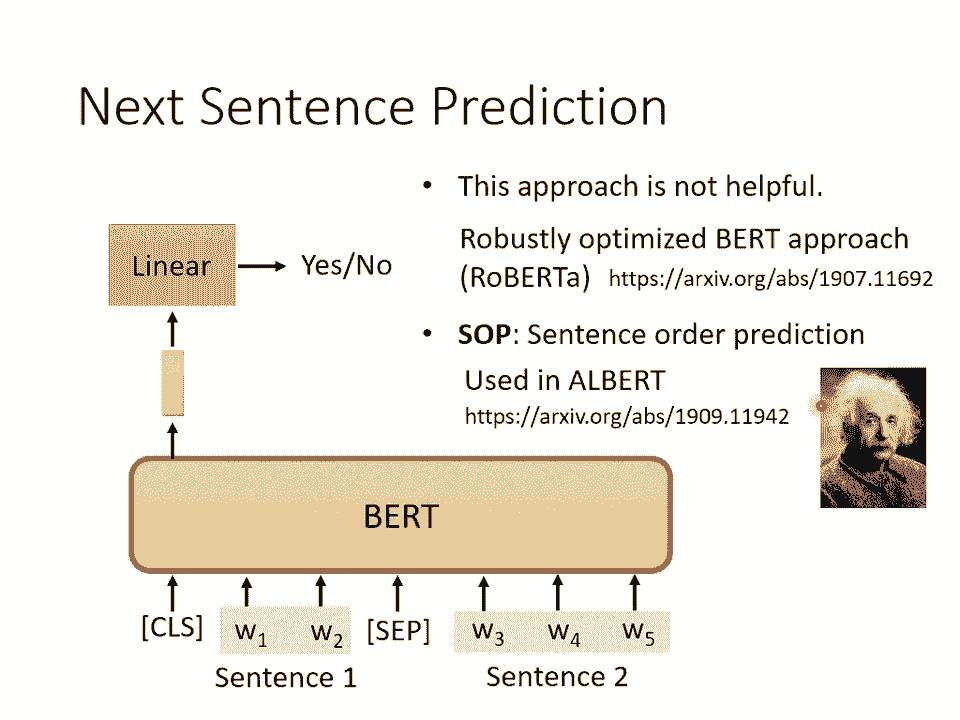

# 【国语+资料下载】李宏毅 HYLEE ｜ 机器学习(深度学习)(2021最新·完整版) - P19：L13.2- 自督导式学习2：BERT简介 - ShowMeAI - BV1fM4y137M4

那我們接下來就直接跟大家介紹BERT這個模型。

好，我們來講一下什麼是Self-supervised learning，那什麼是Self-supervised learning呢？Supervised learning大家都應該非常的熟悉了，作業1。

2，3，4，5都是supervised learning，在做supervised learning的時候，我們就是有一個model，這個model的輸入是X，輸出是Y。

那怎麼讓model輸出我們想要的Y呢？你得要有label的資料，所以可以想像說，假設你今天想要做sentiment analysis，就是讓機器看一篇文章，然後決定這篇文章是正面的還是負面的。

那你得先找一大堆文章來，然後把這些文章都給他標注，標說是正面的還是負面的，這個正面或負面就是所謂的label，你要有文章、有label才能夠訓練supervised的model。

那什麼叫self-supervised呢？self-supervised就是自己想辦法做supervised，在沒有label的情況下，怎麼說呢？假設我們現在只有一堆文章，沒有標注。

但是想辦法從這些沒有標注的資料裡面，把資料分成兩部分，讓一部分作為模型的輸入，另外一部分作為模型的標注，假設你有沒有標注的資料，比如說一篇文章叫做X，X你把它分成兩部分，一部分叫X'，一部分叫X'。

我知道到目前為止這樣講你一定覺得非常非常的抽象，等一下實際上講Bird的時候，你就可以體會什麼叫做self-supervised，怎樣叫做在明明沒有辦法做supervised的情況下。

自己想辦法自己做supervised，所以現在我們先非常抽象的講一下，把X分成兩部分，X'跟X'。然後把X'輸到模型裡面，讓它輸出Y，然後我們要讓Y跟它的label學習的目標。

跟它的labelX'越接近越好，這個就是self-supervised learning，那self-supervised learning可以看作是一種unsupervised learning的方法。

因為什麼叫unsupervised learning？有label叫做supervised learning，沒有label就是unsupervised learning。

supervised的相反就是unsupervised，那所以self-supervised，我們沒有用到label的資料，所以我們可以說它是unsupervised learning的方法。

但是這邊之所以特別稱之為self-supervised learning，是為了讓我們所指涉的方法更為的明確，self-supervised learning這個詞彙最早應該是Jan Larkin說的。

那這個其實不是一個特別舊的詞彙，Jan Larkin是什麼時候說這句話的呢？在19年4月的Facebook上的貼文說的，他說他現在把這種方法，就是我現在講的這樣子的方法。

叫做self-supervised learning，為什麼不叫做unsupervised learning呢？因為unsupervised learning是一個比較大的family。

裡面有很多不同的方法，那為了比較明確的說明說現在在做的事情是什麼，所以說現在做的是self-supervised learning，像我們剛才講的cycle gate。

那也算是unsupervised learning的方法，我們也沒有用到label的成對的資料，但是它跟self-supervised learning就是不太一樣。

所以unsupervised learning下面有很多的方法，其中一種是self-supervised learning。

好，那剛才講的非常的抽象，什麼把X分成X'跟X''，自己跟自己學，自己產生label，實際上到底是怎麼回事呢？我們就直接拿BERT這個模型來跟大家說明，實際上是怎麼做的，好。

那BERT這個model它是一個transformer的encoder，那我們已經講過transformer了嘛，我們也花很多時間介紹了encoder跟decoder。

transformer的encoder就是BERT，就是BERT的network架構，就跟transformer的encoder一模一樣，裡面就有很多self-attention，有residual。

有normalization等等，那這個就是BERT，那如果你已經忘記，這個encoder裡面有什麼樣的東西也沒關係，反正就記得說，BERT可以做的事情就是輸入一排向量，輸出另外一排向量。

輸入多長就輸出多長，那BERT的輸入是什麼呢？BERT一般是用在自然語言處理上，用在文字上，所以一般它的輸入就是一排文字，就是一個sequence，那我們其實在講self-attention的時候。

也有說過說不是只有文字是一個sequence，語音也可以看作是一個sequence，甚至image也可以看作是一堆的vector，所以跟BERT同樣的想法，不是只能用在NLP，用在文字上。

它也可以用在語音跟影像上，只是因為BERT最早是用在文字上，所以我們這邊都拿文字作為例子，你完全可以說我把輸入換成語音，把輸入換成影像，也都是一樣的，好那BERT的輸入這邊是一段文字。

那接下來我們要做的事情是，把文字輸入的這串文字裡面，其中一些部分把它隨機的蓋住，哪些部分會被蓋住呢？隨機的，隨便sample，就是你輸入100個token，那token是什麼？

token就是你在處理一段文字的時候的單位啦，那這個token的大小是你自己決定的，那在中文裡面，我們通常把方塊字當成token，所以輸入一個句子，那裡面會有一些詞彙隨機的被蓋住，那蓋住哪些？隨機決定。

隨便決定，那怎麼把它蓋住呢？所謂的蓋住具體而言是什麼樣的意思呢？有兩種做法，第一種做法是把句子裡面的某一個字，換成一個特殊的符號，我們用mask來代表特殊的符號，你就想成它是一個新的中文的字。

這個中文的字在你的字典裡面從來沒有出現過的，這是個新的字，它的意思就代表了蓋住，就代表了mask代表蓋住，另外一種做法就是，隨機把某一個字換成另外一個字，本來這邊放的是one。

那就隨便找一個中文的字把它替換掉，換成一換，換成天換成大換成小，隨便換成某一個字，所以有兩種做法，一種是加mask，一種加隨機的字，那用哪一種呢？兩種都可以用，所以到底用哪一種，也是隨機決定的。

所以在Bert在訓練的時候，輸入一個句子，先隨機決定哪些中文的字會被蓋起來，接下來再決定說要怎麼蓋，是要換成這個特殊的代表蓋住的符號，還是隨便從中文的字裡面挑一個出來把它蓋住，所以這兩種方法都可以用。

那蓋住以後呢，蓋住以後你一樣是輸入一個sequence，那Bert的輸出，它對應的輸出就是另外一個sequence，接下來啊，你把蓋住的部分所對應的輸出，就是蓋住的部分，你還是有放東西進去嘛。

只是它可能是mask或者是隨機的，蓋住的部分還是有放東西進去，它一樣輸出一個向量，把這個向量做一個linear transform，所謂做linear transform的意思就是，呈一個矩陣。

然後做softmax得到一個輸出，輸出一個分布，那這個輸出的分布是什麼東西呢，輸出的這個分布就跟我們在做translation的時候，在講sequence to sequence model。

在講transformer的時候是一模一樣的，它的輸出是一個非常長的向量，這個向量裡面包含了所有你感興趣的，你想要處理，你知道的中文的字，那每一個字都對應到一個分數，它是一個distribution。

因為這邊有一個softmax，那接下來你要怎麼訓練這個BERT呢，你訓練的時候，它訓練的目標就是，因為我們其實知道被蓋起來的東西，原來是哪一個字，BERT本身不知道，我們給BERT的時候它是被蓋起來的。

所以BERT不知道這邊應該是彎，但我們自己知道啊，我們知道說這個被蓋起來的位置，本來應該要是彎，所以BERT學習的目標就是，它要學到說這邊的輸出，跟彎這個character，跟彎這個字越接近越好。

你會把彎呢，表示成一個one-half的vector，然後你會minimize這邊的輸出，跟彎這個one-half vector的cross entropy，或講得更簡單一點。

你其實就是在做一個分類的問題，只是你有多少個類別，我們的類別的數目，就跟中文字的數目一樣多，中文字那就看你覺得有幾個，如果4000個，那就是一個4000個類別的分類的問題，那現在BERT要做的事情就是。

它必須要成功的預測說，這個被蓋起來的地方，它屬於的類別就是屬於彎這個類別，就這樣，那在訓練的時候呢，你是BERT加後面這一個linear的model，兩者一起訓練，就是BERT裡面。

它是一個transformer的encoder，有一堆的參數，linear的model是一個metric，那它也是有一些參數，但跟BERT比起來非常小杯水車薪，它們兩個是一起訓練的，要一起努力。

然後輸出要去預測說，現在被蓋住的詞彙是彎，就這樣，這個叫做masking，那其實BERT在訓練的時候，除了做masking以外，同時也會做另外一個方法。

這個另外的方法呢，叫做next sentence prediction，next sentence prediction的意思是說，你拿出兩個句子，從你的資料庫裡面，你會收集很多的句子。

那個網路上隨便爬一爬就有了，收集很多的句子，從裡面呢拿兩個句子出來，然後在這兩個句子的中間呢，你會加入一個特殊的符號代表分格，這樣BERT才知道說，這兩個是不同的句子，是兩個句子中間有個分格的符號。

那你還會在這個最前面，這整個sequence的最前面呢，加入一個特別的符號，這邊我們用CLS來表示這個特別的符號，等一下我會知道這個特別的符號，有什麼樣的作用，現在我們有一個很長的sequence。

它包括兩個句子，中間有一個分格還有CLS的符號，整個一股腦啊，把它丟到BERT裡面，然後照理說這邊輸入一個sequence，輸出就會是另外一個sequence，這個就是encoder可以做的事情嘛。

BERT就是transformer encoder，這個就是encoder可以做的事情，但是我們現在只取，CLS所對應的那個輸出，就這邊有輸出，但不管它不去看它，我們只看CLS這邊的輸出，把這個輸出啊。

乘上一個linear的transform，然後呢它要做的是什麼，它要做的是一個二元的分類問題，它要預測的就是yes或no，這個yes或no指的是什麼呢。

這個方法名字叫next sentence prediction，所以yes或no就是要預測說，這兩個句子是不是相接的，如果這兩個句子是相接的，BERT它就要訓練成，看到兩個相接的句子就輸出yes。

看到兩個不是相接的句子就輸出no，就這樣，但是後來的研究發現說，next sentence prediction，對於接下來BERT所要做的事情，其實幫助不大，那BERT接下來要做什麼事情。

我馬上就會講到了，總之這一招不太有用，舉例來說，在一篇叫做，Robustness Optimized BERT Approach的paper裡面，它說寫是Roberta，他就明確的指出說。

他嘗試了做next sentence prediction，這個方法，但是沒有什麼特別的幫助，你知道這個就是強導眾人推啦，一個人說沒有用，接下來會有更多文章說沒有用，後來什麼STEMBERT。

XLNet，通通都說next sentence prediction沒有用，那它沒有用的一個可能是，next sentence prediction，這個任務可能太簡單了。

要知道兩個句子該不該被接在一起，也許是不是一個特別難的任務，因為今天這兩個句子，你通常的做法就是，你先隨機選一個句子，接下來你選接在它後面的句子，或者是從整個資料庫裡面隨便選一句，那你通常隨便選一句。

跟你一開始選的這句一定很不像，所以對STEMBERT來說，他分辨兩個句子是不是接在一起，可能挺容易的，所以他沒有藉由這一個任務，沒有藉由next sentence prediction。

這個任務學到太多有用的東西，那後來還有另外一招，跟next sentence prediction有點像，但是在文件上看起來是比較有用的，叫做sentence order prediction。

它的縮寫是SOP，然後這個方法是說，我們找出來的sentence 1跟sentence 2，它本來就是接在一起的，只是你可能會把，本來放在前面的那個句子當sentence 1。

放在後面的那個句子當sentence 2，或者是本來放在前面的句子當sentence 2，放在後面的句子當sentence 1，有這兩種可能，然後問BERT是哪一種，那可能這個問題比較難。

所以sentence order prediction SOP，目前在文件上看起來是有用的，那它被用在一個叫做Albert，就是BERT的一個進階的版本，叫做Albert裡面。

那Albert就是愛因斯坦嘛，愛因斯坦就叫Albert，所以就翻個愛因斯坦，這邊每一個模型都有一個名字啦，沒有名字就不要說你有提出了一個模型，所以模型都要想辦法取一個名字。

那BERT怎麼用呢，我們剛才說我們叫BERT會做的事情是什麼，我們訓練的時候就是叫BERT學兩個任務嘛，一個是蓋住一些詞彙，他蓋住一些中文的字，他可以把蓋住的部分補回來，他知道怎麼做填空題。

另外一個是他可以預測兩個句子是不是應該被接在一起，但我有說這招好像沒有什麼用，那所以整體而言BERT真正學到，所以BERT他學到的是什麼，他就是學到怎麼做填空題，那你說那又怎樣。

如果我要解的任務就不是填空題的話，那這個BERT有什麼用呢，他就只會做填空題啊，他學來就是做填空題啊，你教他的事情就是做填空題啊，那訓教會一個model做填空題以後，然後呢，接下來就是神奇的地方。

他可以被用在其他的任務上，這些任務跟填空題不一定要有關，甚至是根本就沒有什麼關係，但是BERT可以被用在這些任務上，那這些任務，就BERT真正被使用的任務叫做，downstream下游的任務。

downstream的task，那downstream的task，等一下我們會舉一個具體的例子，所謂downstream task的意思就是那些你，實際上真正在意的任務。

但是我們要BERT學會做這些任務的時候，其實我們還是需要有一些標注的資料的。

等一下我們會看得更清楚一點，所以總之BERT他只學會做填空題，但接下來他可以被拿來做，各式各樣你感興趣的下游的任務，他有點像是黑胎裡面的幹細胞，他具有各式各樣無限的潛能。

雖然現在還沒有發揮他的能力只會做填空題，但是接下來他有能力去解各式各樣的任務，只要給他一點資料刺激他，他就可以，你知道幹細胞就是，黑胎幹細胞就是可以分化成各式各樣不同的細胞，心臟細胞肌肉細胞等等。

那BERT也是一樣，給他一點有標注的資料，他就可以學會，他就可以分化成各式各樣的任務，那BERT分化成各式各樣任務這件事情叫做fine tune，中文你可能會翻成微調吧，所以常聽到有人說。

他fine tune的那個BERT指的就是他手上的BERT，他把這個BERT拿來做微調，讓他可以去做某一種任務，那相對於fine tune。

在fine tune之前產生這個BERT的過程就叫做pre-trained，所以產生BERT的這個過程，他是self-supervised learning，但你也可以說他叫做pre-trained。

那你會發現說我們在作業裡面其實有反覆說，我們就不使用pre-trained的model，那如果你不知道什麼是pre-trained的model沒有關係，反正你既然不知道他是什麼，你就不會用到他。

那如果你知道是什麼的話，這邊的意思就是說，你不要用這種self-supervised learning的方法去別的地方，找一個self-supervised learning的模型直接用在作業上。

因為這些方法往往都有不可思議強大的能力，會讓你接下來做的事情變得沒有特別有趣，好但是其實接下來有個BERT的作業，作業期就是用BERT的作業嘛。

所以作業期當然就是可以用pre-trained的model的，這是唯一一個可以用pre-trained model的作業，因為作業期就是要fine-tuneBERT嘛。

所以當然你要用pre-trained的BERT來進行fine-tune，所以只有作業期是可以用pre-trained的model的，好那在講BERT是怎麼fine-tune之前。

我們先來看看他的能力，今天你要測試一個self-supervised learning的model的能力，通常你會把他測試在多個任務上，因為我們剛才說BERT就像是一個黑胎幹細胞。

接下來他要分化去做各式各樣的任務，所以我們通常不會只測試他在一個任務上的能力，你是會把這個BERT分化去做多個不同的任務，看看他在每個任務上得到的正確率是多少，再取一個平均值，那在這種任務組合。

這種這樣一個模型去測度的時候，我們就叫任務集吧，在任務集裡面最知名的一個標杆就叫做Group，他是General Language Understanding Evaluation的縮寫。

那group裡面總共有九個任務，一般你想要知道一個像BERT這樣訓練出來的模型好不好，你就會把他分別微調在九個任務上，所以你實際上會得到九個模型，分別做在九個任務上，看看這九個任務上正確率的平均是多少。

那你得到一個數值，這個數值代表了這個Self-Supervised Model的好壞。

好那我們來看一下在Group上面的表現，有了BERT以後，Group的分數就是那九個任務的平均的分數，確實逐年攀升，那在這個圖上啊，橫軸是不同的模型，這邊有列碼，那你發現說來來去去都是有什麼。

ELMO啊，GPT啊，BERT啊，BERT啊，BERT啊，BERT啊，BERT啊，一大堆BERT這樣子，各式各樣的BERT，那這個黑色的線啊，代表的是人類在這個任務上得到的正確率，那這個當作是1。

那這邊每一個點呢，就代表了一個任務，那你為什麼要跟人類的正確率比呢，人類正確率是1，然後這些點呢，如果做的比人類好，就是大於1，做的比人類差，就是小於1，那所以這些任務。

他們用的那個評估的標準不見得是正確率，每個任務用的評估標準不一樣，不見得是正確率，所以直接把它的數值放在一起比，可能沒什麼意思，所以這邊呢，是看跟人類的差距，所以你會發現說。

本來9個任務裡面只有一個是比，可以做的比，機器可以做的比人類好的，後來呢，隨著越來越多技術被提出來，越來越就有，就有，有另外三個任務可以做的比人類好，而其他本來跟人類相差甚遠的任務，也慢慢的追上來了。

他的機器的效能也慢慢追上來了，藍色的虛線，是機器的Groovescore的平均，發現說最近一些比較強的模型，比如說XL內，居然還超越了人類，當然你這只是在這一個資料集上面的結果。

並不代表說機器in general真的超越了人類，他只是在這個資料集上超越了人類，這顯示的是什麼呢，就這個資料集被玩壞了，不夠難，所以接下來在Grooves之後，就有人做了Super Grooves。

找更難的自然語言處理的任務，來讓機器來記，好 但秀這個圖的意思主要想要告訴你說，有了BERT這樣的技術以後，確實機器在自然語言處理的能力上面。

又往前邁進了一步，好 那BERT到底是怎麼被使用的呢，BERT是這樣子用的，我們等一下會舉四個使用BERT的case，第一個case是這樣子的，第一個case是，假設我們的downstream的任務。

是輸入一個sequence，輸出一個類別，它是一個分類的問題，只是輸入是一個sequence，什麼樣的任務是輸入一個sequence，輸出一個類別呢，比如說sentiment analysis。

就給機器一個句子，只要去判斷說這個句子是正面的還是負面的，那對於BERT而言，他怎麼解sentiment analysis的問題呢，你就給他一個句子，就是你要拿來決定sentiment的那個句子。

然後把這個句子前面呢，放CLS那個token，我剛才說CLS token，我上次提到他的時候是在講，next sentence prediction的時候，前面放CLS的token，丟到BERT裡面。

那這四個輸入，其實都會對應給他四個輸出，那我們只看CLS的部分，CLS這邊輸出一個向量，把它做一個linear transform，乘上一個linear的transform，乘上一個矩陣。

那這邊呢把softmax省略掉了啦，通過softmax，然後決定說輸出的類別是什麼，正面還是負面等等，好那這邊實際上在做的時候，你需要有你下游任務的標注資料，也就是說BERT並沒有辦法。

憑空去解sentiment analysis的問題，你仍然需要提供BERT的一些標注的資料，你需要提供給他大量的句子，跟每一個句子是正面的還是負面的，你才能夠去訓練這個BERT的模型，在訓練的時候。

我們其實是把BERT，加上這個linear的transform合起來，說它是一個完整的，sentiment classification的模型，在訓練的時候linear的部分跟BERT。

都會用gradient descent去update，只是現在呢，原linear的部分，它的參數是隨機初始化的，而BERT的部分，它的初始的參數，是從學習了做填空題的那個BERT來的。

我們在訓練模型的時候，不是會隨機初始化一個參數嗎，然後用gradient descent去調那個參數，對不對，然後最後去minimize我們的loss，那這邊也是一樣。

我們有一個要minimize的loss，就是做sentiment classification，但是我們的參數，不再是完全隨機初始化了，有了BERT以後，我們有唯一隨機初始化的，只有這個地方。

而BERT這個本體，這邊是一個巨大的transformer encoder，這個network它的參數，不是隨機初始化的，我們是直接把，學會了做填空題的BERT，它的參數拿來填在這個地方。

把那個可以做填空題的BERT的參數，拿來填在這個地方，當做初始化的參數，那為什麼要這樣做，為什麼要用那個學會做填空題的BERT，把它放在這邊呢，那最直覺最簡單的理由當然是，比隨機初始化好。

當你這邊放了那個，會做填空題的BERT的時候。

它得到的結果會比隨機初始化好，那這邊有一個文獻上的例子啦，橫軸是訓練的EPA，縱軸是training的loss，大家現在一定非常熟悉這樣的圖形了，那隨著training的過程的進行。

training的loss當然會越來越低，那有趣的地方是，這邊這個圖上有各式各樣的任務啦，細節是什麼我們就不解釋，這邊就是各種不同的任務，那FindQ代表的就是有品training。

就是BERT的那個部分，那個encoder的那個部分，是用學會做填空題的那個BERT的參數，來做初始化的，scratch的意思就是，整個model包括BERT的那個本體，包括encoder的部分。

都是隨機初始化的，那你會發現說呢，如果是scratch，scratch就是虛線，虛線就是scratch，如果是scratch的話，首先你在訓練的時候，它loss下降比較慢，相較於有用BERT初始化的。

有用會做填空題的BERT初始化的參數，它的下降比較慢，而且就算是最後降下來了，有隨機初始化的參數，它的loss也比有做填空題做初始化的，有用填空題BERT做初始化的參數，它的loss還要更高。

所以這個就是BERT可以在表面上，帶給我們的好處。

好講到這邊呢，我其實就特意留了一頁投影片想要停一下，就接下來還有其他的內容，但我想在這邊停一下，確定大家了解我所表達的意思，好，在這邊要聽得懂，接下來你才有辦法繼續聽下去，所以我想問一下到這個部分。

大家有沒有問題想要問呢，你可以了解pre-train跟fine-tune是怎麼一回事嗎，剛才其實在下課的時候。

有同學問到說，像BERT的這一種做法，它是不是semi-supervised的呢，它是semi-supervised，還是unsupervised的呢，都是，就是self-supervised那一階段。

學填空題那一階段，是unsupervised的，但接下來你要把BERT用在，下游的downstream的這些任務上，用在下游的任務上，下游任務需要有標注的資料。

那你在做self-supervised learning的時候，用了大量沒有標注的資料，但下游任務有少量有標注的資料，所以合起來是semi-supervised。

所謂semi-supervised意思就是，你有大量沒標注的資料，少量有標注的資料，這種狀況就是semi-supervised，所以整個BERT的使用的過程合起來。

就是pre-train加fine-tune合起來，它算是一種semi-supervised的方法，好，講到這邊，大家有沒有問題想要問的呢，有嗎。

沒有嗎，好，如果沒有的話就要繼續下去了。

接下來其實跟剛才的這個case 1，都非常非常的像，所以如果你懂case 1在講什麼，接下來就是一法通萬法通而已。

接下來還有三個case，好，如果大家沒有問題就繼續下去囉，好，那接下來的三個case是什麼呢，第二個case是輸入一個sequence，輸出另外一個sequence，但輸入跟輸出的長度是一樣的。

那我們在講self-attention的時候，也舉過類似的例子，什麼樣的任務是輸入跟輸出長度一樣的呢，比如說POS tagging，POS tagging就是詞性標注，你給機器一個句子。

它要告訴你說這個句子裡面每一個詞彙，它對應到什麼樣的詞性，有時候就算是同樣的詞彙，也可能有不同的詞性，這個我們在Sales Supervised Learning的時候有講過了，好。

那Bert怎麼處理這種問題呢，你就給Bert輸入一個句子，然後接下來呢，這個輸入這個句子以後，接下來呢，這個句子裡面的每一個token，如果在中文就是代表每一個字就有一個對應的向量，然後接下來呢。

再把每一個向量分別做一個linear的transform，乘上一個矩陣，再過softmax，然後再去predict說，這邊輸入的每一個詞彙屬於哪一個類別，比如說哪一個詞性，當然隨著你的任務不同。

這邊對應的類別也就會不一樣，那接下來呢，接下來就跟case 1完全一樣，也就是說你需要有一些標注的資料，這仍然是一個一般的分類的問題，只是跟一般分類問題不一樣的地方是，Bert這個部分。

這個本體的這個encoder的部分，他的參數不是隨機初始化，他已經在pre-trained的時候找到一組比較好的初始化的參數，好，講到這邊大家有問題想問嗎。

好，沒有的話呢，我們就再繼續看case 3，那case 3是輸入兩個句子，輸出一個類別，但我們這邊舉的都是自然語言處理的例子，但你完全可以把這些例子改成比如說語音的例子，或改成影像的例子，對不對。

我們在講self-supervised learning的時候講過說，不管是語音還是文字還是圖片，都可以看做是一排向量，所以雖然我等一下舉的例子通通都是文字的，但你不要把它想成這個技術只能侷限在文字上。

他完全可以用在文字以外的任務上，好，那輸入第三個case，輸入兩個句子，輸出一個類別，有什麼樣的任務呢，最常見的是natural language inference，他的縮寫是NLI。

natural language inference做的事情是什麼呢，這邊是給機器兩個句子，一個句子叫做premise，就是前提，另外一個句子叫做假設，機器要做的事情就是。

從這個前提能不能夠推出這個假設，這個前提跟這個假設是矛盾的嗎，還是不是矛盾的，在這個例子裡面，我們的前提是有一個人，他騎著一個馬，然後他跳過了一個壞掉的飛機，聽起來有點怪怪的。

但是這個句子真的就是這個樣子，這是一個Benchmark corpus，基礎語料庫裡面的例子，就有一個人騎著馬跳過了飛機，他在做一個雜耍，那這邊的推論是這個人正在，這個人呢。

這個diner應該是小餐館的意思，就這個人在一個小餐館裡面，是嗎，不是，所以這個是矛盾的，就這樣，所以機器要做的事情就是，吃兩個句子，吐出這兩個句子之間的關係，那像這樣子的任務，其實也還蠻常見的。

它可以用在什麼地方呢，舉例來說，立場分析，就給一篇文章，然後下面有一個人留言，那這個留言是贊成這篇文章的立場，還是反對這篇文章的立場呢，那你就把文章跟留言都丟進模型裡面，模型要預測的就是贊成還是反對。

所以輸入兩個句子輸出一個類別，也有蠻多的應用的。

好那Bert怎麼解這個問題呢，你就給他兩個句子，我們的模型要輸入兩個句子，兩個句子中間放一個特殊的符號，分隔的符號，那最前面再放CLS這個符號，然後一整串東西丟到Bert裡面。

Bert也會給我們另外一整串東西，輸入多長Bert就輸出多長，但是我們只取CLS這個部分，丟到transform裡面，丟到linear transform裡面，然後決定說現在輸入這兩個句子。

輸出應該輸出什麼樣的類別才是對的，這兩個句子是矛盾的嗎，還是不是矛盾的，如果在NLI裡面，就是要問說這兩個句子是矛盾的，還是不是矛盾的，好這個是例子三，那一樣我們需要一些標註的資料。

才有辦法訓練這個模型，一樣Bert這個部分不再是隨機初始化的。

他是用Bert用Pretrend來初始化的，好接下來進入第四個case，第四個case其實就是我們在作業的裡面，會做的case了，所以就如果前面沒聽懂的話，那就算了。

這個第四個case是我們在作業7要做的，作業7要做的是什麼呢，作業7要做的是問答系統，也就是你給機器讀一篇文章，問他一個問題，他真的會給你一個答案，但是這邊這個問答不是一般的問答。

他是稍微有點限制的問答，這種問答是extraction based的QA，也就我們假設說答案一定出現在文章裡面，答案一定是文章裡面的一個片段，好那怎麼做這種問答系統呢。

怎麼做extraction based的問答系統呢，在這個任務裡面，我們的輸入有文章有問題，不管是文章還是問題，他都是一個sequence，如果是中文的話，這邊每一個D就代表了一個中文的字。

這邊每一個Q就代表了一個中文的字，你把D跟Q都丟到QA的模型裡面，他會輸出什麼，我們要他輸出兩個正整數，S跟E，根據這兩個正整數，直接從文章裡面截一個段落出來，就是答案，輸入S輸出E，代表的意思就是說。

從這個文章裡面的第S個字，到第一個字，這E不是1234的E是字母，E是從第S個字到第一個字，串起來就是正確答案，這個聽起來非常的狂，但這個其實是今天非常標準的做法，我第一次聽到說做這個。

五六年前第一次聽到說做QA的時候，居然是讀一篇文章，給一個問題輸出兩個正整數，就是答案了，我實在是不可置信，但反正今天這個是一個非常常見的做法，那如果你有點聽不懂的話，那講得更具體一點。

現在有一篇文章有一個問題，那正確答案是gravity，機器怎麼輸出gravity這個正確答案呢，他要吐出就你的QA的模型，要吐出兩個整數，一個是S等於17，另外一個也是等於17。

就gravity他出現在整篇文章裡面的，他是整篇文章的第17個詞彙，那S等於17E等於17，意思就是把第17個詞彙抽出來當作答案，或者是舉另外一個例子，今天最後一個問題。

他的答案是within a cloud，在文章裡面，within a cloud是第77到第79個詞彙，那你的模型要做的事情就是，輸出77跟79這兩個正整數，然後這兩個正整數77到79。

在文章裡面第77到第79個詞彙，這一段文字就是模型的答案，就結束了，這個就是作業7要做的事情，當然我們這邊不是從頭from scratch，就從random initialize的參數。

來訓練這個QA的模型，我們是有用BERT的pre-trained，那用BERT的pre-trained，怎麼解這種QA的問題呢，這個解法是這個樣子的，BERT這個模型，你要給他看一個問題。

給他讀一篇文章，文章跟問題中間，問題跟文章中間有一個特殊的符號，然後前面再放一個CLS的token，這跟剛才那個natural language inference的case，是一模一樣的。

只是在natural language inference裡面，兩個句子一個是前提，一個是結論，這邊一個是文章，一個是問題，那在這整個任務裡面，你唯一需要訓練的東西只有，你唯一需要從頭開始訓練。

所謂從頭開始訓練就是，random initialize的東西，只有兩個向量，這邊用橙色的向量，跟藍色的向量來表示，這兩個向量的長度，跟BERT的輸出是一模一樣的，假設你BERT的輸出。

這邊每個向量是768位的向量，那這兩個向量也就是兩個768位的向量，那接下來呢，怎麼使用這兩個向量呢，你就把這兩個向量，先把橙色的拿出來，分別跟對應到文章這個部分，所輸出的這邊的每一個向量。

做inner product，就文章這邊輸入三個token，這邊就輸出三個向量，把這三個向量，都去跟橙色的這個向量，做inner product，算出三個數值，接下來過softmax，得到三個數值。

這個算inner product這個部分就跟，attention有點像，你可以把橙色的部分想成是query，黃色的部分想成是key，那這就是做一個attention，那接下來看哪裡分數最高。

這個地方分數最高嗎，D2所對應的向量乘上橙色的向量以後，這個得到分數最高嗎，那S就等於2，你輸出的起始的位置，代表起始位置的那個正整數，就輸出2，那藍色的部分也做一模一樣的事情。

藍色的部分代表答案結束的位置，所以我們把藍色的向量，跟這邊的每一個黃色的向量，跟對應到文章裡面每一個，token的黃色的向量做inner product，再做softmax，再看誰的值最大。

第三個位置的值最大嗎，那1就等於3，這個時候正確的答案就是D2 D3，就結束了，所以你的模型要做的事情，其實就是去預測，正確的答案出現的起始位置，就因為答案一定在文章裡面嘛。

如果不在文章裡面就不能用這一招啦，但這邊假設答案一定在文章裡面，所以你要找出正確答案在文章裡面的，起始的位置跟結束的位置，這就是這個QA的模型，這個Question Answering問答系統。

所要做的事情，當然你需要一些訓練資料，才能夠訓練這個模型，那這兩個向量是隨機初始化的，而這個BERT的部分是在pre-trained的時候，已經得到它的初始化的參數了，講到這個部分大家有沒有問題要問呢。

(觀眾：你說BERT的輸入大小有限制嗎)，你說輸入的長度有沒有限制對不對，好 這個是一個很好的問題，我複述一下，BERT輸入的長度有沒有限制呢，理論上沒有但實際上有，就是理論上。

因為BERT的模型它是一個，這個Transformer的Encoder嘛，所以它可以吃很長很長的Sequence，你只要能夠做Self-Attention就行。

但是你知道Self-Attention它的運算量非常的驚人，所以你發現實作上，BERT其實沒有辦法吃太長的Sequence，你可能最多吃個512就差不多了，如果你吃512長的Sequence。

中間Self-Attention都已經要產生那個，512x512的Attention的Metric，那你可能運算就吃不消了，對 所以實際上它的長度不是無限長的，在助教的程式裡面。

已經幫大家處理的這個問題，我們會限制BERT它吃的長度，而且在訓練的時候，一篇文章很長嘛，那我們會怎麼處理呢，我們把文章結成一小段一小段一小段，那我們每一次都只會拿一小段出來做訓練。

我們不會把整篇文章丟到BERT裡面，因為你那個要的距離太大，你訓練起來會有問題，這樣回答到你的問題嗎，謝謝，好 大家有問題要問嗎，來這邊 來，(觀眾：聽不懂)，不好意思 你說我沒有聽得很清楚。

你可以再說一遍嗎，(觀眾：聽不懂)，你說跟填空題有什麼關係對不對，哇 這個問題太棒了，你就會問說，這個填空題就是填空題啊，那後面不就是做問答，就是這邊是要做問答嘛，這兩件事情怎麼會有關係呢。

這個就是賣個關子，等一下就會試著回答你了，好 這個大家還有沒有問題要問，還有嗎。

沒有的話 那我們就繼續了，下一頁投影片就告訴你說，BERT這麼知名的模型，這就是全部了，那你可能會覺得說，這個BERT這個，pretrain的時候就是做填空題啊，這個我自己應該也有辦法做吧。

我就把那個作業室的程式改一改，也可以做讓機器學做填空題啊，那這個厲害在哪裡，厲害的地方就是，哇 這個你真的是沒辦法自己做了，這個你真的是自己訓練不起來，首先當初最早的Google的BERT。

他用的資料量也已經非常驚人了，他的資料量有三個billion的詞彙，三個billion的詞彙有多少呢，他是哈利波特全集的三千倍啦，哈利波特全集大概是一百萬個詞彙。

那Google在訓練最早的那個BERT的時候，他用的資料量是哈利波特全集的三千倍，所以你處理起來已經有點痛苦了，再來更痛苦的是訓練的過程，為什麼知道訓練過程很痛苦呢，因為我們實驗室有個同學。

他也是一位助教之一，他試圖自己train了一個BERT，看可不可以複現Google的結果，所以在這個圖上面，縱軸代表的就是Groove的分數，剛才講過Groove對不對，有九個任務。

九個任務平均起來的分數，叫做Groove的分數，這是Google最原始的BERT的Groove的分數，是藍色這一條線，我們的目標其實不是做BERT，是做ALBERT，ALBERT是一個進階的版本。

他是橙色這一條線，藍色這一條線是我們自己訓練的ALBERT，我們其實訓練的還不是最大的版本，BERT有Base的版本跟Large的版本，Large的版本我們要自己train，真的是train不動。

所以我們做了試著train最小的版本，看看能不能夠跟Google得到的結果一樣，那Google這邊這樣，這個你可能會說，這個三個billion的data，三個billion詞彙的data好像很多。

其實因為他是unlabeled的資料，所以你從網路上隨便爬一堆文字，就有這麼多資料，所以你要爬這個等級的資料，並沒有很困難，但難的是訓練的部分，這個橫軸就是訓練的過程，參數update幾次呢？

update一百萬次，那這要花多長的時間呢？用TPU跑了八天，所以你這個TPU都要跑八天，如果你用colab做的話，這個至少要跑兩百天以上，你跑到明年你都跑不出來，所以你知道這種BERT這種模型。

你在自己家裡真的是沒有辦法做，還好作業只是要微調它，微調它你就有辦法用colab做，用colab微調BERT的話，大概半個小時到一個小時，你可以微調完，但你要從頭開始訓練，訓練它做填空題這件事情，哇！

太花時間了。

你不可能用colab自己把它做出來，那你可能會問說，為什麼我們要自己訓練一個BERT呢？那反正Google都已經有訓練出BERT了，而且這些pre-trained model都是公開的。

我們自己訓練一個，而且結果跟Google的BERT差不多，到底有什麼意義呢？那這邊想要做的事情呢，其實是想要建立BERT胚胎學，BERT胚胎學指的是什麼意思呢？我們知道BERT的訓練過程。

需要耗費非常大的運算資源，所以我們想要知道說，有沒有什麼可能去節省這個運算資源，有沒有可能讓它訓練得更快一點，那想要知道怎麼讓它訓練得更快一點，也許我們先從觀察它的訓練過程開始做起。

過去從來沒有人觀察過BERT的訓練過程，因為對Google的Apple而言，它就是就直接告訴你說我有這個BERT嘛，然後它在各個任務上都做得很好，那實際上在訓練BERT這個學填空題的過程中。

到底BERT學到了什麼事情，這個過程中它什麼時候學會填動詞，什麼時候學會填名詞，什麼時候學會填代名詞，沒有人去研究過這件事情，所以我們自己train了一個BERT以後。

我們就可以觀察BERT在什麼時候學會填什麼樣的詞彙，它的填空的能力到底是怎麼增進的，好 那這個細節就不是這門課的主軸了啦，所以這邊就不講了，我們就把論文的連結放在這邊給大家參考，這邊爆雷一下就是。

得到的結論跟你直覺想像的是不太一樣的。

好 那我們還沒有講到為什麼BERT會好，不過我們再補充說明一件事情就是，剛才講的那些任務，都沒有包括sequence to sequence的model，那如果我們今天要解的任務。

是sequence to sequence model怎麼辦呢，BERT只有pretend encoder。

有沒有辦法pretend sequence to sequence model的decoder呢，可以的 那怎麼做，你就說我有一個sequence to sequence model。

有一個transformer，還有一個encoder，有一個decoder，輸入是一串句子，輸出是一串句子，中間用cross attention連接在一起，那你給這個encoder的輸入。

你故意做一些擾動，把它弄壞，等一下會具體的跟你講說什麼叫做弄壞，然後decoder是什麼呢，decoder就是我希望輸出的句子，跟弄壞前是一模一樣的，encoder看到弄壞的結果。

然後decoder要輸出還原弄壞前的結果，train下去就是pretend一個sequence to sequence model。

那怎麼弄壞呢，就有各種不同的方法，有一篇paper叫做Math，Math裡面就說，這個弄壞的方法就跟BERT一樣，就是把一些地方蓋起來就結束了，那後來還有各式各樣弄壞的方法，比如說把一些詞彙刪掉。

把詞彙的順序弄亂，把詞彙的順序做一個旋轉，然後或者是說，既插入math又把一些詞彙弄掉，總之有各種不同的方法把輸入的句子弄壞，然後再請sequence to sequence model把它還原回來。

有一篇paper叫做BUT，他就是把這些方法一股腦的都用上去，發現說都用可能結果是比較好的，可以比math還要更好，我這邊就想問一個問題，為什麼他不是芝麻街的人物了，那你可能會問說。

那有這麼多的方法，就有這麼多弄壞的方法，有這麼多math的方法，哪種方法比較好呢，也許你想自己做些實驗來嘗試一下，那這邊告訴你說，你已經不用做了，Google都幫你做完了，有一篇paper叫做T5。

T5是什麼的縮寫呢，他是transfer text to text transformer，有五個T，這叫T5的縮寫，這個T5裡面他就是做了各式各樣的嘗試。

你可以想得到的組合他都做過了，就這樣，那paper長達67頁，你自己回去再慢慢讀，看看得到什麼樣的結論，這個T5他是訓練在一個叫做，ColosoCleanCodeCorpus上面的，data set上。

Coloso就是科羅索，Coloso就是非常巨大的意思，那合起來呢，叫做C4，所以你用C4訓練T5，而且大家都是命名大師，命名都非常的厲害，這個C4有多大呢，C4是公開的資料集，你可以載到他。

他是公開的，但是他的原始檔案的大小，有7T，你載了下來你也不知道放哪裡，而且他載下來以後呢，Google提供那個script去做pre-processing，去做前處理，那他有加一個說明說，看網站上。

釋出這個Coloso的網站上加一個說明說，前處理用一張GPU要花355天，這樣子，這個，哇這個你載下來你要前處理，也是有問題的，所以你發現說今天，這個做deep learning，用的資料量還有模型。

真的都非常的驚人。

