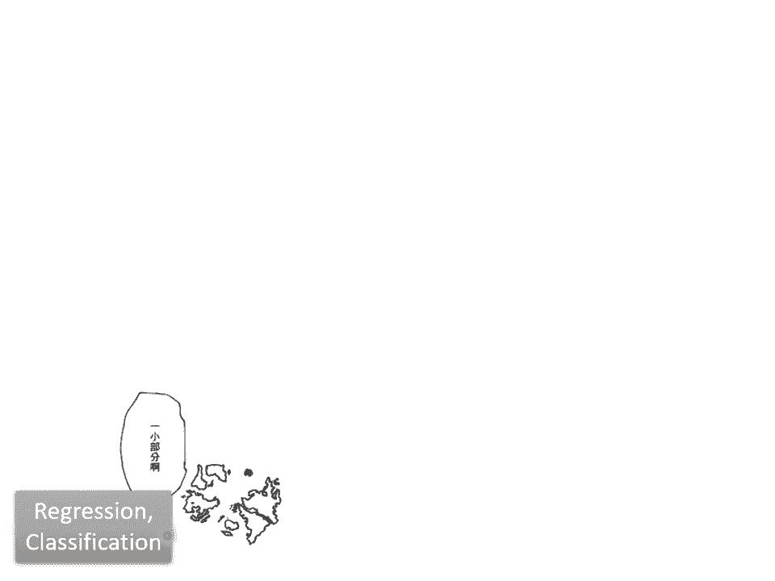
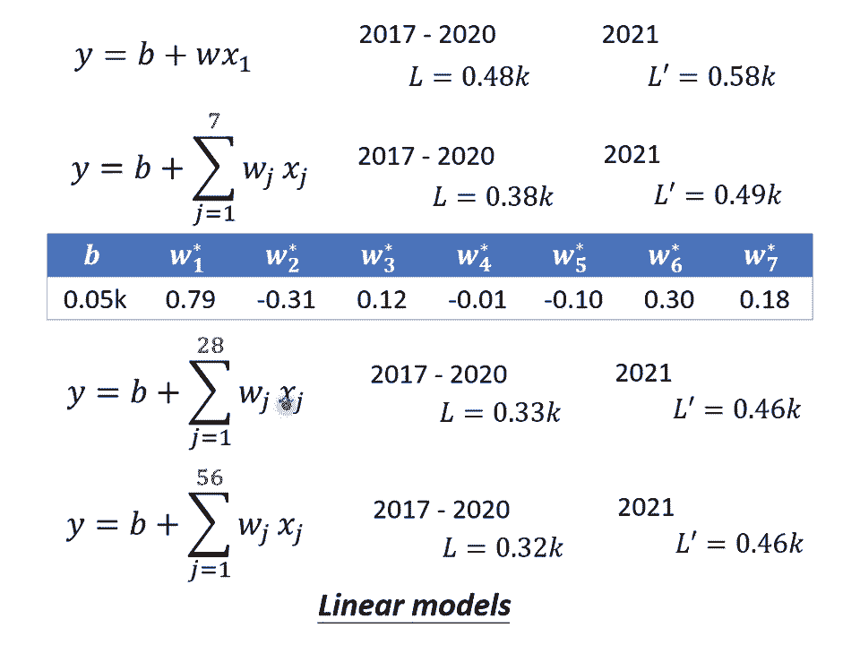

# 【国语+资料下载】李宏毅 HYLEE ｜ 机器学习(深度学习)(2021最新·完整版) - P1：L1.1- 机器学习基本概念简介 - ShowMeAI - BV1fM4y137M4

好 那我們就開始上課吧，那第一堂課啊，是要簡單跟大家介紹一下，Machine Learning 還有 Deep Learning 的基本概念，那等一下呢，會講一個跟寶可夢完全沒有關係的故事。

告訴你機器學習還有深度學習的基本概念，好 那什麼是機器學習呢，那我想必大家在報章雜誌上，其實往往都已經聽過機器學習這個詞彙，那你可能也知道說，機器學習就是跟今天很熱門的 AI，好像有那麼一點關聯。

那所謂的機器學習到底是什麼呢，顧名思義好像是說，機器它具備有學習的能力，那些科普文章往往把機器學習這個東西，吹得玄之又玄，好像機器會學習以後，我們就有了人工智慧，有了人工智慧以後。

機器接下來就要統治人類了，那機器學習到底是什麼呢，事實上機器學習概括來說，可以用一句話來描述機器學習這件事，什麼叫機器學習呢，機器學習就是讓機器具備，找一個函式的能力，那機器具備找函式的能力以後。

它可以做什麼樣的事情呢，它確實可以做很多事，舉例來說，假設你今天想要叫機器做語音辨識，機器聽一段聲音，產生這段聲音對應的文字，那你需要的就是一個函式，這個函式的輸入是聲音訊號，輸出是這段聲音訊號的內容。

那你可以想像說，這個可以把聲音訊號當作輸入，文字當作輸出的函式，顯然非常非常的複雜，它絕對不是，你只可以用人手寫出來的方程式，這個函式它非常非常的複雜，人類絕對沒有能力把它寫出來，所以我們期待。

憑藉著機器的力量，把這個函式自動找出來，這件事情就是機器學習，那剛才舉的例子是語音辨識，還有好多好多的任務，我們都需要找一個很複雜的函式，舉例來說，假設我們現在要做影像辨識，那這個影像辨識。

我們需要什麼樣的函式呢，這個函式的輸入是一張圖片，它的輸出是什麼呢，它是這個圖片裡面有什麼樣的內容，或者是大家都知道的alphaGo，其實也可以看作是一個函式，要讓機器下文詞，我們需要的就是一個函式。

這個函式的輸入，是棋盤上黑子跟白子的位置，輸出是什麼，輸出是機器下一步應該落子的位置，假設你可以找到一個函式，這個函式的輸入，就是棋盤上黑子跟白子的位置，輸出就是下一步應該落子的位置。

那我們就可以讓機器做自動下文詞，這件事就可以做一個alphaGo，那隨著我們要找的函式不同，機器學習有不同的類別，那這邊介紹幾個專有名詞，給大家認識一下，第一個專有名詞叫做regression。

regression的意思是說，假設我們今天要找的函式，它的輸出是一個數值，它的輸出是一個scalar，那這樣子的機器學習的任務，我們稱之為regression，那這邊舉一個regression的例子。

假設我們今天要機器做的事情，是預測未來某一個時間的PM2。5的數值，你要叫機器做的事情是找一個函式，這個我們用F來表示，這個函式的輸出，是明天中午的PM2。5的數值，它的輸入可能是種種跟預測PM2。

5有關的指數，包括今天的PM2。5的數值，今天的平均溫度，今天平均的臭氧濃度等等，這個函式可以拿這些數值當作輸入，輸出明天中午的PM2。5的數值，那找這個函式的任務叫做regression。

那還有別的任務嗎，還有別的任務，除了regression以外，另外一個大家耳熟能詳的任務，叫做classification，那classification這個任務要機器做的是選擇力。

我們人類先準備好一些選項，這些選項又叫做類別又叫做class，我們現在要找的函式，它的輸出就是從我們設定好的選項裡面，選擇一個當作輸出，這個問題這個任務就叫做classification，舉例來說。

現在每個人都有Gmail account，那Gmail account裡面有一個函式，這個函式可以幫我們偵測一封郵件，是不是垃圾郵件，這個函式的輸入是一封電子郵件，那它的輸出是什麼呢。

你要先準備好你要機器選的選項，在偵測垃圾郵件這個問題裡面，可能的選項就是兩個，是垃圾郵件或不是垃圾郵件，yes或者是no，那機器要從yes跟no裡面，選一個選項出來。

這個問題叫做classification，那classification不一定只有兩個選項，也可以有多個選項，舉例來說，alphaGo本身也是一個classification的問題。

那只是這個classification，它的選項是比較多的，那如果要機器下圍棋，你想追著alphaGo的話，我們要給機器多少個選項呢，你就想想看棋盤上有多少個位置，那我們知道棋盤上有19x19個位置。

那叫機器下圍棋這個問題，其實就是一個有19x19個選項的選擇題，你要叫機器做的就是找一個函式，這個函式的輸入是棋盤上A子跟白子的位置，輸出就是從19x19個選項裡面，選出一個正確的選項。

從19x19個可以落子的位置裡面，選出下一步應該要落子的位置，這個問題也是一個分類的問題，那其實很多教科書，在講機器學習的種種不同類型的任務的時候，往往就講到這邊，告訴你說機器學習兩大類任務。

一個叫做regression，一個叫做classification，然後就結束了，但是假設你對機器學習的認知，只停留在機器學習就是兩大類任務，regression跟classification。

那就好像你以為說這個世界只有五大洲一樣，但我們知道這個世界不是只有五大洲對不對。

這個世界是外面是有一個黑暗大陸的，鬼滅之刃連戰之前，我們就已經出發前往黑暗大陸了，鬼滅之刃連戰以後，我們居然都還沒有到，可見這個黑暗大陸巨無人，那在機器學習這個領域裡面，所謂的黑暗大陸是什麼呢。

在regression跟classification以外，大家往往害怕碰觸的問題，叫做structural，也就是機器今天不只是要做選擇題，不只是輸出一個數字，他要產生一個有結構的物件。

舉例來說機器畫一張圖，寫一篇文章，這種叫機器產生有結構的東西的這個問題，就叫做structural learning，那如果要講的比較擬人化比較潮一點，structural learning。

你可以用擬人化的講法說，我們就是要叫機器學會創造這件事情，好那到目前為止，我們就是講了三個機器學習的任務，regression classification跟structural learning。

接下來我們要講的是，我們說機器學習就是要找一個函式，那機器怎麼找一個函式呢，這邊要用個例子跟大家說明說，機器怎麼找一個函式，這邊的例子是什麼呢，這邊的例子。

在講這個例子之前，先跟大家說一下說這門課，有一個YouTube的頻道，然後我會把上課的錄影，放到這個YouTube的頻道上面，那這個頻道感謝過去修過這門課的同學不嫌棄，其實也蠻多人訂閱。

所以我算是一個三流的YouTuber，是沒有什麼太多流量，但是也是有這邊有7萬多訂閱，那為什麼突然提到這個YouTube的頻道呢，因為我們等一下要舉的例子，跟YouTube是有關係的。

那你知道身為一個YouTuber，YouTuber在意的東西是什麼呢，YouTuber在意的就是這個頻道的流量對不對，假設有一個YouTuber是靠著YouTube維生的，他會在意說頻道有沒有流量。

這樣他才會知道他可以獲利多少，所以我在想說我們有沒有可能找一個函式，這個函式他的輸入是YouTube後台的資訊，輸出是這個頻道隔天的總點閱率，總共有多少，假設你自己有YouTube頻道的話。

你會知道說在YouTube後台，你可以看到很多相關的資訊，比如說每一天按讚的人數有多少，每一天訂閱的人數有多少，每天觀看的次數有多少，我們能不能夠根據一個頻道，過往所有的資訊去預測。

他明天有可能的觀看的次數是多少呢，我們能不能夠找一個函式，這個函式的輸入是YouTube上面，YouTube後台所有的資訊，輸出就是某一天隔天，這個頻道會有的總觀看的次數呢。

那你可能會問說為什麼要做這個，如果我有盈利的話，我可以知道我未來可以賺到多少錢，但我其實沒有開盈利，所以我也不知道為什麼東西要做這個就是了，完全沒有任何卵用，我單純就是想舉一個例子而已，好那接下來啊。

我們就要問怎麼找出這個函式呢，怎麼找這個函式F，輸入是YouTube後台的資料，輸出是這個頻道隔天的點閱的總人數呢，那機器學習找這個函式的過程啊，分成三個步驟。

那我們就用YouTube頻道點閱人數預測這件事情，來跟大家說明這三個步驟是怎麼運作的，第一個步驟是，我們要寫出一個帶有未知參數的函式，簡單來說就是我們先猜測一下，我們打算找的這個函式F。

它的數學式到底長什麼樣子，舉例來說我們這邊先做一個最初步的猜測，這個F長什麼樣子呢，這個輸入跟Y之間有什麼樣的關係呢，我們寫成這個樣子，Y=1+W*X1，這邊的每一個數值是什麼呢，這個Y啊。

就假設是今天吧，這個Y因為今天還沒有過完啊，所以我們還不知道今天總共的點閱次數是多少，所以這件事情是我們未知的，Y是我們準備要預測的東西，我們準備要預測的是今天2月26號，這個頻道總共觀看的人數。

那X1是什麼呢，X1是這個頻道前一天總共觀看的人數，Y跟X1都是數值，都是我們這個Y呢，是我們準備要預測的東西，而X1是我們已經知道的資訊，那B跟W是什麼呢，B跟W是未知的參數。

它是準備要透過資料去找出來的，我們還不知道W跟B應該是多少，我們只是隱約的猜測說，那這個猜測為什麼會有這個猜測呢，這個猜測往往就來自於，你對這個問題的紙上的了解。

也就是 Domain Knowledge，所以常常會聽到有人說，這個做機器學習啊，你就需要一些 Domain Knowledge，這個 Domain Knowledge 通常是用在哪裡呢。

這個 Domain Knowledge 就是用在，你寫這個代表未知數的函數的時候，所以我們怎麼知道說，這個能夠預測未來點閱次數的函數 F，它就一定是前一天的點閱次數，乘上W再加上B呢，我們其實不知道。

這是一個猜測，也許我們覺得說，這個今天的點閱次數，總是會跟昨天的點閱次數有點關聯吧，所以我們把昨天的點閱次數，乘上一個數值，但是總是不會一模一樣，所以再加上一個B做修正。

當作是對於2月26號點閱次數的預測，這是一個猜測，它不一定是對的，我們等一下回頭會再來修正這個猜測，好那現在總之，我們就隨便猜說，Y=B+WxX1，而B跟W是未知的，這個帶有未知的參數。

這個 Parameter 中文通常翻成參數，這個帶有unknown的 Parameter，這個 Function，我們就叫做 Model，所以常常聽到有人說，模型 Model 這個東西。

Model 這個東西在機器學習裡面，就是一個帶有未知的 Parameter 的 Function，那這個 X1 是這個 Function 裡面，我們已經知道的東西。

它是來自於 YouTube 後台的資訊，我們已經知道2月25號點閱的總人數，是多少，這個東西叫做 Feature，而 W 跟 B 是我們不知道的，它是 unknown 的 Parameter。

那這邊我們也給 W 跟 B 呢，給它一個名字，這個跟 Feature 做相乘的未知的參數，這個 W 我們叫它 Weight，這個沒有跟 Feature 相乘的，是直接加上去的，這個我們叫它 Bias。

那這個只是一些名詞的定義而已，讓等一下我們講課的時候，在稱呼模型裡面的每一個東西的時候，會更為方便，好那這個是第一個步驟，好那第二個步驟是什麼呢，第二個步驟呢，是我們要定義一個東西叫做 Loss。

什麼是 Loss 呢，Loss 它也是一個 Function，那這個 Function 它的輸入，是我們 Model 裡面的參數，剛才已經把我們的 Model 寫出來了對不對，我們的 Model 叫做。

Y = B + W * X1，而 B 跟 W 是未知的，是我們準備要找出來的，那所謂的 L 啊，所謂的這個 Loss 啊，它是一個 Function，這個 Function 的輸入是什麼。

這個 Function 的輸入就是 B 跟 W，所以 L 它是一個 Function，它的輸入是 Parameter，是 Model 裡面的 Parameter。

那這個 Loss 這個 Function 的輸出的值代表什麼呢，這個 Function 輸出的值代表說，現在如果我們把這一組未知的參數，設定某一個數值的時候，這個數值好還是不好。

那這樣講可能你覺得有點抽象，所以我就舉一個具體的例子，假設現在我們給未知的參數的設定是，B 這個 Bias 等於 0。5k，這個 W 呢直接等於 1，那這個 Loss 怎麼計算呢，如果我們 B 設 0。

5k，這個 W 設 1，那我們拿來預測，未來的這個點閱次數的函式啊，就變成 Y 等於 0。5k 加一倍的 X1，那這樣子的一個函式，這個 0。5k 跟 1，他們所代表的這個函式，它有多好呢。

這個東西就是 Loss，那在我們的問題裡面，我們要怎麼計算這個 Loss 呢，這個我們就要從訓練的資料來進行計算，在這個問題裡面，我們的訓練資料是什麼呢，我們的訓練資料是這個頻道過去的點閱次數。

舉例來說，從 2017 年到 2020 年的點閱次數，每天的這個頻道點閱次數都知道嘛，這邊是假的數字啦，隨便亂編的，好，那我們知道 2017 年 1 月 1 號。

到 2020 年 12 月 31 號的點閱數字是多少，接下來我們就可以計算 Loss，怎麼計算呢，我們把 2017 年 1 月 1 號的點閱次數，代入這一個函式裡面，我們已經說。

我們想要知道 B 設定為 0。5k，W 設定為 1 的時候，這個函式有多棒，當 B 設定為 0。5k，W 設定為 1 的時候，我們拿來預測的這個函數是，Y 等於 0。5k 加一倍的 X1。

那我們就把這個 X1 代 4。8k，看看預測出來的結果是多少，所以根據這個函式，根據 B 設 0。5k，W 設 1 的這個函式，如果 1 月 1 號是 4。8k 的點閱次數的話，那隔天應該是 4。

8k 乘以 1 加 0。5k，也就是 5。3k 的點閱次數，那隔天實際上的點閱次數，1 月 2 號的點閱次數，我們知道嗎，從後台的資訊裡面，我們是知道的，所以我們可以比對一下，現在這個函式預估的結果。

跟真正的結果，它的差距有多大，這個函式預估的結果是 5。3k，真正的結果是多少呢，真正的結果是 4。9k，看來是高估了，高估了這個頂到可能的點閱的人數，就可以計算一下這個差距。

計算一下估測的值跟真實的值的差距，這邊估測的值用 Y 來表示，真實的值用 Y hat 來表示，你可以計算 Y 跟 Y hat 之間的差距，得到一個 1 萬，代表估測的值跟真實的值之間的差距。

那計算差距其實有不只一種方式，我們這邊把 Y 跟 Y hat 相減，直接取絕對值，算出來的值是 0。4k，好的，我們今天有的資料，不是只有 1 月 1 號跟 1 月 2 號的資料。

我們有 2017 年 1 月 1 號到 2020 年 12 月 31 號，總共三年的資料，好那這個真實的值，叫做 Label，所以常常聽到有人說做機器學習，就需要 Label，值就是正確的數值。

這個東西叫做 Label，好那我們不是只能夠看，用 1 月 1 號來預測 1 月 2 號的值，我們可以用 1 月 2 號的值來預測 1 月 3 號的值，如果我們現在的函數是 Y 等於 0。

5k 加一倍的 X1，那 1 月 2 號根據 1 月 2 號的點閱次數，預測的 1 月 3 號的點閱次數的值是多少呢，是 5。4k，你 X1 在 4。9k 進去乘以一倍加 0。5k 等於 5。4k。

接下來計算這個 5。4k 跟真正的答案，跟 Label 之間的差距，Label 是 7。5k，看來是一個低估，低估了這個頻道在 1 月 3 號的時候的點閱次數，就可以算出 E2。

這個 E2 是 Y 減跟 Y 跟 Y hat 之間的差距，算出來是 2。1k，那同樣的方法，你就可以算過這三年來每一天的預測的誤差，假設我們今天的 Function 是 Y 等於 0。

5k 加一倍的 X1，這三年來每一天的誤差，通通都可以算出來，每一天的誤差都可以給我們一個小 E，好那接下來我們就把每一天的誤差通通加起來，加起來然後取一個平均，這個 N 代表我們的訓練資料的個數。

我們訓練資料的個數就是三年來的訓練資料，所以就 365 乘以 3 啦，每年 365 變 3 年所以 365 乘以 3，好那我們算出一個 L，我們算出一個大 L，這個大 L 是每一筆訓練資料的誤差。

這個 E 相加以後的結果，這個大 L 就是我們的 Loss，這個大 L 越大代表說我們現在這一組參數越不好，這個大 L 越小代表我們現在這一組參數越好。

那這個 E 就是計算這個估測的值跟實際的值之間的差距，其實有不同的計算方法，在我們剛才的例子裡面，我們是算 Y 跟 Y hat 絕對值的差距，這種計算差距的方法，得到的這個大 L 得到的 Loss。

叫做 mean absolute error 所寫是 MAD，那在作業 E 裡面，我們是算 Y 跟 Y hat 相減以後的平方，如果你今天的 E 是用相減以後的平方算出來的。

這個叫 mean square error 叫 MSE，那 MSE 跟 MAE 他們其實有非常微妙的差別，通常你要選擇用哪一種方法來衡量距離，那是看你的需求，看你對這個任務的理解。

在這邊我們就不往下細講，反正我們就是選擇了 MAE，作為我們計算這個誤差的方式，把所有的誤差加起來就得到 Loss，那你要選擇 MSE 也是可以的，在作業裡面我們會用 MSE，那有一些任務。

如果 Y 跟 Y hat 都是機率分佈的話，在這個時候你可能會選擇 cross entropy，這個我們之後再說，反正我們這邊就是選擇了 MAE，那這個是機器學習的第二步，那我剛才舉的那些數字。

不是真正的例子，但是在這門課裡面，我們在講課的時候就是要舉真正的例子給你看，所以以下的數字是真實的例子，是這個頻道真實的後台的數據，所計算出來的結果，好 那我們可以調整不同的 W。

我們可以調整不同的 B，窮取各種 W 窮取各種 B，我組合起來以後，我們可以為不同的 W 跟 B 的組合，都去計算他的 Loss，然後就可以畫出以下這一個等高線圖，在這個等高線圖上面。

越偏紅色系代表計算出來的 Loss 越大，就代表說這一組 W 跟 B 越差，如果越偏藍色系就代表 Loss 越小，就代表這一組 W 跟 B 越好。

那這一組 W 跟 B 放到我們的 function 裡面，放到我們的 model 裡面，那我們的預測會越精準，所以你就知道說，假設 W 代 -0。25，這個 B 代 -500。

就代表說這個 W 代 -0。25，B 代 -500，就代表說這個頻道每天看的人越來越少，那顯然 Loss 是很大的，只能真實的狀況不太紅，如果 W 代 0。75，B 代 500，那這個正確率會。

這個估測會比較精準，那估測最精準的地方看起來應該是在這裡，如果你今天 W 代一個很接近 1 的值，B 代一個小小的值，比如說 100 多，那這個時候估測是最精準的，那這跟大家預期可能是比較接近的。

就是你拿前一天的點閱的總次數，去預測隔天的點閱的總次數，那可能前一天跟隔天的點閱的總次數，其實差不多的，所以 W 設 1，然後 B 設一個小一點的數值，也許你的估測就會蠻精準的。

那像這樣子的一個等高線圖，就是你試了不同的參數，然後計算他的 Loss，畫出來的這個等高線圖，叫做 Error 的 Surface，那這個是機器學習的第二步，接下來我們進入機器學習的第三步。

那第三步要做的事情，其實是解一個最佳化的問題，那如果你們不知道最佳化的問題是什麼的話，也沒有關係，我們今天要做的事情就是，找一個 W 跟 B，把未知的參數找一個數值出來，看是帶哪一個數值進去。

可以讓我們的大 L，讓我們的 Loss 值最小，那個就是我們要找的 W 跟 B，那這個可以讓 Loss 最小的 W 跟 B，我們就叫做 W* 跟 B*，代表說他們是最好的一組 W 跟 B。

可以讓 Loss 的值最小，那這個東西要怎麼做呢，在這門課裡面，我們唯一會用到的，Optimization 的方法，叫做 Gradient Descent。

那這個 Gradient Descent 這個方法怎麼做呢，他是這樣做的，為了要簡化起見，我們先假設我們未知的參數只有一個，就是 W，我們先假設沒有 B 那個未知的參數，只有 W 這個未知的參數。

那當我們 W 在不同的數值的時候，我們就會得到不同的 Loss，那這條曲線就是 Arrow Surface，只是剛才在前一個例子裡面，我們看到的 Arrow Surface 是二維的，是二滴的。

那這邊只有一個參數，所以我們看到的這個 Arrow Surface 是一滴的，好那怎麼樣找一個 W，去讓這個 Loss 的值最小呢，那首先呢，你要隨機選取一個初始的點，這個初始的點，我們叫做 W*。

那這個初始的點往往真的就是隨機的，就是隨便選一個真的都是隨機的，那在往後的課程裡面，我們其實會看到也許有一些方法，可以給我們一個比較好的 W0 的值，那我們先不講這件事，我們先當作就是隨機的。

隨便值個骰子隨機決定說 W0 的值，應該是多少，那假設我們隨機決定的結果是在這個地方，好那接下來啊，你現在要去計算說，這個在 W=W0 的時候，W 這個參數對 Loss 的微分是多少。

那假設你知道微分是什麼，你知道微分是什麼，這對你來說不是個問題，就計算 W 對 Loss 的微分是多少，如果你不知道微分是什麼的話，那沒有關係，反正我們做的事情就是，計算在這一個點，在 W0 這個位置。

這個 Arrow Surface 的前線斜率，也就是這一條藍色的虛線，它的斜率，那如果這條虛線的斜率是負的，那代表什麼意思呢，代表說左邊比較高右邊比較低，代表在這個位置附近，左邊比較高右邊比較低。

那如果左邊比較高右邊比較低的話，那我們要做什麼樣的事情呢，如果左邊比較高右邊比較低的話，那我們就把 W 的值變大，那我們就可以讓 Loss 變小，如果算出來的斜率是正的，就代表說左邊比較低右邊比較高。

是這個樣子，左邊比較低右邊比較高，如果左邊比較低右邊比較高的話，那就代表我們把 W 變小，把 W 往左邊移，我們可以讓 Loss 的值變小，那這個時候你就應該把 W 的值變小，那假設你連斜率是什麼的話。

是什麼都不知道的話也沒有關係，你就想像說有一個人站在這個地方，然後他左右環視一下，那這個算微分這件事就是左右環視，他會知道說左邊比較高還是右邊比較高，看哪邊比較低，他就往比較低的地方跨出一步。

那這一步要跨多大呢，這一步的步伐的大小取決於兩件事情，第一件事情是這個地方的斜率有多大，這個地方斜率大，這個步伐就跨大一點，斜率小，步伐就跨小一點，另外除了斜率以外，就是除了這個微分這一項。

微分這一項我剛才說他就代表斜率，除了微分這一項以外，還有另外一個東西會影響步伐的大小，這個東西我們這邊用 Eta 來表示，這個 Eta 叫做 Learning Rate，叫做學習數據。

這個 Learning Rate 啊，他是怎麼來的呢，他是你自己設定的，你自己決定這個 Eta 的大小，如果 Eta 設大一點，那你每次參數update 就會量很大，你的學習可能就比較快。

如果 Eta 設小一點，那你參數的update 就很慢，每次都會只會改變一點點參數的數值，那這種你在做機器學習，需要自己設定的東西，叫做 Hyperparameter，這個我們剛才講說機器學習的第一步。

就是訂一個有未知參數的 function，而這些未知的參數，是機器自己找出來的，但是有。請說，好，請說，好，這其實是一個好的問題，我複述一下這個問題，有同學問說，為什麼 loss 可以是負的呢。

Loss 這個函數是你自己定義的，所以在剛才我們的定義裡面，我們說 loss 就是估測的值，跟正確的值，它的絕對值，那如果根據剛才 loss 的定義，那它不可能是負的。

但是 loss 這個 function 是你自己決定的，你可以說，我今天要決定一個 loss function，就是絕對值再減一百，那你可能就負了，所以我這邊這個 curve。

我這邊可能剛才忘了跟大家說明，我今天想要舉一個比較 general 的 case，它並不是一個真實任務的 error surface，所以這個 loss 的 curve。

這個 error surface，它可以是任何形狀，我們這邊沒有預測立場說，它一定要是什麼形狀，但是確實在真實，在剛才這個，如果 loss 的定義，就跟我們剛才定的一樣是絕對值，那它就不可能是負值。

但是 loss 這個 function，它是絕對值，所以我們今天想要舉一個比較 general 的 case，但是 loss 這個 function 是你自己決定的，所以它有可能是負的，好。

既然有同學問問題，我們就在這邊停一下，看大家有沒有問題想問的，然後住校以後會幫我看那個，YouTube 的直播，有人在那個直播上問問題嗎？如果有的話，你就幫我唸一下，(直播中)，你先看好以後再唸給我聽。

我們就先繼續講，我們等一下講到那個段落，再來繼續回答大家的問題，再問一下現場同學，有沒有同學想要問問題呢？沒有的話，就請容我繼續講，好，那剛才講到哪裡呢？

剛才講到 hyperparameter 這個東西，hyperparameter 是你自己設的，所以在機器學習的整個過程中，你需要自己設定的這個東西，就叫做 hyperparameter，好，那我們說。

我們要把 w0 往右移一步，這個新的位置就叫做 w1，這一步的步伐是 eta 乘上每分的節度，如果你要用數學式來表示它的話，w0 減掉 eta 乘上每分的結果，得到 w1，好。

那接下來你就是反覆進行剛才的操作，你就計算一下 w1 每分的結果，然後再決定現在要把 w1 移動多少，然後再移動到 w2，然後你再繼續反覆做同樣的操作，不斷的把 w 移動位置，最後你會停下來。

什麼時候會停下來呢？停下來往往有兩種狀況，第一種狀況是你失去耐心了，你一開始會設定說，我今天在調整我的參數的時候，我在計算我的微分的時候，我最多計算幾次，你等於設說，我的上限就是設定一百萬次。

所以我的參數更新一百萬次以後，我就不再更新了，至於要更新幾次，這個也是一個 hyperparameter，這個是你自己去做，如果你的對白就是明天，那你可能更新的次數就設少一點。

因為他下週更新的次數就設多一點，那還有另外一種理想上的，停下來的可能是，今天當我們不斷調整參數，調整到一個地方，他的微分的值，就是這項算出來正好是零的時候，如果這項正好算出來是零。

零乘上這個 Learning Rate App 還是零，所以你的參數就不會在移動的位置，好，那假設我們是一個理想的狀況，我們把 W0 更新到 W1，再更新到 W2，最終更新到 WT，我的電腦有點卡。

更新到 WT 卡住了，也就是算出來這個微分的值是零了，那就不會在參數的位置，就不會再更新了，那講到這邊，你可能會馬上發現說，Gradient Descent 這個方法，有一個巨大的問題，這個巨大的問題。

在這個例子裡面非常容易被看出來，就是我們沒有找到真正最好的解決，我們沒有找到那個可以讓 loss 最小的那個 W，在這個例子裡面，把 W 設定在這個地方，你可以讓 loss 最小。

但是如果 gradient descent 是從這個地方，當作隨機出時的位置的話，你很有可能走到這裡，你的訓練就停住了，你就沒有辦法再移動 W 的位置，那這個位置這個真的可以讓。

這個 loss 最小的地方，叫做 global 的 minima，而這個地方叫做 local 的 minima，它的左右兩邊都比這個地方的 loss 還要高一點。

但是它不是整個 error surface 上面的最低點，這個東西叫做 local minima，所以常常可能會聽到有人講到 gradient descent。

就會說 gradient descent 不是個好方法，這個方法會有 local minima 的問題，你沒有辦法真的找到 global minima，但是教科書常常這樣講，農場文常常這樣講。

但這個其實只是幻覺而已，事實上假設你有做過深度學習相關的事情，假設你有自己訓練，或自己做 gradient descent 的經驗的話，其實 local minima 是一個假議題。

我們在做 gradient descent 的時候，我們真正面對的難題不是 local minima，到底是什麼，這個我們之後會再講到，在這邊你就先接受，先相信多數人的講法。

說 gradient descent 有 local minima 的問題，在這個圖上在這個例子裡面顯然有 local minima 的問題，但之後會再告訴你說。

gradient descent 真正的痛點到底是什麼，剛才舉的是使用一個參數的例子而已，但我們實際上剛才模型有兩個參數，有 W 跟 B，有兩個參數的情況下。

怎麼用 gradient descent 呢，其實跟剛才一個參數沒有什麼不同，如果一個參數你沒有問題的話，你可以很快的推廣到兩個參數，我們現在有兩個參數，我們兩個參數都給他隨機的出設置。

就是 W0 跟 B0，接下來你要計算 W 對 loss 的微分，你要計算 B 對 loss 的微分，計算是在 W 等於 W0 的位置，B 等於 B0 的位置，在 W 等於 W0 的位置。

B 等於 B0 的位置，你要計算 W 對 L 的微分，計算 B 對 L 的微分，計算完以後，就根據我們剛才一個參數的時候的做法，去更新 W 跟 B。

把 W0 減掉 learning rate 乘上微分的結果得到 W1，把 B0 減掉 learning rate 乘上微分的結果得到 B1，那有同學可能會問說，這個微分這個要怎麼算啊。

在這我們不會算微分的話，不用緊張，怎麼不用緊張呢，在 deep learning 的 framework 裡面，或在我們做議會用的 PyTorch 裡面，這個算微分都是程式自動幫你算的。

你就 call 一行，你就寫一行程式，自動就把微分的值就算出來了，你就算完全不知道自己在幹嘛，你還是可以把微分的值算出來，所以這邊如果你根本就不知道微分是什麼，不用擔心，這一步驟就是一行程式。

這個等一下之後在作業一的時候，大家可以自己體驗看看，那就是反覆同樣的步驟，就不斷的更新 W 跟 B，期待最後你可以找到最好的 W，W* 跟最好的 B，B*，那這邊就是舉一下例子，跟大家看一下說。

如果在這個問題上，他操作起來是什麼樣子，假設你隨便選一個初始的值在這個地方，你就先計算一下，這個 W 對 L 的微分，計算一下 B 對 L 的微分，然後接下來你要更新 W 跟 B，更新的方向就是。

W 對 L 的微分乘以 ETA 再乘以一個負號，B 對 L 的微分再乘以 ETA 乘以一個負號，算出這個微分的值，你就可以決定更新的方向，你就可以決定 W 要怎麼更新，B 要怎麼更新。

那把 W 跟 B 更新的方向結合起來，他就是一個向量，就是這個紅色的箭頭，我們就從這個位置移到這個位置，然後再計算一次微分，然後你再決定要走什麼樣的方向。

把這個微分的值乘上 learning rate 再乘上負號，你就知道紅色的箭頭要指向哪裡，你就知道怎麼移動 W 跟 B 的位置，一直移動，期待最後可以找出一組不錯的 W 跟 B，那實際上呢。

真的用 gradient descent 進行一番計算以後，這個是真正的數據啦，我們算出來的最好的 W 是 0。97，最好的 B 是 0。1K，跟我們猜測蠻接近的，因為 X1 的值可能跟 Y 很接近。

所以這個 W 就設一個接近 1 的值，B 就設一個比較偏小的值，那 loss 多大呢，loss 算一下是 0。48K，也就是在 2017 到 2020 年的資料上，我使用這個函式，B 代 0。1K。

A 代 0。97，那平均的誤差是 0。48K，也就是他的預測觀看人數的誤差，大概是 500 人次左右，好那講到目前為止，我們就講了機器學習的三個步驟，第一個步驟寫出一個函式，這個函式裡面是有未知數的。

第二個步驟定一個叫做 loss 的 function，第三個步驟，解一個 optimization problem，找到一組 W 跟 B 讓 loss 最小，W 跟 B 的值剛才找出來的。

那這一組 W 跟 B 可以讓 loss 小到 0。48K，但是這樣是一個讓人滿意，或值得稱道的結果嗎，也許不是，為什麼，這三個步驟合起來，叫做訓練，我們現在是在，我們已經知道答案的資料上。

去計算 loss，2017 到 2020 年的資料，我們已經知道了，我們其實已經知道，2017 到 2020 年每天的觀看次數，所以我們現在其實只是在自嗨而已，我們就是假裝我們不知道，隔天的觀看次數。

然後拿這個函式來進行預測，發現誤差是 0。48K，但是我們真正要在意的，是已經知道的觀看次數嗎，不是，我們要真正在意的是，我們不知道的未來的觀看次數是多少，所以我們接下來要做的事情是什麼呢。

就是拿這個函式來真的預測一下，未來的觀看次數，那這邊我們只有 2017 年到 2020 年的值，我們在 2020 年的最後一天跨年夜的時候，找出了這個函式，接下來從 2021 年開始。

每一天我們都拿這個函式，去預測隔天的觀看人次，我們就拿 2020 年的 12 月 31 號的觀看人次，去預測 2021 年元旦的觀看人次，用 2021 年元旦的觀看人次。

去預測一下 2021 年元旦隔天 1 月 2 號的觀看人次，用 1 月 2 號的觀看人次，去預測 1 月 3 號的觀看人次，每天都做這件事，一直做到 2 月 14 號就做到情人節，然後得到平均的值。

平均的誤差值是多少呢，這個是真實的數據的結果，在 2021 年沒有看過的資料上，這個誤差值是，我們這邊用 L 判來表示，它是 0。58，所以在有看過的資料上，在訓練資料上誤差值是比較小的。

在沒有看過的資料上，在 2021 年的資料上，看起來誤差值是比較大的，那我們每天的平均誤差，有 580 人左右，600 人左右，能不能夠做得更好呢，在做得更好之前，我們先來分析一下結果，這個圖怎麼看呢。

這個圖的橫軸代表的是時間，所以 0 這個點，最左邊的點代表的是，2021 年 1 月 1 號，最右邊的點代表的是，2021 年 2 月 14 號，然後這個縱軸就是觀看的人次，這邊是用千人當作單位。

紅色的線是什麼呢，紅色的線是真實的，真實的觀看人次，藍色的線是機器，用這個函式預測出來的觀看人次，你會發現很明顯的，這個藍色的線沒什麼神奇的地方，它幾乎就是紅色的線，往右平移一天而已。

它其實也沒做什麼特別厲害的預測，就把紅色的線往右平移一天，這很合理嘛，因為我們覺得 F1，也就是前一天的觀看人次，跟隔天觀看人次的，要怎麼拿前一天的觀看人次，去預測隔天的觀看人次呢。

前一天觀看人次乘以 0。97，加上 0。1K 加上 100，就是隔天的觀看人次，所以你會發現說機器幾乎就是拿，前一天的觀看人次來預測隔天的觀看人次，但是如果你仔細觀察這個圖，你就會發現。

這個真實的資料啊，有一個很神奇的現象，它是有週期性的啊，它有一個神奇的週期性啊，你知道這個週期是什麼嗎，它每隔七天就會有兩天特別低，兩天觀看的人特別少，那兩天是什麼日子呢。

我發現那兩天都固定是禮拜五跟禮拜六，禮拜五跟禮拜六我可以了解，禮拜五週末啊，大家出去玩啊，誰還要學機器學習啊，禮拜六誰還要學機器學習啊，不知道為什麼禮拜天，大家是願意學機器學習啊，這個我還沒有。

我還沒有參透為什麼是這個樣子，也許跟YouTube背後神奇的演算法有關係，比如說YouTube在，你知道YouTube都會推頻道的影片嗎，也許YouTube在推頻道的影片的時候。

它都選擇禮拜五禮拜六不推，只推禮拜天到禮拜四，可是為什麼推禮拜天到禮拜四呢，這個我也不了解，但是反正看出來的結果，我們看真實的數據就是這個樣子，每隔七天一個循環，禮拜五禮拜六看的人就是特別少。

所以既然我們已經知道，每隔七天都是一個循環，那這一個式子，這一個model，顯然很爛，因為他只能夠看前一天啊，如果我知道每隔七天開一個循環，我們應該要看七天對不對，我們如果我們一個模型。

它是參考前七天的資料，把七天前的資料，直接複製到拿來當作預測的結果，也許預測的會更準，也說不定，所以我們就要修改一下我們的模型，通常你對模型的修改，往往來自於你對這個問題的理解。

也就是domain knowledge，所以一開始我們對問題完全不理解的時候，我們就胡亂寫一個Y=B+WS1，並沒有做得特別好，接下來我們觀察了真實的數據以後，得到一個結論是，每隔七天有一個循環。

所以我們應該要把前七天的觀看人次，都列入考慮，所以我們寫了一個新的模型，這個模型長什麼樣子呢，這個模型就是Y=B+XJ，XJ代表什麼，這個下標J代表是幾天前，然後這個J=1~7，也就是從一天前、兩天前。

一直考慮到七天前，那七天前的資料，通通乘上不同的weight，乘上不同的WJ，加起來再加上I/O，得到預測的結果，如果這個是我們的model，那我們得到的結果是怎麼樣呢，我們在訓練資料上的Loss。

是0。38K，那因為這邊只考慮一天嘛，這邊考慮七天嘛，所以在訓練資料上，你會得到比較低的Loss，這邊考慮比較多的資訊，在訓練資料上，你應該要得到更好的、更低的Loss，這邊算出來是0。38K。

但是在還沒有看過的資料上面，做不做得好呢，在沒有看到的資料上，有比較好是0。49K，所以剛才只考慮一天，是0。58K的誤差，考慮七天是0。49K的誤差，那這邊每一個W跟B啊，我們都會用歸根Decide。

算出它的最佳值，它的最佳值長什麼樣子呢，這邊秀出來給你看，它的最佳值長這個樣子，當然機器的邏輯，我是有點沒有辦法了解，我本來以為它會選，七天前的數據，七天前的觀看人數值，直接複製過來。

不過看來它沒有這樣選就是了，它的邏輯是，前一天跟你要預測的，隔天的數值的關係很大，所以W1是0。79，那不知道為什麼，它還考慮前三天，前三天是0。12，然後前六天是0。3，前七天是0。18。

不過它知道說，如果是前兩天，前四天 前五天，它的值呢，會跟未來我們要預測的，隔天的值是成反比的，所以W2 W4跟W5，它們最佳的值，讓Loss可以在訓練資料上，是0。38K的值，是負的。

但是W1 W3 W6跟W7是正的，我們考慮前七天的值，那你可能會問說，能不能夠考慮更多天呢，可以，這個請你來看，考慮更多天，本來只考慮前七天，考慮28天，會怎麼樣呢，28天就一個月嘛，考慮前一個月。

每一天的觀看人數，去預測隔天的觀看人數，預測出來結果怎樣呢，訓練資料上，是0。33K，那在2021年的資料上，在沒有看過的資料上，是0。46K，看起來又更好一點，好 28天，那接下來考慮。

56天會怎麼樣呢，在訓練資料上，是稍微再好一點，是0。32K，在沒看過的資料上，還是0。46K，看起來考慮更多天，沒有辦法再更進步了，看來考慮天數這件事，也許已經到了一個極限了，好那這邊呢，這些模型。

他們都是把，SRU的這個X，這個X還記得它叫什麼嗎，它叫做Feature，把Feature乘上一個Weight，再加上一個Bias，就得到預測的結果，這樣的模型，有一個共同的名字。

叫做Linear Model，好那我們接下來會看。

怎麼把Linear Model，做得更好。