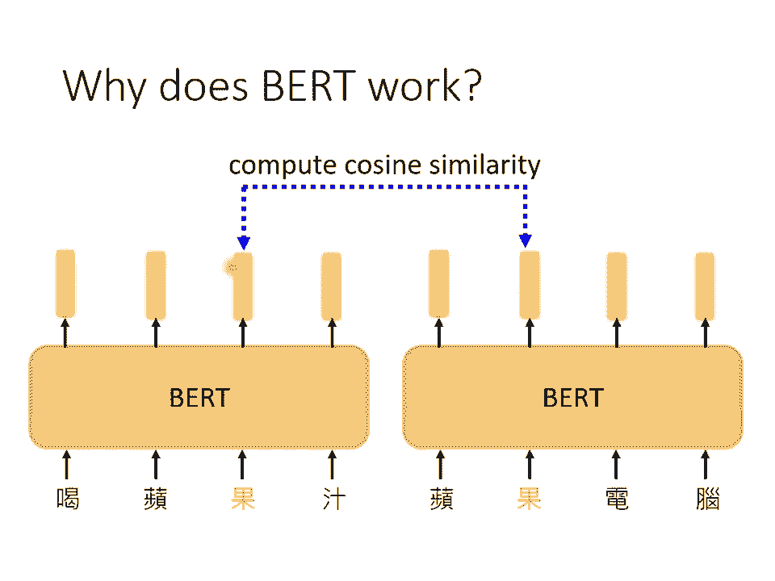
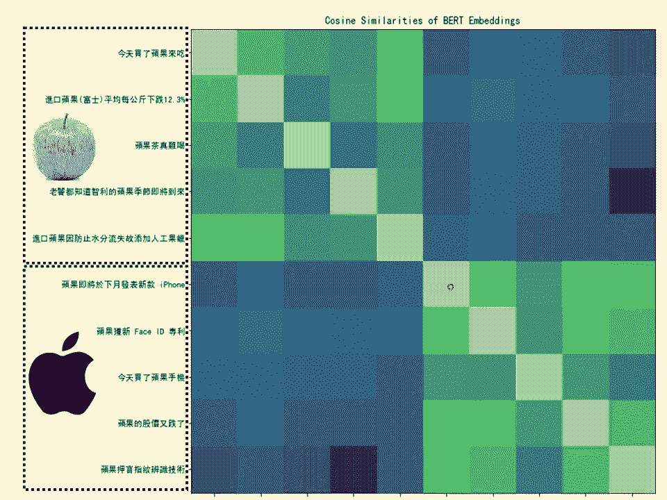
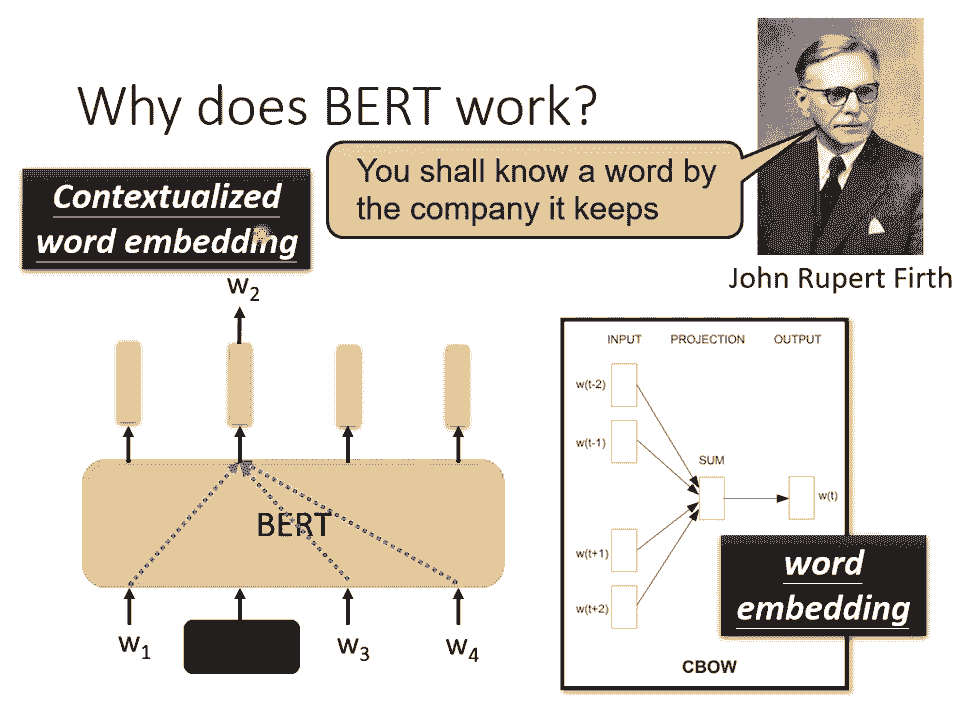
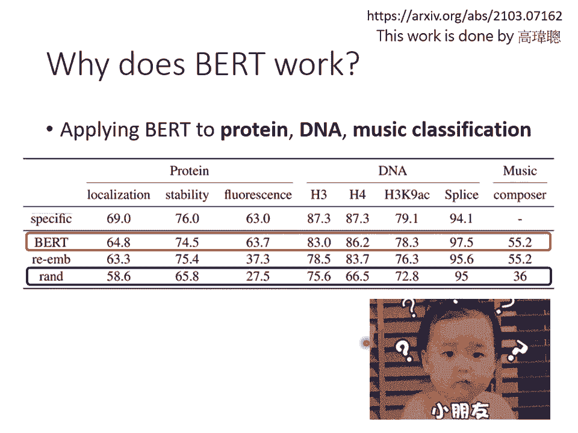
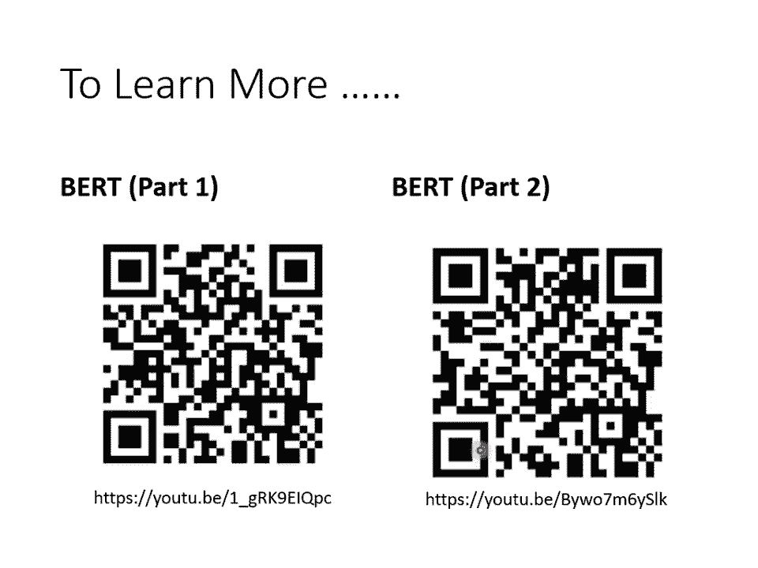
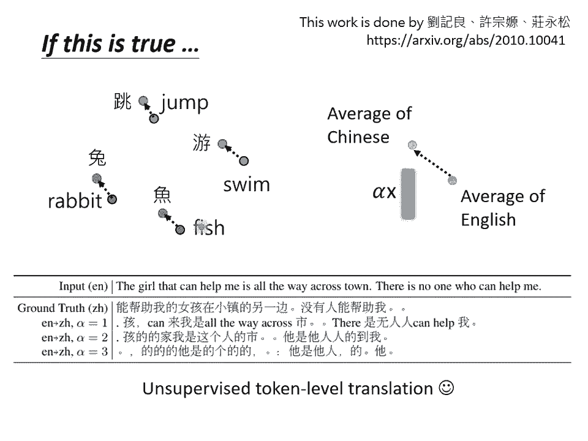

# 【国语+资料下载】李宏毅 HYLEE ｜ 机器学习(深度学习)(2021最新·完整版) - P20：L13.3- 自督导式学习3：BERT详解 - ShowMeAI - BV1fM4y137M4

好，接下來就是要回答剛才同學的問題，為什麼BERT有用呢？那我們這邊呢，先提供一個最常見的解釋方法，最常見的解釋是這個樣子，這個輸入一串文字，每一個文字接下來都有一個對應的向量。

這個向量我們接下來叫它embedding，那這個向量有什麼特別的地方？它特別的地方是，這個向量代表了輸入的那個字的意思，比如說輸入台灣大學輸出四個向量，這四個向量分別就代表台，還有灣，還有大。

還有學的意思，那什麼叫做代表意思呢？更具體而言是，假設你把這些字對應的向量，把它畫出來，或算它們之間的距離，你會發現說，越意思越相近的字，它們的向量就越接近，比如說果跟草都是植物，它們的向量就比較接近。

那這個例子是假的，等一下給你看一個真實的例子，鳥跟魚都是動物也許比較接近，那電不是動物也不是植物，所以比較遠，那你可能會問說，這個中文有一字多義的問題啊，其實不是中文，很多語言都有一字多義的問題啊。

Burt他可以考慮上下文，所以同一個字，比如說都是果這個字，它的上下文不同，它的向量是不會一樣的，所以吃蘋果的果，跟蘋果手機的果，這兩個果通通都是果，但是根據上下文，它的意思不同，所以它的向量。

它對應的embedding，就會非常不一樣，吃蘋果的果可能跟草比較接近，蘋果手機的果可能就跟電比較接近，Burt真的可以做到這件事嗎？這邊只是一個胡亂畫的例子，接下來就給你看真正的例子。

假設我們現在就考慮果這個字，那我們就收集很多，有提到果這個字的句子，比如說喝蘋果汁啊，蘋果電腦啊等等，那我們把這些句子，都丟到Burt裡面，接下來我們再去計算，每一個果它所對應的embedding。

喝蘋果汁丟進去果有一個向量，蘋果電腦的果有一個向量，這兩個向量不會一樣，為什麼不會一樣，因為這是一個encoder，裡面有self-attention，所以根據果上下文的不同，果上下文的不同。

得到的向量會不一樣，接下來我們計算，這些果之間的cosine similarity。

就是計算它的相似度，得到的結果是這個樣子的，這邊選了十個句子，前五個句子裡面的果，都代表了可以吃的蘋果，比如說這第一個句子是，今天買了蘋果來吃，第二個句子是，進口富士蘋果平均每公斤多少。

第三個句子是蘋果茶真難喝，第四個句子是，智利的蘋果季節將來到，第五個句子是，進口蘋果怎樣怎樣，這五個句子都有提到果，接下來五個句子也都有提到果，但他們指的是蘋果電腦的果，比如蘋果即將在下個月。

發表新款iPhone，蘋果獲得新的專利，今天買了蘋果手機，蘋果股價跌了，蘋果押寶 指紋辨識技術等等，這邊有十個果，兩兩之間去算相似度，你會得到一個10乘以10的矩陣，這裡每一格就代表兩個果。

他們的embedding之間的相似度，那你會發現說，前五個句子裡面的果，這邊這個值越偏黃色，就代表算出來值越大，所以自己跟自己算相似度，一定是最大的，自己跟別人一定稍微小一點，前五個果算相似度比較高。

後五個果算相似度比較高，但前五個果跟後五個果，前五個果跟後五個果，相似度就比較低，Bert自己知道說，前五個果指的是可以吃的蘋果，他們比較像，後五個果指的是蘋果電腦的果，所以他們比較像，但這兩堆果。

他們的意思是不一樣的。

所以Bert的這些相量，每一個相量就代表了，那個字的意思，所以我們也許可以說，這個Bert在訓練，做填空題的過程中，他學會了每一個中文字，他有什麼樣的意思，他也許真的了解中文的意思了，對他來說。

每個中文的符號，不再是沒有關係的，他了解中文的意思，所以他可以在接下來的任務，做得更好，那你接下來可能會問的問題就是，Bert為什麼有這樣子神奇的能力呢，為什麼他可以做到，為什麼他可以做到說。

他的輸出的這些相量，就代表輸入的那個字的意思呢，那這邊基於一個語言學的假設，這個John Roper Firth，是1960年代的一個語言學家，他那時候說，我們怎麼知道一個詞彙的意思呢。

我們要了解一個詞彙，要看他的company，就是跟他常常一起出現的詞彙，就是他的上下文，一個詞彙的意思，取決於他的上下文，所以假設可以吃的蘋果的果，他的上下文常常出現的是，吃啊 或者是樹啊 等等。

那他可能指的就是可以吃的那個蘋果，那如果是蘋果電腦的果，他後面常常接電啊 接專利啊 接股價啊，那他指的可能就是蘋果電腦的果，這一個詞彙的意思，可以從他的上下文看出來，而Bert在做的事情。

在學會做填空題的過程中，也許他在學的，就是從上下文去抽取資訊，因為我們在訓練Bert的時候，你給他W1 W2 W3 W4，你就把W2遮起來，叫他去預測W2，他怎麼預測W2，他就是看他的上下文嘛。

所以他就從上下文去抽取出資訊，來預測W2，所以這個項量，他就是上下文資訊裡面，抽取出來的精華，然後可以預測W2是什麼，那像這樣子的想法，其實在Bert之前就已經有了。

過去有一個技術叫Wei-Embedding，Wei-Embedding裡面有一個技術叫做Sibel，Sibel做的事情跟Bert其實一模一樣，就是把中間挖空，叫你預測空白的地方是什麼東西。

那Sibel這種技術啊，這種Wei-Embedding的技術啊，他就可以給每一個詞彙一個項量，那個項量就代表那個詞彙的意思，那有人就會問說，為什麼Sibel，Sibel是一個非常簡單的模型。

他就是兩個Transform，他是一個非常簡單的模型，有人就會問說，為什麼他只用兩個Transform呢，能不能夠更複雜一點呢，之前這個Sibel的作者啊，就Thomas Mikolov曾經來過台灣。

那時候常常，之前我上課的時候，常常有人問我說，為什麼Sibel只有Linear啊，為什麼不用Deep Learning啊，那我就問Thomas Mikolov這個問題。

他說要用Deep Learning其實也可以，但之所以選擇Linear Model，簡單的模型最大的關鍵，其實是運算的效能，當時Computing Power，跟今日還是不在同個量級上。

那個時候大概是16年的時候，五年前還不在同一個量級上，那個時候要訓練非常大的模型，還是有困難的，所以選擇了比較簡單的模型，但今天你用Bert，其實等於就是Deep版的Sibel了。

你就可以做更複雜的事情，而且Bert還可以做到同一個詞彙，根據不同的上下文，他的Embedding就不一樣，那因為他是一個，Voice Embedding的進階版，是考慮上下文。

也就是Context的Voice Embedding，所以Bert又叫做Contextualize，Bert所抽出來的這些Embedding，這些項量又叫做。

Contextualize的Voice Embedding，希望這樣大家可以接受這個答案，講到這邊大家有沒有問題想要問呢，這樣你覺得可以嗎，好 大家有問題想要問嗎，好 如果你可以接受這個答案的話。

就很好 你今天晚上睡得著，但是接下來我要講一個多餘的，會讓你今天晚上睡不著的東西，就是這個答案真的是這樣嗎，這個是你在文獻上最常見到的，你跟別人討論Bert的時候。

別人最常告訴你的理由，真的是這樣嗎，我這邊告訴你另外一個，不知所云的，我們實驗室同學做的實驗，這個實驗是這樣子的，我們把訓練在文字上的Bert，拿來做蛋白質的分類，DNA的分類，或者是音樂的分類。

我們就拿DNA的分類做例子吧，DNA大家都知道說，DNA就是由一連串三磷酸，不是三磷酸 線桿 叫什麼，叫做去氧核醣核酸 對不對，這個DNA就是一連串，去氧核醣核酸所組成的，去氧核醣核酸有四種。

分別用ATCG來表示，所以一串DNA，看起來就像是這個樣子，那我們要做DNA分類的問題，也就是給一串DNA，那要決定這個DNA屬於什麼類別，所以這邊ATCG的這些字母，代表DNA啦。

這邊這個東西代表是分類，你可能問說EIEN是代表什麼，不要在意這些細節，我也不知道這樣，反正就是一個分類的問題，訓練下去，有訓練資料 有Label的資料，訓練下去就結束了，那這神奇的地方是這個樣子。

DNA可以用ATCG來表示嘛，那我們現在要把BERT，用在DNA的分類上，到底是怎麼回事呢，我們把ATCG分別對應到，一個英文的詞彙，比如說A就對到WE，T就對到YOU，C就對到HE，G就對到SHE。

那這個對應的表格不重要，你可以隨機產生，A可以對應到隨便一個詞彙，T對到隨便一個詞彙，T對到隨便一個詞彙，C對到隨便詞彙，G對到隨便詞彙，都沒有關係，對結果影響不大，你就把一串DNA變成一串文字。

只是這串文字，是一串不知所云云的文字，比如說AGAC就變成，未序未益，不知道在說些什麼，然後呢，把它丟到BERT裡面啦，一樣有CLS啦，然後一樣產生一個Vector啦。

一樣通過Linear的Transform啦，一樣分類啦，只是分類，是這個DNA的類別，不知道在做什麼的類別，那一樣Linear的部分，Random Initialize，BERT的部分。

用Pretend的模型，來Initialize，但是用來Initialize的那個模型，是那個學會做填空題，在英文上，他學會了做英文填空題的，那一個BERT，你可能會想說，這都什麼亂七八糟的實驗。

莫名其妙的實驗，明明是要做DNA，把它轉成一串看不懂的文字，用BERT這樣有什麼意義嗎，BERT它可以分析語意啊，它知道每個詞彙的意思啊，它應該亂七八糟的句子，它一定是看不懂的啊。

那做這個實驗到底有什麼意思，神奇的地方是，這邊就做了不同的任務，蛋白質的分類，做了三種，蛋白質就是用氨基酸所構成的，有十幾種氨基酸，每一個氨基酸都隨便給它一個詞彙，然後DNA就是ATCG。

Music就是那個音符嘛，每個音符也隨便給它一個詞彙，然後接下來，就當作是一個文章分類的問題，硬做下去，發現說，如果你是，你沒有用BERT，你得到的結果是，藍色的這個部分，如果你有用BERT。

你得到的結果是，紅色的這個部分，居然是比較好的，我知道你聽了一定覺得滿頭問號啦，你心裡一定想起小朋友，你是不是有很多問號的那一首歌啦，這個就是神奇的實驗，不知道為什麼，目前沒有特別好的解釋。

那我之所以要講這個實驗，只是想要告訴你說，BERT到底為什麼會好，這裡面還有很大的研究的空間，從這個實驗看來，我並不是要否認說BERT有學到語意這件事情。

我們可以非常明顯的從他的embedding裡面觀察到，他確實知道每一個詞彙的意思，他知道哪些詞彙意思比較像，他知道哪些詞彙意思比較不像，那我這一下表達的意思是說，你就算給他，對他而言是亂七八糟的句子。

他居然還是可以分類的比較好，所以他的能力，不完全來自於他看得懂文章這件事，而是可能有其他的理由，舉例來說，BERT也許他本質上就是一個比較好的初始化參數，不見得跟語意有關，就這種初始化參數。

就是特別適合拿來做大型模型的訓練，是不是這樣呢，那這個還要上代更進一步的研究，我之所以想要告訴你這個實驗的結果，只是想告訴你說，我們今天這些模型都是非常新的模型，他們為什麼能夠成功運作。

還有很大的研究的空間，好那我後面還有一小段，我們就講完那一小段再下課，有關那個BERT的部分，我們今天講的其實也是滄海一述，我在這邊再放了另外兩個影片的連結，如果你想學完整版本的各種BERT的變形。

你可以參見以下兩個連結，但如果沒有興趣也沒有關係，作業裡面也用不上，接下來的課程也用不上，只是想告訴你說BERT還有很多其他的變形。

接下來要講的叫做Multilingual的BERT，多語言的BERT，多語言的BERT有什麼神奇的地方呢，就是你在訓練的時候，你會拿各種各樣的語言，中文英文德文法文，通通給他拿去做填空題。

這個就是Multilingual的BERT，Multilingual的BERT有什麼神奇之處呢，Google釋出了一個Multilingual的BERT，他是用104種不同的語言做成的。

所以Multilingual的BERT，會做104種語言的填空題，但接下來真正神奇的地方是，Multilingual的BERT，拿英文的QA的資料去做訓練，他自動就會學做中文的QA的問題。

我不知道大家有沒有聽懂這句話，我接下來有一個真實的實驗給大家參考，這邊的訓練資料，Finetune的資料用的是Squash，他是一個英文的QA的資料集，中文的部分是一個台達電釋出來的。

叫做DRCD的資料集，這個資料集就是我們在作業裡面，會使用到的資料集，在還沒有BERT的時候，結果做出來不太好啦，在BERT之前最強的問答模型，叫QANet，他的正確率只有，這個是F1 score。

其實他不是正確率，就當作是正確率好了，他的正確率就是78%，好那BERT呢，如果是pre-trained在中文上，在中文上學會做填空題，在中文的QA資料上做Finetune，測試在中文的問題上。

那沒問題正確率89%，其實人在同樣的資料上，也只能做到93%，所以跟人其實也沒差那麼遠了，神奇的地方是，如果是多語言的那個BERT，Finetune在英文上，你是拿英文的QA的資料去訓練他。

直接測試在中文上，居然也有78%的正確率，跟之前的QANet，不是用BERT的network，正確率是差不多的，他從來沒有看過，他從來沒有看過中文的，問答的資料集，對他來說，中文的問答的問題就是羅考。

他第一次看到，他居然能夠回答，怎麼會這麼神奇，當然有人可能會說，你在預訓練的時候，在pre-trained的時候，不是看過中文嗎，看過104種語言裡面有中文吧，但是他在預訓練的時候。

他學習的目標只有做填空啊，他只會做中文的填空，然後你讓他學會做中文的填空，但接下來教他英文的問答，他居然自動學會了中文的問答，就問你神不神奇，那為什麼會這樣呢，一個比較簡單的解釋是說。

也許對某台Lingo的BERT而言，不同語言間沒有什麼差異，不管是你給他看中文還是英文，最終中文和英文的這些詞彙的embedding，只要是意思一樣的都會很近，所以可能兔子跟rabbit。

的embedding很近，跳跟jump的embedding很近，魚跟fish的embedding很近，游跟swing的embedding很近，也許他在看過大量語言的過程中，自動學會了這件事情。

並不是只是一個猜測，我們其實是有做過一些驗證，那這邊驗證用的measure呢，叫做Mean Rates Protocol Ranking，叫做縮寫式MRR，那細節我們這邊就不細講。

你只要知道說MRR的值越高，代表兩個不同語言的embedding，他們align的越好，所謂align好的意思就是說，同樣意思但不同語言的字，他們會被他們的這個向量是接近的，MRR越高就代表說。

同樣意思不同語言的詞彙，他的向量越接近，而這個深藍色的最右邊這條線是什麼呢，縱軸是MRR越高越好，深藍色這條線是Google試出來的，104種語言的Multilingual Bird，得到的MRR。

他的值都非常的高，代表說對他來說不同語言沒有差，他只看意思不同語言，對他來說沒有什麼不一樣，那我們自己也試著去訓練了，Multilingual Bird，我們用的資料比較少，每個語言只用了20萬句而已。

就算很少，我們自己訓練的結果很差，不知道為什麼，我們自己訓練的Multilingual Bird，沒有辦法把不同語言，Line在一起，他似乎沒有辦法學到，不同語言同樣意思的那些符號。

他們應該要一樣的意思，那這件事情就困擾了我們很久，那為什麼要做這個實驗，做這個實驗當初為什麼要自己訓練Multilingual Bird，是因為我們想要了解是什麼原因。

造成了Multilingual Bird，我們想要設置不同的參數，不同的Factor，然後看看哪些Factor，會影響Multilingual Bird，Multilingual的能力，但我們發現。

我們自己Train的Multilingual Bird，不管怎麼調參數，他就是做不到Multilingual的效果，他就是做不到Alignment的效果，那有一天我們突然覺得，會不會是資料量不夠呢。

每個語言200K太少了，資料變5倍，看看做不做得起來，做這個實驗之前，大家都有點抗拒有點害怕，因為訓練的時間要變成原來的5倍，到底結果會怎樣呢，這個是Loss下降的圖，然後Train了兩天。

啥事也沒有發生，Loss都掉不下去，就在準備要放棄的時候，Loss就突然掉下去了，這個是用8張V100Train的，我們實驗室也沒有8張V100，是用國網中心的機器跑的，但是Train了兩天。

Loss都不掉下去，然後在準備要放棄的時候，Loss就掉下去了，這是某個同學Facebook的貼文，我把它引用在這邊，告訴你當時內心的驚嘆，整個實驗要跑一週以上，才能夠把每個語言1000K的。

填空題把它學好，那資料變多有用嗎，哇靠真有用這樣子，資料變多，Alignment就學起來了，所以看起來資料量，是能不能夠把不同語言，Align在一起，一個非常關鍵的因素，所以有時候神奇的事情是。

很多問題要在足夠資料量的時候，很多現象，要在足夠資料量的時候，才會顯現出來，過去都沒有人說過，什麼Model有這種Multilingual的能力，可以訓練在A語言的QA上，直接Transfer到B語言。

從來沒有人說過有這件事情，這幾年才有，一個可能的原因就是，過去資料量都不夠多，現在有夠多的資料，有大量的運算資源，運作下去，這種現象才會被觀察到，好那這邊有最後一個，我知道時間快到了。

但我想講最後一個神奇的實驗，你不覺得這整件事情，還是有點怪怪的嗎，我就覺得整件事怪怪的，哪裡怪怪的，你說BERT可以把不同語言，同樣意思的符號，讓他們的相量很接近。

可是在訓練Multilingual BERT的時候，他明明是給他英文，他能做英文的填空，給他中文，他能做中文的填空，他不會混在一起啊，那如果對他來說，不同語言間根本沒有差的話。

那他怎麼可能給他英文的句子，做英文的填空，給他英文的句子，會不會空格的地方，他就填中文進去，但他沒有這樣做，代表說他知道語言的資訊，對他來說，同樣來自不同語言的那些符號，終究還是不一樣。

他並沒有完全抹掉語言的資訊，所以我就想了一個題目，我說我們來找一下語言的資訊，到底在哪裡，後來我們發現語言的資訊，並沒有藏得很深，有一個同學發現說，我們把所有英文的embedding。

就把所有英文的詞彙，都丟到Multilingual BERT裡面，把他的embedding平均起來，把所有中文的embedding平均起來，兩者相減就是中文跟英文之間的差距。

你可以做到什麼樣神奇的事情呢，你可以做到，現在給Multilingual BERT一句英文，然後他得到embedding，把這些embedding，加上這個藍色的項量，這個就是英文和中文之間的差距。

這些項量對Multilingual BERT來說，就變成了中文的句子，然後你在叫他去填空題的時候，他居然就會填中文的答案了，所以非常的神奇，以下是真實的例子。

現在你給Multilingual BERT讀的句子是，The girl that can help me，is all the way across town。

There is no one who can help me，你給BERT讀，There is no one who can help me，這個句子，那BERT把這個句子讀進去以後。

那你再把這個藍色的項量，加到BERT的embedding上，本來讀進去的是英文的句子，變成embedding，加上這個藍色的項量以後，BERT就會覺得他讀到的是中文的句子，然後呢，你再叫他做填空題。

把embedding變回句子以後，他得到的結果是這樣的，他本來讀進去的是，There is no one who can help me，加上藍色的項量在embedding上以後。

BERT輸出的句子就變成，There is no one who can help me，他就產生一個驚驚體，發現他知道說，No one就是無人，Me就是我，他可以某種程度上做到。

unsupervised的token level translation，雖然這不是很好的translation，但是這個實驗告訴我們說，BERT裡面，Multilingual的BERT裡面。

雖然表面上他看起來，把不同語言同樣意思的詞彙拉得很近，但是語言的資訊，還是藏在Multilingual BERT裡面的。

备案要求秦家 Zheng Xiaoyun。