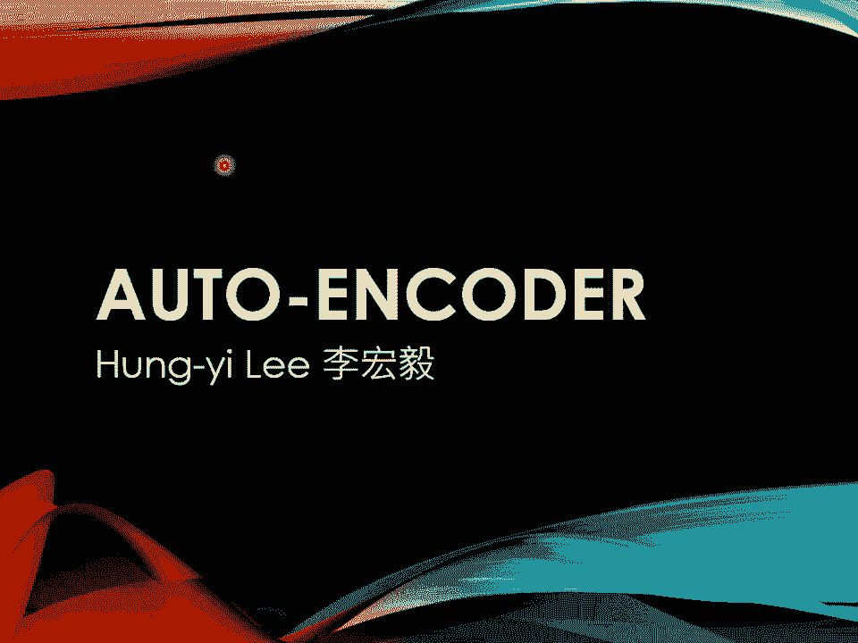
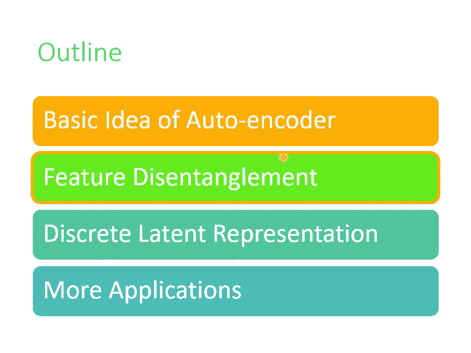

# 【国语+资料下载】李宏毅 HYLEE ｜ 机器学习(深度学习)(2021最新·完整版) - P22：L14.1- 自编码器1：基本概念 - ShowMeAI - BV1fM4y137M4

(下課時間)，接下來我們要講Autoencoder，Autoencoder我們可能先講一小段以後，我們就下課休息一下，然後我再把Autoencoder部分補完。

然後等一下主教就會講跟Autoencoder有關的作業。

那我們要來講Autoencoder，在講Autoencoder之前，其實Autoencoder也可以算是Sales Supervise Learning的一環。

所以再讓我們用非常短的時間來看一下Sales Supervise Learning的framework，Sales Supervise Learning是怎麼運作的呢？首先你有大量的沒有標註的資料。

用這些沒有標註的資料你可以去訓練一個模型，你必須發明一些不需要標註資料的任務，比如說做填空題，比如說預測下一個token，你必須要自己想一些不需要標註資料的任務，給你的模型進行學習。

那這個不用標註資料的學習，叫做Sales Supervise Learning，或者是也有人叫Pre-training，那用這些不用標註資料的任務學完一個模型以後，它本身沒有什麼用，或者只能做填空題。

GPT只能夠把一句話補完，但是你可以把它用在其他下游的任務裡面，你可以把Sales Supervise Learning的model，做一點點的微微的調整，就可以用在下游的任務裡面。

那在這些Sales Supervise Learning的任務裡面，在這些不用標註資料就可以學習的任務裡面，在有BERT在有GPT之前，其實有一個更古老的任務，更古老的不需要用標註資料的任務。

就叫做Autoencoder，所以你也可以把Autoencoder，看作是Sales Supervise Learning的一種pre-training的方法，當然可能不是所有人都會同意這個觀點。

有人可能會說，這個Autoencoder不算是Sales Supervise Learning，這個Autoencoder很早就有了嘛，2006年15年前就有了嘛。

然後Sales Supervise Learning是19年才有這個詞彙嘛，所以Autoencoder不算是Sales Supervise Learning的一環，那這個都是見仁見智的問題。

這種名詞定義的問題，我們就不用太糾結在這個地方，從Sales Supervise Learning，其實不需要用標註資料來訓練這個觀點來看，Autoencoder我認為它可以算是。

Sales Supervise Learning的其中一種方法，它就跟填空預測接下來的Token是很類似的概念，只是用的是另外不一樣的想法，那接下來我們就來先看一下Autoencoder是怎麼運作的。

那Autoencoder是怎麼運作的呢，那現在啊，因為剛才在講Sales Supervise Learning的時候，都是用文字做例子啦，那現在我們換成用影像來做例子，假設你有非常大量的圖片。

在Autoencoder裡面你有兩個內臥，一個叫做Encoder，一個叫做Decoder，它們就是兩個內臥，這兩個內臥做的事情是什麼呢，這兩個內臥做的事情是Encoder把一張圖片讀進來。

它把這張圖片變成一個向量，就Encoder它可能是很多層的CNN，把一張圖片讀進來，它的輸出是一個向量，接下來這個向量會變成Decoder的輸入，Decoder會產生一張圖片。

所以Decoder的內臥架構可能會像是Gate裡面的Generator，它是11個向量輸出一張圖片，不管是Encoder還是Decoder，反正就是多層的內臥，那現在訓練的目標是什麼呢。

訓練的目標是希望Encoder的輸入跟Decoder的輸出越接近越好，假設你把圖片看作是一個很長的向量的話，我們就希望這個向量跟Decoder的輸出這個向量，這兩個向量，它們的距離越接近越好。

也有人把這件事情叫做Reconstruction，叫做重建，因為我們就是把一張圖片壓縮成一個向量，接下來Decoder要根據這個向量重建原來的圖片，那我們希望原輸入的結果跟重建後的結果越接近越好。

講到這邊，你可能會發現說，這個東西、這個概念似曾相似呢，沒錯，我們在講Psychogame的時候已經講過了這個概念對不對，我們說在做Psychogame的時候，我們會需要兩個Generator。

第一個Generator把X-Domain的圖片轉到Y-Domain，另外一個Generator把Y-Domain的圖片轉回來，希望最原先的圖片跟轉完兩次後的圖片越接近越好。

那這邊Encoder和Decoder，這個Autoencoder的概念，跟Psychogame其實是一模一樣的，都是希望輸入的圖片經過兩次轉換以後，要跟原來的輸出越接近越好。

而這個訓練的過程完全不需要任何的標注資料，你只需要收集到大量的圖片，你就可以做這個訓練，所以它是一個Unsupervised learning的方法。

跟Self-supervised那一系列pre-training的做法一樣，你完全不需要任何的標注資料，那像這樣子，這個Encoder的輸出啊，比如說我們叫它Embedding。

我們在講Fert的時候也提過Embedding這個詞彙了，那有的人叫它Representation，有的人叫它Code，因為Encoder是一個編碼嘛，所以有人把這個Vector叫做Code。

那其實指的都是同一件事情，那這個Autoencoder的技術要怎麼用呢？怎麼把串完的Autoencoder用在Downstream的任務裡面呢？常見的用法就是原來的圖片。

你也可以把它看作是一個很長的向量，但這個向量太長了，不好處理，那怎麼辦呢？你把這個圖片丟到Encoder以後，輸出另外一個向量，這個向量你會讓它比較短，比如說只有10微，只有100微。

那你拿這個新的向量來做你接下來的任務，也就是圖片不再是一個很高維度的向量，它通過Encoder的壓縮以後，變成了一個低維度的向量，你再拿這個低維度的向量來做你接下來想做的事情。

這就是常見的Autoencoder用在Downstream的任務，用在下游任務的方法，那因為通常Encoder的輸入是一個維度非常高的向量，而Encoder的輸出，也就是我們的Embedding。

Representation或者Code，它是一個非常低維度的向量，比如說輸入是100x100的圖片，那100x100就是1萬微的向量了，如果是RGB，那就是3萬微的向量。

但是通常Encoder的Output你會設得很小，比如說10、100這樣的等級，所以這邊會有一個特別窄的地方，所以這個部分，Encoder的輸出有時候又叫做Bottleneck，本來輸入是很寬的。

輸出也是很寬的，中間特別窄，所以這一段又叫做Bottleneck，而Encoder做的事情是把本來很高維度的東西轉成低維度的東西。

把高維度的東西轉成低維度的東西又叫做Dimension Reduction，Dimension Reduction這個技術，我相信你在Machine Learning相關的應用上，應該常常聽到這個名詞。

而有關Dimension Reduction的技術，它其實牽涉的非常非常地廣，所以我們這邊就不再細講，因為這門課我們只專注在深度學習相關的技術。

你可以把Autoencoder的Encoder拿來做Dimension Reduction，那其他還有很多不是Deep Learning Base的。

不是以深度學習為基礎的Dimension Reduction的技術，我就把錄影的連結留在這邊，比如說PCA、TSNE，我就把錄影的連結留在這邊給大家參考，那Autoencoder到底好在哪裡呢？

當我們把一個高維度的圖片變成一個低維度的像量的時候，到底帶來什麼樣的幫助呢？這讓我想到神鵰俠侶的其中一段，我不知道大家有沒有看過神鵰俠侶，我可以做個調查嗎？有看過神鵰俠侶的同學可以舉手一下嗎？哇！

這麼多，好，手放下，比我想像的多太多了，我還以為現在大家已經沒有在看金庸了，這個神鵰俠侶裡面有一段就是陽過境去那個絕情谷，遇到這個絕情谷谷主公孫子的弟子就是梵一翁，梵一翁就是這個人。

那梵一翁的武器是什麼呢？他的武器除了一根鋼杖以外呢，還有他的鬍子，他可以去甩動他的鬍子當作一個軟鞭來使用，他的鬍子甩起來有兩丈那麼長，可以是一個很厲害的武器，然後陽過跟他打了很久都難分上下。

突然陽過說我在三招之內一定要剪掉你的鬍子，大家突然都很詫異，想說陽過雖然武功可能比梵一翁還高一點，但是也沒有高太多，怎麼有辦法三招就剪掉他的鬍子呢？那後來陽過真的在三招內剪掉他的鬍子，為什麼呢？

因為陽過發現說這個鬍子是由頭所操控的啦，雖然鬍子甩開來有兩丈那麼長，但是頭能夠做的變化還是有限的，所以雖然表面鬍子的鞭法非常的厲害，但是只要直接去打他的頭，就直接去打他臉，就會逼得他不得不閃避。

就會逼得他這個鬍子能夠動的路線變得有限，然後就打敗了梵一翁，就把他的鬍子剪掉了，故事結束，那這個跟Autoencoder有什麼關係呢？好，我們來想一下，Autoencoder這件事情，他要做的。

是把一張圖片壓縮又還原回來，但是還原這件事情，為什麼能成功呢？你想想看，假設本來圖片是3x3，3x3很小啦，我們就假設3x3好了，買了圖片是3x3，你要用9個數值來描述一張3x3的圖片。

假設Autoencoder輸出的這個向量是二維的，我們怎麼有可能從二維的向量去還原3x3的圖片，還原9個數值呢？我們怎麼有辦法把9個數值變成2個數值，又還原回9個數值呢？

能夠做到這件事情是因為對於影像來說，並不是所有3x3的矩陣都是圖片，圖片的變化其實是有限的，你隨便sample一個random的noise，隨便sample一個矩陣，出來通常都不是你會看到的圖片。

不過舉例來說，假設圖片是3x3的，那它的變化雖然表面上應該要有3x3的數值，才能夠描述3x3的圖片，但是也許它的變化實際上是有限的，也許你把圖片收集起來發現說，它只有這樣子的類型跟這樣子的類型。

其他類型根本就不是你一般在訓練的時候，會看到的狀況，就是因為說圖片的變化還是有限的，所以你在做這個encoder的時候，encoder可以說我就只用2個維度，就可以描述一張圖片。

雖然圖片是3x3應該要有9個數值才能夠儲存，但是實際上它的變化也許只有2種類型，那你就可以說看到這種類型，我就左邊這個維度是1，右邊是0，看到這種類型就左邊這個維度是0，右邊這個維度是1。

所以對應到剛才這個樊葉翁的例子，就是這個鬍子是圖片複雜的狀態，是原來的圖片，是原來圖片的pixel，是原來圖片的像素，而encoder做的事情呢，就是劃繁為間，本來比較複雜的東西，它只是表面上比較複雜。

事實上它的變化呢，其實是有限的，你只要找出它有限的變化，你就可以把本來複雜的東西，把它變得用比較簡單的方法來表示它，如果我們可以把複雜的圖片，用比較簡單的方法來表示它，那我們就只需要比較少的訓練資料。

在下游的任務裡面，我們可能就只需要比較少的訓練資料，就可以讓機器學到我們本來要它學的事情，這個就是autoencoder的概念，那autoencoder呢，它從來都不是一個新的想法。

它真的是非常非常的有歷史，舉例來說，Hinton，大家知道Hinton吧，就是deep learning之父嘛，Hinton在06年的science的paper裡面。

就有提到autoencoder這個概念，只是那個時候用的Navar跟今天用的Navar，當然還是有很多不一樣的地方，你想2006年是15年前耶，15年前的autoencoder長什麼樣子呢，那個時候啊。

人們不覺得deep的Navar是train得起來的，那時候覺得說，把Navar疊很多很多層，然後每一層一起train，不太可能成功，所以那時候的信念是，每一層應該分開訓練。

所以Hinton用的是一個叫做，Restricted Boltzmann Machine的技術，縮寫是RBM，我們特別把Hinton15年前的文章，把他裡面的圖拿出來給大家看一下，過去15年前。

人們是怎麼看待深度學習這個問題的，那個時候覺得說，要train一個很深的Navar，不太可能，每一層分開要train，雖然這個說很深，也沒有很深啦，只是三層啦。

這個跟你作業惡作的還要更shallow對不對，但是在15年前這個已經是很深啦，三層太可怕了，這個三層要分開來訓練才可以，那這邊說分開來訓練這件事情叫做pre-train。

但他跟Self-supervised learning的pre-train又不一樣，大家了解我的意思嗎？假設你說auto-encoder這個東西是pre-train。

那現在這個pre-train是pre-train的pre-train，他是要pre-train那個auto-encoder，而且每一層用一個叫做RBM的技術分開來訓練，先把每一層都訓練好。

再全部接起來做微調這件事情，那這邊的微調並不是BERT的微調，他是微調那個pre-train的model，好，那這個Restricted Boltzmann Machine。

你會發現今天很少有人在提到他了，他其實不是一個deep learning的技術，他有點複雜，我們在這門課裡面呢，也沒有打算要深入細講，什麼是Restricted Boltzmann Machine。

那為什麼現在都沒有什麼人用他呢？就是因為他沒有什麼用，在過去，在十年前都相信，這個deep的network一定要用Restricted Boltzmann Machine。

其實Hinton後來在2012年的時候，有一篇paper偷偷在結尾下一個結論說，其實Restricted Boltzmann Machine也沒有什麼必要啦。

所以後來就沒有什麼人在用Restricted Boltzmann Machine，而且那個時候還有一個神奇的信念是覺得說，那個encoder decoder啊，他必須是對稱。

所以encoder的第一層跟decoder的最後一層，他們必須互為transpose，不過現在已經沒有比較少有人在使用這樣子的限制了，那這頁投影片只是想告訴你說，autoencoder不是新的概念。

他是一個非常有歷史的概念，那autoencoder還有一個常見的變形，叫做denoising的autoencoder，denoising的autoencoder是說。

我們把原來要輸進去給encoder的圖片，加上一些雜訊，就自己隨便找一個雜訊把它加進去，然後一樣通過encoder，一樣再通過decoder，試圖還原原來的圖片。

那我們現在要還原的不是encoder的輸入，encoder的輸入的圖片是有加雜訊的，我們要還原的不是encoder的輸入，我們要還原的是加入雜訊之後的結果，加入雜訊之前的結果，所以你會發現說。

現在encoder跟decoder除了還原原來的圖片這個任務以外，他還多了一個任務，這個任務是什麼，這個任務就是他必須要自己學會把雜訊去掉，encoder看到的是沒有雜訊的圖片。

但decoder看到的是有加雜訊的圖片，但decoder要還原的目標是沒有加雜訊的圖片，所以encoder加decoder他們合起來，必須要聯手能夠把雜訊去掉。

這樣你才能夠把denoising的autoencoder訓練起來，那說到denoising的autoencoder，有沒有發現這個概念其實也一點都不陌生呢。

denoising的autoencoder也不算是太新的技術，至少在2008年的時候就已經有相關的論文了，但是如果你看今天的BERT的話。

其實你也可以把它看作就是一個denoising的autoencoder，輸入我們會加masking，那些masking其實就是noise，BERT的模型就是encoder。

他的輸出就是embedding，在講BERT的技術的時候我們就告訴你說這個輸出就叫做embedding，接下來有一個linear的模型就是decoder，而decoder要做的事情就是還原原來的句子。

也就是把填空題被蓋住的地方把它還原回來，所以我們可以說BERT其實就是一個denoising的autoencoder，有同學可能會問說，為什麼這個decoder一定要linear的呢。

他不一定要是linear，他可以不是linear的，或者是我們換一個說法，這個BERT他有12層，最小的那個BERT有12層，比較大的有24層或者是48層的，最小的BERT是12層。

如果我們說這個12層中間第6層的輸出是embedding，那你其實也可以說剩下的6層就是decoder，你可以說假設你在用BERT的時候，你用的不是第12層的輸出，而是第6層的輸出。

那你完全可以說BERT的前6層就是encoder，後面6層就是decoder，總之這個decoder沒有一定要是linear的，好那講到這邊呢，正好告一個段落，也許我們在這邊休息一下。

我們十分鐘後再回來，(音量注意)。