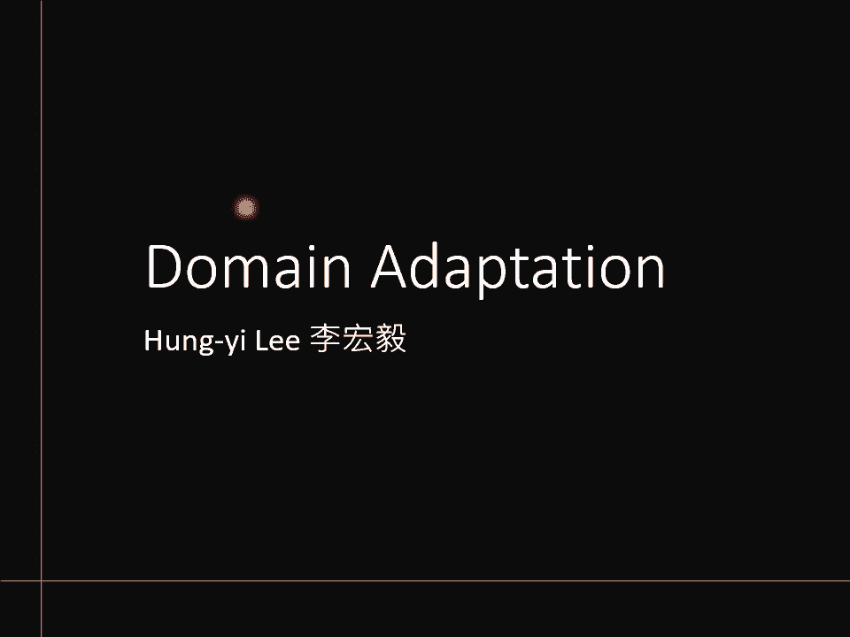
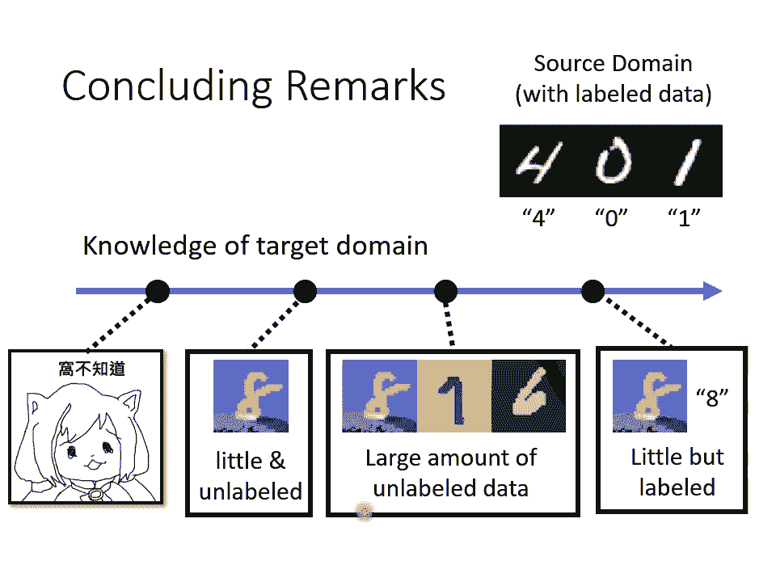

# 【国语+资料下载】李宏毅 HYLEE ｜ 机器学习(深度学习)(2021最新·完整版) - P28：L17- 概述领域自适应 - ShowMeAI - BV1fM4y137M4

好，那个讲完doment以后啊，我们就稍微休息一下。然后下一堂课就会播放助教的录影。那其实助教在讲doment这一段啊讲的非常的清楚了。所以呃我们这边就会比较快的概过。那等一下如果你有听不清楚的地方。

其实等一下助教的录影，你还有机会再听一次。那，如果等一下讲的东西，虽然我讲的有点快，但你已经听的非常懂了，那等一下播助教录影的时候，你就休息一下去做其他事情。好，那。我们呢。

就开始来讲doman adaptation的部分吧。好到目前为止啊，我们已经训练了很多 machineine learningning的model。所以对大家来说。

训练一个classifier完全不是一个问题。啊，所以假设要你数字训练一个数字的classifier，你只要有给你训练资料，你训练好一个模型，然后apply在用在测试资料上就结束了。

那像数字辨识这么简单的问题。你在bench在这个bechco上随便做一做，可能都会做到就9。5%的正确率。但是假设今天测试资料跟训练资料的分布不一样，怎么办呢？我们举一个简单的例子，假设训练的时候。

你的数字是黑白的，但测试的时候，你的数字是彩色的会发生什么样的事情呢？你可能觉得说呃一边是黑白的一边是虽一边是黑白的一边彩色的，但是对model来说，数字的形状是一样的啊。

它能够在黑白的图片上认出数字来，在彩色的图片上会不会应该也可以认出数字来呢？但实际上不是如果你今天在这样子黑白的数字上面训练一个模型直接用到彩色的数字上，你得到的正确率会非常的低，会低到只有57%哦。

不能算是一个及格的分数。哦，所以我们今天知道说一旦训练资料跟测试资料，它中间有一些差异，它们中间的分布是不一样的。你在。训练资料上训练出来的模型在测试资料上面可能就会坏掉。

那这种问题啊叫做doment shift。也就是当你的训练资料跟测试资料，它的分布有些不同的时候，这种状况叫做doman shift在多数的这种作业里面或者是 benchmarknch里面。

我们都假设无视domentship这个问题我们的训练资料跟测试资料往往有着一样的分布。那这样都会给大家一个错误的印象，就是哇这个今天的什么人工智慧真的是很厉害啊，都超越人类了。

在很多任务上面都有极高的正确率啊。但是实际上用在真实的应用上，当你的训练资料跟测试资料中间有一点差异的时候，机器能不能够做的好，就是一个未知数了。

那我们今天就是要来讲说假设训练资料跟测试资料有一点差异的时候，有没有什么方法可以让我们能够做的比呃什么都不做，结果还要好。好，那今天就是要讲dooma的技术。那dooma adaptation技术啊。

也可以看作是transfer learning的一种。怎么说呢？transfer learning就是你在A任务上学到的技能可以被用在B任务上。那对于do adaptation来说。

你的训练资料是一个 domainoma，你的测试资料是另外一个 domain，你在训练资料上面，某一个 domain面上学到的知讯，你要把它用到另外一个 domainoma用到测试资料上面。

所以你是把一个 domain学到的知识用在另外一个 domain面上，所以它可以看作是transfer learning的其中一的环节。

那在过去上课的录音里面有完整的讲了transfer learning相关的技术。那因为今天时间有限，我们就只focus在do的部分就好。如果你有兴趣的话，你可以再看一下过去上课的录音。好。

那doomain shift啊其实有很多种不同的类型。我们刚才看到的只是doomain shift，其中一种可能是模型输入的资料的分布有变化的状况。那输入分布有变化是一种可能性。

其实还有另外一种可能性是输出的分布也可能有变化。局于来说，在你的训练资料上面，可能某每一个数字它出现的几率都是一样的。但是在测试资料上面，可能每一个输出的几率是不一样的。

有可能某一个数字它输出的几率特别大，有没有可能有这种事情发生呢？这也是有可能的那这也是一种doment。还有一种更罕比较罕见，但也不是完全不可能发生的状况是输入跟输出虽然分布可能是一样的。

但它们之间的关系变了。也许在你的训练资料里面，这种东西叫做零。但是在你的测试资料里面，这种东西叫做一这也不是不可能的，也是有可能发生这种状况嘛，也时候可能发生说输入跟输出他们的关系不一样。

在训练跟测试资料不一样的状况。那这又是另外一种doment。那我们今天呢只专注在输入资料不同的domentship的上面。啊，那在等一下的课程里面呢，这个测试的资料。

我们说它来自target domain训练的资料，我们说它来自source domain所以source domain是我们的训练资料。arget domain是我们的测试资料。好。

那在 adaptation里面呢，我们的这个情境是这个样子的我们有一堆训练资料。那这边我们就直接拿手写数字辨视来当做我们的例子了。我们有一堆训练资料。那这些资料来自 domain。

而且这些训练资料是有标注的。我们知道每张图片对应的数字是什么？但是我们希望在用这些资料训练出一个模型，这个模型可以用在不一样的 domain上。那要把这个模型用在不一样的 domain上在训练的时候。

我们就必须要对另外一个 domain，也就是现在测试资料所在的targe domain有一些了解。那随着了解的程度不同我们就有不同的do的方法。

那了解最多的是假设我们在target domain上我们有一点资料，而且这些资料居然还有label，那这是一种情况。那还有另。一种更更更好的状况是。

也许你根本在target domain上就有一大堆的资料，那些资料也都有label，那你其实就不需要做do了。你直接拿targeet domain的资料来训练就好了。

所以如果你在target domain上已经有一大堆的资料，而且他们还有标注，那你不需要做do，那要做do情境，可能是你有target domain资料也有标注，但是量非常的少。那在这种状况下怎么办呢？

那这种状况还算是在doment里面比较容易处理的状况。如果你今天遇到的是有标注资料只是资料量很少的情况下，你可以用这些有标注的资料来微调，你在s domain上训练出来的模型。那这边所谓的微调啊。

就跟你在做bt的时候的行为很像哦，就是你已经有一个所 domain上训练好的model，那你拿targe domain data只稍微跑个两三个app就足够了。好，那在这种情境下。

你需要注意的问题就是因为你的target domain面的资料量非常少，所以你要小心不要overfi。也就是说你不要在target domain面上的资料上跑太多的iteration。

那如果你跑太多iteration可能会overfe到tar的这些少量的资料上，然后呢你在你真正的t上就做不好，这是有可能的那为了避免overfiing的情况，过去就有很多的solution。

比如说把lening rate调小一点呢。举例来说你要让f two前跟f two后的模型的参数不要差很多啊，或者是让f to前跟f two后的模型。

它的输入跟输出的关系不要差很多啊等等那有很多不同的方法。那这边呢我们就不细讲。好，那今天主要想要跟大家分享的情境，也是我们作业要处理的情境是我们在target domain面上有大量的资料。

但是这些资料是没有标注的。你的target是有颜色的数字，你也收集到了一大堆有颜色的数字的图片，但是没有人标注说每一张图片里面的数字是什么。那我们在作业里面要处理的就是遇到这种状况的时候。

到底应该要怎么解呢？啊，到底应该要怎么解呢？那像这种情境呢，其实是蛮符合你在真实的系统上有可能会发生的情境。举例来说，你在实验室里面训练的一个模型，你想要把它用在真实的场域里面，你就把你的模型上线。

那确实有一些人来用。但是你发现哦你得到很差，大家都嫌弃你的系统正确率很低。那怎么办？但是你你这个时候你也许就可以用的技术。那因为你的系统已经上线，有真的有人使用。以你可以收。收集到一大堆的资料。

只是这些资料他们是没有标注的那现在问的问题是，怎么用这些没有标注的资料来。帮助我们在sources domain面上训练出一个模型，它可以用在t domain面上呢。啊。

那这边最 basic的想法是这个样子的，我这边基本的概念是这个样子。我们想要找一个featureor。这个feature它其实也是一个naval这个naval呢是一张图片作为输入。

它吐出一个吐出一个feature。虽然source man跟arge man他们的image表面上看起来不一样。但是featureor会把它们不一样的部分拿掉，只抽取出他们共同的部分。

所以虽然从图片上看起来这两组图片，一个有颜色，一个不没有颜色，它本来就很不一样。但是我们期待说这个feature可以学到就无视颜色这件事情把颜色的资讯滤掉。

那今天不管是来自source man的图片还是来自targe man图，只要通过这个feature以后，他得到的feature看起来是没有差异的。他们看起来有一样的分布。

那这样你就可以用这些feature。训练一个模型，在s domain面上训练一个模型，直接用在tary domain面上。那接下来的问题就是怎么找出这样一个feature的extractor。好。

怎么找出这样的一个featuretract呢？那其实我们可以把一个一般的classifier就分成featuretractor跟label predictor两个部分。

我们知道一个image的classifier就是输入一image output就是分类的结果。那假设这个imageclassifier有1层。

那我们就说前五层算是featuretractor后五层算是label predictor。因为前五层你你一个image通过前五层它输出就是一个吧。看那如果你说C的话。

它输出其实是feature map了，但feature map拉直也可以看作是一个ve嘛。那这个vector再丢到label predict。

后面五层它会产生class那所以我们可以把前五层看作是feature那你可会问说那为什么是前五层呢？为什么不是前四层前三层前两层前一层呢？

可以是前四前三前二前一这是你自己决定的一个classifier里面哪些部分算feature哪些部分。算是label predictor啊，这个是你自己决定的那这个也算是一个hyperparmeter了。

就跟naval价高调一下呀要调一样。那如果你今天呢用doment detection的方法，那这边等一下用的方法叫doin aver training，用do a training。

你要把classifier里面的哪个部分，哪几层当做feature attract。哎，这个也要问你自己啊，这个也是你自己要决定的。好。

那我们现在要怎么怎么呃怎么来训练这个featuretractor跟label predictor呢？今天对于source domain面上的资料，source domain面上的资料是有标注的。

我们就期待把source domain面资料丢进去，那就去跟训练一个一般的分类器一样，它通过featuretractor再通过label predictor可以产生正确的答案。

但不一样的地方是targe的 domain的这些资料，我们有一堆targe domain的资料，但这些资料是没有任何的标注的啊，这些资料是没有任何的标注的。所以我们不能说啊把这些资料丢进去以后。

期待label predictor或oppo什么数字，因为我们根本不知道label predictor要oppo什么数字才是对的。

但是这些资料可以怎么被使用呢这些资料使用方式就是我们把这些图片丢到这个image丢进这个imageclassifier，然后我们把featuretract的 output拿出来看拿出来看以后。

我们希望source domain的图片。丢进去的feature跟targe domain图片丢进去的feature，他们看起来要分不出差异哦，就是。这个呃这个source domain图片。

我们用它的feature，我们用蓝色的点来表示target domain图片，它的feature我们用红色的点来表示，我们要这些蓝色的点跟这些红色的点分不出差异。那怎么让蓝色的点跟红色的点分不出差异呢？

那这个就要借由 a training的技术。那等一下如果你觉得这一段讲的有点快也没有关系，等一下助教会再更详细的讲过一次那我们现在要做的事情就是训练一个do的classifier这个的classifier它就是一个2元的分类器。

它吃这个ctor当做输入它要做的事情就是判断说这个ctor是来自于source domain还是来自于tget domain要判断这个ctor是来自source domain还是来自target domain而feature它学习的目标就是要去想办法骗过这个 classifier那听到骗过这件事情唉。

是不是让你脑中就浮现了ga这个东西，是不是就浮现了genative a这个东西呢？没错，do a training就非常像是ge你可以把feature想成是gen。

把 domainclassify想成是diriminator。那其实 a training最早的pa啊，我记得是发表在2015年的IC n l上面比那个呃g还要稍微晚一点点了。

不过他们几乎可以说是同时期的作品在 a那篇 paper里面是有引用到ge那篇per，但那时候ge那篇 paper还没有上new所以他只说哎有一篇有另外一篇paper，他提了个叫ge的想法。

然后他是technical report放在网络上的哎跟我的想法有点像所他们算是一个同时期的作品。好，但是讲到这边呢，这个 domainoma a training跟电还是有一点不一样的。

因为在这个游戏里面对gen好像优势太大了。因为对gen来说，它要骗过diriminator完全不需要花什么力。有一个非常无脑的做法就是你的featuretract也就是你的不管看到什么输入。

永远都输出零就好了。看到什么输入，我都输出一个zero vector，那对 domain classifier来说，它完全不知道input image是什么。

它永远都看到ze vector它就完全无法分辨这个ve来自于哪一个 domain，但是这显然不是我们要的状况。

如果featuretract只会输出zero vector那这样子等于根本就什么事都没有做是一样的。那这件事情会发生吗？其实这件事情是不会发生的。

为什么因为label predict它也需要这个featurelabel predictor它也需要这个feature让它可以去判断。呃，输入的图片属于哪一个类别？所以假设gen它就直接呃放个大角。

说今天不管输入什么样的image，我输出都是zero vector。那对于label predictor来说，它就没有办法判断是哪一张图片。那在这个情况下。

因为featureor它还是需要产生这个 vectorctor让label predictor可以产生正确的图片。所以feature extracttractor它就不能放大角，它就不能看到什么东西。

永远都输出zero vector。好，那这边呢我们用符号再稍微把我们刚才讲过的事情再重新说说的更清楚一点。假设label predict的参数。

我们就叫它 domainclassifier参数叫做然后ature参数叫做然后呢这个 domain上的这些image它的class的这个cro entropy就 domain这些im它是有label的。

所以你可以算他们的cro entropy你根据他们的cro entropy定出一个它的呃我这边还没有讲哦这边是有个LL是这个 domain的呃这个这个source domain上的那些im。

它有label，你可以算出 entropy然后对于这个 domain的classifier而言，它要去想办法分辨source跟 domain差距，它要去做一个ary的class的问题。

它要去做一个元分类的问题。这个分类的问题有一个叫做LD。那我现在要去找一个CP，它可以让这个L越小越好。我们要去找一个D，它可以让这个LD越小越好。

也就label predict它要做的事情就是让这个分类正确越好ifier做的事情就是让的分类越正确越好feature呢feature它要做的事情是它站在label predict这边。

然后呢它要去捅 classifier一刀他要去做跟classify相反的事情。所以这个feature它的lo是label predict的lo l去减掉 class的叫做LD所以feature它的lo啊就是大L减掉LD你要去找一个参数找一组参数F它可以让大L减LD的值越小越好。

好，这个是最原始的doomament aver training做法，但这真的是最好的做法吗？你可以想想看哦，那这个呃详情我们就不细讲，这个留给大家自己思考，自己发掘。你想想看哦。

假设doomamentclassifier它的工作是要把sourcece domain跟targe domain分开，是要看到这种图片他知道它的feature来自source domain。

那后这种图片他知道它的feature来自target domain。他要把这两组feature分开，而feature如果它的lo是classify直接加一个负号，那意味着什么？

意味着说他要做的事情就是跟classifier相反，本来class看到这张图的fe他是source那现在feature是要让class看到这个图以后。

他说是t看到这个图片反过来要说是source如果你这么做，不是也把两组feature分开来了吗？我们说我们现在要做的事情是要让 domain这个source domain没有别。

但是你今天不管是用LD还是负的D其实都是要把source分开啊。你让的值本来classifier让L的值越小越好。你现在是 feature要让D的值越大越好，其实也是把source分开。

所以这未必是最好的做法。至于怎么做，但是这招是有用的啊，这招是有用的啊啊那但是怎么做可以做的更好。哎，这个留给大家慢慢思考。好。

那我们来看一下doman averal training最原始的paper，它做的结果怎么样呢？当年看到这个paper的时候，真的觉得觉得结果非常的惊人。好，那这边呢他做了4个任务。

那上半部啊是s domain的图片，那这边其实都是数字辨识了。那下半部呢都是target domain的图片。好。

如果今天呢我们是拿target domain的图片来做trainingtarget domain的图片来做testing哦，那结果像是这个样，每一个任务正确率都是90per以上。

但如果说我们今天是source domain traininging targetarget domain testing却在黑白的数字上测试在彩色的数字上，结果直接铲掉哇者直接铲掉，没办法做了。

结果直接铲掉。那如果加上doman averal training的话，结果怎么样呢？你会发现说本来如果只tra在黑白的图片上测试在彩色的图片上，正确率57。5。

那如果今天有做doment aversal training正确率就飙升到81per。在很多其他任务上进步量都挺明显的，59到71啊，74到88。7啊，呃这个进步量都是挺明显的啊。

这个就是doment aversal training。好到这边我们停一秒钟，看看有没有同学有问题。哦，好。我看一下好。

有一个同学问说domanclassify这里是类似K means的classary吗？哎，不是它就是一个2元的分类器。do那个classifier它它它它就是一个net，它也可以有很多层，那还有几层。

也是你自己决定的，所以它不是一个这个K means的classary，它就是一个classifier，它要去训练说看到一个input一个feature的 vector。

那oppo就是它是属于source domain还是tge domain。哦，有同学帮我回答了。😡，哦，是助教。好，注销注销帮我回答了。好。好，那我们就继续讲了啊，那刚才这整套想法还是有一个限制。

有一个小小的问题，什么样小小的问题呢？我们来看看哦。今天呢呃蓝色的圈圈跟蓝色的三角形代表source domain面上的两个class。

那我们当然可以找一个boundundary去把这两组class把它分开来。对于target domain面上的data，我们没有任何的pl的 label。

我们就只能说说target domain面上的data，我们都用这个呃正方形来表示它那我们今天训练的目标就是要让这些正方形它的分布跟这个圈圈三角形合起来的分布越接近越好。但是什么叫做越接近越好呢？

左边这个case。红色的点跟蓝色的点，它们也算是蛮alline在一起的啊，也算是分布蛮接近的。右边这个case，红色的点跟蓝色的点，它们也算是分布蛮接近的。但是你觉得左边比较好，还是右边比较好呢？好。

我们试试看这边有没有可能进行互动。哎，左边觉得左边比较好的同学，你就输入在聊天室输入个一。哎，右边觉得右边比较好的同学，你就在聊天室输入一个2哎。好，我们看看有没有办法做互动。好。

那我顺便回答一下同学的问题。thepo approach后面括号的百分比是什么意思？那个百分比啊就是进步量了，就是进步量，那个没有什么特别的的意思。好，然后呢，有同学问说训练资料。

只有sles data的状况哦，他在艾特别人啊，他在回答别人的问题。好。好，大家都选2。大家都选2，要同学选-一好哦，选二的超级多。好。好，我看选大多数的同学呢都觉得是右边啊，没错，呃。

很多人也觉得是右边。所以我们是不是应该要让右边的状况发生，而避免让左边的状况发生呢？好，怎么做呢？怎么让右边的状况发生，左边的状况不要发生呢？也许一个可能的想法是，我们既然知道蓝色的圈圈跟蓝色的三角形。

它们的分界点在哪里。而这个分界点我们是知道的，那我们应该要让这些方形，虽然我们不知道它是哪一个类别，但我们让这些方形远离这个分界点。怎么让方形远离这个分界点呢？那在文献上就有很多不同的做法了。

你可以参考一下文献，看看你觉得怎么做比较好。举例来说，一个最简单的做法是说，呃，今天我有很多unlabel的图片。丢到feature tract在丢到label predictor以后。

我不知道它是哪一个类别。但是我希望它离bound越远越好。那什么叫做离 boundary越远越好呢？如果今天输出的结果非常的集中啊，叫做离bound。

如果今天输出的结果每一个类别都非常的接近叫做离 boundary，所以我希望说把unlabel的 image丢进feature tract在丢进label predict输出的结果。

它离bound越远越好，也就是说集中在某一个类别上，我们虽然不知道它应该算是哪一个类别，但至少应该集中在某一个类别上啊，那这只是一种招数啊，并不是呃全部那也可以参考一下文献。

比如说有个知名的方法叫做dt dirt t dirt t这个dir dirt t啊，它其实它它 paper里面特别告诉你说这个要念dirty要念ir啊这个大家都是这个模型命名大师啊都会命名一个很有创意的名字这个。

这个dirty是一个招数，还有另外一个招数叫这个maximum classifier discrepancy。那如果你要在这个doment作位里面得到最好的结果的话。

那这些招数是不可或缺的那实际上这些招数怎么进行还挺复杂，这个就留给大家自己研究。那这边还有一个问题，什么样的什么样的问题呢？我们到目前为止啊。

好像都假设说source domain跟target domain它的类别都要是一模一样的而source domain假设是影像分类的问题。

source domain有老虎狮子跟狗 targetge domain也应该要有老虎狮子跟狗，但是真的一定会这样吗？tge domain是没有label的。

我们根本不知道targe domain里面有什么样的类别啊在这个图示里面呢这个实心的实实现的圈圈代表source domain里面有的东西，这个虚实线的圈圈呢代表targe domain里面有的东西啊。

所以呢有没有可能是呃这个s domain里面的东西比较多，tge domain里面的东西比较少呢？有没有可能是呃t domain里面东西比较少tge domain东西比较多呢？有没有可能两者虽然有交集。

但是各自都有独特的类别呢？这都是有可能发生的。所以在这个前提之下，你说s domain targetge domain。要把他们完全align在一起。听起来有点问题呀。因为举例来说。

在这个case里面哦，你你说你要让source domain的 data跟target domain的 data，它们的feature完全match在一起。

那意味着说你硬是要让老虎去变得跟狗像或者是老虎硬是要变得跟狮子像，到时候你就分不出老虎这个类别了。听起来就是有问题的方法。那怎么解决这个问题。

怎么解决source domain跟target domain，它可能有不一样的label的问题。那你可以参见这个univeveral domain adaptation这篇文章。好。

那我们来看看有没有同学有问题要问的。好，有同学问说，如果feature extract是。CNN而不是linear layer。那董明 classify input。

就是feature map拉直的later em。这样lant space学到的东西把两个斗面分布米平会不会有影响？因为feature map本来就space的关系，现在却硬是被拉直。你说的非常对。

真的你说的非常对，就是featuretract，它是一个复杂的内务。然后我们硬是要把两个 domain面的东西拉在一起。会不会变成他只是为了拉在一起而拉在一起。

他根本就没有学到我们本来希望这个feature space学到的东西呢。呃，简单的回答就是会啊会所以do没有大家想象的那么容易券起来。所以好像刚才讲的都非常的顺利。

那作业里面可以自己体验一下啦这个doment算是偏难做的一个作业啊，所以呃这个你知道我们在劝的时候啊，我们有两件事情，有两有两件事情互相解抗，一个是要去骗过doomaclassify。

另外一个是要让分类变正确。那我们期待说这两件事情都可以同时做好。也就是说一方面既骗过doomainclassify一方面又分类分的好，那就同时把两个dooma在一起，同时la space。

我们又希望它的分布是正确的。比如说我们觉得一跟7比较像那他们为为了让。做好那今天你的featuretract就会让一跟7比较像。然后一跟比如说一跟四比较不像，它就让一跟四拉的比较远一点。

我们期待说呃借由需要把label predict的performer冲高这件事情，lant representation里面的这个space仍然是保留一个比较好的lant space。

但是不一定这件事不一定总是会成功了。如果你今天你给doinclassify就是要骗过doclassify这件事情的权重太大。

你的model就会学到说他都只想骗过doinclassify它就不会产生好的lant space。所以刚才呃同学问的问题确实是有可能会发生的。所以大家在实作的时候，呃，这个也是有些参数要调的。好。好。

希望这长回答到同学的问题。好，那接下来啊还有一个更严峻的状况。刚才我们是假设说没有label data，但至少有一大堆。这个时候你还可以说我要把两个space呢把它拉在一起。

但是有一个可能是假设不止没有label，而且data还很少。比如说我就只有一张而已。这个时候你只有一张一你你的这个target domain只有一张，只有只有一个一个一个点。

你根本没有办法跟抖那个 domain把它al在一起嘛，这个时候怎么办呢？假设target domain data非常少的时候怎么办呢？也不是没有方法了啊。

有一个方法叫做testing time training它的缩写是TTT，这个大这个我我们就把连接附在这边给大家参考testing time training就是想要处理。

假设我的targe domain只有没有label，而且还只有一张的时候，到底应该要怎么办？但其实还有一个更严峻的状况。这个状况是，如果我什么都不知道怎么办呢？如果我们对targe man一无所知的话。

怎么办呢？这个时候又分成两种情形，对以它给 domainoma一无所知的这种问题啊，这个时候我们就不叫doant的 adaptation，通常就叫doin generalization。

因为我们并不是要adap到某一个特定的 domain面上，我们对那个特定的 domainment已经一无所知了。我们是期待今天机器学到doment generalization，在ting的时候。

不管来什么神奇的 domainment，它都可以处理。那斗man generalization又分成两种状况，一种状况是我的训练资料非常的丰富，本来就包含了各式各样不同的斗妹。假设你要做猫狗的分类器。

那你现在呢在训练资料里面有呃真实的猫跟狗的照片，有素描的猫跟狗的照片，然后有一呃。这个水彩画的猫跟狗的照片，期待因为训练资料有多个斗man模型可以学到如何米平斗面间的差异。今天有测试资料是卡通的猫跟狗。

它也可以处理，这是一种状况。那这种状况你还比较能够想象要怎么处理。那我们这边就不细讲，我们都只各放一些有代表性的论文给大家参考。但还有另外一种，你会觉得不知真的不知如何下手的状况是。

假设训练资料只有一个斗man呢？假设你的训练资料只有一个doman而测试资料有多种不同的抖面的话，怎么处理呢？在文献上也不是没有人试也是有人试着去解过这种问题的那还怎么做呢？它在这细节我就不讲了。

在概念上就是。哦有点像是data augment，就然你只一个 domain的资料，想个data augmentation的方法去产生多个 domain的资料。

然后你就可以套上面这个s来做做看看能不能够在测试的时候，新的doment都可以做好啊，这个是doment generalization。好。

那这个部分就是很简短的跟大家带过这个doment adaptation的种种技术，更多的细节。在下一堂课主要的说明里面都还会跟大家仔细的说明。我们在这边呢就先休息5分钟啊，休息一下，然后我们等下再回来。

