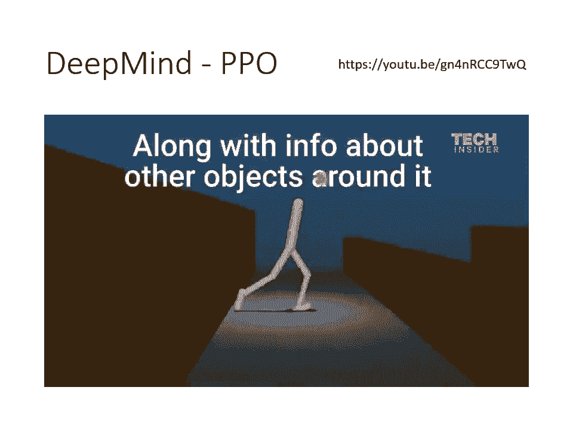
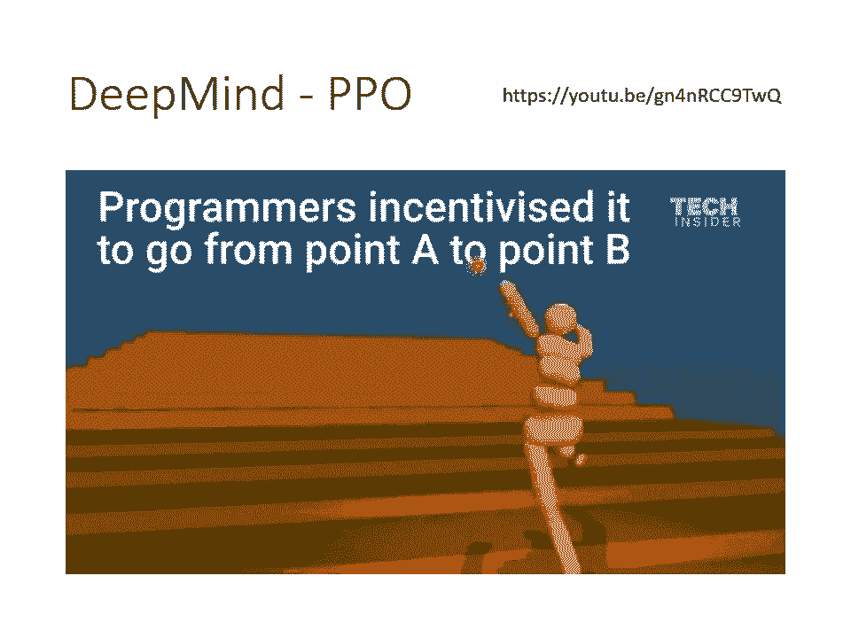
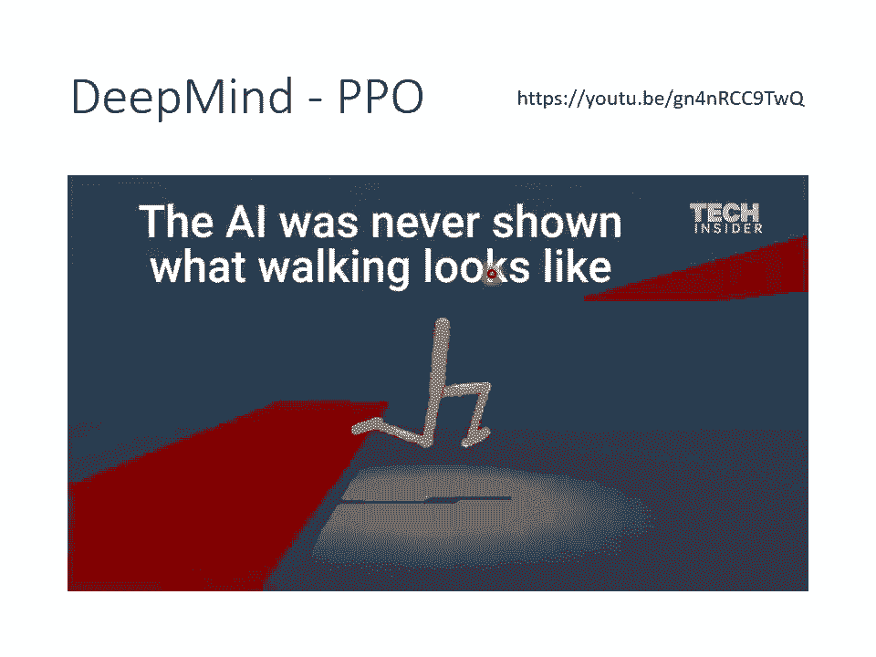
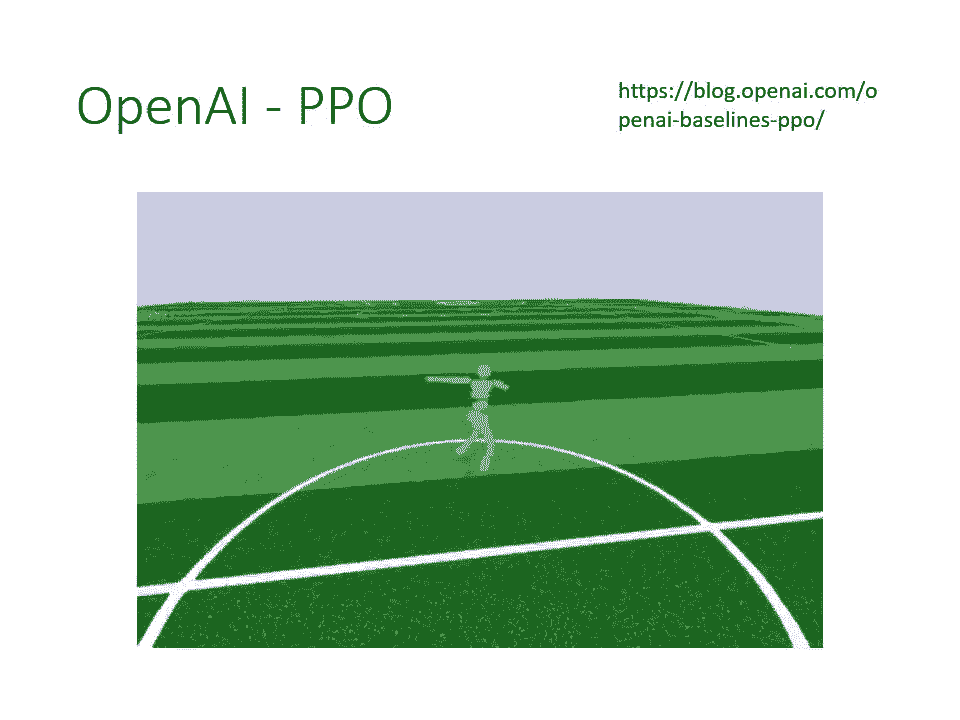

# 【国语+资料下载】李宏毅 HYLEE ｜ 机器学习(深度学习)(2021最新·完整版) - P30：L18.2- 概述强化学习2：PolicyGradient与修课心情 - ShowMeAI - BV1fM4y137M4

好，唉，我们就继续来上课吧。好，唉，感谢各位同学提到有关关麦的问题。那我这个我再自己研究一下好了，那我猜就可能就跟同学说的一样，在OBS那边做就可以了。不过其实我没有那么熟悉OBS这样。

所以我我这个我再自己练习一下。好，然后有关那个呃有同学问了两很好的问题，这两个问题其实同个。第一个问题是呃，看到S的时候啊，不是只对应一个A吗？如果不希望他做A。那Actor是什么都不做吗？

不希望他做A呃，是指actctor可以去做其他的事情。其实是呃对一个actctor而言，什么都不做，也是一个action。就假设你希望说actor有机会什么都不做的话，那什么都不做。

也是一个action。所以在刚才我们讲的那个例子里面呢，space invader，他有向左向右跟开火三个action。

那假设你希望他今天还有一个可能的action是可能的状况是不向左也不向右不开火就留在原地的话，那你必须要把这件事情也当做一个action当机器来选。那不希望他做A的意思。

就是希望他去做其他的action。比如说你不希望他向左，那就是向右开火都可以。好，那有同学问说可以在一个环境同时决定想做的动作与不想做的动作吗？可以，你可以说在某一个环境下，我想要开火，然后不想要向右。

那它就会开火的分数非常非常的大，非常想开火，然后不想向右就是向右的分数非常非常小。那你今天今天action是随机simble的嘛。所以action呃你给个个那个observation的时候。

每次决定的action其实也不会是一样的。但是这些action的分数会决定它出现的可能性。所以假设你说非常想要开火，非常不想向右，那就想要开火分数很大，想要开火的几率就会变得很高。

那向右的几率就会变很低。然后同学问说呃。act做A one的话会有正的分数。那希望最大化所有action的分数的话。为什么不用乘负号？我看一下哦，希望希望艾ctor做。呃。

希望actctor做A one的话会有正的分数。那希望最大化所有action的分数的话，为什么不用乘负号？哎，不好意思，我其实没有完全理解这个问题哎。呃，我们并不是要最大化所有action的分数。

我们要最大化的是所有的action执行完之后，我们可以得就action执行完之后，我们可以得到的reward的总和。好，不好意思，我可能没有回答到那个蔡同学的问题。那如果你有问题的话。

你等下可以再呃表示表达的再试着用另外一种方式表达一下，我看看有没有办法回答你。好。好，那我们就继续吧。讲到目前为止，你可能觉得跟supervise learning没有什么不同，那确实就是没有什么不同。

接下来真正的重点呢是在我们怎么定义A上面。好，那接下来的重点就是怎么定义A了。那我先讲一个最简单的，但是其实是不正确的版本。那这个其实也是助教的simple code的版本。好。

那这个不正确的版本是怎么做的呢？这个不正确的版本是这个样子的。首先呢我们还是需要收集一些训练资料，就是需要收集S跟A的，怎么收集这个S跟A的 pair呢？你需要先有一个这个ctor呢去跟环境做互动。

它就可以收集到S跟A的。那这个actctor是哪里来的呢？你可觉得很奇怪，我们今天目标不就是要训练一个actctor吗？那也就说你需要拿一个actctor去跟环境做互动。

然后把这个actctor它的S跟A记录下来，那这个actctor是哪里来的呢？你先把这个actctor想成就是一个随机的ctor好了。就它是一个它就是一个随机的东西，那看到S one。

然后它执行的行为就是乱七八糟的，就是随机的。但是我们会把它在每一个S执行的行为A呢，通通都记录下来。好，那通常我们在这个收集资料的话，你不会只把actctor跟环境做一个epode。

通常会做多个epode。然后期待你可以收集到足够的资料。比如说在助教simple code里面，可能就是跑了5个epis，然后才收集到足够的资料。好，所以我们就是去观察某一个actctor。

它跟环境互动的状况。那把这个actctor，它在每一个observation执行的action都记录下来。然后接下来呢我们就去评价每一个action，它到底是好还是不好。评价完以后。

我们就可以拿我们评价的结果来训练我们的actctor。那怎么评价呢？我们刚才有说，我们会用A这个东西来评价在每一个state，我们希不希望我们的actctor采取某一个行为。

那最简单的评价方式是假设在某一个tay s one，我们执行了A one，然后呢得到reward r one。

那reward如果是正的那也许就代表这个action是好的那如果reward是负的那也许就代表这个action是不好的那我们就把这个reward r one R two当做是AA one就是R one A two就是R two A3就是R3A大N就是RN。

那这样等同于你就告诉我们迅说，如果我们执行完某一个action A one，那得到的reward是正的那这就是一个好的action，你以后看到S one就要执行A one。

如果今天在S two执行A two得到re负的就代表A two是。不好的AQ就代表。所以以后看到SQ的时候，就不要执行AQ。好，那这个呃。这个那这个这个versionrgin里呢。

它是它并不是一个好的版本，为什么它不是一个好的版本呢？因为你用这个方法，你把A one设为R one A two设为R two这个方法认出来的内啊，它是一个短视尽力的actctor。

它就是一个只知道会一时爽的actctor，它完全没有长城规划的概念。怎么说呢？因为我们知道说每一个行为其实都会影响互动接下来的发展。也就是说actctor在S one执行A one得到R one。

这个并不是互动的全部。因为A one影响了我们接下来会看到S twoS two会影响到接下来会执行A two也影响到接下来会产生RQ。所以A one也会影响到我们会不会得到R two。

所以每一个行为并不是独立的啊，所以每一个行为并不是独立的，每一个行为都会影响到接下来发生的事情。好，而且我们今天在跟环境做互动的时候，有一个问题叫做reward delay。

什么是reward delay呢？就是有时候你需要牺牲短期的利益，以换取更长城的目标。如果在下围棋的时候，如果你有看天龙八部的时候，你就知道说呃这个虚逐在破解真笼棋局的时候，毒死自己一块子。

让自己被杀了很多子以后，最后反而赢了整局棋。那如果是在这个space invadeva的游戏里面，你可能需要先左右移动一下进行瞄准，然后涉及才会得到分数。

而左右移动这件事情是没有任何reward左右移动这件事情得到的reward是0，只有涉及才会得到reward。但是并不代表左右移动是不重要的，我们会先需要左右移动进行瞄准。那我们的设及才会有效果。

所以有时候我们会需要牺牲一些近期的reward而换取。更长城的reward。所以今天假设我们用versionrgin0，那会发生什么事呢？会发生说今天machine只要是采取向左跟向右。

它得到的reward会是0。如果他采取开火，他得到的reward就会是只有开火的时候，他得到的reward才会是正的啊，才会是正的那这样们逊就会学到，他只要只有疯狂光开火才是对的。

因为这种开火这件事才会得到reward，其他行为都不会得到reward，所以其他行为都是不被鼓励的，只有开火这件事是被鼓励的那virginly就只会学到疯狂开火而已。啊。

那virginin呢是助教的范例城市，那这个当然也是可以执行的啦，那只是它的结果不会太好而已。那助教范例词城市之所以是virginin是因为我不知道我不知道为什么这个virginin好像是大家。

如果你自己在immentL的时候，你特别容易犯的错误。你特别容易拿自己imment的时候，就直接使用virginin，但是得到一个很差的结果。所以接下来怎么办呢？我们开始正式进入I的领域。

真正来看poli勒 gradient点是怎么做的，就我们需要有virgin one。然后在virgin one里面呢。A one它有多好，不是在取决于R one，而是取决于A one之后所有发生的事情。

哦，我们会把A one执行完A one以后，所有得到的rewardR oneR twoR3到RN通通集合起来，通通加起来，得到一个数值叫做G one。然后我们会说A one就等于G one。

我们拿这个G one来当做评估一个action好不好的标准。刚才是直接拿R one来评估。现在不是拿G one来评估啊，接下来所有发生的R通通加起来拿来评估A one的好坏。

因为我们执行完A one以后就发生这么一连串的事情嘛，那这么一连串的事情加起来，也许就可以评估A one到底是不是一个好的action。所以以此类推，A two它有多好呢？就把执行完A two以后。

所有的RR two到RN通通加起来得到G two。好，那A3还有多少呢？就把执行完A3以后，所有的R通通加起来就得到G3。好，所以把这些东西通通都加起来。

就把那这些这个G啊叫做cmulated的reward啊，叫做累积的re，把未来所有的reward加起来来评估一个action的好坏。那像这样子的方法听起来就合理多了啊。

所以这个G是cummulated的reward。那G是什么呢？G就是GT是什么呢？就是从T这个时间点开始，我们把RT一直加到R大N全部合起来，就是cmulated的rewardGT。

那我们用这个cmulated的reward来评估一个action的好坏。好，那当我们用cummd的 reward以后，我们就可以解决versionrgin0遇到的问题。因为你可能向右移动以后进行瞄准。

接下来开火就有打中外星人。那这样向右这件事情，它也有accuulate reward，虽然向右这件事情没有立题的reward。假设A one是向右，那R one可能是0。

但接下来可能会因为向右这件事导致有瞄准导致有打到外星人，那cuummd的re就会是正的那我们就会知道说其实向右也是一个好的action，这个是versionrgin one。但是你仔细想一想。

会发现virgin one好像也有点问题，有什么样的问题呢？这个假设这个游戏非常的长，你把R大N归功于A one，好像不太合适吧。就是当我们采取A one这个行为的时候，立即有影响的是R one。

接下来有影响到R two接下影响到R3。那假设这个过程非常非常的长的话，那我们说因为有做A one。导致我们可以得到R大N，这个可能性应该很低吧。也许得到R大N的功劳不应该归功于A one。好。

所以怎么办呢？有第二个版本的。accuumulated的 reward我们这边用G派来表示cumulated的 reward。好这个我们会在R前面呢乘一个dis factor。

这个dis factor伽马你会设一个小于一的值，有可能会设比如说0。9啊或0。99之类的。所以这个G one相较于G one有什么不同呢？

G one是R加R2加R3那G one派呢是R one加伽马R two加伽马平方R3，就是距离采取这个action越远。

我们伽马平方向就越多哦所以R two距离A one一步就成了伽马R3距离A one两步就成伽马平方。那这样一直加到RN的时候，RN对G one就几乎没有影响力的。因为你伽马乘了非常非常多次了。

伽马是一个小于一的值就设。90。9的比说10次方，那其实值也很小了。所以你就用这个方法就可以把离A one比较近的那些re给它比较大的权重A one比较的那些re给它比较小的权重。所以我们。

现在有一个新的A这个新的A啊，这个评估这个呃action好坏的这个A啊，我们现在用G one prime来表示它那它的式子呢可以写成这个样子。这个GT p呢就是sion overN等于T到大N。

然后我们把RN乘上伽马的N减提次方。好，所以离我们现在采取的action越远的那些reward，它的伽马就变成越多次，它对我们的G派的影响就越小。这是第二个版本。好，听到这边你是不是觉得合理多了呢？

好了我们要看看大家有没有问题要问的。好，有同学说怎么有点像。蒙帝卡罗。不错，等一下会讲到蒙帝卡罗。哎，等下会讲到蒙帝卡罗。好。这个请问一个。是一个哦，请问我懂了，请问一个大括号是一个episode。

还是这样蓝色的框柱的多个大括号是一个epol。好，一个大括号不是一个epode哦，一个大括号是我们在这一个observ执行这一个action的时候。这个是一笔资料，它不是一个epol。

 episode是很多的很多次的observation跟很多次的action才合起来才是一个episode。哦。G one需不需有一个同学问说G one需不需要做标准化之类的动作，这个问题太棒了。

为什么呢？因为这个就是virgin3。哎，好，那我们就继续讲virgin3吧。哦，还有这边还有一个问题是。越早的动作就会累积到越多的分数吗？越晚的动作累积的分数就越少。哎，好，对，没错。

是在这个设计的情境里面，是越早的动作就会累积到越多的分数。但是呃这个其实也是一个合理的情境。因为你想想看比较早的那些动作，对接下来的影响比较大啊，到游戏的终局，没什么外星人可以杀了，你可能做什么事。

对结果影响都不大。所以呃比较早的那些 observationserv，他们的动作是我们可能需要特别在意的。不过像这种A要怎么决定啊，有很多种不同的方法。如果你不想要比较早的动作action比较大。

你完全可以改变这个A的定义。事实上不同的IL的方法，其实就是在A上面下文章，有不同的定义，A的方法。看来仍然不适合用在围棋之类的游戏，毕竟围棋这种游戏只有结尾才有分数。好，这是一个好问题。

这个我们现在讲的这些方法，到底能不能够处理这种结尾才有分数的游戏呢？也不是不行，对不对？其实也是可以的。怎么说呢？假设今天只有RN有分数。其他通通都是零，那会发生什么事。

那会发生说今天我们采取一连串的action，只要最后赢了这一串的action都是好的。如果输了这一连串的action通通都算是不好的。呃，你可能会觉得这样做呃，感觉劝内应该会很很难劝吧。呃，确实很难劝。

但是就我所知最早的那个版本的阿法go啊，它是这样劝的。哎很神奇，它就是这样做的，它里面有用到这样子的技术。当然还有一些其他的方法，比如说valueue啊等等。那这个等。这样也会讲到。

那最早阿巴狗他有采取这样子的技术来做学习啊，他有试着采取这样的技术，看起来也是学得起来的。拿预估的目差当reward嗯。那呃有一个同学说，那其实阿法 go可以拿预估的目差当reward。

那你要有一个办法先预估目差，那你才拿它来当reward嘛。那有没有办法事先预估，我们接下来会得到多少的reward呢？有那这个在之后的版本里面会有这样的技术。但我目前还没有讲到那一块。好。

那我们接下来就讲virgin3virgin3就是像刚才同学问的，要不要做标准化呢？要那为什么呢？因为好或坏呀，是相对的啊，好或坏是相对的啊，怎么说好或坏是相对的呢？假设所有假设今天在这个游戏里面。

你每次采取一个行动的时候，最低分就预设是十分。那你其实得到1分的reward根本算是差的啊，就好像说啊今天你说你得在某一门课得到60分，这个叫做好或不好还是不好呢？没有人知道。

因为那要看别人得到多少分数啊。如果别人都是40分，你是全班最高分，那你很厉害，若别人都是80分，你是全班最低分，那就很不厉害吧。所以reward这个东西是相对的。所以如果我们只是单纯的把G算出来。

你可能会遇到一个问题，假设这个游戏里面。永远都是拿到正的分数，每个行为都会给我们正的分数只是有大有小的不同。那你这边G算出来通通都会是正的，有些行为其实是不好的。

但是你仍然会鼓励你的model去采取这些行为。所以怎么办？我们需要做一下标准化。那这边先讲一个最简单的方法就是把所有的派都减掉一个B啊，这个B呢在这边叫做在I的文献上通常叫做baseline了。

那这个呃跟我们作为的baseline有点不像啊。但是反正在I的文献上就叫做bline就对。我们把所有的派都减掉一个B目标就是让g派有正有负啊，特别高的派让它是正的特别低的派，让它是负的。好。

但是这边会有一个问题，就是那要怎么样设定这个baseline呢？我们怎么设定一个好的baseline，让G派有正有负呢？那这个我们在接下来的版本里面还会再提到，但目前为止我们先。讲到这个地方。好。好。

有一个同学说需要个比较好的heuristic function。对，需要个就是说在下围棋的时候啊，有假设今天你的reward非常的pas。

那你可能会需要一个好的euristicistic function。如果你有看过那个最原始的那个深蓝的那篇paper，就是在这个机器下围棋打爆人类之前，现已经在西洋旗上打爆人类了嘛。它那个就叫深蓝嘛？

深蓝就有蛮多heuristic的方，它就不是只有下到呃游戏的中盘才知道才得到reward，中间会有蛮多的状况，它都会得到reward的。好。好，那接下来刚才讲的是大概念。

接下来就会实际告诉你说policy gradient是怎么操作的那你可以仔细读一下助教的程市，助教就是怎么操作的。首先呢你要先redom初始化，随机初始化你的actctor啊。

你就给你的actctor一个随机初始化的参数，叫做C大0。然后接下来呢，你进入你的training iteration，假设你要跑大T个train iteration。好。

那接你就拿你的这个现在手上有的ctor啊，一开始是这个达0啊，一开始问他什么都不会，他采取的行为都是随机的，但是它会越来越好。而你拿你的actctor去跟环境做互动。那你就得到一大堆的S跟A。

你就得到一大堆的S跟A就把它互动的过程记录下来得到这些S跟A。那接下来你就要进行评价。你用A one到AN来决定说这些action到底是好还是不好的。你先拿你ctor去跟环境做互动，收集到这些观察。

接下来你要进行评价，看这些action是好的还是不好的那你真正需要这个呃在意的地方，你最需要把它改改改动的地方就是在评价这个过程里面。那助教程是这个A啊，就直接设成media的re。那你写要改这一段。

你才有可能得到好的结果。好设完这个A以后。就结束了就结束了，你就把lo定义出来，然后呢upate你的model啊，这个upate的过程就跟gradient是一模一样的。你会去计算大L的规点。

前面乘上running rate，然后呢拿这个呃gradian呢去update你的model，你就把C的I减1update成C的I。但是这边有一个神奇的地方是一般的training。在我们到目前为止。

trainingda collection都是在for回圈之外的。你说我有一堆资料，然后把这堆资料拿来做training，拿来updatemod很多次，然后最后得到一个收敛的参数。

然后着拿这个参数来做testing，但在RL里面不是这样，你发现收集资料这一段居然是在复回圈里面的。假设这个for回圈，你打算跑400次，那你就得收集资料400次。或者是我们用一个图像化的方式来表示。

这个是你收集到的资料，就是你观察了某一个actctor，它在每一个tay执行的action。然后接下来你给予一个评价，但要用什么评价，要用哪一个版本，这个是你自己决定的。

你给予一个评价说每一个action是好或不好。你有了这些资料，这些评价以后拿去训练你的actctor，你拿这些评价可以定义出一个los，然后你可以更新你的参数一次，但是有趣的地方是你只能更新一次而已。

一旦更新完一次参数以后，接下来呢你就接下来你就要重新去收集资料了，更新一次参数以后，你就要重新资料收集资料才能更新下一次参数。所以这就是为什么RL啊，往往它的训练过程非常花时间。

那为收集资料这件事情居然是在复回圈里面的。你每次。upate完一次参数以后，你的资料就要重新再收集一次，再去update参数。然后update完一次以后要再重新收集资料。如果你参数upd400次。

那你资料就要收集400次。那这个过程显然非常的花时间。那你接下来就会问说，那为什么会这样呢？为什么我们不能够一组资料就拿来upd模型upate400次，然后就结束了呢？

为什么每次upd完我们的模型参数以后，upd完内参数以后就要重新再收集资料呢？那我们。那这边呢一个比较简单的比喻是呃，你知道一个人的食物可能是另外一个人的毒药，这些资料是由C达I减一所收集出来的。

这是C达I减一跟环境互动的结果，这个是C达I减一的经验。这些经验可以拿来更新se达I减1，可以拿来updatese达I减一的参数，但它不一定适合拿来update谢达I的参数。

或者是我们举一个具体的例子。而，这个例子来自奇魂的第8集了，大家看过奇魂吧，我应该就不需要解释奇魂的剧情了吧。这个是敬腾光啊，然后他在跟佐维下棋，然后呢，镜腾光呢就下一步，在大马下在小马不飞。

这小马不飞，具体是什么？我其实也没有非常的确定了，但这边有解释一下，就是集子斜放一个叫做小马不飞，斜放好几个叫做大马不飞。好，阿光下完棋以后，左维就说这个时候不要下小马不飞，而是要下大马不飞。

然后阿光说为什么要下大马不飞呢？我觉得小马不飞也不错啊，这个时候左维就解释了。

如果大马不飞有100首的话，小马不飞只有99首。然后接下来是重点，之前走小马不飞是对的，因为小马不飞的后续比较容易预测也比较不容易出错。但是大马不飞的下法会比较复杂。但是阿光假设想要变强的话。

他应该要学习下大马不飞，或者是阿光变得比较强以后，他应该要下大马不飞。哦，所以你知道说同样的一个行为同样是做下小马不飞这件事，对不同棋力的骑士来说，也许他的好是不一样的。对于比较弱的阿光来说。

下小马不飞是对的，因为他比较不容易出错。但对于已经变强的阿光来说，应该要下大马不飞比较好，下下小马不飞反而是比较不好的。所以同一个action同一个行。

为对于不同的Actor而言，它的好啊是不一样的。哦。所以今天呢假设我们用se塔I减一收集了一堆的资料，这个是se塔I减一的ject。这些资料只能拿来训练se达I减一，你不能拿这些资料来训练se达I。

为什么不能拿资料这些资料来训练se塔I呢？因为假设假设就算是同se塔I减一跟se塔I，他们在S one都会采取A one好了。但之后到了ST5以后，他们可能采取的行为就不一样了。所以假设对se塔。

假设今天se塔I它是看se达I减一的这个ject。那它塔I减一会执行的这个ject跟se塔I他会采取的行为根本就不一样啊。所以你拿se塔I减一接下来会得到的reward。

来评估c大I接下来会得到的reward其实是不合适的哦。所以如果再回到刚才奇魂的那个例子，同样是假设这个A one就是下小马不飞。那对于变强以前的阿光，这是一个合适的走法。但是对于变强以后的阿光。

它可能就不是一个合适的走法。哦，所以今天我们在收集资料来训练你的actctor的时候，你要注意，就是收集资料的那个 actor，要跟被训练的那个actctor，最好就是同一个。

那当你的actctor更新以后，你就最好要重新去收集资料。啊，所以这就是为什么 gradientientcent，它非常花时间的原因。好，我们来看一下同学有没有问题想问的。看一下啊。

第一首天元舞支舞很好很好，其实第一首要下五支舞，第二首天元，第三首舞支舞，然后大家就会非常的意外。好，那如果大家暂时没有问题的话，那我们就继续啊。

刚才我们说啊这个要被训练的actctor跟要拿跟要拿来跟环境互动的actctor，最好是同一个。当我们训练的actctor跟互动的actctor是同一个的时候。

这种叫做on policycy的learning。那我们刚才示范的那个policy gradient的整个alrith呢，它就是on policycy的learning。

那但是还有另外一种状况叫做of policy的 learningof policy learning。

我们今天就不会细讲of policy learning期待能够做到的事情是我们能不能够让去训要训练的那个actctor跟跟环还有跟环境互动的那个ctor是分开的两个呢我们要训练的actctor能不能够根据其他actctor跟环境互动的经验来进行学习呢？

那of policy有什么好处呢？有一个非常显额易见的好处。我们刚才说se达减一收集到这些资料不能拿来训练se达。如果你是on policy的 learning的话，但是有一些比较特别的方法。

它是of policy的 learning，它可以想办法让se I去根据se达 I减一所收集的资料来进行学习，虽然达跟se减一，他们是不一样的，他们能力是不一样的。

但是我们可以用一些方法来让se达可以根据se达减。你所收集到的资料，所收集到的互动的结果进行学习。那这样的好处就是你就不用一直收集资料了。

刚才说reinforment learning一个很卡的地方就是每次更新一次参数就要收集一次资料，你看注的示范历程是更新400次参数，400次参数相于你之前可能没有很多。

但我们要收集400次资料跑起来也已经是很卡了。那如果我们可以搜一次资料就up参数很多次这样不是很好吗？所以of policy它有不错的优势，但是of policy要怎么做呢？

我们这边就不细讲有一个非常经典的of policy的方法叫做poss policy optimization缩写是PPO那这个是今天蛮长使用的一个方法了。但是一个蛮强的方法，蛮长使用的方法。

好那今天这个of的重点是什么呢？of重点就是你在训练的那个要知道自己跟别人之间的。去他要有意识的知道说他跟。是跟环境互动的那一个actctor是不一样的那至于细节，我们就不细讲。

那等我有留那个上课的录影的链接，在投影片下方。那等一下，大家如果有兴趣的话，再自己去研究PPO那如果举个比喻的话，就好像是你去问克里斯一凡就是美国队长哦，怎么追一个女生。

然后克里斯一凡就告诉你说他就示范给你看，他就是actctor to interact，他就负责去示范的那个actctor，他说他只要去告白，从来没有失败过。但是你要知道说你跟克里斯一凡其实还是不一样的。

人帅吃草，人丑人帅啊不是人帅迟草，人帅真好人丑人丑吃草，你跟克里斯一凡是不一样的。所以克里斯一凡可以采取的招数，你不一定能够采取你可能要打一个折扣。那这个就是of policy的精神。

你的actor to trend，要知道actctor to interact actor to interact跟他是。

不一样的。所以afterctor toin示范的那些经验，有些可以采纳，有些不一定可以采纳。至于细节怎么做？那过去的上课录影留在这边给大家参考。好，那还有一另外一个很重要的概念呢。

叫做exploration叫做exploration。exoration指的是什么呢？我们刚才有讲过说啊，我们今天的我们今天的这个Actor，他在采取行为的时候，他是有一些随机性的。

而这个随机性其实非常的重要，很多时候你随机性不够，你会串不起来。为什么呢？举一个最简单的例子，假设你一开始初始的Actor，它永远都只会向右移动，他从来都不会知道开火。如果他从来没有采取开火这个行为。

你就永远不知道开火这件事情，到底是好还是不好。唯有今天某一个actctor去试图做开火这件事得到reward，你才有办法去评估这个行为好或不好嘛。假设有一些action从来没被执行过。

那你根本就无从知道这个action好或不好。所以你今天在训练的过程中啊，这个拿去跟环境的互动的这个actctor，它本身的随机性是非常重要的。你其实会期待说跟环境互动的这个actctor。

他的随机性可以大一点。这样我们才能够收集到比较多的比较丰富的资料，才不会有一些状况。它的reward是从来不知道的。那为了要让这个actctor的随机性大一点，甚至你在圈里的时候。

你会刻意加大它的随机性。比如说actctor的out不是一个ditribution吗？有人会刻意加大那个ditribution的enttropy，那让他在训练的时候。

比较容易sble到那些几率比较低的行为，或者是有人会直接在这个actctor他的那个参数上面加nise，直接在actctor参数上加noise，让他每一次采取的行为都不一样。好。

那这个呢就是exploration。那exoration其实也是IL training的过程中一个非常重要的技巧。如果你在训练过程中啊，你没有让nwork尽量去试不同的action。

你很有可能也会劝不出好的结果。

🎼好，那我们来看一下，其实啊这个PPO这个方法，d麦跟open AI啊都同时提出了PPO的想法。那我来看一下d卖的PPO的demo的影片，它看起来是这样子的。

嗯。Yeah。

🎼等等等等等。🎼嗯兵。

🎼，M。🎼，🎼。

🎼そ分。🎼。

🎼哈哈哈哈。🎼。

🎼。

🎼嘟嘟嘟嘟嘟嘟嘟。

🎼，🎼Yeah。🎼。

M。🎼。

🎼。

🎼Okay。🎼，🎼。

🎼，🎼Yeah。🎼。

🎼嘟嘟嘟嘟嘟。🎼等等等等等。

🎼等噔。🎼，🎼，🎼Yeah。

だて。🎼あ。🎼，🎼哈哈哈哈哈。

🎼，好，那这个是dip卖的PPO了，那就是可以用PPO这个方法呢，用这个reinforment learning方法呢去认什么呃蜘蛛型的机器人啊或人形的机器人啊做一些动作。比如说跑起来啊或者是蹦跳啊。

或者是跨过围墙啊等等。好，那接下来呢是open AI的PPO了。它这个影片就没有刚才那个槽，它没有那个配音啊。不过我帮他配个音好了。哎，这个影片我叫他呃修机器学习的你哎。

好，我修了一门课呢，叫做机器学习。但在这门课里面呢，有非常多的障碍啊，我一直遇到挫折。那个红色的球呢是baseline而这个baseline呢一个接一个永远都不会停止。然后呢我吹一个我很久啊。

我就掉掉线了，劝了3个小时妈都不见啊，但我仍然是爬起来继续的向前，我想开一个比较大的模型，看看可不可以串的比较好一点，但是结果呢发生什么事情呢？out of memory啊，那个圈圈一直在转啊。

它就是不跑啊，怎么办呢，怎么办呢？但我还是爬起来呢，继续向前，结果跟结果不一样啊，真的是让人觉得非常的生气。哎，这个影票这边就结束了吗之后还是要给他一个正面的结尾，就算是遭遇到这么多挫折。

我仍然呃努力向前好好的。

学习啊，这个就是PPO。好，那讲到这边呢，正好告一个段落。那其他部分呢我们就呃只好下周再讲了。那其实呢呃到目前为止讲的东西，其实做作业也算是蛮足够的。好，那呃今天就感谢大家线上收听。

那正好也已经快到6点。

