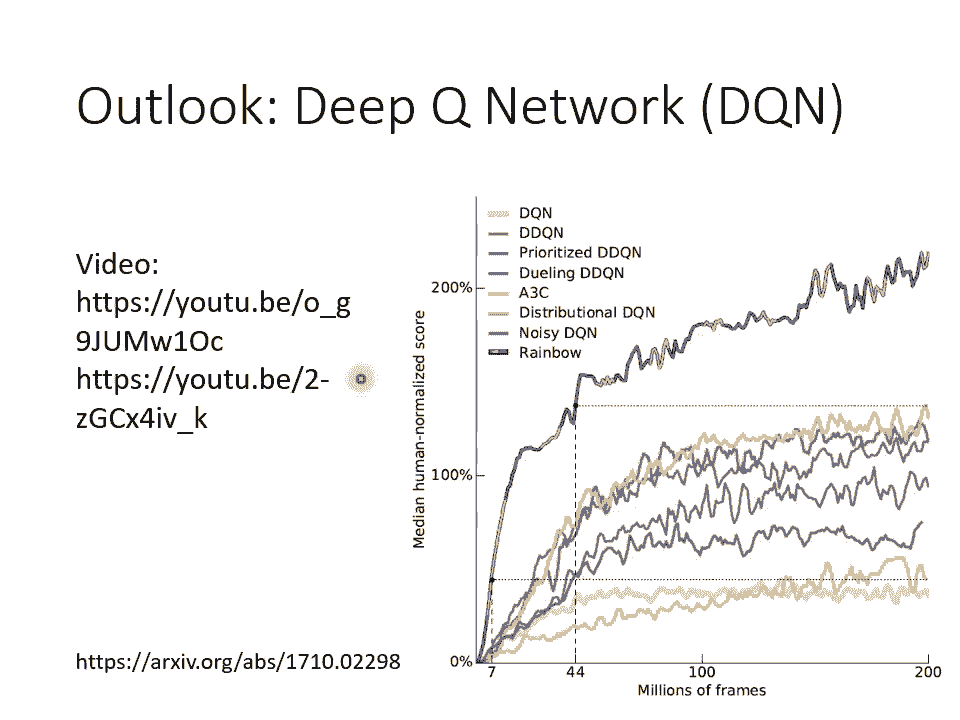

# 【国语+资料下载】李宏毅 HYLEE ｜ 机器学习(深度学习)(2021最新·完整版) - P31：L18.3- 概述强化学习3：Actor-Critic - ShowMeAI - BV1fM4y137M4

好，那我们就开始上课吧。那等一下的规划是这样，我们先把RL呢讲到一个段落，然后再请助教公布作业。好，那上一次啊RL的部分，我们讲说我们要认一个actctor。好，那这一次啊我们要认另外一个东西。

这个东西呢叫做critic。那我会先解释critic是什么，然后我们再来讲说这个c了对le actor这个东西有什么样的帮助？

好，我们先看critic是什么，critics是什么呢？critics是呃，他要来拿他是他的工作啊，是要来评估一个actctor的好坏。哦就你现在已经有一个actctor啊，他的参数呢叫达。

那ctic的工作就是他要评估说如果这个actctor，他看到某个样子的observation，我看到某一个游戏画面，接下来他可能会得到多少的reward。那critic有好多种不同的变形。

有的critics是只看游戏画面来判断有的critics是说采取某看到某一个游戏画面，接下来又发现actctor采取某一个action，在这两者都具备的前提下，那接下来会得到多少reward。

那这样讲呢还是有点抽象，所以我们讲的更具体一点。我们直接介绍一个我们等一下呢会真的被用上，你在作业里面真的派得上用场的。这个ctic叫做value function。

那这个value function呢，我们这边用大写的V of S来表示好，那它的输入是什么？它的输入呢是S，也就是呃现在游戏的状况。比如说游戏的画面。那这边要特别注意一下V啊。

它是有一个上标se塔的这个上标se塔代表什么意思呢？代表这个V呢？它观察的对象是se达这个actctor哦，它观察的这个actctor呢？它的参数呢是se达好那这个V呢V塔呢就是一个function哦。

它的输入是S那输出呢是一个sar哦，这边用V达的S呢来表示这个scalar。那这个scalar呢这个数值有什么样的含义呢？这个数值的含义是这一个actctor放在上标的这个actctor。

它如果看到observ s如果看到输入的这个S的游戏画面。接下来它得到的dicounted的 cumd reward是多少，你还记得这个discounted cumative reward是什么吗？

记不记得我们之前说在评估某一个action好坏的时候，你不能单看那个action执行完的re，你要把那个action执行完的re加上接下来所有的re。

得到一个md的 reward叫居这样才能够评估在某一个state执行某一个action的呃好坏的程度，但是我们又说你把所有的R从执行某一个action开始到游戏结束所有的R直接都加在一起。

并不是一个好的想法，你应该乘上一。discounted factor叫做伽马哦，就今天得到的re。如果离执行这个某一个action的时间越远的话，那那个reward就跟那个action越没有关系。

所以应该乘上一个discounted factor叫做伽ma，那我们得到派这个派呢就是这边所谓的dicounted reward那这个value function它的工作啊。

就是要去估测说对某一个ctor来说，如果现在他已经看到某一个游戏画面。那接下来会得到的dicounted reward应该是多少当然discounted cu reward。

你可以直接透过把游戏玩到底就就就你看到某你已经有了ctor的那假设他看到这个stateay那最后他到底会得到多少的这个派呢，你就把这个游戏玩完你就知道了。

但是这天这个value function它的能力就是他要未卜先知未看先猜游戏还没有玩完，只光看到S。就要预测这个actctor它可以得到什么样的表现啊。

那这个就是valueue function要做的事情。

举例来说呢，假设你给valueue function，哎，这个游戏画面还叫直接预测说看到这个游戏画面接下来应该会得到很高的cumulated的 reward。为什么？

因为游戏这个游戏画面里面还有很多的外星人，那假设你的这个actctor，他很厉害，他是个好的actctor，他是能杀得了外星人的actctor，那接下来他就会得到很多的reward。

那像这个画面，这已经是游戏的中盘，游戏的残局，游戏快结束了，剩下的外星人没几只了，那可以得到的reward就比较少。那这些数值你把整场游戏玩完，你也会知道。

但是valueue function想要做的事情就是未卜先知。在游戏没玩完之前就先猜应该会得到多少的discounted的 cumd reward。那这边有一件要跟大家特别强调的事情是。

这个value function是有一个上标se达的这个value function跟我们观察的actctor是有关系的。同样的observ，同样的游戏画面。

不同的actctor他应该要得到不同的died cumd的re。我刚才在举例子的时候，我说假设我们有一个好的actctor看到这个游戏画面会有高的value，看到这个游戏画面会有低的value。

但是假设你的actctor其实很烂，他很容易被外星人杀死。那也许看到这个画面，他的value也是低的。因为有一堆外星人他随便动两下，他就被杀死，他根本得不到reward。

这个烂的 actor在这个画面他可能拿到的V也是低的。哦，所以value function的数值是跟观察的对象有关系的。好，这个是ctic。

好，那在讲critic要怎么被使用在reinforment learning之前呢？我们来讲一下critic是怎么被训练出来的那有两种常用的训练方法。

第一种方法呢是montic carlo base的方法，这边缩写成NC。好，那怎么训练出这一个value的呃function呢？这个value的creative vC达呢啊，你就如果是用NC的方法的话。

非常直觉。你就这样做，你就把actctor呢拿去跟环境互动互动很多轮。那actctor呢跟游戏跟环境互动以后呢，actctor呢去玩这个游戏以后呢，你就会得到一些游戏的记录。

你就会发现说假设actctor看到SA。那因为你已经把游戏玩完了嘛，你可能玩了很多场游戏，那你就知道说看到tay看到observation sA接下来的cumative reward会是GA我这边把di略掉了。

反正你知道我的意思就好了。好，那这个时候呢你的value function就得到一笔训练资料。这笔训练资料告诉他说，如果看到SA作为输入他的输出啊，这个V setSA啊，应该要跟GA越接近越好。好。

那假设你今天simple到另外一个 observationserv，看到另外一个游戏画面，把游戏玩完之后发现得到的cumulated reward是GB plan。那这个时候呢。

你的这个value function呢输入SA，它就应该得到V set ofSB。那这个V set of SB就应该跟GB plan越接近越好。好，那这个非常直觉。

你就去观察X会得到的cmative reward。那观察完你就有训练资料，直接拿这些训练资料来训练value function。好这个NC呢是一个很直觉的做法。

接下来我们来看另外一个没有那么直觉的做法啊，这个做法呢叫做temp difference approach缩写呢是TD那temp difference approach。

它希望做到的事情是不用玩完整场游戏才能得到训练value的资料，你只要在某一个observationT的看到ST的时候。

你的actctor执行的AT得到re然后接下来再看到ST加一这样的游戏画面光看到这样一笔资料，就能够训练S了哦，光看到这样子的资料就可以拿来更新VS的参数了。那如果光看这样一笔资料就可以更新VS的参数。

有什么样的好处呢，它的好处是你想在NC里面你要玩完整场游戏，你才能得到一笔训练资料。有的游戏其实很长啊，甚至有的游戏也许它根本就没有不不会结束，它永远他都他都一直继续下去，它永远都不会不会结束。

那像这样子的游戏，你用NC就非常的不适合。那这个时候你可能就希望采用TD的方法。好，那怎么只看到这样子的资料就拿来训练VS呢？这边举一个例子。哦。

我们先来看一下V ofST跟V of ST加一它们之间的关系。那V of ST是什么？我们说V of ST就是看到ST之后的 cumulator word。

所以V ofST就是RT加上伽马RT加一加上伽马平方RT加2以此类推。然后V ofST加一就是RT加一加伽马RT加2以此类推。那你发现说这两个VV of ST跟V of ST加一啊，它们之间是有关系的。

什么样的关系呢？你可以把它写成这样一个式子，把V of ST加一乘上伽马再加RT我把V of ST加一每一项都成伽马，再加上RT就会变成V of ST哦。

所以V ofT跟V of ST加一中间有这样子的关系。我们现在呢有这样一笔资料以后，我们就可以拿来训练我们的value function。希望。

valueue function呢可以满足这边我们所写的这个式子。好，那怎么什么意思呢？就是假设我们现在有这样一笔资料，我们就把ST带到value function里面，得到V of ST。

我们用ST加一带到value function里面得到V of ST加一。虽然我们不知道V of ST是多少。我们也不知道V ofST加一应该是多少。我们没有这两个东西的标准答。

但我们知道他们相减应该是多少。根据上面这个式子，我们把V ofT加一乘上伽马，然后再去减V ofT哦把V ofT减掉伽马乘V ofT加一应该要跟RT越接近越好RT呢在这边我们是有收集到RT这笔资料的。

我们要知道V ofT跟这个V ofT加一之间的关系。所以我们知道V ofT减掉伽ma乘上V ofT加一应该跟RT越接近越好。所以你就有了这样子训练资料输入ST输入ST加一，他们通通过VC的。

然后呢把它们相减，然后要跟RT越接近越好。那这个就是TD的方法。好，那所以我们介绍了两个这个训练value function的方法啊，介绍两个训练的方法，一个叫NC一个叫TD。那这两个方法。

其实你拿来计算同样的呃观察到的结果，同样的讯同样的资料，同样的赛达你用NC跟TD来观察你算出来的value function很有可能会是不一样的啊，那这边呢就举一个例子啊，这个例子是这样子的。

我们观察某一个actctor啊，这个 actor呢跟环境互动玩了某一个游戏8次啊，但然这边为了简化计算。我们假设这些游戏都非常简单，都一个回合就到两个回合就结束了啊。

所以那个ctor第一次玩游戏的时候呢，他先看到SA这个画面得到re。接下来看到SB这个画面得到re游戏结束啊接下来呢这个有连续6场游戏都是看到SB这个画面得到re一就结束了。最后一场游戏看到。

这个画面得到rewarding就结束了。那我们这边呢呃先无视actctor为了简化起见，无视actctor，我们也假设呢伽马就等于一，也就是没有做discom。好，那这个SB应该是多少呢？

V of SB应该是多少呢？我们知道这个。V of SB啊，他的意思就是这个看到SB这一个这个画面，你会得到的reward的期望值。那SB这个画面呢，我们在整我们在这8次游戏中总共看到了8次。

每次游戏都有看到SB这个画面，看到SB这个画面之后会得到多少reward呢8次游戏里面呢有6次得到一分，两次得到零分，所以平均是4分之3分，没有问题。所以view of SB就是4分之3。

妥妥的没有争议。那V of SA应该是多少呢？你觉得看到SA接下来应该要得到多少reward呢？根据这8笔训练资料，看到SA接下来应该得到多少reward呢？好，给大家10秒钟的时间。

你把你的答案写在留言板上，你把你的答案打在留言区上。我们趁着这个机会来回答一下同学们的问题。有吗，诶。好，如果大家有问题的话，你就可以打在聊天室里面啊。接下来给大家一点时间。

想想看你觉得V of SA根据我们看到的这芭笔训练资料，它应该是多少呢？把你的答案写在聊天室里面。我看这个聊天室到底能不能用，哎，可以。好，我看到了好多答案，几乎所有人都说是0。哎，好。

几乎所有人都是0，有别的答案吗？好，几乎没有其他答案，所有人都说是0。好，多数同学都说是00是不是一个正确的答案呢？0是不是一个正确的答案呢？它既对也不对。其实还有另外一个可能的答案是4分之3。

我看没有人写4分之3啊，等一下来解释为什么有可能算出4分之3，但零也是一个合理的答案，为什么你会觉得应该是0呢？0是用lo的想法得到的，为什么是0。因为我们看到SA只有一次啊。

看到SA以后会得到多少reward这是零呢，看到SA以后哦，得到re0再看到SB得到re还是0，所以acumd的reward就是0。所以如果从蒙lo的角度来看。

我们看到SA接下来算出来的G应该是多少就是零呢？所以V of sA应该就是0妥妥的没问题。几乎所有同学都得到了正确的答案。但如果你用TD你算出来的可会是不一样的结果，怎么说呢？因为V ofA跟V of。

中间有这样子的一个关系，这个V of SA啊应该要等于V of SB加上reward。哦，就是你在看到SA之后，得到reward接下来进入SB。

那这个V ofSA应该等于V ofSB加上这个reward哦，这边notation没有用的呃非常好了。这个R哦指的是这边这个R啊，这个这个R指的是这边这个R。所以按照这个想法，V of SB是多少？

4分之3，这个R是多少是0，但V of SA应该是4分之3哪，对不对？按照TD的想法，V of SA应该是4分之3。你可能会问说，那到底蒙t卡lo跟TD谁算出来是对的呢？呃，都可以说是对的。

他们只是背后的假设是不同的。对蒙迪卡lo而言，他就是直接看我们观察到的资料SA之后接SB得到的accuulated的re就是0呢。所以V ofSA当然是0。但对TD而言，它背后的假设是这个呃呃S。

SA啊跟SB啊是没有关系的。看到SA之后，再看到SB并不会影响看到SB的reward。你现在看这芭比训练资料给你一种错觉，觉得说 ofA应该是0，那只是因为你到的资料太少了。

看到SB应该可以期望的reward是4分之3，只是因为仅这天正好运气不好，看完SA以后再看SB正好R是0，但是其实期望值应该4分之3，你一直正好运气不好，看到R是0，你才会觉得SA是0。

但是SB看到SB以后得到的期望reward应该是4分之3呢。所以看到SA以后，你会看到SB那你得到的这个期望的reward也应该是4分之3啊。所以从TD的角度来看。

SB会得到多少reward跟SA是没有关系的。所以你应该所以SA。这个cmative reward应该是4分之3。但对蒙提卡lo而言，他并不觉得SA跟SB是没有关系的。

也许SA就是一个带赛的 observationserv。看到SA以后，你就影响了SB会得到的reward。也许看到SA以后，SB就是会得到reward等于0。就他们之间互相有影响的。

看到SA以后SB就会等于0。那V ofSA应该等于0哦，所以总之用NC来计算，用TD来计算，会有微妙的差异。好。好，我来看看有没有同学有问题。好，目前没有啊，助教我统计一下。

说哦只有一个同学回答一其他都是你。好。那这个是NC跟TD啊，这个是NC跟TD。好，那接下来我们就是要看说唉这个呃ctic怎么被用在训练actctor上面。

那还记不记得我们上一次啊最后我们讲到这个actctor的方法的时候，我们说啊怎么训练一个actctor，你就先把actctor跟环境互动，得到一些re。

然后你得到一堆这个observation跟这个action的 pair，然后你要说哎这个在S one执行A one的时候多好呢，得到一个分数A one。

那我们说这个A one呢它是cmulated的re。那上周有同学问到说难道cmulated的re不需要做nmalization吗？需要做nmalization。

所以我们说这个减掉一个B当做 normalmalization。但这个B的值应该设多少呢？就不好说。那我这边呢告诉大家说，一个V合理的设法，是把它设成V of S。假设你现在认出了一个cittic。

就根据这些训练资料，其实你也可以去认一个ctic嘛，等一下认出这个ctic以后，这个cittic给他一个state，它就会产生一个分数。那你把这个分数啊，当做B啊，你把这个分数当做B。

所以G one point就是要减掉V of c达 oneG two point就是减掉V of c达 two以此类规。好了，再来的问题就是为什么减掉V是一个合理的选择呢？

那我们在下一页投影片来跟大家解释一下。好，那现在呢我们已经知道说这个呃SA这个pe它有多好呢？这个AT代表它有多好呢？我们是用G派减掉V ofST来定义这个A。好。

那我们先来看一下这个V of ST到底代表什么意思。V of ST代表什么意思呢？view of ST是看到某一个画面ST以后，接下来会得到的reward。那它其实是一个期望值。

因为假设你今天看到同一个画面，接下来再继续玩游戏，游戏有随机性。你每次得到的reward都不太一样的话，那V of ST呢其实是一个期望值。好，那在这个时候啊，在看到ST的时候啊。

你的actctor不一定会执行AT这一个action。唉说为什么呢？为什么它不一定执行AT这个action呢，不要忘了actctor本身是有随机性的。在训练的过程中。

我们甚至鼓励actctor是有随机性的，所以同样的S，你的actctor呢它会输出的这个action不一定是一样的。

我们说actctor的输出其实是一个proability的di是一个在这个action的 space上面的proability distribution，它给每个action一个分数。

你按照这个分数去做simle，有些action被simble到几率高，有些action被sble到几率低，但每一次sle出来的action并不保证一定要是一样的。哦，所以看到ST之后。

接下来有很多的可能很多的可能。所以你会算出不同的呃cumulated的reward啊。那当然如果你有discount的话，就是discounted的 cumd reward。

那我们这边呢是把discount这件事情暂时省略掉。啊，反正大家知道我的意思，我这边没有加，我这边没有加派了，不过大家知道没有加上标派，不过大家知道我的意思就好。好，那把这些可能的结果平均起来。

就是V ofST啊，这是V ofST这一项的含义。好，那GT这一项的含义是什么呢？GTp这一项的含义是在ST这个位置，在ST这个画面下执行AT以后，接下来会得到的cmative reward。

就你执行AT以后，接下来呢在一路玩下去，你会得到一个结果，得到个reward就是GTP。那如果今天AT大于零是什么意思？如果AT大于零代表说GT大于V of ST。

这个时候代表说呢这个action是比我们 randomdon simple到的action还要好的在这边得到GT的时候，我们确定是执行了AT那在ST在算这个V of s的时候。

我们不确定我们会执行哪一个action哦，所以我们执行actionAT的时候，得到的reward大于随便执行一个action得到的reward哦，所以当AT大于零的时候。

代表说AT大于随便执行的一个action。那这个时候这个actionAT它就是好的，所以我们给他一个大于零的AT。反之，如果AT小于零什么意思？

AT小于零代表说这个平均的reward大过执行AT得到的reward。你随机采取的action，按照某一个ditributionsimble出来的action得到的这个mative rewardward的期望值大过采取AT这个action所得到的reward。

那这个时候AT就是坏的，所要给它负的大AT所以这样就非常的直觉。为什么我们应该把GT point减掉feT。但讲到这边，你有没有觉得有一些地方有点违和呢？什么地方有点违和呢？

这个G派它是一个simle的结果。他是执行AT以后一直玩玩玩，玩到游戏结束，某一个simple出来的结果。AV ofST是很多条路径，很多个可能性平均以后的结果。我们把一个sample去减掉平均。

这样会准吗？也许这个sample特别好或特别坏呀，我们为什么不是拿平均去减掉平均呢？所以我们这门课要讲的最后一个版本就是拿平均去减掉平均。也就是说，我们执行完AT以后，得到rewardRT。

然后跑到下一个画面ST加一，把这个ST加一接下来一直玩下去，有很多不同的可能，每个可能通通会得到一个reward，把这些reward平均起来，把这些acd的reward平均起来是多少呢？

其实就是V ofST加1。本来你会需要玩很多场游戏才够得到这个平均值。但没关系，假设你训练出一个好的。那你直接带V ofST加一，那你就得到是你直接得到你直接带V ofT加一。

你就知道说在ST加一这个画面下，接下来会得到的的期望值应该多少。而接下来呢你再加上RT，接下来再加上RT代表说在ST这个位置采取ATT跳到ST加一以后会得到的reward的期望值。

因为我们知道说在ST这边采取AT会得到rewardRT再跳到ST加一。然后ST加一会得到期望值，期望的reV ofT加一。

所以我们这边呢再给它加上RT代表说在ST这边执行AT以后会得到的reward的期望值。接下来再把这两个东西相减再把RT ofT加一减掉 of也就我们把换。乘RT加V ofST加一再减掉V ofST。

我们就知道说呃。采取AT这个re不不是reAT不是re它是action采取AT这个action接下来得到的期望re减掉不采取AT，而是随便sle一个a根据某个个a会得到的re两者的期望值差距有多大。

那如果RT加V of比较大，就代表AT比较好，它比随便simle号RT加V ofT小于V of就代表AT它是lower than average它比从一个ditributionsle到的action还要差。

所以呃今天呢这个就是大名鼎鼎的一个常用的方法叫做的的里面你是怎么定义AT的呢？也就是RT加 of减掉呃加 of加一减掉 of就是我们的AT了。

好，那这边呢有一个训练actctor critictic的小技巧了，那你在作业里面也不妨使用这个技巧，这个技巧是什么呢？

actctor是一个nactic也是一个naactctor这个是一个游戏画面当做输入，它的输出是每一个action的分数ctic是一个游戏画面当做输入输出是一个数值代表接下来会得到的acd的这边有两个newval。

他们的输入是一样的东西。所以这两个new他们应该有部分的参数可以共用吧。尤其假设你的输入又是一个非常复杂的东西，比如说游戏画面的时候，前面几层应该都需要是CNN吧。

要了解这个游戏画面需要用的CNN也许是差不多的吧。所以actctor跟ctic他们可以共用前面几个 layer哦，所以你今天在实作的时候，往往呢你会把你的actctor critic设计成这个样子哦。

 critic呢他们有共用多大部分的然只是最后呢呃输出不同的action就是ctor输。出一个sar就是critic啊，那这是一个训练actctor critictic的小技巧。

好，那呃其实今天讲的啊并不是reinforment learning的全部。那其实在 reinforcement learning里面，还有一个系列的做法是直接采取ctic。

也就是直接用ctic就可以决定要用什么样的action。那其中最知名的就是DQ dQN。那不过呢这边我们就不细讲DQN了。如果你真的想知道DQN的话，可以参考过去上课的录音。那DQN哇。

有非常非常多的变形，这边呢就是找一个非常有一篇非常知名的paper叫做rainbow哦里面呢就是试着去尝试了各种DQN的变形试了7种，然后再把这7种变形集合起来，因有7种变形集合起来。

所以他说它是一个彩虹哦，所以他把它的方法叫做rainbow。那我也把这个paper留在这边给你参考。那如果你想知道rainbow里面的每一个小技巧是怎么做的话，你就参见上课录音过去的课程。

有把rainbow里面的。一个小技巧都讲过一遍。

好，那讲到这边呢，正好告一个段落。我们现在看看有没有同学有问题。好，那个呃我来回答一下同学们的问题。有一个同学说SA后面接的不一定是SB吧，这样怎么办？这是一个很好的问题。

SA后面不一定接SB那这个问题在刚才我们看到的那个例子里面就没有办法处理。因为在刚才那个我们看到那个只有8个的例子里面，SA后面就只会接SB所以我们观察没有观察到其他的可能性，所以我没办法处理这个问题。

所以这就告诉我们说啊，在做reinforment learning的时候，simle这件事情是非常重要的。你rement learning最后认的好不好？跟你在simle的时候。

simle的好不好关系非常大。哦，所以这个 reinforceforment learning是一个非常吃人品的方法了。所以你在作业里面，你可以这个体验一下，你sle到的结果。

对你最后的结果有非常大的影响啊。然后下一个问题，锁。异议。每一个V。都需要对应到固。定的环境发生顺序吗？哎，我先说一下那个王大华同学其实是助教啦，那这不是他的本名了。

那是但但这个王大华同学是助教还是助教？然后。哎，我看一下哦。所以V呃每一个V都需对应到固定的环境发生顺序吗？我没有很确定你的问题。但是我试着回答一下，就是呃每一个V它不会固定。

它不会对应到固定的环境发生顺序。也就是V如果你的游戏有随机性的话，那V其实是代表了一个期望值。它想要算的就是给某一个observ看到某一个游游戏画面以后。

接下来你会得到的cmative reward的平均值，它的期望值。就如果你的游戏有随机性的话，V代表的是期望值。你看到某一个游戏画面以后接下来会发生什么事情，不见得是一样的。

但把所有的可能性都平均起来去，它的期望值，这个就是V所代表的意思。后面出现的S应该是不固定的，这样怎么带公式。好，那个我想我刚才应该呃算是有回答到的，后面出现的看到某一个这个observation。

后面出后后面出现的observation确实是不固定的那如果有些状况，某些observation你没观察到的话，哇，那你真的就没办法训练。哦，V当一然后有同学问说就是拿V当一般人的实力超过他就是猛。

没超过就是烂吗？对，就是这样。哎，V就是平均的实力，超过V就是好。想请问这个ditribution要从哪里知道呢？我知我我想你这个ditribution问的是那个actctor的dibution了。

对不对？我们说ditribution action的 distribution呃action是从某一个ditribution sample出来的那个tri是谁呢？

那个是这样就是你的ctor不是像是一个classifier吗？你的ctor像是一个classifier，然后你把S丢进去，每一个state哦不是每个t每个action都会有一个分数。

你把这个分数呢通过s max就做一个nmalize它就变得像几率一样，然后按照那个几率去做simle，那这个就是actctor从一个dibution sample出来的这句话的意思。

