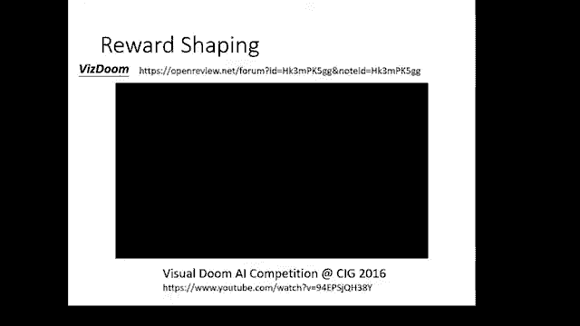

# 【国语+资料下载】李宏毅 HYLEE ｜ 机器学习(深度学习)(2021最新·完整版) - P32：L18.4- 概述强化学习4：回馈非常罕见的时候怎么办？机器的望梅止渴 - ShowMeAI - BV1fM4y137M4

好，这个接下来啊想要跟大家分享的是一个叫做reward shaping的概念。什么是reward shaping呢？

到目前为止，我们学到的东西是我们把我们的actctor拿去跟环境互动，得到一堆reward。那把这些reward做某些的整理以后，得到这边的分数A啊，有了这边的分数A。

你就可以去教你的actctor该做什么不做什么。但是在这个reinforcement learning里面，我们很怕遇到一种状况是，假设reward永远都是零的时候怎么办呢？

假设多数的时候reward都是0，只有非常低的几率，你会得到一个巨大的reward的时候，那怎么办呢？假设reward几乎都是0，那意味着什么？意味着说你今天这个A不管怎么算，都是都是0。

对每一个action都是差不多的。反正不管执行什么action得到的reward都是0嘛。所以执行这个action，执行那个action根本没差。那如果不管执行什么action，re几乎都是零的话。

那你根本没有办法去确认你的a。那讲到这种spas reward的问题，也许有人马上会想到的是，唉，下围棋也许是一个spae reward的问题。因为在下围棋的时候，你每落一子，你并没有得到reward。

你并没有得到positive或 negative的 reward，只有在整整场游戏结束，落完最后一子的时候，在中盘在落完最后一子游戏结束的时候，你赢了才会得到positive的 reward。

你输了才会得到negative的re。但是我觉得相较于其有一些其他任务，这个下围棋还算是比较有reward的RL的问题。举例来说，假设今天的问题是你要教机械手臂去栓螺丝，而教机械手臂拴螺丝这个问题啊。

你合理的reward的定义是假设今天机械的手臂成功把螺丝拴进去，它就得到positive rewardward，没有把螺丝拴进去，reward就是零。但是你想想看，一开始你的机械手臂。

它里面的X的参数是随机的啊，所以它就在空中随便挥舞，怎么挥舞，reward都是零，不像是下围棋，你至少整场游戏玩玩，你还有正面的或负面的reward。而像机械手臂，你在你要叫机械手臂去拴螺丝。

除非它正好非常巧合的拿起一个螺丝再把它拴进去，它得到正向的reward。不管它做什么事情都没差，得到的reward通通都是零分。好，那遇到这种状况的时候怎么办呢？遇到这种状况的时候，有一个解法啊。

就是呃我们想办法去提供额外的reward来引导我们的agent学习。也就是说，在原来的reward，也就是我们真正要agent去mimize the rewardward之外。

我们再定义一些额外的reward。我们定义这些额外的reward来帮助我们的agent学习学习。那这种东西这种定额外的reward来帮助agent学习这种事情呢，就叫做reward sha。

那也让我们人呢其实也汉称擅长做reward sha。呃，举例来说啊，这我让我想到一个这个妙法莲华经中的故事啊。这个故事呢出自妙法莲华经中的化成御品啊，这个故事就是有一个领队，然后带一群人呢去呃找宝藏。

然后宝藏呢在500游寻之外，那游询是什么单位，我也忘了，那你就记你就当做很远就对了，就当500500万公里之外，然后呢，这群人呢走到半路已经过了半途了，觉得很累，不想在。往前走了，那大家就坐在地上挨好。

不想再往前走了。那领队看大家不想再往前走怎么办呢？他就跟大家说呃，再往前10公里呃，有一个五星级的饭店，大家就可以去休息了啊，大家就看到五星级的饭店就很高兴就去休息了。然后隔天早上饭店就不见了。

而后领队说那个饭店呢是我用法力变出来的。哎，那领队有法力。哎，那法那饭饭店是领队用法力变出来的然后为了鼓励大家再继续往前走，免得大家半途而废。

这妙法莲华金说这个故事是为了表示说啊佛最后希望大家成就的是佛道啊，但佛道非常的长，所以中间呢设了小圣、中圣、大圣等不同的位接来引导大家前进。那如果对应到比较生活化例子就是比如说现在叫你念博士啊。

你可能觉得念你要博士毕业才能够夺博拿到博士学位才够得到reward。那你就会觉得哇这个路呢非常的长，然后就不想要念博班了。但是如果告诉你说啊，你先修个课就可以得到reward。然后做一点专题。

这样可能也没有做出什么厉害成果，但老师就会说你好棒啊，你也得到reward。然后最后呃先发一个sed ti的 conference得到reward，再发表 ti conference再发再就得到re。

然后最后你就可以博班毕业，这样一步一步往前走，最终你就可以达成最终的目标这样那么这种地方也要叶配念博班，我实在是有点受不了了。不过没关系，反正这门课快结束了，要在业配。也没几次了。好。

那这个呢就是reward sha的概念。好，那我们接下来呢就举一个reward shaping真正实际使用在RL里面的例子给大家参考。那这边举的例子呢是用viss来跟大家举例。

那因为怕大家不知道viss是什么，所以这边呢还是放一个影片给大家看一下这个viss呢是一个第一人称的射击游戏。那满场有人用RL来玩visston的那以下呢是一个viss，用RL来玩viss。

用机器来玩vissdom这个游戏的的这个呃比赛的录影。我们来看一下这个比赛录音，讲起来像这个样子。

特别的每一个选手啊都不是人哦，每一个选手通通都是机器。所以你仔细看一下，会发现说啊有些人的行为很奇怪，比如说右右上角这个人他还蛮容易卡墙。呃，右上角这个人还蛮容易卡墙的，他在他在撞墙壁，为什么？

因为他不是个人，他是一个机器。好，这个是让你知道一下beston大概是什么样的游戏啊，那这个影片非常长啊，它是个长达2小时的史诗级的战斗。你有兴趣再慢慢把它看完。好。

在当年那个visston的比赛里面呢，第一名的队伍就有用到了reward shaping的概念。那在viss顿这个游戏里面，你被敌人杀掉，你就扣分。你杀了敌人就加分。

但如果你光凭着这个游戏里面真正的reward来训练ag，你是很难把它训练起来的。哦，所以呢在这篇文章里面就使用了一些reward shaping的概念。那我们就来看一下他是怎么定这些reward啊。

举例来说，这个第一点呢，我们等一下再看，我们先看第二点。第二点，他说如果今天有扣写。那你就得到负的reward。那其实在游戏里面扣血并没有惩罚，扣血并不会扣分，你要死掉才扣分。

但是如果机器要到死掉才知道呃，它得到负的reward，那可能他可能要很花很久的时间才能学到扣血跟死掉之间的关联性。所以这边直接告诉机器不可以扣血，扣血是坏的事情。好。

然后这边是如果呃损失弹药就扣一点分数，然后捡到这个医药包就加分，捡到弹药的补给包就加分。那这些事情在游戏里面是不会影响分数的。但是我们人我们developer，另外强加给机器来引导机器学习。

然后接下来就是一些比较有趣的reward了。举例来说，他说呢，如果你的agent总是待在原地，那就要扣分。哦，为什么需要这样的reward呢？因为如果你没有这样的reward对agent来说。

一开始他非常弱，他出去时候呢随便走两步就被敌人杀死了。所以对他来说，对一开始很弱的agent来说，可以得到比较高reward的做法，也许就是待在原地，待在原地至少reward是0呢？那出去碰到敌人啊。

还要被扣血，那夺华不来啊。所以为了避免 machine最后什么都没有学到，就只会待在原地。所以强制告诉他说，你只要待在原地就直接扣分。还告诉他说，如果你动唉，就给你一个很小的分数啊，这边你只要每动一下。

就给你9乘以10的负次方，一个非常小的，但这是positive的 reward。好，但是光是要求机器动是不够的。所以这边又多加了一个非常有趣的reward。

这个reward是每次如果agent活着agent每活着，他就要被扣分，你感觉很奇怪，活着不是一件好事吗？为什么活着反而应该要被扣分呢，那是因为假设现在活着没有扣分，或者是甚至是一件正面的事情。

对agent来说，他会学到的，可能就是边缘OB啊。哎，你虽然有要求他动，那你要求他动没有关系啊，他就在边缘一直呃自转就好，他在边缘一直转圈圈就好。然后看到敌人就躲开，不要不要这跟敌人做任何的正面交锋。

那对你agent来说也许这样是一个最安全的做法。但是为了强迫agent学习去杀敌人，所以反而告诉他说，你只要活着就是扣分，你要想办法呃呃不可以活太久，你要想办法去跟别人交手哦。

所以这是一个非常有趣的reward。方式。那看到这些reward sha，你就会发现说reward sha这一件事情呢，其实是需要花do knowledge的。

它其实是需要凭借着人类对你现在环境的理解来强加上去。那今天再举另外一个reward sha的例子啊，假设你今天要训练一个机器手臂，那这个机器手臂的工作呢，就是把这个蓝色的板子插到这个棍子上。哦。

那像这样子的任务，你要凭着RL的方法，让机器凭空学会把蓝色的板子插到这个棍子上，没有那么容易。是，但是你可能会想到一个很直觉的reward shaping的方法是，假设今天这个蓝色的板子离这个棍子越近。

那我们得到的reward就越大。但是如果你仔细想想，会发现说单纯让蓝色的板子离这个棍子越近是不够的。为什么让蓝色的板子离棍子近是不够的呢？你可以看看。

这个呃呃像右边这右边这两个case，机械手臂也是想把蓝色的板子挪进棍子。但他做的事情呢其实就是去打那个棍子，然后从侧面接近，从侧面接近是没有用的，把蓝色的板子从侧面接近棍子并不能够达到你最终的目标啊。

所以如果我们单纯只是说啊现在你的蓝色的板子离这个棍子越近，它的reward就越大。你用reward sha的方法把蓝色的板子跟棍子之间的距离当做一个新的reward。

但可能对你最终想要解决问题本身是不一定有帮助的。所以reward sha这个东西，你在用的时候比较小心，它需要你对这个棍题本身有足够的理解，你才有办法使用reward sha这样的招数。好。

我们看一下有没有同学有问问题的。好好，目前没有同学问问题，那我们就继续啦。啊，那reward sharing里面呢有一个特别有趣而知名的做法叫做。curioitybased的reward sha。

也就是呢给机器加上好奇心啊，给机器加上好奇心。什么叫做给机器加上好奇心呢？所谓好奇心的意思就是要去探索新的事物。所以在原来的reward之外。

我们加上一个reward这个reward是如果机器它在活动的过程中看到新的东西，它就被加分。但这边呢又有一点要强调的是新的东西必须是有意义的心，不是无谓的心，什么叫做有意义的心，不是无谓的心呢？

那这个我们等一下再解释。好，那这个curioitybased的呃这个reforment learning呢？呃，它来自于ICNL2017的这一篇文章。那这篇文章里面有一个呃非常惊人的demo。

那我们来播一下这个demo。

🎼，🎼，🎼。

🎼。

🎼，う。🎼。🎼。

🎼。

🎼嘟嘟嘟嘟嘟。🎼嘟嘟嘟嘟。🎼嘟嘟嘟。🎼The。🎼丢嘟嘟。🎼啦嘟嘟嘟嘟嘟嘟嘟嘟嘟嘟嘟。

我想稍微解释一下刚才那个影片的意思啊，刚才那个影片的意思是说啊唉我把它停下来，等一下哦，就是他让机器玩马丽欧。那他甚至在马丽欧这个游戏里面没有任何的re。

他甚至没有告诉机器说破关就可以得到positive reward。那其实你告诉机器破关，可以得positive reward也没用了。这种re太pa的。

大概很难拿来训练ag他只告诉机器说你要不断的看到新东西，那光是这件事情就可以让机器学会破马丽欧的其中一些关卡。那当然这样子的方法，也许对马丽欧而言是最合适的。你知道马丽欧是横向卷轴游戏嘛。

那你要破关就是不断的往右走啊，那机器他要看到新的东西就不断的需要往右走啊，所以机器会呃光借有这件事就可以学到破解马丽欧的一些关卡。不过他要尝试说训练在前面几关，然后然后直接测直接把ag放在那个地下。

地下的关卡，然后就发现说做不起来，在地下关卡还是要微调一些内我才微调一下内我才做得起来。

好，那这个影片还有后半段了，我们。

诶。我们直接从某个地方开始看好了。

🎼哦，他接下来是他直接下来是直接拿叫机器去玩那个viss顿啊，直接到机器去玩viss顿。我们来放一下viss顿的部分好了。

好，那最后那一个背景有一堆杂训，有点像是那个电视机坏掉那种杂训的那个画面。你可能有点不知道这他这个影片想要表达什么。那那个部分就是我想要我刚才在最前面讲到的有意义的心这件事情唉。等我一下啊。好。

有意有意义的新这件事情就是假设我们要求agent要一直看到新的东西。那如果你的经画面背景有一个杂训，那杂训会不断的变化啊。所以对agent来说，杂训是新的东西。也许他就不会学到去探索新的环境了。

反正光站在那边看杂训就够了，他会觉得他不断的看到新的东西，所以其实在curity base的这个IL里面呢，也有想办法克服这种没意义的新这种看到杂训的问题，至于实际上怎么做，那你再参考他的论文。

