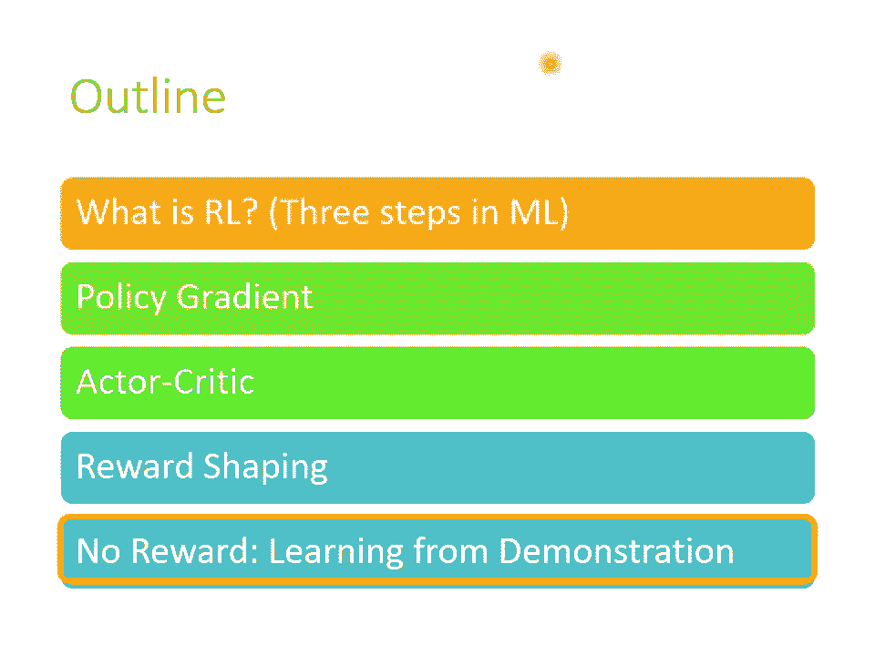
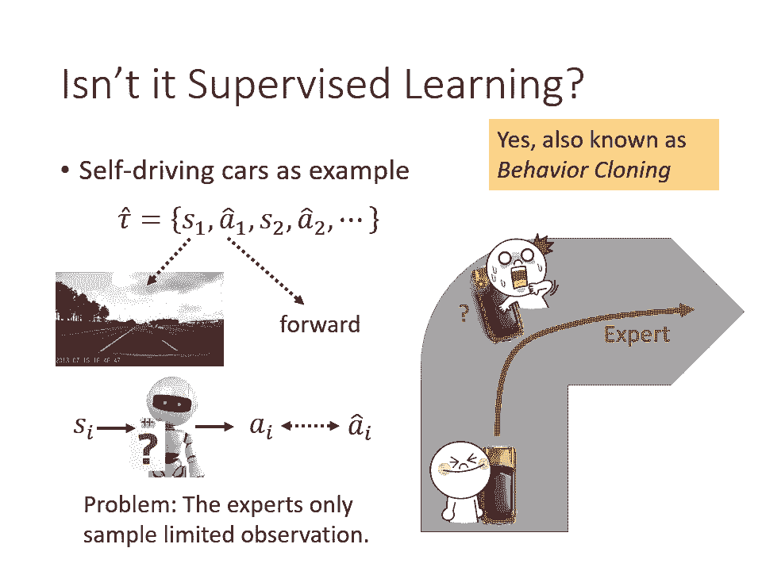
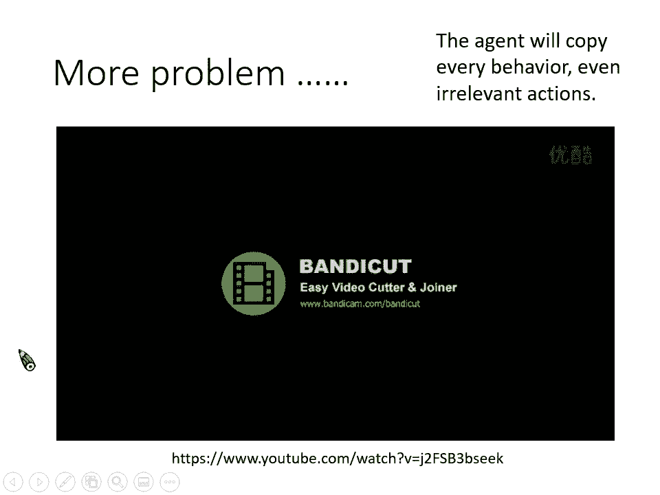
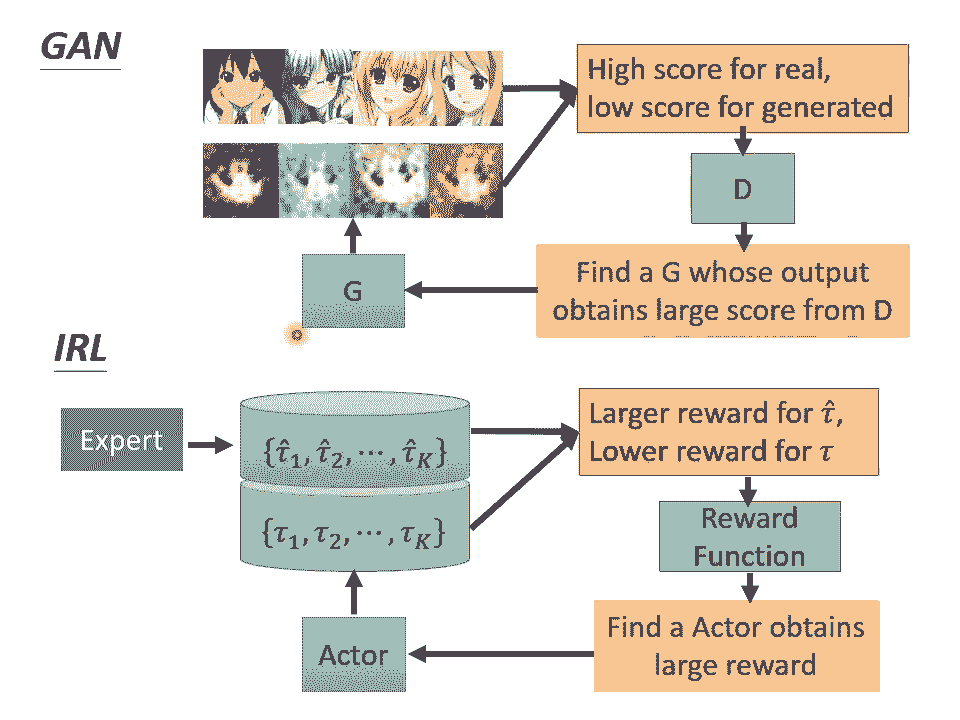
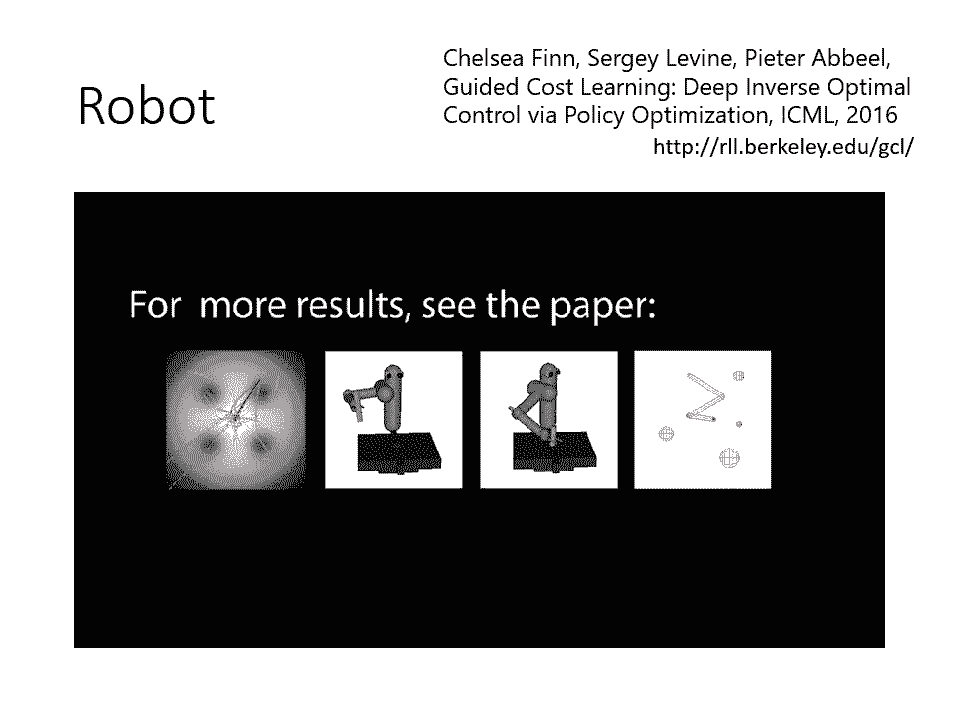
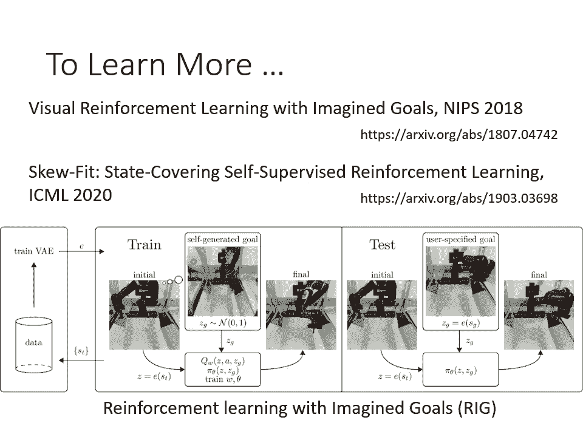
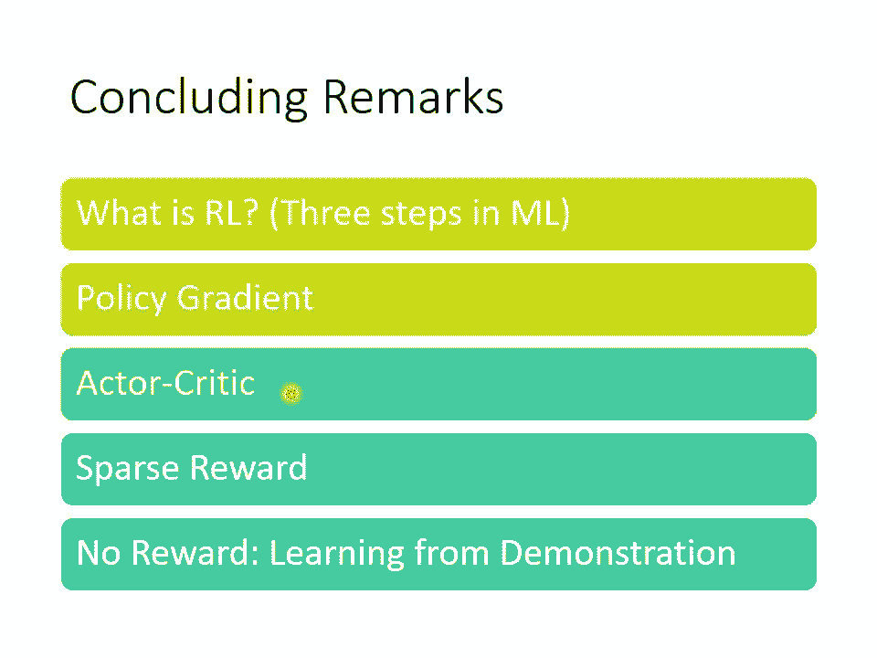

# 【国语+资料下载】李宏毅 HYLEE ｜ 机器学习(深度学习)(2021最新·完整版) - P33：L18.5- 概述增强式学习5：如何从示范中学习？逆向增强式学习 - ShowMeAI - BV1fM4y137M4

啊，那有关RL的最后一个部分啊，我想要跟大家分享的是，假设今天如果我们连reward都没有，该怎么办呢？在刚才的课程里面，我们是有reward的，只是有时候reward非常的spa。

所以你要做reward sha。但是假设今天连reward都没有的话，到底该怎么办呢？

那为什么有时候会连reward都没有呢？其实像reward这种东西啊，往往只在一些比较 artificialificial的环境。比如说游戏里面特别容易被定义出来。在游戏里面有一个记分版。

所以你特别容易去定义说在游戏里面怎么样的行为是好的，怎么样的行为是不好的。某一个行为有多好或某一个行为有多不好。但是在真实的环境里面啊，你要定义reward这件事情，有可能是非常的困难的。

假设你今天要用I的方法来学学去叫叫自驾车学会在路上走。那到底在路上走做什么样的事情会得到什么样的reward呢？他你让行人就给他加100分吗？还是应该加1000分。呃，闯红灯应该扣50分。

还是扣5万分呢？但像这种东西你根本不知道要怎么定，所以在更真在真实的环境中，有时候我们根本不知道要怎么定义reward这个东西。而且有时候啊那你说啊像我们不知道怎么定reward。

但我们可以凭着人类的智慧去想一些reward出来来盖的 machine逊啊。像我们刚才讲的那种reward sha不就是一个很好的例子吗？我们自己想一些reward出来来叫们训学。

但有时候你在想reward叫 machine训学的时候，如果你的reward没想好，训可能会产生非常奇怪的行为。你无法预期的行为。那这边举一个比较极端的例子。有一个电影呢叫做机械公敌。

在机械公敌里面呢呃当然这就未来的世界了，有一大堆机器人，那那些机器人的行为必须符合三条原则，这三条原则是呃第一条不能够伤害人类，也不能够做事人类被伤害。第二条是呃在不违反第一条的前提之下。

机器必须要听从人类的命令。那第三条是机器必须要保护自己，在不违反第一条跟第二条的。前提之下，所以你可以想象这三条路，这三条规则就代表说机器如果不违反这三条规则，就得到positive reward。

违反这三条规则就得到非常negative的re。然后有了这三条规则以后哦，机器呢就自己去发展，自己去学习。但是最终呢机器就得到神逻辑，但不违反这三条规则的前提之下。

要得到最大reward的方式就是把人类坚禁起来。因为人类会自我伤害啊，所应该把人类坚禁起来，避免他们自我伤害，这样机器就可以得到最高的reward。哦，所以这个例子告诉我们说光电reward是不够的。

机器可能会有神逻辑展现出你意想不到的行为。当然机器功底里面是一个比较奇极端的例子。那举一个比较有可能发生的例子是假设你训练机器去比如说收盘子。那这个是我在文献上实际看过的例子了。

你知道在文献上有很多文献是要reinforment learning方法。来训练机械手臂嘛。然后假设你今天要训练这个机器，把盘子摆到一个固定的位置，它把盘子放到指定的位置。

就得到pasitive reward啊，这个是你定义的reward。然后你用reinfor么等你去学，发现机器会把盘子放到指定的位置，但它都非常大力用摔了，然后结果盘子都被摔破了。啊。

那是因为你根本没有告诉机器说不能把盘子摔破啊啊，所以如果你你就会发现说机器没有告诉他不能把盘子摔破的前提之下，他为了达成目标，可能就把盘子摔破了。这个时候你只要赶快在定新的reward说。

如果摔破盘子就要扣100分。但问题是盘子已经被摔破了，已经来不及了。所以有时候人定的reward不见得是最好的。所以怎么办呢？在没有reward的情况下，我们要怎么训练一个agent去跟环境互动呢。

那在没有reward的状况下，让机器跟环境互动，其中一个方法啊叫做imitation的 learning。那在imitation learning里面，我们假设actctor它仍然可以跟环境互动。

但它不会从环境得到reward。呃environment仍然会送出observation，给actctoractctor仍然会做出回应environment仍然会随着actctor的回应给不同的observation。

但是没有reward这个东西。没有reward这个东西要怎么学呢？虽然没有reward，但是我们另外一个东西，这个东西呀是expert的示范。我们找很多expert。

通常是人类我们找很多人类也来跟这个环境互动，把人类跟环境的互动记录下来，这些东西就是ex这些记录就是exctor的示范，呃，就是expert的示范。然后把这些expert的示范呢，叫做thead。

我们用这个hat这个上标来代表人类的expert的示范。啊，那我们现在呢就是要凭借着这些示范，还有跟环境的互动来进行学习。这样讲也许有点抽象。什么叫做expert的示范呢？假设你今天呢要教机器开自驾车。

那人类驾驶的行驶记录，那就是expert的示范。人类驾驶的行驶记录可以告诉机器说呃，在这个路口，你应该打一下方向盘等等，那这些就是expert的示范，或者是你想要教机器做一些指定的动作哦，比如说倒水啊。

排网盘啊，你可能会先拉着机械的手臂示范一次，那人去拉着机械手臂示范一次，这件事情就是expert的demon，就是这边的t。那imittation learning你要做的事情就是从这些thand。

还有与环境的互动进行学习。那讲到这边可能有同学就会想说，唉，这个问题并起好像挺简单的，这个不就是supervise learning吗？

我们就把它当做supervise learning的问题来看待就好了。假设我们经常训练自驾车啊，你又有人类驾驶的记录，也就是你有记录说哎人看到这样子的呃录个录的画面，那人就会采取某一种action。

比如说他就会踩刹车或者是踩油门等等。哎，你有这样子的一堆的记录。我们不是直接就用supervise learning来弄我们的ag就好了吗？也就说你已经有人类给的资料说看到S one这样的画面。

最好的行为就是A one headSQ这样的画面，人类的行为，就是AQ head，你已经有这样子的训练资料，那你就直接叫机器去模仿人类的行为就好了。

今天机器给他看SI然后他输出AI你要让他的action AI跟人类的a AI head越接近越好，你就让机器去模仿。人类的行为。那没错，当你有这个expert的示范的时候，这是一个做法。

那这种做法呢叫做behavior的 cloy，哦，就是复制人类的行为。但是光是让机器去复制人类的行为，有可能有什么样的问题呢？一个可能的问题是，因为人类跟机器他们可能可以观察到的S会是不一样的。

什么意思呢？举例来说，假设我们一样要叫机器学习开自驾车。那它是跟人类的expert去学人类的expert在转弯的时候都可以轻松的转过这个弯道啊，没有人出车祸，没有任何马路三宝。

每个人都顺利的每一个expert都可以顺利的向右转。所以对机器来说，他从来没有看过失败的状态。他从来没有看过一个车子快要撞墙的状态。如果他从来没有看过一个车子快要撞墙的状态。

他训练资料里面就没有这种东西，他就不知道假设车子快要撞墙的时候，应该要怎么处理。因为所有 expertpert都太厉害了，根本就不会让车子靠撞靠近墙边，根本就不会犯这种错误。

那机器就不会学到说在这种人类平常不会经历的状态下，到底应该要怎么处理。所以这是第一个可能遇到的问题。

第二个behaviorny可能遇到的问题是，虽然人类在开车的时候可能很厉害，但也许不是每一个行为，机器都需要亦步亦趋的去完全模仿，也许有一些行为需要模仿，有一些行为是人类个人的特质，根本不需要模仿。

但是机器它不知道什么行为，该模仿什么行为，不该模仿，它只能完全复制人类的行为。那什么叫做完全复制人类，完全复制老师的行为呢？以下就是一个完全复制老师行为的一个例子。

那以下这个影片出自big bangang theory了。我就播给大家看一下。诶。嗯。哎。

W Sheldon No， it's water Ming Sheldon。A water m Sheldon。What's this？That what you did。

I assumed as in a number of languages that the gesture was part of the phrase。Well， it's not。

 what am I supposed to know that is the teacher is your obligation to separate your personal idiosyncrasies from the subject matter。

You know， I'm really glad he decided to learn Mandarin why once you're fluent。

 you'll have a billion more people to annoy and said of me。好，所以刚才我们就是看到了一个behavior cloning的例子。那对机器来说。

他就跟绿穿绿色衣服修don一样。他的老师教什么，他就会有一模一样的示范。那他不知道什么东西是需要学的什么东西是不需要学的那如果机器只是跟他老师采取一模一样的行为，也许还没有什么问题。

因为他他跟老师采取一模一样的行为，就跟老师做一模一样的事情，虽然他可能会有一些多余的行为，但也许是无伤大雅。但是我觉得更惨的另外一个状况是机器的能力，可能是有限的。

今天也许机器没有办法完全模仿老师的行为，他只能选择部分的行为来进行模仿。就好像说有一个人呢他想要变得跟假博士一样，然后他就去看了假博士传，然后把贾博士传里面贾博士的所有的特质都列出来。比如列了20个。

包括有创意啊，然后呃脾气暴躁啊，然后呃不修蝙幅啊等。但他觉得说这些特质太多了，他只决定模仿一个而已，因为他能力有限，他只模仿一个而已。那如果他选择有创意，也许是好的那也许他选到的是不修边幅。

那就没有什么用哦，所以假设机器能力是有限的情况下，behavior cloning也许会造成更大的问题。所以怎么办呢？有另外一个技术叫做inverserement learning。好。

我们在这边看一下我们的同学有问题。好，刚才有同学问一个问题，说要不要用机器去定reward。没错，接下来rein reinforcement learning就是要让机器自己来定reward了。

那怎么做呢？我们先看原来的reinforcement learning是怎么运作的。原来的reinforment learning是我们有reward，有环境，然后呢用RL的algo跟环境。

还有reward互动。然后你就学出一个actctor。但现在我们没有reward了。我们有的只有expert专家的示范。

我们先要做的事情是一个叫infer reinforcement learning的algo，它是跟原来的in reinforceforment learning是相反的。

它要做的事情并不是根据reward去学习，而是从expert的demonation，还有environment去反推reward应该长什么样子，也就是这边的reward function，是学出来的。

那学出一个reward function以后，哎，你就可以直接用一般的reinforcement learning来学你的actor了。

所以在inverse reinforcement learning里面，我们的概念就是本来不知道reward function，从expert的示范，去反推reward function应该长什么样子。

有了reward function以后，我们就可以在训练一个optial的actctor去根据这些reward function来进行学习。那讲到这边，也许有人会有的疑惑是。

哎这个reward function是学出来的，它会不会太简单了呢？我们会不会没有办法学出非常复杂的reward function呢？因为毕竟re function是学出来的。

也许我们只能够学出比较简单的reward function。但是简单的reward function并不代表根据这个reward function学出来的actctor，一定也会是简单的。举例来说。

对一个人类而言，也许人类的reward是非常简单的，也许人类的reward function就只有一条，就是活下来。当然是不是这样子，这是一个见仁见智的问题了。

但也许人类的reward function只有活下来这件事。但是光是人类想活下来这件事情就可以呃让人类的行为有千变万化。哦。

所以简单的reward function并不代表你一定会学出简单的actctor有可能简单的reward function在学出来的actctor仍然是复杂的。好。

那这个是inverse reinforcement learning。inverse reinforcement learning的基本概念是什么呢？怎么找出reward function呢？

这边最基本的概念就是老师的行为是最棒的但是我这边要强调一下所谓最棒，并不代表你要完全去模仿老师的行为，而是你假设老师的行为可以取得最高的reward。

啊老师的行为可以取得最高reward这个假设跟完全模仿老师的行为，这两件事情并不是等价的。也许我们看完这个 algorithmbu，你会更清楚，我想表达的意思。好。现在呢我们有一个actctor。

他一开始是什么都不会。然后呢，在每一个iteration里面呢，这个actctor会去跟环境进行互动，学习，收集一些actctor自己的 trajectoryjectory。然后接下来呢。

我们要定义一个reward function。这个reward function怎么定义呢？这个reward function定义的条件。

这个rewardve论这个reward function的条件是今天老师的行为得到的reward必须要高于学生的行为。就老师也有跟环境互动，我们得到一堆老师的demonstration。

我们得到一堆老师的traject。当你用你认出来的reward function去计算老师的trajectory的时候。哦，我发他有点下没电了，所以我那个把这个电插一下。好，我把电插上去了。好。

我们要定一个reward function。我们要定一个reward function。这个reward function去评估老师的 trajectoryjectory的时候，要给比较高的分数。

去评估actctor的 trajectoryject的时候，要给他比较低的分数。然后接下来呢你再去更新你的actctor，然后去重新训练你的actctor。

更新你upate啊更新你的actctor的参数，让他去mimize我们会得到的reward。然后接下来呢就反复执行这个步骤，你有新的actctor，它会有新的 trajectoryjectory。

你再更新一次reward function，让这个reward function评估这个老师的分数比较高，评估actctor的分数比较低。然后呢。

actctor呢再想办法去mimizereward function，然后就反复这个循环。最终你就会得到一个reward function。

那这个就是我们用inverse reinforcement learning认出来的reward function。好，那如果刚才那个al规则你没有看的很懂的话。

那这边是用图像化的方法来讲一下inverse reinforcement learning啊，它的缩写呢是IRL。啊，那现在呢有expert的 demonstration写成thead。

有actctor跟环境的互动，写成涛。那接下来你要定一个reward function，这个reward function呢会给t head也就是expert的 demonstration比较高的分数。

给tao呃，也就是你的actctor的trajectory比较低的分数。那有了这个R以后，你再去训练你的actctor去mimize这个reward function。

怎么训练ctor去mimize这个呃刚学出来的reward function呢，这边你就要透过reinforment learning的方法。啊，接下来你有了新的actor新的actctor有新的行为。

但这些新的行为，仍然要得到比老师低的分数，你会去更新你的reward function，让老师的得到的分数仍然高过于actctor得到的分数啊，就反复反复这个回圈，反复反复这个循环。

最终你就可以把一个reward function认出来。那这整个framemework你听起来有没有觉得有点熟悉呢？

我们可以把actctor想象成是getgenative adversal network里面的genator。把reward function想象成是get里面的discriminator。

我们来很快复习一下get framework。在get framework里面捏一个gen，它会产生比较差的图片，然后有一个discriminator。

他要想办法给真正的图片高分genator产生的图片低分。然后呢，你的这个genator会去想办法骗过discriminator产生新的图片，discriminator又会update它的参数。

想办法去评价好的图片跟gen产生出来图片的差别。然后这个discriminator跟这个genator就会反复的update。那这个是get。

inverse reinforce learning其实根本就是一样的东西只是把genator跟dicriminator的名字换掉而已。actctor产生一些行为。

然后你要去定一个reward function，给expert的trajectory高分，给actctor的trajectory低分。

然后接下来actctor想办法去在这个re function得到高分。那有了新的actctor有了新的行为reward function又会被upd，想办法给expert高分给actctor低分。

所以reward function完全可以对应到discriminatoractctor可以对应到genator，所以就发现g跟IRLverse reinforcement learning。

他们有异曲同工之妙，好像是同的framework用不同的方法，不同的角度来描述。

好，那像哎呀哎，我这种方法常常被用来训练机械手臂。那过去在还在如果你不是用reinforment learning来训练机械手臂的话，可能看起来是什么样子呢？

一下又是从big bang theory里面截出来的一段。Hey， so here what's that that dear lady is the Wallowitz's programmable hand designed for extra vehicular repairs on the International Space Station Oh cool askk me to pass a soy sauce。

 Oh， does that come up much on the space station。Mostly with Asian and Jewish astronauts。All right。

 past the soy sauce coming up。Sounds work。 I was not bad。Kind of hungry， Yeah we all are。Just wait。

 you realize Penny that the technology that went into this arm will one day make unskilled food servers such as yourself obsolete。

You're going to make a robot that spits on your hamburger？I thought you broke up with her。

 why is she here？Okay， here we go， passing the soy sauce。put out your hand。あ。amazing。

 I wouldn't say amazing， yeah at best it's a modest leap forward from the basic technology that gave us countryf Bear Jaboree。

好，那这个影片想要告诉大家的事情是说啊，假设你今天想用写程式的方法来操控个机械手臂，虽然对人来说，我们要伸自己的手臂来做什么事情都是一件很简单的事情。但是你要把这么简单的行为城市化。

把它写成城市去操控机械手臂的每一个关节做出某些指定的动作，往往不是那么容易。那这个时候啊，你就可以使用inverse reinforcement learning的技术。你就示范给机器看，示范给他一次。

你要他做的行为，看看他能不能就借此学会我们要他做的行为。所以以下就是用inverse reinforcement learning其中的某个技术达到的结果。哎，我我这边是有点卡顿，我跳出来再跳进去好。

好，那我们继续吧。好，那你就播一下这个影片。再教机器摆盘子。我先示范给他看，这边会示放个20次。好，那这个是释放过。这个是交机器那个倒东西。然后这个是示放20次。嗯。Yeah。好。

那这个影片是想要告诉大家说，未来我们可能可以用demontry的方法来教机器事情。

啊，那事实上呢，如果你要教机械手臂一些行为，现在还有一个更潮的做法啊，这个更潮的做法呢是你直接给机器一个画面，然后让机器呢做出这个画面中的行为。那这个部分我们就不细讲。

我这边就是列举了一篇newest paper跟一篇ICN的paper给大家参考。那它的基本概念是说就给机器一个画面，告诉他说你就去达到这个目标，然后机器就会自己想办法达到目标。那怎么训练机器有这个能力。

看到一个画面就知道怎么达到目标呢，这个训练的过程也非常的有意思。这个训练的过程是机器会自己创造目标。他自己在心里呢想象一些画面，然后呢在想办法去达到这些画面哦。

这个就好像是说呃有人告诉你说哎那你要念一个博班，你要拿一个博士学位。那你就会去。想办法呢拿到这个博士学位。那中间的过程是怎么样，不知道你要自己想办法去fi out。

可是怎么训练自己有拿到博士学位的能力呢，你就会自己给自己先设定一些目标。比如说你先设定说我要成为一个youtuber，然后就做就做做一些事情，然后成为一个youtuber。

你就知道说嗯我有达成目标的能力。在设定一些别的别的各式各样的目标，然后都想办法去达成它，你就培培养自己达成目标的能力。那之后有人告诉你说，你现在的目标是拿一个博士学位。

那你就会呃知道要怎么拿一个博士学位这样我天哪这个这种地方摇曳配，我也是有点受，我真的是受不了了。

好，那这个有关IL的部分呢，大概就呃有关IL的部分呢就讲到这边。我们看一下有没有同学有问题要问的。好，有同学说那个声音有点怪怪的，不知道不知道是不是笔电的问题。我相信现在不是网络的问题了。

网络应该是顺的。对，所以等一下等一下，我把电脑，比如说从就是让他休息一下，也许就会好一点。好，呃，有同学问说使用IRL这类的方法的话，是不是就没办法找到比人类更好的方法。有没有办法让机器清出于蓝？哎。

我觉得这是一个好问题。使用IRL这个做法啊，我们要注意一下，机器并不是去完全模仿人类的行为。所以机器的solution跟人的solution，不一定会是一样的。哎，不一定会是一样的。

所以所以今天如果我们要让机器它得到的结果比人类更好的话，我觉得有一个可能的方法是我们先用IRL先认出一个reward function。然后在这个reward function上面再加上额外的限制。

举例来说，我们刚才看到的例子都是你今天有示放给机器看，然后机器就可以认出一个reward function，直到说你现在要叫他做的事情就是摆盘子，那我们现在可以再加上新的reward说呃。

你摆盘子的速度要越快越好。如果你摆盘子的速度也很快的话，那你一样你会得到额外的reward。那这样也许就有机会让机器学一些原来。人人原来人类示范的时候做不到的事情。

所以我觉得IILL还是有机会做的比人类更好的。

