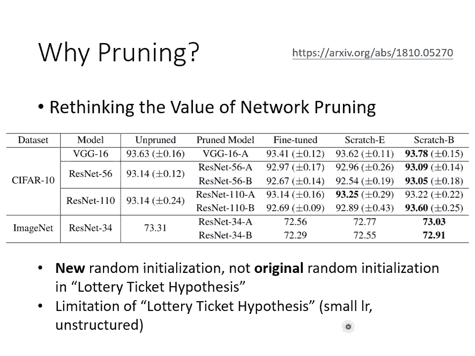

# 【国语+资料下载】李宏毅 HYLEE ｜ 机器学习(深度学习)(2021最新·完整版) - P36：L21.1- 神经网络压缩1：神经网络剪枝与大乐透假说 - ShowMeAI - BV1fM4y137M4

好，那这堂课呢要跟大家讲的是nval compression。那在这个课堂上啊，我们已经看过了很多硕大无捧的模型。举例来说，birt或者是GPT。

那在这在这一节课里面，我们要跟大家分享的事情是我们能不能够把这些硕大无朋的模型把它缩小。我们能不能够简化这些模型，让它有比较少量的参数，但是跟原来的效能，其实是差不多的呢？

这就是nval compression想要做的事情。那为什么我们会在意naval compression这件事呢？因为很多时候我们会需要把这些模型用在resource contrain的环境下。

用在资源比较有限的环境下。什么样的环境是资源比较有限的呢？有时候你会需要把这些机器学习的模型，举例来说，跑在智能手表上，举例来说，跑在done上面。

那在这些H deviceice在这些IOT的dice上面。只有比较少的memory，只有比较少的computing的 power。所以我们的模型如果太过巨大，你的手表可能会是跑不动的。

所以我们会需要比较少的模型。那讲到这边，有人就会问说，为什么我们会需要在这些H deviceice上面跑模型呢？我们为什么不把资料传到云端，直接在云端上做运算，再把结果传回到H deviceice。

比如说你的手表就好了呢？为什么一定要在手表上面做运算呢？那一个常见的理由是latency的问题啊，假设你今天呃呃需要把资料传到云端，云端计算完再传回来，那中间就会有一个时间差。那假设你今天的应用。

你今天的H device上面，你今天的H device是自驾车的一个sensor。那也许自驾车的sensor需要做非常及时的回应，你需要把资料传到云端再传回来，那中间的latency太长了。

也许会尝到是不能接受的那接下来有人又会问说，在未来5G的时代会不会latency根本就可以忽略不计呢？那这个时候呢有人会给你另外一个。

我们需要在H deviceice上面做computing的理由这个理由就是privacy。就如果我们今天需要把资料传到云端。那这个云端的这个系统持有者，不就看到我们的资料了吗？也许我在做什么事情。

我不想让云端系统持有者知道啊，所以为了保障隐私，也许在智能手表上直接进行运算在。智能手表上直接进行决策，是一个可以保障饮私的做法。好，那这边呢就跟大家讲一下neval compression的种种理由。

那呃在这份投影片里面呢，会跟大家介绍5个neval compression的技术。那这5个技术啊都是以软体为导向的。我们只是在软体上面对nor进行压缩。那我们都不考虑硬体加速的部分。

当然另外一个支另外一个支线的研究是我们想办法在硬体上加速模型的运算，让H device上面跑深度学习的模型更加有效率。不过这是另外一个研究的面向，我们这边就不讨论任何跟硬体有关系的东西。

我们只讨论跟软体有关系的东西。好，那第一个要跟大家分享的是nval printing这个技术啊，那我们今天讲完nval printing呢，我们就下课。

啊naor printing呢顾名思义就是我们要把naval里面的一些参数把它减掉。printing就是修剪的意思。我们把naval里面的一些参数把它减掉。

为什么我们可以把naval里面的一些参数减掉呢？因为你知道俗话说的好，树大必有枯之。一个这么大的naval里面有很多很多的参数，那每一个参数不一定都有在做事啊，参数这么多的时候。

也许很多参数它就只是在划水，它是打酱油的，它什么事也没有做。那这些没有做的参数放在那边就只是占空间而已，浪费运算资源而已，何不就把它们减掉呢。好。

所以naval planning的基本概念就是把一个大的nal其中没有用的那些参数，把它找出来，把它扔掉。那我小时候啊在这呃在也不算小时候，好高中的时候在生物学课本上看过这个图，唉。

这个跟nval planning好像也有一点关系啊。这个图是告诉我们说，哎，人刚出生的时候，脑袋是空空的啊，这些图呢这些是脑的神经元啊，脑袋空空的，神经元跟神经元间没什么连接。

在6岁的时候会长出非常多的连接。但是随着年龄渐长，有一些连接就慢慢消失了啊，这个跟我们等一下要做的nval planning有异曲同工之妙。

那其实naval planninging这件事啊不是太新的概念。早在这个90年代啊，央拉克呢就有一篇paper是讲naval planninging的那篇paper的抬头是optial的bra damage。

哦，他把bra，他把这个naval planninging把减掉一些 weight看成是一种脑损伤andbra damage。那optial的意思就是我们要找出最好的pruning的方法。

让一些weight被剪掉之后，但是对这个脑的损伤是最小的。好，那nval planning的概念大概是怎么样进行的呢？它的framemework大概是这样子的。首先呢你先train一个最大的naval。

你 train一个大的naval。然后接下来呢你去量这个大的nal里面，每一个参数，或者是每一个ne的重要性，去评估一下有没有哪些参数它是没在做事的。

或有没有哪些newural它是没在做事的怎么评估某一个参数有没有在做事呢？怎么评估某一个参数重不重要呢？最简单的方法也许就是哎看它的绝对值。如果这个参数的绝对值越大。

那它可能越越能越对对对整个的影响越大啊，或如果它的绝绝对值越接近零。那也许对整个nal的影响越小，也许对我们任务的影响越小。或者是啊其实你也可以套用lifelong learning那边的想法。哎。

你记得在life learning里面，我们不是也要看说哪一些参数比较重要吗？我们不是有一大堆的方法看哪些参数重要哪些参数不重要，然后决定BI那个谓的值吗？也许我们也可以就把每一个参数BI算出来。

那我们就可以知道那个参数重不重要，然后把不重要。的参数减掉。好，那也可以评估每一个神经元的重要性。我们也可以把神经元当做修剪的单位。那怎么看一个神经元重不重要呢？啊。

你就可以比如说计算这个神经元输出不为零的次数等等。那总之有非常多的方法来判断一个参数和一个神经元是否重要。那我们在这边呢就不细讲。好，那把不重要的神经元呢就或者不重要的参数呢就减掉啊。

就把它从模型里面移除，那你就得到一个比较小小的nave。但是你做完这个修剪以后啊，通常你的正确率，你的模型的效能就会掉一点。因为有一些参数被拿掉了嘛，所以这个nal当然是受到一些损伤。

所以正确率就掉一点。但是我们会想办法让这个正确率再回升一点，怎么让正确率再回升一点呢？就是把这个比较小的naval啊，把剩余没有被减掉的参数啊，再重新做微调。你就把你的训练资料拿出来。

把这个比较小的naval呢再重新训练一下。然后训练完之后啊，其实你还可以重新再去评估一次每一个参数的正确性，你还可以再remove掉，再减掉更多的参数，然后再重新进行回调。那这个步骤呢可以反复进行多次。

那为什么我们不一次减掉大量的参数呢？因为在实验上发现说，如果你一次减掉大量的参数，可能对你的nal的伤害太大了，可能会大到你用fin tune也没有办法复原。所以一次先减掉一点参数。

比如说呃只减掉10per的参数，然后再重新训练，然后再重新减掉10per的参数，再重新训练，反复这个过程你可以减掉比较多的参数。那当你的nave够小以后，那整个过程就完成了，你就得到一个比较小的nal。

而且这个比较小的nal，也许它的正确率跟大的nave是没有太大的差别的。那我们刚才讲到说修剪的单位可以以参数为单位，也可以以神经元来担当做单位。那用这两者当做单位有什么不同呢？

用这两者当做单位在实座上会是有蛮显著的差距的。如果我们现在是以参数当做单位会发生什么事，假设我们是要评估说某一个参数要不要被去掉某一个参数对整个任务而言重不重要，能不能够被去掉。

那我们把这个不重要的参数去掉以后，我们得到的naval，它的形状可能会是不规则的。所谓不规则的意思是说，举例来说，我们来看红色的这个 neuralral，它连到接下来三个绿色的newral。

那第二个红色的 neuralral，它只连到两个绿色的 neuralral，或这个红色的 neural，它的输入只有两个蓝色的 neuralral，而这个红色的 neuralral，它的输入。

四个蓝色的 neuralral。如果你是把参数当做单位来进行修剪的话，那你修剪完以后的naval，它的形状会是不规则的。形状不规则会造成什么样的问题呢？最大的问题就是你不好实做啊。

你想想看你用tor要实做这种形状不规则的naval，你好实做吗？你不好。因为在里面，你在定一个的时候，你的定义方法都是每一层有几个newer，对不对？

你都是定义说我现在每一层要输入几个输入几输入有几个newer输出了几个new或者输入多长的输出多长的这种形状不固定的你根本就不好写啊，你自己实做的时候，你根本就不好实做。

而且就算你硬是把这种形状不规则的nave把它实做出来，你用GPU加速也不好加速啊，GPU在加速的时候，就是把的运算看成一个矩阵的乘法。但是当na是不规则的时候，你就不容易用矩阵的乘法来进行加速。

你不容易用GPU来进行加速。那所以实际上啊在做的时候，在实作上你可能会把那些掉的直接补零。就是碰掉的它不是不存在它的值呢只是设为0那这样的好处就是你的实作。比较容易，你就比较容易用GPU加速。

那这样的问题是什么呢？这样的问题是你根本就没有真的把na变小啊。你这边说这个nal它的这个这个link这个位它的值是里你还是存了这个参数啊，你还是存了一个参数在你memory里面呢。

并没有真的把变小你只是在想象中把它变小在自嗨你觉得这个naval变小。但实际上这个naval并没有真的变小哦，所以这个是以参数为单位来做ping的时候，你在实作上会遇到的问题。

这个文献上的实验呢就是想要跟你展示说你参数为单位做ping的时候，你会遇到什么样的问题。我们先来看紫色的这一条线紫色的这条线呢它说是ity这个ity是什么意思这个ity就是有多少百分比的参数现在被掉了。

那你发现说这边呢这个紫色的这条线它的值都很接近一什么意思？代表有接近大概95per以上的参数都被碰掉了。这个nwork printing的方法，其实个非常有效率的方法。

往往你可以碰到95per以上的参数。那但是你的 accuracy只掉一两趴而已。哦，所以这边参数碰的是碰的非常凶的，有95的参数都被丢掉了。照理说丢掉了95per的参数只剩下5per的参数。

这个na变得很小，它的运算要很快吧，但实际上你发现根本就没有加速多少，甚至可以说根本就没有加速。如果你看这些长条图，这些长条图显示的是在三种不同的computing的re上面，你peed up的程度。

你加速的程度那加速的程度要大过一才有加速嘛，加速程度小于一其实是变慢的，结果你发现说在多数情况下根本就没有加速，多数情况下其实都是变慢。也就是你把一些位碰掉，结果你的内work形状变得不规则。

然后你真的用GPU加速的时候，你反而没有办法真的加速它。所以微不见得是一个特别有效的方法。那neny以以神经元为单位来做pny，也许是一个比较有效的方法。如果我们用神经维做单位来pny。

丢掉一些神经元以后，你naval的架构仍然是规则的。简单来说就是你用to比较好实做了。你实做的时候，你只要改那个每个 layer input output的那个dimen就好了。所以你比较好实做。

也比较好用GPU来加速啊。这个是在naval实做上可能会遇到的问题。好，我们来看一下大家有没有问题要问。哦，有我看一下减脂还哦，有同学问说这个减脂应该是减掉的减还是减少的减？哎。

在我认知里面是减掉的减了。但是如果我有说错，你再纠正我。那个有同学问说，请问CNN中做完pny减掉遮罩中一些参数，它的运算量是不是没变？唉，不好意思，我没有非常懂这个问题。哎，遮罩的参数是什么。

我我这边没有非常了解，也许你可以重新再 formula一下你的问题。那我等一下再来看。而有同学问说这个ping有没有效率是韩式库的问题。对了，是韩式库的问题。

那如果你可以想办法写一个irregular的 network也很有效的方也很有效的韩式库的话，那你就可以用way。但是问题是大家都没有要自己写韩式库啊，你都是py嘛。所以呃你用微ing就没有办法加速。

好，如果反过来想在处理一个任务时，把nave慢慢扩大。可以比直接用大naor有更好的表现吗？有一同学问说，如果我们先圈一个小的nal，再把它慢慢变大，会不会比较好呢？

因为我们刚才讲naval printing的时候，是把大的naval慢慢变小。那如果我们先圈小的nave在慢慢变大，会不会比较好呢？答案是不会，我们在下一页投影片就会回答你的问题。

然后同学说可变nal本来就比较难做。对啊，可变nal本来就比较难做。好。好，那接下来啊我们就要问一个问题，唉，你说我们先穿一个大的nal，再把它变小，而且说小的nave跟大的nal。

他们的正确率没有差太多。那我们怎么不直接劝一个小的naor就好了呢？吹一个小的，直接吹一个小的nave比较有效率吧，还劝大的nave变小干嘛？根本是舍本逐末，为什么不直接劝小的navo。好。

那一个普遍的答案是呃大的naval比较好劝。你会发现说如果你直接train一个小的naval，你往往没有办法得到跟大的naval一样的正确率。你可以先圈一个大的naval，再把它变小。

没有正确率没有掉太多，但直接去那个小的naval，你得不到跟ping大的naval碰完变的小的那个naval一样的正确率。那至于大的nave为什么比较好劝，那也可以参看以下这个影片的连接。

我在过去的课程有试图解释这件事。好，但是为什么大的nwork比较好劝呢？那这边有一个假说叫做大乐透假说。那不过它既然叫做假说，就代表说它不算是完全被实证的一个方，不算是一个被实证的理论。

它是被已经被证明出来的那它就是一个理论嘛，但它现在只是一个假说而已。那这个大乐透假说是怎么解释为什么大的nwork比较容易劝，直接圈一个小的nave，没有办法得到跟大的nave一样的效果。

一定要大的nve put变小才会结果才会好呢？大乐透假说是这样说的。我们知道说训练内ve啊是一个看人品的事情啊，我我们现在大家都做过这么多作业了，我相信你都一定有很多的心酸血泪。

你知道劝内ve就是看人品的，每次训练的结果不一定会一样。你抽到一种好的initial的参数，你就得到好的结果，抽到一种坏的initial参数就会得到坏的结果。那像这种看像就好像说这个乐透呢。

也是一个看人品的东西。但是怎么在乐透这个游戏里面得到比较高的中奖率呢？是不是就是包牌买比较多的彩券就可以增加你的中奖率。所以对一个大的来说也是一样的。大的val可以视为是很多小的subne的组合。

我们可以想成是一个大的naval里面其实包含了很多小的。但我们去训练这个大的na的时候，我们等于是在训练，同时训练很多小的val。那每一个小的不一定可以成功的被训练出来。

所以成功的训练出来是说它不一定可以呃透过 gradient找到一个好的呃solution。我们不一定可以训练出一个好的结果，我们不一定可以让他的lo变低。但是在众多的naval里面。

众多的subne里面只要其中一个人成功就可以一人得。得到鸡犬升天，其中一个sna成功，大的nal它就成功了。而今天一个大的nal里面，如果包含的小的nal越多，那就好像是做去买乐透的时候。

包牌包比较多的彩券，买比较多的彩券一样。彩券越多，中奖的几率就越高。所以一个nal越大，它就越有可能成功的被训练起来。那这个大乐透假说它在实验上是怎么被证实的呢？

它在实验上的证实方式跟nval的 planning非常有关系。所我们就直接看一下，在实证实代在实验上是怎么证实大乐透假说的。好，你现在呢有一个大的nawork，在这个大的nave上面。

一开始的参数是随机初始化的。好，把参数随机初始化以后，得到一组训练完的参数啊，训练完的参数，我们用紫色来表示。接下来你用na pulling的技术，把一些紫色的参数丢掉啊，得到一个比较小的naval。

如果你现在直接把这个小的nal里面的参数再重新随机的去initialize，也就是你重圈一个一样大小的小的nal，哦就是你把这个nal复制一次一样大小，但是参数完全不一样，重新再训练一次。

重新再训练一次，你会发现训练不起来，直接训练这个小的nave训练不起来，训练一个大的，再把它变小没问题，但是直接训练小的训练不起来。但是假设这一个小的nave，我们在重新initialize参数的时候。

我们用的跟这组红色的参数是一模一样的。就训练的起来。哎，大家可以了解这两者的差别吗？就是这两组参数，虽然都是rdom initialized的，但是这组绿色的参数跟这组红色的参数是没有关系的。

而这边这些random initialize的参数是直接从这边的红色参数里面选出对应的参数，哦，就是这边有四个参数，我们就是把这边对应到的这四个参数直接把它复制过来，这边有四个参数。

我们就把这里面对应到的4个参数直接复制过来，把这里面的参数直接复制过来，就训练的起来。那如果用大乐透假说来解释的话，就是这里面有很多sub network。

而这一组 initialitialize的参数，就是幸运的那一组可以券得起来的sub network。所以当我们今天用把这些呢把这个大的na券完再碰掉的时候，你留下来的就是幸运的那些参数。

可以训练的起来的那些参数。所以这一组初始化的参数，它是可以训练的起来的一个sub network。但是如果你再重新随机初始化的话，那你如果运气比较不好，你就抽不到可以成功训练起来的参数。好。

所以这个就是大乐透假说。那大乐透假说非常的知名了，他在IQ2019应该是2019没错，得到best award所以它是一个非常知名的一个假说。那后面有很多后续的研究。

比如说有一篇有趣的研究叫做decon结构这个大乐透。那这个结构大乐透里面有什么有趣的结论呢，我们就直接讲它的结论，第一个他试了不同的pruning的 strategy。

然后发现说呢某两个pruning的 strategy是最有效的啊，在这个细节我们就不讲他做了一个非常完整的实验告诉你说pruning有哪些可能的 strategy，然后他发现说呢如果训练前跟训练后。

它的绝对值差距越大那p掉那些得到的结果是越有效的。那另外一个比较有趣的结果是，到底我们今天这一组好的initialization是好在哪里呢？他发现说啊，如果我们我我们只要不改变参数的正负号。

就可以训练起来，就小的nawork只要不改变正负号就可以训练起来。什么意思呢？就是假设你铺完以后，剩下的这个数，假设你呃碰完以后，那你再把原来redon initialitialize那些参数呢拿出来。

它的值是这个样子，0。93。1-9。18。5。你可以完全不管它的数值直接把正的数值大于零的，通通都用正阿尔法来取代，小于零的都用负阿尔法来取代。用这组参数去initialize你的model。

这样也劝得起来会跟用这组参数去initialize差不多。所以这个实验告诉我们说正负号是呃初始化参数能不能够训练起来的。关键它的绝对值不重要，正负号才重要。然后他在那个文章的呃那个负标题上。

还在章节的标题上啊，特别取了一个就是他就你乍看之下会以为他想要讲。significance of initial ways。但他故意在这个SIGN后面加了一个dash，告诉你说是sific。

就是这个符正负号是很重要的。他想要玩个一语双关，不过好像没什么人注意到就是。然后最后一个神奇的发现是呃他发现说他就既然我们在想说一个大的nal里面有一些naval，有一些subneval。

它是特别好的初始化的参数。它训练起来会特别的顺利。那会不会一个大的na里面，甚至其实已经有一个s network，它连训练都不用训练，直接拿出来就是一个好的na呢，我们完全不用训练naval。

我们直接把大的naval put一 put就得到一个可以拿来做分类的classifier了，有没有可能是这个样子的呢？就好像米开朗基罗说它是怎么雕出大位象的呢？它不是雕出大位象。

它是把大位象从石头里面释放出来。大卫象原来就是石头里面，原来就在石头里面，它只是把它把多余的地方把它雕把多余的地方把它去掉而已。那会不会在整个大的na里面算参数都是随机的那其中已经有一组参数。

就已经可以做分类了，把多余的东西拿掉，直接就可以得到好的分类。结果的呢。答案是是这样子啊，你可以自己去读一下那个文章，其实可以得到跟supervise其实很接近的正确率那其实我看到这篇文章的时候。

这个结论已经没有让我觉得神奇了。因为这个结构大乐透这篇文章发表的前几个月就有篇文章叫做 neural他是说他弄了一个神奇的这个里面所有的数值要么是随机的要么通通都设一5结果这也可以得到一定程度的结果。

所以看起来就算你的里面参数都是随机的我根本就给他一个cont得到的也有也有可能可以得到好的form以这个结论其实没有让人特别讶抑。

因为几个月之前就已经有用的文章了这边放了这两篇文章就有类似的说法了这边放这两篇文章的连结了这边放了连接是他们最后一个上传到的版本。以你看这个。像最后一次最后一个版本上传的月份的话。

你会觉得呃V s是后出来，然后解构大乐透是先出来。但如果看第一个上传的版本的话，是先有VS，然后才有解构大乐透。所以我是先读到这一篇才读到解构大乐透的。好，但是大乐透假说他一定是对的吗？

不一定有一篇文章呢是打脸大乐透假说啊，这篇文章叫做rethinking the value ofval。而且神奇的是，这篇文章跟大乐透假说是同时出来的，他们同时出现在2019。

所以就是在2019里面有两篇文章他们得到了不太一样的结论。这篇文章说的是什么呢？这篇文章说啊他试了两个data set，还有好几种不同的模型啊，然后呢他说呃这个是没有碰过的val的正确率。

然后他试着去碰了一下val，然后呢再重新去做 tune小的val可以跟大的val得到差不多的正确率。然他说一般人的想象是如果我们直接去劝这个小的val哎正确率会不如大的val碰完以后的结果。

他试了第一次实验叫做schch一的意思就是它的参数是。随机初始化的，大要注意一下它的随机初始化跟大乐透假说里面的随机初始化是不一样。它的随机初始化就是真的是随机初始化。

大乐透假说里面随机初始化是从原来的那一种随机的参数里面去借来那一组随机的参数。我知道这个很拗口，希望你知道我在说什么。而这个呃这个stch这边这个scratch一的意思是说啊。

我们就真的随机初始化参数训练一个小的nal跟这个有碰过的navo，它的大小是一样的。发现唉。嗯，果然差了一点，嗯，跟的多数人的想象好像是一样的。但是接下来他说呃。

如果我们在update的时候多update几个appad会怎样呢？之前的人设定的appac数目，小的nal的ipad的训练数目都跟大的naval一样。但是如果小的l的ipad的数目多设一点会怎样呢？唉。

多设一点就比货以后的结果就好了。所以之前呢觉得大的小的naval训练不起来，要先训训练大的再做。这个会不会就是个il就是个幻觉，这个都市传说，直接训练小的navalipad设多一点。

反正就是训练的起来了，就是这样子了。那其实这篇文章里面呢呃呃这篇文章呢放在那个在I care审查的时候啊，当然就有去问说哎，你这个跟大乐透假说正好是相反的，你有没有什么common。

那其实在这篇文章里面他也有对大乐透假说做出一些回应。他觉得大乐透假说呢是比较有大乐透假说观察到的现象，也许只有在某一些特定的情况下才观察得到。那根据这篇文章的实验是说。

只有在learning rate设比较小的时候，还有unstructure的时候，unstructure的时候，就是我们碰的时候是以wa作为单位来做Pny的时候，才能观察到大乐透假说的现象。

他发现说learning rate调大，他就观察不到大乐透假说的这个现象。好，所以到底大家都会讲说呃，有多正确是真是假，这个还未来尚待更多的研究来证实。

