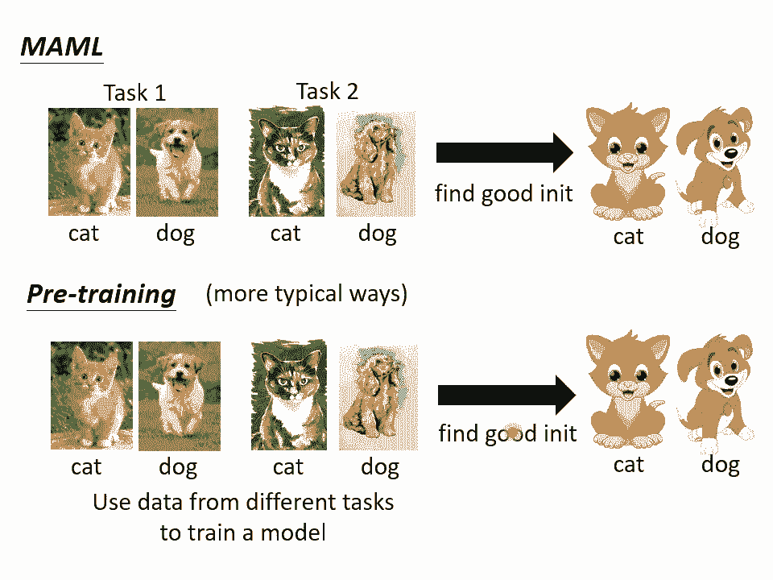
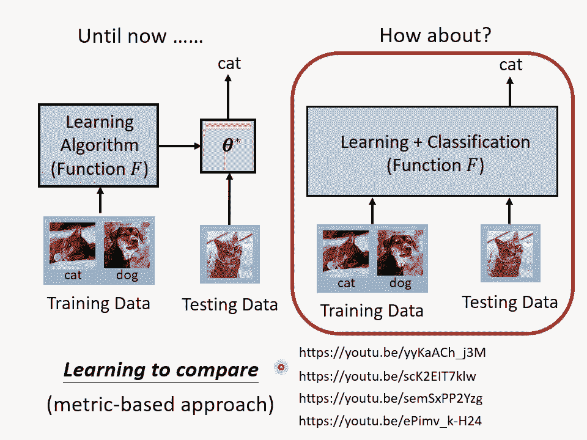
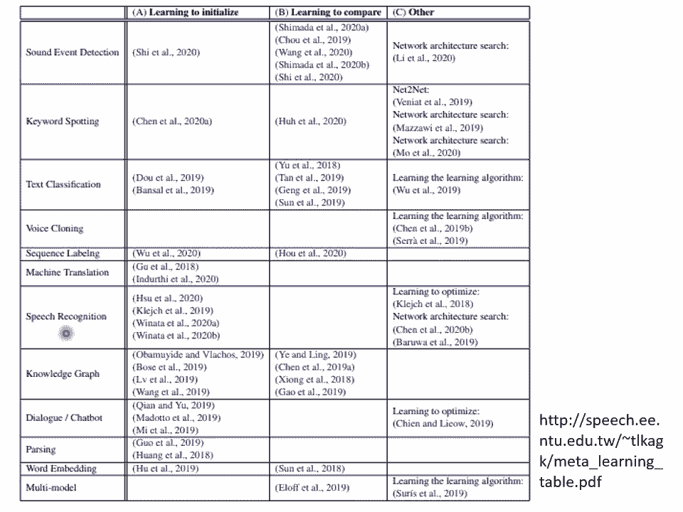

# 【国语+资料下载】李宏毅 HYLEE ｜ 机器学习(深度学习)(2021最新·完整版) - P39：L22.2- 元学习2：万物皆可Meta - ShowMeAI - BV1fM4y137M4

好，那我们已经讲完了meta learning的基本概念。那接下来就是举一些实例，告诉你说，在 metata learning里面什么东西是可以被学的。好。

那我们一般最常用的learning的 algorithm呢，其实今天就是gradient。你照说在 gradientdian decent里面，我们就是要有一个na的架构。然后呢你初始化一下你的参数。

我们把这个初始化的参数叫做se达0。然后呢你要有一些训练资料，那你通是从训练资料里面simle一个 batchch出来，对不对？我们第一堂课就跟大家讲过bechsle batchch出来。

计算 gradientdian，然后用这个gradian呢来upate你的参数，最终se达零变成se达，然后再重新计算一次 gradientdient，在update参数，然后就反复这样下去。

直到次数够多，你满意为止，那就把最终训练的结果，最终得到的参数，把它输出出来。好，那在这整个过程中，哪些东西是可以券的呢？首先，initialize的参数是可以券的啊，所以C达0是可以券的。怎么说呢？

一般我们C达0呢，你就是。random initialize的嘛，从某一个固定的ditribution里面sple出来的嘛。但是你也知道说谢塔林对结果往往有一定程度的影响。好的初始化参数。

不好的初始化参数可以天差地远。那我们能不能够透过一些训练的任务来找出一个对训练就是特别有帮助的init的参数呢可以这个方法就是对在我觉得在meta learning这一系列work里面。

可能大家最耳熟能详的model agnostic metata learning。它的缩写呢叫memo。那它的发音呢就跟哺乳类动物有点像哦。那有另外一个这个memo的变形呢，就叫做reptile。

那我觉得不知道是不是故意的哈，把这个名字呢取成reptileretile呢就是爬虫类的意思。那这些方法的细节，那因为时间有限的关系，所以我们今天就都不细讲。

我只是把一些reference列在这个投影片上给大家参考。但是在作业里面这个我们会问很多跟meta learning跟memo有关的问题，所以假设你想知道更多有关memo的细节。

你在作业里面可以学到跟更多跟memo有关的事情。好，所以有一系列的方法，它就是learning to initialize他去 learn这些initialize的参数，其中最有代表性的就是memo。

好，但是就像我们刚才讲说做 meta learning的时候，你也有hyperpar是你需要调的啊，所以做memo的时候，虽然你要去 learn一个initialized parameter。

但是 learn这个inize parameter的过程中也是有很多par，你需要自己决定的所实际上最原版的memo并没有非常好而有一篇paper呢叫做how to train yourmo啊。

这也是一个梗这个卡通叫how to有一个动画叫how to train your dragonagon嘛。

它就把dragon改成memo所以这篇paper的 title叫how to train yourmo，它就说它试着的memo三次也用不同的你知道。t initial parameter这件事。

它也需要renancy，你也需要做 gradientientcent。那如果你对这些有困惑的话，在作业里面你可以更详细的知道memo trend面的细节。

那作业那个在在作业里面有这个memo的范例的城市。那你看那些城市以后可能可以让你对memo有更进一步的了解。哦所劝memo也是要调参数的，也是需要re see的。

只要适合三个不同renancy发现就是红色这三条线，有时候劝的起来。有时候串不起来。所以在这篇paper里面他就提出了一个新的方法，叫做memo加加啊，期待说啊memo加加可以做起来。

那有关更多memo加加细节，大家在自己去读好 to train有memo这篇文章。好，那讲到memo啊，讲到找一个好的initialization，有没有让你想到课程的另外一个主题呢？

在课程的另外一个主题讲sale supervise learning的时候，我们是不是也有提到好的 initialitialization这件事情呢，在memo里面我们有一堆训练的任务。

但每个任务里面有训练资料跟测试资料了。每一堆训练的任务，根据这些训练的任务找出一个好的initialization，然后呢用在测试的任务上。好，那但是在saleupvise learning里面。

我们是怎么做的呢？在sale supervise learning里面，我们就是有一大堆的没有标记的资料。那这些没有标记的资料，我们可以用一些proed task去训练它。

比如说在berrt里面就是用填空题来训练你的模型。那其实在影像上也可以做sale supervis learning，你也可以说把影像的其中一块盖起来，叫机器必须预测被盖起来的一块。

但今天在做影像的s supervisorvise learning的时候，可能这个ming的这种方法填空的方法不是最常用的。今天比较流行，用另外一个系列。

我们在课这个课程里面没有介绍的contraive learning的方法那这个有兴趣，大家再自己去研究。那总之讲到好的 initialitialization这件事啊。

是不是让你想到supvised learning呢？在supvised learning里面，我们会先拿一大堆的资料去做training那pre的结果我们也说它是好的 initialitialization那把这些好的 initialitialization一样可以用在测试的任务上。

那这两者有什么不同呢？当然如果我们直接比较memo跟今日的supvised learning的话，那至少最明显的不同是啊memo呢这些任务是有用到标注资料的呃在supvis learning里面我们是没有用到标注资料的。

所以pretraining这一招supvised learning这一招虽然会好，但是你不知道为什么会好。我们其实今天并没有非常清楚说为什么这些pro的任务对t会有帮助。而对memo而言。

它会好是不是理所当然的我们在这些训练任务上找出一组好的 initialitizer参。在这这些训练任务上也都有好的结果，也许他就可以transfer到testing的任务上。但是如果你回到几年前。

在还没有sale supervis learning这个词汇的时候，你的sale supervise learning呢，它会这个词汇会爆红起来。也是央老在2019年4月的时候说的。

我记得是好像是4月330号之的那其实在我的那个youtube频道上第一次讲memo的时候，其实是4月30号之前的那个时候我们都还不太清楚sale supervis learning这个词汇。

那sale supervisorvis learning这个词汇，当然在央讲说这个sale supervise learning很厉害之前，其实也有人用过这个词汇了。

只是之前如果你随便发明这些怪怪词汇的话，你可能就被别人抨极嘛。不过大声讲说有一个技术叫saleupvise learning那就有了sale supervise learning。好。

总之过去啊在sale supervise learning这个系列还不红的时候，那个时候pretraining有另外一种想法，比较常见的做法是你一样有好几个任务的资料。

你把这些好几个任务的资料通通都倒在一起，把它当做一个任务进行训练。然后接下来呢你一样可以找一组好的initialization，一样可以把它用在测试的任务上。那像这样子把好多的任务的资料通通倒在一起。

当做一个任务来训练的做法，这个叫做mot training。那其实一边今天一般你在做memo的研究的时候。

那通常会把这种motask training方法来当做meta learning的 baselineaseline。

为什么会把这样的motask learning当做memo的 baselineline呢？因为仔细想想，你会发现说这两个方法，他们用的资料都是一样的。一边只是我们会把不同的task分开。

另外一边把所有的task资料倒在一起。

那这两种方法有什么样的差别呢？好，假设你想要知道更多meta learningmemo跟pretraining的差别的话啊，你可以看一下这个影片。

然后在这个影片特别我今天特别要强调这个影片上去这样请大家务必要看，是因为这个影片里面它是有防不胜防的夜配的了。那我现在要特别夜配这个影片，这个就是夜配的夜配，就是meta夜配。好那在这一页投影片呢。

你会发现说我们这边的训练的任务跟测试的任务差距并没有很大。在刚才的举例里面，我都说训练的任务是分类呃呃这个呃苹果跟橘子分类类车子跟脚踏车。但是在今天这个例子，在这页投影片的例子上啊。

我特别说我特别举了一个例子是说，哎每一个训练的任务都是要分类猫跟狗，只是现在每一个任务里面的图片，它的类型是不一样的。在任务一里面啊是真实的图片啊，在任务二里面呢是这个呃油画的图片啊。

在任务三里面是卡在测试任务里面是卡通的图片。那你可不会说这个不就是doment adaptation吗？我们在某些任务上面学到的东西。

在某一些某一些 domain面上学到的东西要被trans到另外一个doment没错，它就是你也可以说它就是doment。所以假设我们今天在做 meta learning的时候，我们的不同的任务。

其实就只是不同的doment而已。那那你也可以说ma learning就是一种doment adaptation的方法。

那就那那当当然有人可能那其实在machine learning里面的这个task呢跟doment的定义，他们的分也并没有那么明确。我可以说这个是不同的doment，但我也可以说他们就是不同的任务。

其实都是可以的所以假设你今天不同的任务，其实就是不同的doment上的同样的分类问题的话，你也可以说ma learning是一种解doment的方法。好。

总之呢我觉得在mine learning这个领域里面呢。有千千万万的词汇不断的被新词汇不断的被发明出来。所我觉得大家在研读这些文献的时候，其实也不用太拘泥于这些词汇。

你要真正要在意的是这些词汇背后所代表的含义是什么？好，那memo到底为什么会好呢？有两个不同的假设，有一个假设是memo找出来的那个initial的参数，它是一个很厉害的initial的参数。

这个很厉害的 initialit的参数，它可以让我们的比如说 gradient这种 learningning的 algorithm快速的找到每一个任务上好的参数。

那另外一个假设是说这个initialize参数，它本来就跟每一个任务上最终好的结果已经非常接近了。那所以因为它已经跟好的结果非常接近。所以你直接apply gradient就可以轻易的找到好的结果。

到底是哪一个呢？有一篇paper呢，它里面提出来的一个方法叫做这个呃有一篇paper呢，它的抬头是rapd learningfeuse，左边这个叫做d learning。

右边这个叫做feature reuse。那到底memo它的好是好在左边这个理由还是右边这个理由呢？那你可以自己去看一下paper。

发现说呃在paper里面得到的结论是feature reuse才是memo好的关键。那在这一篇paper里面呢，同时提出来了另外一种memo的变形叫做anil。

那在我们的作业里面也会问大家一些跟anil相关的问题。anil是almost no inner loop的缩写。almost no inner loop啊，缩写是an。好的，me有非常多的变形了。

假设你想要知道更多背后的数学的细节的话，你可以参考这支影片。那假那memo有一个可以简大幅简化运算的变形，叫做first order memoFmemo大可以看这支影片啊。

如果你想知道什么是retile的话，你可以看这支影片。那我们上课就不再讲。我们把这些呃内容留在这个作业的选择题里面，让大家慢慢来学习。而，刚才讲说我们可以学习初始化的参数，那还有什么东西是可以学习的呢？

我们可以学optimizer。你知道在update参数的时候啊，我们需要决定比如说lening rate啊，moment啊等等参数等等hyperparameter。

而像learning rate这种 hyperperparameter能不能够用学习的方法把它用 metata learningning学习出来呢，是可以的。那像这样子的想法。

在很早以前就有了s2016就有篇paper，它的tle叫learning to learn by gradientdes by gradient de。然后这个不是tpo啊。

它的名字真的就叫做learning to learn by gradient de by gradient de，这个大家都是命名大师啊，大家都很会取这个有梗的title。而在这边里面呢。

他就直接认了那个im一般我们的im什么ed是人想出来的。它的optimizer它里面的参数是自动根据训练的任务学出来的那他那边他把他的方法呢就直接叫做LSTN。

因为他把训训练那个呃呃这个im里面的这些参数这件事情把它类比到训练1个LTN上。但我们这堂课里面没有讲过LSN嘛，所以你不知道LTN是什么没关系，反正这个就是出来的im。

那他做的第一组实验呢是训练在anlist上，然后直接测试在anlist上了。那所以得到的结果呢当然是挺不错的。橙色这一个呢是认出来的optim，其他颜色的这个curve呢是其他的方法。好。

但是如果我们是训练在list上测试在list上，而且naval架构一样，这根本就是7体嘛，这样代表你的训练任务跟测试任务根本就是一模一样嘛，这样没有什么特别厉害。

但是早在2016年这篇文章就已经知道说训练任务跟测试任务应该要不一样。试试看。所以他就试了说他的训练任务是一层的naval40个unit，然后呢，哎结果不错，那测试任务呢测试任务改成两层。

看看到底能不能够做得起来。训练任务是一层的naval了，他测试的时候测试在两层的naval上可不可以做得起来可以。但他发现说呢改一下那个activation function就不work了。

训练的时候如果没记错的话，应该是用signma。但是测试的时候，nawork架构里面改成re路。哇，这个能认出来的opimizer就坏掉了。哦，伯paper当时就已经有训练任务跟测试任务的概念了。

只是他的训练任务其实只有一个而已。好，刚才讲了，我们可以训练初始化的参数，可以训练optimizer。那能不能够训练naval架构呢？当然可以训练naval架构。那在训练naval架构这系列的研究呢。

就叫做nval其实就是鼎鼎大名的naval architecture search其实就是NAS。我其实我知道很多同学应该都听过nval architecture这个 searcharch。

这个技术只是你不太清楚它跟meta learning的关系是什么而已。如果你今天在meta learning里面，你认的就是nval的架构fi，你把naval的架构当做f译的话，那我们就是在做NAS。

好，但是在NAS里面呢，我们的fin是naval架构，我们要找一个f去minimise l的fin。但既然fi是内架构，显然做微分就有问题了，显然算braient就有问题了。怎么办？

记得我们这门课里面反复强调的，当你遇到optimization的问题没办法算维分的时候，reinforment learning硬做也许是一个solution。好。

怎么用reinforcement learning运作呢？你就把fin呢想成是一个agent的参数。然后这个agent呢这个reinforment learning里面的agent呢。

它的output是什么？它的output就是内 work架构相关的hyperparameter。举例来说，它会output的就是现在第一层你的比如说filter，它的长是多少，它的宽是多少，它的拽多少。

filter的数目是多少等等。今天你的agent它的output就是内 work的架构相关的参数。然后接下来呢你就是要训练你的agent，让他去mimize一个re。那在这边我们的re是什么呢？

我们的reward直接设成L的 find译成一个负号。所以我们训练这个agent去mimize l的 find乘上负号，就等于是minimize l的 find。我们用IL的演算法。

直接去训练这个fin去mimize l的 find。那我们就是做了n architecture的 search。好，那这边是有一个从文献上截下来的图。

希望可以让你更清楚知道说这个typical的NAS是在做什么的啊，就是我们有一个ag卷，那这个是比较早的work了。所以那个时候呢把ag呢想成就是一个recurrent的 network。

那这个recurrent network每次呢会输出一个跟naval架构有关的参数，比如说它会先输出filter的高是多少，然后再输出filter的宽是多少。

然后再输出stride的呃横向的stride是多少，再输出纵向的stride是多少，再输出要多少的filter等等。然后第一层第N层输出完了以后，接下来再输出N加一层，接下来再输出N加二层，以此类推。

好的有了这些参数以后，就根据这些参数建出一个nal建完nal以后就去train这个navaltrain一个train的过程呢，其实就是within task的train。好。

然后接下来呢就去做rement learning。你可能会把这一个nal它在测试资料上面的当做你的re，然后呢来训练你的agent。

那训练这个agent去mimize reward的过程其实就是acros task training。

那我知道说在naval architecture search文献上其实不常提到什么within test training跟acros test training这样子的讲法了。

但是其实你想想看naval architecture search，它可以视为是 metata learning的其中的技术。

只是我们现在要 learned的是集中在只是我们现在学习的目标是naval architecture。那我知道说比较早的naval architecture search那些paper啊。

他们往往训练的任务跟测试的任务就是同一个啊，比如说你训练的时候，你是要训练一个agent，他可以找一个naval这个naval在ci发 ten上做的好。那测试的时候，你也是直接跑在ci发 ten上。

那你的训练任务跟测试任务是同一个嘛，感觉有点体。不过近年来啊有很多naval architecture search的文章都已经进步到都已经呃有所改变。

他们的training的任务跟测试的任务都已经有人尝试过，可以是不一样的了。好，那除了这个reinforcement learning以外啊。

你要用evolutionary的 algorithm也是可以的啊，我们这边就直接列一些文献给大家参考。那其实啊你硬要把naval architecture改一下，让它变得可以为分，也是可以的。

有一个经典的做法呢叫做大词啊，还的缩写就是diefentable architecture search。这个呃它是differential architecture search缩写这个大词呢。

它就是想办法让这个问题变得是可以为分。你就可以直接用 gradientient decent来minise这个L of find。那至于大词的细节就留给大家自己慢慢研究。好。

除了naval architecture以外，还有什么可以 learn的呢？data processing也有可能可以 learn。大家知道说哎，我们在训练nave的时候。

你不是都要做data augment吗？作业3，还让大家自己尝试各种不同的data augment的方法。那当然data augment的方法。

现在你是用tri and error去试出来的那能不能够硬去学data augment这件事呢，能不能够训让我们去训练出怎么自动找data augment呢是可以的那我们就列一些paper在这边给大家参考。

好，那我们知道说现在ing的时候啊，有时候你会需要给不同的simle不同的weight，但是要怎么给每一笔data不同的权重呢？这边就有不同的策略。

那有的人的策略是说唉如果有一些 example距离bound特别，它是特别难的ex也许就要给他比较的wa像lal比较fo在看这些比较难的example学习，希望它可以学的比较好。

但是你也会看到文献有相反的结论说哎这个比较noisy的这些label应该给它比较小的weight啊，这些ex如果它比较接近boundary可能代表它比较noisy，代表它比较困难，它的难可能是不合理的。

因为代表它label不好根本就标错了，也许你应该给它比较小的weight，那怎么决定这个simle weight的 strategy呢？你可以用把simle weight strategy直接认出来。

然后让我们呢根让我们逊可以学到说哎根据da的特性自动决定说s。的 weight要怎么设计？到目前为止啊，我们看到的这些方法都是基于gradientdescent再去做改进。哦。

我们刚才看到的所有方法都是认了gradientdescent的其中一个component。但是我们有没有可能完全舍弃掉 gradientdientdescent呢？

我们有没有可能直接 learn个naval这个naval的参数就是fine这个naval直接是训练资料作为输入，直接输出训练好的结果。如果真的有这样一个naval，它可以吃训练资料作为输入。

输出训练好的naval的参数。那我们就可以说我们甚至让机器发明了新的learning algorithm。我们已经抛弃了 gradientdescent机器发明新的learning algorithm。

有没有可能做到这件事呢？也不是完全没有可能的，已经有一些论文往这个方向进站。而到目前为止啊，我们还是把训练跟测试分成两个阶段。我们的learning我们有一个learning algorithm。

它是拿训练资料进行训练，然后输出训练好的结果，然后把训练好的结果用在测试资料上哎，有没有可能更进一步直接把整个epode，也就是一次训练加一次测试，把整个ep包在一个n里面呢，这个是有可能的。

有一个系列的做法，他就是直接把训练资料跟测试资料当做n的 input never读完训练资料以后，你也不知道里面发生了什么事，也许他就是学出了一个learning algorithm。

也许他就找出一组参数，不知道不知道它发生了什么事。他读完训练资料以后，再给他测试资料，它直接输出这些测试资料的答案。也就是我们不再有训练跟测试的分界一个epode里面不再分训练跟测试。

直接用个nal把训练跟测试这件事情一次搞定。有没有可能做这样的事呢？其实这样的方法今日并不罕见。有一个系列的maha learningning的方法叫做learning to compare。

它又叫做mey base的方法。这一系列的做法就可以看作是训练跟测试，没有分界。一个naever直接把训练资料，测试资料都读进去，呃，直接输出测试资料的结果。

那如果你想学更多跟learning to compare有关的东西的话，那其实在过去的上课有讲过mery base的 approachach。那这边就把过去上课的录影贴在这边给大家参考。

好，最后啊也许你会很好奇说meta learning这样的技术真的有应用吗？它真的有被用在任何地方吗？meta learning learnar to learn直接扔一个 algorithmer。

听起来非常的科幻，它真的有实际的应用吗？

今天你在做meta learning的时候啊，你最常拿来测试 metata learning技术的任务叫做fu shot的 imageage classification。

在fu short的 image classification里面，你每一个任务都只有几张图片哦，你每一个类别，每一个class都只有几张图片啊，比如说你现在分类的任务是有三个class。

进来一张immage，你要把它分成三个类别，每一个类别你都只有两张图片，每个类别你都只有两张图片，你希望透过这样一点点的资料就可以训练出一个模型给他一张新的图片，他可以知道这一张图片属于哪一个类别。

那在做这种fu short classification的时候啊，最常见的一种class的呃，你常常会看到一个名词叫做N位K下的class。那N位K下的 classification是什么意思呢？

N位K下的 classification它的意思就是在每一个任务里面，我们有N个class，而每一个class我们只有K个 example。举例来说，在上面这个例子里面，我们有三个class。

每一个class只有两个 example。那它就是re位 two shot的class。好，那在 metata learning里面呢，如果我们今天要教machine能够做N位K下的class。

那意味着说我们需要准备很多的N位K下的 classification的 task当做训练的任务，这 machineine才能够学到N位K下的learning algorithm。

那要怎么去找一堆N位K下的任务呢？要怎么去找一堆N位K下的全年的task呢？那在文献上啊，最常见的一种做法是使用尼这个cos当做bechus。你知道这个尼是这就好像说你今天在做生物实验的时候。

你都用果来做生物实验嘛。那在 meta learning里面，如果你想要做快速做相关实验的话，最常做的选择就是使用尼在尼这个cops里面呢有1623个不同的charact。

那每一个charact呢有20个example啊，比如说这是某一个charact，它就是勾起来，然后点两点。那像这个charact，它就有20个不同的examp啊，就是找20个人。

每个人呢都去写一遍这个charact，然后把它资料收集起来。所每一个act有20个ex，总共1623个charact。那有这些charact以后呢。

你就可以去制造N位 k下的classification。举例来说，假设你要制造一个twenty way one下的class任务的话，那你要怎么做呢？你就把从那个尼里面呢选出20个charact。

然后每一个charact就只取一个ex，那你就得到一个20位 one下的classification的任务。好像这边这个样子。好，这边呢每一个呃图片就代表某一个charact。

每一个charact这边只有一个ex，而每一个charact在N位K下的任务里面就代表了一个class哦，所以20位 one下的classification的任务。

它的训练资料也就是support就长这个样子。那测试资料呢测试资料就是你从这20个character里面再去欧尼gadata set里面找某一个example出来。然后接下来就问你说，哎。

这一个testing的 example，这一个query set它是这。20个class里面的哪一个好，那这个东西到底是哪一个class呢？这个看起来有点像是豌豆射手了。

其实人呢在做这种fu classification是非常厉害的。所以这种fu classification可以难倒机器，但往往难不倒人，像这个它是属于哪一个class呢？它是属于哪一个charact呢？

我相信你一眼就可以看出它应该是这个charact了。好，那在使用on尼ga的时候呢，你就会把你的那个character啊分成两半，一半呢是拿来制造training task的charact。

另外一半是拿来制造testting task的charact。然后这些training的 character啊。如果你要去制造一个N位K下的任务。

你就是从这些training的 characteract里面先随机simleN个charact。然后这N个charact，每个charact再去sleK个 example，集合起来。

你就得到一个训练的任务。那测试的任务呢，你就从这些测试的charact里面。拿出N个 characteract，然后每个charact sample k个 example。

那你就得到一个N位K下的测试任务，那你就可以训练在训练一堆训练任务上，然后测试在测试任务上。好，那你可能会问说这个N位的任务，做在ononic上面，这个有什么用呢？这个就是没有什么用了。

但是meta learning不是只能用在on上面。我这边呢这个table上面是列举了meta learning在语音，还有自然语言处理上的应用。

那这边的纵轴啊是不同 metata learning的方法，有 learningning to initialize learning to compare。

还有其他类型的 meta learning的方法。比如说n architecture search等等。而横轴啊就是不同的应用。比如说seven detection啊。

keywordpartt classification voiceice conversionsequ label machine translation speech recognition等等。

像这些语音，还有nLP相关的任务，都已经有人尝试在上面使用 meta learning。所以 metata learning不是只能用非常简单的任务。

今天在学界已经开始把me learning推向更复杂的任务。那我们可以拭目以待看看未来me learning这个技术能不能够真的用在现实应用上，它可以走的多远。好。

那这个就是本学期想要跟大家分享的内容了。

