# 【国语+资料下载】李宏毅 HYLEE ｜ 机器学习(深度学习)(2021最新·完整版) - P3：L3- 机器学习任务攻略 - ShowMeAI - BV1fM4y137M4

这样这样看就OK。好，那我们就继续来上课吧。好，那接下来的课程要讲什么样的内容呢？接下来啊要告诉你每一个作业通关的大战略，通关的攻略长什么样子。好，那我们已经看了作业一了。那其实之后好几个作业。

它看起来的样子基本上都是大同小异。就是你会有一堆训练的资料啊，那这些训练资料里面呢会包含了X跟Y的啊，你会有X one跟它对应的Y oneXQ跟它对应的Y two引直到XN还有它对应的YN。

然后测试资料呢测试资料就是你只有X没有Y。那刚才大家已经看了作业一了。其实在之后每几个作业看起来都是非常类似的格式。比如说作业2其际是是做语音辨识，那我们的X呢就是非常小的一段声音讯号。

那其实这个不是真正的完整的云辨视系统啊，它是语音辨视系统的一个阉割版啊，那个X是一小段讯号。那Y呢是要去预测需要去判断说这一小段声音讯号呢，它对应到哪一。风铃，那你不知道风铃是什么，没有关系。

你就把它想成是KK音标就可以了。那作业三呢是要做影像辨视。那这个时候我们的X呢是一张图片。那Y呢是机器要判断说这张图片里面有什么样的东西。那作业四呢是愚者辨视，那余者辨视是要做什么事情呢？

余者辨是要做的事情是呃这个X呢也是一段声音讯号。那Y呢现在不是风nyY呢是现在是哪一个人在说话，那可以想象说这样的系统，现在现在其实非常的有用。如果你打电话去银行的客服，那现在都有自动的余者辨认系统。

那会听说现在打电话进来的人是不是客户本人，那就少了这个客服人员呢？问你呃身份验证的时间。啊，那作业五呢是做那个machinetrans啊，是做机器翻译啊，X呢就是某一个语言。

比如说啊这是我唯一会的一句日文了，哎， come都西这样的啊，那它的Y呢就是另外一句话这样。好，当然，现在你在离婚区里面就可以洗一些诸葛春夫之类的哎。啊，那训练资料呢拿来做什么呢？

训练资料就是要拿来训练我们的model。那训练model的过程。那呃上周已经讲过了啊，训练的过程就是三个步骤啊，第一个步骤，你要先写出一个有未知数的function。

那这个未知数呢以后我们都用se达来代表一个model里面所有的未知参数哦，所以F中X的意思就是说我现在有一个function叫F。但它里面有一些未知的参数，这些未知的参数表示成se达。

那它的input呢叫做X啊这个input呢叫做feature。好，那接下来呢你要定一个东西叫做lolo是一个方。这个lo的输入呢就是一种参数。然后去判断说这组参数是好还是不好。

那接下来你要解一个 optimizationization的pro，你要去找一个se。那这个达呢可以让lo的值越小越好。那可以让的值最小的那个se达，我们就写作se star那有了se达 star以后。

那你就把它拿来用在测试资料上，也就是你把se达 star带入这些未知的参数，本来FC达到X里面有一些未知的参数，现在这个se达呢用se达 star来取代，用se star来取代。

那它的输入呢就是你现在的测试资料，那输出的结果你就把它存起来，然后上传到卡go就结束了。那接下来你就会遇到个问题，那直接执行住掉的simple code。

往往只能够给你过simple baseline的结果而已。如果你想要做的更好，那应该要怎么办呢？以下就是如何让你做的更好的攻略。它适用于前期所有的作业，这个就跟魔关羽一样，你知道吗？

开局就送可以帮助你打赢前期所有的副本。

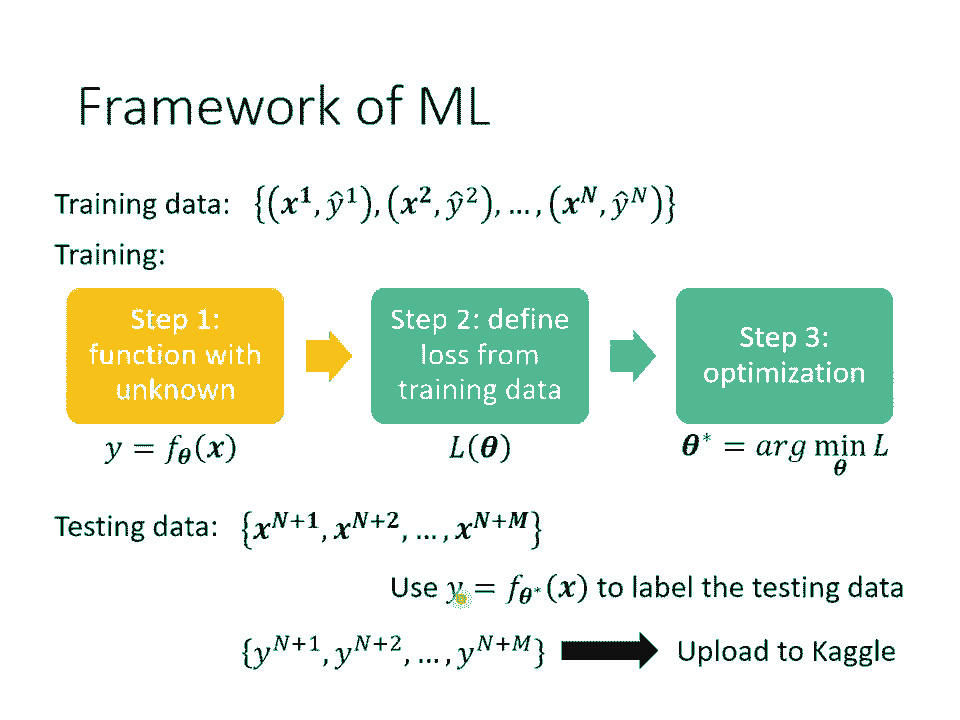

好，那这个攻略是怎么走的呢？从最上面开始走起？第一个是你今天如果你觉得你在cargo上的结果不满意的话，第一件事情你要做的事情是什么？检查你的training data的lo啊。

就有的人说哎我在意的不是应该是testing data的 loss吗？因为cargo上面结果呈现的是testing data的结果啊，但是你要先检查你的training data。

看看你的model在training data上面有没有学起来再去看testing的结果哦，所以你要先检查一下training data的。如果你发现你的training data的lo很大。

显然他在训练资料上面也没有学好。那接下来你就要分析一下，在训练资料上面没有学好是什么样的原因。那这边有两个可能。第一个可能是model的 bias。那model的 bias这件事情呢。

我们在上周已经跟大家讲过了，所谓model bias的意思是说假设你的model太过简单啊，举例来说，我们现在写了一个有未知呃parmeter的 function啊，这个未知的parameter。

我们可以带各种不同的数值，你在se达 one得到一个function，我们把那个function呢用这个一个点来表示达 two得到另外一个 function。你把所有的 function集合起来啊。

得到一个function的 set。但是这个function的 set它太小了，这个方的 set里面没有包含任何一个 function可以让我们的lo变低，可以让lo变低的方不在你的。

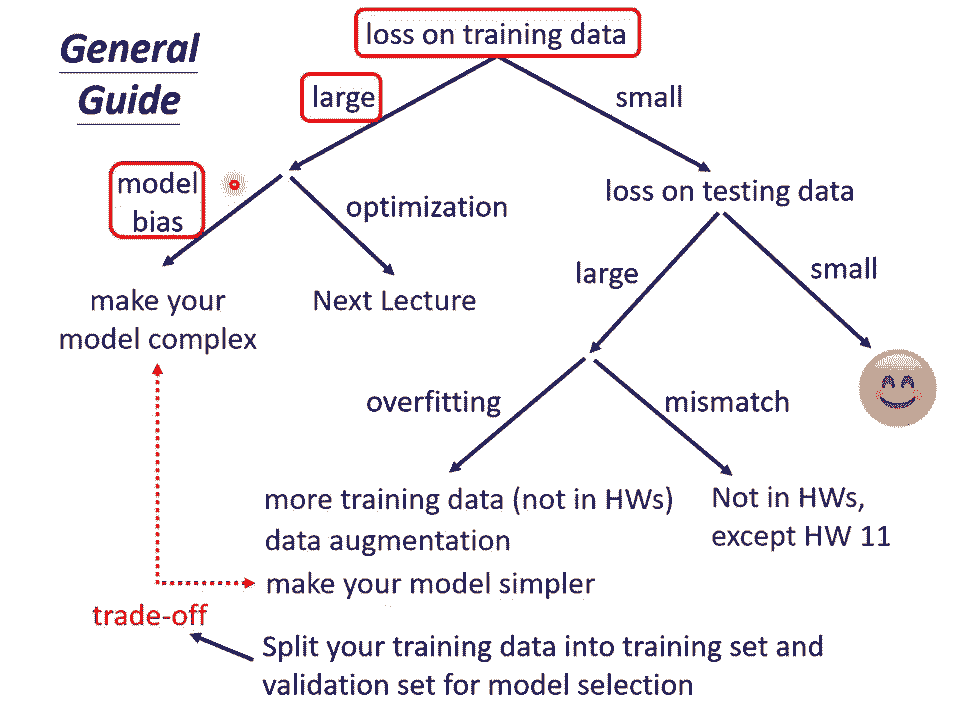

model可以描述的范围内哦，你的model里面有未知的参数，未知参数可以在任何的数值把这些数值带进去以后，你得到了一个function的s，代如不同的数值得到不同的function啊，所有方集合起来。

你得到一个function的 set。但这个set里面没有任何一个function，可以让你的lo变低。那在这个情况下，就算你找出了一个set star。

它是这些蓝色的function里面最好的那一个它是那个蓝色的function里面可以让loose最低的那一个也无惧无济于事啊，这些都是鲁蛇，它只是蛇里面的霸主，就还是一个蛇，那个loose还是不够低。

那这个状况就是哇这个你想要在大海里面捞针，这个针指的是一个lo一的方，结果针呢根本就不在海里，所以白忙一场，你怎么捞都捞不出针。因为针根本就不在你的这个function在里面，不在你的这个大海里面。

所以怎么办？这个时候重新设计你的model，怎么重新设计给你的model更大的弹性啊，我们上周已经示范过，举例来说，你可以增加你输入的feature。

我们上周说本来我们输入的feature只有前一天的资讯，假设我们要预测接下来的这个观看人数的话啊，那我们用前一天的资讯不够多。那用56天前的资讯那model的这个弹性就比较大了。

那你也可以用dep learning增加更多的弹性。所以如果你觉得你的model的弹性不够大。那你可以增加更多feature可以设一个更大的model可以用dep learning来增加model的弹性。

这是第一个可以的解法。但是并不是training的时候，n大就代表一定是model bias，你可能会遇到另外一个问题，这个问题是什么？这个问题是 optimizationtimization。

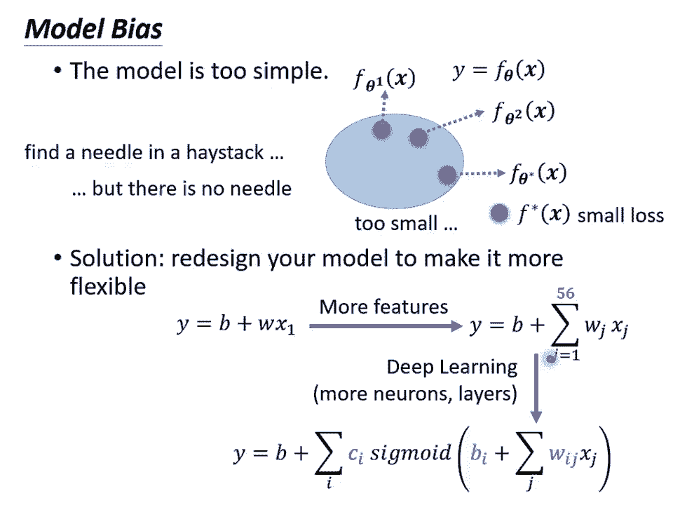

做的不好什么意思呢？哦我们知道说我们今天用的optimization在这门课里面，我们其实都只会用到bradcent这种 optimizationimization的方法。

那这种 optimizationimization的方法有很多的问题举例来说，我们上周也讲过说啊你可能会卡在local mini的地方，你没有办法找到一个真的可以让lo低的参数。

那如果要图具象化的方式来表示的话，就像是这个样子。这个是你的model它可以表示的函式所形成的集合。你可以把se达带入不同的数值形成不同的方，把所有的方通通集合在一起。

得到这个蓝色的 set这个蓝色的 set里面确实包含了一些方。这些方，它的lo是低的。但问题是 gradientient这一个演算法没办法帮我们找出这个lo低的方 gradient说你要我帮你解 optimizationim的 problem。

我给你这个达。

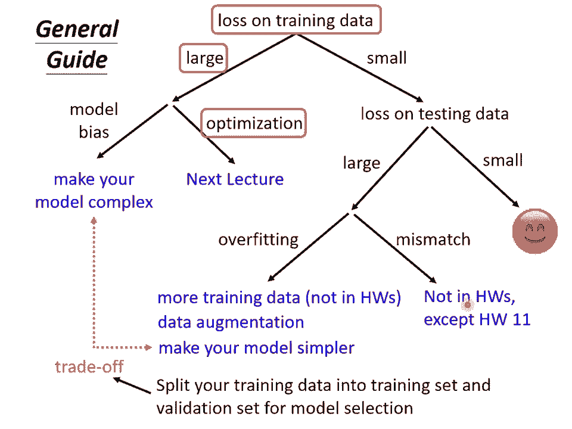

然后就结束了。但这个s塔star它给我们lo不够低。这个model里面存在着某一个方向，它的lo是够低的，但 gradientlliandescent没有给我们这一个function。好。

那这就好像是说啊我们想大海捞针，针确实在海里，但是我们却没有办法把针捞起来。但这边问题就来了。我们今天看到全ing data的lo不够低的时候，到底是model bias。

还是optimization的问题呢？今天我们发现说我们找不到一个lo低的方，到底是因为我们的model的弹性不够？我们的海里面没有帧，还是说我们的model弹性已经够了。

只是optimization gradient不给力，它没办法把帧捞出来，到底是哪一个呢？到底我们的model已经够大了，还是它。

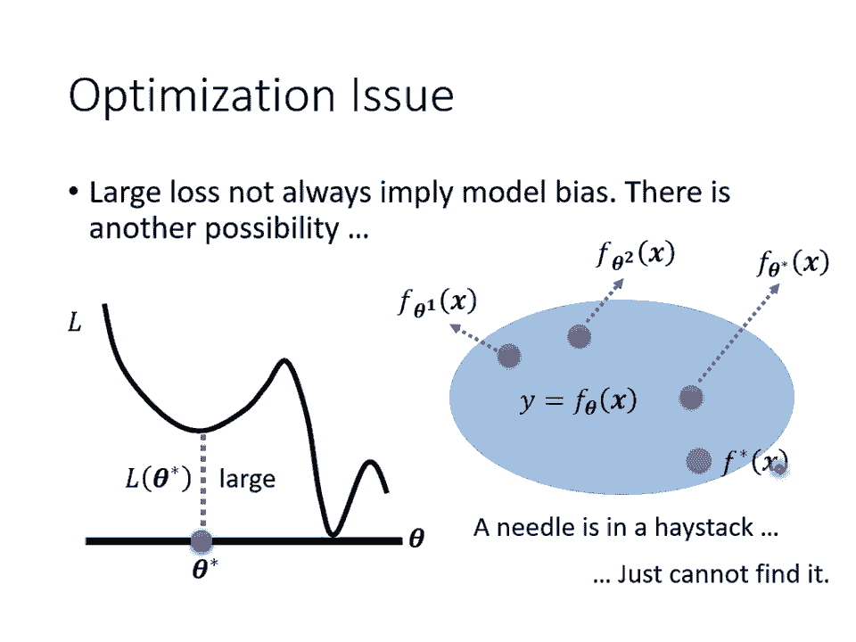

不够大的，怎么判断这件事呢？

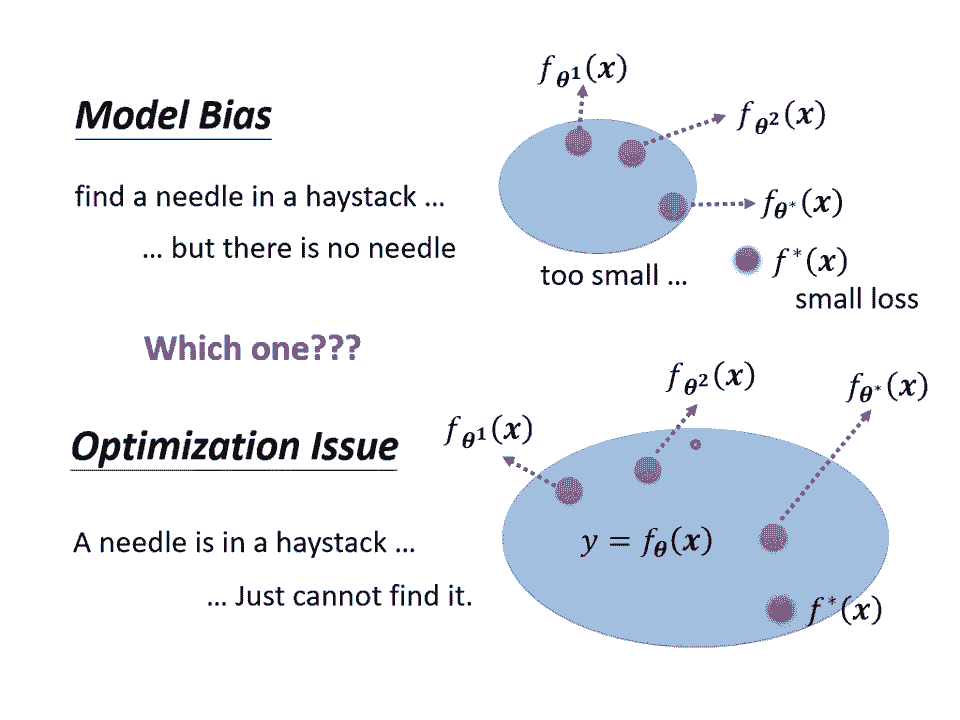

好，那这边一个建议的判断的方法就是你可以透过比较不同的模型来得知说你的model现在到底够不够大。怎么说呢？我们这边举一个例子，那这个实验是从receive your那一篇paper里面截露出来的啊。

我们的paper连接呢放在右上角这边paper的一开头啊就跟你讲了一个故事。他说我想却两个一个呢有20层一个呢有56层那我把他们测试在测试资料上那这个横轴呢是指的是training的过程了。

就是你参数up的过程啊，那随着参数的up当然你的lo呢会越来越低但是结果20层的lo比较低，56层的lo还比高。那这个rece your是比较早期的paper2015年的paper了。

果你现在大学生的话，那个时候你都还是高中生而已啊所以那个时候大家对d learning我觉得了解呢还没有那么透彻。那大家对 learning有各种奇怪的误解。所很多人看到这张图就会说啊这个代表什么？

这个代表告诉。dep learning不 work知道吗？56层太深了，不 work根本就不需要那么深。那那个时候大家也不是每个人都觉得dep learning是好的。

那时候还有很多啊对dep learning的质疑。所以看到这个实验，有人就会说，所以深没有比较好，这个叫做overfiing。但是这个是overfi吗？这个不是overfitting。

等下会告诉你overfi是什么，并不是所有的结果不好都叫做overfitting。你要检查一下训练资料上的结果。你检查训练资料结果发现说现在20层的跟56层的比起来，在训练资料上20层的的其实比较低的。

50层的的是比较高的这代表什么这代表56层的val，它的 optimizationtimization没有做好它的imization不给力。哎想问说哎。

你怎么知道是56层的 optimizationim不给力，搞不好是mod bias啊，搞不好是56层的，它的model的弹性还不够大，要156层才好啊，56层也许弹性还不够大。但是你比较56层跟20层。

20层的ro都已经可以做到这样了，56层的弹性一定比20层更大，对不对？如果今天56层的naval要做到20层的nval可以做到的事情，对他来说是轻而易举的。

他只要前20层的参数跟这个20层的val一样，剩下36层就什么事都不做identity，它比前一层的输出就好，那56层的一定可以做到20层的val可以做到的事情。

所以20层的val都已经可以走到这么低的ro，56层的val它比20层的的弹性还要更大啊，所以没有道理，20层的nwork可以做到的事情，56层的naval做不到啊。

所以56层val如果你optimization成功的话，他应该要比20层val可以得到更低的，但结果在训练资料上面没有这个不是overfi这个也不是model buy，因为56层弹性是够的。

这个问题是你的这个imization不给力。optimization做的不够好。好，所以刚才那个例子就告诉我们说，你怎么知道你的 optimizationimization有没有做好呢？

这边给大家加的建议是看到一个你没有从来没有做过的问题，也许你可以先跑一些比较小的比较浅的 network，或甚至用一些不是de learning的方法。比如说line的 model。

比如说sup vector machine，有一些方法，比如说sup vector machine，那不知道是什么，也没有关系啦。那呃他们可能是比较容易做。

他们比较不会有optimization失败的问题，也就是这些model，他会竭尽全力的在他们的能力范围之内找出一种最好的参数。他们比较不会有失败的问题。

所以你可以先串一些比较浅的model或者是一些比较简单的model。先知道现个概念说这些简单的model到底可以得到什么样的no。好，接下来才圈一个深的model。

如果你发现你深的model跟浅的model比起来，深的model明明弹性比较大但no却没有办法比浅的model压的更低啊，那就代表说你的optimization有问题，你的gra不给力。

那你要有一些其他的方法来把optimization这件事情做的更好。举例来说啊，我们上次看到的这个啊观看人数预测的例子。我们说在训练资料上面，2017年到2020年的资料是训练资料，一层的内。

它的lo是0。28K，两层就降到0。18K，三层就降到0。14K，四层就降到0。10K。但是我说五层的时候，结果变成0。34K。这是什么问题？我们现在lo很大，这个是什么问题？

这是model bias的问题吗？显然不是因为四层都可以做到0。10K的5层应该可以做的更低。这个是 optimizationtimization的 problem。

这个是imization的时候做的不好才造成这样子的问题。好，那如果 optimizationimization做的不好的话，怎么办呢？这个我们下一节课就会告诉大家要怎么办。现在就知道说有这个问题。

知道怎么判断说现在如果你的全ing的lo大，到底是model bias还是opimization。如果model bias，那就把model变大。

如果是 optimizationimization失败了，那就看下下等一下的课程怎么解这个问题。

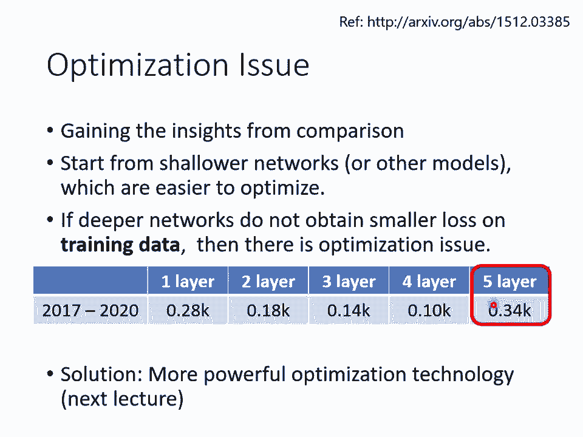

好，那假设你现在经过一番的努力，你已经可以让你的training data的lo变小了。那接下来你就可以来看testing data的 loss，看testing data loss做的怎么样。

那如果testing data loss也小，比如比这个呃strong baseline还要小，那就结束了，没什么好做的就结束了好吗？结束了。好，那但是如果。你觉得还不够小呢？

如果training data上面的lo小testing data上的lo大啊，你可能就是真的遇到overfi的问题。

但你要注意是training的lo小testing的lo大才叫做over很多同学每次一看到结果不好，在t上的结果不好，就说这个是over不一定是over你拿一个结果来问我说老师这个结果要怎么变。

做的更好的时我第一个问题都会问你说你的training data上的lo到底做的怎么样。那我发现10个同学有8个都说要看training data吗？我没有把ing data记下来。

你要把 data记下来，先确定说你的 optimizationim没有问题，你他妈的够大了，然后接下来才看看是不是test的问题。好，那如果是那个圈里的小testing大啊。

这个有可能是overfi啊那over为什么会有overfitting这样的状况呢？为什么有可能圈里的大 testing的呃，为什么有可能圈里的小testing的大呢？

那这边呢就举一个极端的例子来告诉你说为什么会发生这样子的状况。啊，那这是我们的训练资料啊，假设根据这些训练资料，某一个很废的呃ine learning的方法呢？它找出了一个一无是处的方。

这个一无是处的方是什么样的方呢？这个一无是处的方说如果今天呢X当做输入的时候，我们就去比对这个X啊有没有出现在训练资料里面，如果X有出现在训练资料里面，就把它对应的Y当做输出。

如果X没有出现在训练资料里面，那怎么办就输出一个随机的值那。

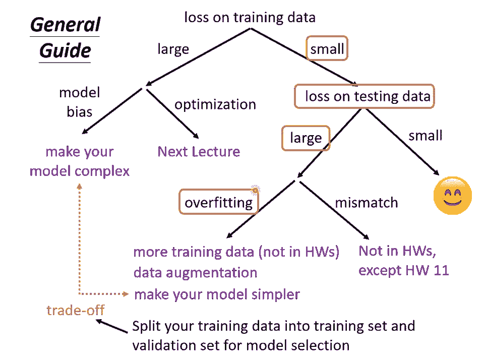

可以想象说这个方选啥事也没有干，它是一个一无是处的方选。但虽它是一个一无是处的function，它在training的data上，它的lo可是零了。

你把training的 data通通丢进这个 function里面，它的输出跟你的训练资料的label是一模一样的。哦。

所以在ing data上面这个一无是处的它的可是零呢只是在 data上面它的会变得很大。因为它其实什么都没有学了。这是一个比较极端的例子。那在一般的状况下也有可能发生类似的事情，举例来说。

假设我们的所有的feature叫做X，我们输出的label呢叫做Y那X跟Y呢都是一维的X跟Y之间的关系呢，是这个二次的曲线。那这个曲线我们可以用虚线来表示因为我们通常没有办法直接观察到这条曲线。

我们真正可以观察到的是什么？我们真正可以观察到的是我们的训练资料。那训练。资料你可以想象成就是从这条曲线上面随机sle出来的几个点。你今天的模型呢，它的能力非常的强，它的flexibility很大。

它的弹性很大的话，你只给它这三个点，它会知道说在这三个点上面我们要让n。所以你今天你的model，它的这个曲线呢会通过这三个点，但是其他没有训练资料作为限制的地方，它就会有freetyle。

因为它它的这个自由它的fexibility很大了，它弹性很大嘛。所以你的model会变成各式各样的 function。你没有给它资料作为训练，它就有freeesttyle可以产生各式各样奇怪的结果。

那这个时候如果你在丢进你的testing data。那testing data跟全年 data当不会一模一样。

他们可能是从同个这个ditribution sample出来的testing data是橙色的这些点训练da是蓝色的这些点。用蓝色这些点找出一个方向以后，你测试在橘色的这些点上不一定会好。

如果你的如果你的model它的自由度很大的话，它可以产生非常奇怪的曲线，导致训练资料上的结果好。但是测试资料上的loose粉。啊，那至于呃更详细的背后的数学原理啊。

为什么呃这个比较有弹性的model他就比较会overfiing背后的数学原理，我们留待下下周吴佩元老师呢会跟大家更详细的说明。好，那么今天呢就是讲一下它的概念就好。哦。

那怎么解决刚才那个overfi的问题呢？有两个可能的方向。第一个方向是呃，也许这个方向往往是最有效的方向是增加你的训练资料。所以今天假设你自己要想要做一个。你发现有overfiing的问题。

其实我觉得最简单解决overfi的方法就是哇增加你的训练资料。所以今天如果训练资料蓝色点的点变多了，蓝色的点变多了。那虽然你的model，它的呃弹性可能很大，但是因为这边的点非常非常的多，它就会限制住。

它看起来的形状还是会很像在产生这些资料背后的二次曲线。但是你在作业里面你是不能够使用这一招的。因为我们并不希望大家浪费时间来就收集资料啊等等。那这个不是机器学习技术最核心的部分。

我们希望大家多focus在机器学习核心技术上，而不是花太多力气。去网络上搜集资料，看看怎么把作业做好。所以这个不是我们要大家做的在作业里面，你不能够自己收集资料。那你可以做什么呢？呃。

你可以做data augmentation，这个方法并不算是使用了额外的资料。data augment是什么意思呢？data augment就是你用一些你对于这个问题的理解，自己创造出新的资料。

举例来说，在做影像辨试的时候，非常常做的一个招式是假设你的训练资料里面有某一张图片，把它左右翻转，或者是把它其中一块截出来方法等等，你做左右翻转，你的资料就变成两倍。那这个就是data augment。

但是你要注意一下data augment呢不能够随便乱做这个data augment这个al啊要al的有道理。举例来说，在影像辨试里面你就很少看到有人把影像上下颠倒。当做organmentation。

为什么？因为这些图片都是合理的图片，你把一张照片左右翻转，并不会影响到里面什么样的东西。那你把它颠倒，那就很奇怪了。这可能不是一个训练资料里面可能不是真实世界会出现的影响。

那如果你给机器看这种奇怪的影像的话，他可能就会学到奇怪的东西。哦，所以data augment要呃根据你对资料的特性，对你现在要处理的问题的理解，来选择合适的data augment的方式。好。

那这边是增加资料的部分。那还有什么解法呢？另外一个解法就是不要让你的模型有那么大的弹性，给他一些限制。举例来说，假设我们直接限制说现在我们的model一定是一条二次曲线。

我们三号通灵出知道说S跟Y背后的关系啊，其实就是一条二次曲线，只是我们不明确的知道这二次曲线里面的每一个参数长什么样。那说你怎么会通灵出这样子的结果，你怎么会知道说要用多con的model才会好呢？

那这就取决于你对这个问题的理解。因为这个model是你自己设计的，到底model要多con多 flexibleex结果才会好。那这个要问你自己那要看这个设计出不同的模型，你就会得出不同的结果。好。

那现在假设我们已经知道说模型就是。

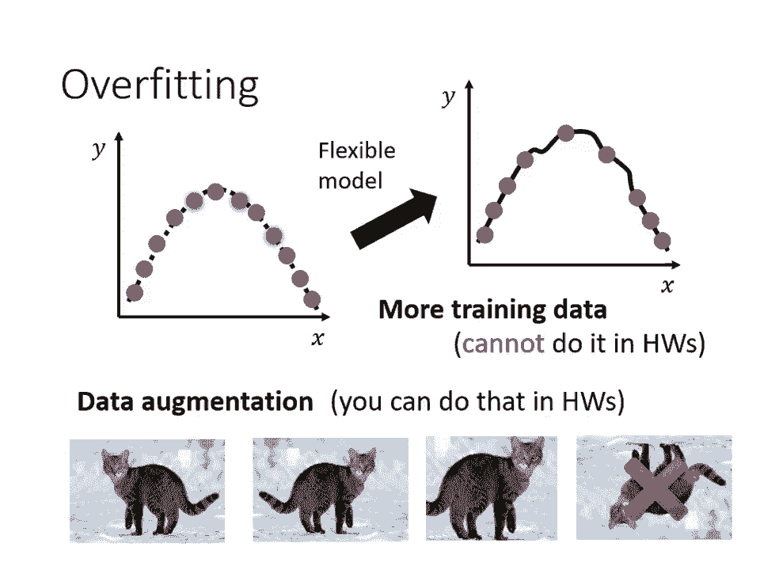

二次曲线，那你就会给你你就会在选择方的时候有很大的限制。因为二次曲线，要么就是这样子，要么就是这样子来来去去就是那几个形状而已。所以当我们的训练资料有限的时候，因为我们来来去去只能够选那几个方。

所以你可能虽然说只给了三个点。但是因为我们能选择的方向有限，你可能就会正好选到跟呃真正的ditribution比较接近的方，然后在测试资料上得到比较好的结果。

啊这所以这是第二个方法解决overing的问题，你要给你的model一些限制啊，最好你model正好跟背后产生资料的过程的是一样的啊，那你可能就会在你就有机会得到好的结果。

但是如果你给你的呃有哪些方法可以给model制造限制呢。举例来说呃给它比较。少的参数，如果是dep learning的话，就给他比较少的神经元的数目。本来每次100个神经元改成100个神经元之类。

或者是你可以让model共用参数啊，你可以让一些参数有一样的数值。那这个部分如果你没有很清楚的话，也没有关系。我们之后再讲CNN的时候啊，会讲到这个部分。所以这边先前情先这个预告一下。

就是我们之前讲的的架构叫做 fully connected。那 fully connected其实是一个比较有弹性的架构。而CNN是一个比较有限制的架构。你不说你可能会说SNN不是比较厉害吗？

大家都说做影像这张CNN那比较厉害model难道它比较没有弹性吗？没错，它是一个比较没有弹性的model它厉害的地方就是它是针对影像的特性来限制模型的弹性哦。

所以你今天 fully connected的可以找出来的方所形成的集合其实比较大的NNN这个model所找出来的方它形成的集合其实比较小的，其实包含在 connected的里面的。

但是就是因为CNN给了比较大的限制，所以CNN在影像上反而会做的比较好。那这个之后都还会再提到。还有哪些其他的方法呢？一个就是用比较少的ature了。那刚才助教已经示范过本来给三天的资料。

改成用给两天的资料。其实结果哎就好好了一些。那这个是一个招数还一个招数呢叫做early earlyization抓都是之后课程还会讲到的东西。那这三件事情呢在作业一的城市里面。

这个呃early其实是有的啊，助教有写在他的code里面，所以不知道这是什么也没有关系，反正直接执行 code里面就有了regization助教留下了一个空格给大家填那你不知道什么是regization没有关系。

反正你可以过得了miow的 baseline。那如果想做的更好，也许你可以先自己备一下regization么看看有没有办法自己写那抓这是另外一个在里面常用来限制模型的方法。那这个之后还会再提到。好。

但是啊我们也不要给太多的限制，为什么不能给模型太多的限制呢？假设我们现在给模型更大的限制说我们假设我们的模型一定是line的mod一定是写成Y等于A加那你的model呢它能够产生的就一定是一条直线。

今天给三个点没有任何一条直线可以同时通过这三个点，但是你只能找到一条直线，这条直线跟这些点比起来，他们的距离是比较近的。但是你没有办法找到任何一条直线同时通过这三个点。这个时候你的呃模型的限制就太大了。

你在测试资料上就不会得到好的结果。但是这个是over吗？这个不是over。因为你又回到了mod的问题。所以你现在这样在这个情况下在这个投影片的case上面你结果不好，并不是因为over的。

而是因为你给你模型太大的限制。到你有了mod豆 bias的问题。

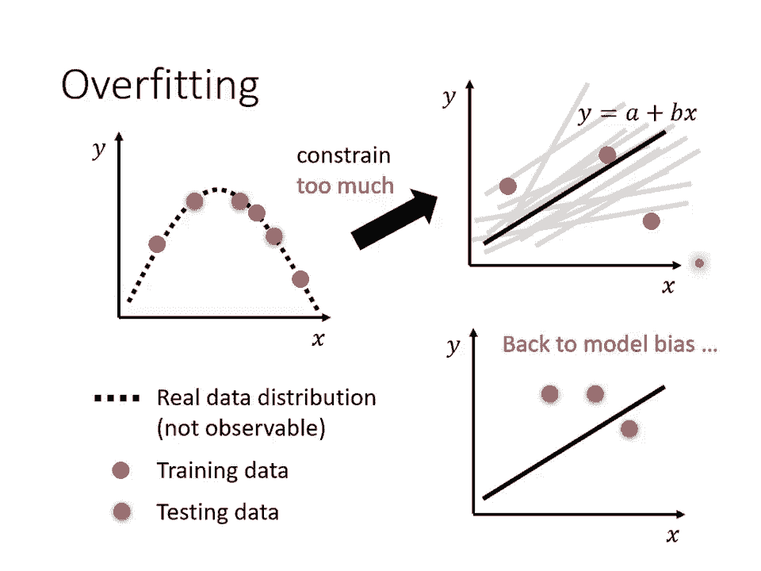

所以就会发现说这边产生了一个有点矛盾，这边产生了一个矛盾的状况。当今天你让你的模型的复杂的程度，或让让你的模型的弹性越来越大。但什么叫做复杂的程度，什么叫做弹性。那今天这堂课里面。

我们其实都没有给明确的定义，只给你一个概念上的叙述。那在下下周课程里面，你会真的认识到什么叫做一个模型很复杂，什么叫做一个模型有弹性。什么呃真的衡量一个模型的弹性，复杂的程度有多大。

那今天我们先用直观的来了解，所谓比较复杂，就是呃呃它可以包含的方向比较多啊，它的参数比较多啊，这个就是一个比较复杂的model。好，那个比较复杂的model。如果你看它的圈里的lo。

你会发现说随着model越来越复杂，圈里的lo可以越来越低。但是testing的时候呢，当model复杂越来越复杂的时候，刚开始啊你的testing loss会跟着下降。

但是当复杂的程度超过某一个程度以后，testing loss就会突然增了，那那这就是因为说啊当你的model越来越复杂的时候，复杂到某个程度overfiing的状况就会出现。

所以所以你在确里的上面可以得到比较好的结果，那在testing loss上面，你会得到比较大的lo。那我们当然期待说我们可以选一个呃呃中庸的模型。

不是太复杂的也不是太简单的刚刚好可以在训练资料上给我们最好的结果给我们最低的lo，给我们最低的testing loss。怎么选出这样的mod道呢？

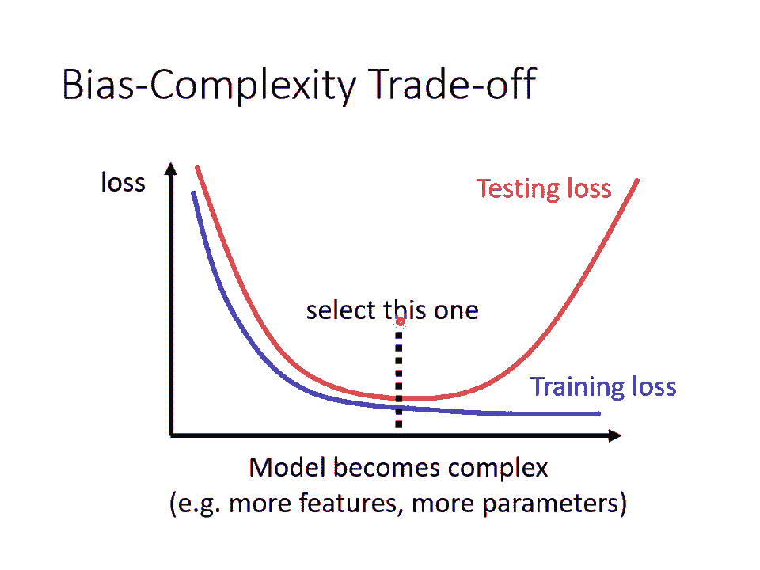

啊，一个很直觉的，你很有可能呃没有人告诉你要怎么做的话，你可能很直觉就会这么做做法就说哎这个cargo不是立刻上传就可以知道答案了吗？所以假设我们有三个模型，他们的复杂的程度不太一样。

我不知道选哪一个模型才会刚刚好在测试资要上得到最好的结果。因为你选太复杂的就over太简单的有model bias的问题，那怎么选一个不偏不倚的，不知道那怎么办？啊这三个模型的结果都跑出来。

然后上传到cargo上面，你及时的知道了你的分数看看哪个分数最低。啊，那个模型显然就是最好的模型，但是并不建议你这么做，为什么不建议你这么做呢？我们举一个再举一个极端的例子。好。

我们再把刚才那个极端的例子拿出来。假设现在有一群model，这一群model不知道为什么都非常废，他们每一个model产生出来的都是一无是处的方。我们有1到这个零有多少个，不知道随便打一兆好了。

我们有1到1兆个model这一这1到1兆个model，不知道为什么认出来的方都是一无是处的方，他们会做的事情就是训练资料里面有的资料就把它记下来，训练资料没看过的，就直接oper随机的结果。好。

那你现在有一兆个模型。那你再把这一兆个模型的结果通通上传到le上面，你就得到兆个分数。然后看这一兆个分数里面哪一个结果最好，你就觉得那个模型是最好。那很虽然说每一个模型，他们在这个t data。

三个 data他都没有看过啊，所以他输出的结果都是随机的虽然在 data上面输出的结果都是。随机的，但是你是随你不断的随机，你总是会找到一个好的结果，对不对？所以也许编号56789的那一个模型啊。

它找出来的function正好在test data上面就给你一个好的结果。那就会很高兴觉得说这个model编号56789是个好model这个好model得到一个好方在它其实随机。但你不知道它这个好方。

这个好方在这个test data上面给我们好的结果啊，所以你就觉得说嗯这个结果不错，就这样我就选这个model这个function当做我们最后上传的结果当做我最后要用在 testing set上的结果。

但是如果你这样做往往就会得到非常糟的结果。因为这个model毕竟是随机的，它恰好在t public testing data上面，它 testing set上得到个好结果。

但是它在 testing set上可能仍然是随。哦，所以假设你今天在选model的时候，你都用public的就我们这个分成public的跟pva say嘛，你在看分数的时候，你只看得到pub的分数。

分数要以后才截知道。但假设你在挑模型的时候，你完全看你在public上面的也就leader上的分数来选择你的模型的话，你可能就会这个样子。哎，就你在public leader上面排前十。

但是deline一结束，你就心态就崩了这样就掉到300名之外。而且我们这收获人这么多，你宝宝会调到1000名之外也说不定而且这件事情并不是传说并没有夸式，每年都会有这样子的状况发生。

因为今年我们会看pub就说我们在算分数的时候，你在public上面的结果好，还是给你一点分数，我们不是只看的分数是pub的分数看的。那过去有些学习是只看。

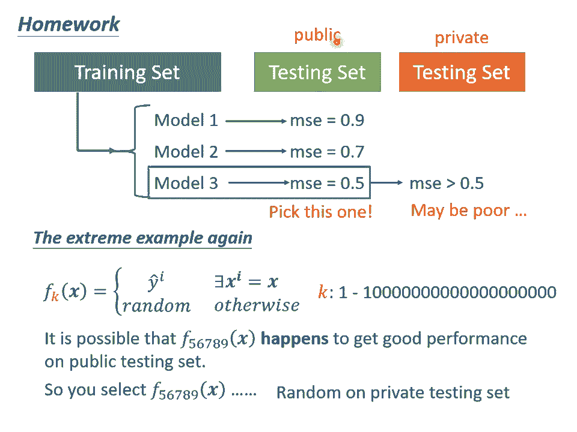

的分数的时候，发现这种状况，你心态就这个崩掉这样子哎，你就会非常非常的郁闷。好，那那呃呃呃那这个时候有同学就会说，那为什么我们要把test set分成pub跟p呢？为什么我们不能就通通都分pub就好呢。

为什么为难大家呢？为什么让大家疑神疑鬼不知道自己上的结果是什么呢？你仔细想想看，假设所有的data都是pub。那我刚才说就算是一个一无是处的modmod得到的一无是处的方。

它也有可能在pub的 data上面得到好的结果。如果我们今天只有pub的没有 testing，那你就回去呃写一个城市不断产生输出就好，然后不断把的输出上传到，然后看你什么时候可以出一个好的结果。

那这个作业就结束了那这个显然没有意义，显然不是我们要的。而且啊因为如果今天影响。然后这边有另外一个有趣的事情，就是你知道因为如果今天public的 testing data是公开的。

你可以知道public testing data的结果。那你就就就算是一个很废的模型产生的很废的方，也可能得到非常好的结果。那这这就印证了说哎为什么在机器学习的领域。

在那些bech的上面往往机器可以得到异于异乎寻常的好的结果，往往都超越人类所谓ch的意思就是哎有一些是公开的然后局来说这个 speech是一个公开的用来训练语音辨的资料集。

那如果你想要测试自己的语音辨试的模型好不好的话，那就训练在 speech上面所有人都共用一模一样的那我们就可以比较。不同模型的好坏。但是问题是这些太现 set的结果都是。所以就算是一个很废的模型。

它只能产生很废的方式，你只要做的够多，你还是可以在plic上得到结果，得到好的结果。那这就解释为什么说这些 benchmarkch最终往往机器可以得到超乎人类的结果。那这个最有名的例子啊。

就是这个而解16年的时候，microsoft跟那个IPM都不约而同的说。他们的mine啊在语音辨视上面得到超越人类的结果，比专业的听打员做的这个语音辨识的错误率还要低。那这个是怎么来的？

那个其实就是做在bench的上面了那个其实是做在一个叫做sitchboard的 benchmarkch的上面。那你说那在 benchmarkch上面得到一个非常好的超越人类，结果，在现实生活中。

他真的有超越人类吗？我想你不会相信对不对？就算你不是做语音辨视的研究人员，你光是有用过你今天语音辨视系统无所不在嘛，每个手机拿出来都有语音，已就不会相信说机器在音能力，已经超越人类啊。

所以这个就是在那些chch的就是p的。但是你真的训练出的语音辨系统上线给人用的时候，那这个是priva你有可能在p上。面得到什么超越人类的结果，但并不代表它在privaate的上一定是好的。

你在那些bech open上面兼机器都说超越人类的语音变色正确率了，并不代表在日常生活中，它的语音变色正确率超越了人类。所以你知道说啊那些说在bech上得到什么超越人类的结果。

那个都比较像是呃片片麻瓜的商业的磁力不过我觉得说呃被用bech open手做出结果来还算是呃已经是很有品的了。我听过更没有品的是怎样的就是。有一个。有一个不不知道哪来的新创啊，去接了一个政府的计划了。

然后说要做语音面试啊，然后就拿那个data啊那KPI就定说嗯我们这个要做到90per以上的正确率啊做完哇，没有得到90per，怎么做都做不到90，人家要来验收了怎么办呢？他们就说跟验收的人说你这个不好。

你这这个里面杂训很多，我帮你把它清干净我有有杂训的那个句子拿掉。然后KPI就达到了正确率就走0%这以上就起飞了，就过了那个KPI了。而其实他有更更没品的啊，就是有人会有有怪怪的新创，会拿出他拿出一个东。

拿出他自己的app能看我自己做了一个语音辨识系统，你知道吗？跟google辨试出来的结果都一样好哦，为什么呢？而且因为他偷co了google的API这样子。好，所以有各种各样奇奇怪怪的东西啊。

所以网络上的东网络上奇奇怪怪的大家有时候看看就好。好，所以讲了这么多，只是想要告诉大家说，哎，我们为什么要切pub的我为什么要切。

然后你其实不要花不要用你public testing set去调你的模型，因为你可能会在pva testing set上面得到很差的结果。

那不过因为今年呢你在public set上面的好的结果也有算分数。哎，所以怎么办呢？为了避免你为了就你可能说好，那我放弃p的结果，就只拿pub结果，然后不断的产生随机的结果去上传到go。

然后看看说能不能正好随机出一个好的结果，为了避免浪费时间做这件事情，所以有每日上传的限制，让你不会说我很的模型只产生随机的结果，不断的测试p testing score。好。

那到底要怎么做才选择model才是比较合理的呢？那建议的方法是这个样子的那其助教程市里面也都帮大家做好了。你要把train里的资料分成两半，一部分叫做traing set。

一部分是valedation set。刚才助教程市里面已经看到说有呃90per的资料放在training set里面，有10per的资料会被拿来做valedation set。

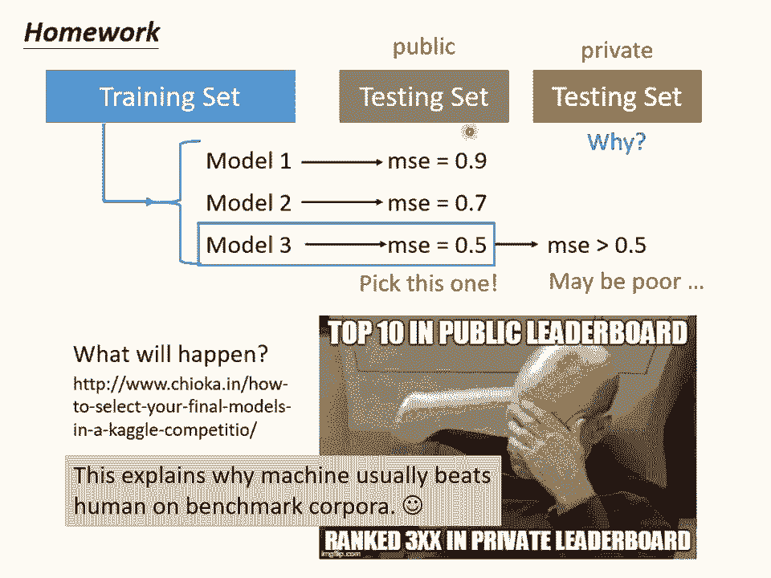

啊，那你那你在training set上训练出来的模型，你在validation set上面去衡量他们的分数。你根据veidation set上面的分数去挑选结果。

再把这个结果上传到卡go上面去看看你得到的public的分数。那因为你在挑分数的时候，是用validation set来挑你的model。所以你的public testing set的分数。

就可以反映你的private testing set的分数，你就比较不会得到说在public上面结果很好。但是在prite上面结果很差这样子的状况。当我知道说呃。其实啊呃你看到puby的结果以后。

你就会去想要调它了。就你看到你现在弄了一堆模型，然后用检查一下，找了一个模型放到puby set以上以后，发现结果不好，你其实不太可能不根据这一个结果去调整你的模型。但是假设这一个look啊做太多次。

你根据你的puby testing set上结果去调整你的model太多次，你就又有可能fe在你的puby testing上面，然后在pub testing上面得到差的结果。不过还好。

反正我们有限制上传的次数。所以这个路呢，你也没有办法走太多次，可以避免你太过fe在puby的 testing上面的结果。好，那呃我知道说今天因为public testing上面的结果啊。

是大家都可以看到的。然后很多人都会，然后名字你又可以随便乱取。所以假设有一个人洗到第一名的话，他就会非常的得意，他的他就把自己的名字改成一些什么？我第一次是就第一名了。我是我其实只是个旁听。

那其实他不是旁听的。但他感觉说我其实只是个旁听的，随便做就后第一名了。那这个时候你就会觉得很紧张啊，尤其他如果是你更更是的隔壁小毛得到第一名，到时候耀武扬威的时候，你就会开始有点紧张。

你就是说等一下你不要得意，我等一下就去把你刷下来这样。那这个时候你要不要理他呢？你不要理他。根据过去的经验，就是在py leader上排前几名的，往往py是有很容易惨掉啊这样子的。

所以在py的 testing上面得到太好的结果，也不用高兴的太早。做条。哎，其实最好的做法就是用veidation最小的直接挑就好了。就是你不要去管你的puby testing set的结果。

但我知道说在实作上，你不太可能这么做。因为puby set的结果你有看到，所以你会对它对它对你的模型的选择可能还是有一些影响的。但是你要呃越少去看那个py testing set的结果越好。

就回答到你的问题吗？关系。好，还如果其他问题，我等下再回答。好，那那个这个是呃。这个是啊刚才忘了那个呃复述那个同学的问题了好，线上直播的同学复述一下大那个同学的问题。他问题是说。

所以我们不能去看py testing set的结果啊，理想上是就理想上你就用挑就好。然后上传以后怎样就是怎样有过那个双以后就不要再去呃动它了那这样子你比较不会。那这样子呢可以避免你over在上面。好。

那但是这边会有一个问题，就是怎么分 validation那如果在重要城市里面啊就是随机分的。但是你可会说搞不好我这个分分的不好啊，搞不好我分到很奇怪的 set然会导致我的结果很差。如果你有这个担心的话。

那你可以用N four的。那N four是怎么做的呢？啊，就是你先把你的训练资料切成N等份啊，在这个例子里面呢，我们切成三等分。

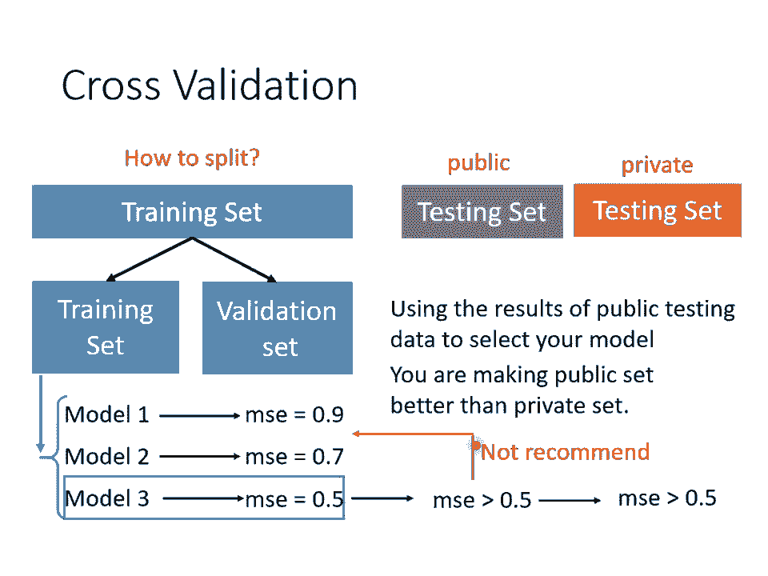

切完以后，你拿其中一份当做ation set，另外两份当 set。然后这件事情你要重复三次，也就是说呃你先第一份第二份当全，第三份当。然后第一份第三份当，第二份当第一份当，第二份第三份当。

然后接下来你有三个模型你不知道哪一个是好的，你就把这三个模型在这三个seing下，这三个training跟validation的呃data set上面通通跑过一次。

然后把这三个模型在这三种状况的结果都平均起来，把每一个模型在这三种状况的结果都平均起来，再看看谁的结果最好，再看看谁的结果最好。

假设现在mod one的结果最好你用这三个for得出来的结果是这个mod one最好，然后你再把。model one用在全部的traing set上。

然后训练出来的模型才用在t testingest set上面。好，那这个是n for的 cross。

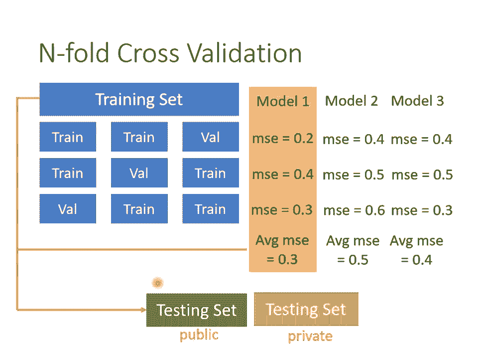

好，那这个就是这门课前期的攻略，他可以带你打赢前期所有的副本。那接下来也许你要问的一个问题是，上周结束的时候，不是讲到预测2月26号，也就是上周五的观看人数吗？到底结果做的怎么样好。

那这个就是我们要做的结果了。上周比较多人选的三层的naval啊，所以我们就把三层的nve拿来测试一下，以下是测试的结果我们就没有再调参数了。大家决定用三层的就是下好离手了，就直接用上去了。好。

得到的结果呢是这个样子了啊，这这图上呢，这个横轴啊，就是从2021年的1月1号开始一直往下。然后红色的线是真实的数字，蓝色的线是预测的结果。2月26号在这边了。

啊这个是今年2021年观看人数最高的一天了。那。

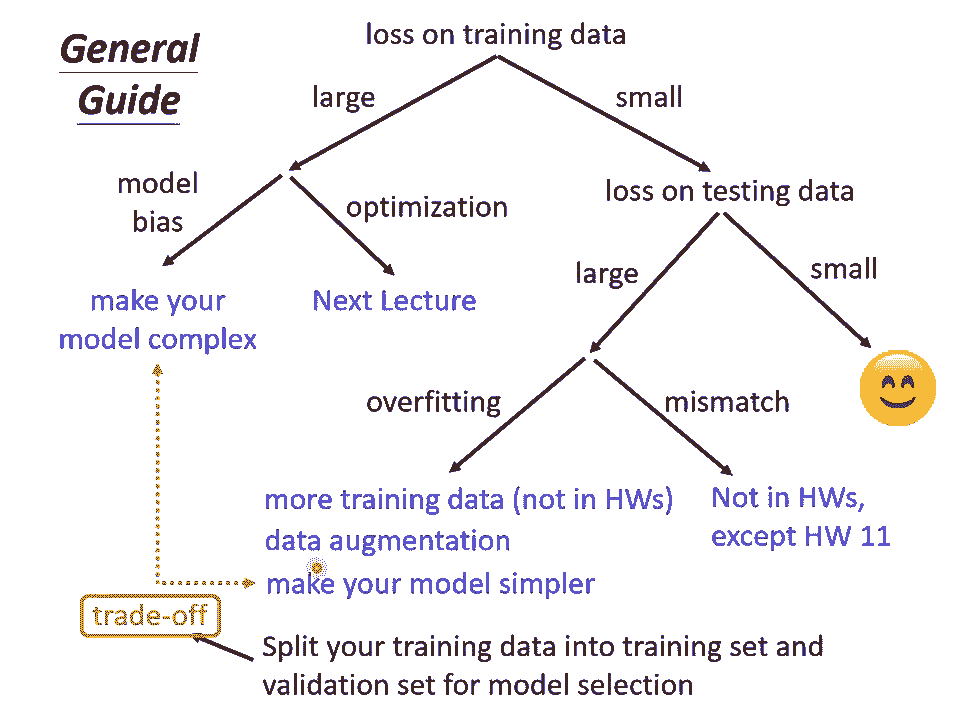

而机器机器的预测怎样呢？哇，非常的惨，差距非常的大，差距有2。58K这么多。好，感谢大家，感为了让这个模型不准啊，这个上周我花了很多力气去点的这个video啊，所以今这一天是今年观看人数最多的一天。😊。

那你可能看想说，唉，那别的模型怎么样呢？其实我也跑了一层、二层跟四层的，看看了，所有的模型都会铲掉。两层跟三层的错误率都是2。多K，其实四层跟一层比较好，都是呃1。8K左右。

然后但是这四个模型不约而同的觉得2月26号应该是个低点，但实际上2月26号是一个峰值。那模型其实会觉得它是个低点也不能怪他。因为过去根据过去的资料，礼拜五就是没有人要学机器学习，礼拜五晚上大家出去玩了。

对不对？礼拜五的观看的人数是最少的，但是2月26号出现了反常的状况。好，那这个呢就不能怪模型的。那我觉得出现这种状况啊，应该算是另外一种错误的形式。这种错误的形式呢，我们这边叫做missmatch。

那也有人会说missmatch也算是一种overfi这样也可以啦，这都只是名词定义的问题。那我这边要想表达的事情是missmatch啊它的原因跟overfi其实不一样。

一般的overfiing你可以用收集更多的资料来克服。但是missmatch意思是说，你今天的训练资料跟测试资料，他们的分布是不一样的。在训练资料跟测试资料分布是不一样的时候。

你训练资料再增加其实也没有帮助的。

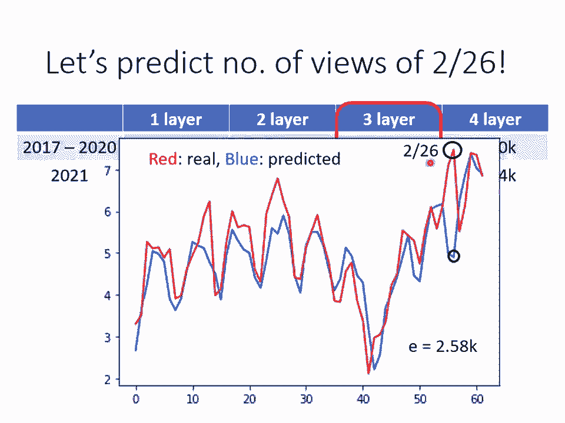

那其实在多数的作业里面呢，我们不会遇到这种missmatch的问题啊，我们都有把这个题目设计好了。水资料跟测试资料它的分布差很多。举例来说，你刚才作业一的 nineteen为例的话。

假设我们今天资料在分这个训练资料跟测试资料的时候，我们说2020年的资料是训练资料，2021年的资料是测试资料，那missmatch问题可能就很严重了。这个我们只有试过了，试了一下。

如果今天用2020年当训练资料，2021年当测试资料，你就怎么做都是惨了，就做不起来，你怎么训练什么模型都会惨掉。因为2020年的资料跟2021年的资料，他们的背后的分布其实就是不一样。

所以拿2020年资料来训练，你在2021年的作业一的资料上，你根本就预测不准，所以后来就要是用了别的方式来分个训练资料跟测试资料。好，但所以我们多数的作业都不会有这种missmatch的问题。

那除了作业11，因为作业11就是针对missmatch问题啊设计的作业11也是一个影像分类的问题。这是他的训练资料啊，看起来蛮正常的。但他测试资料就是长这样子啊。

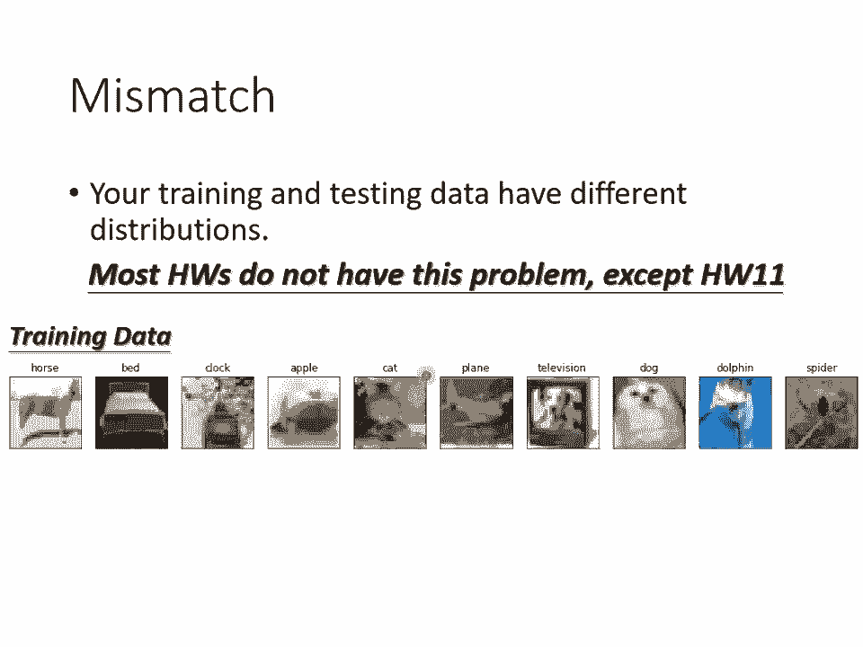

啊，所以你知道这个时候这个这个时候增加资料哪有什么用呢？增加资料你也没有办法让你的模型做的更好。所以这种问题要怎么解决？那留待作业实的时候再讲。好。

那可能会问说我怎么知道现在到底是不是missmatch呢？那我觉得要不要知不知道是missmissmatch，那就要看你对这个资料本身的理解了。你可能要对你的训练资料跟测试资料的产生方式有一些理解。

你才判断说他是不是遇到了missmatch的状况。

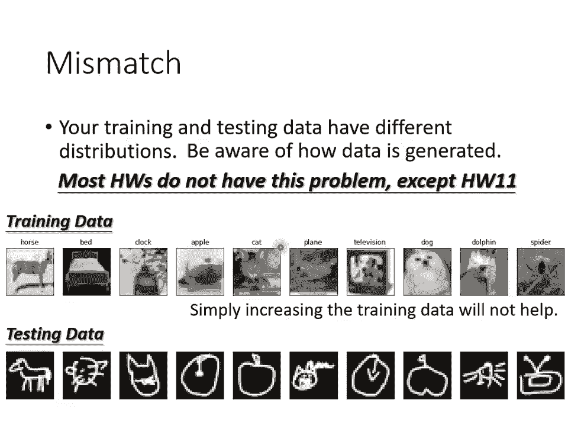

好，那这个就是我们作业的功略。那我们在这边停下来，看看大家有没有问题要问的。

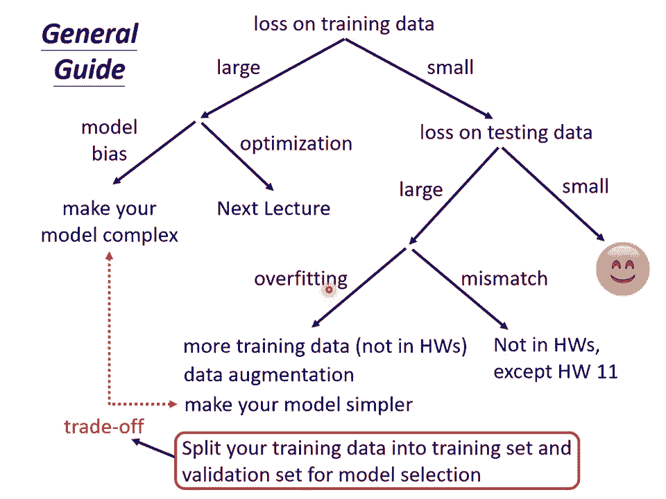