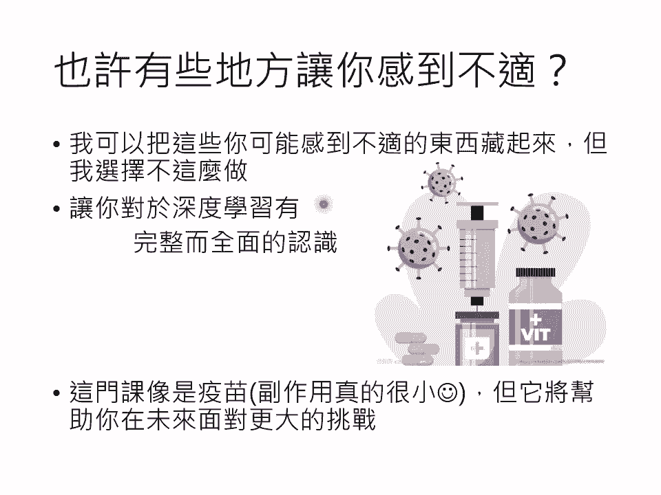
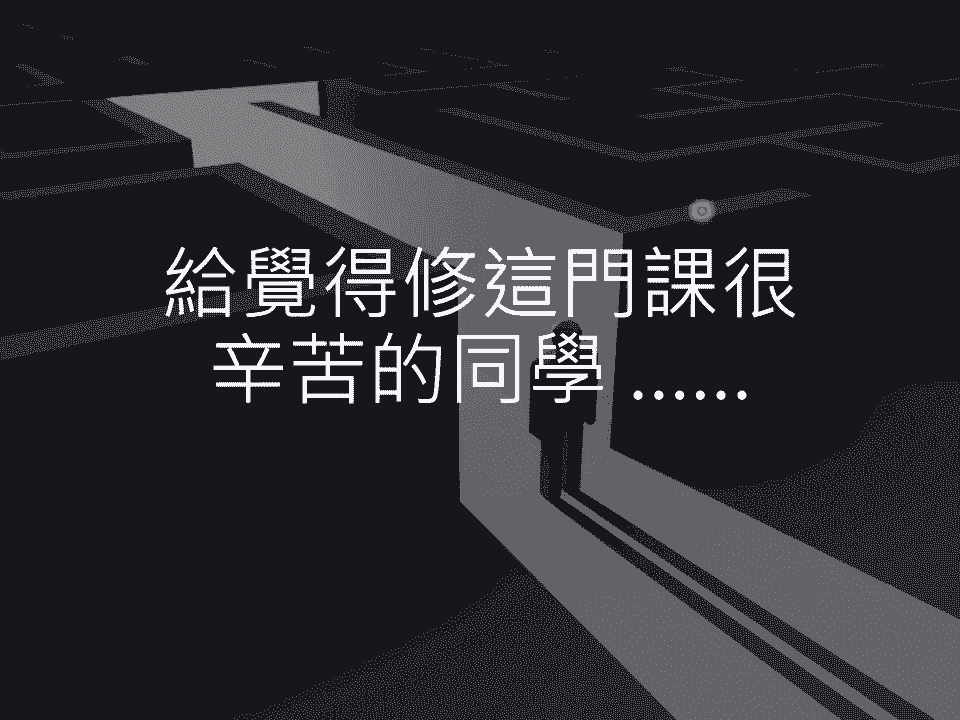
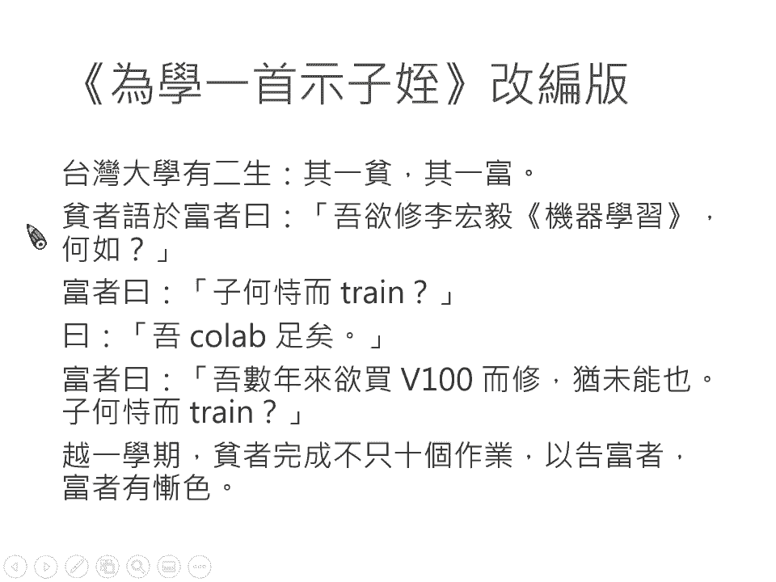

# 【国语+资料下载】李宏毅 HYLEE ｜ 机器学习(深度学习)(2021最新·完整版) - P40：课程结语：最后的业配并改编《为学一首示子侄》作结 - ShowMeAI - BV1fM4y137M4

各位同学大家好，最后我准备了感性的课程结语，想要分享给大家。

在这门课里面，我们到目前为止学过了什么呢？在这个学习一开始的时候，我就告诉大家说什么叫做机器学习，机器学习不是太神奇的东西，它就是要找一个function。

那在第一堂课我们就告诉大家linear的 model是不够的。在第一堂课，我们就直接进入这门课的主题告诉你什么是深度学习，什么是 learningning。接下来我们告诉大家说。

怎么用deep learning的技术来处理一张图片来处理输入式矩阵的状况，也就是convolutional的 neural network。那接下来呢我们还告诉大家说，假设输入是一个sequence。

它是一段声音，它是一段文字的时候，要怎么处理。在这个部分我们讲了self attention的概念。最后我们跟大家讲说，我们可以有一个model。

这个model叫transformer它的input跟oper的长度可以是不一样的。啊，这是我们前半学期大概跟大家分享的内容。因为时间有限的关系，所以在课堂内没有办法分享太多各式各样不同模型的变形。

但是其实你只要知道这页投影片讲的这些模型，你其实就可以处理多数你感兴趣的应用。这是上半学习的部分。接下来过了其中之后，我们开始进入一些机器学习进阶的主题，包括怎么让机器学会创造这件事。

也就是genative model。那在genative model里面，我们讲了in这个技术。那我们还跟大家讲说怎么利用没有标注的资料。

也就是现在最热门的sale supervise learning的技术。那在sale supervise learning的技术里面，我跟大家分享了今日最关键大家最耳熟能详的brt这个模型。

那我们也讲说，如果训练跟测试资料不匹配，不match的时候怎么办？我们跟大家讲了doomament adaptation。我们还讲了每个人都耳熟能详的IL reinforcement learning。

试图用平易近人的方法来告诉你什么是reinment learning。那我们还讲如何应付来自人类的恶意，如何做模型的攻击与防御。我们还讲说，如果悬殊一个模型以后，怎么去解释模型学习的结果。

我们讲了explainable的 machineachine learning。我们还讲，假设你要在H device上面做运算的时候，该怎么办？我们讲了如何让模型进行压缩。

我们讲了naval compression的技术。那我们还讲了迈向天网之路，或者是我们为什么没有办法制造出去天网。我们讲了lifeon learning的技术。最后我们要超越机器学习。

我们不只要学习我们还要超越学习这件事，做到学习如何学习，这个就是 metata learning。那在这门课里面呢，我们也看到了machine learning的各式各样的应用。

看到了机器学习这个技术的种种可能性。包括把机器学习用在跟cobe nineteen有关的趋势预测上，把机器学习用在影像处理上。那除了最基本的这个影像分类之外，我们还做了影像系统的攻击。

我们还做了影像系统的调试。我们还做了影像系统的压缩解释，还甚至做了对影像的异常检测。那除了对影像做分类以外，我们还带大家做了让机器画图这件事。我们让机器可以生成二次元人物的头像。除了影像以外。

机器也能拿来处理自然语言。我们带大家做了两个自然语言处理相关的应用，一个是翻译机器可以把某一个语言自动翻译成另外一个语言。另外一个是问答，你可以问机器一个问题，它可以给你一个答案。

那我们还做了跟语音相关的应用。我们让机器可以把声音讯号变识成文字。我们做了一个简化版的语音辨试。我们做了音速辨识这个任务。我们也让机器它可以辨识现在的说话的人是谁？我们让机器做了愚者辨识。

那我们还用reinforcement learning的技术，让机器玩了小游戏。那在这门课里面有这么多的应用，就是要告诉你说机器学习深度学习它可以用在各式各样的领域。

那你可以想想看你现在关注的问题里面有没有可以用机器学习深度学习来解的问题。好，这门课呢是一个漫长的旅程，而这个旅程现在已经进入尾声。但这个并不是旅程的终点，它只是另外一段旅程的开始。

那我知道很多同学在修这门课的时候，你可能会觉得对很多主题都只是走马看花的看过而已。没错，这门课最重要的目的并不是带你深入研究某一个机器学习里面的问题。

而是告诉你说今天在深度学习这个领域里面有哪些关键的技术。所以我们做的事情呢，像是深度学习的一学其游。哎，就好像说很多有这个台北一日游这样子的活动嘛，然后就带你去看看台北各个景点。

但是你也没有办法真的了解台北，你可能要在台北住的够久，才能够了解当地的文化。所以今天这门课做的事情是深度学习一学其游。我们就是告诉你说有哪些技术，啊，就好像带你去1011，然后呢爬上去看个夜景。

然后就结束了。那甚至很多技术，我们只是略微提到根本没有详细的讲它的内容，就好像指着远远的指着。101告诉你说，哎，看了那边有个景点叫做101，你下次来台北玩的时候，可以记得爬上去看看。哦。

所以这门课我们只是走马看花的告诉你有什么样关键的技术存在。我们只是带你到了这些技术的门边，把门打开来，告诉你说，门里面可能有什么，但是要真的跨入这个门内，那就要靠你未来自己继续努力。那有同学可能会问说。

在这门课结束之后，接下来我可以做什么呢？我觉得其实你可以开始尝试找一个应用来自己解决。如果你是研究生的话，那你一定有你正在研究的问题。而这个问题可能过去你并不知道怎么用深度学习的技术来处理。

而今天修完这门课以后，你可以想想看在我们做过的这些作业里面有没有什么概念是可以派得上用场的，有没有什么作业，甚至可以直接用在你正在研究的问题上。如果你想要更进一步学习深度学习的技术的话。

其实我认为现在你应该有能力可以读懂论文了。你可以去找机器学习的顶尖国际会的论文来看。假设这门课的多数内容你都已经通透，静下心来，你应该是有办法看得懂这些内论文大致的内容的。最后啊。还有啊好。

这个大家听好了，这个是我最后的叶配了嘿。好，有一个活动呢叫做machine learning的summer school NLSS2021啊，这个活动呢是从8月2号到20号。

那每天呢会有1到2堂3个小时的课。好那欢迎大家来注册这个活动来继续学习机器学习这个技术。假设你说完这门课，还觉得意犹未尽。想要更深入研究机器学习的各个主题的话，那欢迎你报名NLS你可以来跟这些大师学习。

今天这些最前瞻的主题进展到什么地步。好，那这个活动还有一个更厉害的地方是呃，如果你只是要线上听课，他的general program对学生是免费的啊，既然是免费的那你还不赶快先报名一下再说。好。

这个是这门课真正最后的页配了。嗯，后面真的是没有其他页配了。那感谢大家这学期呢来修这门课。因外这学期呢机器学习这门课是设成一类加选了，所以只要想修这门课的同学都可以修到。

所以起初的时候有非常多人选这门课。那你可会好奇说到期末过了这个停休申请之后，还剩多少同学呢，现在还剩1280人修课了。好，那以下我特别还统计了一下，各个系所的人数分布图啊，我们可以来看一下呢？

这边每一个不同的颜色啊，就代表一个不同的系所啊，那人数最多的呢是职工系啊，是是3。7per，然后第二多的是电机系11。8per好，那有一些系所的这个人数呢是超过5per的，包括资。管系呃，职工系硕士班。

还有电机系硕士班。那你知道其实5per在这门课呢人数也不算少了，因为这门课有将近1300人休课嘛，所以1per是是3人啊，按照5per就已经有80个人了。好，那这边呢有非常多不同的颜色了。

就代表说修这门课的同学呢，来自于各个不同的系索。那如果你的系索没有出现在这边，呃，那不好意思，因为这个圆饼图的空间有限，没有办法把所有的系索都列出来。啊，那有同学问说，哎，为什么这学期可以收这么多人呢？

哎，为什么这学期要设成一类加选呢？那我知道说呢呃今日各行各业啊都有需要，或者是想尝试深度学习这个技术的需求。所以其实过去啊呃。过去虽然不是一类佳选，但是也会有很多同学想要修这门课。

但是过去因为这个资源比较有限啊，所以呢这门课通常也没有办法真的让所有想修这门课的学生都修到那你看这学期啊，光是电子学院修课的同学就有六七百个人哦，而过去呢通常这个班级只收150到200人左右。

所以在之前呢在本学期以前就算是电子学院的同学也不是每个人都可以修到这门课的呃，如果你有听学长姐讲过的话，那这门课过去是有一个先背能力测验的那要通过那个测验才能修课。

所以不是每个同学都能修到我开的机器学习这门课。那呃其实起初的时候啊，过去起初的时候常常会有很多同学来呃要求加签呢。那我倒狠心的拒绝大家。那有时候我心理是觉得蛮难过的。所以我希望说。

如果有一天有足够的资源，那期待可以让想修这门课的同学都可以修到。好，那就是这学期感谢台大教务处愿意支持这门课，那所以呢既然台大教务处愿意支持这门课，所以我就决定说这一学期呢就不要设任何修课的限制。

把这门课设成一类加选啊，让想修这门课的同学呢都能够修到。当然我也知道说既然让这么多同学修课，那大家的背景一定都非常不一样。那为了应应这个问题呢，我其实对教材和作业啊，都重新做了设计。

所以如果你把这学期的课程内容跟过去的课程内容比较一下的话，会发现还是有蛮大的不同的那主要的目标是希望让更多同学可以听得懂这门课的内容。那我知道说呃要让所有人都听懂，可能是有点困难嘛。

那其实你知道要把一门课讲的，大家都听不懂，那个是很容易。了要讲的让很多人听懂，哎，那这个是很挑战的一件事情。那我可能没有真的做到说让所有人都了解这门课的内容。

但我期待说至少让越多人可以了解深度学习的内容越好。好，那另外呢我也其实知道说，不是每一个同学都那么熟悉写城市这件事。虽然这个开学的时候就跟大家说，这不是一门城市的课。其实这也不是一门通识课。

而其实开学的时候，我把这门课跟声多概做对比。然后大家笑声很大声。那这个让我有点后悔讲的那个笑话了。因为你可能没有听我怕你没有听到我接下来讲的第二句话，就是这不是一门通识课啊。

所以这仍然是一门练机系的选修课，所以他其实是有一定程度的难度的啊，但是我们还是准备了范例的城市，至少假设你真的完全不会写城市的话，你也有一些事情可以做。我而我期待说就算是你这学期只有执行了范例城市。

你可能觉得没有真的很深入到机器学习的内容。但是未来假设有一天你想要实做这些机器学习应用的时候，也许你可以把助教的范例程式改一改，就可以用在你想要。解的问题上。那其实啊我这学期已经有看到很多同学在这么做。

你知道这个呃现在很多各个科系的实验室，不管原来有没有在做机器学习的，都期待可以把机器学习用在某一些应用上。那这时候指导教授往往就是直接给研究生下一个指令，说嗯这边有个问题，你就给我想办法用机器学习去解。

但是怎么办？有没有人可以教你。那我发现这学期呢呃有听到有一些同学跟我讲说，哎，他就是改一下助教的作业就解掉了。那这个其实就是我想要达成的目标啊。那如果你觉得你在什么应用里面有用上助教的范例程市的话。

那希望你可以对助教表示感谢。我知道说呢同学们可能来自于非常多不同的细索，所以我相信这堂课可能没有办法，每一件事情都让你觉得满意。那什么地方可能会让你觉得非常不满呢？我相信会让你觉得最不满的地方。

就是啊这个模型训练的时间太长了，或者是我没有好的GPU啊，col lab不够用啊，那我完全了解你的痛苦。那这些问题不是这学期才有这些抱怨，从这门课刚开始有的时候，我知道同学们就有这些问题。

那我相信我其实比大家更了解这些问题，你知道我是经历过那个连GPU加速都不知道的年代的人哦，所以模型训练的时间还有没有好的运算资源的痛苦，我完全可以感同身受。好，那我也不知道应该要怎么安慰你啦。

因为这个是做深度学习蛮本质的问题。也许我可以告诉你的事情是这个痛苦呢是比较出来的啦。那今天也许你觉得训练一个模型要花好几个小时，太花时间了。啊，这个一个城市作业不应该花好几个小时才能完成。

那不用回到我学生的时代，刚回到56年前那个时候不是每个人都有GPU。那在那个时候很多同学要做深度学习怎么办呢？哇，你只好用笔电硬做哦，所以像作业二那样的模型啊。

过去你有可能作业2的baseline要训练两天才可以训练出来哦，所以因为有了作业要花好几天才做的出来才训练的出来，这个时候我都会告诉大家说，这个作业啊，你前一天晚上在挣扎已经没有用了。

在前一天如果说作业只剩下作业的delight只剩下一天的话，你唯一能够做的事情，就是放弃，知道吗？因为你已经不可能完成了那今天。训练模型只需要数个小时。

那你在前一个晚上也许还有机会把作业的baseline赶出来。呃，我知道说col lab呢，它有很多问题，那我自己也有用col lab的经验，所以我完全可以了解大家所遇到的问题。但是我想要跟大家讲说。

没有col lab，我们就不太可能开这个超大型的班级。啊，所以colllab虽然不是完美的，但是呃我们有一个统一的平台，然后助教的范例城市可以成功跑在col lab上面。

大家至少在colab上面可以成功的跑助教的范例城市。啊，不过这个运算资源的太换啊，真的是非常的迅速。我还记得我刚回台大任教的时候啊，那个时候实验室好多人要共用一张760。现在760谁要啊，送给你。

你都嫌占地方，对不对啊？还有那个这个我记得col lab啊，我刚接触到的时候是2018年的年初啊，那时候colla，如果没记错话，上面只能好像只有K80啊，那但是2018年的时候哇。

免费的K80那个多香啊，现在你抽到K80，你都觉得很肚拦，对不对？都想抽一张别的卡，对不对？所以这个运算资源的太换，真的是非常的迅速。痛苦是比较出来的。所以未来啊可同一门课。

也许他们的作业只需要几分钟就可以完成。啊，我相信未来你可能会听到学弟妹抱怨说，哇，这个训练居然要几分钟啊，不能接受啊，这个时候你就记着呛他说，以前说这门课的时候，训练是要几个小时的。

在作业的daylight前十0分钟是不可能做出来的，知道吗？哎。好，那还有同学们常常提到的问题是啊，这个priva set跟p set的结果不一样啦，或者是每日的submission的次数不该有限制啦。

那我可以告诉你说，呃，今天也在cago上看机器学习的比赛哦，都有一样的配置。所以这门课并没有特意刁难你，为什么机器学习要有这样的设置。那在课堂上其实也跟大家说明过了，希望你可以接受？

还有一个大家常常抱怨的问题，就是哇这个作业一直在通灵啊，都不知道在做些什么啊。嗯，如果你这样想的话，我是感到欣慰的代表你真的有认真去劝d model。

如果有一个人啊他告诉你说哦这个我劝 never不用通灵，我都知道参数超参数要设什么，我都知道nve应该躲深，我都知道lenning应要设多少。那你要怀疑说他到底有没有实际劝过model的经验。

如果你有实际圈落 modelel，你会知道说training的结果千奇百怪往往无法预测。那我想很多同学应该都听过这个2017年的test of time word得主的演讲，这个阿里hi的演讲啊。

他把深度学习呢比喻成炼金术。哎，这个跟大家把深度学习比喻成公妙学习，觉得说这门课应该去刑天公开，这个真的是有一曲同工之妙。那我想讲这些只是要告诉你。说哎不知道该怎么调hyperparameter。

这个也是深度学习本质的问题。所以上述这些问题啊呃它可能会让你觉得没有很愉快。但是我必须说它不是bug，我并没有刻意在为难大家，它就是深度学习本质上的问题。那呃对我来说。

也许把这些让你可能感到不适的东西藏起来。并不是真的那么困难。我可以说哦，我们所有的作业都出成选择题就好啊，就像教育部的前后册一样，都问你一些概念性的问题就好。那这样子你会很开心。

我也很轻松那我选择不要这么做，为什么呢？我并不打算藏着掖子告诉不把这个深度学习会实际上遇到的困难告诉你，我希望你对深度学习有真实完整而全面的认识。我想很多同学可能都知道说哎这个坊间有很多付费的AI课程。

那其实很多高阶主管啊，你知道现在AI很重要嘛，所以大家都知道说啊这个要只学一下AI相关的技术啊，所以很多高阶主管呢会去上这些付费的AI课程。你知道在这些AI课程里面，因为毕竟是以盈利为目的嘛。

所以讲到深度学习的时候一定是要把这些呃困难的部分。忙着掖着哎着不让这些高阶主管知道啊，免得他休了一下，觉得不高兴跑掉了怎么办？课程还要赚钱呢。呢高阶主管上完课搞不好好，还执行了一些范例城市啊。

执行完以后觉得太爽了，深度学习就是这么简单。然后回去呢就跟他下面的工程师说，这个深度学习太简单了，我随便都劝个10个8个，你明天就给老子弄个几个应用出来，明天就给我做个sri出来然后工程师做不出来。

就说你们都是笨蛋啊，我随便做做都可以做出来，为什么你们都做不出来呢？为什么你们的nl都劝不起来呢？啊，台湾没有人才啊，啊，我不希望你对这个深度学习有错误的认识，觉得他是一件非常简单的事情。

我就把所有的面相都告诉你对我来说因为啊这个课程不盈利嘛，对不对？所以对我来说说对我来说多一个人少一个人都没差啊，所以你喜欢不喜欢对我来说都没差，我就是把真深度学习真实的样貌呈现给你看。

我觉得呢这门课让你感到的不是，也许就像是。😊，这一秒一样。啊，今天每个东西都要讲到疫苗，对不对？现在台湾一堆疫苗专家，对不对？好，所以我们也趁热度讲一下疫苗啊，所以这门课呢就像是一个疫苗。

也许它有一些地方有副作用，会让你觉得有一点不舒服。但是你想想看这一门课最大的副作用是什么？它。给他最糟的状况是什么？最糟的状况顶多是你在这门课没拿到好成绩，对不对？那你在台大修的课有多少。

你到毕业前可能修了四五十门课嘛，一门课没有拿到好成绩，对你的人生会有什么影响吗？可能是没有什么影响的。但是如果你有在这门课接触过深度学习真实的样貌，也许可以帮助你在未来面对更大的挑战。

未来你自己要做一个application的时候，你已经没有助教的范例程市了。今天我们在做一个作业的时候，有助教，告诉你说这个作业可以做到什么样的程度，他有一些提示告诉你说。

完成每一个提示大概会得到什么样的结果。而有一天你必须要自己面对一个全新的问题，在完全没有提示的情况下，自己想办法解开这个问题，自己想办法把模型训练起来。😊，那也许有的同学会觉得说啊修完这门课。

让我觉得我再也不想学习深度学习了，没有关系，这样也无法。你知道在这门课里面呢，我从头到尾都没有告诉大家说啊，深度学习是最关键的技术啊，AI好棒啊，每个人都要学AI啊，AI要取代人类啦。

没有学AI你就要被淘汰了。我从来没有说过这些事，我想要做的事情，并不是鼓吹你一定要学习深度学习的技术，而是让你了解这个技术，你自己决定未来你要不要继续深入去研究。最后啊我想给觉得修这门课很辛苦的。

你一点勉励啊，我的勉励呢，改编至为学一首是只值这篇文章唯学一首是只值这篇文章是我们国小有读过的课文，对不对？那其中有一个故事，这个故事是这样的。

呃，蜀之彼有恶生其一贫其一富贫者欲于富者曰啊，这个欲呀，它是动词，就是贫者对富者这样说，吾欲之南海何如这个之呢是罔哦，就我要去南海怎么样呢？富者曰子何适而往啊，你要凭借着什么去呢？你怎么有办法去南海呢？

那曰哦，这个曰是平者曰平者说吾一贫一波足矣啊，我只要一个平子一个波就够了那富者曰呢，无数年来欲买舟而下，由谓能也止何适而罔啊，那这个课本的助释位告诉你说这个前面的子何思而往。

跟后面的子何思而往意思是不一样的。他们虽然都是问说你凭借着什么可以去，但前一个问题是呃真的是问题，他是真的不知道答案，然后第二个子何适而往呢？是比于彼。疑的语气是反奉的语气。然后最后月明年平者指南海环。

以告富者，富者有参色。好，接下来是改编版的文学一首试子值台湾大学有二身其一贫其一父贫者欲于父者曰，无欲修李弘毅机器学习何如富者曰子何适而劝，曰，无col足矣富者曰无数年来欲买V100而修，犹未能也。

不过这篇帮父者呢说一句好话，他可能只是呃没有通过那个先背能力测验而已。他其实也不是不想修。好，那父者接下来说子何事而劝。月一学其平者完成不止10个作业，以告富者富者有残色。好。

感谢大家这学期呢来修机器学习这门课。那我知道说呢呃这次因为开放一类家选，所以很多本来完全没有机会修到这门课的同学可以修到这门课。啊，我知道有些同学你手上可能没有好的运算资源，所以你修起来特别痛苦。

但无论如何，你都修完这门课了，期待未来这门课可以对你的人生有一些影响。那我知道说啊在座的各位同学来自于各个不同的科系。未来大家会散布到各行各业去。

那你可能会用深度学习做出我今日没有办法想象的事做今日我没有办法想象的成就。那学期的课呢就上到这边，请大家给坚持到最后的自己一个热烈的掌声，谢谢大家，谢谢。

