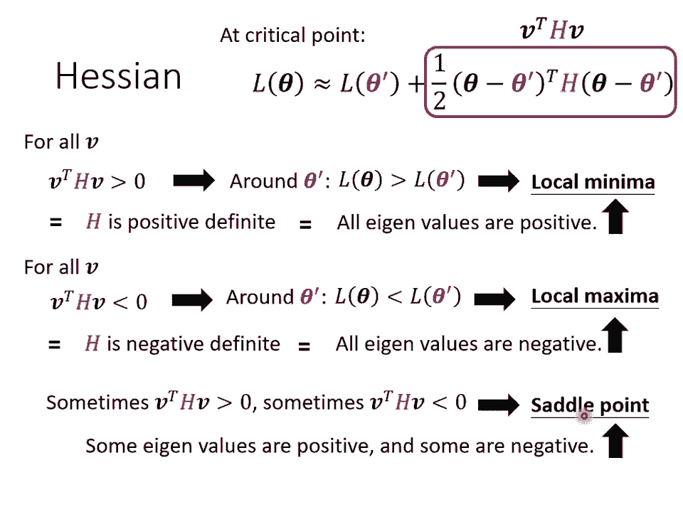
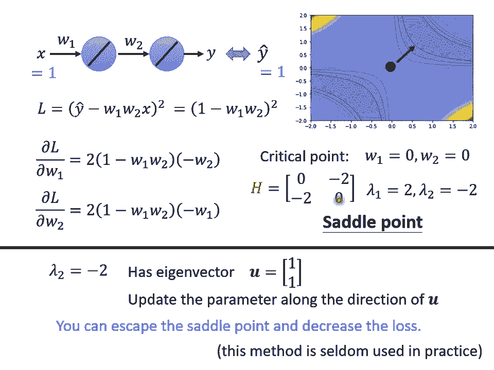

# 【国语+资料下载】李宏毅 HYLEE ｜ 机器学习(深度学习)(2021最新·完整版) - P4：L3.1- 网络训练1：局部最小值与鞍点 - ShowMeAI - BV1fM4y137M4

好好，那我们来上课吧。那接下来我们要讲什么呢？接下来呢我们要讲，如果optimization失败的时候怎么办。好所以看一下我们刚才的攻略。现在我们要讲的是optimization的部分。

所以等一下我们要讲的东西呃，基本上跟呃比如说overating没有什么太大的观点，我们只讨论optimization的之后，怎么把gradient decent做的更好。好。

那为什么optimization会失败呢？那你常常在做 optimizationimization的时候，你会发现说哎，随着你的参数不断的update你的train的lo不会再下降。

但是你对这个lo仍然不满意。就像我刚才说的，你可以把dep跟line的 model或比较slow比较发现说他没有做的更好。所以你觉得d内没有发挥它完整的力量。所以optimization显然是有问题。

那有时候你会甚至发现说一开始你的model就串不起来。一开始你不管怎么update你的参数，你的loth通通都掉不下去那，这个时候到底发生了什么事情呢？

那过去常呃常见的一个猜想是因为我们现在呢走到了一个地方，这个地方参数对loose的为分为0。当你的参数对lo的为分为0的时候，gradient就没有办法再upate参数了，就没有办法再up参数了。

这个时候群里就停下来了，你的参数不再update了，loth当然就不会再下降。那讲到grad为0的时候，大家通常最想最先想到的脑海中最先浮现的可能就是local mini。

正常有人说这个啊我做d learning啊，你用啊，你会卡在loc mini那然后所以不 work啊，所以 learning不过等等。但是如果你有一天你要写 learning相关的的时候。

你千万不要讲什么卡在local mini这种事情，但是会别人会觉得你非常没有水准，为什么因为不是只有local mini的gra是0，还有其他可能会让gra是0。

比如说 point所谓的se point其实就是点是零，但是不是local mini也不是loc的地方。像在这个例子里面，红色的这个点它在左右这个方向是比较高的。前后这个方向是比较低的它就像。

一个马鞍的形状啊，所以叫做cdo point。那中文呢就翻成鞍典。那像cdo point这种地方，它也是graian为0，但它不是local mini。那像这种规定为零的点呢。

统称为critical point。所以你可以说你的lo没有办法再下降，也许是因为卡在了critical point。但你不能说是卡在localmin，因为se point也是唯分为0的点。好。

但是如果我们今天你发现你的规点真的很靠近零，卡在了某个critical point，我们有没有办法知道到底是local minima还是se point呢？其实是有办法，不是完全没有办法。

那为什么我会想要知道到底是卡在local mini还是卡在C point呢。因为如果是卡在loc mini，那可能就没有路可以走了，因为四周呢都比较高。你现在所在的位置已经是呃最低的点，lo最低的点了。

往四周走，lo都比较高，你们不知道怎么走到其他地方去。但sttle point就比较没有这个问题。如果你今天是卡在settle point的话，你今天是走到一个settle point的话。

settle point旁边还是有路可以走的，还是有路可以让你的lo更低的。你知道逃离settle point，你就有可能让你的lo更低。

所以鉴别今天我们走到 criticalical point的时候，到底是local mini还是settle point是一个值得去探讨的问题。好。

那怎么知道今天一个critical point到底是属于local mini，还是ze point呢？啊，这边需要用到一点数学以下这一段，如果其实没有很难的数学那就只是微积分跟呃线性代数。

但如果你没有听懂的话，以下这一段呃skiip掉是没有关系的。

好，那怎么知道说一个点到底是locgo mini码还是se point呢？那你要知道我们los function的形状，可是我们怎么知道lo function的形状呢？n我本身很复杂又复杂。

n我算出来lo function显然也很复杂。我们怎么知道lo function长什么样子呢？虽然我们没有办法完整知道整个lo function的样子，但是如果给定某一组参数，比如说蓝色的这个se块。

在这块附近的lo function是有办法被写出来的，它写出来就像是这个样子，所以这个L of完整的样子写不出来。但是它在se块附近你可以用这个式子来表示它。你要说哇这个是什么？这个还有好多种颜色啊。

这个东西到底是什么？呃呃，这个东西是hel serious approximation。就这个假设你在维积分的时候，其实已经学过了，所以我就不会细讲说这一串是怎么来的。但我们就只讲一下它的概念。

这一串里面包含什么东西呢？第一项是L of达 point就告诉我们说啊，当谢达跟se达派很近的时候，L of达应该跟L of达啊还蛮靠近的。好，那第二项是什么呢？第二项是达减达派的全乘上GG是什么？

G是一个向量。这个G呢就是我们的bra。我们在上周已经讲过规点这个东西了，我们用绿色的这个G呢来代表它是一个向量。那这个规告诉我们什么呢？这个规点会来弥补达派跟谢达之间的差距。

我们虽然刚才说谢达跟达派他们应该很接近，但是呢还中间还是有些差距的那这个差距呢，第一项我们用这个 gradient来表示他们之间的差距。好。

那这个G呢就是有时候规点会写成到三角形 ofL它是由达派这个地方的G然后G的第G是一个向量，它的第I个component就是达的第I个component。对L的为分。好。

光是看还是没有办法完整的描述L of，你还要看第三项。第三项是什么？第三项跟haian有关，这边有一个H这个H叫做它是一个矩阵这个第三项啊是塔减塔派的后乘上H再乘上塔减派所以这个第三项呢会再补足这个呃再加上以后跟真正的L之间的差距。

那这个H里面放的是什么东西呢？这个H里面放的是L的二次为分。这个H的第I个第J个的值是什么呢？它第I个第J个的值就是把塔的第I个功能对L做为分吧的。啊谢达的第J个compon对L做为分，对吧？

谢达的第I个compon能对L做为分，做两次违背后的结果就是这个HIJ。好，如果这边你觉得有点听不太懂的话，也没有关系，反正你就记得说这个L of这个lo function啊。

这个al surface啊在se块附近可以写成这个样子。这个式子跟两个东西有关系，跟graian有关系，跟haian有关系。graient就是一次为分haian就是呃里面有二次为分的项。好。

那如果我们今天走到了一个cr point，那意味着什么？意味着raing为0，也就是绿色的这一项完全都不见了。其是一个zero vector绿色的这一项完全都不见了，只剩下红色的这一项。

所以当 point的时候，这个它就是它可以被近似为 of加上红色的这一项。我们可以根据红色的这一项来判断说在附近的 surface到底长什么样子。直道 surface长什么样子。

我们就可以判断说它是一个loc mini码是一个loc max，还是一个 point，我们可以靠这一项来了解这个 surface的地貌大概长什么样子。知道它地貌长什么样子。

我们就可以知道说现在是在什么样的状态。这个。

好，那我们就来看一下怎么根据haian，怎么根据红色的这一项来判断这大派附近的地方。我们现在啊为了等一下呃符号方便起见，我们把se达减se达换用V这个向量来表示se达是一个向向量吗？

se达换也是一个向量，这样的向量相减。我们用V这个向量来表示它。如果今天对任何可能的VV的乘后乘上H乘上V都大于0。也就是说，现在谢达不管带任何值，就B可以是任何的B。

就代表说se塔减se达派也可以是任何值，也就谢达可以是任何值。不管se达带任何值，红色框框里面通通都大于0。那意味着什么？意味着说红色框框里面都大于0，意味着说L达大于L of达比如达不管带多少。

只要在达派附近达L达都大于L达。那代表什么？代表L达派是附近的一个最低点，所以它是loc mini。如果今天反过来说，对所有的B而言，V trans h乘上B都小于0，也就红色框框里面永远都小于0。

也就是C达不管带什么什么值，红色框框里面都小于0，那意味着什么？意味着红色框框里面都小于0，意味着说L ofC达块都是大于L ofC达L塔小于L ofC达块。代表说L这条麦是附近最高的一个点。

所以它是local max。第三个可能是假设V transHV有时候大于零，有时候小于0，你带不同的V进去，也就带不同的se达进去。红色这个框框里面，有时候大于零，有时候小于0，意味着说在se达附近。

有时候有些比L有时候L达大于L达，有时候L达小于L达在L达附近，有些地方高，有些地方低，这意味着什么？这意味着这是一个都破。好，那这边你会有的接下一个问题是哦，我们看这一项，看红色这一项。

我没有办法判断我们现在可以判断它是loc mini还是谁 point还是loc max。但是你这边是说我们要带所有的B去看 h是大于零还是小于0。我们怎么有可能把所有的B都拿来试试看呢。

所以有一个更简便的方法去确认说这一个条件或这一个条件会不会发生。那这个就直接告诉你结论，先进代数的先进代数理论上是有教过这件事情的。如果今天在所有的B而言呢， hB都大于0。那这种举证叫做itive。

举证有什么特性呢？它是我的envalue都是正的。所以如果你今天算出一个，你不需要把它跟所有的V都乘看看，你只要去直接看这个H的envalue。如果你发现说啊所有envalue都是正的。

那就代表说这个条件成立，就V后乘上H乘上B会大于0，也就代表说是一个。所以你从haian可以看出它是不是local mini码，你到算出haian算完以后看他的igenvalue发现都是正的。

它就是local mini码就结束了。那反过来说也是一样，如果今天在这个状况，对所有的V而构成H乘以B小于0。那H呢是 negativeg，那就代表所有的envalue都是负的。

所有en所有的envalue都是负的，就保证它是loc。那如果envalue有正有负，那就代表是 point。那假设假没有听得很懂的话，你就可以记得结论，你只要算出一个东西，这个东西名字叫做a。

它是一个举证。这个举证，如果他所有的igenvalue都是正的，那就代表我们现在在loc mini。如果他有正有负就代表是 point。所以我们是有办法判断说是local mini还是 point。

好，那如果刚才讲的，你觉得你有没有听得很懂的话，我们这边举一个例子啊，我们现在有一个史上最废的nal，它废到什么程度呢？输入一个X，它只有一个new乘上W one且这个有所X乘上W后就通输出。

然后再乘上W然后就再输出就得到最终输出就是Y总之这个方非常的简单，单Y等于W one乘以W two乘以X，这是一个史上最的new那我们一个史上最的train这个说我们只有一笔这ta是X是一的时候。

它的label是一所以输入一进去你希望最终的输出跟一接近越好这个史上最的这个上最是有法直接画出来的。因为反正只有两个参数W连都没有假设。

只有W one跟W两个参数，这个我只有两个参数W one跟W two。那我们可以穷取所有W one跟W two的数值，算出所有W oneW two数值所带来的loose。

然后就画出长这个样子所以这边是高的，这边loose是高的，这边lo是高的。这边loose也是高的四个角落loose是高的。好，那这个图上你可以看出来说有一些critical point。

哪些地方critical point呢？这个黑点点的地方，这个00啊圆原点的地方是critical point。然后事实上呢，这一条线这边也是一排critical point。

也是一排critical point，如果你更进一步要分析他们是seal point还是loc minimum的话，那圆心这个地方原点这个地方它是seal point，为什么3sele point呢？

你往这个方向走，漏会变大，往这个方向走，low是会变大，往这个方向走，low是会变小，往这个方向走，low是会变小，它是一个se point。

而这两这这两群crical point他们都是local mini。所以这个山沟里面有一排loc mini码，这一排山沟里面有一排loc mini码。

然后在原点地方有一个 point这个是我们把 surface到搜以后到搜所有的参数得到的lo function以后，得到的lo的值以后发出arrow surface，你可以得到这样的结论。

那现在假设如果倒搜呃所有可能的lo。那如果直接算出一个点是loc mini还是c point的话，怎么算呢。

好，我们可以把lo的方写出来啊，这个lo的方呢，这个L呢是正确的答案Yhead减掉model的输出，也就是W oneW two乘以X。那这边呢取这个quaarrow这边只有一笔ta。

所以就不会 over全，一反正只一taX带一Y head带一我刚才说过只有一笔训练资料最废的这一周一笔训练资料，所以方就是一减W oneW two的平方。啊，那你可以把这个lo function呢。

它的规点求出来了。那这边细节我们就不讲了。你你可以啊啊你如果很违积分都还记得的话，算一下，就是直到说这个是对的，反正W one对L的围分写出来是这个样子。W two对L的唯分写出来是这个样子。啊。

那这种东西啊就是所谓的局，所谓的归点，什么时候规点会零呢？什么时候会到一个critical point呢？举例来说，如果W one等于0WQ等于0，也在圆心这个地方，如果你W one代于0WQ代于0。

这个规点算出来就都是零了。如果W one代0W2代于0W one在于L的唯分WQ对L的唯分算出来就都是0，就都是0。这个时候我们就知道说原点是一个 criticalitical point。

但是它是一个 critical point，但它是local，它是locloc minimum还是settle point呢？那你就要看haian才能够知到，你就要看haian才能够知到。

当然我们刚才已经报搜说可能W oneWQ了啦。所以你已经知道说它显然是一个settle point。但是现在假设还没有报收所有可能的lo。所以我们要看看能不能够用H啊。

用haian啊看出它是是不是是是什么样的crical point。好，那怎么算出这个H呢？H呀它是一个矩阵。那这个矩阵里面呢就是收集了啊L的二次为分哦。

所以这个矩阵里面第一个落第第一个的位置就是W one对L为分两次一个落第二的位置，就是先用W two对L作为分让W one对L做为分，然后这边就是W one对L作为分W two对L作为分。

然后W two对L为分两次把这四个值组合起来，就是我们的。好，那这个黑选是什么的值是多少呢？这个hasian的式值我都已经把它写出来了，你只要把W one等于0WQ等于0带进去，带进去。

你就得到在原点的地方，ha选是0-2-20这样子的一个矩阵。好，那这个矩阵告诉我们这个ha告诉我们它是local minimum还是se point呢？那就要看这个矩阵的eigenvalue了。算一下。

发现这个矩阵有两个eenvalue2跟-2，eenvalue有正有负，代表se point啊，对不对？我们刚才讲eenvalue有正有负就代表的是se point。好。

那所以我们现在呢就是用一个例子跟你操作一下，告诉你说呃，你怎么从haitian看出一个点，它一个 criticalitical point，它是se point，还是local minimum？

好，如果今天呢你卡的地方是settle point，也许你就不用那么害怕了。为什么？因为如果你今天你发现你停下来的时候，是因为settle point停下来了，那你可以放心的，你其你其实就可以放心。

你其实就有机会可以放心了。为什么因为H啊它不只可以帮助我们判断现在是不是在一个settle point，它还指出了我们参数可以upd的方向。就之前我们参数upate的时候都是看ra看G。

但是我们走到某个地方，然后发现G变成零了，不能再看G了，G不见了，规定没有了，但如果是一个settle point的话，还可以再看H。怎么再看H呢？H怎么告诉我们怎么upd参数呢？

我们这边假设U啊是H的eenvector，然后浪达是U的eenvalue，好像H有一个igenvalue叫浪达，它的对应的eenvector呢叫做U。如果我们把这边的V换成U的话，会发生什么事呢？

如果我们把U乘在H的左边跟H的右边，也就U乘po乘上H乘以U会得到什么呢？H乘以U啊会得到浪达U。为什么因为U是一个en啊，所以H乘上en会得到浪打envalue乘上，所我们这边得到UT乘以浪打U。啊。

再整理一下，把UT跟U乘起来得到U的no平方，所以得到浪达U的no平方。所以这一项啊这一项假设我们这边V带的是一个een vectorctor。

我们这边se塔减se塔派放的是一个en vectorctor的话，会发现说我们这个红色的项里面其实就是浪达乘上U的no平方。好，那今天如果浪打小于0，I根value小于零的话，会发生什么事呢？

如果I根value小于零的话，那浪打乘上U的弄平方就会小于0。因为U的弄平方已经是正的嘛，所以I根value是负的那这一整项就会是负的，也就是U的全构乘上H乘上U它是负的。

也就是红色这个框框里面是小于零的，是负的。所以这意思是说，假设se塔减se塔派等于U，那这一项就是负的，也就是Lse塔会小于Lse塔派。也就是说，假设se塔减塔等于U，也就是se塔等于塔派加U。

你把本来参数在se塔派的位置加上U沿着U的方向做得到se塔，你就可以让变小。因为你根据这个式子，你只要减等于就会变小所以你今天只要让塔等于塔加 u，你就可以让变小。你只要沿着U。

也就是en的方向去更新你的参数去改变你的参数，你就可以让变小了。哦，所以虽然在没有规点。如果我们天是，你也不一定要金花，你只要找出啊正你只要找出负的envalue。

找出负的envalue再找出它对应的en用这个去加你就可以找到一个新的点这个点的比原来还要。如果这样你听的不是很清楚的话，我就举具体的例子。

刚才我们已经发现说原点是个 criticalitical point，它的haian长这个样子。

好，那我们现在发现说呢这个haian有一个负的这个igenvalue和这个igenvalue等于-2啊，这个igenvalue等于-2。好，那这个ienvalue等这个ienvalue等于-2。

那它对应的ien factorctor长什么样子呢？它有很多个，其实是无穷多个对应的ig根。我们就取一个出来，我们取一一啊，一一是它对应的一个I根。那我们其实只要顺着这个U的方向。

顺着一这个vector的方向去更新我们的参数，你就可以找到一个比c point的lo还要更lo更低的点。好，如果今天这个例子来看的话呢，你的settle point在钉冰这个地方。

那你在这个地方会没有规点，所以规点不会告诉你说你要怎么更新参数。那告诉我们说选的en告诉我们说，只要往一一的方向更新，你就可以让lo变得更小，只要往丢这个en的方向更新一一的方向更新。

你就可以在的方向你就可以让你的变小。也就是说你可以逃离你的 point，然后让你的lo变小。所以从这个角度来看，从这个角度来看，似乎s point并没有那么可怕。如果你今天在圈里的时候。

你的规点停你的去训练停下来，你的规点变成零你的训练停下来。是因为H是因为 point的话，那似乎还有解。但是当然实际上啊在实际的implementation里面，你几乎不会真的把haian算出来。

为什么这个要是二次为分哦，要计算这个矩阵的呃computation需要的运算量非常非常的大，更黄论，你还要把它的eenvalue跟een factorctor找出来。所以在石座上。

你几乎没有看到有人用这一个方法来逃离sttle point。下我们会讲其他也有机会逃离settle point的方法，他们的运算量都比要算这个H还要小很多。

但今天之所以我们把这个se point跟ctor拿出来讲，是想要告诉你说，如果是卡在settle point，也许没有那么可怕。最糟的状况下，你还有这一招可以告诉你要往哪一。

方向走。好，那大家讲到这边，你就会有个问题了。这个问题是，那到底settle point跟local minima谁比较常见呢？我们说settle point其实并没有很可怕。

那如果我们今天常遇到的是settle point比较少遇到local mini啊，那就太好。那到底seital point跟local mini码哪一个比较常见呢？那这边呢我们要讲一个不相干的故事。

我们先讲一个故事。这个故事是什么呢？这个故事发生在1543年，1543年发生了什么事呢？那一年这个君事坦丁堡沦陷了啊，这个是君士坦丁堡沦陷图啊，君士坦丁堡本来是东罗马帝国的领土。

然后被厄图曼土耳其帝国占领了，然后东罗马帝国就灭亡了。而，当时那在厄图曼土耳其人进攻君士坦丁堡的时候啊，那时候东罗马帝国的国王使君士坦丁是1世，他不知道要怎么对抗呃土耳其人啊，有人呢就献上了一册。

找来了一个魔法师，叫做迪奥伦马。因是这个哎这个这是真真实的故事，知道吗？出自三体的故事。哎，这个迪奥迪奥伦娜这样说啊，迪奥伦娜是谁呢？他有一个能力跟张飞一样。对。

张飞不是可以万军从中取上将手级卢探囊取物吗？迪奥伦娜也是一样，他可以直接取得那个苏丹的头，他可以从万军中取得苏丹的头，大家想说，哎，迪奥伦娜怎么这么厉害，他真的有这么强大的魔法吗？

所以大家就要迪奥伦那先展示一下他的力量啊，这时候迪奥伦纳就拿出了一个圣杯。大家看到这个圣杯就大吃一惊，为什么大家看到这个圣杯要大吃一惊呢？因为这个圣杯啊，本来是放在圣索菲尔大教堂的地下室。

而且他是被放在一个石棺里面，这个石棺是密封的，没有人可以打开它。但是迪奥伦纳他从里面取得了圣杯，而且还放了一串葡萄进去。啊，那君士坦丁11是为了要验证迪奥伦纳是不是真的有这个能力。

然后就带了一堆人真的去撬开了这个石棺，发现圣杯真的被拿走了，里面真的有一串新鲜的葡萄，然后就知道迪奥伦纳真的有这个万军从中去上将首级的能力。好，那为什么迪奥伦纳可以做到这件事呢？

那是因为这个时观你觉得它是封闭的那是因为你是从三维的空间来看，从三维的空间来看，这个时观是封闭的，没有任何路可以进去。但是迪奥伦纳可以进入四维的空间。从高维的空间中，这个时观是有路可以进去的。

它并不是封闭的。

好，那至于迪奥伦娜有没有成功刺杀苏丹呢？你可以想象一定是没有嘛。所以金斯坦丁宝才沦陷的讲样，那至于为什么没有大家请见三体，这样他就不雷大家了。啊，那总之这个从三维的空间来看，是没有路可以走的东西。

在高维空间中是有路可以走的。Aero surface会不会也一样呢？好，所以你在一维的空间中，一维的一个参数的er surface，你会觉得好像到处都是local mini，但是会不会在二维的空间来看。

它就只是一个c point，常常会有人画类似这样的图告诉你说d learning的训练是非常的复杂的。如果我们移动某两个参数，er surface的变化，非常的复杂。

是这个样子的那它显然有非常多的local mini，我在这边显然有一个local mini。

但是会不会这个local mini码只是在二维的空间中看起来是一个local mini码。在更高维的空间中，它看起来就是selow point？在二维的空间中，我们没有路可以走，那会不会在更高的维度上。

因为更高维度，我们没有办法逼住来他，我没办法真的拿出来看呢，会不会在更高维的空间中，其实有路可以走的啊如果维度越高，是不是可以走的路就越多了呢？所以而今天我们在训练一个naval的时候。

我们的参数往往动辄百万千万上。所以我们的aero surface其实是在一个非常高的维度中，对不对？我们参数有多少，就代表我们的erero surface的维度有多少？

参数是1000万就代表ero surface它的维度是1000万。这样维度这么高，会不会其实根本就有非常多的路可以走呢？那既然非常多的路可以走，会不会其实local mini根本就很少了。

而呃经验上，如果你自己做一些实验的话，也支持支持这个假说这边呢是训练某一个nval的结果，每个点代表训练那个nval训练完之后。把它的拿出来进行计算。所以这边的每一个点都代表一个naval。

就我们训练某一个naval，然后呢把它训练训练训练到卡规点很小，卡在 criticalical point，把那种参数拿出来分析，看看它比较像是谁 point还是比较像是loc mini。

那这边的纵轴跟横轴是什么意思呢？纵轴代表training的时候的los啊，就是我们今天卡住了，那个los没办法再下降了，那个los是多少。那很多时候啊你的los在还很高的时候呃，训练就不动了。

就卡在loc就卡在ical point。那很多时候啊los可以的很低，才卡在ical point。这是纵轴的部分。横轴的部分是什么呢？横轴的部分是minim ratio什么叫min ratio呢？

min ratio是呃igenvalue的数目分支正的igenvalue的数目。就如果所有的igenvalue都是正的，代表我们今天在一个我们今天的crical point是local minimum。

如果有正有负代表ze point。但在实作上你会发现说你几乎找不到完全所有igenvalue都是正的critical point。你看这边这个例子里面。

这个min ratio代表igenvalue的数目分支正的igenvalue的数目，最大也不过0。5到0。6减而已代表说有一只有一半的igenvalue是正的，还有一半的envalue是负的哦。

所以今天虽然在这个图上越往右代表我们的ical。越向local mini，但是他们都没有真的变成local mini。就算是在最极端的状况，我们仍然有一半的状一半的case，我们的envalue是负的。

这一半的case根value是正代表说在所有的维度里面有一半的路其实都还可以让n都还可以让n下降。这一半的路上一半的路可以让nose下降。

所以从经验上看起来其实local mini并没有那么常见多数的时候，你觉得你到一个地方，你规定真的很小。然后所以你的参数不在对，往往是因为你卡在了一个。

好，那接下来我们就是要讲说，假设你 train哪 train哪，也许你卡在local mini，像我刚才想说local mini出现的状况也许没有那么多。

或卡在sttle point或甚至是在sttle point附近，也就是非常平坦的地方。那么有什么样可能的解决方法？好，那在这边呢，我们还是停一下，看看大家有没有问题要问的。

