# 【国语+资料下载】李宏毅 HYLEE ｜ 机器学习(深度学习)(2021最新·完整版) - P6：L4- 网络训练3：自动调整学习速率 - ShowMeAI - BV1fM4y137M4

好，那上周呢我们讲到了critical point的问题。那接下来呢我要告诉大家说，critical point其实不一定是你在训练一个nl的时候会遇到的最大的障碍。

那今天呢这份投影片里面要告诉大家的是一个叫做adapive learning rate的技术。也就是我们要给每一个参数不同的learning rate。好。

那为什么我说这个critical point不一定是我们训练过程中最大的阻碍呢？这个往往啊同学们在训练一个network的时候，你会把它的lo记录下来。所以你会看到说你的los呢原来很大。

那随着你参数不断的upate横轴呢代表参数upd的次数。随着你参数不断的upate这个los会越来越小，最后就卡住了，卡住的意思就是你的los呢不再下降。那多数时候这个时候大家就会猜说，哎。

那是不是走到了回ical point，因为gradient等于零的关系，所以我们没有办法再更新参数。但是真的是这样吗？当我们说走到critical point的时候，意味着bradian非常的小。

但是你有确认过，当你的los不再下降的时候，gra真的很小嘛。其实多数的同学可能都没有确认过这件事。而事实上在这个例子里面呢，在今天我秀的这个例子里面。当我们的los不再下降的时候。

g点并没有真的变得很小，下面是gra点的no，也就是graian的这个向量，gr点是一个向量嘛？gra这个向量的长度随着参数更新的时候的变化。那你会发现说虽然los不再下降。

但是这个gra点的no gradient的大小并没有真的变得很小。事实上，在最后训练的最终结的时候，los已经几乎没有在动了。los几乎没有在减少了。但是规点却突然。还上升了一下，这是怎么一回事呢？啊。

那这样子的结果其实也不难猜想，也许你遇到的是这样子的状况啊啊，这个是我们的aero surface。然后你现在的规点呢，在aero surface三股的两个股壁间不断的来回的震荡。

这个时候你的los不会再下降，所以你会觉得看到这样子的状况，你的lo不会再越来越小。但是实际上它真的卡到了critical point，卡到了se point，卡到了local mini吗？

不是的它的规点仍然很只是lo不见得在减小了哦，所以你要注意啊，当你今天你训练的券到后来发现los不再下降的时候，你不要随便说啊我卡在local mini，我卡在seal point。

有时候根本两个都不是你只是单纯的lo没有办法再下降。就是为什么在作业2之2会个作业叫大家算一下规点的no，然后算一下说你现在是卡在se point还是c point因为多数的时候当你说你训练卡住了。

很少有人会去分析卡住的原因。那为了强化你的印象。我们有一个作业，让你来分析一下卡住的原因是什么。那讲到这边有的同学就会有一个问题了。呃，如果我们在训练的时候。

其实很少卡到se point或者是local mini，那这一个图是怎么做出来的呢？你还记得这个图吗？我们上次画过这个图是说啊我们现在训练一个训练到现在参数呢在critical point附近。

然后我们再来根据根value的正负号来判断说这个cical point，它比较像是档是loc mini。那如果实际上在训练的时候，要走到ci point或者是local mini是一件困难的事情。

那这个图到底是怎么画出来的呢。啊，这边告诉大家一个秘密了，这个图啊你要训练出这样子的结果，你要训练到你的参数，很接近critical point。

用一般的 gradientdiancent其实是做不到的。你用一般的 gradientcent，你往往会得到的结果是你在lo还很你在这个还很大的时候，你要loose就已经掉不下去了。

这个是需要特别方法圈的。所以做完这个实验以后，我更感觉呃，你要走到一个critical point其实是困难的一件事。多数时候training在还没有走到critical point的时候。

就已经停止了。但这并不代表说critical point不是一个问题。我只想要告诉你说，我们真正目前你要当你用 gradientdiancent来做 optimizationim的时候，你真正的魔王。

你真正应该怪罪的对象，往往不是critical point，而是其他的原因。

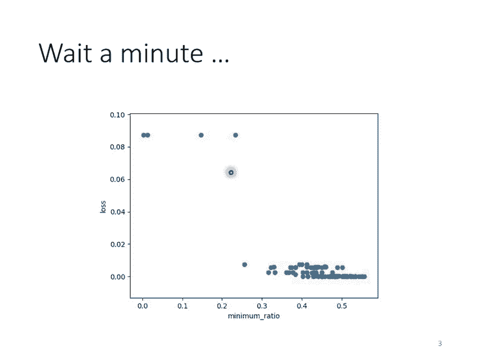

好，那为什么就如果如果今天 point不是问题的话，为什么我们的圈里会卡住呢？我这边举一个非常简单的例子。好，我这边有一个非常简单的arrow surface。

我们只有两个参数这个两个参数值不一样的时候落值不一样。然后我们就画出了一个 surface这个 surface的最低点呢在叉叉这个地方，事实上呢这个er surface是conve的形状。

那如果你不知道comback是什么没有关系啊，总之呢它是一个它的这个等高线呢是椭圆形的，只是它在横轴的地方呢，它的规点非常的小，它的坡度的变化呢非常的小，它非常的平滑，所以这个椭圆的这个长轴非常的长啊。

短轴呢相对之下比较短在纵轴的地方点的变化很大，你的 surface的这个坡度呢非常的陡峭。好那现在。我们要从这个地方这个地方当做初始的点，然后来做 gradientdiandescent。

你可能觉得说啊这个是个convex的arrowero surface啊，做 gradientdientdescent有什么难的吗？不就是一路滑下来，然后可能再走过去吗？应该是非常容易吧。

你实际上自己试一下，你会发现说就连这种conve的arrow surface形状这么简单er surface，你用 gradient点都不见得能把它做好。举例来说，这个是我实际上自己试了一下的结果啊。

我 learningning设1的负2次方的时候，那这个我能的我的这个参数呢在峡谷的两端，你可以想象说这边是一个3B，然后另外一边在这个图片之外，这个3B，我的那个呃参数呢在3B的两端呢不断的震荡。

我漏就掉不下去，但是规点其实仍然是很。啊你可能说那就是因为你learning race太大啦，learning rate决定了我们update参数的时候步伐有多大。learning race太大。

显然步伐太大，那你没有办法慢慢的滑到山谷里面，那这个是呃咎由自取，只要把learning race小一点，不就可以解决这个问题了吗？事实不然，因为我试着去调整了这个learning rate。

啊你就会发现你要光是要确认这种confi的opimization的问题啊，你都觉得很痛苦，懂吗？都了，知道吗？这个觉得非常痛苦啊，就我就调这个running rate从1的-2次方。

一直调到10的-7次方，调到10的-7次方以后，终于不再震荡了哦，终于从这个地方滑滑滑滑滑滑到三谷底，然后终于左转了。但是你发现说这个训练永远走不到终点，为什么？

因为我的 learningning rate已经太小了，在这个很斜的地方呃，因为这个坡度很陡，归点的值很大，所以还能够前进一点，它这个地方坡度已经非常的平滑了。

这么小的running rate根本没有办法再让我们的训练前进了。事实上在这个地方啊，你看看到这边一大堆黑点乌漆妈黑的，这边有多少个点呢？这边有10万个点了。哎。

这个是这个张辽800从10万的那个10万，知道吗？这个是10万个点，但是我都没有办法靠近这个local mini码的地方哦，所以。显然，就算是一个conve的 surface。

你用 gradientdientcent也很难好。但有同学可能会想说，这个convease optimizationization的问题应该有别的更好的方法可以解吧。

你不一定要用gradientcent这么土的方法，你确实有别的方法可以解。但是你想想看，如果今天是更复杂的ero surface，你真的要train的时候。

gradientcent是你唯一可以仰赖的工具。但是 gradientdiancent这个工具连这么简单的ero surface都做不好，你视之不至，何以天下国家为，对不对？这么简单的问题你都做不好。

那如果难的问题又怎么有可能做好呢？所以我们需要更好的gradientcent的版本。啊那怎么把grdingcent做的更好呢？在之前我们的grdian percentcent里面。

所有的参数都是设同样的learning rate，这显然是不够的。learning rate它应该要为每一个参数克制化。所以接下来我们就是要讲客制化的learning rate怎么做到这件事情。

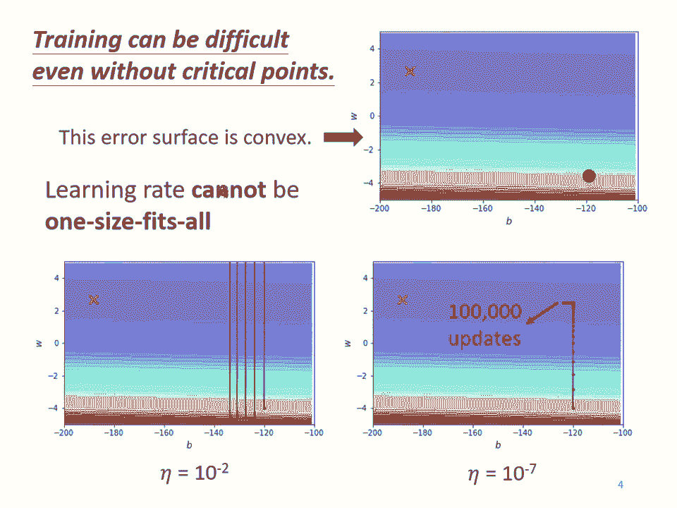

好，那我们要怎么克制化这个learning rate呢？我们不同的参数到底需要什么样的learning rate呢？从刚才的例子里面呢，其实我们可以看到一个大原则。这个大原则是如果在某一个方向上。

我们的bra点的值很小。在某一个方向上非常的平坦，那我们会希望learning rate调大一点。如果在某一个方向上非常的陡峭，某一个方向上坡度很大。

那我们其实期待learning rate可以设的小一点。好，那这个learning rate要如何自动的根据这个bradian的大小做调整呢？我们要改一下gradient descend原来的是。

我这边呢我们等一下在讲解的时候，我们只放某一个参数update的式子。就我们之前在讲bradientcent的时候，我们往往是讲所有参数update的式子。那这边呢为了等一下呃简化这个问题。

我们只看一个参数。但是你完全可以把这个方法推广到所有参数的状况。好，我们只看一个参数，这个参数呢叫做对吧I。啊那这个se达I呢。

在第七个iteration的值减掉在第七个iteration这个参数I算出来的gra啊，这个G上标题下标I啊代表在第七个iteration，也就是达等于塔 t的时候，参数达对的为分。好。

我们把这个se达上标题下标I呢减掉learning rate乘上居上标题下标I会更新learning rate到达上标T加一下标这是我们原来的。我们的arning是固定。

现在我们要有一个这个呃会刻制化的learning rate随着参数刻制化的learning rate要怎么做呢？

我们把原来learning rate塔这一项呢改写成塔除以sigma上标题下标I这个sigma上标题下标I啊，你发现它一个上标题有一个下标I就代表说这个sigma这个参数啊。

首先它是depend on的。它是参数dependent的，不同的参数，我们要给他不同的sigma，同时它也是iterationdepend，不同的iteration我们也会有不同的sigma。

所以当我们把我们的lening rate从A大改成A大除以sigma上标T下标I的时候，我们就有一个parmeter dependent的arning rate。

那接下来我们就是要看说这个parmeter dependent的 learningning rate有什么常见的呃计算方式。

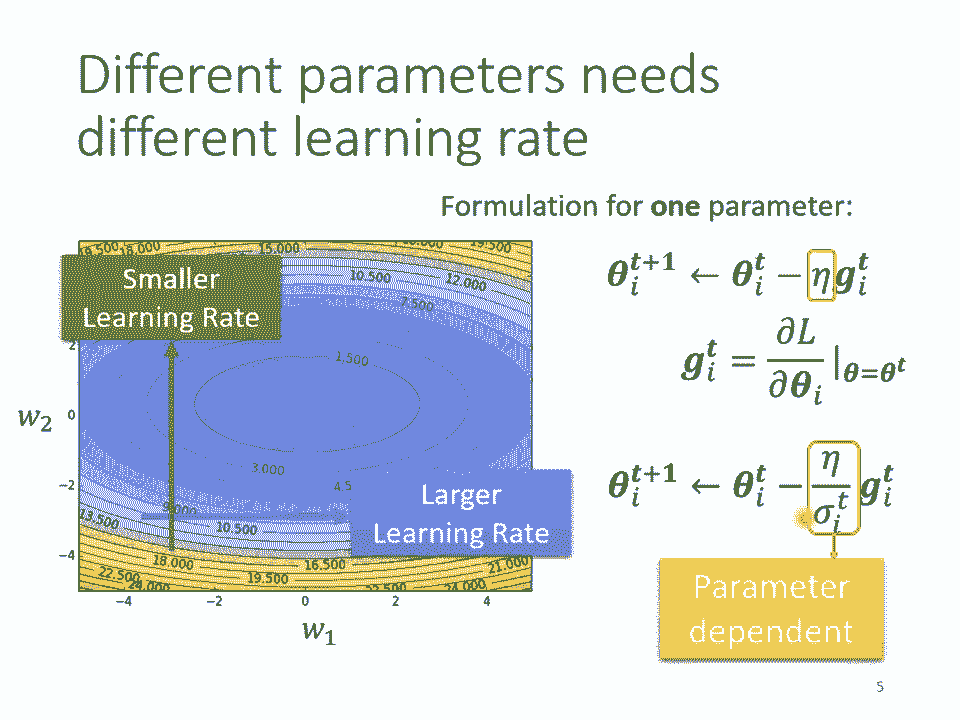

好，那这个sigma呃有什么样的方式可以把它计算出来呢？一个常见的类型是算呃 gradient的ing square什么意思呢？啊，这个是我们现在要参数要upd的式子，我们从达0。

我们等下就不把I念出来了，大家知道我意思这边是考虑某一个参数，所以个下标I等一下为了方便讲是我们就不把I念出来了。好。

达上标零初始化参数减掉这个居零乘上 learningning除以sigma零就得到达那这个sigma零怎么算出来的呢？在第一次upd参数的时候。

这个sigma零呢是居零的平方除以开根号这个居零就是我们的bra的的平方除以开根号啊，那这项呢其实就是居零的绝对值了，对不对？所以你把居零的绝对值带带到这边那这个G0跟这个。它们的大小是一样的。

所以这边呢呃这一项啊只会有一个它要么是正一，要么是负一，就代表说我们第一次呢在upd参数，从se达0upd到se达一的时候，要么是加上艾塔。

要么是减掉艾塔跟readning rate跟这个bra的大小没有关系，只看你这个艾塔的值设多少啊，这个是第一步的状况，那这个地方没有特别重要啊，所以第一步的地方，如果你听的有点模模糊糊就算了。

重点是接下来怎么处理。好，那s达 one呢它要一样减掉规点G one乘上A的除以sigma one现在呢在第二次update参数的时候。

就要除以sigma one不是sigma零是sigma one好这个sigma one是怎么被算出来的呢？这个sigma one就是我们过去所有计算出来的规点，它的平方的平均再开根号。我们到目前为止。

在第一次upate参数的时候，我们算出了G0。在第二次update参数的时候，我们算出了G one。所以这个sigma one呢就是G零平方加G one平方除以2分之1再开根号啊，这个就是好。

我们算出这个sigma one以后，我们的ning就是塔除以sigma one来把达 one减掉塔除以ig one乘以 g one得到同样的操作就反复继续下去。

在达 two的地方你要减掉除以sigma two乘以 g two那这个sigma是什么呢？这个sigma two。那就是过去所有算出来的grd，它的平方和的平均再开根号。

我说以你把G0取平方居Y取平方G two取平方。在平均再开根号得到sigma two放在这个地方，然后upate参数哦，所以这个呢这个过程呢就反复继续下去到第T次update参数的时候啊。

其实这个是DT加一次啊，T加一次upate参数的时候，你的这个sigma t要怎么设定呢？它就是过去所有的 gradientGT从第一步从从第一步到目前为止。

所有所算出来的GT的平方和在平均再开根号得到sigma t，然后把它的除learning，然后用这项当做是新的learning来upate你的参数。

把那这一招呢被用在一个叫做undergrade的方法里面。啊，那为什么这一招是有用的呢？为什么这一招可以做到我们刚才讲的呃，坡度比较大的时候，learning rate就减小，坡度比较小的时候。

learning rate就放大呢。呃，你可以想象说，现在我们有两个参数，一个叫C达 one，一个叫C达QC达 one坡度小C达Q坡度大。你se达 one，因为它坡度小的关系。

所以你在谢达 one这个参数上面算出来的gr呢值都比较小。因为grd算出来的值比较小。然后呃这个sigma是 gradient的ing square gradient的平方和取平均在开根号。

所以然小算出来的sigma就小ma小learning rate就大反过来说se达 two呃这个谢达 two呢是一个比较陡峭的呃这个呃参数在谢达 two这个方向上呢呃lo的变化比较大。

所以你算出来的 gradient都比较大。你算出来比较大，你的sigma就比较大，你的sigma比较大。那你在upd的时候呢。

你的这个你的这个参数update的时候的量啊就比较小所以有了sigma这一项以后呢，你就可以随着 gradient的不同，每个参数规的不同来自动的调整learning rate的大小。好。

那这个呢并不是你今天会用的最终极的版本。好，刚才那个版本还有什么样的问题呢？就算是同一个参数，它需要的learning rate也会随着时间而改变。我们刚才的假设是好像是同一个参数。

它的gra的大小就会固定是差不多的值。但事实上并不一定是这个样子的。举例来说，我们来看这个新月型的er surface。如果我们考虑横轴的话，考虑左右横的这个呃水平线的方向的话。

你会发现说在这个地方坡度比较平滑。所以呃你会发现在这个地方坡度比较陡峭。所以我们需要比较小的learning rate。但是走到了中间这一段的时候呢，坡度又变得平滑了起来，这边坡度比较陡峭。

这边坡度变得平滑了起来。所以我们在这个地方又需要比较大的 learningarning rate，所以就算是同的参数，同的方向，我们也期待说learning rate是可以动态的调整的。所以怎么办呢？

就有了一个新的招数，这个招数叫做RNSproNSpro这个方法有点传奇，它传奇的地方在于它找不到论文对？哎，还说找不到论文，这个方法出自于哪里呢？

非常多年前呢应该是将近10年前ton在上开过d learning的课程。那个时候他在他的课程里面讲了RNSpro这个方法，然后这个方法没有论文，所以你要s的话。

你要set那个呃那个影片的连接这是个传奇的方法，叫RNS。

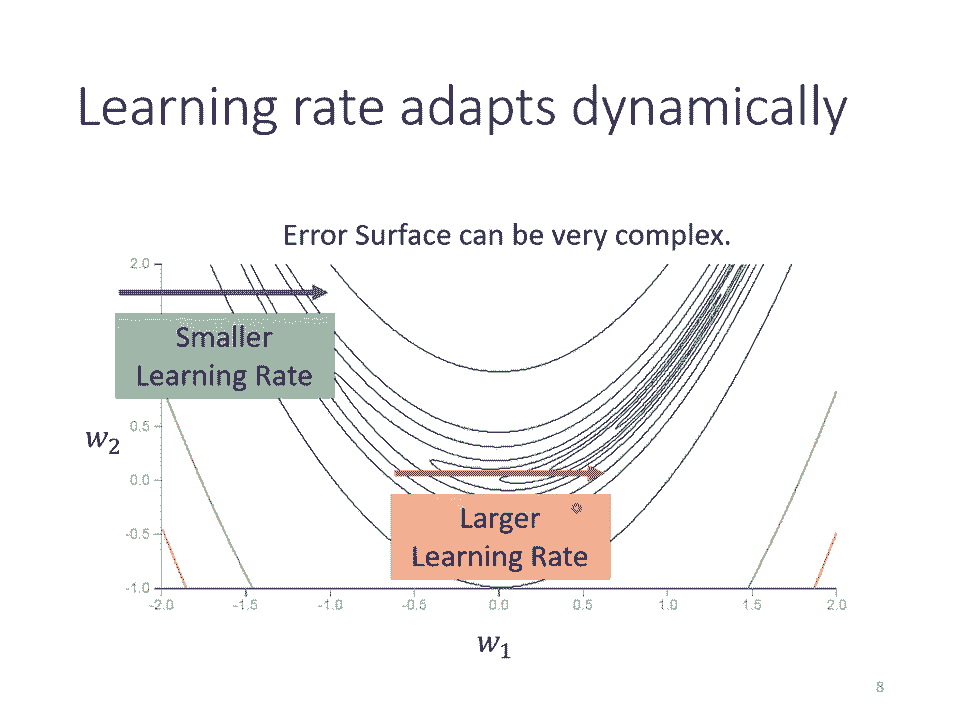

而在这个INS这个方法是怎么做的呢？它的第一步跟刚才讲的算rooming square，也就是那个阿达的方法是一模一样的。哦，在第一步我们就不要看了，我们看第二步第二步有什么不同呢？

一样要算出sigma one，只是我们现在算出sigma one的方法跟刚才算rooming square的时候不一样。刚才在算ing square的时候，每一个规点都有同等的重要性。但在INS里面。

它决定你可以自己调整现在的这个规点。你觉得它有多重要哦，所以在NS里面，我们的这个sigma one呢，它是之前的sigma0全部算成s sigma零里面就是有居零嘛。

所以这个sigma零就代表了这个居零的大小，所以它是igma零的平方乘上阿尔法加上一减阿尔法乘上现在我们刚算出来的新鲜。腾腾的规点就是G one。那这个阿尔法另外一个参数就像任瑞一样。

就你这个你要你要自己调它，它意是一个 hyperperparmeter，你要自己调它。那你可以想象说，如果我今天阿尔法是很小趋近于0。就代表说我觉得G one相较于之前所算出来的规点额也比较重要。

我阿尔法是很大，趋近于一，那就代表说我觉得现在算出来的G万比较不重要啊，之前算出来的规点比较重要。好，所以同理在第三次upate参数的时候，我们要算sigma two，那怎么办呢？

我们就把sig one拿出来取平方再乘上阿尔法。那sigma one里面有G one跟sigma0sigma零里面又有G0。所以你知道sigma one里面它有G one有G0。哦。

然后这个G one跟G0呢，它们会被乘上阿尔法，然后再加上一减阿尔法乘上这个G5Q的平方啊，所以这个阿尔法就会决定说G two它在整个sigma two里面占有多大的影响力。那同样的过程就反复继续下去。

sigmaT等于根号阿尔法乘上sigmaT减一的平方，加上一减阿尔法GT的平方。你用阿尔法来决定现在刚算出来的GT它有多重要。好，那这个呢就是RN。那NS我们刚才讲过说透过阿尔法这项。

你可以决定说GT相较于之前存在sigmaT减一里面的G one到GT减一而言，它的重要性有多大。如果你用N的话，你就可以动态调整ma这一项就我们现在呢假设从这个地方开始。

这个黑线呢是我们的 surface，从这个地方开始呢，你要upate参数啊，你这个球呢就从这边走走走走到这边。会一路上都很平坦，很平坦，就代表说G算出来很小，G算出来很小。

就代表说这个igma算出来很小igma算出来很小，就代表说现在up参数的时候，我们会走比较大的步分。好，接下来继续滚滚到这边，滚到这边以后，我们规点变大了。如果是原来的不是RNSp原来的 grid的话。

它反应比较慢。但如果你用RNSp，然后你把阿尔法呢设小一点，也就是让呃新的刚看到的规点影响比较大的话，那你就可以很快的让sigma的值变大，那可以很快的让你的步伐呢变小，那就可以踩一个刹车哦。

本来很平滑，走到这个地方突然变得很陡，那RNSp呢可以很快的踩一个刹车把 learningning变小。那如果你没有踩刹车的话，你找到这个地方running rate太大了，那规点又很大。

两个很大的东西沉起来，你可能就啪的一下，你就飞出去了，就很快啊就飞出去了，就飞到很远的地方。好，那如果继续走走走，又走到平滑的地方了。呃，因因为这个这个这个现在sigma t啊，你可以调整阿尔法。

让它比较看重于最近算出来的规点。所以你规点一变小，sigma可能就反应很快，它的这个值呢就变小了。然后呢，你走的步伐呢就变大了。这个就是。

那今天你最常用的imization的策略imization策略有人又叫做opim啊这个你今然比较常用的这个imization常用im的策略呢就是adad是什么呢？ad就是加上我们上周讲过的mo。

那aden的演算法跟原始的论文我们就列在头影片上，我们就不细讲可能说不细讲的话，我怎么知道怎么做这个aden呢，今天你不用担心这个to里面都帮你写的好好的了，或者是你打开注教程式来看。

搜寻aden里面就有个地方是aden啊，所以这个你今不用担心这种imim的问题im呢这个的套件往往都帮你做好了。然这个im里面也有一些参数需要调有一些需要人工决定，但是你。

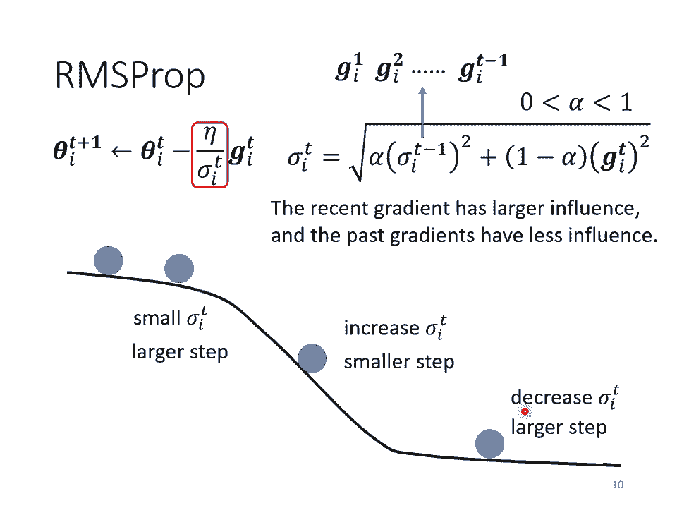

往往用预设的那一种参数就够好了，你自己调，有时候反而会调到比较差的。往往你直接call这个呃拍to里面aden这个upimer，然后那个预设的参数不要随便调，你就可以得到不错的结果了。

那关于aden的细节就留给大家自己研究。好，那我们刚才讲说这个简单的erero surface，我们都串不起来。现在我们来看一下，加上 learningning rate以后劝不串的起来。

好像这边是采用最原始的ad那个做法了，就是把过去呢呃看过的这个learning rate通通都都过去看过的这个graian，通通都呃取平方在平均再开根号当做这个sma。好，那做起来怎么样呢？

做起来是这个样子的，是这个样子的。

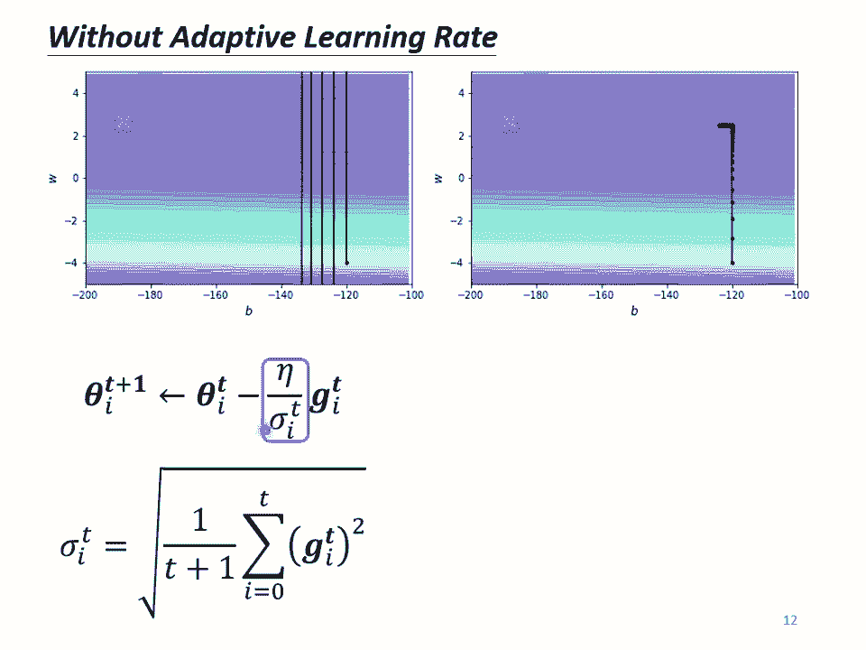

你先不要管这边，我知道你看到这个一定觉得大吃一惊啊，这个到底是怎么回事，这个黑压压的到底是什么东西，是是打翻墨水了。先不要管这边先不要管这边啊，你这个走下来哎，没有问题，然后接下来在左转的时候啊。

在左转的时候，刚才我们upd了10万次，这边也是upd10万次了。啊，刚才upate10万次只卡在这个地方。但现在阿大会以后你可以再继续走下去，走到非常接近终点的位置。为什么阿大会可以继续走下去呢。

因为当你走到这个地方的时候，你因为这个左右的方向的这个 gradientd很小，所以 learningning瑞会自动调整，左右这个方向 learningning瑞会自动变大。

所以这个步伐呢就会以变大就可以不断的前进。接下来的问题就是为什么走到这边突然爆炸了呢？为什么走到这边突然爆炸了呢？你想想看哦，我们在算这个sigma的时候。

我们是把过去所有看到的 gradient点都拿来做平均。所以这个纵轴的这个方向啊，这个纵轴的方向。所以在初始的这个地方感觉规点很大，但是这边走了很长一段路以后，这个纵轴的方向规点算出来都很小啊。

所以纵轴的这个方向，这个这个呃呃Y轴的这个方向啊，就累积了很小的sigma。因为我们在这个Y轴的方向看到很多很小的 gradient点，所以我们就累积了很小的sigma累积到一个地步以后。

这个step就变很大，然后就倒走就喷出去了这样就喷出去了。但喷出去以后没有关系，有办法修正回来。为什么因为喷出去以后就走到了这个规点比较大的地方，走到规点比较大的地方以后，这个sigma呢又慢慢的变大。

那sigma慢慢变大以后，这个参数upate的距离update的这个步伐大小又慢慢的变小。所就发现说哎走着走着突然往左右喷了一下，但是这个喷这个喷了一下，不会永远就是震荡，不会做简谐运动，停不下来。

它这个左这个这个力道会慢慢变小，有摩擦力啊，让它慢慢的慢慢的又回到中间这个峡谷来。然后但是又累积一段时间以后又会喷，然后又慢慢的回来一下，怎么办呢？有一个方法也许可以解决这个问题。

这个叫做runarning ratechedcheduling。

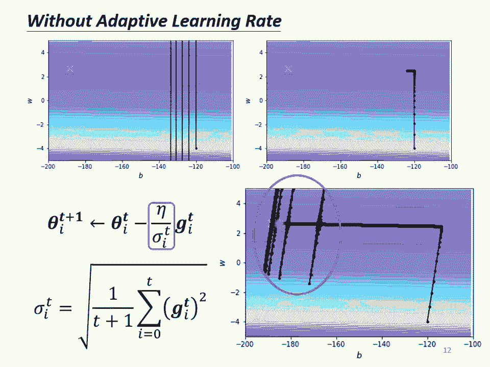

什么是learning rate的 scheduling呢？我们刚才这边呢还有一项艾，这个艾达呢是一个固定的值。learning rate scheduling的意思就是说这个艾它要是跟时间有关的啊。

我们要把它当做一个长数，我们把它跟时间有关。好，那lening rate怎么让它跟时间有关呢？最常见的策略啊叫做learning rate decay。也就是说呢，随着时间不断的进行。

随着参数不断的update，我们这个at塔让它越来越小。这个也是合理的，为什么会这样想呢？为什么要让这个learning rate越来越小呢？因为一开始我们距离终点很远，随着参数不断upd。

我们距离终点越来越近，所以我们把learning rate减小，让我们的呃参数的更新才一个刹车，让我们参数的更新能够慢慢的慢下来。哦，所以刚才那个状况，如果加上learning decay有办法解决。

有办法解决。刚才那个状况如果加上learning decay的话，我们就可以很平顺的走到终点。因为在这个地方这个at已经变得非常的小了it塔变得非常的小。虽然说呃呃它本来想要左右乱喷。

但是会乘上这个非常小的it塔啊就停下来了，就可以慢慢的走到终点。

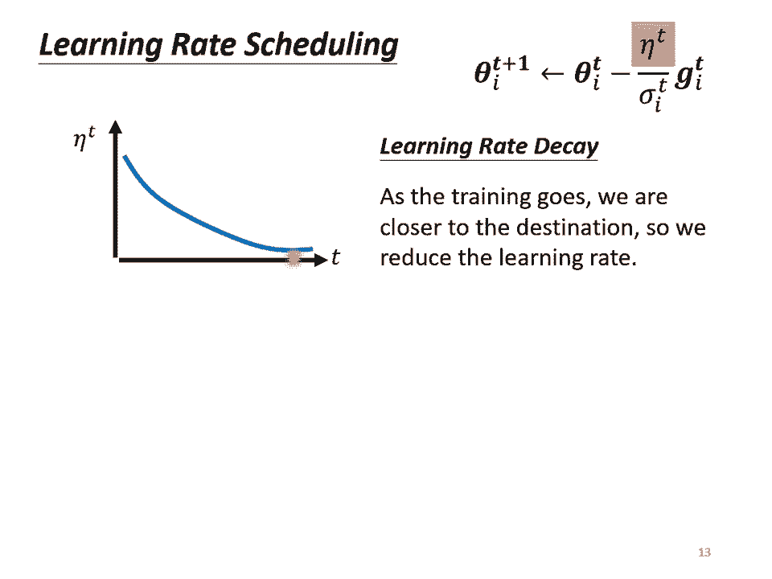

哦，那除那除了lening decay以外，还有另外一个今天非常常用的learning scheduling的方式叫做one up。那我本来很犹豫要不要讲one up这件事啊。

但是其实我们有一个跟berrt有关的作业，你可能需要用到one up才够得到好的结果。所以我们还是把one up拿出来讲一下one up这个方法听起来有点匪夷所思这one up的方法是说我们这个learning rate啊要先变大后变小这样那你会问说那变大要变到到多大呢？

变大速度要多快呢？变小要变小速度要多快呢，这个也是per parametermeter，你要自己用手调的但是大方向的大策略就是learning rate要先变大后变小。那这个方法听起来很神奇。

就是一个黑科技这样这个黑科技啊出现在很多远古时代的路。

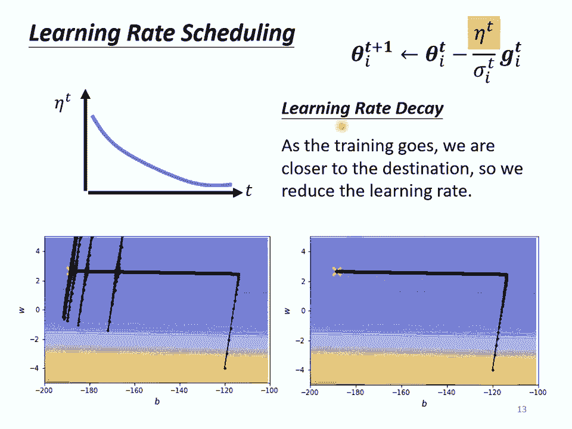

文里面这个wup最近因为在birt的那个呃在训练brt的时候，往往会需要用到wup，所以又被大家常常拿出来讲，但它并不是有birt以后才有wup的w up这个东西远古时代就有了。举例来说。

receive your里面是有的这边是放了receive your放在上面的文章连接了。就今天这种有关 learning的文章往往呃在投conference之前投国际会议之前就会先放到一个叫做archive的网站上把它公开来让全世界的都可以看。

那你其实看这个archive的网址，你就可以知道这篇文章是什么时候放到网络上的，怎么看呢？archive的这前四个数字，这一5啊代表年份。

所以代表说receive your这篇文章是2015年放到上面的后两个数字代表月份，所以它是15年的是2月15年的年底放在ive上。所以56年前的文章。

那在d learningning这个变化这么快这个领域里面，56年前就是呃上古时代上古时代。那在上古时代的这个rec network里面就已经记载了one up的这件事情。

他说我们用learning rate0。01去one up。先用learning rate0。01，再把learning rate改成0。1。

就过去我们通常最常见的劝learning schedule的方法就是让lening rate越来越小。但是receive your这边特别注明它反其道而行。一开始要设0。01，接下来设0。1。

还特别加个注解，说一开始就用0。1，反正就劝不好，不知道为什么也没解释，反正就是劝不好，需要w up这个黑科技。而在这个在这个黑科技呢，在知名的transformer里面。

那我相信很多同学可能都听过transformer这个技术。我们这门课也会讲到transformer这个东西。

这个黑科技啊在transformer里面也用一个式子提了它啊他这边有一个子说它的 learningarning呢遵守这一个神奇的function来设定它的learning一个神奇的方你乍看之下会觉得哇在写什么。

不知道在写些什么。但这个东西啊你实际上把它的把这个方画出来，你实际上把回损三画出来的话，就会发现它就是one up learningning rate会嫌增加，然后接下来在递减。

所以发现说one up这个技术在很多知名的naval里面都有被当做一个黑科技就论文里面不如解释说为什么用这个但就偷偷在一个小地方你没有注意到小地方告诉你说这个要用这种黑科技呢才能够把它训练起来。

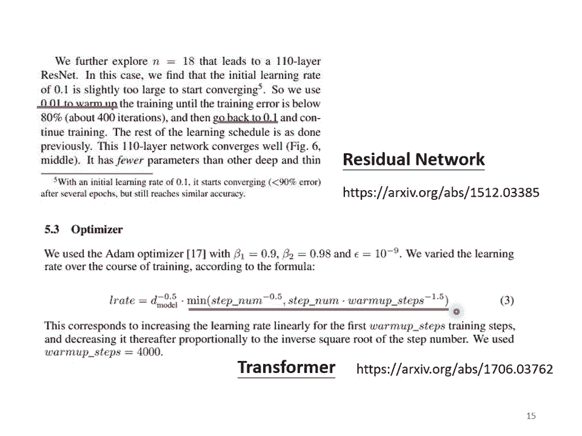

好，那为什么需要w up呢？这个仍然是今天一个可以研究的问题了。我并不认为为什么要用w up这件事已经获得了完全的解答。但是这边有一个可能的解释是说呃，你想看当我们在用adam r或阿达的时候，呃。

我们会需要计算sigma，这个sigma是怎么来的？它是一个统计的结果对不对？就sigma告诉我们说某一个方向它到底有多陡或者是多平滑。那这个统计的结果要看的够多笔数据以后，这个统计才精准。

所以一开始我们的统计是不精准的，一开始我们的sigma是不精准的。所以我们一开始呢不要让我们的参数走离初始的地方太远。其实让他在初始的地方呢做一些呃像是探索这样所以一开始比较小呢。

是让他探索收集一些有关。Aal surfaceface的情报啊，先收集有关sigma的统计数据，等sigma统计的比较精准以后，再把让 learningning瑞呢慢慢的爬升。

所以这是一个呃解释为什么我们需要w up的可能性。那如果你想要学更多有关w up的东西的话，你其实可以看一篇paper。它是aden的进阶版叫做readden啊里面对w up这件事情呢有更多的。好。

那有关optimization的部分，其实我们就讲到这边了。所以我们从最原始的 gradientientdes进化到这个版本。这个版本里面有什么东西呢？第一个我们有moment。

也就是说我们现在不是完全顺着bra点的方向，不是现在不是完全顺着这一个时间点算出来的规点的方向来off对参数，而是把过去所有算出来的规点的方向做一个加总当做up day的方向。这个是moment。

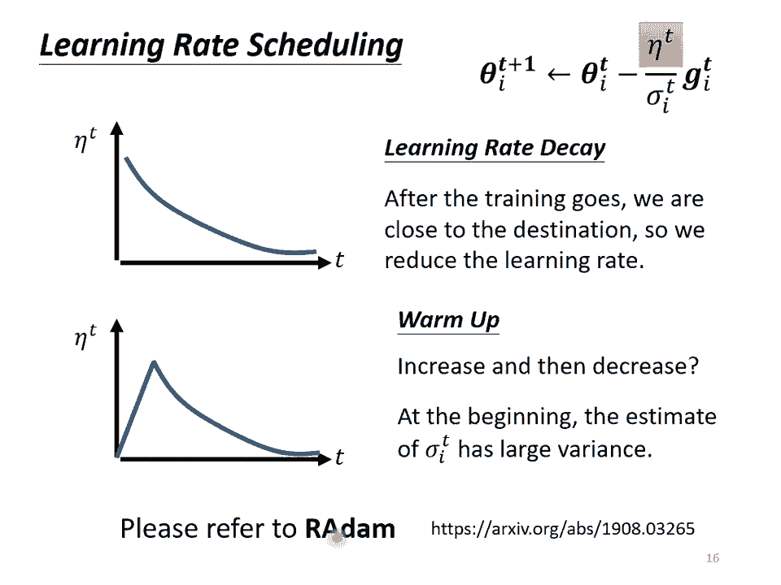

那，接下来到底应该要upate多大的步伐呢？我们要除掉bra的rooming square。那讲到这边可能有同学会觉得很困惑。这个moment是考虑过去所的观点。这个sigma也是考虑过去所有的规点。

这个一个放在分子，一个放在分母都考虑过去所有的规点，不就是正好抵消了吗？但是其实啊这个moment跟这个sigma，他们在使用过去所有 gradient点的方式是不一样的。

moment是直接把所有的 gradient点通通都加起来，所以他有考虑方向，他有考虑规点的正负号，他要考虑规点是往左走还是往右走。但是这个roing square。

它就不考虑 gradient点的方向了，他只考虑 gradient的大小。记记得我们在算sigma的时候，我们都要取平方向，我们都要把 gradient点取一个平方向，我们是把平方的结果加起来。

所以我们只考虑bra的大小不考虑它的方向。所以moment跟这个sigma算出来的结果并不会互相抵消掉。啊。

最后我们还会加上一个learning rate的chedcheduling这个是今天optimization完整的版本啊，这种opimizer除了eden以外，aden可能是今天最常用的。

但是说aden以外还有各式各样的变形。但其实各式各样的变形都不拖，就是要么不同方法算M，要么不同的方法算sigma，要么不同的learning schedul的方式。好。

那如果你想要知道更多跟optimization有关的事情的话，那有之前助教的录影给大家参考了这影片蛮长的大概两个小时。

所以你可以想见说哎有关这个optim的东西其实是还有蛮多东西可以讲但为实践关系我们就不讲下去。然后到目前为止呢，我们讲的是什么？我们讲的是当我们的ero surface非常的崎岖，啊。

就像这个呃这个例子一样啊，非常的崎岖的时候，我们需要一些比较好的方法来做optimization前面有个山挡着我们希望可以绕过那座山就是山不转路转的意思好那你知道这个规点呢就这个这奇怪的 surface啊就会让人觉得很痛苦。

对不对？达喵康达喵来到这会怎么样呢？再就是要用神罗天真把这个地炸。

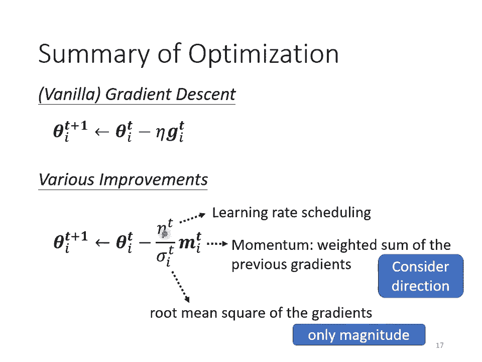

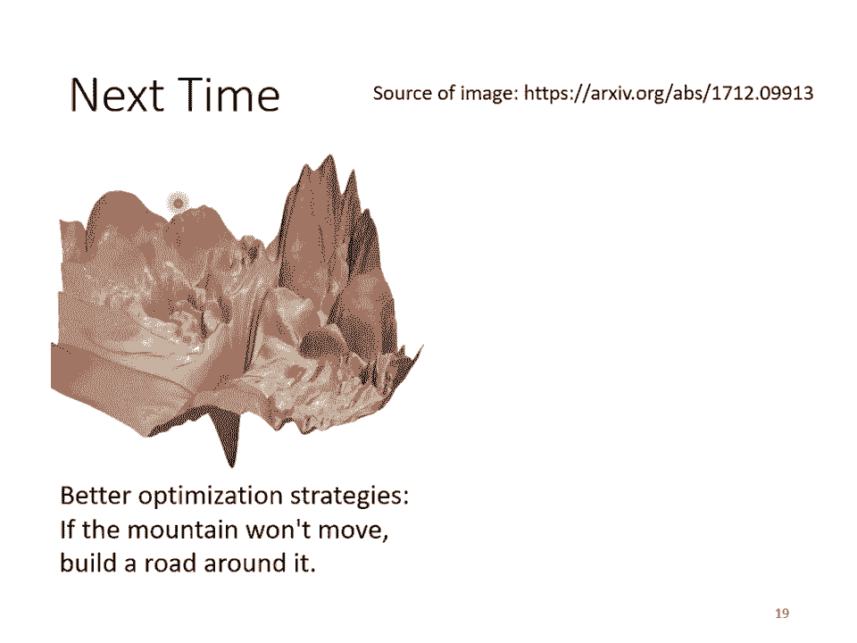

所以用接下来我们会讲的技巧就是有没有可能直接把这个aero surface移屏我们改内沃里面的什么东西，改内 world的架构actvation function。

或者是其他的东西直接移屏erero surface，让它变得比较好圈，也就三挡在前面，就把三直接产屏的意思。

