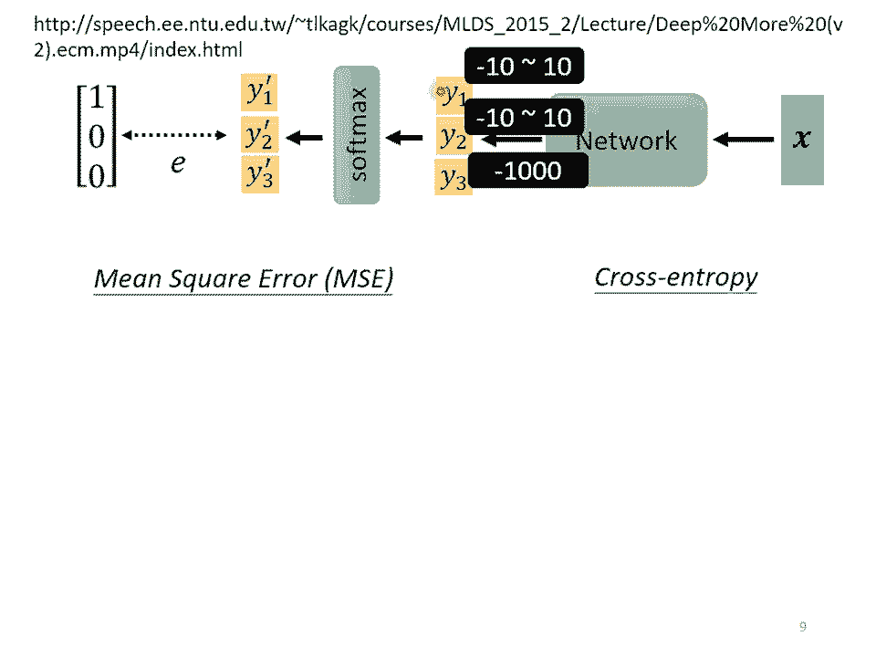

# 【国语+资料下载】李宏毅 HYLEE ｜ 机器学习(深度学习)(2021最新·完整版) - P7：L5- 网络训练4：损失函数 - ShowMeAI - BV1fM4y137M4

好，那接下来呢我们要讲有关分类怎么做这件事情。然后这边讲的呢是一个短的版本。因为时间有限的关系，所以我们就讲一个可以在20分钟内讲完的短的版本。既然有短的版本就是有长的版本。如果你想要看长的版本的话。

可以看一下过去上课的录音。那过去可能是花两个小时到3个小时的时间才讲完分类这件事情。那我们这边呢用一个最快的方法直接跟你讲分类是怎么做的。好，分类是怎么做的呢？

我们已经讲了regress regression就是输入一个向量，然后输出一个数值，我们需要输出的数值跟呃某一个label，也就是我们要学习的目标呢，越接近越好。有同学问说，哎。

为什么这个目标label有加headt，而不是输出有加headt呢？你可能在别的地方有看过。

出有加headt。那这边的notation呢，它的使用并没有一定的规定啊。如果你先上过我的机器学习的话，你就就会去问别的老师说，哎，为什么你的model的输出有加hat。

然后你的la没有加headt这样好，所以我们这门课呢如果是正确的答案就有加hat。那model的输出没有加headt。好，那有一个可能啊，假设你会用regression的话。

我们其实可以把transification当做是regress来看。怎么说呢？但这个方法不一定是一个好方法，这是一个比较奇妙的方法。你可以说一样输入一个东西以后，我们的输出仍然是一个calner啊。

它叫做Y。然后这个Y啊，我们要让他跟正确答案，那个class越接近越好。但是Y是一个数字啊，我们怎么让它跟class越接近越好呢？我们必须把class也变成数字。举例来说。

也就是说class one就是编号一，class two就是编号2，class3就是编号3啊。然后接下来呢我们要做的事情就是希望Y可以跟class的编号越接近越好。但是这会是一个好方法吗？

如果你仔细想想的话，这个方法也许在某些状况下是会有瑕疵的。但是因为但因为你如果你假设说class one就是编号一class two就是编号2class三就是编号3。

意味着说你觉得class一跟class2它是比较像的。好，然后class一跟class3，它是比较不像的。那像这样子的呃表示class的方式有时候可行，有时候不可行。

假设你的class one two three真的有某种关系举例来说啊，你想要根据一个人的身高跟体重，然后预测它是几年级的小学生，一年级二年级还是三年级。那可能一年级真的跟二年级比较接近。

一年级真的跟三年级比较没有关系。但是假设你的三个class本身并没有什么特定的关系的话，你说class one是一class two是2class two是3，那就很奇怪了。

因为这样子预说一2有比较近的关系，一三又比较远。关系。所以怎么办呢？当你在做分类的问题的时候，比较常见的做法，比较常见的做法是把你的class用one half vector来表示。

那one half factor，我们在作业一的时候有看过，对不对？我们在作业一的时候说，我们把美国的周用one half vector来表示。那同样的道理。

我们可以把每一个class用一个one half vector来表示。如果有三个class，我们的label这个Y hat就是一个三维的向量。然后呢如果是class one就是100。

如果是class two就是010。如果是class3就是001好，所以每个class你都用一个one half vector来表示，而且如果你用one vector来表示的话。

就没有说啊class one跟 class two比较接近class one跟class3比较远这样子的问题。如果你把这个one factor拿来算距离的话，class之间两两他们的距离都是一样的。

好，那接下来呢如果我们今天的目标Y head是一个向量，比如说这边把Y ahead是有三个eleement的向量，三个数值的向量。那我们的也应该要open三个数值才行。

那到目前为止我们讲的其实都只open一个数值。因为我们过去做的都是re的问题，所以只open一个数值。那怎么把它改成open三个数值呢，其实从一个数值改到三个数值，它是没有什么不同的了。怎么说呢？

啊你可以open一个数值，你就可以oper三个数值，所以把本来open一个数值的方法重复三次你把A one a two A3乘上三个不同的位加上bias得到Y one再把A one a two A3乘上另外三个位再加上另外一个得到把A one A A3再乘上另外一组位再加上另外一个得到3。

你就可以产生三组数值。所以你就可以一个。产生Y oneY toY3，然后期待Y oneY toY3跟我们的目标越接近越好。

好，那所以我们现在知道了regress是怎么做的，imput x yY要跟label y越接近越好。如果是classification呢，我们刚才说imput X X呢可能乘上一个W，再加上B。

再通过 function，再乘上W plan，再加上B得到Y。那么们现在的Y呢它不是一个数值，它是一个向链。但是在做class的时候。

我们往往会把Y再通过一个叫做soft max的 function得到外快。然后呢，我们才去计算wifi跟Y head之间的距离，才去说我们要让wifi跟Y head越接近越好。

为什么要加上st max呢？一个。比较简单的解释啊啊这一段呢到底要怎么在数十分钟内讲完，我其实讲了很久。如果是在过去的课程里面，我们会花很长一段时间告诉你说这里为什么要加s max它背后有什么样的假设。

我们会先从genative model开始讲起，然后一路讲到log regression，你就会知道为什么这边放个sof max，还有什么样的历史渊源。那我们现在已经不是从那个角度切入。

所以就有点不知道要怎么解释说为什么要放s max，那这边有一个呃骗小孩的解释，就是这个Y hat啊，它里面的值都是零跟一，对不对？

我们它是one hard这里面的值只有零跟一啊那Y呢Y里面有任何值Y里面有任何值。嗯，既然我们的目标只有零跟一，但是Y有任何值，那呃我们能不能够就先把这个任何值啊，先把它 normalmalize。

1到0到1之间，啊这样才好跟label的计算相似度。好这是一个比较简单的讲法了。如果你真的想要知道说为什么要用sof max的话，你可以参考过去的上课录音。那如果你不想知道的话，你就记得一件事。

这个sof max要做的事情，就是把本来Y里面可以放任何值这件事情改成挪到0到1之间。好，那sm它里面是怎么做运作的呢？啊，这是这个sofm的b输入Y one y two y3。

它会产生Y one y two y 啊，它里面运作的模式是这个样子的里面运作的模式是这个样子的。我们会先把所有的Y取一个ex所以本来不管Y呢是正的还是负的。

反正取完 exponentialpon以后就都变得正的，对不对？就是复数负小于零的值取以后也变成正的。然后你再对它做normalize除掉所有Y的ex值的和，然后你就得到或者说图示化的方法是这个样子啊。

Y one取 exponential y two取 exponential把全部加起来得到一个sub。

得到一个s放在分母地方的s接下来呢再把exponential y one除掉s exponential y two除掉s3除掉s。

到Y one pointY two pointY3 point就这样。反正有了这个式子以后，你就会发现说这个Y one prime啊。

这个呃Y这个YI派啊YYY one pointY two pointY3 prime啊，他们都是介于0到1之间的。然后呢，这个Y one pointY two pointY3派，它们的和呢会是一啊。

它们的和呢会是一。好，那如果举一个例子的话呢，本来Y one等于3Y就等于1Y3等于-3取完exponential的时候呢，就变成呃exponential3啊，就是20exponent一就是2。

7exent负3就是0。05。然后做完malization以后啊，这边就变成0。880。12跟0。所以这个s mix它要做的事情呃除了nmalize以外。

除了让Y one pointY twoY3变成0到1之间还要合为一以外，它还有一个附带的效果是它会让这个大的值跟小的值啊，它们的差距更大。所以本来-3。

然后通过这个exponent再做nmalize以后最后呢会变成趋近于零的值。然后这个soback的输入啊呃往往就叫它logic，它是有名字的啊，有时候就叫它logic。哦。

那这边呢是考虑了三个class的状况。那如果两个class会是什么样呢？如果是两个class，你当然可以直接套so max这个 function没有问题。但是也许你更常听到的是。

当有两个class的时候，我们就不套soft max，我们直接取sign。那当两个class用signmore跟s max两个class他们之间的关系是什么呢？你其实可以自己想一想，你如果推一下的话。

会发现说这两件事情是等价的。就你就我我知道说我这边讲s max，那sof max当然做在两个class上肯定是没有问题的。那你更常看到的是两个class的时候，就用sign，你可能会问说哎。

这两者有什么不同，哪一个比较好呢？那我这边告诉你他们是一模一样。你自己回去推一下会发现说这两件事情是同一件事情。

好，那所以呢我们把X丢到一个n里面产生Y以后啊，我们会通过s max得到wifi再去计算Yfi跟Y head之间的距离。这个写作一。那计算wifiwihead之间的距离啊有不止一种做法。举例来说。

你可以说啊，如果我喜欢的话，我要让这个距离是min square error跟作业用的一模一样啊，就是把wifi的就是去计就是把wifi里面的每个ele拿出来。

把wihead里面每个 element拿出来，然后计算他们的平方和，然后当做我的，这也是一个做法，这样也是计算两个向量之间的距离，你也可以说你也可以做到说啊当minize error的时候。

我们可以让wihead等于wifi。啊，但是有另外一个更常用的做法叫做pro entropy。那这个pro entropy，它的式子啊乍看之下会让你觉得有点匪夷所思。怎么是这个样子呢？

我们现在看看这个pro entropy的式子长什么样，它是 over所的I，然后把Yhead第I维拿出来，乘上wi派的DI维取naural law，然后再全部加起来，这个是pro entropy。

那当wi head跟wifi一模一样的时候，你也可以minize cross entropy的值。当wifi跟Y head一模一样的时候，NSE会是最小的cro entropy也会是最小的。

但是为什么会有pose entropy这么奇怪的事出现呢？那如果要讲的长一点的话，这整个故事，我们可以把它讲成啊mimize cross entropy其实就是mimize likelihood这个东西。

那你可能在很多地方都听过like这个词汇，但是因为这堂课里面我们把li拿掉了。所以我们现在根本就没有li这个东西就我就不能往这个方向解释。

我们就不能说ize cross entropy为什么是mimize likelihood那么其实不知道 likelihood是什么，但是这两件事情其实是等价的啦。所以如果有一天有人问你说。

如果我们今天在做分类问题的时候，mimize likelihood跟mize cross entropy有什么关系的时候，你不要回答说啊他们其实很像，但是其实又有很妙的不同这。

不是这样他们两个就是一模一样的东西，只是同一件事不同的讲法而已。所以假设你可以接受说我们在训练一个classify的时候应该要mimize likelihood就可以接受我们应该要ise cross entropy。

但是我们没有讲这件事。所以我要怎么说服你我们应该要用cro entropy呢？下一页投影片是从 optimizationim的角度来告诉你说crose entropy比me squarearrow更加适合用在分类上。

那cro entropy真的相较于 means square error是更常用在classification上面的。所以它常用到什么地步呢？它常用到在pi里面。

cro entropy跟sof max他们是被绑在一起的，他们是一个你只要co cross entropy里面就自动内建了sm所以如果你看助教作业二的城市的话，你会找不到s max在哪里？

就本来sof max应该是的一部分呢。说你在定义的时候，你应该也定义了so max这个。但是你发现在注教市里面，你找不到s max为什么它放在cro entropy里面。

当你使用cro entropy这个 function的时候。pyto自动帮你把sof max加到你的na的最后一层。所以如果你今天这用pito，你自己在na加s max的时候。

你用cro entropy就会变成加了两次sof max的这个一个to一个有趣的设计。哎，所以这显示说哎sof max跟 cross entropy，他们往往是被绑在一起的。他们是ex个et啊。

总是会被一起使用。那接下来呢我从opimization的角度来告诉你说，为什么相较于呃min error cross entropy是给更被常用在分类上。那这个部分你完全可以在数学上面做证明。

但是我这边是直接用举例的方式来跟你说明。如果你真的非常想看数学证明的话，我把连接放在这边，你可以看一下过去上课的录音。但如果你不想知道的话。

那我们就是举一个例子来告诉你说为什么cros entropy比较好。好，那现在我们要做一个三个class的分类。

我们的内先输出Y one y twoY3再通过s max以后产生Y one point two跟Y。

好，接下来假设我们的正确答案就是100，我们要去计算100这个向量跟Y one派Y two point跟Y3派它们之间的距离。那这个距离我们用一来表示。

一可以是 means squarearrow也可以是pose entropy。好，那我看一下，如果我们这个一设定为min squarearrow跟 cross entropy的时候。

算出来的arrow surface会有什么样不一样的地方。我们现在假设Y one的变化是从-10到10Y two的变化，也是从-10到10Y3，我们就固定设成-1000。因为Y3设很很小啊。

Y3设-1000，所以过 max以后，Y3就是非常趋近于0啊。那它跟正确答案非常接近。所以它对我们的结果影响很小。总之我们Y3设一个定值，我们只看Y one跟Y two有变化的时候。

对我们的一对我们的lo，你知道把很多个一加起来就变成los嘛，对我们的los有什么样的影响。

好，底下这两个图啊就分别在我们一是minarrow跟 entropy的时候，Y one y twoY one y two的变化对lo的影响，对arrow surface的影响。

那如果今天Y one很大Y two很小Y one很大Y two很小。那Y one很大Y two很小就代表Y one会很接近一Y two会很接近于。

所以不管是对min grayarrow还是 entropy而言，Y one大Y two小的时候，lo都是小的啊，我们这边是用红色代表lo大，蓝色代表lo小。那左上角这边Y one小Y two大的时候。

Y one小Y two大的时候，如果Y one小Y two大的话，这边Y one就是0Y two就是一。所以这个时候lo会比较大。所以这两个图都是左上角lo大，右下角小。

所以我们就期待说我们最后在全ing的时候，我们的参数可以走到右下角的地方。那假设我们开始的地方都是左上角的地方会有什么问题呢？你会发现说如果我们选择crotro，左上角这个地方它是有斜率的。

所以你有办法透过 gradient一路往右下的地方走。但如果你选minarrow的话，你就卡住了，你知道吗？min error在这种lo很大的地方它是非常平坦的。

它的 gradient是非常小趋近于零的。如果你初始时这个地方离你的目标非常远，但它很小，你就会没有办法用利的走大。走到右下角的地方去所以如果你今天自己在做classification。

你选min error的时候，你有非常大的可能性会吹不起来。当然这个是在你没有好的好的ization的情好好的im情况下，今天如果你用adam啊这个地方呃规点很小，那规点很小之后。

它 learningning会自动帮你调大，也许你还是有机会走到右下角，不过就会让你的training比较困难一点，让你的training起步呢？比较慢一点。好所以这边有一个很好的例子是告诉我们说。

就算是lo function的定义，都可能影响呃training是不是容易这件事情。我们刚才说要用神罗天真直接把er surface炸这边就是一个好的例子告诉你说。

你可以改lo function居然可以改变ization的难度。

