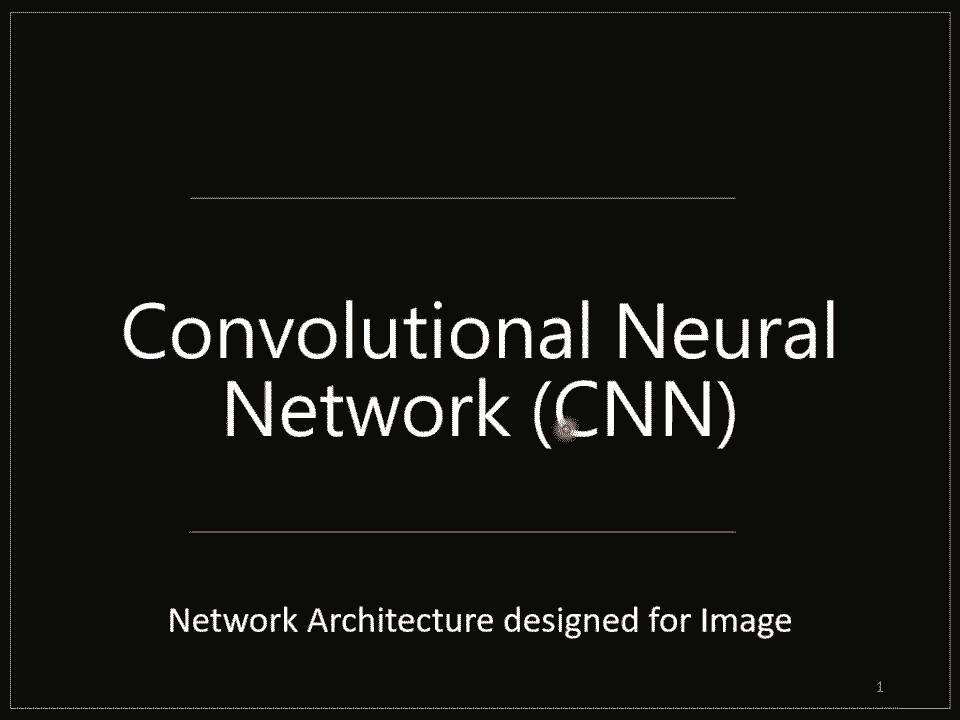
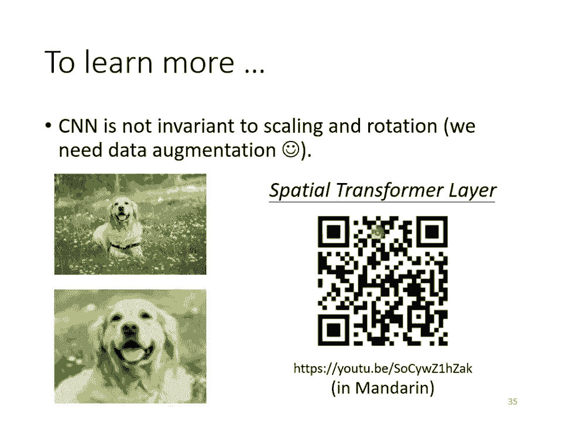

# 【国语+资料下载】李宏毅 HYLEE ｜ 机器学习(深度学习)(2021最新·完整版) - P8：L7- 卷积神经网络 - ShowMeAI - BV1fM4y137M4

我们要来讲n world的架构，我们开始探讨n world的架构设计。那么第一个跟大家讲的nval架构的变形呢是convolutional的 neuralural network，它的缩写呢就是CNN。

那这个CNN呢它是专门被用在影像上的啊我希望通过CNN这个例子来让你知道说nval的架构它的设计有什么样的想法。那为什么设计n的架构可以让我们的呃呃nval结果做的更好。

好，那我们接下来呢要讲的例子是跟影像有关的。我们今天就想象说我们要做影像的分类，也就是给机器一张图片，他要去决定说这张图片里面有什么样的东西。好，那怎么做呢？我们已经跟大家讲过怎么做分类这件事情。

在以下的讨论里面，我们都假设我们的模型输入的图片大小是固定的。举例来说，它固定输入的图片大小都是100乘100的解析度。我们假设说不会突然出现大小不一的照片。其实今天一般在做影像辨试的时候。

往往都有这样子的假设就算是今天这个deep learning已经这么的pular，我们往往都还是需要假设说一个模型输入的影像大小都是一样的。但说图片可能有大有小啊，而且不是说图片都是正方形。

大家有长方形的怎么办？今天常见的处理方式丢进影像辨识系统，处理方式就是把所有图片都先rekill成大小一样，再丢到影像的辨识系统里面。好，那我们的模型的输出应该是什么呢？我们模型的目标啊是分类。

所以我们会把每一个类别表示成一个one heart的 factor。我们的目标呢就叫做Y hand。好，那在这个one hard vector里面呢，假设我们现在的类别是一个猫的话。

那猫所对应的dimension，它的数值就是一，其他的东西所对应的dimen的数值就是0。那这个dimenion的长度就决定了你现在的模型可以辨识出多少不同种类的东西。如果你这个向量的长度是2000。

就代表说你这个模型可以辨识出2000种不同的东西。那今天比较强的你像辨识系统往往可以辨识出1000种以上的东西甚至到上万种不同的object。那如果你今天希望你的你像辨识系统。

它可以辨识上万种upject。那你的label就会是一个上万维维度是上万的呃one vector。好，那我们的模型的输出啊，通过soft max以后输出是wifi。

然后呢我们就是希望wifi跟wihead，他们的cro entropy越小越好。那有关这个cro entropy的部分呢，我们已经跟大家讲过了，所以相信这个地方大家不是问题。

接下来的问题是怎么把一张影像当做一个模型的输入呢？那我们现在看一下对呃电脑来说，一张影像是什么样的东西。那其实对个 machine来说呢，一张图片其实是一个三维的tenor啊。

什么叫做tensoror是什么的话，你就想成它是维度大于二的矩阵，哎，就是tensor就是呃矩阵是二维的嘛，那二维以上的呃超过二维的矩阵啊，就叫它tensor一张图片它是一个三维的tensor。

那三维呢其中一维代表图片的框。另外一位代表图片的高，还有一位代表图片的channel的数目。那个所谓的channel是什么意思呢？一张彩色的图片呢，今天它每一个pixel都是由RGB3个颜色所组成的。

所以这三个channel就代表了RGB三个颜色。那长跟宽就代表了今天这张图片的解析度代表这张图片里面有的pixel有的像素的数目。好那接下来啊我们就要把这一个呃三维的tensor把它拉直。

我们它拉直以后就可以丢到一个naval里面去了。就记得吗？到目前为止我们所讲的novavo它的输入其实都是一个向量。所以我们只要能够把一张图片变成一个向量，我们就可以把它当做是navo的输入。

但是怎么把这个三维的tensor变成一个向量呢？那最直觉的方法就是直接拉直它一个三维的tensor里面有几个数字呢？有在这个例子里面有100乘100乘以3个数字。

所以一张图片是由100乘100乘以3个数字所组成的，把这些数字通通拿出来排成一排就是一个巨大的向量，这个向量可以作为navo的输入。而这个向量里面每一维它里面存的数值，其实就是某一个pixel。

某一个颜色的强度，对不对？每个pixel有RGB3个颜色都组成，每个颜色都有一个数值，代表说这个颜色的强度。在这个向量里面，每一回它的数值就代表了某一个位置的某一个颜色的强度。而那这个向量啊。

我们可以把它当做是一个nl的输入。那我们到目前为止只讲过了fullyly connected network。好，那如果我们把这个向量当做内的输入，那我们音部这边这个feature vector啊。

它的长度就是100乘100乘以3，非常长的一个vector。那假设我们现在的第一层的 neural的数目有1000个，那你能计算一下呃，这边第一层总共有多少个weightt吗？

我们每一个 neuralral，它跟输入的向量的，每一个数值都会有一个weight。所以如果输入的向量长度是100乘100乘3，有1000个 neuralral。

那我们现在第一层的weight就有1000乘100乘100乘3，也就3这10的7次方，是一个非常巨大的数目。那如果参数越多，会有什么样的问题呢？是吧随着参数的增加，我们可以增加模型的呃弹性。

我们可以增加它呃他的能力。但是我们也增加了overfitting的风险。有关什么叫模型的弹性到底overfiing怎么产生的。下周吴佩元老师会从数学上给大家非常明清楚的证明。那我们这边就讲概念上。

如果模型的弹性越大，就越容易overfitting。那我们怎么。呃，怎么减少在做影像辨视的时候，怎么避免使用这么多的参数呢？那考虑到影像辨视这个问题本身的特性。

其实我们并不一定需要无理connect这件事。考虑影像本身的特特性，我们其实不需要每一个neural跟input的每一个dimenion都有一个wa。怎么说呢？

接下来就是对影像辨视这个问题对影像本身的特性的一些观察。第一个观察是对影像辨视这个问题而言，假设我们想要知道说啊这张图片里面有一只动物这个动物是一个鸟，要怎么做呢？也许对一个影像辨视的系统而言。

对一个影像辨视的neural，对一个影像辨视的类神经网路里面的神经而源源而言，它要做的就是侦测说现在这张图片里面有没有出现一些特别重要。的patter和这些pattern是代表了某种物件的。举例来说。

如果现在有某个妞肉说他看到鸟嘴这个patter，有某个妞肉又说他看到眼睛这个patter，用某个 new肉说他看到鸟爪这个patter，也许看到这些patter综合起来就代表说我们看到了一只鸟。

那神经网络就可以告诉你说，因为看到这些patter，所以他看到了一只鸟。那也许你会觉得说啊看pa，然后决定他是什么，这件事情好像没有很聪明。哎。

仔细想想人是不是也是用同样的方法来看一张图片中有没有一只鸟呢？举例来说这一个例子。哎，不知道你有没有看到这里面有什么样的动物啦。哎，你看这边有一个鸟嘴啦啊，这边有一个眼睛啦，看起来它是一个乌鸦啦。

但是它其实是一只猫这样子。唉。如果你看到它是一只鸟的话，那你就应该放下酒杯了。因为这是一只猫。好，所以其实就算是人，我们在判断一个物件的时候，往往也是抓最重要的特征。然后看到这些特征以后。

你很直觉的就会觉得说你看到了某种物件。对机器来说，也许这也是一个有效的判断影像中有什么物件的方法。但是假设我们现在要newon做的事情，其实就是判断说现在有没有某种paen出现。

那也许我们并不需要每一个newral都去看一张完整的图片。因为这一些重要的patter，比如说鸟嘴啊，比如说眼睛啊，比如说鸟爪并不需要看整张完整的图片才够得到这些资讯。你要知道说这边有没有一个鸟嘴。

你其实只要看非常小的范围就知道了，你并不需要看整张图片，所以这些 neuralral，也许根本就不需要把整张图片当做输入，他们只需要把图片的一小部分当做输入。

就足以让他们侦测某些特别关键的pattern有没有出现了，这是第一个观察。根据这个观察，我们就可以做第一个简化，怎么简化呢？本来我们每一个 neuralural它要看完整的图片。

把图片里面的每一个pixel，每个pixel都有三个数字，把一张图片里面所有的资讯都丢给一个new，然后让它产生，这是 fully connected的做的事情。

但是现在我们已经观察到说也许不需要让一个 neural看完整的图片，只要让他看图片的一小部分就足够了。那怎么通过这个观察来设计我们的 neuralural network呢？在CN里面呢。

有一个这样的做法，我们会设定一个区域叫做receptive。每一个 neuralural都只关心自己的receptive里面发生的事情就好了。举例来说，你会先定义说这个蓝色的 neuralural。

它的手背范围就是这一个ceptive。那这个receptive里。面有3乘以3乘以3个数字。这里面这个小的立方体里面有3乘以3乘以3个数值。那对这个蓝色的 neuralral来说。

它只需要关心这一个小范围就好了，不需要在意整张图片里面有什么东西，只在意它自己的receptive里面发生的事情就好。那这个怎么考虑这个receptive feel里面发生什么样的事情呢？

它要做的事情就是把这3乘以3乘以3个数值拉直变成一个长度是3乘以3乘以3，也就是27维的向量，再把这27维的向量作为这个 neural的输入。

这个 neuralral会给27维的向量的每一个dimen一个wa。所以这个ral有3乘以3乘以327个位，再加上得那个输出这个输出再送给下一层的 neural当做输入。好。

所以每一个它只考虑自己的receptive feel。那这个receptive feel要怎么定怎么决定出来呢？那这个就要问你自己了。你可以说啊这边有个蓝色的 neural，它就看左上角这个范围。

这是它的receptive feel另外又另外一个黄色的 neural它是看右下角这个3乘以3乘以3的范围。这个啊立体的部分我们就画不出来了。我这边画一个正方形代表3乘以3乘以3的范围。

这个是黄色这个 neuralral的receptive feel那receptive feel彼此之间呢也可以是重叠的。

比如说我们现在画一个receptive feel在这个地方它是绿色的 neuralral的手背范围，它跟蓝色的跟黄色的都有一些重叠的空间，这样也是可以的。

所以receptive feel彼此之间是可以重叠的，你可以说两个的手背范围彼此是有重叠的那你甚至可以两个不同的 neuralral，它们手背调的范围。去一个范围使用一个newral来手背。

你没有办法侦测所有的patter。所以同的范围可以有多个不同的newral，所以不同同的receptive feel，他们可以有。多个呃最多个牛肉，他们可以去筹备同一个receptive。

那接下来你就会浮想联翩，有各式各样的想法。举例来说，呃，那我可不可以receptive feel有大有小呢？因为毕竟pa有的比较小，有的比较大嘛，有的pa也许在3乘3的范围内就可以被侦测出来。

有的也许要11乘11的范围才能被侦测出来。那我可不可以有大有这个算是常见的招式了。呃，我可不可以receptive只考虑某些channel呢，我们这边看起来我们的recept啊。

是RGB三个channel都考虑但也许有些只在红色的chan会出现呢？也许有些只在蓝色的chan会出现呢？

我可不可以有的只考虑一个chan呢可以其实之后在讲到的时候会讲到这种的架构在一般里面你不常这样子考虑，但是有这样子的做法。好，那有人会问说，哎这边receptive通通都是正方形的。

你刚才举的例子里面3乘31乘11也都是正方形的，可不可以是长方形的呢？可以可以是长方形的这完全都是你自己设计的cept是你自己定义的。

你完全可以根据你对这个问题的理解决定你觉得recept应该要长什么样。但这边还可以有个自看怪怪的想法，你可会说receptive一定要是receptive的范围一定要相连吗？

我不可不可以说啊有一个它ceptive就是影像的左上角跟右上角理论上可以，但是你就要想看为什么你要这么做嘛，会不会有什么是会你要看一个图片的左上角跟右下角才能够找到的。也许没有如果没有的话。

这种cept就没什么用。我们之所以receptive都是一个相连的领地就是我们觉得要个那这个它就出现在整个图片里。里面的某一个位置，而不是出现，而不是分成好几部分。出现在图片里面的不同的位置。

所以receptive bill呢它都是相通常见到的都是相连的领地。但如果你说你要设计很奇怪的receptive bill去解决很特别的问题，那完全是可以的这都是你自己决定的。

好虽然receptive你可以任意设计，但这边要跟大家讲一下最经典的receptive feel的安排方式。那最经典的安排方式是什么呢？第一个就是会看所有的channel。一般在做影像辨视的时候。

我们可能你可不会觉得说某有些出现在某一个channel里面，所以会看全部的channel。所以既然会看全部的channel，我们在描述一个receptive feel的时候，只要讲它的高跟宽就好了。

就不用讲它的深度，反正深度一定是考虑全部的channel。而这个高跟宽啊合起来叫做 kernel size。举例来说，在这个例子里面，我们的 kernel size就是3乘以3。

那一般我们这个 size啊其实不会设太大。你在影像辨视里面往往做个3乘以3的 size就足够了。如果你说设个7乘79乘9，那这算是蛮大的。cornals一般往往都做3乘以3。那讲到这边，你就会问说，哎。

那如果 kernel size都是3乘以3，意味着说我们觉得在做影像辨视的时候，重要的pattern都只在3乘以3这么小的范围内就可以被侦测出来喽，听起来好像怪怪的，有些pa也许很大啊。

也许3乘以3的范围没办法侦测出来啊，等一下我们会再回答这个问题。那我现在先告诉你说呃，常见的recept feel设定方式，就是peral size3乘以3。

然后一般呢同一个receptive feel会有一组 neuralral去呃守备这个范围。所以你画一个receptive feel以后，不会只有一个 neuralral去关关照它。

不会只有一个newral去守备它，往往会有一组一排newral去守备它。比如说64个或者是128个 neuralral去守备一个receptive feel的范围。好，那到目前为止。

我们讲的都是一个receptive feel。那。各个不同receptive feel之间的关系是什么样呢？你会把你在最左上角的这个receptive feel啊往右移一点，然后就制造一个新的手备范围。

制造一个另外一个receptive。那这个移动的范围啊，这个移动的量啊叫做str像在这个例子里面呢str呢？就等于2，那stride是一个你自己决定的参数了。

决定的那个 hyperperparmeter你要自己调的。但这个stride往往不会设太大，往往设一或2就可以了。

因为你希望这些receptive feel跟receptive feel之间呢是有重叠的为什么希望receptive之间是有重叠的呢？因为假设receptive完全没有重叠。

那有一个pa就正好出现在两个receptive的交界上面，那就会变成没有任何 new去它那你可能就会miss掉这个pa，就我会希望receptive feel彼此之间有高度的重叠。

好那假设我们设等于2那第一个recept就在这边那第二个就是在这边。那第三个呢就在往右移两格啊，再往右移两格就放在这边但这边就遇到个问题了，它超出了影像的范围，怎么办呢？

那有人可能会说那就不要在这边摆re，但你这样就漏掉了影像的边边的地方啊，有个出现在边边的地方，你就没有 new去关照那些pa，没有 neural去测出现在边边的pa了。

所以一般边边的地方也会考虑的但超出范围了怎么办呢？超出范围，你就做padding什么叫paddingdding就是补零。所以如果你今天receptive feel有一部分超出影像的范围之外了。

那就当做那个里面的值都是零其实也有别的补值的方法dding就是值的意思，有别的补值的方法，比如说有人会说我这边不补零好不好？我补整张整张图片里面说value的平均。可以。

或者你说我把边边的这些数字拿出来补在这个没有值的地方，可不可以可以有各种不同的heading的方法。好，那你除了这个横着移动，你也会这个直着移动啊，你也会有这个呃垂直方向上的移动啊。那在这边呢。

我们一样垂直方向拽呢也是设2。所以你有一个receptive在这边垂直方向移动两个就一个receptive在这个地方啊，你就是按照这个方式找过整张图片。

所以整张图片里面每一寸土地都是有被某一个receptive覆盖的。也就图片里面每一个位置都有一群new在侦测那个地方有没有出现某些patter。好。

那这个是第一个简化fully利conect network的方式。啊，那第二个观察是什么呢？第二个观察就是同样的patter，它可能会出现在图片的不同区域里面。比如说鸟嘴这个pattern。

它可能出现在图片的左上角，也可能出现在图片的中间，虽然它们形状都是一样的，都是鸟嘴，但是它们可能出现在图片里面的不同的位置。按照我按照我们刚才的讨论，你同样的pa出现在图片的不同的位置。

似乎也不是太大的问题。因为出现在左上角的鸟嘴，它一定它落在某一个receptive里面那receptive是盖满整个图片的所以图片里面没有任何地方不是在某个 neuro的手背范围内。

所以这些这个地方一定是某一个 neural的receptive feel。那假设在那个receptive feel里面有一个 neural它的工作就是侦测鸟嘴的话，那鸟嘴就会被侦测出来。哦。

所以就算鸟嘴出现在中间也没有关系，假设有这边一定是在某一个receptive feel的范围里面。那个receptive feel一定有一种 neural在照顾。

那假设其中有一个 neuro它可以侦测鸟嘴的话，那鸟嘴出现在图片的中间也会被侦测出来。但这边的问题是，这些侦测鸟嘴的 neuralral，他们做的事情其实是一样的，只是他们手背的范围是不一样。

那既然他们做的事情是一样的手备范围是不一样的。我们真的需要每一个手备范围都去放一个侦测鸟嘴的 neuralral吗？他们做的事情根本就是重复的，只是他们的手背范围不一样啊。

如果不同手背范围都要有一个侦测鸟嘴的 neuralral，那你的参数量不会太多了吗？哦，这个概念就好像是啊为什么教务处希望可以推大型的课程一样啊。

假设说每一个科系其实都需要城市相关课程或每一个科系都需要机器学习相关的课程。那到底需不需要在每一个呃系所都开机器学习的课程，还是说开一个比较大班的课程，让所有系所的人都可以修课。

这个就是教务处推动大型课程的想法。好，那如果放在影像处理上的话是怎么样呢？啊？如果放在影像处理上的话，我们能不能够让不同recept field的 neuralural他们共享参数。

也就是做 parameterrameter sharing就是共享参数。那共享参数是什么意思呢？这边举的更具体一点。所以共享参数就是这两个newral，他们的weight完全是一样的。

我这边特别用颜色来告诉你说他们的weight完全是一样的。上面这个newon的第一个weight叫做W one下面这个newon的第一个weight也是W one，他们是同个weight。

我们都用黄色来表示上面这个newural的第二个wa是W two，下面这个newon的，第二个weight也是WQ，他们都用黄色来表示，以此类推，上面这个newral跟下面这个newral。

他们手背的receptive feel是不一样的。但是他们的参数是一模一样的。那有人可能就会问说，唉，他的参数是一模一样，那他会不会输出永远都是一样的，不会，为什么？因为他们的输入是不一样的。

这两个 neural的参数一模一样，但是他们照顾的范围是不一样的。所以上面这个，我们说它的输入是X oneX下面这个我们说它的输入是X one xQ那他们的输出是什么呢？

上面这个 neural的输出就是X one乘W one加XQ乘WQ全部加加加再加。然后过方得到输出下面这个虽然也有W oneW two，但W one跟WQ是除以是乘以X one x one xQ。

所以它的输出不会跟上面这个一样。好，因为输入不一样关系，所以就算这两个newon共用参数，他们的输出也不会是一样的。那你可以想见说，你不会让两个手背一模一样receptive的 neural共享参数。

因为如果今天两个手备一样的区域的 neural共享参数的话，他们的输出就一定都固定会是一样的。那如果两个 neural手备范围不一样，就像他们参数一样，他们的输出也不会是一样的。所以这是第二个简化。

我们让一些 neuralral可以共享参数。那至于要怎么共享，你你完全可以自己决定。那这个是你可以自己决定的事情。但是接下来还是要告诉大家常见的在影像变识上面的共享的方法是怎么设定的。

那我们刚才已经讲说每一个receptive feel它都有一组 neural在负责手备，比如说64个newral。所以这个receptive有64个new，这个receptive也有64个new。

那他们彼此之间。会怎么共享参数呢？我们这边有一样的颜色，就代表说这两个newral共享一样的参数。所以其实每一个receptive feel都只有一组参数而已。

就是这个receptive field的第一个newral会跟这个receptive field的第一个newral共用参数。它的第二个new跟它第二个new共用参数。

它的第三个newon跟它的第三个newon共用参数。所以每一个receptive feel都只有一组参数而已。那这些参数有一个名字叫做filter。所以这两个newon他们共用同一组参数。

这组参数就叫filter one这两个newon他们共用同一组参数，这组参数就叫filter two叫filter3叫filter for以此类推。好，这是第二个简化的方法。好。

我们目前已经讲了两个简化的方法。那我们来整理一下我们学到了什么。哦，这是 fully connected的 network，它是弹性最大。啊我们说因为不需要看整张图片。

也许只要看图片的一小部分就可以侦测出重要的patter。所以我们有了receptive feel的概念。当我们强制一个只能看一张图片里面的一个范围的时候，它的弹性是变小的。

如果是 fully connected，它可以决定他要看整张图片还是只看一个范围。就如果他只想只看一个范围，就把很多weight设成零，就只看一个范围嘛。所以fully connected layer。

他自己决定他要看整张图片还是一个小范围。但加上receptive的概念以后，意思就是说没得选的，就只能够看一个小范围，反正我们觉得看一个小范围就够了，所以只能看一个小范围，所以加receptive以后。

你的naval的弹性是变小。好，那接下来呢接下来我们还有参数共享这件事，参数共享这件事又更进一步限制了nal的弹性。本来在learning的时候，他可以决定说这两个nal的参数要是什么。

每个new每一个newon可以各自有不同的参数，他们可以正好学出一模一样的参数，也可以有不一样的参数。但是加入参数共享以后就意味着说某一些newon无论如何参数就算一模一样的，也没得选了参数要一模一样。

所以这又更增加了对newon的限制。而recentive feel加上perameter sharing就是convolutional layer就是大家常常听到的convolutional layer。

那有用convolutional layer的nal就叫convolutional neural network就是CNN。所以从这个图上啊，你可以很明显的知道说，其实CNN它的 biasas比较大。

它的model的 bias比较大。那你可会想出有model bias比较大不是一件坏事吗？model bias大不一定是坏事。

因为当model bias小model的 flexibilityibility很高的时候，它比较容易 fully利 connected layer，它可以做各式各样的事情，它可以有各式各样的变化。

但是它可能没有办法在任何特定的任务上做好。而convolution layer它是专门为影像设计的，刚才讲的re数共享这些观察都是为影像设计的。

那因为convolution layer是特别为影像设计的，所以他在影像上仍然可以做的好。虽然它的model bias很大，但这个在影像不是问题，但是如果他用在影像之外的任务，那叫很小心的。

你就要仔细想想那些任务有没有我们刚才讲。呃影向有的特性。好，那其实刚才是CNN的某一种介绍方式了。那现在我们要讲另外一种介绍方式。第二种介绍方式跟刚才讲的介绍方式是一模一样的。

只是同的故事用不同的版本来说明。那你看看你比较喜欢哪一个版本。那这个第二个版本是呃你比较常见的说明CNN的方式。那第二个版本故事跟第一个版本故事是一模一样的。所以假设第一个版本，你听的有点迷迷糊糊的话。

那我们来听第二个版本。第二个版本是这样的，什么叫做convolution layer啊，convolutional的 layer就是里面呢有很多的filter。这些filter啊。

他们的大小是3乘以3乘以channel的size。那所谓channel就是如果今天是呃彩色图片的话，那就是RGB3个channel。如果是黑白的图片的话。

它的channel就等于一那一个convolutional的 layer里面呢里面就是有一排的filter。每个filter呢它都是一个3乘以3乘以channel这么大的penser。

那每一个filter的作用啊，就是要去图片里面抓取某一个pattern，但这些patter要在3乘以3乘以chan那么小的范围内了，那才能够被这些filter抓出来。

那这些filter怎么去图片里面抓pa的呢？我们现在举一个实际的例子。那在等一下例子里面，我们假设channel是一，也就是说我们图片是黑白的图片。

那我们假设这些filter的参数是已知的filter就是一个一个的tensor，这个tensor里面的数值我们都已经知道了。但实际上这些tensor里面的数值其实就是model里面的parameter。

这些filter里面的数值其实是未知的，它是要透过规去找出来的那我们现在已经假设说这些filter里面的数值已经找出来了。我们来看看说这些ter是怎么跟一张图片进行运作。

怎么去图上面把pattern出来的。好，这是我们的图片，它是一个6乘以6的大小的图片。好，那这些filter怎么在这个图片上面去侦测pattern呢？它的做法就是这样，先把filter放在图片的左上角。

然后把filter里面所有的值在这边有9个值，把这9个值跟左上角这个范围内的9个值做相乘，也就是把这个filter里面的9个值跟这个范围里面的9个值呢，做in the product做完是多少呢？

先算是3。好后接下来这个buter呢本来放在左上角，接下来就往右移一点。那这个移动的距离啊叫做d。那在刚才讲前一个版本的故事的时候，我们str是设2。那在这个版本的故事里面呢，我们str就设为一好。

那往右移一点，然后呃再把这个buter跟这个范围里面的数值算innerpada算出来是多少呢？心算算出来是。-一吗？好的，然后这个太简单了，这是太简单了数学哎，把它再往右移一点啊。

这边有一这边有一有一啊，这边-一-1-一算出来多少好，-3，然后就以此类推，再往右移一点再算一下。然后这边全部扫完以后就往下移一点，再算一下，以此类推，一直到把这个field放在右下角算出一个数值。

它是多少，这边111这边-11-1，答案就是-一，就这样。而那这个fieldter怎么说，它在侦测tattter呢？哎看这个filter里面，它对角线的地方都是一。

所以他看到image里面出现什么东西的时候，它的值会最大。看到image里面也出现连三个一的时候，它的数值会最大。所以你会发现说呢在这边的输出里面，左上角的地方的值最大。

左下角的地方的值最大就告诉我们说这个图片里面左上角有出现三，左下呃左上角有出现这个paen，左下角有出现这个三个一连在一起的pa。这个是第一个filter。好。

了接下来呢我们把每一个filter都做重复的pason。比如说这边有第二个filter，第二个filter很明显它就在增测一排成一直线的时候的状况。我们就把第二个filter先从左上角开始扫起。

得到个数字，往右一点，再得到个数字，再往右一点，再得到个数字，反复同样的pas，反复同样的操作，直到把整张图片都扫完，我们又得到另外一群数字，所以每个filter都会给我们一群数字。

红色的filter给我们一群数字，黄呃对蓝色的filter给我们一起数字。如果我们有64个filter，我们就得到64群的数字了。那这群数字啊，它又有一个名字，它叫做feature man。

所以当我们把一张图片通过一个convolutional layer，里面有一堆filter的时候，我们产生出来了一个feature man。

那假设这个convolutional的 layer里面它有64个filter，那我我们产生出来的这个feature map了，就有64组数字。每一组在这个例子里面是4乘以4了。

我觉得第一个buter产生4乘以4的数字，第二个filter也产生4乘以4的数字，第三个也产生4乘以4的数字，乃至道64个buter都产生4乘以4的数字。那这个feature map可以看成是什么呢？

这个feature map你可以看成是另外一张新的图片，只是这个图片的channel啊，不是RGB这个图片的channel有64个，每一个channel就对应到一个filter。

本来一张图片它三个channel，通过一个convolution，它变成一张新的图片有64个channel。好，那这个convolutional layer啊，当然是可以叠很多层的，当然是叠了第一层。

那如果叠第二层会发生什么事呢？第二层的convolution里面也有一堆的filter啊，也有一堆的filter。那每一个filter呢，它的大小，我们这边也设3乘以3。那它的高度呢。

它的高度必须设为fil4，为什么我们知道说filter的啊这个高度啊，就是它要处理的影像的channel哦，所以刚才第一层的convolution，假设输入的影像是黑白的channel是一。

那我们的filter的高度就是一输入的影像，如果是彩色的channel是3，那filter的高度就是3。那在第二层里面，我们也会得到一张影像。对第二个convolutional layer来说。

它的输入也是一张图片。那这个图片channel是多少？这个图片channel是64，这64整来这个64是前一个convolutional layer的filter数目前个convolutional layer。

它filter输入64啊，那输出以后就是64个channel。所以第二层假设你想要把这个图片当做输入，那你的filter的高度也得是64啊，所以第二层也有一把filter只是这把filter。

它们的高度是64。好，那接下来要回答一个问题，就是如果我们的filter的大小一直设3乘以3，会不会让我们的内沃没有办法看比较大范围的patter呢？其实不会的。因为你想想看。

如果我们在第二层convolutional的 layer，我们的filter的大小一样设3乘以3的话，会发生什么事情呢？如果我们一样设3乘以3的话，当我们看最左上角这个数值的时候。

这左上角这个数值在影像上其实是对应到这个范围。右下角的数值在影像上其实对应到这个范围。所以当我们看这3乘以3的范围的时候。

看第一个convolutional layer的输出的这个feature map的3乘以3的范围的时候，我们在原来的影像上其实是考虑了一个5乘5的范围。所以虽然我们的filter这有3乘3。

但家在影像上考虑的范围是比较大的是5乘5。所以今天你的naval叠的越深，同样是3乘以3的大小的filter，它看的范围就会越来越大。所以nval够深，你不用怕你侦测不到比较大的atn。

它还是可以侦测到比较大的attter。好，刚才我们讲了两个版本的故事了，那这两个版本的故事是一模一样的。我们在第一个版本故事里面说到了有一些newuron，这些 newon会共用参数。

这些共用的参数就是第二个版本故事里面的filter。我们这边这组参数有3乘以3乘以3个，这个filter里面有3乘以3乘以3个数字。我这边特别还用颜色把这些数字圈起来，告诉你说这个wa就是这个数字。

这个weight就是这个数字，这个weight可能就是这个数字以此类推。那这边呢我把bias去掉了。那new这个是有bias的这个filter有没有bias呢，其实有的只是在刚才的故事里面没有提到啊。

在一般的这个实作上，你的CNN的这些filter其实都还是有那个bias的数值的。然后呢，在刚才第一个版本的故事里面，我们说不同的newural，他们可以share wait，然后去守备不同的范围。

而surere wait这件事其实就是我们把filter扫过一张图片。那把filter扫过一张图片这件事啊叫做其实就是convolution。

这就是为什么convolution layer要叫convolution layer的关系。因为把filter扫过一张图片，这件事情其实就是convolution。

那所谓的把filter扫过图片这件事情其实就是不同的receptive neural可以共用参数。而这种共用的参数就叫做一个filter。好，我们今天特别从两个不同的面向跟你讲CNN这个东西。

希望可以帮助你对CNN有更深的了解。所以我们说这个为什么用CNN是基于两个观察。第一个观察是我们不需要看整张图片。

那对new的故事版本这是第一个故事而言就是new只看图片一小部分对bu的故事而言就是我们有一组buter每个bu只看一个小范围，它是真正小的pa。然后我们说啊同样的pa可能出现在图片的不同的地方。

所以newon间可以共用参数对buter的故事而言，就是一个buter要扫过整张图片。这个就是convol。那convolutional layer呃在做影像辨视的时候呢，其实还有第三个常用的东西。

这个东西呢叫做puting。那putuling是怎么来的呢？putuling来自于另外一个观察。这个观察是我们把一张比较大的图片做s simply。局例来说，你把偶数的carren都拿掉。

奇数的弱都拿掉。图片变于为原来的4分之1，但是不会影响里面是什么东西，把一张大的图片缩小，这是一只鸟，这张小图片，你看起来还是一只鸟。哦，那所以呢有了poling这样的设计。那ping是怎么运作的呢？

puling这个东西啊，它本身没有参数，所以呃它不是一个layer，它里面没有wa，它没有要认的东西。

以有人会告诉你说ping呢比较像是一个act function比较像是sma呀re路那些因为它里面是没有要认的东西的，它就是一个operator，它的行为都是固定好的，没有要根据data学任何东西。

那ping其实也有很多不同的版本了。我们这边讲的是maxing好max pullinging是怎么运作的呢，我们刚才说每一个filter都产生一把数字，每个filter都产生一把数字。

要做poling的时候，我们就把这些数字几个几个一组。比如说在这个例子里面就是两2乘2个一组2乘二个一组2乘2个一组每一组里面选一个代表在max pullinging里面。我们选的代表就是最大的那一个。

那你可能会问说为什么是选最大的那一个呢？你不一定要选最大的那一个，这个是你你你自己可以决定的max pulling这个方法是选最大的那一个。

但是也有me pulling呢me pulling就是选平均嘛。我还看过选几何平均的，所以有各式各样的铺ing的方法。那你说这边一定要2乘以2个一组吗？也不一定，这个也是你自己决定的。

你要3乘以34乘以4也可以，这个是你自己决定的。好，所以我们做完convolution以后，往往后面呢还会搭配 pullinguling。那puling做的事情就是把图片变小。

做完convolution以后，我们会得到一张图片，这张图片里面有很多的channel。那做完以后，我们就是把这张图片的channel不变。本来64个channel还是64个channel。

但是我们会把图片变得比较小张一点。在刚才的例子里面本来4乘以4的图片，如果我们把呃这这个这个这个oppo的数值啊，2乘以2的一组的话，那4乘以4的图片就会变成2乘以2的图片。

那这个就是putuling所做的事情。那一般在实桌上啊往往就是convolution跟ping交替使用。

就是你可能做几次convolution做一次铺比如两次convolution一次 pulling两次convolution一次ing不过你可以想见说puting对于你的performance还是可能会带来一点伤害。

因为假设你今天要侦测的是非常维系的东西。随便做s performance可能会稍微差一点。所以近年来你会发现很多呃影像辨视的naval的设计，往往也开始把铺dding丢掉。

它会做这种for convolution的newural就整个val里面通通都是convolution完全都不用put。但是因为近年来运算能力越来越强puting组最主要的理由是为了哎减少运算量。

做sub simplyly把影像变少小减少运算量。那如果你今天你的运算资源足够支撑你不做铺dding的话，很多nal的架构的设计。

往往今天就不做铺dding全convolution convolution从头到尾，然后看看做不做得起来，看看能不能够做的更好。好，那一般你后啊你的架构就是convolution加铺dding。

那我刚才讲过说铺dding是可有可无啦。今天很多人可能会选择不用铺oldding。好，那如果你做完几次convol以后，接下来呢，最终怎么得到最后的结果呢？

你会把ping的 output做一件事情叫做flattterflattter这个字眼刚才在作业二里面助教其实有提到，所以flattter的意思就是。这个影像里面啊本来排成矩阵的样子的东西拉直。

把所有的数值拉直，变成一个向量，再把这个向量丢进fullyly connected的 layer里面，最终你可能还要过个s max，然后最终得到影像辨试的结果，这就是一个经典的影像辨试的l。

它可能有的样子啊就是怎这样里面有convolution有put有flatten，最后再通过几个fullyly connected的 layer，过s max，最终得到影像辨试的结果。那我们在作业3。

就是会做一个影像辨视的题目。好，那除了影像辨视以外啊，你可能听过CNN另外一个最常见的最耳手能详的应用，就是用来下围棋。那今天呢如果讲个机器学习课，没有提到阿法购，大家就觉得你什么都没有讲，对不对？

所以我们来提一下阿法。好，怎么用这个CNN来下围棋呢，我们说下围棋其实就是一个分类的问题啊，你的内的输入是棋盘上黑子跟白子的位置。你的输出就是下一步应该要落子的位置。

可是我们今天已经知道说内沃的输入就是一个向量啊，那怎么把棋盘表示成一个向量呢？完全没有问题。棋盘上就是有19乘19个位置嘛，那我们就把一个棋盘表示成1个19乘19维的向量。在这个向量里面。

如果某一个位置。有一个黑子，那那个位置我们就填一，如果白纸我们就填-1，如果没有纸，我们就填0，那我们就可以告诉na说我们就可以告诉沃说现在棋盘上的盘式长什么样子。

我们可以用一个19乘19维的向量来描述一个棋盘。这不一定是要这么做了，不一定要黑纸是一0纸的负一，然后没有纸就这里这只是一个可能的表示方式而已。你往你你可以想出其他更神奇的表示方式。

总之我们有办法把棋盘上的盘式用一个向量来描述，把这个向量输到一个里面，然后呢你就可以把下围棋当做个分类的问题。

叫这个去预测下一步应该落子的位置落在哪里最好所以下围棋就是一个有19乘19个类别的分类的问题。会不说在这19乘19个类别里面，哪一个类别是最好的，应该要选择下一步落子的位置应该在哪里。

那这个问题完全可以用一个。ect来解决，但是用CNN的效果更好。为什么用CNN的效果更好呢？首先你完全可以把一个棋盘看作是一张图片，一个棋盘可以看作是一个解析度，19乘19的图片。啊一般图片很大。

一般图片可能都呃呃100乘100的解析度都是很小的图片啦，但是棋盘是一个更小的图片，这个图片它的解析度只有19乘19。这个图片里面每一个像素，每一个Pel就代表棋盘上一个可以落子的位置。

那channel呢一般图片的channel就是RGB嘛，RGB代表个颜色。那棋盘上每一个pixel的chan应该是什么呢？在阿尔发购的原始论文里面，他告诉你说每一个棋盘的位置，每一个棋盘上的pixel。

它是用48个channel来描述也就是说棋盘上的每一个位置它都用48个数字来描述那个位置发生了什么事。那至于为什么是这48个，那这个显然是围棋高手设计出来的。

那48个位置包括比如说啊这个位置是不是要被较迟了啊这个位置旁边有没有颜色不一样的子等等，就是这样子描述每一个位置。所以你用48个数字来描述棋盘上的一个位置，这个棋盘它就是19乘19的解析度的图片。

它的channel就是48。好，但是为什么CNN可以用在下围棋上呢？我们刚才就有强调说CNN啊其实并不是你随便用都会好的。它是作为影像设计的。所以如果一个问题，它跟影像没有什么共同的特性的话。

你其实不该用CNN所以今天既然在下围棋可以用CNN那意味着什么？那意味着围棋跟影像有共同的特性。什么样共同的特性呢？我们刚才讲说在影像上的第一个观察是很多重要的patter。

你只需要看小范围就知道下围棋是不是也是一样呢？举例来说，这个patter你你就算不用看整个棋盘盘式，你都知道说这边发生了什么事。这个就是白纸被黑纸围住了嘛。那接下来黑纸如果放在这边就可以把白纸提走。

那白纸要放在这边才不会才可以接啊，这个白纸才不会被提走这样。那其实在阿发购里面呢，它的第一层的layer，它的filter的大小就是5乘5。

所以显然在设计这个nal的人觉得说棋盘上很多重要的patter，也许看5乘5的范围就可以知道了。再来我们说影像上的第二个观察是同样的patter可能会出现在不同的位置。在下围棋里面是不是也是一样呢？

这个教师的呃patter它可以出现在棋盘上的任何位置，它可以出现在左上角，也可以出现在右下角。所以从这个观点来看，影像跟下围棋有很多共同之处。但是让人想不透的地方是在做影像的时候。

我们说我们都会做puldding，也就是一张影像做以后，并不会影响我们对影像中物件的判读。但是棋盘是这个样子吗？你可以把棋盘上的奇数行跟偶数列拿掉还是同的棋局吗？听起来好像不是，对不对？

夏围棋这么精细的任务，你随便拿掉colon拿掉个，整个棋整个局势就不一样啦，怎么可能拿掉一个拿掉一个collon还会没有问题呢？所以有人就会说啊CNN里面就是要有铺ing，然后影像变是都铺ing。

所以阿法也一定用铺ing，所以代表阿法很烂。针对ing这个弱点去攻击它，一定就可以把它打爆，真的是这样吗？阿法这么强，显然他们有这么显得一见的弱点。所以这个问题就让我有点困扰。好。

但后来我就去仔细读了一下阿法购那边paper啊。那其实阿法狗在nat上的paper其实没有多长，大概就我记得就五六页而已。所以其实你一下子就可以看完了。而且在这个文章的正文里面呢。

甚至没有提他用的网络架构是什么样子。还没有讲架构的细节。这个细节在哪里呢？这个细节在附件里面，所以我就仔细读了一下附件，看看说阿法购的网路结构长什么样子。好。

我们就来看一下这个附件里面是怎么描述阿法购的类神经网络结构的啊，他先说呢我们把一个棋盘看作19乘19乘以48那么大小的。我们刚才讲过了啊，棋盘看作是一个图片。好。

接下来他说他有做zeropaddingpadding这件事我们有讲嘛，就是你的buter，如果超出影像的范围就补零啊，zeropadding就是超出范围就补零的意思。好，他说他的filter的大小啊。

 kernelnal size就是filter的大小是5乘5，然后有K个filterK是多少？K是192，这当然是试出来的吧，他也试了128跟256，发现192最好了。好，这是第一层。

然后sstrike等于一strike是什么？我们刚才也解释过了，然后这边有用了ret fire non，这是什么？这个就是redo了，所以都是redo。好，然后在第二层呢到第12层都有做de。

然后呢这个co size都是3乘以3，一样是k个 filterter，也就是每一层都是192个filterstr呢一样是一啊就这样叠了很多层以后呢，因为是一个分类的问题。

最后加上了一个so mass读完以后，你又发现什么玄机嘛。你发现他没有用铺ing啊，就是这个样子哦，所以这给我们一个很好的例子，就是类神经网络的设计，这个应用之道存乎一心啊。

你不要看影像上面都有用铺uling，就觉得铺uling一定是好的。在下围企业时就是不适合用putoling。所以你要想清楚说你今有一个内work架构的时候，我这个nwork的架构到底代表什么意思。

它适不适合用在我现在这个任务上。而那CNN呢除了夏围奇还有影像以外，唉，近年来也用在语音上也用在文字处理上。这边我们就不再细讲。但是呢你如果你真的想把CNN用在语音上用在这个文字处理上。

你要仔细看一下文献上的方法。哎，这个在影像在语音上在文字上那个receptive的设计啊，这个参数共享的设计啊，跟影像上不是一样的。

所以你要想清楚那些receptive用在影语音用在文字上的设计跟影像上不是一样，是考虑了语音跟文字的特性后所设计的。所以你不要以为在影像上的CNN直接套到语音上它有work可能是不work的。

你要想清楚说影像语音有什么样的特性。那你要怎么设计合适的recept。好，那有人会说CNN啊呃其实CNN呢他没有办法处理影像放大缩小或者是旋转的问题。怎么说呢？假设今天你给CNN看的狗都是这个大小。

它可以辨是说这是一只狗。当你把这个图片放大的时候，它可以辨是说它还是一只狗吗？可能是不行的。你可以想说哎怎么会不能够辨视呢？这两个形状不是一模一样啊，怎么放大就不能辨视呢？CNN这么笨吗？他就是这么笨。

哎，对他来说，这两张图片虽然这个形状是一模一样的。但是如果你把它拉拉长成向量的话，它里面的数值就是不一样的。所以对CNN来说，虽然你人也一看觉得它形状很像，但对CN来说，它是非常不一样。

所以事实上CNN并不能够处理影像放大缩小或者是旋转的问题。当你今当他当他今天在某种大小的影像上，某假设你里面的物件都是比较小的。他在上面学会做影像辨视，你把物件放大，它就会怎么掉。

所以CNN并没有你想象的那么强，那就是为什么在做影像辨试的时候，往往都要做da意思就是说你把你的训练资料每张图都里面截一小块出来放大让CNN有看过不同大小的然把图旋转。

让他有看过说某一个物件旋转以后长什么样子，CNN才会做到好的结果。那说哎CNN这个不能够处理scaling跟 rotation的问题啊，那有没有什么nawork架构是可以处理这个问题呢？

其实有的有一个架构叫special transformer layer，我们不会讲它，我们就把它的这个录音的连接放在这边给大家参考。

