# P1：L1.1- 什么是计算科学 - ShowMeAI - BV1Dw411f7KK

the following content is provided under，a Creative Commons license your support。

will help MIT OpenCourseWare continue to，offer high quality educational resources，for free。

to make a donation or view additional，materials from hundreds of MIT courses。

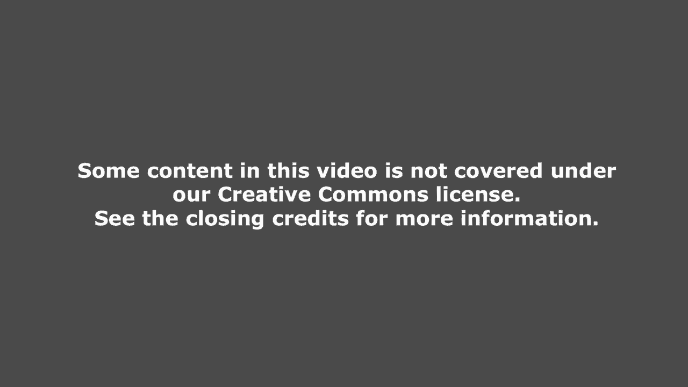

all right let's begin so as I mentioned，before this this this lecture will be。

recorded for OCW so again in the future，lectures if you don't want to have the。

back of your head show up just don't sit，in this this front area here so first of。

all what a crowd you guys were finally，in 26100 sixth circle and made it big。

huh so good afternoon and welcome to the，very first class of six triple one and。

also six hundred the semester so my name，is Anabelle first name Anna last name。

Bell I'm a lecturer in the EECS，Department and I'll be giving some of。

the lectures for today along with later，on in the in the term professor Eric。

Grimson who's sitting right down there，will be giving some of the lectures as。

well okay so today we're going to go，over some just basic administrivia a。

little bit of course information and，then we're going to talk a little bit。

about what is computation so we'll，discuss at a very high level what。

computers do just to make sure we're all，on the same page and then we're gonna。

dive right into Python basics we're，gonna talk a little bit about。

mathematical operations you can do with，Python and then we're going to talk。

about Python variables and types so as I，mentioned in my introductory email all。

the slides in code that I'll talk about，during lectures will be up before。

lecture so I highly encourage you to，download them and to have them open。

we're gonna go go through some in class，exercises which will be available on。

those slides and it's it's fun to do and，it's also great if you could take notes。

about on the code just so you just for，future reference it's it's true it this。

is a really fast paced course and we，ramped up really quickly so we do want。

to position you to succeed in this，course so as I was writing this I was。

trying to think about when I was first，starting the program you know what。

helped me get through my first very，first programming course and this is。

really like a good list so the first，thing was I just read the piece that's。

as soon as they came out made sure that，you know the terminology kind of just。

sunk in and then during lectures you，know if the lecturer was talking about，something that。

you know suddenly I remembered oh I saw，that word in the p-set and I didn't know。

what it was well hey now I know what it，is right so just give it a read you。

don't need to start it if you're new to，programming I think the key word is。

practice so it's like math you know or，reading the more you practice the better。

you get at it it you're not going to，absorb programming by watching me write。

programs because I already know how to，program right you guys need to practice。

so download the code before lector，follow along whatever I type you guys。

can type and I think also one of the big，things is if you're new to programming。

you're kind of afraid that you're gonna，break your computer right and you can't。

really do that just by running anaconda，and typing in some commands so don't be。

afraid to just type some stuff in and，see what it does，worst case you just restart the computer。

right so yeah yeah so that's probably，the big thing right there I should。

probably highlighted it but don't be，afraid great so this is pretty much a。

road map of all of six triple one or 600，as I've just explained it so there's。

three big things we want you to get out，of this course okay the first thing is。

the knowledge of concepts which is，pretty much true of any class that。

you'll take right the class will teach，you something through lectures exams。

will test how much you know this is a，class in programming right the other。

thing we need you we want you to get out，of it is programming skills and the last。

thing and I think this is what makes，this class really great is we teach you。

how to solve problems and we do that，through the psets，so that's really how I feel the roadmap。

of this course looks like and underlying，all of these is just practice so you。

have to just type some stuff away and，code a lot and you'll succeed in this。

course I think okay so what are the，things we're going to learn in this。

class I feel like the things we're going，to learn in this class can be divided。

into basically three different sections，so the first one is，related to these first two first two。

items here so it's really about learning，how to program so learning how to。

program is part of it is figuring out，what what objects to create you'll learn。

about these later how do you represent，knowledge with data structures that's。

sort of the broad term for that and then，as you're writing programs you need to。

programs aren't just veneer sometimes，programs jump around they make decisions。

there's some control flow to programs so，that's what the second line is going to。

be be about the second big part of this，course is a little bit more abstract and。

it deals with how do you write good code，good style code that's readable so when。

you write code you want to write it such，that you know you're in big company。

other people will read it other people，will use it so it has to be readable and。

understandable by others so to that end，you need to write code that's well。

organized modular easy to understand，right and not only that not only will。

your code be read by other people but，next year maybe you'll take another。

course and you'll want to look back at，some of the problem sets you wrote in。

this class you kind of want to be a，better re-read your code right if it's a。

big mess you might not be able to，understand or we understand what you。

what you were doing so writing readable，code and organizing code is also a big。

part and the last section is going to，deal with so the first two are actually。

part of the programming in introduction，to programming and computer science and。

python and the last one deals a little，bit it deals mostly with the computer。

science part in introduction to，programming and computer science and。

python so we're going to talk about once，you've learned how to write programs in。

Python how do you compare programs in，Python how do you know that one program。

is better than the other right how do，you know that one program is more。

efficient than the other how do you know，that one algorithm is is better than the。

other so that's what we're going to talk，about in the last part of the course ok。

so that's all for the sort of，administration part of the course so，let's let's。

start by talking a little at a high，level what does the computer do so。

fundamentally it does two things one，performs calculation and it performs a。

lot of calculations right computers，these days are really really fast a。

billion calculations per second is，probably not not far off it performs。

these calculations and it has to store，them somewhere right stores them in。

computer memory so computer also has to，remember results and these days it's not。

uncommon to find computers with hundreds，of gigabytes of storage so the kinds of。

calculations that computers do there are，two kinds so one are calculations that。

are built into the language so these are，the very low level x types of。

calculations things like addition，subtraction multiplication and so on and。

once you have a language that has these，sort of primitive calculate calculation。

types you as a programmer can put these，types together and then define your own。

calculations okay and then create new x，types of calculations and the computer。

will be able to perform those as well，okay and I think one thing I want to。

stress and we're going to come back to，this in this this again during during。

this entire lecture actually is，computers only know what you tell them。

okay computers only do what you tell，them to do they're not magical they。

don't have a mind they just know how to，perform calculations really really。

quickly but you have to tell them how，what what calculations to do okay okay。

computers don't know anything all right，we've come to that，so let's let's go into the types of。

knowledge okay the first type of，knowledge is declarative knowledge and。

those are things like statements of fact，okay and this is where my email came。

into play if you read it all the way to，raffle，okay so a statement of fact for today's。

lecture is someone will win a prize，before class ends and the prize was a，Google cardboard right。

Google's state-of-the-art virtual，here，okay yeah okay，I delivered on my promise okay so that's。

a statement of fact but if you so，pretend I'm a machine okay I don't know。

anything except what you tell me what，you tell me so I don't know I know that。

you tell me this statement I'm like okay，but how is someone gonna win a Google。

cardboard before class ends right that's，where imperative knowledge comes in so。

imperative knowledge is the recipe or，the how-to or the sequence of steps okay。

sorry that's just my funny for that one，so the sequence of steps is is the。

imperative is imperative knowledge so if，I'm a machine you need to tell me how。

that someone will win a Google cardboard。

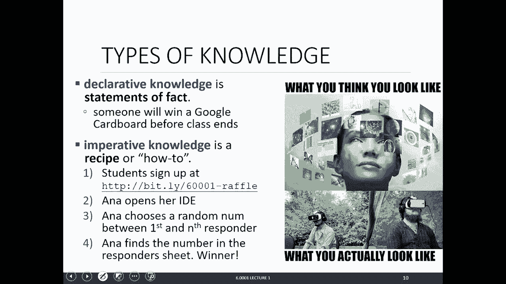

before class right so if I follow these，steps then technically I should I should。

reach a conclusion okay so step one I，think we've already done that who ever。

wanted to sign up had signed up so now，I'm going to open my IDE so I'm just。

basically being a machine and following，the steps that you've taken that you've。

told me so the IDE that we're using in，this class is called anaconda I'm just。

scroll down to the bottom okay hopefully，even started in promise at zero so I've。

opened my IDE I'm gonna follow the next，set of instructions I'm gonna choose a。

random number between the first and the，enth responder okay now I'm gonna。

actually use Python to do this and this，is also an example of how just like a。

really simple task in your life you can，use computers or programming to do that。

because if I chose a random number，might be biased because for example I。

might like the number eight so to choose，a random number，I'm going to go and say okay where's the。

list of responders it starts at 15，actually it starts at 16 because that's。

me okay so we're gonna choose a random，number between 16 and the end person to，66。

oh we just got up okay - okay I'm gonna，cut it off right here at 271 okay 69 to。

71 perfect okay so I'm gonna choose a，random number so I'm gonna go to my ID。

and you don't need to know how to do，this yet but by the end of this class。

you will so I'm just gonna use Python，I'm just gonna get the random number。

package that's gonna get me a random，number so I'm gonna say random dot R and。

int and I'm going to choose a random，number between 16 and 272 okay。

75 okay great so I chose a random number，and I'm gonna find the number in the。

responders sheet what was the number。

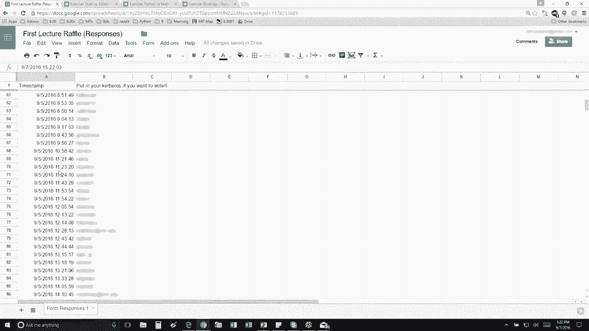

again sorry 75 okay up we go there we go，Lauren CoV yeah nice you're here，[Applause]，[Music]。

[Applause]，awesome alright so that's an example of，me being a machine right and also at the。

same time using Python in just my，everyday life right just lecturing just。

to find a random number right so just，you know try to use Python wherever you。

can and that just gives you practice。

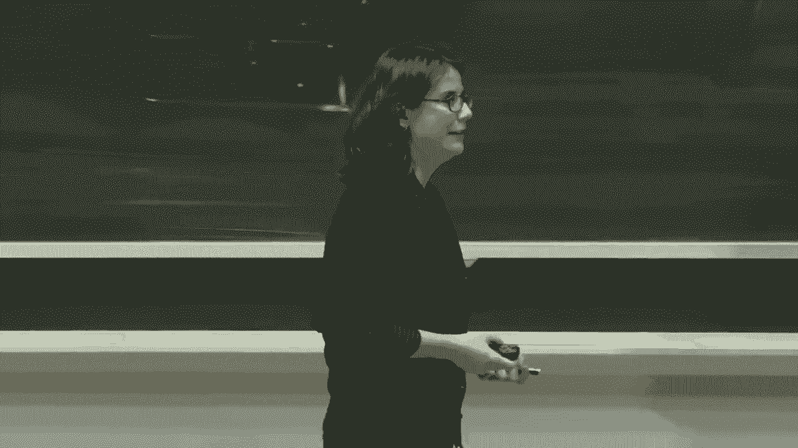

okay so that was fun but right on my，team we're MIT students right and we。

love numbers here at MIT right so here's，a numerical example for that shows the。

difference between declarative and，imperative knowledge so I want to find。

the square root of so an example of，declarative knowledge is the square root。

of a number X is y such that Y times y，is equal to X okay that's just a。

statement of fact it's true imperative，not so computers don't know what to do。

with that right they don't know what to，do with that statement but computers do。

know how to follow a recipe so here's a，well-known algorithm to find the square。

root of a number X let's say X is，originally 16 so if a computer follows。

this this algorithm it's going to start，with a guess gee let's say 3 right we're。

trying to find the spirit of 16 we're，gonna calculate G times G is 9 right and。

we're gonna ask is if G times G is close，enough to X and stop and say G is the。

answer I'm not really happy with 9 being，really close to 16 right so I'm going to。

say I'm not I'm not stopping here I'm，gonna keep going ok so if it's not close。

enough then I'm gonna make a new guest，biabbering G averaging G and x over G so。

that's x over G here and that's the，average over there and the new average。

okay and that's what it says and then，the last step is using the new guess。

repeat the process so then we go back to，the beginning and repeat the whole。

process over and over again okay and，that's what the rest of the rows does。

and you keep doing this until you decide，that you're close enough okay so then so。

what we saw for the imperative knowledge，in the previous numerical example was。

the recipe right for how to find the，square root of x so what were the three。

parts to the recipe one was a simple，sequence of steps right there were four。

steps pretty much the other was a flow，of control so there were parts where we。

made decisions right are we close enough，there were parts where we repeated some。

steps so at the end we said repeat steps，one two three so that's the flow of。

control and the last part of the recipe，was a way to stop right you don't want a。

program that keeps going and going or，for a recipe you don't want to keep。

baking bread forever right you want to，stop at some point like ten breads a。

xena right okay so you have to have a，way of stopping okay and this in the。

previous example the way of stopping was，that we decided we were close enough。

close enough was maybe B being within，point zero one point zero zero zero one。

whatever you pick so this recipe is，there for an algorithm right if your。

science speak it's gonna be an algorithm，okay and that's what we're gonna learn。

about in this class okay so we're，dealing with computers and we actually。

want to capture a recipe inside a，computer computer of being a mechanical。

process and historically there were two，ways of there were there were two two。

ways of sorry historically there were，two different types of computers okay so。

originally there were these things，called six program computers and I'm old。

enough to have used something like this，where there's just numbers and plus。

minus multiplication divided and equal，but calculators these days are a lot。

more complicated but way back then a，fix-up an example of a fixed program，computers is。

it only knows how to do addition，multiplication subtraction division if。

you want to plot something you can't if，you want to go on the internet check you。

know said email with it you can't it can，only do this one thing okay and if you。

wanted to create a machine that did，another thing then you'd have to create。

another fixed-program computers that did，a completely separate task okay so。

that's not very great right so that's，when stored-program computers came into。

play and these were machines that could，store a sequence of instructions and。

these machines could execute the，sequence of instructions and you could。

change the sequence of instructions and，execute a different see this different。

sequence of instructions so you could do，different tasks in the same machine。

right and that's the computer as we know，it these days，so the central processing unit is is。

where you know all of these decisions，get made and these are all the sort of。

peripherals so the basic machine，architecture so at the heart of every。

computer there's just this this basic，architecture and it contains I guess。

four main parts over the first is the，memory input and output is the other one。

the ALU is where all of the operations，are done and the operations that the ALU。

can do are these really primitive，operations and subtraction and so on so。

what the memory contains is a bunch of，data and your sequence of instructions。

so interacting with the arithmetic logic，unit is the control unit and the control。

unit contains one program counter so，when you load a sequence of instructions。

the program counter starts at the first，sequence it gets what the FIR starts at。

the at the sequence at the first，instruction it gets what the instruction。

is and it sends it to the ALU the ALU，asks what are we what what are we doing。

operations on here what's happening so，it might get some data you know if。

you're adding two numbers it might get，two numbers from from memory it might do。

some operations and it might store data，back into memory okay and after it's。

done the ALU is going to go back and the，program counter is going to increase by。

one which means that we're going to go，to the next sequence in the instruction。

set okay and it just goes linearly like，instruction by instruction there might。

be one instrument particular instruction，that does some sort of test it's gonna。

say is is this particular is this，particular value greater or equal to or。

the same as this other particular value，so that's a test an example of a test。

and the test is going to be either，either return something either return。

true or false and depending on the，result of of that test you might either。

go to the next instruction or you might，set the program counter to go all the。

way back to the beginning and so on so，you're not just sort of linearly。

stepping through all the instructions，there might be some control flow。

involved where you might skip an，instruction or start from the beginning。

or so on and after you're done when when，when you finished executing the last。

instruction then you might output，something so that's really the basic the。

basic way that a computer works okay so，just to recap you have the stored。

program computer that contains these，sequences of instructions the primitive。

operations that it can do our addition，subtraction logic operations tests which。

are you know something equal to，something else something less than and，so on and。

data storing data moving data around and，things like that and the interpreter。

goes through every instructions every，instruction and decides whether you're。

going to go to the next instruction skip，instructions or repeat instructions and。

so on okay so we've talked about，primitives and in fact the Alan Turing。

was a really great computer scientist he，showed that you can compute anything。

using the six primitives and the six，primitives were our move left move right。

read/write scan and do nothing okay so，using those six those six instructions。

and the piece of tape he showed that you，could compute anything and using those。

six instructions programming languages，came about that created a more。

convenient set of primitives so you，don't have to program in only these only。

these six commands right and one，interesting thing or one really。

important thing that came about from，this from these six primitives is that。

if you can compute something in Python，let's say if you write a program that。

computes something in Python then in，theory you can come you can write a。

program that computes the exact same，thing in any other language okay and。

that's a really powerful statement okay，think about that today when you review。

your slides think about that again and，that's really powerful okay so once you。

set have your set of primitives you can，set of primitives for a particular。

language okay you can start creating，expressions and these expressions are。

going to be combinations of of the，primitives in the programming language。

and the expressions are going to have，some value and they're gonna have some。

meaning in in the programming language，okay so let's do a little bit of a。

parallel with English just so you see，what I'm what I mean，so in English the primitive constructs。

are going to be words okay there's a lot，of words in the English language。

programming is in Python there are there，are primitives but there。

many of them so there's there are floats，boolean's you know these are numbers。

strings and simple operators like，addition subtraction and so on。

okay so we have primitive constructs，using these primitive constructs we can。

start creating in English phrases write，sentences and the same in programming。

languages so in English we can say，something like cat dog boy okay that we。

say is not syntactically valid so that's，bad syntax right I that's now now noun。

that doesn't make sense，what does have good syntax in English is，noun verb noun so cat hugs boy is。

syntactically valid similarly in a，programming language something like this。

in Python in this case a word and then，the number five doesn't really make。

sense it's not syntactically valid but，something like operator operand operator。

is okay so once you've created these，these phrases or these these expressions。

that are syntactically valid you have to，think about the static semantics of your。

phrase okay of your expression so so for，example in English I are hungry is good。

syntax okay but it's kind of weird to，say right we have a pronoun of urban。

adjectives later which doesn't really，make sense，right I am hungry this is better so this。

is statically semantic this does not，have good static semantics similarly in。

programming languages and you'll get the，hang of this hang of this the more you。

do it something like this three point，two times five is okay but what does it。

mean right what's the meaning to have a，word added to the number to a number。

there's no meaning behind that right its，syntax is okay because you have operator。

operand operator but it doesn't really，make sense to add a number to a word for，example okay。

so once you have created these，expressions that are syntactically。

correct and static semantically correct，in English for example you think about。

the semantics so what's the meaning of，the phrase and in English you can。

actually have more than one meaning to，an entire phrase okay so in this case。

flying planes are dangerous or flying，planes can be dangerous can have two。

meanings is the act of flying a plane is，dangerous or the plane that is in the。

air is dangerous right and this might be，a cuter example this reading-lamp hasn't。

uttered a word since I bought it what's，going on right so that has two meanings。

right it's playing on the word，reading-lamp in programming so that's。

that's an English in English you can，meaning，that's syntactically correct and static。

semantically correct but in programming，languages the program that you write a。

set of instructions that you write only，has one meaning so remember we're coming。

back to the fact that the computer only，does what you tell it to do okay it's。

not going to suddenly you know decide to，add another variable for some reason。

it's just going to execute whatever，statements you've put up okay so in。

programming languages there's only one，meaning but the problem comes the。

problem that comes into play in，programming languages is it's not the。

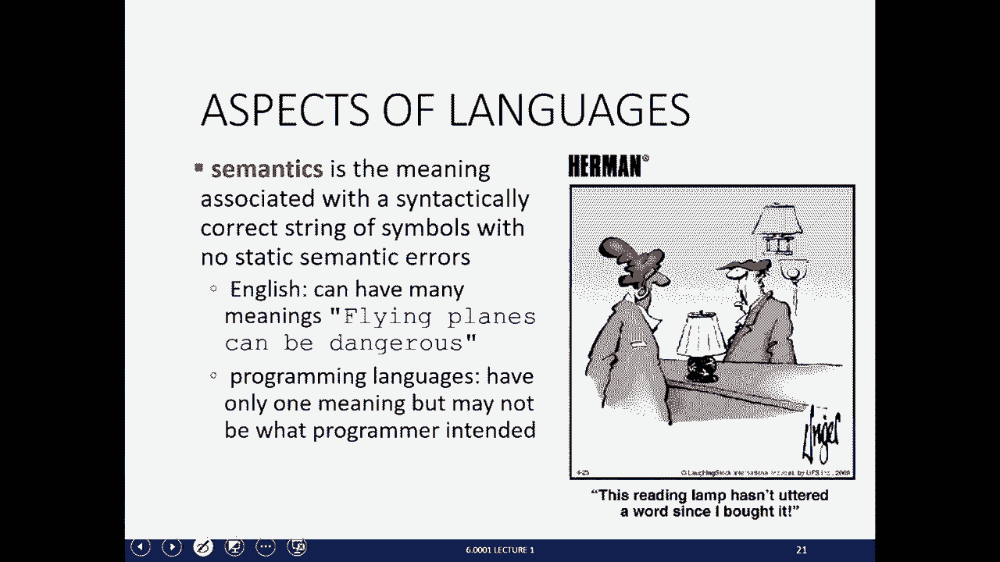

meaning that you might have intended as，the programmer okay so that's where。

things can go wrong and there's gonna be，a lecture on debugging a little bit。

later in the course but this is here，just to just to tell you that if you see。

an error pop up in your program it's，just you know some text that says error。

notes some for example if we do，this isn't actively correct incorrect。

syntactically incorrect see there's some。

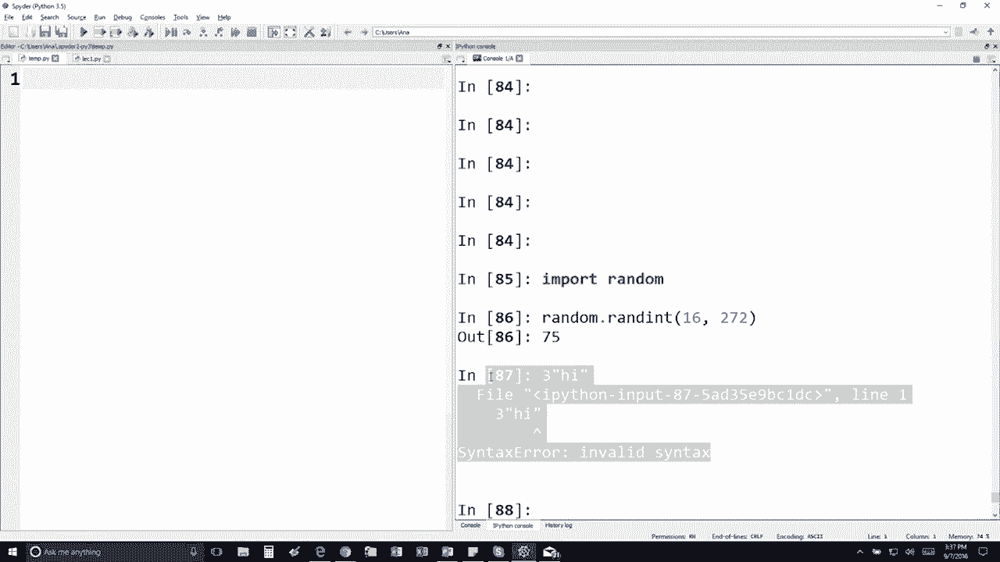

angry text right here right like what is，going on the more you program the more。

you'll get the hang of reading these，errors but this is basically telling me。

this this the line that I wrote is，syntactically incorrect okay and it's。

pointing me to the exact line and says，this is wrong so I can go back and fix，it as a programmer。

okay so syntax errors are actually，really easily caught by Python static。

semantic errors so that was an example，of a syntax error static semantic errors。

can also be caught by Python as long as，if if your program has some decisions to。

make as long as you've gone down the，branch where this where the static。

semantic error happens and this is，probably gonna be the most frustrating。

one especially as you're starting out，the program might do something different。

than what you expected it to do right，and that's not because the program。

suddenly you know for example you，expected the program to give you an。

output of zero for a certain test case，and the output that you got was 10 right。

well the program didn't suddenly decide，to change its answer to ten it just did。

executed the program that you that you，wrote right so that's the case where the。

program gave you a different answer than，expected programs might crash which。

means they stopped running that's okay，just go back to your code and figure out。

what was wrong and another example of，different meaning than what you intended。

was maybe the program will stop it's，also okay there are ways to stop it。

besides restarting the computer okay so，then Python programs are going to be。

sequences of definitions and commands，we're gonna have expressions that are。

going to be evaluated okay and commands。

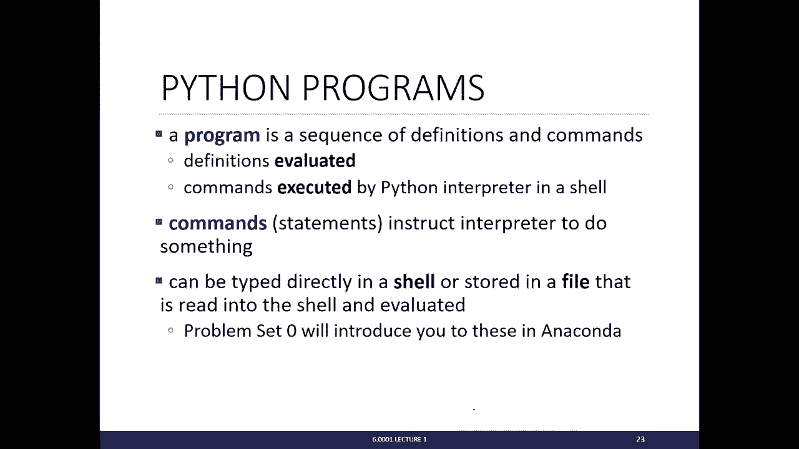

that that tell the interpreter to do，something，so if you've done problem set zero。

you'll see that you can type commands，directly in the shell here which is the。

part on the right where I did some some，really simple things two plus four or。

you can type commands up in here on the，left hand side and then run your program，okay。

notice that well we'll talk about this I，won't talk about this now but these are。

on the right hand side typically you，write very simple commands just if。

you're testing something out and on the，left hand side here in the editor you。

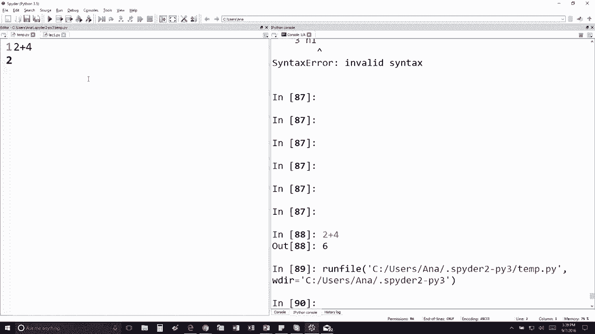

write more lines and more complicated，programs okay so now we're going to。

start talking about Python and in Python，we're gonna come back to this everything。

is an object and python programs，manipulate these data objects all。

objects in Python are going to have a，type and the type is going to tell。

python the kinds of operations that you。

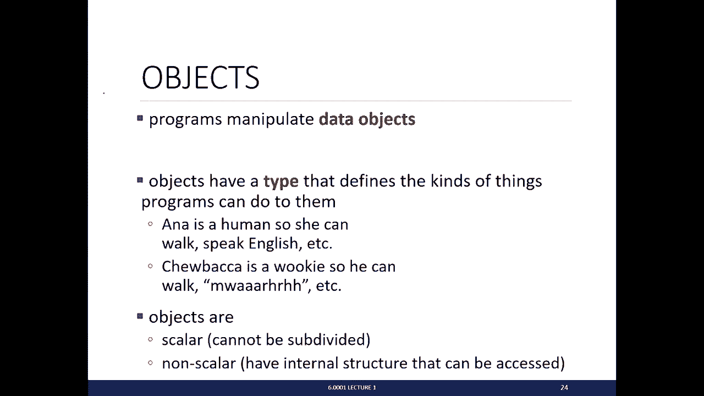

can do on these objects so if an object，is the number five for example you can。

add the number to another number，subtract the number take it to the power。

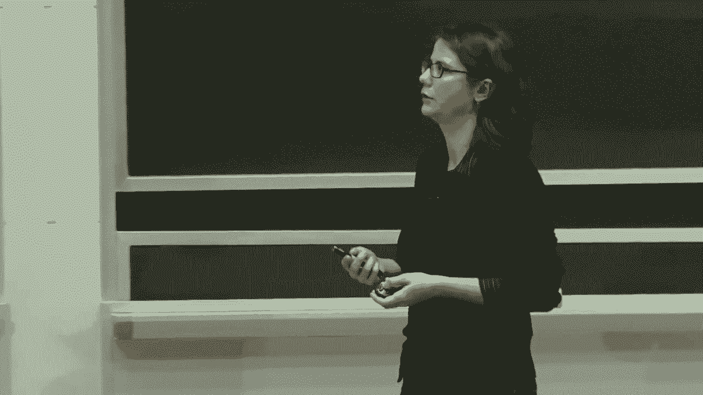

of something and so on more as a more，general example for example I am a human。

so that's my type and I can walk speak，English etc Chewbacca is going to be a。

type Wookiee right so we can walk do，that sound that I can't do right so he。

can do that but I can't I'm not even。

gonna try and and so on okay so once you，have these Python objects everything is。

an object in Python there are actually，two types of objects one are scalar。

object so that means these are very，basic objects in Python from which。

everything can be can be made okay so，these are scalar objects they can't be。

subdivided the other type of object is a，non scalar object and these are objects。

that have some internal structure so for，example the number five is a scalar。

object because it can't be subdivided，but a list of numbers for example five。

six seven eight is going to be a non，scalar object，because I'm divided so you just can。

subdivide it into you can find parts，parts to it it's it's made up of a。

sequence of numbers right so here's the，list of all of the scalar objects in。

Python we have integers for example all，of the whole numbers。

floats which are all of the decimal real，numbers anything with a decimal bulls。

our boolean z' there's only two values，two boolean's that's true and false note。

the capitalization capital T and capital，F and this other thing called none type。

it's special it has only one value，called none and it represents the。

absence of a type and it sometimes comes，in handy for for some programs if you。

want to find the type of an object you，can use this special command called type。

and then in the parentheses you put down，what you want to find the type of okay。

so you can write into the shell type of，five and the shell will tell you that's。

an integer okay if you happen to want to，convert between two different types。

Python allows you to do that and to do，that you use this you put the type that。

you want to convert to right before the，object that you want to convert to so。

float three will convert the integer，three to the float 3。0 and similarly you。

can convert any float into an integer，and converting to an integer just。

truncates so it just takes away the，decimal and whatever's after it it does。

not round and keeps just the integer，part okay so for this slide I'm going to。

talk about it but if you'd like go to if，you have the slides up go to go to this。

exercise and after I'm done talking。

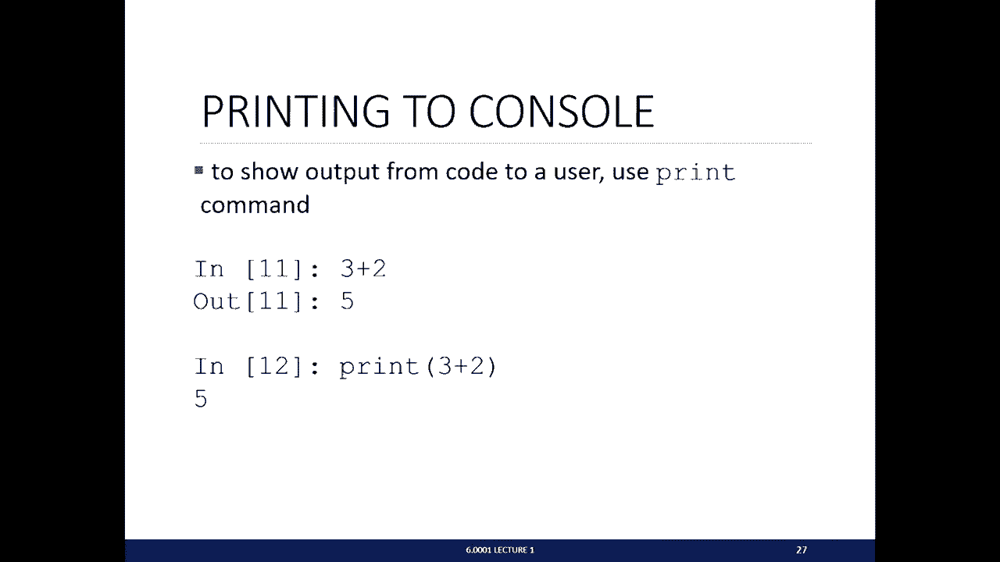

about the slide we'll see we'll see what，people think for that exercise okay so。

one of the most important things that，you can do in program in basically any。

programming and pythons also is to print，things out so printing out is how you。

you interact with the user okay so to，print things out you use the print。

command so if you're in the shell if you，simply type 3 + 2 you do see a value。

here 5 right but that's not actually，printing something out and that becomes。

apparent when when you actually type，things into the editor so if you just do。

3 plus 2 and you run the program that's，this little green button here you see on。

the right-hand side here it ran my，program but it didn't actually print。

anything if you type this into the，console it does show you this value but。

that's just sort of a like peeking into，the value for you as just for you as a。

programmer okay it's not actually，printing it out to anyone if you want to。

print something now you have to use the，print State print print statement like。

that so in this case this is actually。

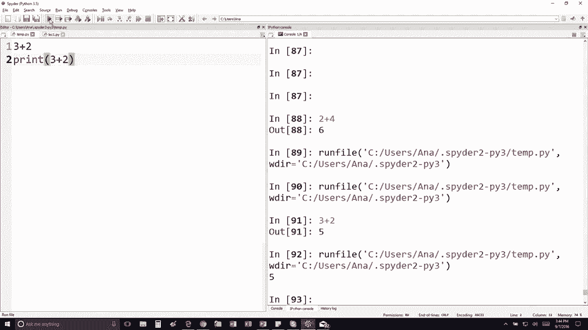

going to print this number 5 to the，console okay so that's basically my set。

so out just tells you it's an，interaction within the shell only it's。

not interacting with with anyone else。

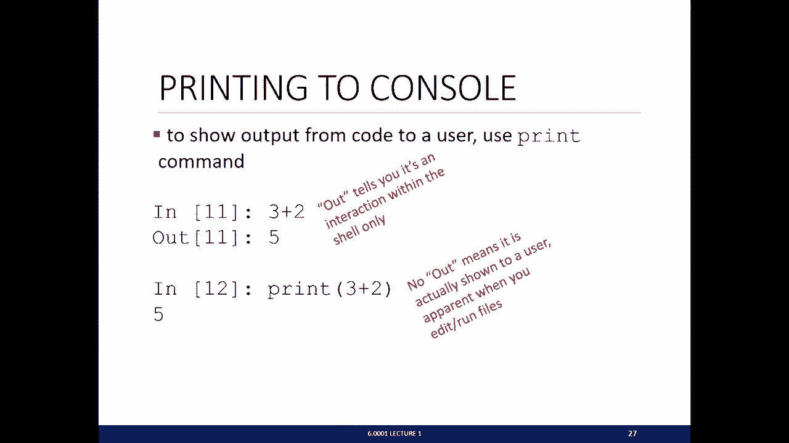

and if you don't have any how that means，it got printed out to the console。

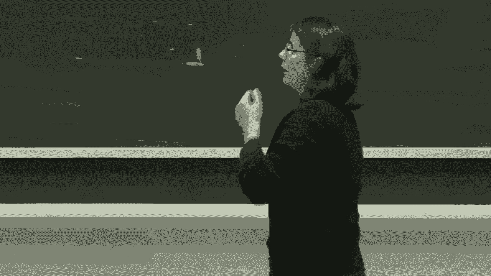

alright so we talked a little bit about，objects once you have objects you can。

combine objects and operators to form，these expressions and each expression is。

going to have value so an expression，evaluates to a value and the syntax for。

an expression is going to be object，operator object like that and these are。

some operate operators you can do on，instant floats so there's the typical。

ones addition subtraction multiplication，and division if for the first three you。

have the answer that you get the type of，the answer that you get is going to。

depend on the type of your variables so，if both of the variables of the opéra。

operands are integers then the result，you're going to get is of type integer。

but if at least one of them is a float，than the result you're gonna get as a。

float divisions a little bit special in，that no matter what the operands it are。

the result is always going to be a float，okay the other upper operations you can。

do in these these are these are also，useful is our the remainder so the % if。

you use the % between two operands，that's going to give you the remainder。

when you divide I by J and raising，something to the power of something else。

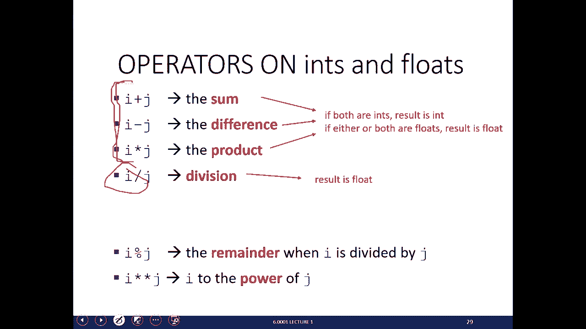

is using the star star operator and I，star stars J is going to take I to the。

power of J so these operations have the，typical precedence that you might expect。

in math for example and if you'd like to，put precedence toward some other。

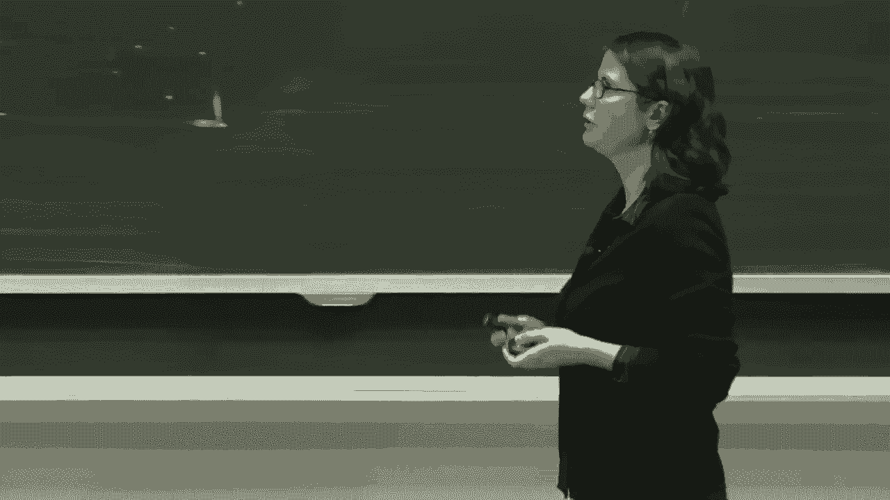

operations you can use parentheses to do，yeah all right，okay so we have ways of creating。

expressions and we have operations we，can do on on objects but what's going to。

be useful is to be able to save values，to some name and the name is going to be。

something that you can you pick and it，should be a descriptive name and when。

you save the value to a name you're，going to be able to access that value。

later on in your program okay and that's，very useful so to save a value to a to a。

variable to a variable name use the，equal sign okay and the equal sign is。

the assign is an assignment so it，assigns the right-hand side which is a。

value to the left-hand side which is，going to be a variable name so in this。

case I signed the float 3。14159 to the，vet to the variable pi and in the second。

line I'm going to take this expression，22 divided by 7 I'm going to evaluate it。

it's going to come up with some some，decimal number and I'm gonna save it。

into the variable PI underscore aprox，okay values are stored in memory and。

this assignment in Python we say the，assignment binds the name to the value。

so when you when you use that name later，on in your program you're going to be。

referring you're going to be referring，to the value in memory okay and if you。

ever want to refer to the value later on，in your code you just simply type the。

name of the variable that you that，you've assigned it to okay so why do we。

want to give names to the two，expressions well you want to reuse the。

names right instead of a values and it，makes your code look a lot nicer so this。

is a piece of code that calculates the，area of a circle and notice I've，assigned a variable pi to 3。

14159 I've，assigned another variable called radius，to be 2。2 and then later on in my code I。

have another line that's his area this，is another variable is equal to this is，an assignment。

to this expression and this expression，is just going to is is referring to。

these variable names PI and radius and，it's going to look them up their values。

in memory and it's going to replace，their value their these variable names。

with those values and it's going to do，the calculation for me and in the end。

this whole expression is going to be，replaced by one number and that's gonna。

be the float okay here's another，exercise while I'm talking about this。

slide I do want to make a note about，programming versus math okay so in math。

you're often presented with with was，sort of a problem that's a software。

solve for X X plus y is equal to，something something solve for X for。

example okay that's coming back to the，fact that program computers can't don't。

know what to do with that computers need，to be told what to do。

so in programming if you want to solve，for X you need to tell the computer。

exactly how to solve for X you need to，figure out what formula you need to give。

the computer in order to be able to，solve for X okay so that means always in。

programming the right-hand side is going，to be an expression it's something。

that's going to be evaluated to a value，and the left-hand side is always a。

variable so it's going to be an，assignment so the equal sign is not is。

not like an in math right where you can，have thing a lot of things to the left。

and a lot of things to the right of the，equal sign there's only one thing to the。

left of the equal sign and that's gonna，be a variable an equal sign stands for。

an assignment once we've created，expressions and we have these these。

assignments you can rebind variable，names using new assignment statements。

okay so let's look at an example for，that let's say this is our memory okay。

let's look at let's type back in the，example with finding the radius okay so。

let's say pi is equal to 3。14，okay so in memory we're going to create，this value 3。

14 we're going to bind it，to the variable name pi，next line radius is equal to two point。

two in memory we're creating this，variable of this value two point two and。

we're gonna bind it to the vet to the，variable name pipe radius okay then we。

have this expression here it's going to，substitute the values for pi from memory。

and the value for radius from memory，it's gonna calculate this this this。

about the value that this expression，evaluates to it's gonna pop that into。

the memory and it's going to assign，because we're using the equal sign it's。

gonna assign that value to that variable，area okay so now let's say we rebind the，vat we rebind。

radius to be something else so radius is，already in is being is being is is bound，to the value 2。

2 but when we do this，line radius is equal to radius plus 1，we're going to take away the binding to。

2。2 we're going to make do this，calculation the new value is 3。2 and。

we're going to bind that rebind that，that value to that to that same variable。

so in memory notice we're still going to，have this this value 2。2 floating around。

but we've lost sort of the handle for it，okay there's no way to get it back so。

it's kind of just in memory sitting，there at some point it might get。

collected by what they what we call the，garbage collector in Python it'll。

retrieve these sort of lost values and，then reuse them for new values and。

things like that but radius now points，to the new value okay so we can never。

and that's it okay the value of area，notice this is very important the value。

of area did not change okay and it did，not change because these are all the。

instructions we told the computer to do，okay we told we just told it to change。

radius to be radius plus one we never，told it to recalculate the value of area。

if I copied that line down here then the，value of area would change but we never。

told it to do that right so the computer。

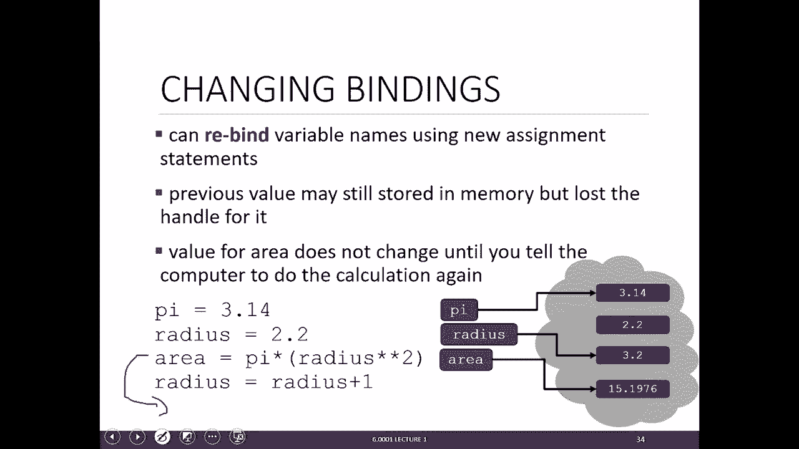

only does what we tell it to do that's，the last thing next lecture we're going。

to talk about adding control flow to our，programs so how do you tell the computer。

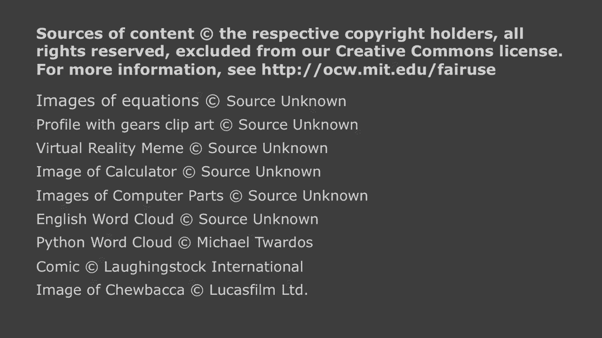