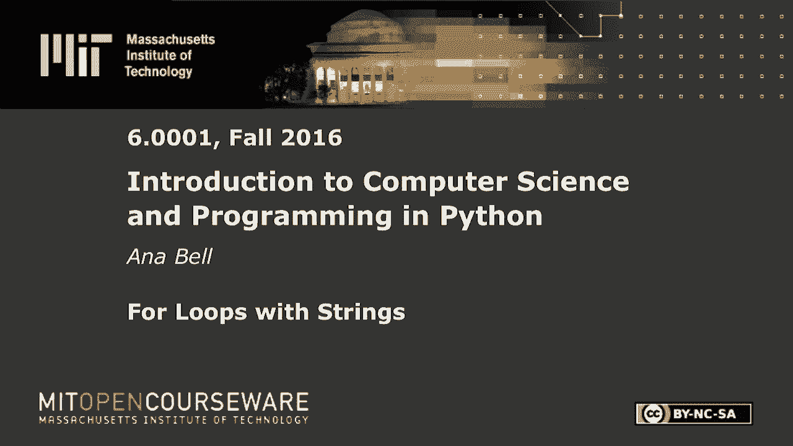
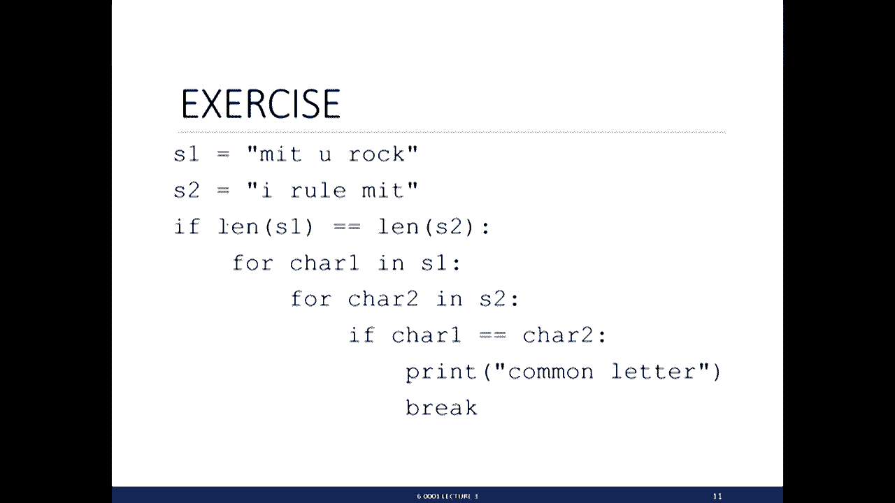
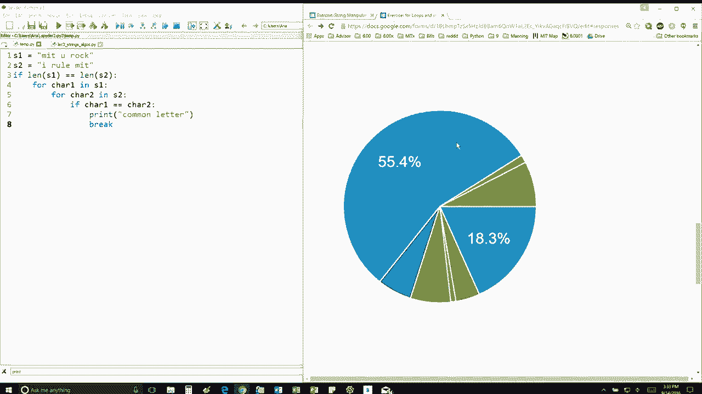

# P13：L3.3- 字符串的for循环处理 - ShowMeAI - BV1Dw411f7KK

the following content is provided under，a Creative Commons license your support。

will help MIT OpenCourseWare continue to，offer high quality educational resources，for free。

to make a donation or view additional，materials from hundreds of MIT courses。

we have two strings s1 s2 first we're，going to check if the length of s 1 is。

equal to length 2 anyone really really，quickly can you tell me what is this the。

length of s1 and s2 how many characters，are in there 10 right because we're。

including spaces so 1 2 3 4 5 6 7 8 9 10，so they are equal first of all so we're。

going to go inside this if statement，then we're going to go for every。

character in s1 and we're going to have，a nested loop for every character in s2。

we're going to check if the two，characters are the same and if they are。

we're going to print this common letter，statement and then we're going to break。

okay great we have we have some good，competition here so let's see the outer。

for loop is first going to go through，the letter M okay，so this is so first it's going to look。

at em right for char in s1 the first，character anise one is an M then we're。

entering inside this other for loop for，char two in s2 so we're going to say for。

this M I'm going to look at I which is，the first character in s2 if the。

character 1 is equal to character two，they're not don't do anything keep going。

to the next character in us - okay so，that you don't do anything there the。

next character in s2 is a space M does，not equal a space so you don't do，anything。

r does not the next character is an R，don't do anything the next characters。

you don't do anything then an L don't do，anything then an e don't do anything。

space and then suddenly we get to an M，so we're still in the outer for loop。

we're still looking at em right and，we're comparing M with every other。

letter inside the S - and suddenly we，reach here where we're comparing M with。

an M and we say yes they are equal so，we're going to print out，something make that into better check。

we're going to print common letter and，then we're going to break this break。

says do not keep looking at the，remaining letters in s2 okay so once。

we've found one that fits that that once，here，break and print out the thing and then。

go on to looking at I which is the next，letter and s1 and you do the same thing。

compare I with I we have a match perfect，right off the bat so you print out。

another common letter and then you break，which means don't keep looking at the。

remaining letters and then you look at，since you broke out of the inner loop。

you go to the outer loop the next letter，is a T and so on and so on so。

essentially you're comparing every，letter out here in s1 with every single。

letter and s2 until you find one that，matches as soon as you do you exit so if。

you if you actually run this program，it's going to print out seven times I。

think we can check it okay one two three。

nice majority of the people all right if，you got this wrong please go back and。

try to trace through your program so，that means step-by-step try to figure。

out what values of variables are just to，make sure that you're on the right track。

