# P17：L5.1- 元组、列表、重命名、元素更改与复制 - ShowMeAI - BV1Dw411f7KK

the following content is provided under，a Creative Commons license your support。

will help MIT OpenCourseWare continue to，offer high quality educational resources，for free。

to make a donation or view additional，materials from hundreds of MIT courses。

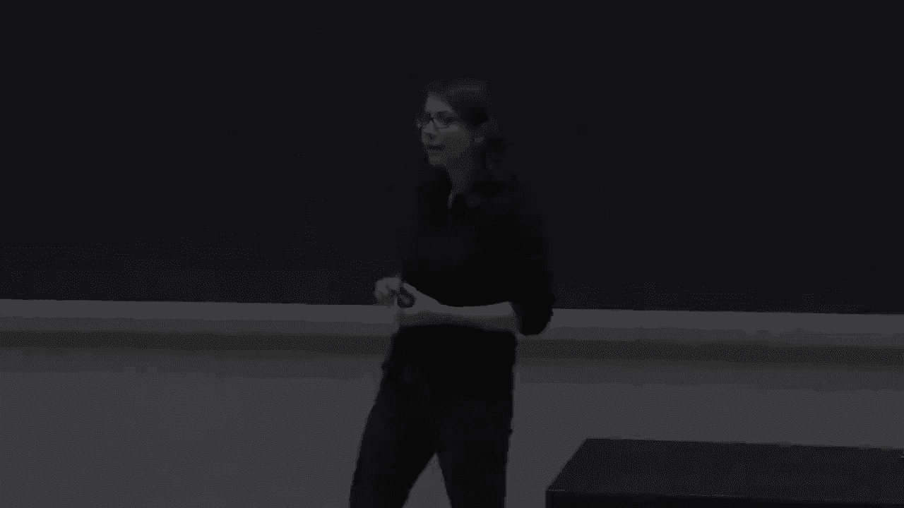

quick quick recap of what we did last。

time so last time we introduced this，idea of decomposition and abstraction。

and we started putting that into our。

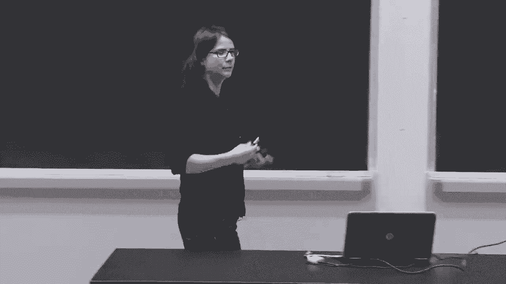

programs these were sort of high-level，concepts and we achieved them using。

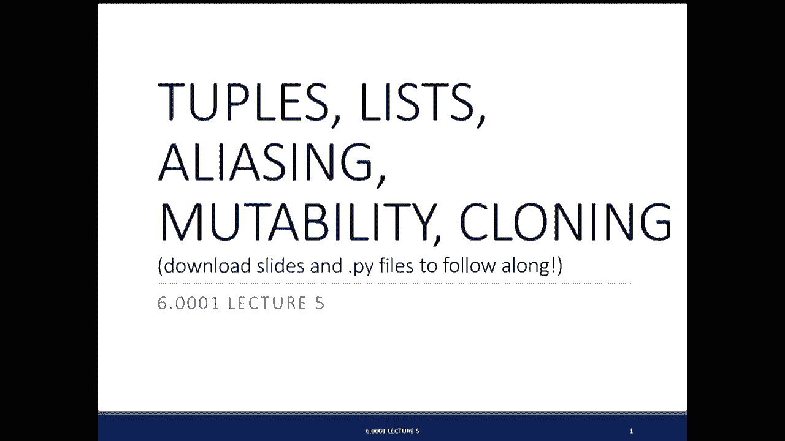

these concrete things called functions，in our programs and functions allowed us。

to create code that was coherent，that was that had some structure to it。

and was reusable okay and from now on in，problem sets and in lectures I'm going。

to be using functions a lot so make sure，that you understand how they work and。

all of those details so today we're，going to introduce two new data types。

and they're called compound data types，because they're actually data types that。

are made up of other data types，particularly ants floats boolean z' and。

strings and actually not just these but，other data types as well so that's why。

they're called compound data types so。

we're going to look at a new data type，called a tuple and then you did a data。

type called a list and then we're going，to talk about these ideas that come。

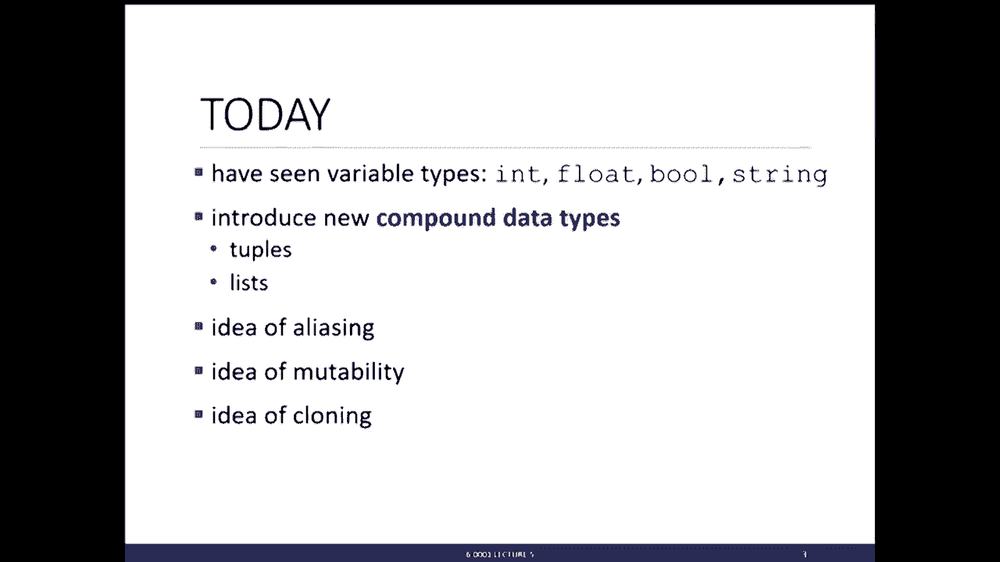

about with specifically with lists all，right so let's go right into tuples okay。

so if your recall strings strings were，sequences of characters okay tuples are。

going to be similar to strings in that，they're going to be sequences of。

something so if that tuples aren't just，sequences of characters they can be。

sequences of of anything they're a，collection of data where that data can。

be of any type so the so a tuple can，contain elements that are integers。

floats strings and so on tuples are，immutable and if you recall we talked。

about this word a little bit when we，talked about strings so that means once。

you create a tuple object you can't，modify it just like when you created a。

string object you weren't able you were。

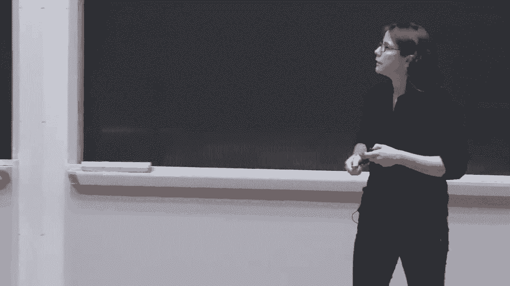

not allowed to modify it so the way we，create tuples are with these open and。

close parentheses this shouldn't be，confused with a function because there's。

nothing there's no there's no，this isn't a function call it's just how。

you represent a tuple for a function，call you'd have something right before。

the parentheses okay this is just how we，chose to represent a tuple and just a。

plain open and close parentheses。

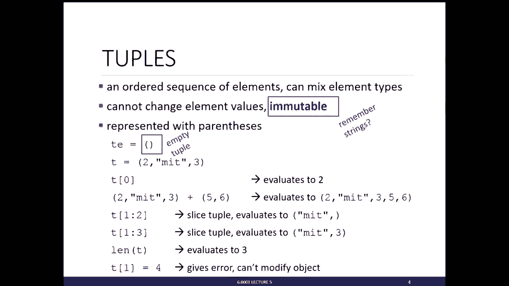

represents an empty tuple so it's of，length 0 there's nothing in it。

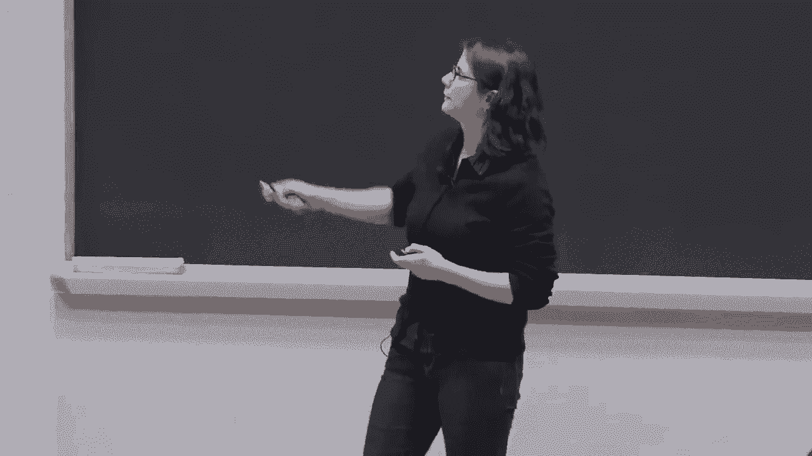

oops you can create a tuple that，contains some elements by separating。

each element with a comma so in this，case this is a tuple that can be。

accessed with a variable T that contains。

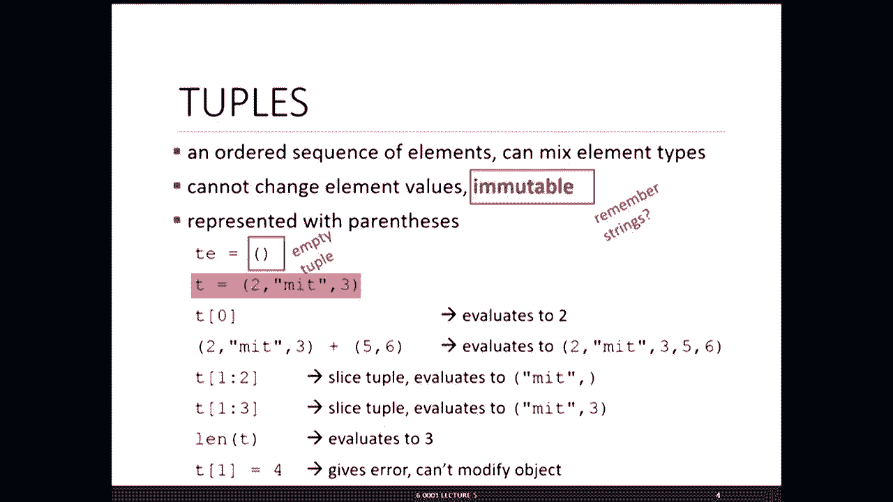

three elements the first is an integer，the second this is a string and the。

third is another integer much like，strings we can index into tuples to find。

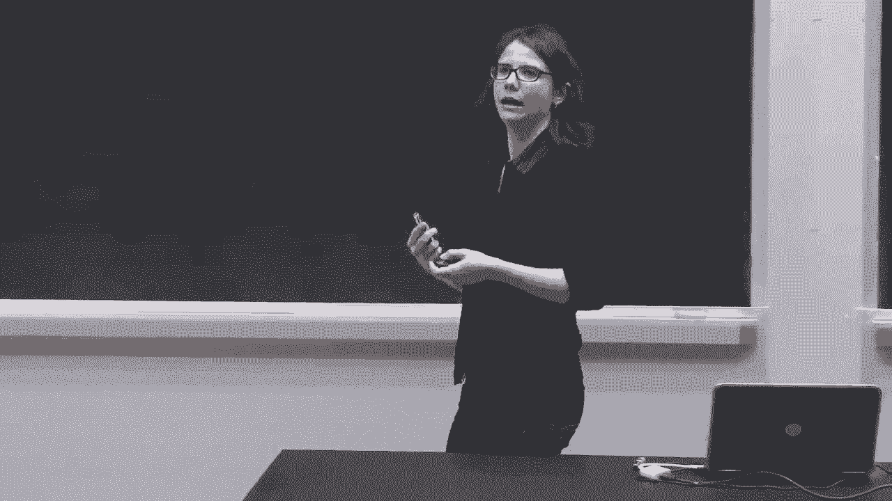

out values at particular indices so you，read this as T at position 0 so the。

tuple represented by variable T at，position 0 will evaluate to 2 because。

again we start counting from 0 in，computer science so that brings us gives。

us the first element just like strings，we can concatenate tuples together that。

just means add them together so if we，add these two tuples together we just。

get back one larger tuple that's just。

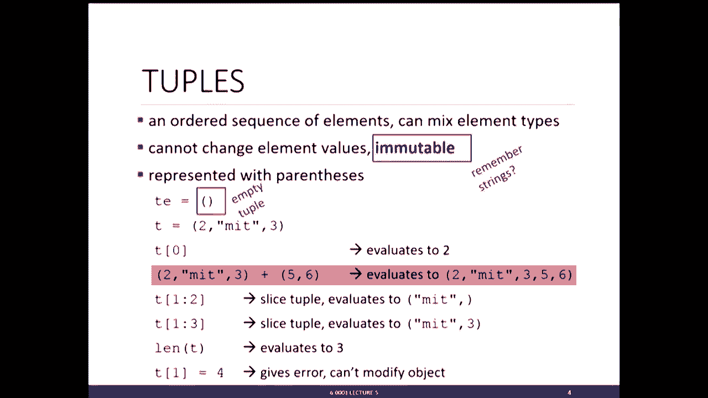

those two the elements of those tuples。

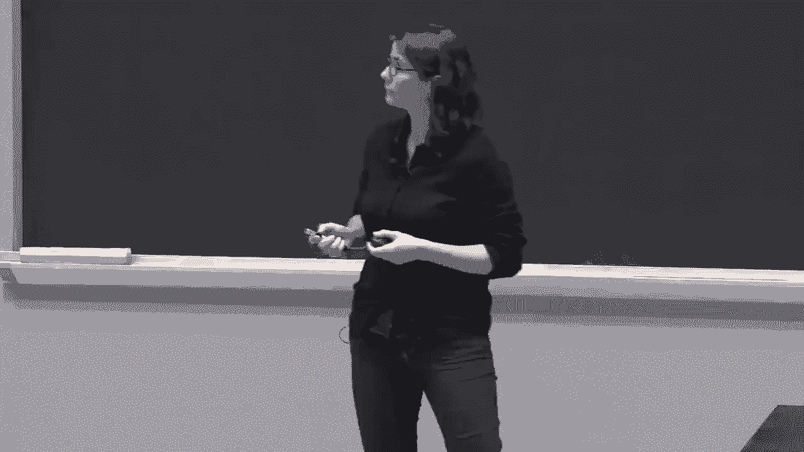

just put together in one larger tuple，again much like strings we can slice。

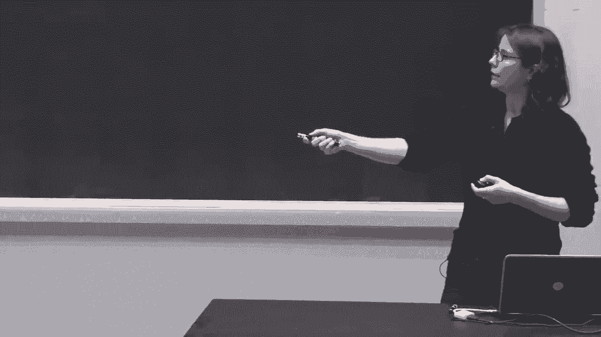

into tuples so T slice from index 1，until index 2 remember we go until this。

stop minus 1 so this only gives us one，a mistake，this extra comma here actually。

represents a tuple object okay if I，didn't have this comma here then this。

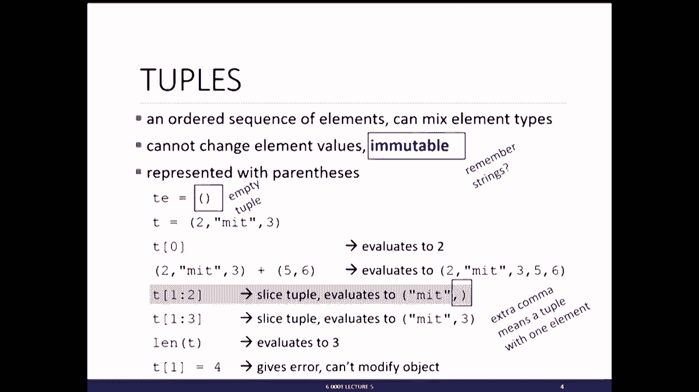

would just be a string the parenthesis，would just wouldn't really make any。

difference but the comma here makes it，clear to Python that this is a tuple。

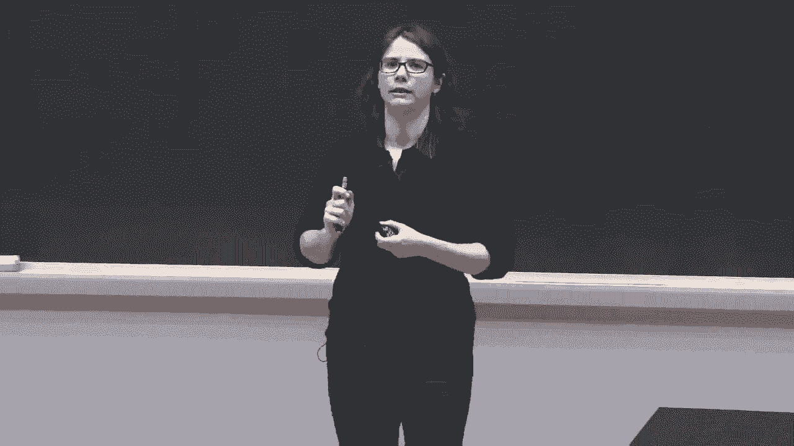

with only one element in it we can slice，even further to get a tuple with two。

elements and we can do the usual，operations like get the length of a。

tuple which says how many elements are，in my tuple，Len of this tea would evaluate to 3。

because there are three elements inside，the tuple each element again separated。

by the comma and just like strings if we，try to change a value inside the tuple。

in this case I wanted to try to change，the value of the second the second。

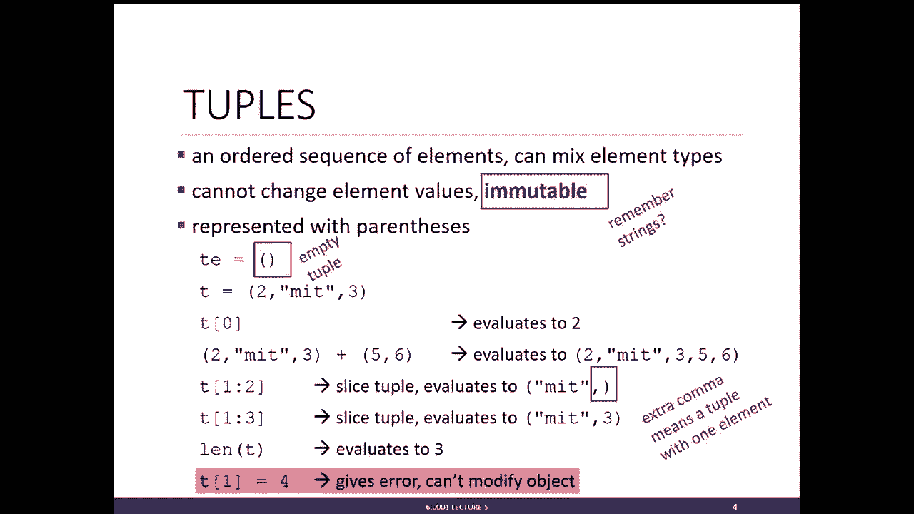

element to four Python doesn't allow，that because tuples are immutable okay。

so why would we want to use two poles。

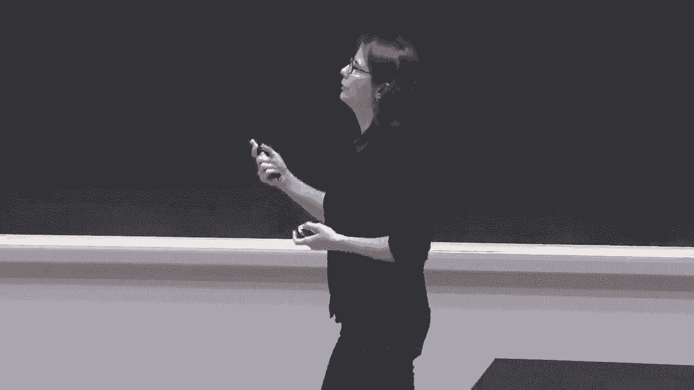

tuples are actually useful in a couple，of different scenarios，so recall couple few lectures ago we。

looked at this code where we try to swap，the values of variables x and y and this。

first code actually didn't work because，you're overriding the value for x right。

so instead what we ended up doing was，creating this temporary variable where。

we stored the value of x and then we，overrode it and then we use the。

temporary variable what turns out this，three liner code right here can actually。

be written in one line using tuples so，you say X comma Y is equal to Y comma X。

and Python goes in and says what's the，value of y and assigns it to X and then。

what's the value of X and assigns it to。

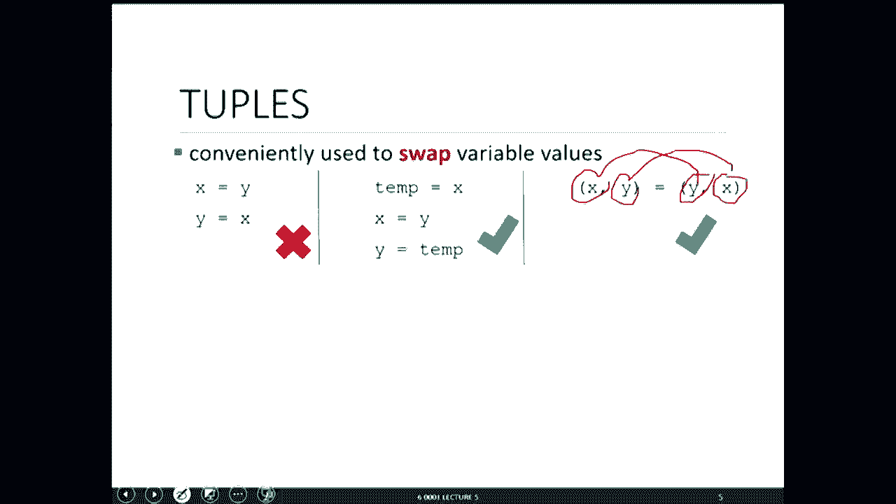

extending on that we can actually use，tuples to return more than one value。

from a function so functions you're only，allowed to return one object okay so。

you're not allowed to return more than，one object however if we use an op a。

tuple object and if that's the thing，that we return we can actually get。

around this sort of rule by putting in，as many values as we want inside the。

tuple object and then we can return as。

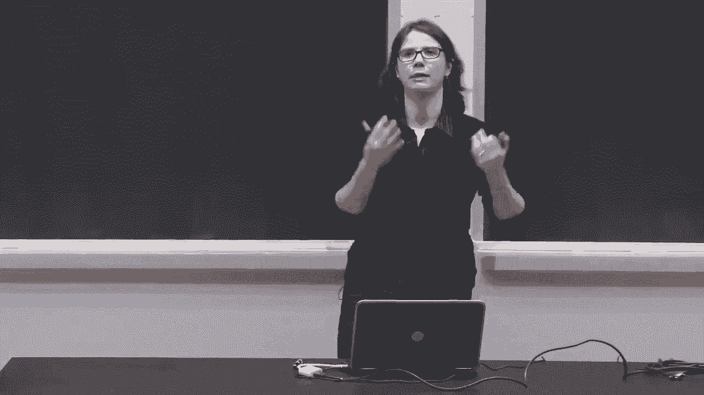

many values as we'd like so in this，specific example I'm trying to calculate。

the quotient and remainder when we，divide X by Y so this is a function。

definition here and down here I'm，calling the function with four and five。

so when I make the function call whoops，four gets assigned to X and five gets。

assigned to Y right so then Q is going，to be the integer division when X's is。

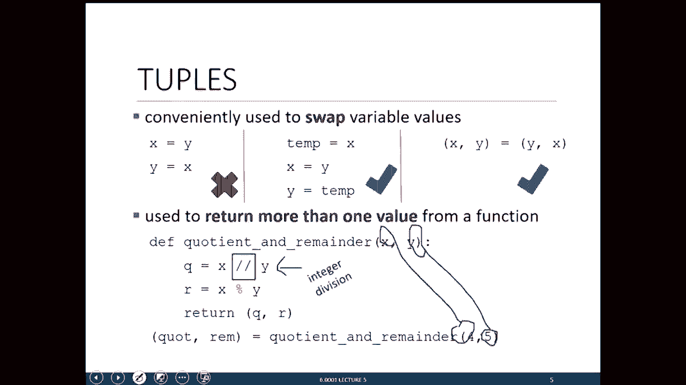

divided by Y and this double slash just，means it's like casting the result to an。

integer it says divide it keep the whole，number part and just delete everything。

else beyond the decimal point so when，you divide four by five this Q is。

actually going to be zero that's zero，point something and I don't care about。

the point something and then the，remainder is just using the percent。

operator so when I divide four by five，there the remainder is going to be four。

and notice that I'm going to be，returning Q and R which are these two。

values that I calculated inside my，function and I'm returning them in the。

context of this tuple right so I'm only，returning one object which is a tuple it。

just so happens that I'm populating that。

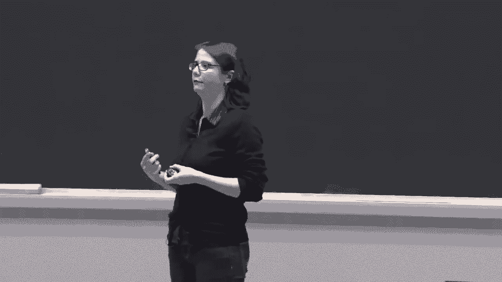

object with a few few different values，okay so when I return when the function。

returns here this is going to say 0，comma 4，that's the tuple it's going to return。

right q is going to be 0 and R is going，to be 4 so then this line here quote REM。

equals 0 4 is basically this little it's，sort of like what we did up here。

so it assigns quote to four quotes I，quote to zero and REM to four okay so we。

can use tuples this is very useful we，can use them to return more than one。

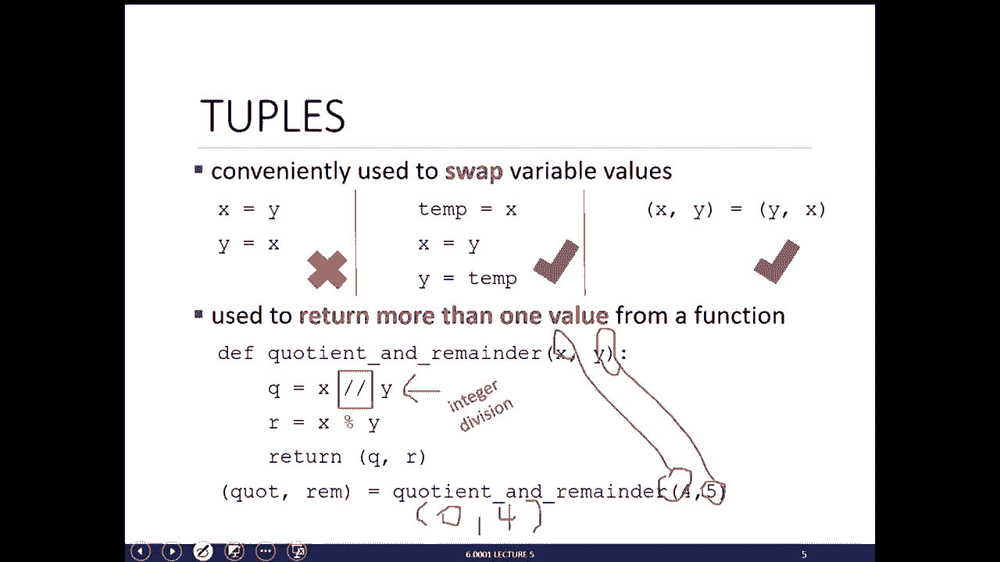

value from a function so tuples are，great might seem a little bit confusing。

at first but they're actually pretty，useful because they hold collections of。

data so here I wrote a function which I，can apply to any set of data okay and。

I'll explain what this function does and，then we can apply it to some data and。

you can see that you can extract some，very basic information from whatever set。

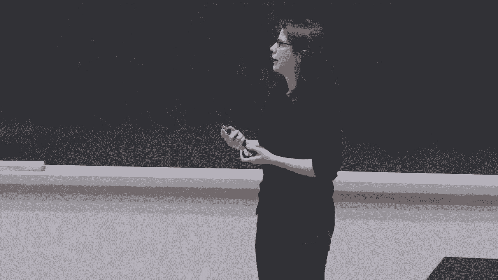

of data that you happen to collect so，here's a function called get data and it。

does all of this stuff in here，and in the actual code associated with。

the lecture I actually said what the，condition on a tuple was so it has to be。

a tuple of a certain that looks a，certain way and this is the way that has。

to look so it's one tuple the outer，square the outer parentheses out here。

represent the fact that it's a tuple and，the elements of this tuple are actually。

other tuples right so the first element，is a tuple object the second element。

tuple object and third one's a tuple，object and so on and each one of these。

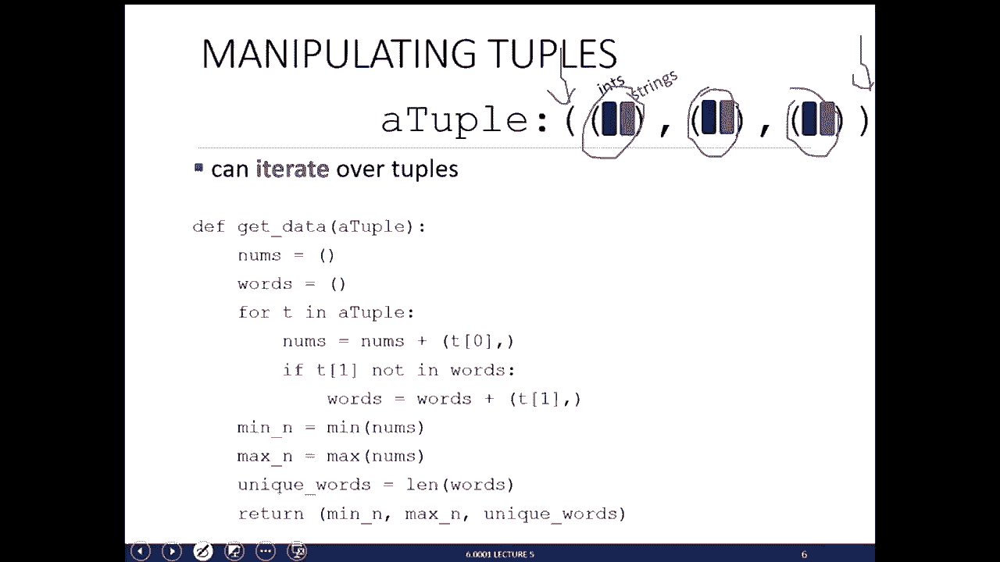

inner two pull objects are actually，going to contain two elements the first。

being an integer in the second being a，string so that's sort of the。

precondition that this function assumes，on a tuple before it can before it。

actually it can work alright so given a。

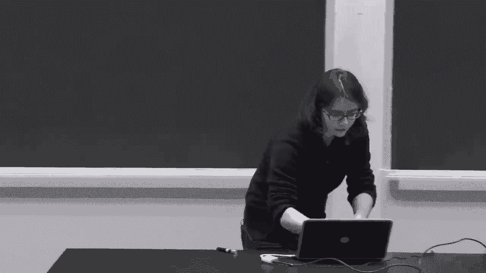

tuple that looks like that what's the，function going to do its first creating。

two empty tuples one is called nums and，what is called words and then there's a。

for loop and notice here the for loop is。

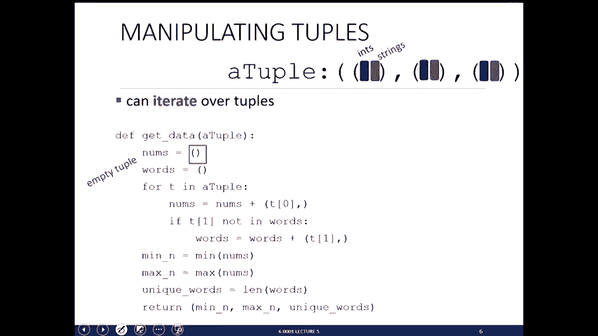

going to iterate over every element，inside the tuple remember in strings。

when we were able to use for loops that，iterated over the characters directly as。

opposed over the indices where we're，doing this same sort of thing here。

instead of iterating over the indices，we're going to iterate over the tuple，object at each。

decision okay so first time through the，loop T here is going to be this first。

tuple the second time through the loop T，is going to be this tuple and the third。

time it's going to be this exact tuple。

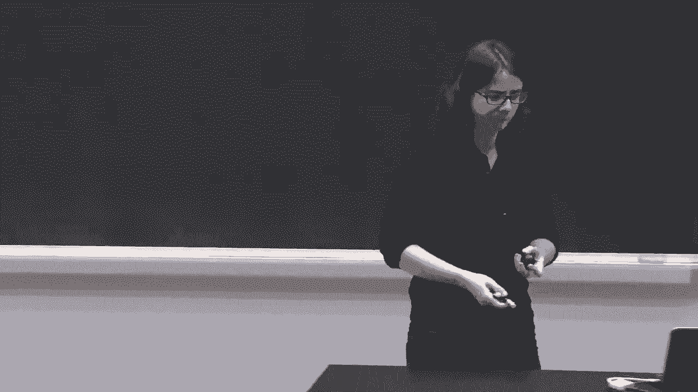

object okay so each time through the，loop what I'm doing is I'm going to have。

this nums tuple that I'm going to keep，adding to and each time I'm going to。

create a new object and reassign it to，this variable nums，and each time through the loop I'm。

looking at what the previous value of，nums was so what was my previous tuple。

and I'm going to add it with this，singleton tuple so it's a tuple of one。

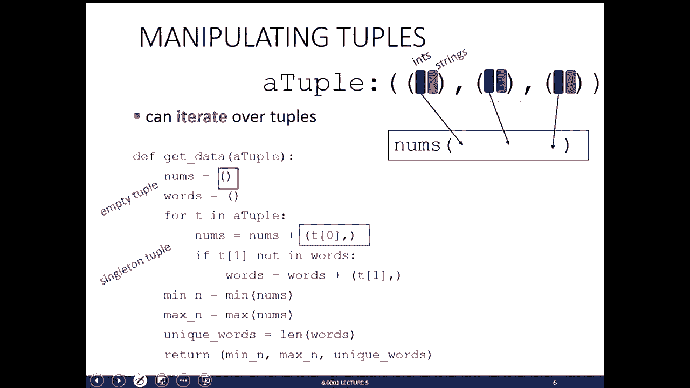

character or one element this element，being T at position zero so you have to。

sort of wrap your mind wrapp wrap your，mind around how this is working so if T。

is going to be this tuple element right，here then T at position zero is going to。

be this blue bar here so it represents，the integer portion of the tuple okay so。

as we're going through the loop this，nums is going to get populated with all。

of the integers from every one of my。

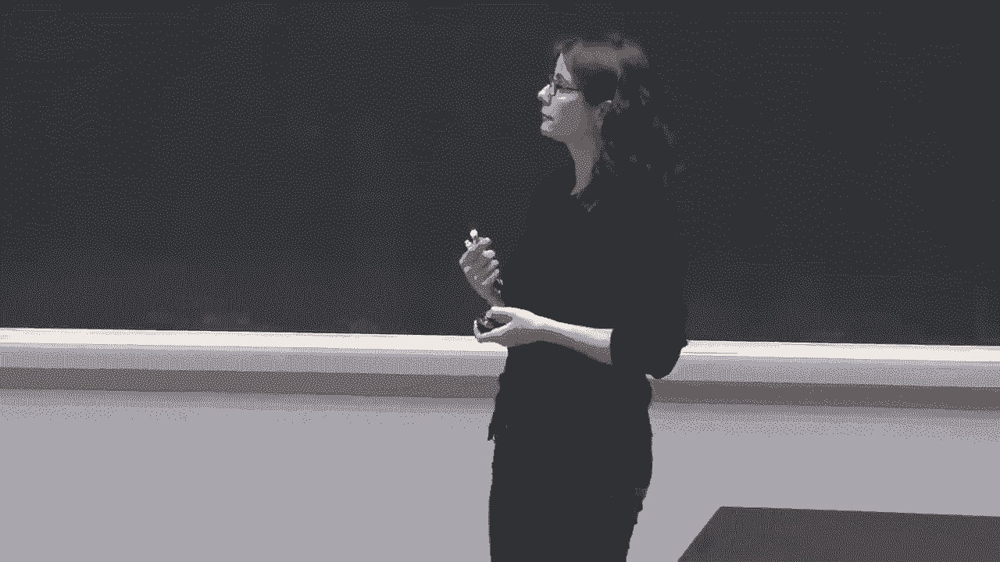

tuple in side tuple objects so that's，at the same time I'm also populating。

this words tuple Nords tuple is a little，bit different because I'm not adding。

every single one of these string objects，so T at position one being the string。

part of the inner tuple I'm actually，adding the string part only if it's not。

already in my words list okay so here，I'm essentially grabbing all of the。

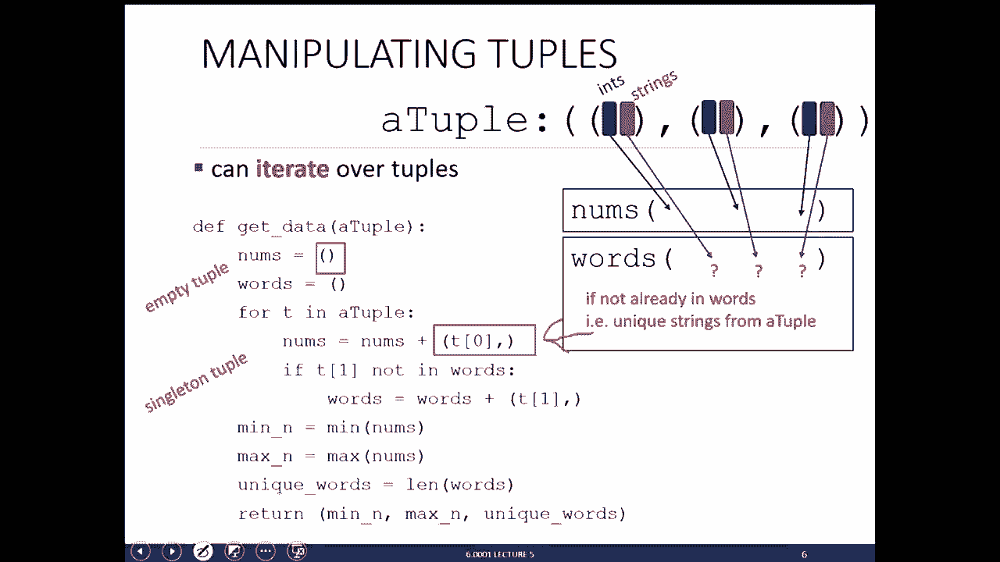

unique strings from my list these last，sort of three lines three four lines。

here just do a little bit of arithmetic，on it saying okay now I have my all of。

the numbers here what's the minimum out，of all of these and then what's the。

maximum out of all of these and then，this unique words variable tells me how。

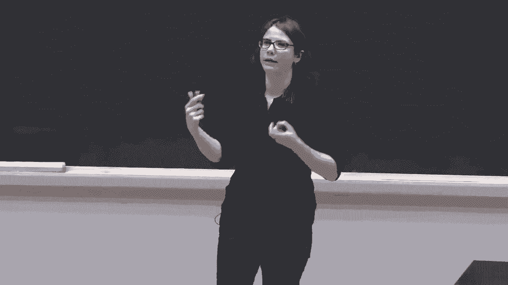

many unique words do I have in my，original tuple，so this feels sort of generic so let's。

let's let's run it on some data so here，I have it I tested it on some test data。

and then I got some actual data okay and，this actual data that I wanted to。

analyze was Taylor Swift data and，representing the integer portion of the。

tuple representing a year and the string，portion of the tuple representing the。

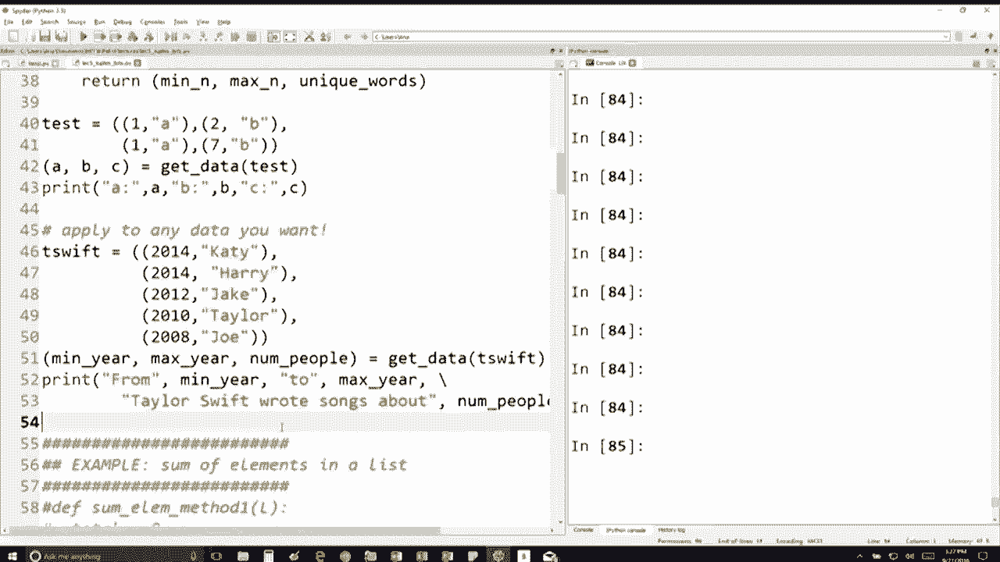

the person who she wrote a song about，that year okay so some real world data。

that we're working with here very，important that we know this this。

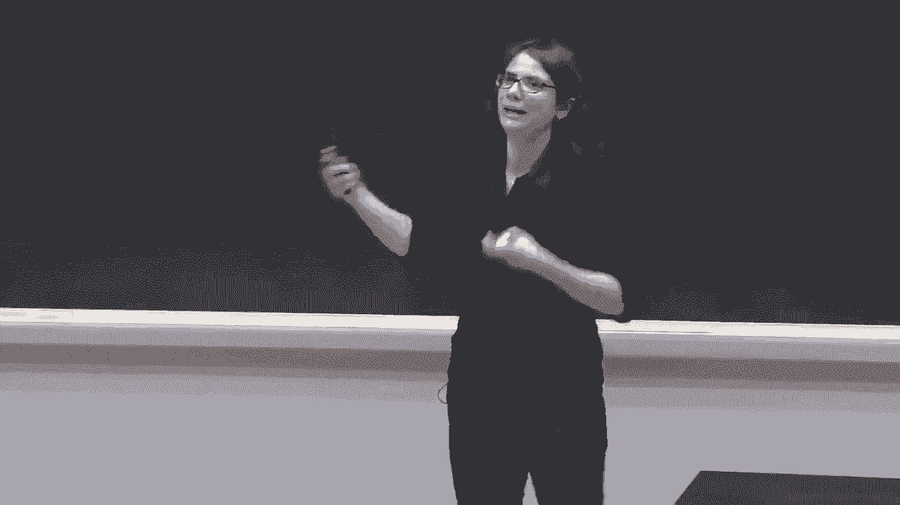

information okay so with this data I can，run it I can plug it into my this。

function that I wrote up here and I'm，going to actually comment this out so it。

this is the part where I'm calling my，function I'm calling it with this data。

here t-swift being this tuple of tuples，and what I get back is up here line 38。

is the return from the function being a，large tuple and that large tuple I'm。

then assigning it to my own tuple in my，program and then I'm just writing out。

printing out some statement here okay so，I'm getting the minimum year the maximum。

year and then the number of people so I，can show you that it works if I replace。

one of these names with another one that，I already have in here so instead of。

writing a song about five people she，would have wrote a song about four。

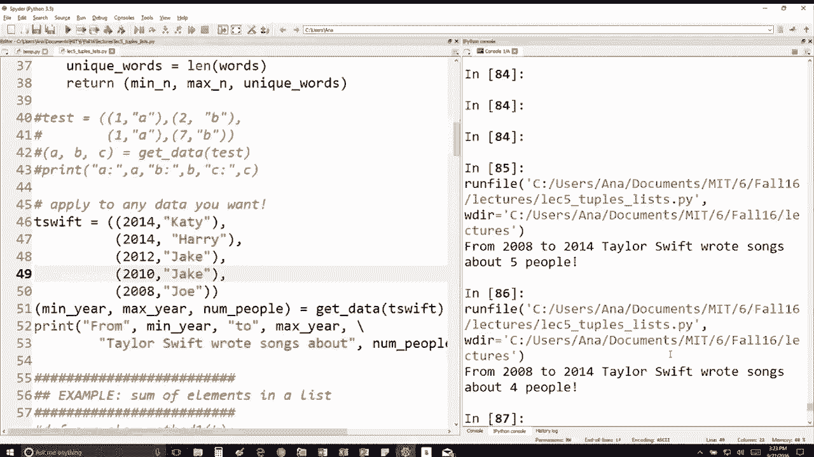

okay so so that's two poles and remember，or recall keep in mind two poles were。

immutable now we're going to look at a，very very similar data structure to。

tuples called lists so that instead of，lists being immutable lists are going to。

be mutable object objects okay so much，like lists they're going to contain。

elements of any type or objects of any，type you denote them with you to note a。

list with square brackets instead of，parentheses and the difference being。

that they're going to be mutable objects。

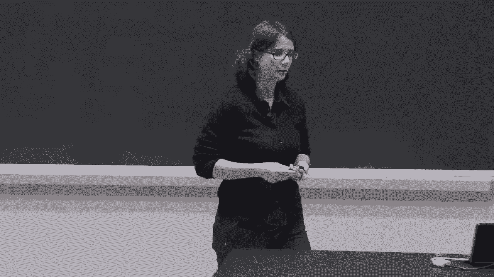

instead of immutable so creating an，empty list you just do open close square。

brackets you can have a list of elements，of different types even oops even a list。

of of Lists so one of the elements being，a list as usual you can apply lengths on。

a list and that tells you how many，elements are in it this is going to tell。

you how many elements are in your list l，so it's not going to look any further。

than that right so it's going to say，this is an integer this is a string this。

is an integer this is a list it's not，going to say how many elements are in。

this list okay it's just going to look，at the outer sort of the shell of the。

shell of elements indexing and slicing，works the same way so L opposition zero。

gives you the value two you can index，into a list and then do something with。

the value that you get back so L at，position two says that's this value。

there and add one to it L a position，three that's going to be this list here。

you're not allowed to index outside of，the length of the list so that's going。

to give you an error because we only，have four elements and you can also have。

expressions for your index so this，Python just replaces I with two here and。

say what's and says what's L at position。

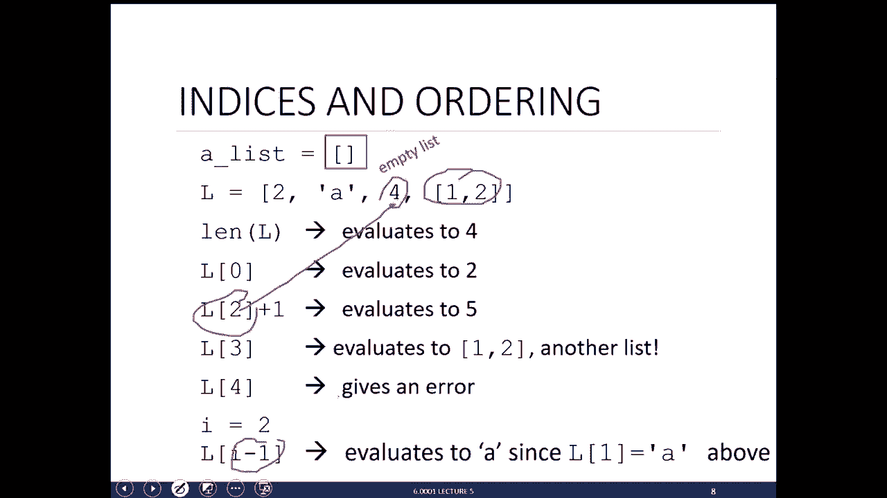

one and it grabs that from in there，okay so very very similar to the kinds。

of operations we've seen on strings and，and tuples maybe one difference and。

that's what we're going to focus on for，the rest of this class is that lists are。

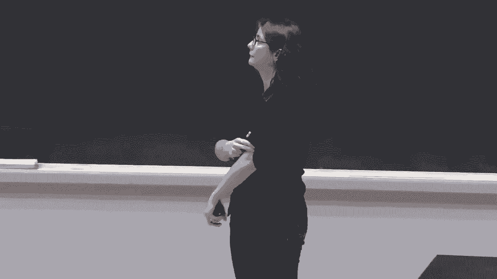

mutable mutable objects okay so what，does that mean internally internally。

that means let's say we have a list L，and we assign it sorry let's say we have。

a variable L that's going to point to a，list with three elements - one and three。

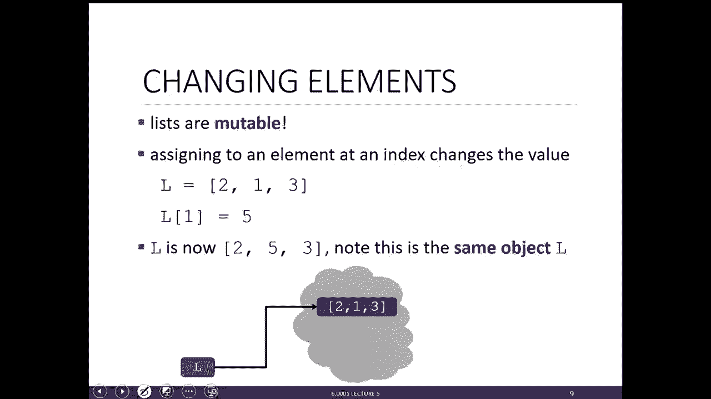

okay they're all the HH elements is an，integer when we were dealing with with。

tuples or with strings if we reassigned，if we try to do this line right here we。

had an error but this is actually。

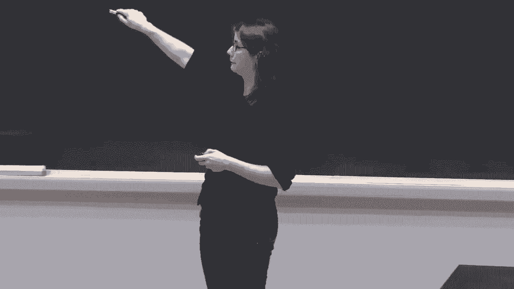

allowed with lists so when you execute，that line Python is going to look at。

that middle element and it's going to。

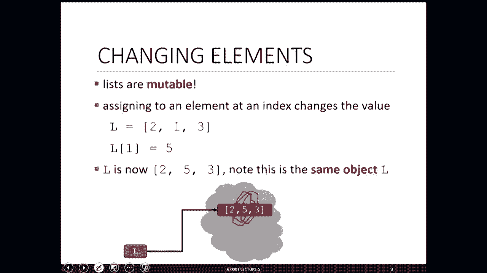

change its value from a 1 to a 5 and，that's just due to the mutability nature。

of the list okay so now notice that this，list variable this variable L which。

originally pointed to this list points，to the exact same list we haven't。

created a new object in memory we're，just modifying the same object in memory。

and you're going to see why this is，important as we look at a few side。

effects that can happen when when you，have this so I've said this a couple。

times before but it's um it'll make your，life a lot easier if you try to think of。

when you when you want to iterate，through a list if you try to think about。

iterating through the eat through the，elements directly it's a lot more。

pythonic I've used that word before so。

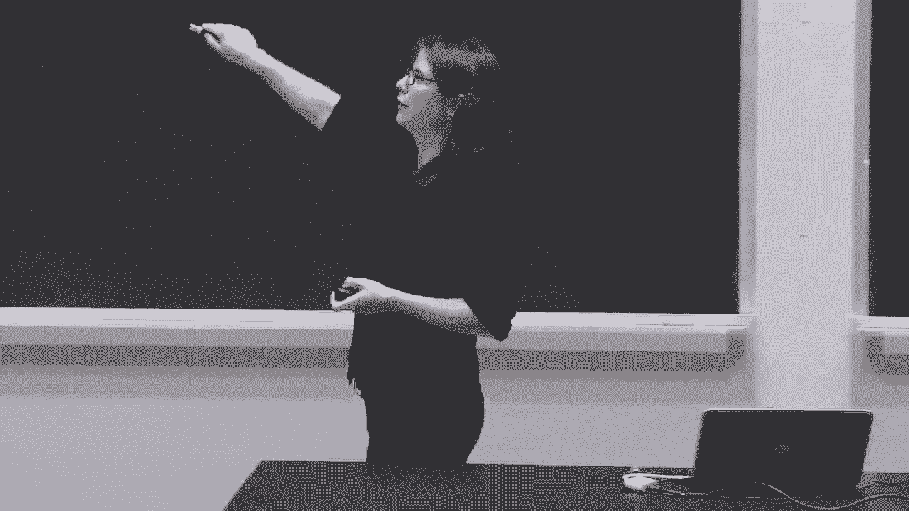

this is sort of a common pattern that，you're going to see where you're。

iterating over the list elements，directly right we've done it over two。

pools we've done it over strings so，these are identical codes they do the。

exact same thing except on the left，you're going from you're going through 0。

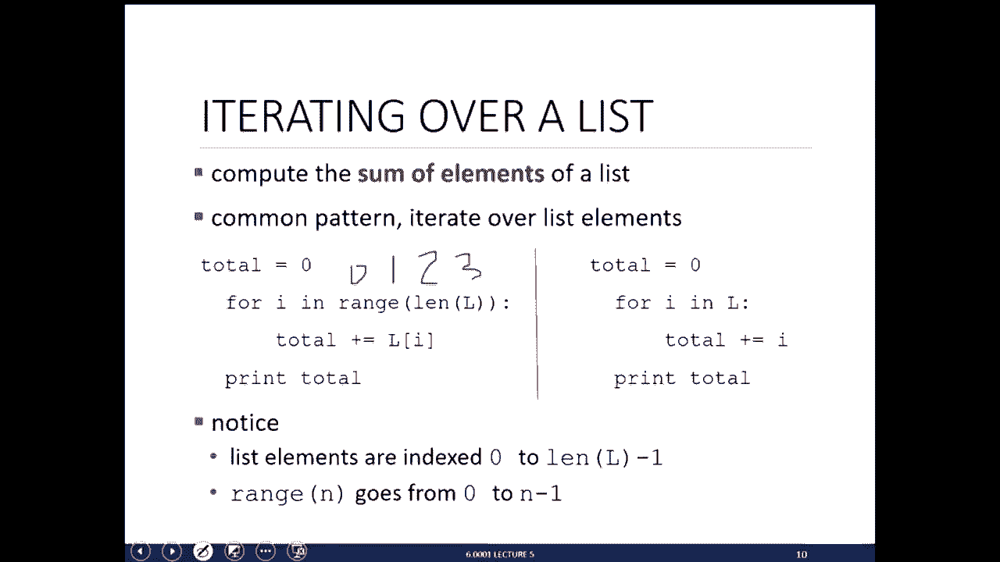

1 2 3 and so on and then you're indexing，into each one of these each one of these。

numbers to get the element value whereas。

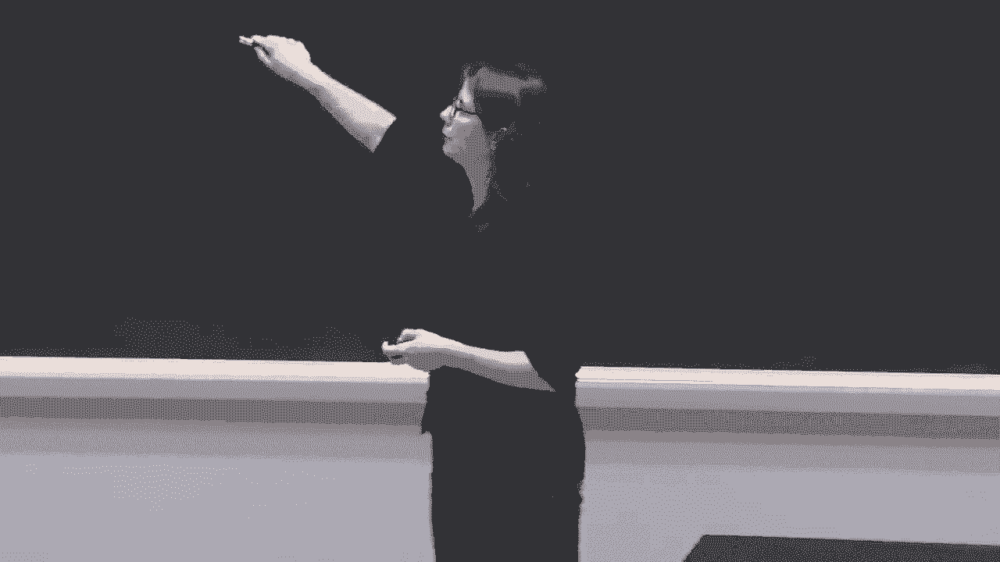

on the right this this loop variable I，is going to have the element value。

itself okay so this code on the right is。

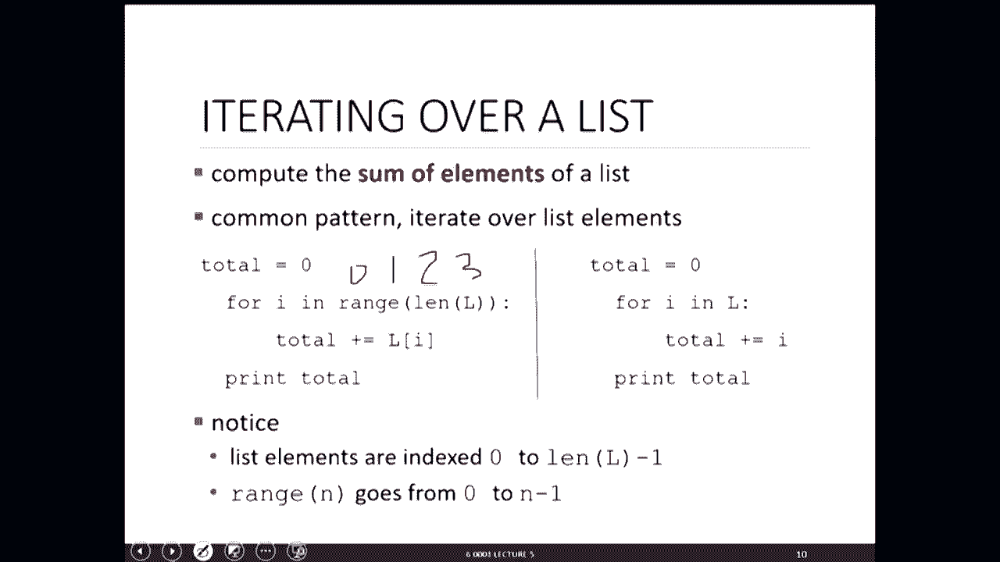

a lot cleaner okay so now let's look at，some operations that we can do on lists。

okay so there's a lot more operations，that we can do on lists because of their。

mutability aspect then we can do on。

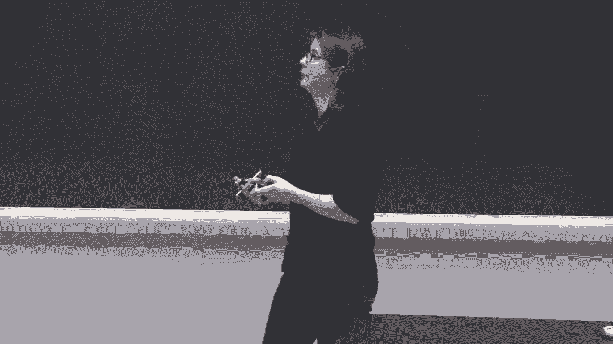

tuples or strings for example okay so，here's a few of them and they're going。

to take advantage of this mutability，concept so we can add elements directly。

to the end of the list using this，funky-looking notation l dot append and。

then the element we we want to add to，the end okay and this operation mutates。

the list so if I have L is equal to 2 1，3 and I append the element 5 to the end。

then L the same L is going to point to，the same object except is going to have。

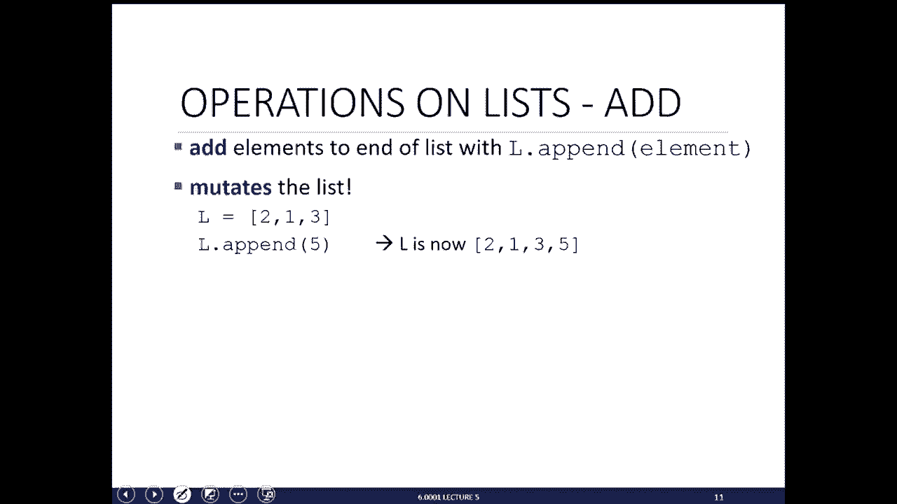

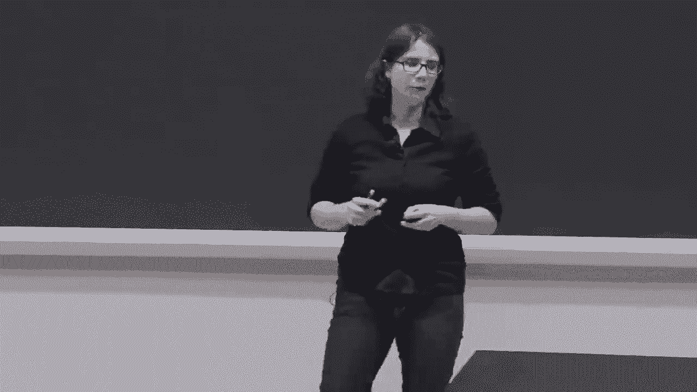

an extra number at the end 5 okay but，now what's this dot right we haven't。

really seen this before okay and it's，going to become apparent what it means。

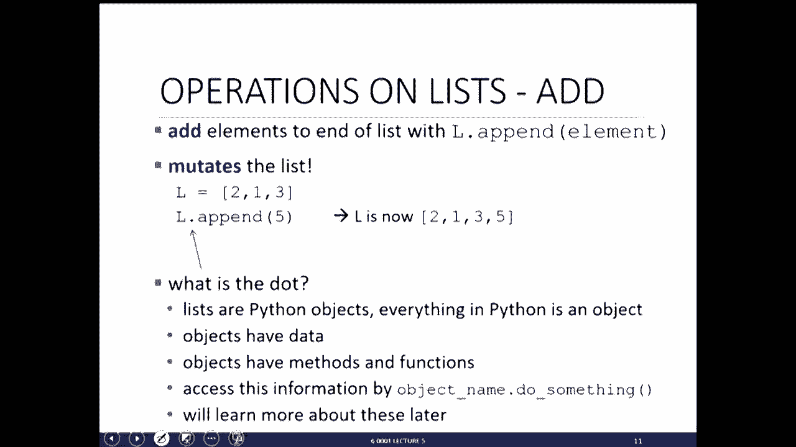

in a few lectures from now but for the，moment you can think of as of this dot。

as an operation it's it's like applying，a function except that the function that。

you're applying can only work on certain，types of objects okay so in this case。

append for example is the function we're，trying to apply and we want to apply it。

to whatever is before the dot which is，the object ok and appends only been。

defined to work with a list object for，example which is why we're using the dot。

in this case we wouldn't be able to use，append on an integer for example because。

it that sort of functions not defined on，an integer so for now you'll sort of。

have to remember or remember which which，are functions that work with a dot and。

which are functions like Len that aren't，with a dot，but in a couple lectures I promise it。

will be a lot clearer okay so for now，just think of it as whatever is before。

the dot is the object you're applying a，function to and whatever's after the dot。

is the function you're applying on the，object okay so we can add things to the。

end of our list we can also combine，lists together using the plus operator，okay。

the plus operator does not mutate the，list okay instead it gives you a new。

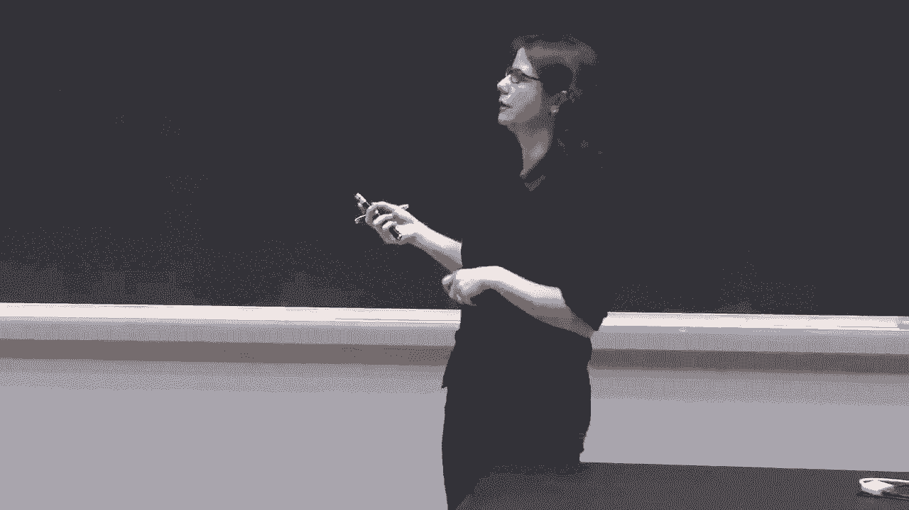

list that's the sum of those two lists，combined so in this case if L 1 is 2 1 3。

and L 2 is 4 5 6 when we add those two，lists together that's going to give us。

an entirely new list leaving L 1 and L 2，the same and that's why we have to we。

have to assign the result of the，addition to a new list otherwise the。

results lost if you want to mutate a，list directly and make it longer by the。

elements within another list then you，can use this extend function or extent。

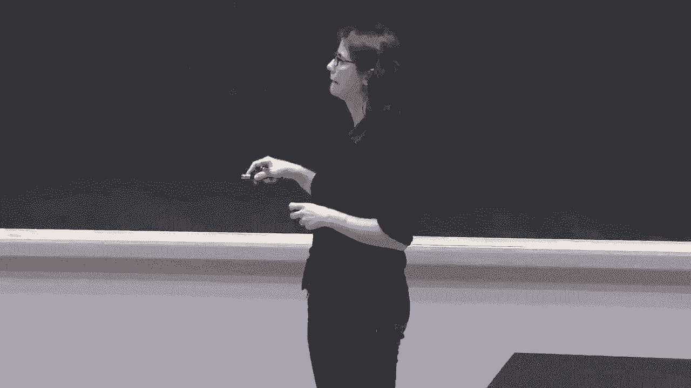

method okay and this is going to mutate，L 1 directly so if L 1 was 2 1 3 if you。

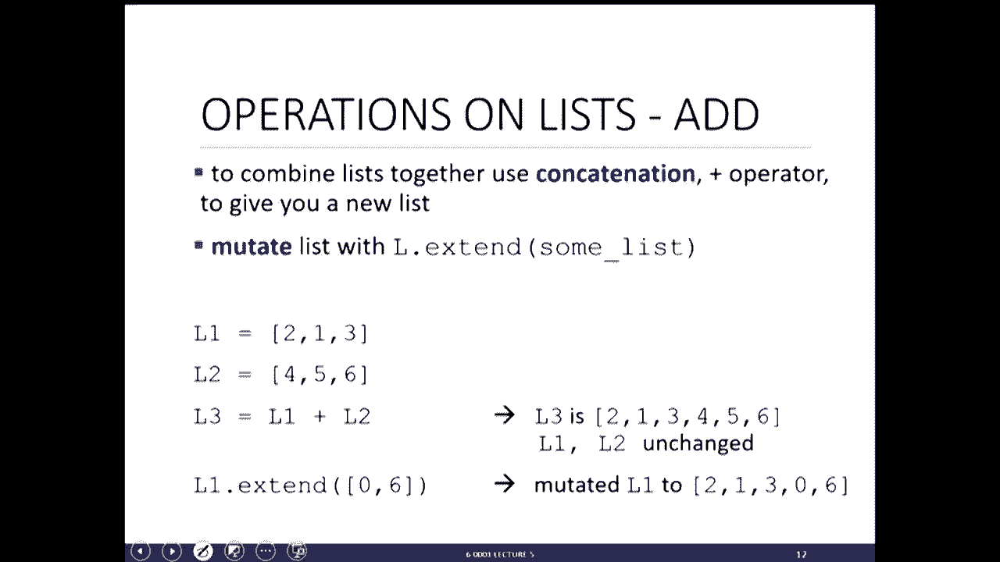

extend it by the list 0 6 it's just，going to tack on 0 6 to L 1 directly so。

okay so that's adding things to list we，can also delete things from lists right。

we don't just want to keep adding to our，lists because then they become very very。

big so let's see how we can delete some。

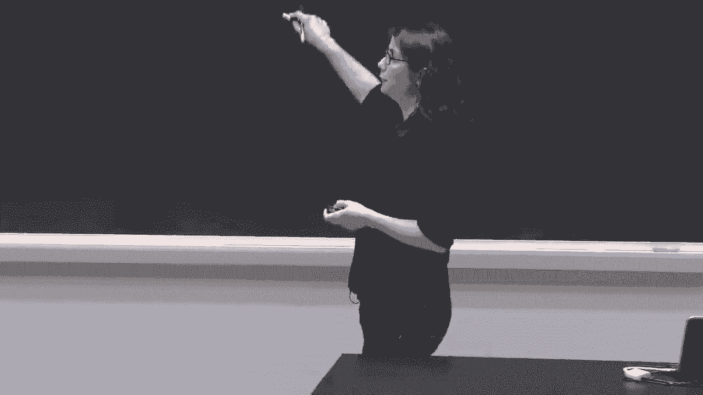

some items from our list there's a few，ways first one being you can use this。

del function and this says delete from。

the list l the element at this index，okay so you give it the index 0 1 2 or。

whatever you want whatever index you，want to delete the element at if you。

just want to delete the element at the。

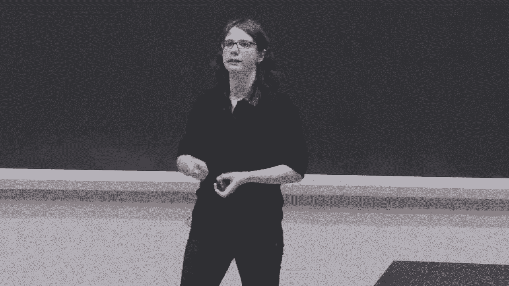

end of the list that's the farthest，right you do l dot pop if you want to。

remove a specific element so you know，there's somewhere in your list there's。

you know there's the number 5 and you，want to delete it from the list then you。

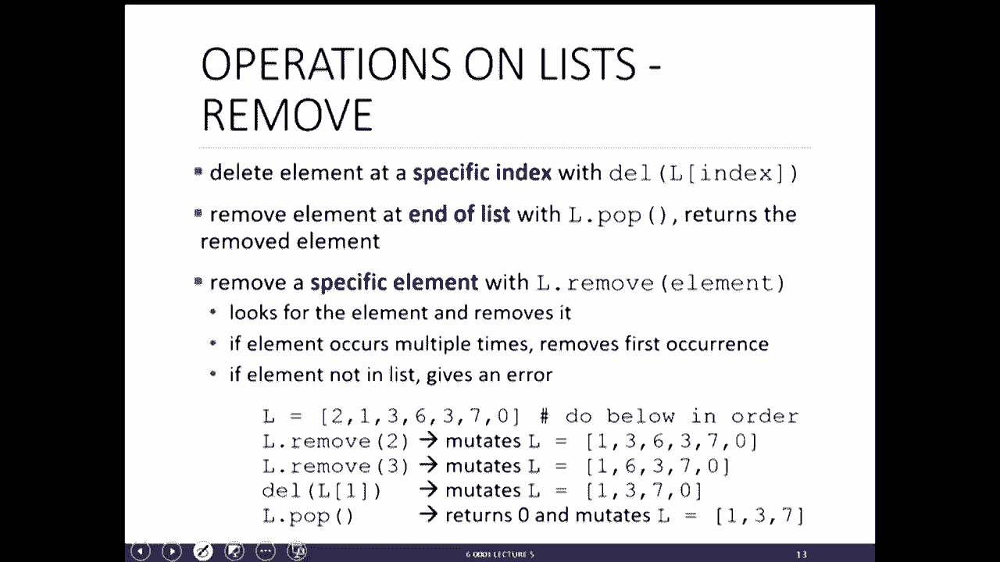

say l dot remove and you say what，element you want to remove and that only。

removes the very first occurrence of it。

so if there's two fives in your list，then it's only going to remove the very。

first one okay so let's take a look at。

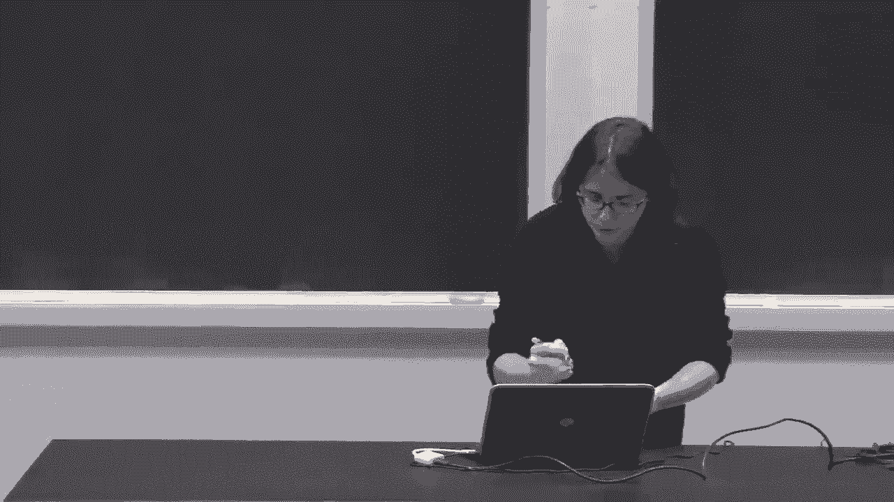

this sort of sequence of sequence of，commands so we have first L is equal to。

this this long list here and I want to，mention that all of these operations are。

going to mutate our list which is why I，wrote this comment here that says assume。

that you're doing these in order ok so，as you're doing these in order you're。

going to be mutating your list and if，you're mutating your list you have to。

remember that you're working with this，new mutated list ok so the first thing。

we're doing is we're removing two from，our list so when you remove - this says。

look for an element with the value 2 and，take it away from the list so that's the。

very first one here so the list we're，left with is just everything after it。

then I want to remove 3 from the list，and notice there's two of them there's。

this 3 here and there's this 3 here so，we're going to remove only the first one。

okay which is this one here so the list，we're left with is 1 6 3 7 0 then we're。

going to delete from the list l the，element at position 1 so starting。

counting from 0 the element at position，1 is this one，here so we've removed that and we're。

left with one three seven zero and then，when we do l dot pop that's going to。

delete the element furthest to the right，so at the end of the list which is that。

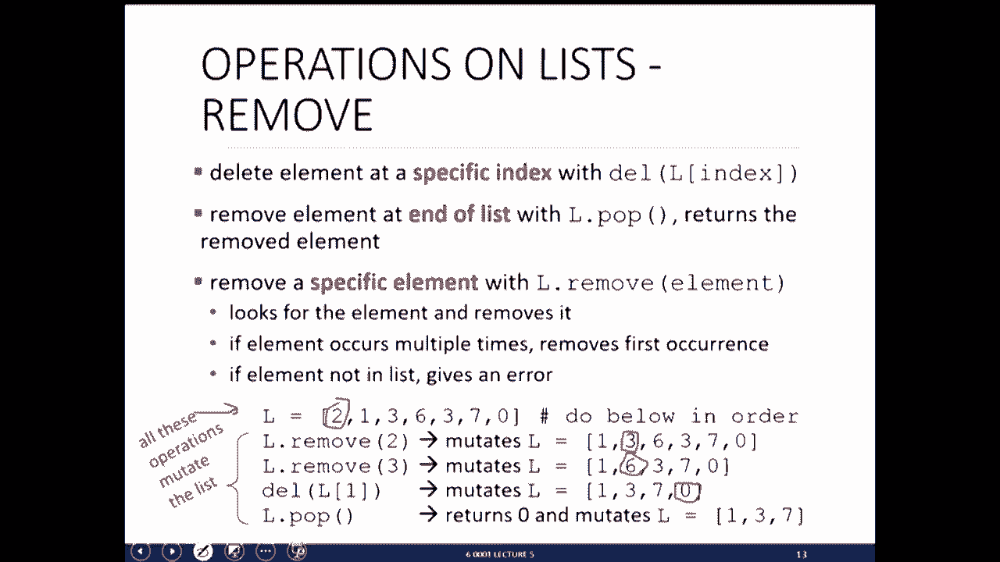

zero so then we're left with only one，three and seven okay and l dot pop is。

often useful because it tells you the，return value from l dot pop is going to。

be the value that it removed so in this，case it's going to return zero I want to。

mention though that some of the so these，functions all mutate the list you have。

to be careful with return values so，these are all you can all you can think。

of all of these as functions right that，operate on a list except that what these。

functions do is they take in the list，and they modify it okay but as functions。

they obviously return something back to，whoever called them right and oftentimes。

they're going to return the value none，okay so for example if you are going to。

do l dot remove two and you print that，out that might print out none for you。

okay so you can't just assign the value，of this to a variable and expect it to。

be the mutated list right the list that，the list got mutated，the list that got mutated is the list。

that was passed into here okay we're，gonna look at one example in a few。

slides that's going to show this okay，another thing that we can do and this is。

often useful when you're working with，data is to convert lists of strings and。

then strings to lists okay sometimes a，might be useful to work with with。

strings as opposed to a list and vice，versa，okay so this first line here lists s。

takes in a string and casts it to a list，so much like we cast a float to an。

integer for example you're just casting，a string to a list here and when you do。

that at this line so if this is your s，here when you do list s this is going to。

give you a list looks like this where，every single character in s is going to。

be its own element so that means，everywhere character is going to be a。

string and it's going to be separated by，okay sometimes you don't want each。

character in the list to be its own，element sometimes you want for example。

if you're given a sentence you might，want to have everything in between，spaces being its own element。

so that will give you every word in the。

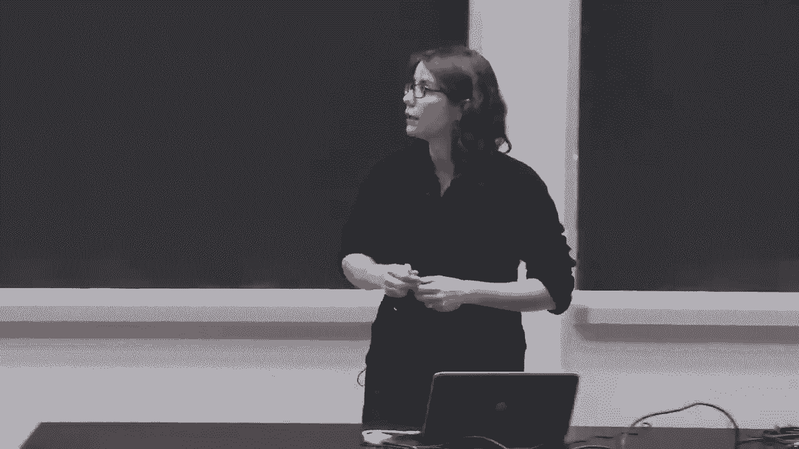

sentence for example in that case you're，going to use split in this case I've。

split over the less than sign but again，if you're doing the the sentence example。

you might want to split on a space so，this is going to take everything in。

between the sign that you're interested，in in this case the less than sign and。

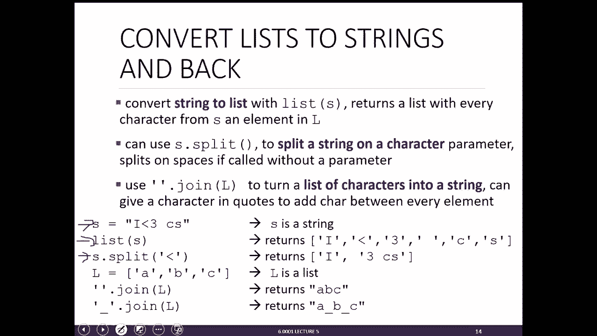

it's going to set it as a separate，element in the list so that's how you。

convert string strings to lists and，sometimes you are given a list and you。

might want to convert it to a string so，that's where this join method or。

function is useful so this is an empty，string so it's just open close quote。

right away no space so this just joins。

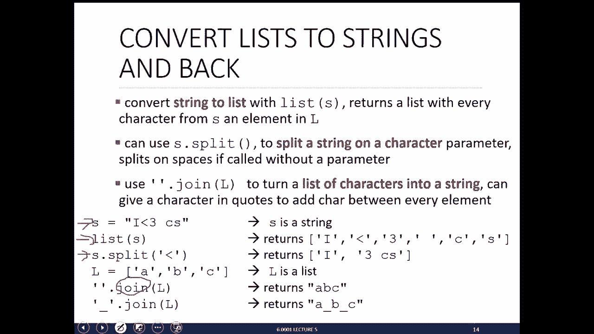

every every one of the elements in the，list together so to return this string。

ABC and then you can join on any，character that you would want so in this。

case you can join on the underscore okay，so to put whatever characters in here。

and between every one of the elements in，your list pretty useful functions okay a。

couple other operations we can do on，lists and these are also pretty useful。

is to sort lists into reverse lists and，many many others in the Python。

documentation so sort and sorted both，sort lists but one of them mutates the。

list and the other one does not and，sometimes it's useful to use one and。

sometimes it's useful to use the other。

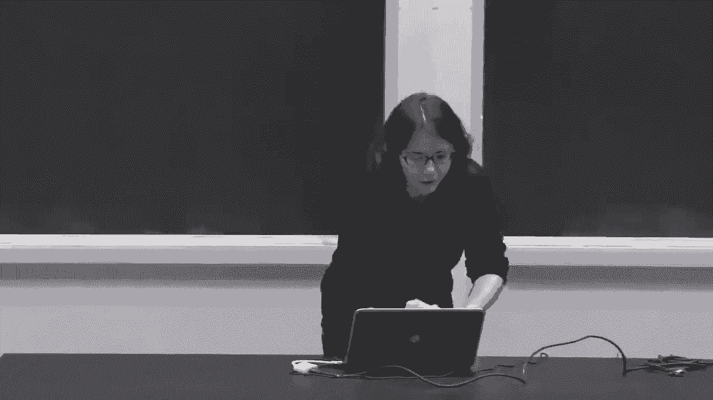

okay so if I have this list L is equal，to nine 6：03 sorted you can think of it。

as give me the sorted version of L gives，you back the sorted version of L so it。

returns a new list that's the sorted，version of the input list and does not，mutate。

so keeps out the exact same way so this，will be replaced by the sorted version。

of the list which you can assign to a，variable and then do whatever you want。

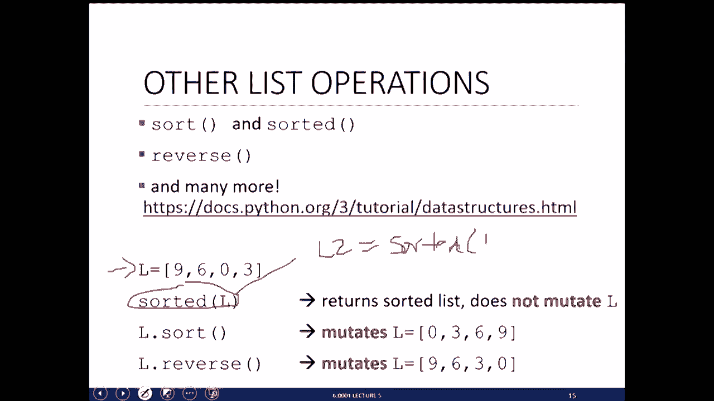

with it like l2 is equal to sorted out，for example okay and it keeps all the。

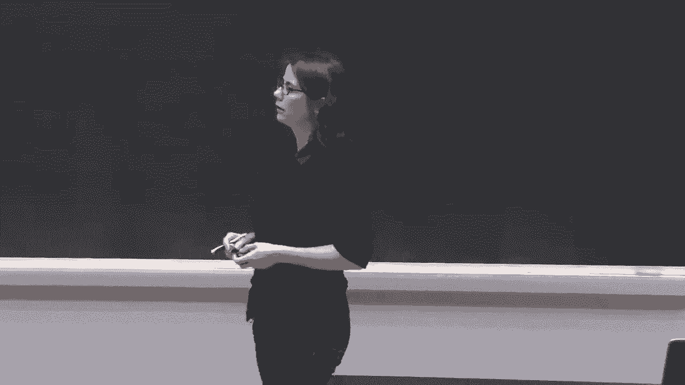

same on the other hand if you just want，to mutate L and you don't care about。

getting another copy that's sorted you，just do L dot sort and that's going to。

automatically sort L for you and L now，contain L net L is now the sorted the。

sorted version of L similarly reverse is，going to take L and reverse all the。

character all the elements in it so the。

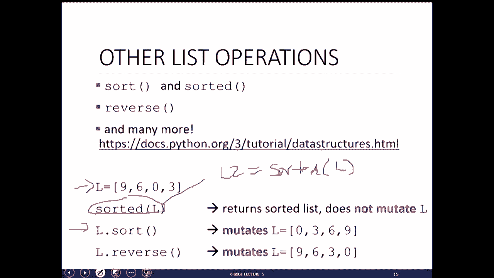

last one is the first one the second，last one is the second one and so on so。

lists are mutable we've said that so，many times this lecture but what exactly。

does that mean what implications does，that does that have okay once again this。

next part of the lecture Python tutor，just type you know paste all the code in。

and go step by step to see exactly，what's what's happening so lists are。

mutable as you have variable variable，names so for example L is equal to some。

list that L is going to be pointing to，the list in memory okay and since it's a。

mutable object this list you can have，more than one variable that points to。

the exact same object in memory okay and，if you have more than one variable that。

points to the same object in memory if，that object in memory is changed then。

when you access it through any one of，these variables they're all going to。

give you the changed the changed object，value okay so the key phrase to keep in。

mind when you're dealing with lists is，what side effects could happen right if。

you're mutating a list if you're doing，operations on lists what what side。

effects you know what variables might be。

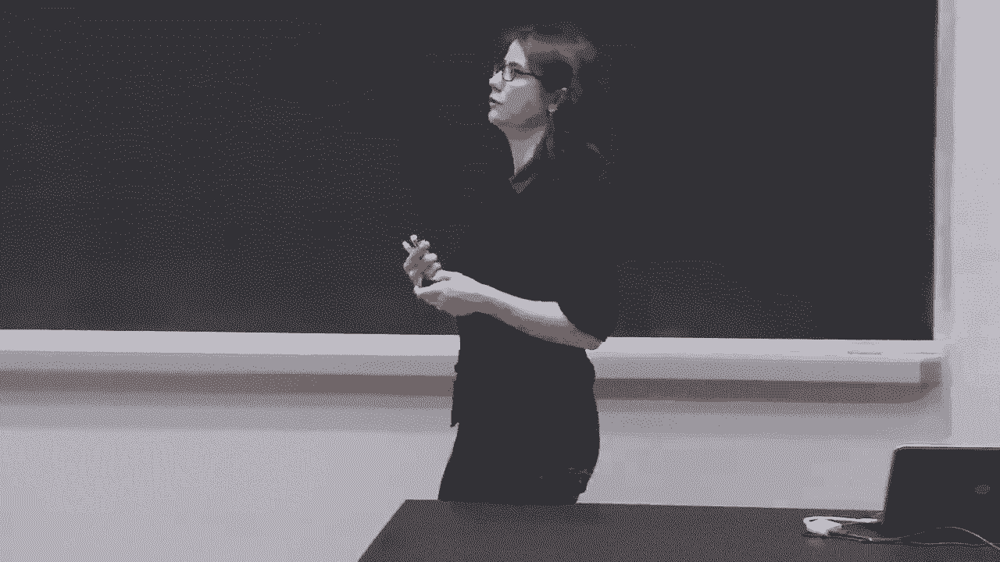

affected by by this change okay let's，come back down to earth for a sec。

and okay this will wake a lot of people，up okay so let's do an analogy with with。

people okay let's say we have a person a，person this case Justin Bieber is going。

to be an object right I'm an object，right I'm like the number three Bieber's。

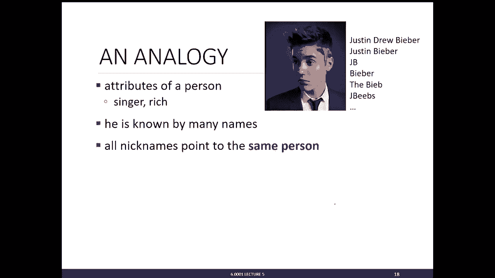

an object he's like number five right，different objects were both of type。

people okay let's say a person has，different attributes right let's say we。

can let's say he gets two attributes to，begin with he's a singer and he's rich。

okay I can refer to this person object，by many different names right his full。

name his stage name all of the fangirls，call him by these names people who。

dislike him call him by other names that，I didn't put up here okay but he's known。

by any by all these different names，they're all aliases or nicknames that。

point to this same person object right，okay so originally let's say I say。

Justin Bieber's a singer and rich those，are the two attributes。

I've originally assigned to him and then，let's say I want to assign a different。

attribute to him and say Justin Bieber's。

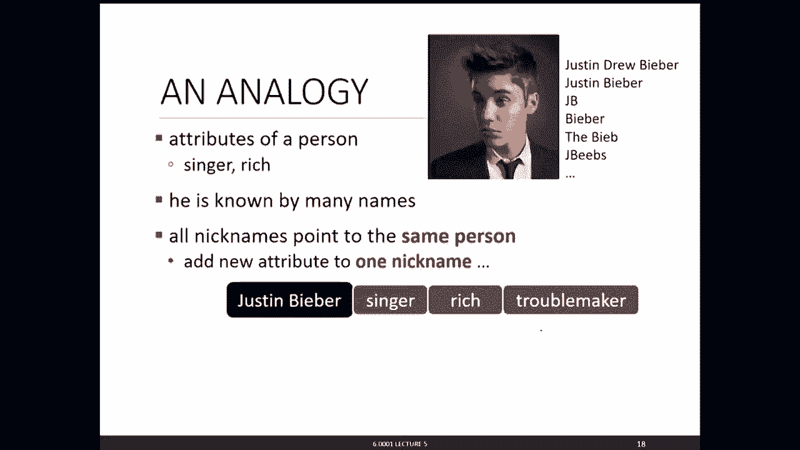

singer rich and a troublemaker，I'm being kind here okay okay so if I。

say Justin Bieber's these three has，these three attributes so it's the same。

person I'm referring to then all of his，nicknames right are going to refer to。

this exact same person so all of his，nicknames are going to or aliases will。

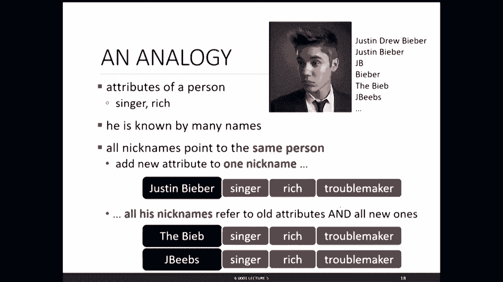

refer to the same person object right，with these changed attributes okay does。

that make sense okay so that sort of，idea arises in lists so lists is like a。

person object whose value whose，attributes can change for example and as。

they change all of the different aliases，for this object will point to this。

changed object okay so let's see a few，examples I apologize if this is a little。

a little small but this I basically copy，and pasted from the Python tutor which。

is just in the from the code from。

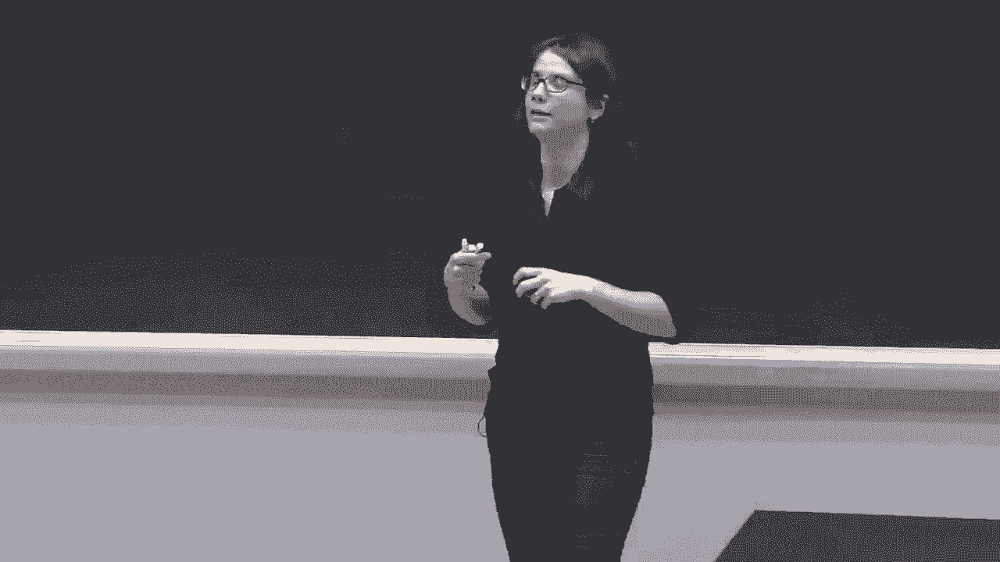

today's lecture，so I have this these lines of code here，the first couple of lines really just。

show what happens when you're dealing，with non mutable objects so with non。

mutable objects you have two separate，objects that get their own values and。

that's it end of story with lists，however to do it there's something。

different that happens so I have warm is，a variable and it's going to be equal to。

this list the warm is going to point to，this list here red yellow orange it。

contains three elements hot is equal to，warm means I'm creating an alias for。

this list and I'm in the alias is going，to be with this variable hot。

so notice warm and hot point to the，exact same object so on line eight when。

I append a when I append this string，pink to my object since both of these。

two variables point to the exact same，object if I'm trying to access this。

object through either variable they're，going through both going to put print。

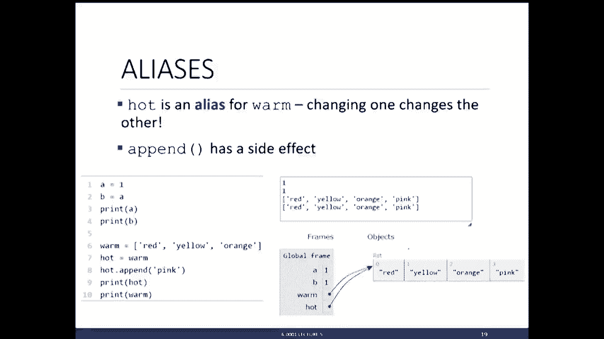

out the same thing okay and that's the，side effect that's a side effect of。

Lists being lists being mutable okay if，you want to create an entirely new copy。

of the list then you can clone it which。

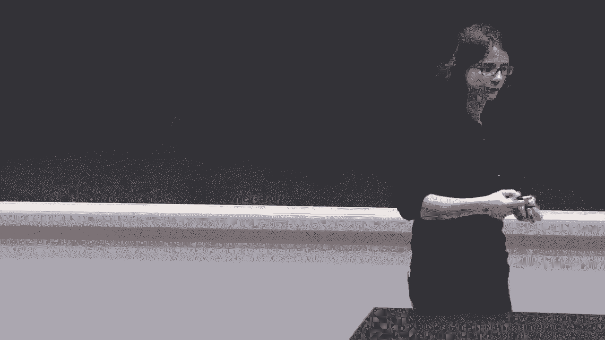

sounds really cool but really it's just，making a copy of the list and you clone。

it using this little notation here which，is open close square brackets with a。

colon and we've sort of seen the，sensation here and this tells Python。

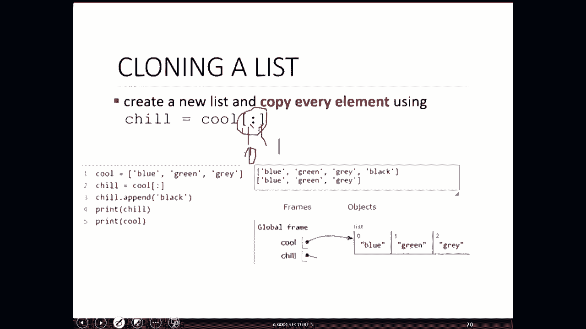

this is 0 sorry this is 0 and this is，length cool I guess what it basically。

says take every element create a new，list with those exact same elements and。

assign it to the variable chill so here，if I originally have cool is equal to。

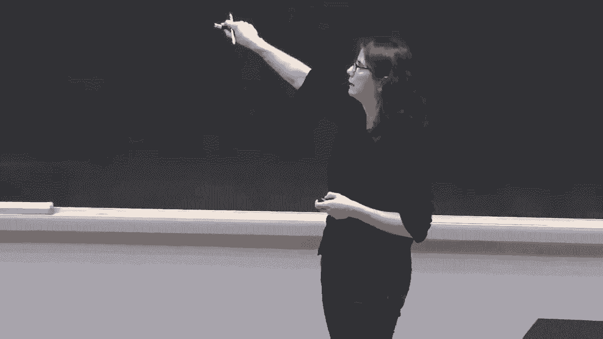

blue green gray right here when I clone，it on line two with with that funky。

notation I'm creating a new copy of it，and then on the next line when I'm。

appending another element to the to the，copy notice I'm just，altering the copy the original stayed。

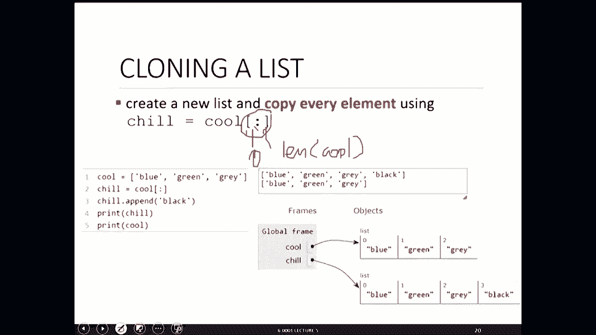

the same because I've cloned it so if，you don't want to have this side effect。

side effect issue then you should clone，so let's see a slightly more complicated。

example example where you're going to，see the difference between sort and。

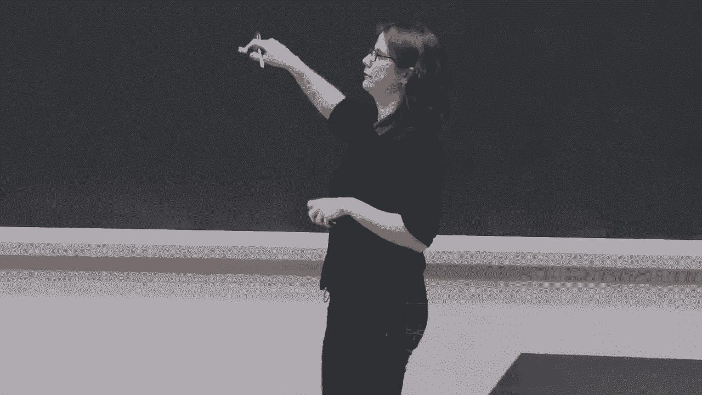

sorted in the context of this mutability，and in side-effects issue okay so once。

again let's create this warm is equal to，red yellow orange so that's what warm is。

going to point to this list and then，sorted warm is equal to warm dot sort so。

dot sort mutates so as soon as I do that，that list warm is now the sorted version。

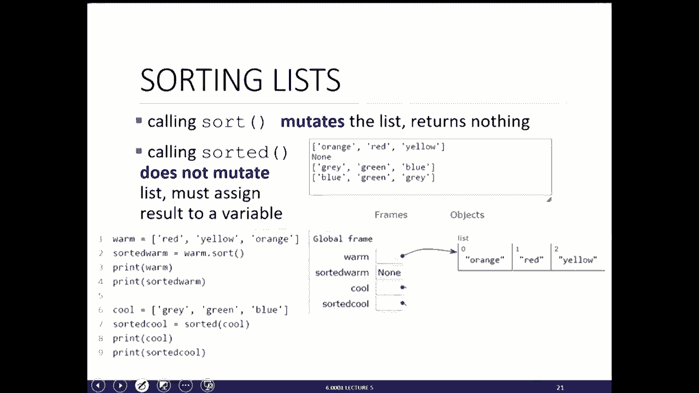

of it and notice that I've assigned the，return of this to sorted warm and the。

return is none because L dot sort or dot，dot sort mutated the list it didn't。

return a sorted version of the list it，mutated the list itself okay so when I。

print warm and I sorted warm I'm praying，the mutated version and then this nun。

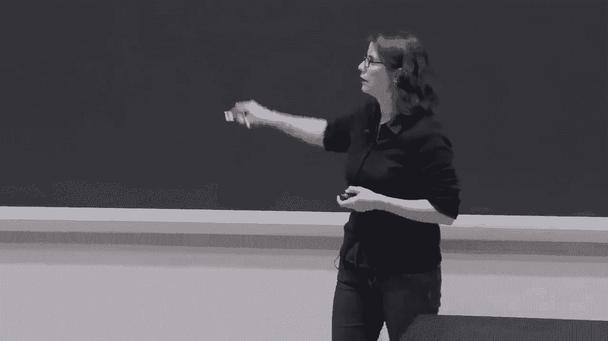

here sort it on the other hand returns，it doesn't sort of does not sort the。

list that that's given to it and instead，it returns a sorted version of the list。

so in this case if cool is equal to，these three colors gray green blue if I。

do sorted cool it's going to return the，sorted version of that list which is。

blue green gray and it's assigned to the，variable sorted cool so when I print。

them it's going to show me the two，separate lists one being the original。

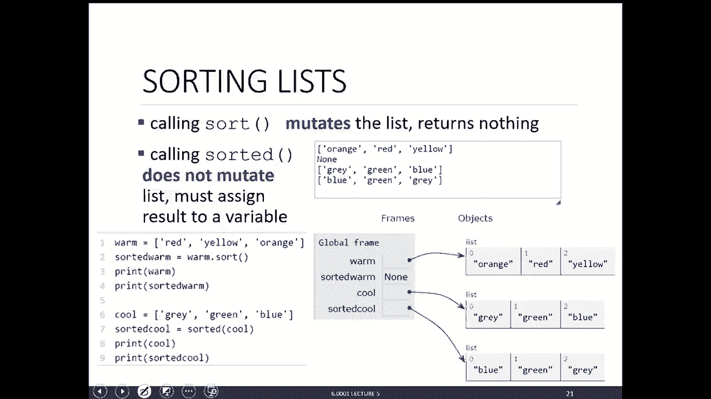

unsorted one and one being this sorted，last one's a little bit more complicated。

but it shows that even though you could，you have nested even though you can have。

nested lists you still you're not you。

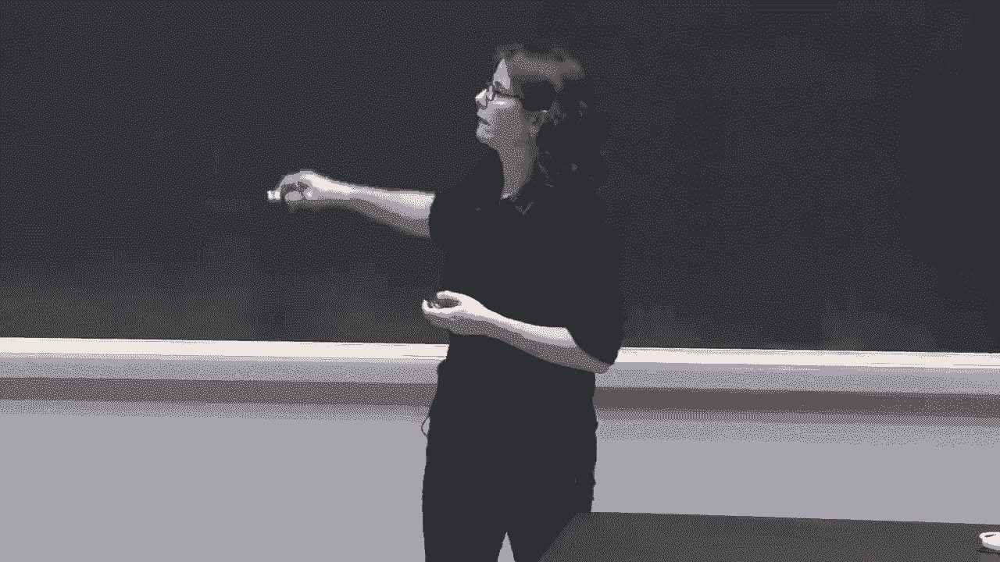

side effects so first I'm going to，create warm is equal to these two colors。

yellow orange so warm is the points to，these two colors hot is equal to this。

one list a list with one element bright，colors is going to be a list and the。

element inside the list is a list itself，so since it's a list it's this is your。

list and the element inside here which，is a list itself is actually just。

pointing to whatever warm is that object，okay then I do then I append hot to my。

bright colors so the next element here，is going to be another list which means。

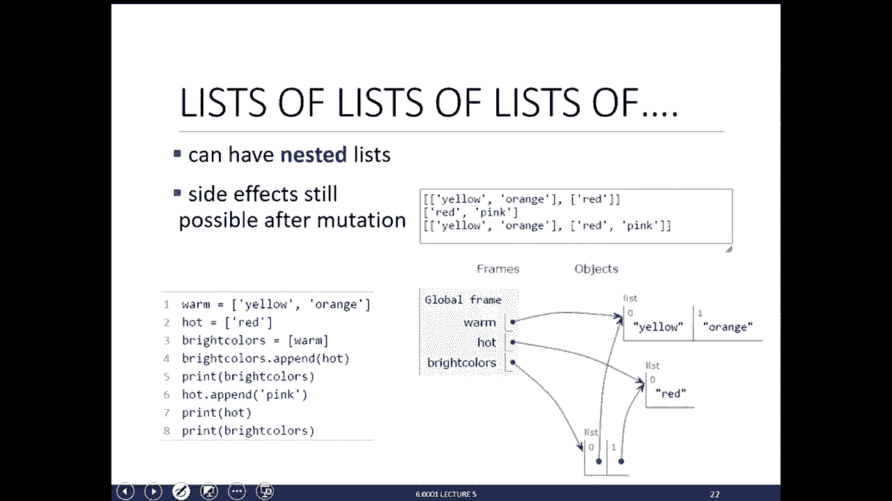

it's just pointing to this other list，here it's not creating a copy of it okay。

so each one of these elements here is，actually just pointing to these two。

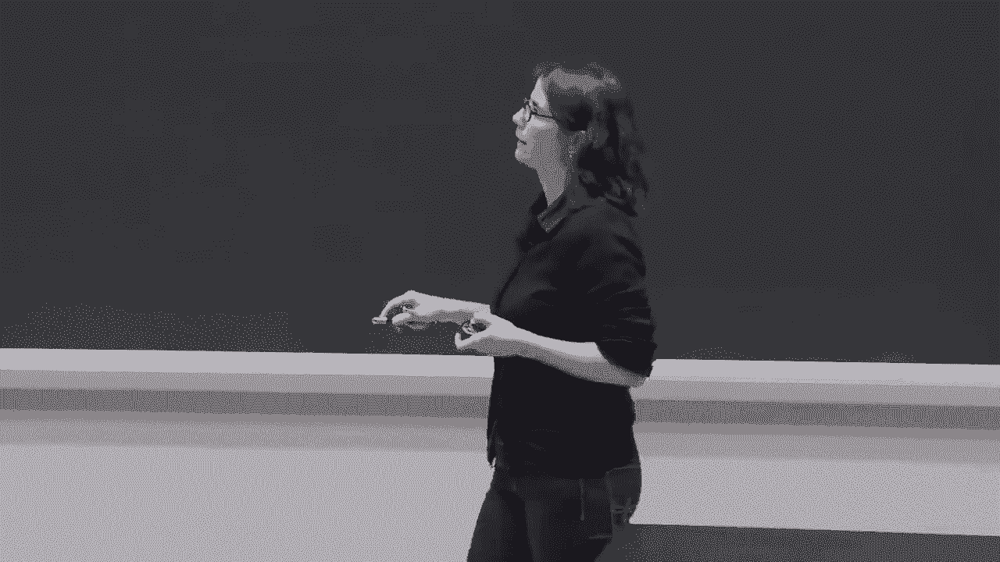

lists here so if I modified either one，of these then bright colors would also。

be modified so let's say I add pink here，to my hot list we have red and pink then。

notice that bright colors the first，element points this list and the second。

element points to this list which I've。

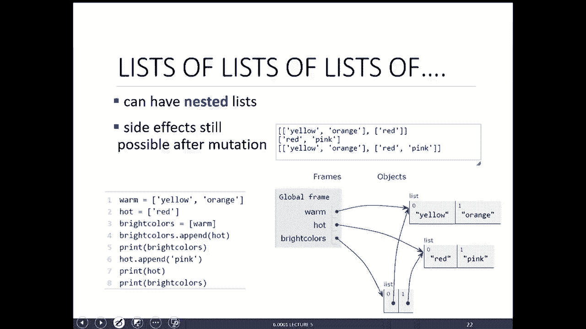

just modified last thing is I'll let you，try this as an exercise in Python tutor。

but the idea here being you should be，careful as you're writing a for loop。

that iterates over a list that you're，modifying inside the list in this case。

I'm trying to go through the list l1 and，if I find an item that's in l1 and l2 I。

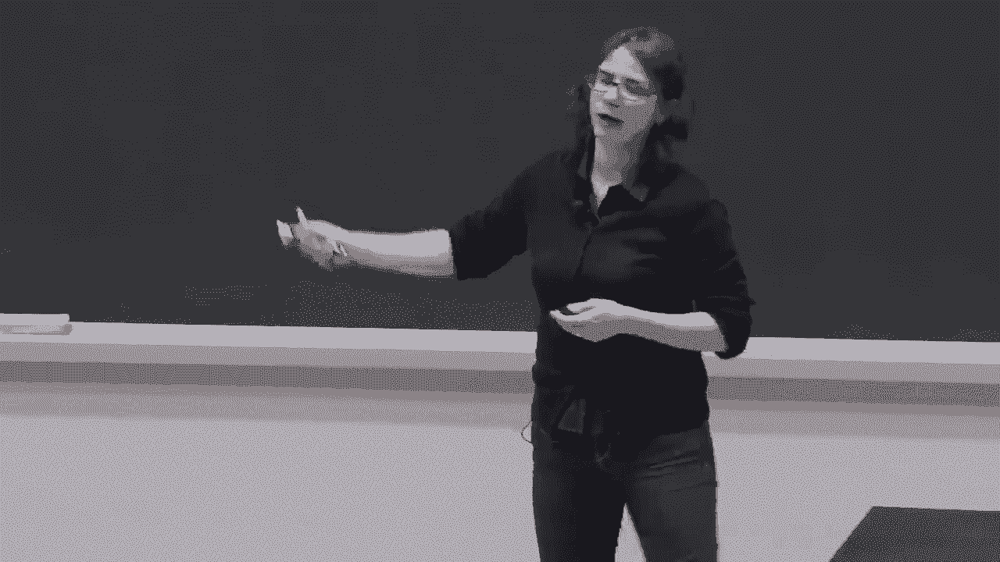

want to delete it from l1 so one in two，are also in l2 so I want to delete them。

from l1 and be left with three four，however the code on the left here。

doesn't actually do what I think it's，doing because here I'm I'm modifying a，the。

scenes Python keeps this this keeps，track of the index and doesn't update。

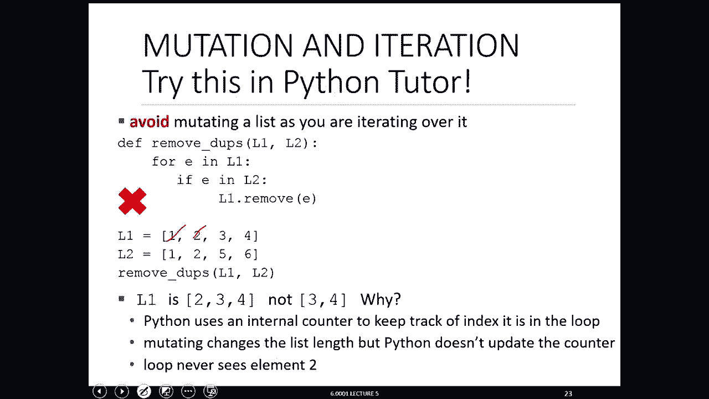

the index as its as you're changing the，list so it figures out the length of the。

list to begin with and how many indices。

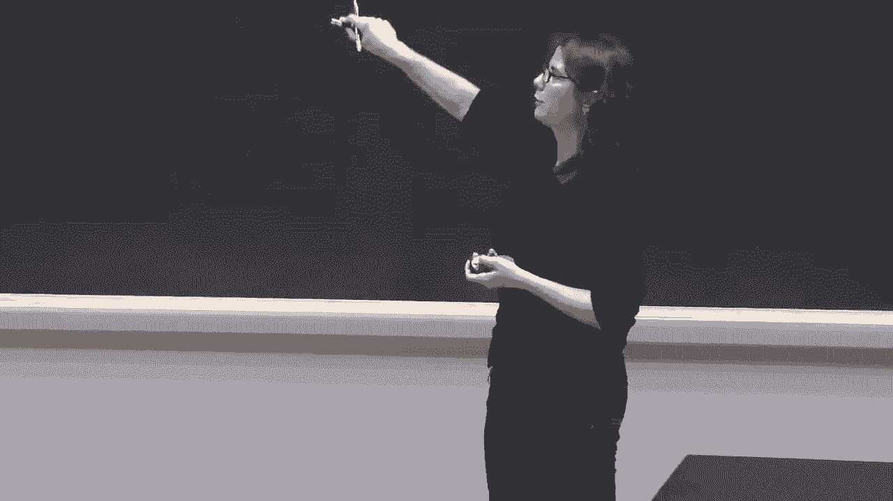

it has and doesn't update it as you're，removing items from the list so the。

solution to that is to make a copy of，the list first iterate over the copy。

which will remain intact and modify the。

list that you want to modify inside the，loop so please run both of these in the。

Python tutor and you'll see that what，ends up happening is on the left you're。

going to skip over one element okay so，you show your code so that's that's。

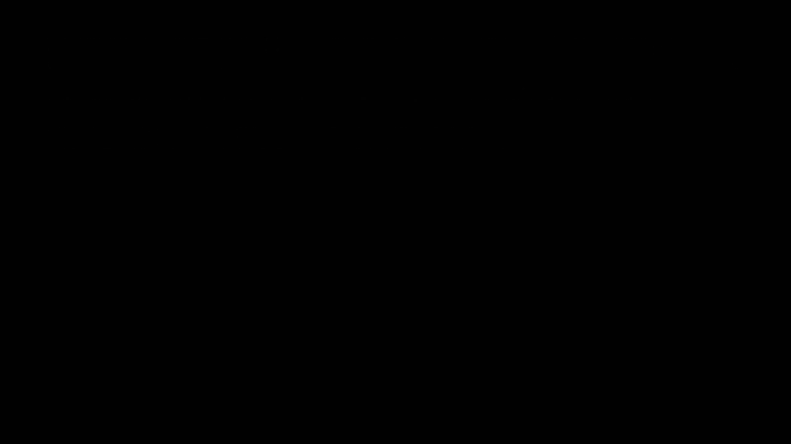

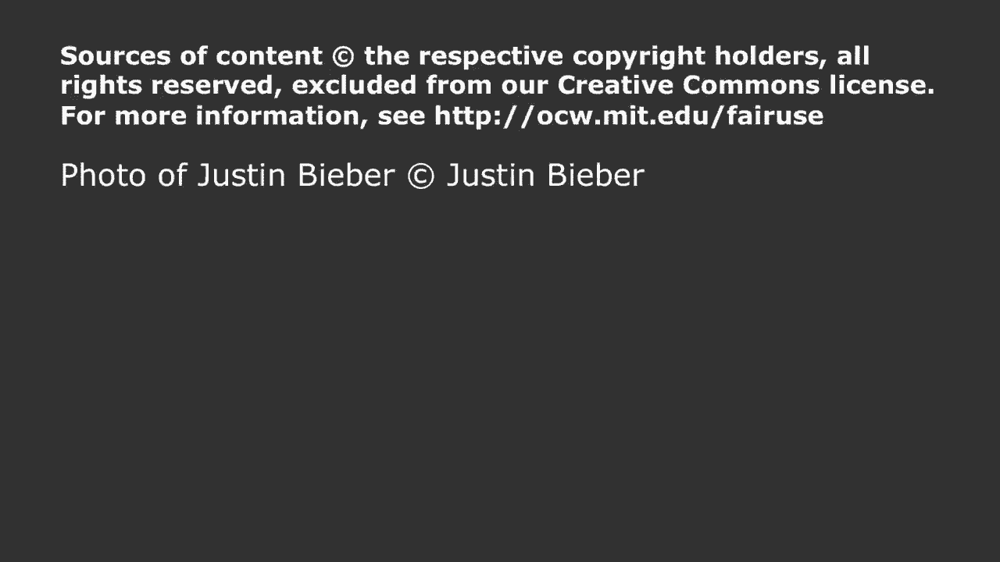