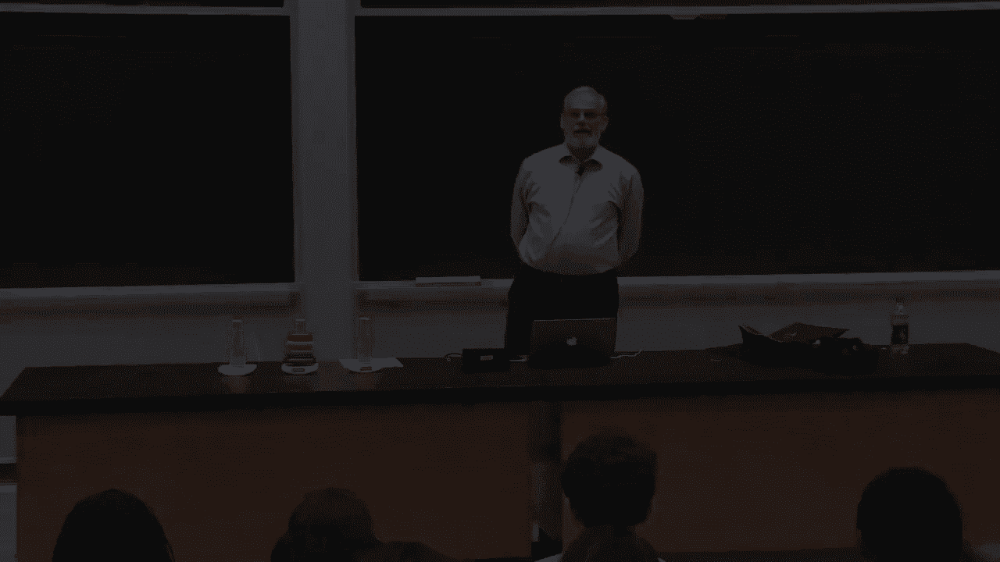
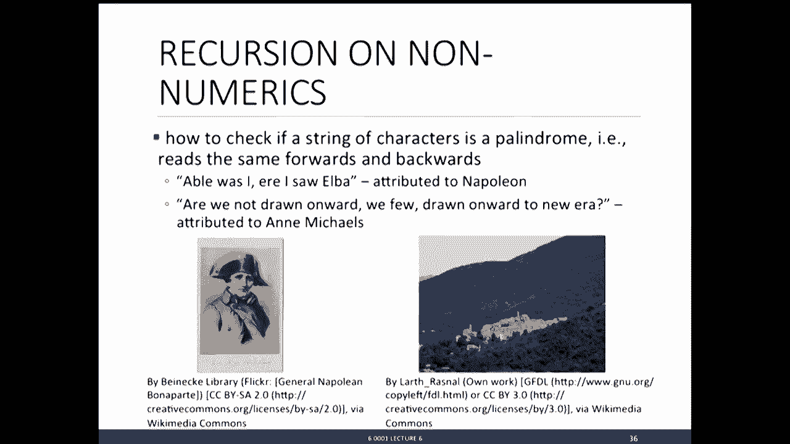
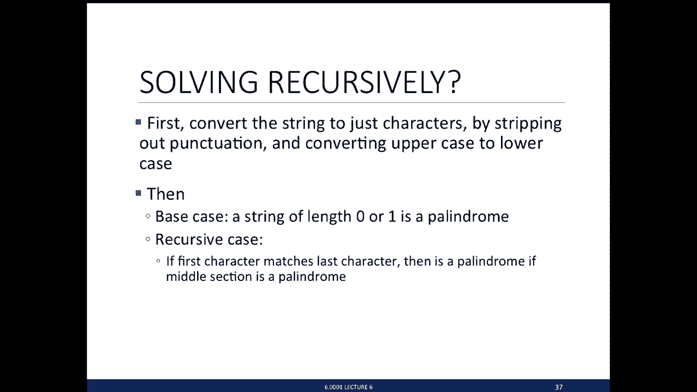
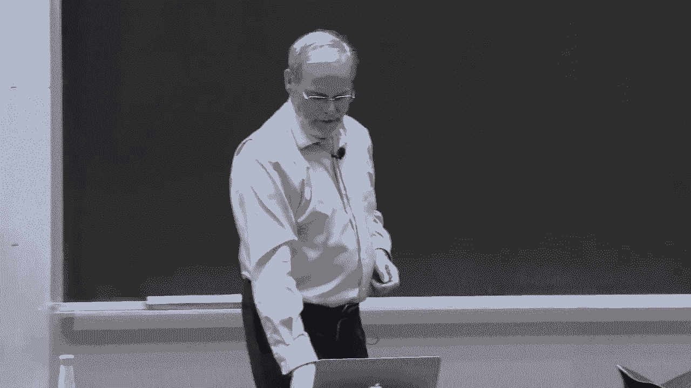
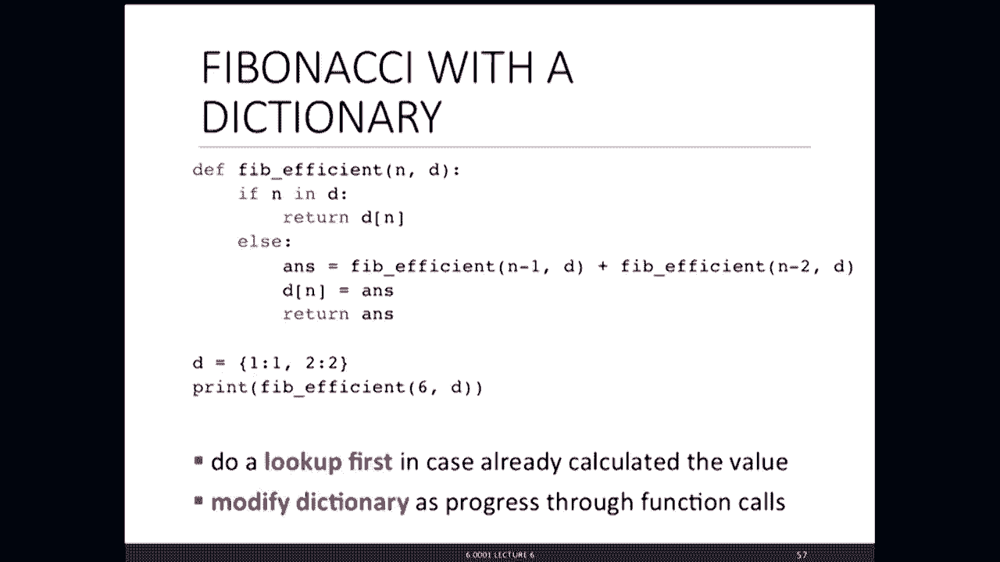
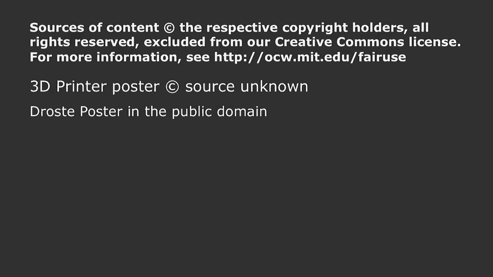

# P22：L6- 递归与字典 - ShowMeAI - BV1Dw411f7KK

the following content is provided under，a Creative Commons license your support。

will help MIT OpenCourseWare continue to，offer high quality educational resources，for free。

to make a donation or view additional，materials from hundreds of MIT courses。

ladies and gentlemen I'd like to get，started my name is Eric Grimson I have。

the privilege of serving as mi t--'s，chancellor for academic advancement you。

can go look up what that means and like，John I'm a former head of course six and。

today are it's hard this term with Anna，and John I'm going to be splitting the。

lecture so I'm up today okay last time，and introduced the first of the compound。

datatypes tuples and lists she sold Lots，showed lots of ways of manipulating them。

lots of built-in things for manipulating，those structures in the key difference。

between the two of them was that tuples，were immutable meaning you could not。

change them lists were mutable they，could be changed or mutated and that led。

to both some nice power and some，opportunities for challenges and in。

particular she showed you things like，aliasing where you could have two names。

pointing to the same list structure and，because of that you could change the。

contents of one it would change the，appearance of the contents of the other。

and that leads to some nice challenges，so the side-effects immutability or one。

of the things you're going to see both，as a plus and a minus as we go through。

the course today we're going to take a，different direction for a little while。

we're going to talk about recursion，there's a powerful and wonderful tool。

for solving computational problems we're，then going to look at another type of。

compound data structure a dictionary，which is also mutable and then we're。

going to put the two pieces together and，show how together they actually give you。

a lot of power for solving some really，neat problems very effectively but I。

want to start with recursion perhaps one，of the most mysterious at least。

according to programmers concepts in，computer science one that leads to lots。

of really bad computer science jokes，actually all computer science jokes are。

bad but these are particularly bad so，let's start with the obvious question。

what is recursion if you go to the，ultimate source of knowledge Wikipedia。

you get something that says in essence，recursion is the process of repeating。

items in a self-similar way well that's，really helpful right。

but we're going to see that idea because，recursion is we're going to see in a。

second is the idea of taking a problem，and reducing it to a smaller version of。

the same problem and using that idea to，actually tackle a bunch of really。

interesting problems but recursion gets，used a lot of places so it's this idea。

of using or repeating the idea of，multiple times so you know wouldn't it。

be great if your 3d printer printed 3d，printers and you could just keep doing。

that all the way along or one that's a，little more common it's actually got a。

wonderful name is called Me's on a beam，in art sometimes referred to as the。

droste effect pictures that have inside，them a picture of the picture which has。

inside them a picture of the picture and，you get the idea and of course one of。

the things you want to think about in，recursion is not to have it go on。

infinitely and yes there are even light，bulb jokes about recursion if you can't。

read it it says how many twists does it，take to screw in a light bulb。

and it says if it's already screwed in，the answer is zero otherwise twist at。

once ask me again add one to my answer，and that's actually a nice description。

of recursion so let's look at it more，seriously what is recursion I want to。

describe it both abstractly or，algorithmically and semantically or if。

you like in terms of programming，abstractly this is a great instance of。

something often called divide and，conquer or sometimes called decrease and。

conquer and the idea of recursion is I，want to take a problem I'm trying to。

solve and say how could I reduce it to a，simpler version of the same problem plus。

some things I know how to do and then，that simpler version I'm going to reduce。

it again and keep doing that until I get，down to a simple case that I can solve。

directly that is how we're going to，think about designing solutions to。

problems semantically this is typically，going to lead to the case where a。

program a definition a function will，refer to itself in its body it will call。

itself inside its body now if you，remember your high school geometry。

teacher she probably would rap your，knuckles which you're not allowed to do。

because then things like geometry you，can't define something in terms of。

itself right that's not allowed in，recursion，is okay our definition of a procedure。

can in its body call itself so long as I，have what I call a base case a way of。

stopping that unwinding of the problems，when I get to something I can solve。

directly and so what we're going to do，is avoid infinite recursion by ensuring。

that we have at least one or more base，cases that are easy to solve and then。

the basic idea is I just want to solve，the same problem on some simpler input。

with the idea of the using that solution，to solve the larger problem okay let's。

look at an example and to set the stage，I'm going to go back to something you've。

been doing iterative algorithms for，loops while loops they naturally lead to。

what we would call iterative algorithms，and these algorithms can be described as。

being captured by a set of state，variables meaning a sum one or more。

variables that tell us exactly the state，of the computation it's a lot of words。

let's look at an example，I know it's trivial but bear with me，suppose I want to do integer。

multiplication multiply two integers，together and all I have available to me。

is addition so a times B is the same as，adding a to itself B times if I'm。

thinking about this iteratively I could，capture this computation with two state。

variables one would just call the，iteration number and it would be。

something for example that starts at B，and each time through the loop reduces。

by one and it will keep doing that until，I've counted down B times and I get down。

to zero and at the same time I would，have some value the computation I might。

call it result which starts at zero，first time through adds in a next time。

through ads and a and it just keeps，track of how many things have I added up。

until I get done and yeah I know you，could just do mult，but this is trying to get this idea of。

how would I do this iteratively so I，might start off with I saying there be。

things still to add and results as one，the first time through the loop I add in。

a reduce I by one next time through the，loop I add in another a reduced I by one。

and you get the idea I just walk down it，until eventually I got to the end of。

this computation so we could write code，for this and actually it should be，pretty straightforward。

there it is I'm going to call it multi，two takes in two arguments a and B and。

I'm going to capture exactly that，process so notice what I do I set up。

result internally is just a little，variable I'm going to use to accumulate。

things and then there's the iteration as，do，add a two result stored away reduce B by。

one and I'll keep doing that until B，gets down to being equal to 0 in which。

case I just return the result okay，simple solution now let's think about。

this a different way gain a times B is，just adding a to itself B times and。

that's the same as a plus adding a to，itself B minus 1 times ok that sounds。

like leisure domain that sounds like，just playing with words but it's really。

important because what is this ah that's，just a times B minus 1 by the definition。

at the top point and I know you're，totally impressed but this is actually。

really cool because what have I done，I've taken one problem this one up here。

and I've reduced it to a simpler version，of the same problem plus some things I。

know how to do and how would I solve，this same trick that's a times a times B。

minus 2 I would just unwrap it one more，time and I would just keep doing that。

until I get down to something I can，solve directly a base case and that's。

easy when B is equal to 1 the answer is，just 8 or I could do one B is equal to 0。

the answer is just 0 and there's code to，capture that different form wonderful。

compact description what does it say it，says if I'm at the base case if B is。

equal to 1 the answer is just a，otherwise I'm going to solve the same。

problem with a smaller version and add，it to a and return that result and。

that's nice crisp characterization of a，problem recursive definition that。

reduces a problem to a simpler version，of the same problem，okay let's look at another example。

classic problem in recursions to compute，factorial write n factorial or n bang if。

you like and exclamation point is n，times n minus 1 all the way down to 1 so。

it's the product of all the integers，from 1 up to n assuming n is a positive。

integer so we can ask the same question，if I wanted to solve this recursively。

what would the base case be well when n，is equal to 1 it's just 1 in the。

recursive case we'll end times n minus 1，all the way down to 1 that's the same as。

n times n minus 1 factorial so I can，easily write out the base case and I've。

got a nice recursive solution to this，problem okay if you're like me and this。

is the first time you see it it feels，like I've taken your head and twisted it。

about 180 degrees I'm going to take it，another 180 degrees because you might be。

saying well wait a minute how do you，know what really stops how do you know。

it really terminates the computation so，let's look at it there's my definition。

for fact short for factorial right fact，event is if n is equal to 1 return 1。

otherwise return n times fact of n minus，1 and let's use the tools that Anna。

talked about in terms of an environment，at a scope and think about what happens。

here so when I read that in or I，evaluate that in Python it creates a。

definition that binds the name fact to，some code just all of that stuff over。

here plus the name for the formal，parameter hasn't done anything with it。

yet and then I'm going to evaluate print，a fact of for print needs a value so it。

has to get the value of factor 4 and we，know what that does it looks up fact。

there it is its procedure definition so，it creates a new frame a new environment。

it calls that procedure and inside that，frame the formal parameter for fact is。

bound to the value passed in so n is，bound to 4 that frame is scoped by this。

global frame meaning this meaning it's，going to inherit things in the global。

frame and what does it do it says inside，of this frame evaluate the。

body effect okay so it says is n equal，to 1 nope it's not it's 4。

so in that case go to the else statement，and says Oh return n times factor then。

and n is 4 fact of n minus 1 says I need，to return four times factor 3 4 is easy。

multiplication is easy factor 3 is I，look up fact now I'm in this frame I。

don't see fact there but I go up to that，frame there's the definition for fact。

we're going to do the rest of this a，little more quickly what does that do it。

creates a new frame called by fact and，the argument passed in for n is n minus。

1 that value right there of 3 so 3 is，now bound to N，same game evaluate the body is n equal，to 1。

no so in that case I'm going to go to，the return statement it says returned。

three times fact of 2 and notice it's，only looking at this value of n because。

that's the frame in which I mean it，never sees that value of n ok aren't you。

glad I didn't do factor 400 we're only，got two more to go but you get the idea。

same thing I need to get fact of 2 it's，going to call fact again with n bound to。

2 relative that evaluates the body and，is not yet equal to 1 that says I can go。

to the else clause and return 2 times，fact of one I call fact again now with n。

bound to 1 and fortunately now that，Clause is true and it says return 1 oops。

sorry before I do so there's the base，case and it may seem apparent to you but。

this is important right I'm unwinding，this until I get to something that can。

stop the computation now I'm simply，going to gather the computation up。

because it says return one who asked for，it well that called a fact of 1 so that。

reduces to return 2 times 1 and who，called for that fact of 2 that reduces。

to return of 3 times 2 which reduces to，4 times 6 which reduces to printing out。

24 so it unwinds it down to a base case，and it stops a couple of observations。

notice how each recursive call creates，there's，no confusion about which value of n I'm。

using also notice in the other frames，and was not changed we did not mutate it。

so we're literally creating a local，scope for that recursive call which is。

exactly what we want also notice how，there was a sense of flow of control in。

computing fact of something that reduces，to returning n times fact of n minus 1。

and that creates a new scope and that，will simply keep unwinding until I get。

to something that can return a value and，then I gather all those frames back up。

so there's a natural flow of control，here but most importantly there's no。

confusion about which variable I'm using，when I'm looking for a value event all。

right because this is often a place，where things get a little confusing I。

want to do one more example but let me，first show you side-by-side the two。

different versions of factorial actually，I lied slightly we didn't show this on。

earlier but there's factorial if I，wanted to do it iteratively I'd set up。

some initial variable to one and then I，just run through a loop for example from。

1 up to just below n minus 1 or 1 up to，n multiplying at it and putting it back。

into product returned product which one，do you like more you can't say neither。

you have to pick one show of hands how，many of you liked this one some hesitant。

ones how many prefer this one yeah，that's my view I'm biased but I really。

like the recursive one it is crisper to，look at you can see what it's doing I'm。

reducing this problem to simpler version，of that problem pick your own version。

but I would argue that the recursive，version is more intuitive to understand。

from a programmers perspective it's，actually often more efficient to write。

because I don't have to think about，interior interior variables depending on。

the machine it may not be as efficient，when you call it because in the。

recursive version I've got to set up，that set of frames and some versions of。

these languages are actually very，efficient about it some of them a little。

less so but given the speed of computers，today who cares as long as it actually。

just does the computation all right one，more example how do we really know our。

recursive code works well we just did a，simulation but let's look at it one more，way the。

version what can I say about it well I，know it's going to terminate because B。

is initially positive assuming I gave it，an appropriate value it decreases by 1。

every time around this loop at some，point it has to get less than 1 it's。

going to stop so I can conclude it's，always going to terminate what about the。

recursive version well if I call it with，B equal to 1 I'm done if I call it with。

B greater than 1 again it's going to，reduce it by one on the recursive call。

which means on each recursive call is，going to reduce it eventually gets down。

to a place assuming I gave it a positive，integer where B is equal to 1 so it'll。

stop which is good well we just did was，we used a great tool from math second。

best department at MIT wow I didn't even，get any hisses on that one John all。

right and I'm now in trouble with the，head of the math department so now that。

I got your attention and yes all，computer science strokes are bad and。

mine are really bad but I'm tenured you，cannot do a damn thing about it。

let's look at mathematical induction，which turns out to be a tool that lets。

us think about programs in a really nice，way you haven't seen this here's the。

idea of mathematical induction if I want，to prove a statement we refer to as。

being indexed on the integers in other，words it's some mathematical statement。

that runs over integers if I want to，prove it's true for all values of those。

integers mathematically I do it by，simply proving it's true for the。

smallest value of n typically n is equal，to 0 or 1 and then I do an interesting。

thing I say I need to prove that if it's，true for an arbitrary value of n I'm。

just going to prove that it's also then，true for n plus 1 and if I can do those。

two things I can then conclude for an，infinite number of values of n it's。

always true I'm going to relate it back，to programming in a second but let me。

show you a simple example of this one，that you may have seen if I add the。

integers from 0 up to n or even from 1，up to n I claim that's the same as n。

times n plus 1 over 2 so 1 2 3 that's 6，right and that's one exactly right 3。

times 4 which is divided by 2 which，gives me out 6，how would I prove this well by induction。

and you do the simple cases van a is，equal to zero well then this side is。

just 0 and that's 0 times 1 which is 0，divided by true so 0 equals 0 it's true。

and now the inductive step I'm going to，assume it's true for some K I should I。

pick down but for some K and then what I，need to show is it's true for K plus 1。

well there's the left-hand side and I，want to show that this is equal to that。

and I'm going to do it by using exactly，this recursive idea because what do I。

know I know that this sum in here I'm，assuming is true and so that says that。

the left-hand side the first portion of，it is just K times K plus 1 over 2。

that's the definition of the thing I'm，assuming is true to that I'm going to。

add k plus 1 well you can do the algebra，right that's K plus 1 all times K over 2。

plus 1 which is K plus 2 over 2 oh cool，it's exactly that having done that I can。

now conclude this is true for all values，of n what does it have to do with。

programming that's exactly what we're，doing when we think about recursive code。

right we're saying show that it's true，for the base case and then what I'm。

essentially assuming is that if it works，for values smaller than B then does the。

code return the right answer for B and，the answers absolutely it does and I'm。

using induction to deduce that in fact，my code does the right thing why am i。

torturing you with this because this is，the way I want you to think about。

recursion when I'm going to break a，problem down into a smaller version of。

the same problem I can assume that the，smaller version gives you the answer all。

I have to do is make sure that what I，combined together gives me out the right。

result ok you may be wondering what I'm，doing with these wonderful high-tech。

toys down here I want to show you，another example of recursion so far。

we've seen simple things that just have，one base case and this is a mythical。

story called the towers of Hanoi and the，story as I heard it is there's a temple，somewhere in Hanoi。

with three tall spikes and 64 jewel，encrusted golden discs all of a。

different size they all started out on，one spike with the property that they。

were ordered from smallest down to，largest and there are priests in this。

temple who are moving the disks one at a，time one per second and their goal is to。

move the entire stack from one spike to，another spike in women and when they do。

nirvana is achieved and we all get a，really great life，we'll talk separately about how long is。

it's going to take because there's one，trick to it they can never cover a。

smaller disc with a larger disc as，they're doing it so they got a third。

disc as a temporary thing and I want to，show you how to solve this problem。

because you're going to write code with，my help in a second or I'm going to。

write code with your help in a second to，solve so let's look at it so watch。

carefully moving a disc of size 1 well，that's pretty easy right moving a disc。

of size 2 we'll just put this one on the，spare one while you move it over so you。

don't cover it up that's easy moving a，disc of size 3 got to be a little more。

careful you can't cover up a smaller one，with a larger one so you have to really。

think about where you're putting it，would help if these things didn't juggle，right。

you're watching got to do for to do for，again you've got to be really careful。

not to cover things up as you do this，you want to get the bottom one。

eventually exposed and so you're going，to pull that one over there if you do。

the powder really well you won't notice，if I make a serious mistake as I'm doing。

this which I just did but I'm going to，cover from that and do it that way to。

put this one over here and that one goes，there and if I did this in Harvard。

Square I could make money there you go，right ok got the solution see how to。

solve it could you write code for this，yeah maybe not that's on quiz right。

thanks John don't tell him us on the，quiz damn alright I'm going to claim。

though that in fact there's a beautiful，recursive solution and here's the way to。

think about it recursively I want to，move a tower of size n I'm going to。

assume I can move smaller towers and，then it's real easy what I do I take a。

stack of size n minus 1 I move it onto，the spare one I move the bottom one over。

and then I move a stack of size n minus，1，there it's beautiful recursive solution。

and how do I move this smaller stack，just the same way I just unwind it。

simple and in fact the code follows，exactly that okay I do a little larger。

domain up here to try and get your，attention but notice by doing that what。

I do I asked you to think about a，recursively the recursive solution when，you see it is in fact very。

straightforward and there's the code，dead trivial well dead trivial is unfair。

but it's very simple right I simply，write something so let me describe it I。

need to say how big a tower am i moving，and i'm going to label the three stacks。

a from a two and a spare I have a little，procedure that just prints out the move。

for me and then what's the solution if，it's just a stack of size one just print。

the move take it to from from from to，two otherwise move a tower of size n。

minus one from the from spot to the，spare spot then move what's left at our。

size one from from two two and then take，that thing I stuck on spare and move it。

over to two and I'm done in that code，that we had that out you'll see this。

code you can run it I'm not going to，print it out because if I did use it's。

going to say okay it looks like it does，the right kind of thing look at the code。

nice and easy and that's what we'd like，you to do when you're given a problem we。

asked you to think about it recursively，how do I solve this with a smaller。

version of the same problem and then how，do I use that to build the larger。

solution this case is a little different，you could argue that this is not really。

a recursive call here it's just moving，the bottom when I could have done that。

directly but I've got two recursive，calls in the body here I have to move a。

smaller stack twice we're going to come，back to that in a little bit let me show。

you one other example of recursion that，runs a little bit differently in this。

case it's going to have multiple base，cases and this is another very old。

problems called the Fibonacci numbers，it's based on something from several。

centuries ago when a gentleman named，Leonardo of Pisa also known as Fibonacci。

asked the following challenge so I'm，going to put a newborn，of rabbits one male and one female into。

an enclosure a pan of some sort and，those rabbits have the following。

properties they mate at age one month so，they take a month to mature after a。

one-month gestation period they produce，another pair of rabbits a male and a。

female and he says I'm going to assume，that the rabbits never die so each month。

mature females are going to produce，another pair and his question was how。

many female rabbits are there at the end，ideas I start off with too immature。

rabbits after one month they've matured，which means after another month they。

will have both they were sorry they will，have produced a new pair after another。

month that mature pair is produced，another pair and the immature pair has。

matured which means after another month，those two mature pairs are going to。

produce offspring and that immature，Paris has matured and you get the idea。

and after several months you get to，Australia you can also see this is going。

to be interesting to think about how do，you compute this but what I want you to。

see is the recursive solution to it so，how could we capture this well here's。

another way of thinking about it after，the first month and I know we're going。

to do this funny thing we're going to，index at zero so I'll call at month zero。

there is one female which is immature to，the second month that female is mature。

and now pregnant which means after the，third month it is produced an offspring。

and more generally at the end month，after we get past the first few cases。

what do we have any female that was，there two months ago has produced an。

offspring because it's taken at least，one month to mature if it hasn't already。

been mature and then it's going to，produce an offspring and any female that。

was around last month is still around，because it never died off so this is a。

little different this is now the number，of females at month n is the number of。

females at month n minus one plus the，number of females at month n minus two。

so two recursive calls but with，different arguments，different from towers of Hanoi where。

there were two recursive calls but with，the same size problem okay。

so now I need two base cases one for，when n is equal to zero one frame when n。

is equal to one and then I've got that，recursive case and so there's a nice。

little piece of code Fibonacci I'm going，to assume X is an integer greater than。

or equal to zero I'm going to return，Fibonacci of X and you can see now it。

says if either X is equal to zero or X，is equal to one I'm going to return 1。

otherwise I reduce it to two simpler，versions of the problem but with。

different arguments and I add them up，okay and if we go look at this we can。

actually run this I can find my code，and I'm just going to so we can for。

example check it by saying fib of 0 that，is it a I just hit a bug which I don't。

darn it's really naughty try it I got，two different versions of fib in here。

that's what I've got going on so let me，go，fib of 2 just to fib of 3 which is 3 and。

fib of 4 which should add the previous，two which gives me 5 there we go sorry。

about that I had two versions of fib in，my file which is why you complained at。

me and which is why you should always，read the error instructions because it。

tells you what you did wrong let's go on。

and look at one more example of doing，recursion and we're going to。

dictionaries and we're going to pull it，all together so far we been doing。

recursion on numerical things we can do，it on non numerical things so a nice way。

of thinking about this is how would I。

tell if a string of characters is a，palindrome meaning it reads the same。

backwards and forwards probably the most。

famous palindrome is attributed to，Napoleon Abel was i ere I saw Elba given。

that a Pulliam was French I really doubt，he said Abel was i ere I saw Elba but。

it's a great palindrome another one，attributed Anne Michaels are we not。

drawn onward we fruit viva we few drawn，onward to a new era reads the same。

backwards and forwards it's fun to think，about how do you create the palindromes。

I want to write code to solve this again，I want to think about it recursively so。

here's what I'm going to do I'm first，going to take a string of characters。

reduce them all to lowercase and strip，out spaces and punctuation I just want。

the characters okay and once I got that，I want to say is that string that list。

of characters or that collection of，characters I should say a palindrome and。

I'm going to think about it recursively，and that's actually pretty easy if it's。

either 0 or 1 long it's a palindrome，otherwise you could think about having。

an index at each end of this thing and，sort of counting into the middle but。

it's much easier to say take the 2 at，the end if they're the same then check。

to see what's left in the middle is a。

palindrome and if those two properties，true I'm done and notice what I just did。

I nicely reduced a bigger problem to a，slightly smaller problem so exactly what。

I want to do okay so what says to check，is this I'm going to reduce it to just。

the string of characters and then I'm，going to check that's a palindrome by。

pulling those two off and checking to，see they're the same and then checking。

to see if the middle is itself a，palindrome okay how would I write it on。

the create procedure up here is，palindrome I'm going to have inside of。

it two internal procedures that do the，work for me the first one is simply。

going to reduce this to all lowercase，with no spaces and notice what I can do。

because s is a string of characters I，can use the built in string method lower。

so there's that dot notation s dot lower，says apply the method lower to a string。

I need an open and close paren to，actually call that procedure and that。

will mutate s to just be all lowercase，and then I'm going to run a little loop。

I'll set up answer or ants to be an，empty string and then for everything。

inside that mutated string I'll simply，say if it's inside this string if it's a。

letter add it in to answer if it's a，space or a comma or something else I'll。

ignore it and when I'm done just return，answer strips it down to lowercase and。

then I'm going to pass that into is pal，which simply says if this is either 0 or。

1 long it's a palindrome return true，otherwise check to see that the first。

and last element of the string are the，same notice the indexing to get into the。

last element and similarly just slice，into the string ignoring the first and。

last element and ask is that a，palindrome and then just call it and。

that'll do it and again there's a nice，example of that in the code I'm not。

going to run out of let you just go look，at it but it will actually pull out。

something that checks is this a，palindrome notice again what I'm doing。

here i'm doing dividing conquer i'm，taking a problem reducing it keep saying，problem，some。

can solve directly in my base case and，I'm done and that's really the heart of。

thinking about recursive solutions to，problems I would hope that one of the。

things you remember besides my really，lousy patter up here is the idea of。

towers of Hanoi because to me it's one，of the nicest examples of a problem that。

would be hard to solve iteratively but，when you see the recursive solution it's。

pretty straightforward keep that in mind，as you think about doing recursion okay。

let's switch gears and let's talk very，briefly about another kind of data type。

called a dictionary in the idea of a，dictionary I'm going to motivate with a。

simple example there's a quiz coming up，on Thursday I know you don't want to。

hear that but there is which means we're，going to be recording grades and so。

imagine I wanted to build a little，database just to keep track of grades of。

students so one of the ways I could do，it as I could create a list with the。

names of the students I could create，another list with their grades and a。

third list with the actual subject or，course from which they got that grade。

keep a separate list for each one of，them keep them of the same length and in。

essence what I'm doing here is I'm，storing information at the same index in。

each list so Anna who's going to have to，take the class again gets a B John who's。

created the class gets an A+ sorry Anna，John's had a longer time at it all right。

bad jokes aside what I'm doing is I，could imagine just creating lists I。

could create lists of lists but a simple，ways to do lists we're basically at each。

index I've got associated information，it's a simple way to deal with it。

getting a grade out takes a little bit，of work because if I want to get the。

grade associated with a particular，student what would I do I would go into。

the name list and use the method index，which you've seen before again notice。

the dot notation it says this is a list，use the index method call it on student。

and whatever the value of student is it，will find that in the list return the。

index at that point and then I can use，course，and return something out simple way to。

do it put a little ugly alright because，among other things I've got things store。

in different places in the list I got to，think about if I'm going to add。

something the list I got to put them in，the same spot in the list I've got to。

remember to always index using integers，is what which is what we know how to do。

with lists at least so far it would be，nice if I had a better way to do it and。

that's exactly what a dictionary is，going to provide for me，so rather than indexing on integers I'd。

like to index directly on the item of，interest I'd like to say where's Anna's。

record and find that in one data，structure and so whereas a list is。

indexed by integers and has elements，associated with it a dictionary is going。

to combine a key or if you like a name，of some sort with an actual value and。

we're going to index just by the name or，the label as we go into it so let me。

show you some examples first of all to，create a dictionary I use curly braces。

open close curly brace so an empty，dictionary would be simply that call if。

I want to create an actual dictionary，before I insert things into it I use a。

little bit of a funky notation it is a，key or a label a colon and then a value。

in this case the string Anna and the end，of and the string B followed by a comma。

which separates it from the next pairing，of a key and a label or key and a value。

and so on and so if I do this what it，does in my dictionary is it creates。

pairings of those labels with the values，I associated with them。

okay these are pretty simple but in fact，there's lots of nice things we can do。

with it so once we've got them indexing，now is similar to a list but not done by。

a number it's done by a value so if，that's my key I can say what's John's。

great notice the call it's grades which，is my dictionary open close square。

brackets with the label John and what it，does it goes in and finds that in the。

dictionary returns the value associated，with it if I ask for something not in。

the dictionary it's going to give me a，key R other things we can do with。

dictionaries we can add entries just，like we would do with lists，grades as a dictionary and open and。

close square brackets I put in a new，label and a value and that adds that to。

the dictionary I can test if something's，in the dictionary by simply saying is。

this label in grades and it simply，checks all of the labels or the keys for。

the dictionary to see if it's there and，if it's not returns false I can remove。

entries del something we've seen before，a very generic thing it will delete。

something and in this case it says in，the dictionary grades find the entry。

associated with that key sorry Ana，you're about to be flushed remove it。

she's only getting a B in the class and，she teaches it we got to do something。

about this right okay so I can add，things I can delete things I can test if。

things are there let me show you a，couple of other things about。

dictionaries I can ask for all of the，keys in the dictionary notice the format。

there's that dot notation grades as a，dictionary says use the keys method。

associated with this data structured，dictionaries open close actually calls。

it and it gives me back a collection of，all the keys in some arbitrary order I'm。

going to use a funny term here which I'm，not certain we've seen so far it returns。

something we call an iterable it's like，range think of it as giving us back the。

equivalent of a list it's not actually，list but it's something we could walk。

down which is exactly why I can then say，is something in a dictionary because it。

returns this set of keys and I can test，to see something's in there I can。

similarly get all of the values if I，wanted to look at them giving us out two。

intervals here are the key things to，keep in mind about dictionaries the。

values can be anything any type mutable，immutable they could be duplicates that。

actually makes sense I could have the，same value associated that for example。

the same grade associated with different，people that's perfectly fine the values。

could be lists they could be other data，structures they could even be other。

dictionaries they can be anything which，is great the keys the first part of it a。

little more structure，they need to be unique well duh that，makes sense if I have the same key in。

two places in the dictionary when I go，to look it up how am I going to know。

which one I want so it needs to be，unique and they also need to be。

immutable which also makes sense if I'm，storing something in a key in the。

dictionary and I can go and change the，value of the key how am I going to。

remember what I was looking for so they，can only be things like intz flows。

strings tuples boolean's I don't，recommend using floats because you need。

to make sure it's exactly the same float，and that sometimes a little bit。

challenging but nonetheless you can have，any immutable type as your key and。

notice that there's no order to the keys，or the values they are simply stored。

arbitrarily by the by Python as it puts，them in and so if I compare these two。

lists our ordered sequences index by，integers I look them up by integer index。

and the indices have to have an order as，a consequence dictionaries are this nice。

generalization arbitrarily match keys to，values I simply look up one item by。

looking up things under the appropriate，key all I requires that the keys have to。

be immutable okay I want to do two last，things seven minutes to go here I want。

to show you an example of using，dictionaries and I'm going to do this。

with a little bit more interesting I，hope example I'm going to analyze song。

lyrics now I'm going to show you you can，already tell the difference between my。

age and Anna's age she used Taylor Swift，and Justin Bieber I'm going to use the。

Beatles that's more my generation most，of you never heard of the Beatles unless。

you watch shining time station where you，saw Ringo Starr right okay what I'm。

going to do is I want to write us a，little set of procedures that record the。

frequencies of words in a song lyric so，I'm going to match strings or words to。

integers how many times did that that，word appear in the in the song lyric and。

then I'm going to ask can I easily，figure out which words occur most often。

and how many times I'm going to gather，them together to see what are the most。

common words in here and I'm going to do，that where I'm going to let a user say I。

want every word that appears more than，some number of times it's a simple。

example but I want you to see how，mutation of the dictionary gives you a，problem。

so let's write the code to do that it's，also in the handout，here we go lyrics to frequencies lyrics。

is just a list of words strings so I'm，going to set up an empty dictionary。

there's that open closed curly brace and，here's what I'm going to do I'm going to。

walk through all the words in lyrics，you've seen this before this is looping。

over for every word in lyrics notice，what I'm going to do I'm going to simply。

say so first part is I can easily，iterate over the list but now I'm going。

to say if the word is in the dictionary，and because the dictionary is iterable。

simply going to give me back all of the，keys it's simply going to say in this。

case if it's in the dictionary okay it's，already there I've got some value。

associated with it get the value out add，one to it put it back in okay if it's。

not already in the dictionary this is，the first time I've seen it just store。

it into the dictionary and when I'm done，just return the dictionary okay so I'm。

going to if I can do this right with my，Python show you an example of this and I。

have put in one of the great classic，Beatles songs you might recognize it。

right there mostly because it's got a，whole lot of repetitions of things so。

she loves you yeah yeah yeah yeah sorry，actually they sing it better than I just。

did it sarcastically sorry about that，but I thought she loves you there and。

here's my code up here lyrics to，frequency so let's see what happens if。

we call it and we say lyrics to，frequencies if she loves you and it。

would help if I can type alright we'll，try it one more time lyrics to，frequencies she loves you。

cool this gave me back a dictionary you，can see the curly braces and there are。

all the words that appear in there in，the number of times that they appear。

what's the order you don't care you，don't know what we want to do is to。

think about how can we analyze it so，let's go back and look at the last piece。

of this which is okay I can compute or，convert lyrics to frequencies。

so here's the next thing I want to do，how do I find the most common words well。

here's what I'm going to do frequencies，is the dictionary something that I just。

pulled out okay so I can use the values，method on it which returns an iterable。

as I said earlier again notice the，open/close because I got to call it that。

gives me back an interval that is all of，the frequencies inside of there because。

it's an iterable I can use max on it and，it will take that interval and give me。

back the biggest value I'm going to call，that best I'm going to set up words to。

be an empty list and then I'm just going，to walk through all of the entries in。

the dictionary saying if the value at，that entry is equal to best add that。

entry into words just append it onto the，end of the list and when I'm done all of。

that loop I'm just going to return a，tuple of both the collections of words。

that appeared that many times and how，often they appeared I'm going to show。

you an example a second but notice I'm，simply using the properties of the。

dictionary the last thing I want to do，then is say I want to see how often the。

words appear so I'm going to give it a，dictionary and a minimum number of times。

and here I'm going to set result up to，be an empty list I'm going to create a。

flag called false it's going to keep，track of when I'm done and as long as。

I'm not yet done I'll call that previous，procedure that's going to give me back。

the most common words and how often they，appeared I check remember it was a tuple。

how often do they appear if it's bigger，than the thing I'm looking for I'll add。

that into my result and then the best，part is I'm now going to walk through。

all the words that appeared that many，times and just delete them from the。

dictionary I can mutate the dictionary，and by doing that I can go back around。

and do this again and it will pull out，how many times has disappeared and keep。

doing it when I go all the way through，that if I can't find anymore I'll set。

the flag to true which means it will，drop out of here and return the result。

and if you I'm going to let you run this，yourself if you do that you'll find that。

it comes up with not surprisingly I，think yeah is the most common one and。

she loves you followed by loves and a，few others what I want you to see here。

is how the dictionary captured the，pieces we wanted to very last one。

there's Fibonacci as we called it before，it's actually incredibly inefficient。

because if I call it I have to do all，the sub calls until I get down to the。

base case which is okay but notice every，other thing I do here I've actually。

computed those values I'm wasting，measures or wasting time now it's not so。

bad with fib of 5 this is fib of 20，almost everything on the right-hand side。

of this tree I've already computed once，it means fibs very inefficient I can。

improve it by using a dictionary very，handy tool I'm going to call fib not。

only with a value of n but a dictionary，which initially I'm going to initialize。

to the base cases and notice what I do，I'm going to say if I've already。

computed this just return the value in，the dictionary if I haven't go ahead and。

do the computation store it in the。

dictionary at that point and return the，answer different way of thinking about。

it and the reason this is really nice，it's a method called memoization is if I。

call fib of 30 for the standard way it，takes 11 million-plus recursive calls to。

get the answer out takes a long time of，giving some code for you can try it and。

see how long it takes using the，dictionary to keep track of intermediate。

values 65 calls and if you try it you'll，see the difference in speed as you run。

this so dictionaries are valuable not，only for just storing away data they're。

valuable on procedure calls when those，intermediate values are not going to。

change and what you're going to see as，we go along is we're going to use。

exactly these ideas using dictionaries，to capture information but especially。

using recursion to break bigger problems，down into smaller versions of the same。

problem to use that as a tool for，solving what turned out to be really。

complex things and what that we'll see。

