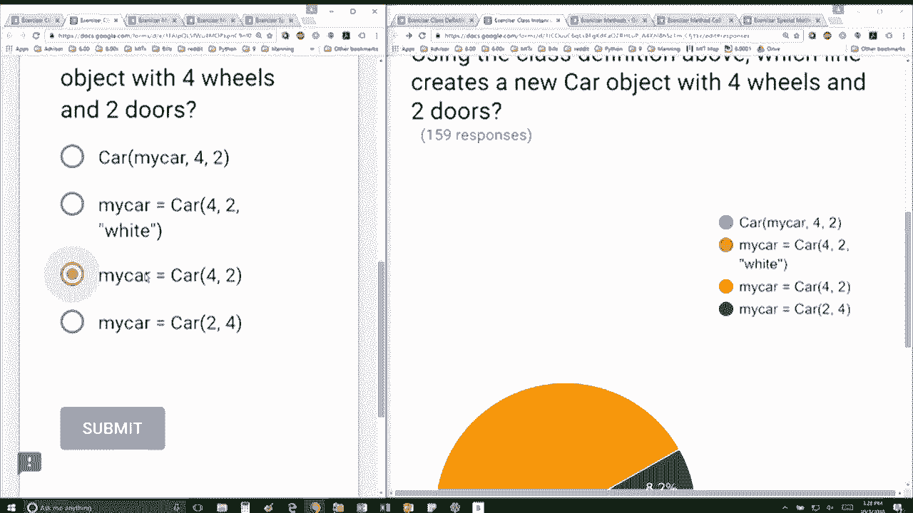
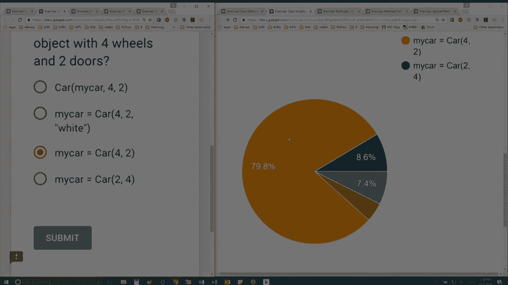

# P29：L8.3- 类的实例 - ShowMeAI - BV1Dw411f7KK

the following content is provided under，a Creative Commons license your support。

will help MIT OpenCourseWare continue to，offer high quality educational resources，for free。

to make a donation or view additional，materials from hundreds of MIT courses。

we have this definition for the class，object I've I've created the in it for。

you and here I'm giving itself which is，the first thing that you have to give it。

and then two parameters W and D and for，for an instance of a car I'm going to。

assign the data attribute named wheels，to whatever is passed in for W so notice。

that they're not the same name and the，data attribute for doors is going to be。

the value that's passed in for D okay，and also notice that inside the anit I。

can do any other sort of initializations，that I'd like so it's not just assigning。

variables from the parameters to local，to two variables for for my objects so。

in this case I'm creating a new data，attribute named color and I'm going to。

just create it to be an empty string，okay notice because I didn't even even。

though I didn't pass in any color to my，to my object so the question says using。

the class definition above which line，creates a new car object with four。

wheels and two doors okay so this this，first one is not right because it's。

trying to call the class with a variable，my car so for self which isn't quite。

right so when you're creating a when，you're creating your object you have to。

give it one less parameter than what you，have so here we're just going to have to。

create it with the W and the D so we're，going to create this these variable this。

variable my car and we're going to，assign it for for the number of wheels。

and two for the number of doors and the，number of wheels is the first parameter。

and the number of doors is the second。

