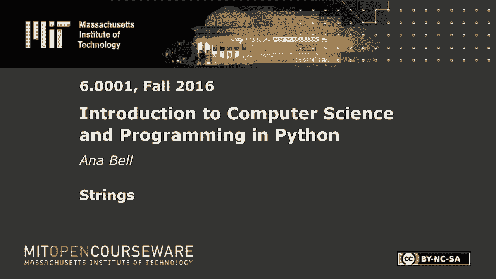
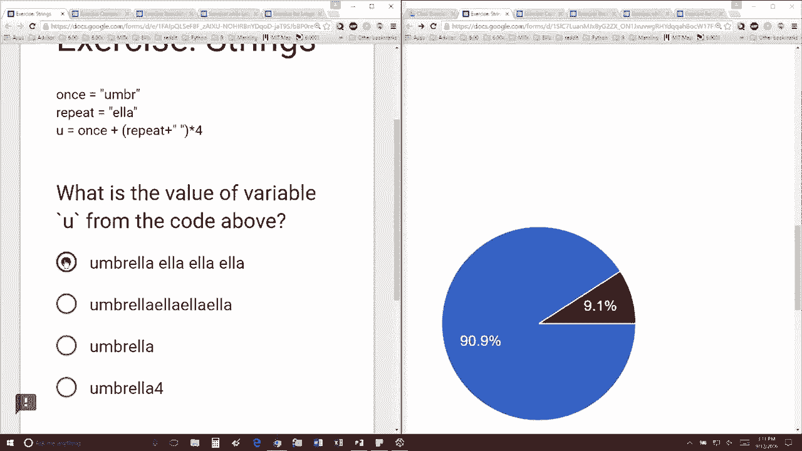

# P6：L2.2- 字符串 - ShowMeAI - BV1Dw411f7KK

the following content is provided under，a Creative Commons license your support。

will help MIT OpenCourseWare continue to，offer high quality educational resources，for free。

to make a donation or view additional，materials from hundreds of MIT courses。

so I have this variable name once which，is um um Br，looks like people are getting it we have。

a variable called repeat which is e ll a，and I'm creating a variable U which is。

the concatenation of that with the，repeat multiplied by four so I think。

people are on the right track seeing by，the 90% here it's going to give me this。

