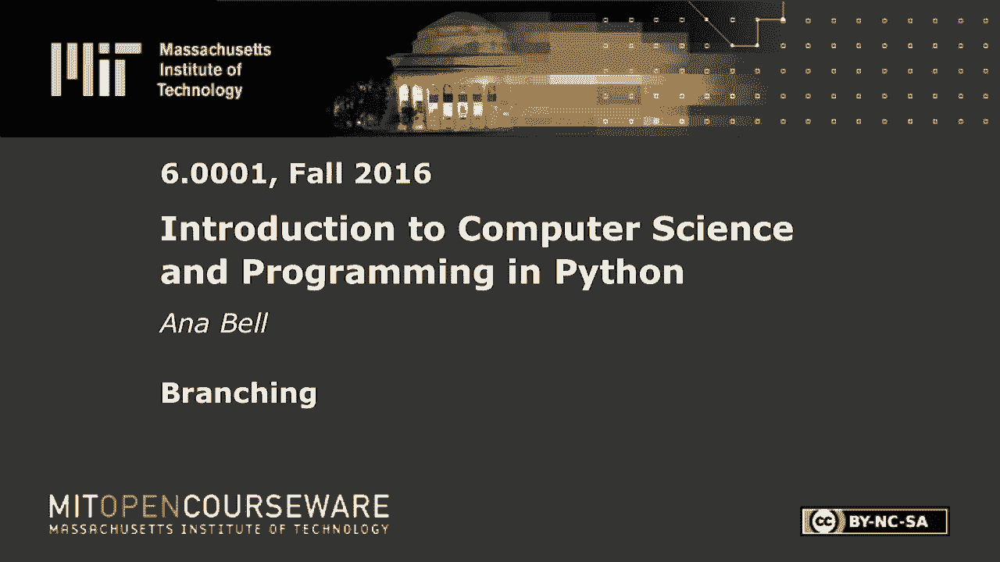

# P8：L2.4- 分支 - ShowMeAI - BV1Dw411f7KK

the following content is provided under，a Creative Commons license your support。

will help MIT OpenCourseWare continue to，offer high quality educational resources，for free。

to make a donation or view additional，materials from hundreds of MIT courses。

so we have X is going to be whatever，number the user types in Y is going to。

first thing I'm going to check is if X，is equal to Y so if we type in X is zero。

and Y is 5 0 is not equal to 5 so we're，not even going to consider what's in。

this code block then we're going to，check the next one if if 0 is less than。

5 and that's true so this is the very，first conditional that evaluates to true。

so we're just going to print X is。

