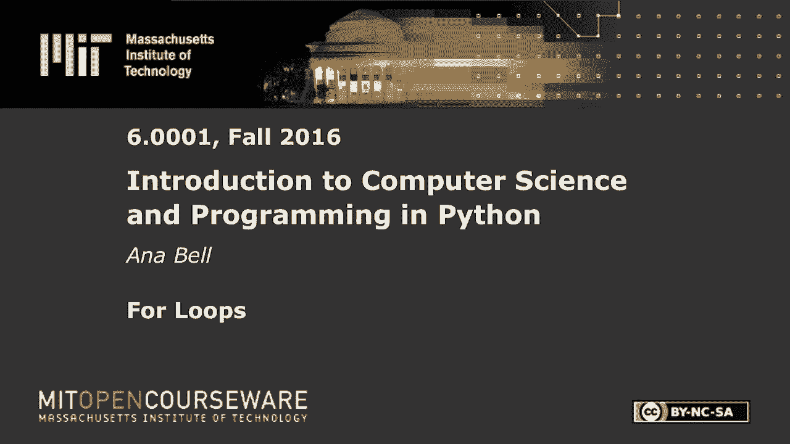
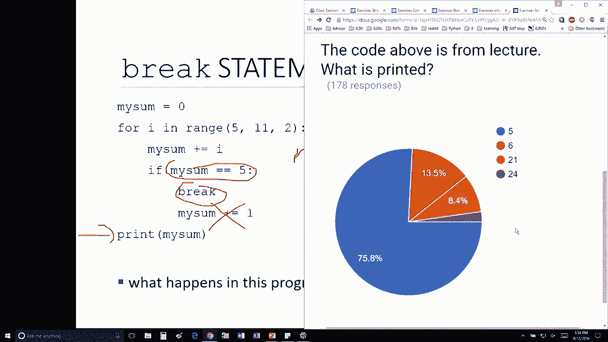

# 【双语字幕+资料下载】MIT 6.0001 ｜ 计算机科学与Python编程导论(2016·完整版) - P10：L2.6- for循环 - ShowMeAI - BV1Dw411f7KK

the following content is provided under，a Creative Commons license your support。

will help MIT OpenCourseWare continue to，offer high quality educational resources，for free。

to make a donation or view additional，materials from hundreds of MIT courses。

so now we have this this last exercise，I'm creating a my sum I'm going to go。

through all of these values and you guys，have already told me what values these。

are five seven nine not eleven and I'm，going to add to my sum so I'm going to。

keep a running sum adding all of these，values together okay so the very first。

time through the loop my sum gets the，value of five okay that's this line here。

the next thing I'm see inside this loop，is an if statement if my sum is equal to。

five that's true so I'm going to go，inside this if statement the next thing。

I see is a break if I see this break and，my evaluating am i evaluating this line，or not。

no exactly because whenever Python sees，break it's going to say I'm going to。

stop right here exit out of the loop，that I'm currently in and go to the。

statement that's immediately right after，it so what this is going to print is my。

son and that's the exercise we were，looking at let's see how the class did。

pretty good hopefully if you answered，one of these the explanation was was all。

