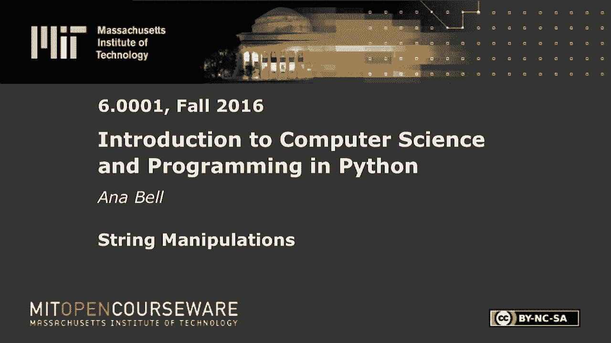
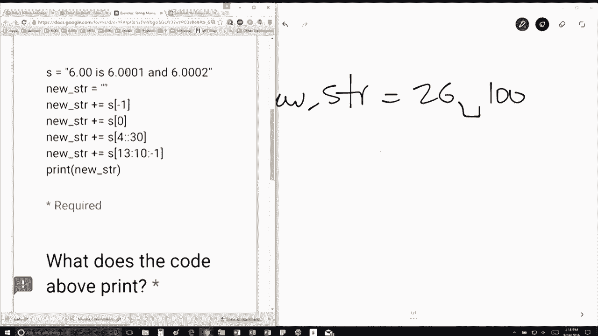

# P12：L3.2- 字符串操作 - ShowMeAI - BV1Dw411f7KK

the following content is provided under，a Creative Commons license your support。

will help MIT OpenCourseWare continue to，offer high quality educational resources，for free。

to make a donation or view additional，materials from hundreds of MIT courses。

so the question is we have the string s，is the string 600 is six triple one and。

six triple two so we're going to create，this string here right it's initially an。

empty string I want to mention that the，plus equals for example if I say a plus。

equals one this is equivalent to a is，equal to a plus one okay we've seen this。

a couple times before last lecture in，the lecture before that so all this。

means here this line here is we're going，to take the previous string that we have。

and we're just going to add it to itself，plus the last letter so the first thing。

we're going to have is going to be new，underscore STR is equal to two then this。

line here is going to say now I'm going，to add to the two the two that I already。

have the element at position zero which，is a six so I'm going to have six then。

I'm going to add to that the element at，position at index 4 so I'm starting to。

count from zero so this is zero one two，three four right so that's a space and。

I'm going to go notice I have four and，then nothing in the middle。

so my stop is going to be length s by，default and I'm going to take every 30。

characters now every 30 is longer than，the actual string I have right so we're。

just going to end at the end of the，string so this is the next thing that。

we're going to add is a space okay and，then the last thing we're doing here is。

we're starting at 13 so now I'm going to，have to count 13 0 1 2 3 4 5 6 8 9 10 11。

12 13 that's the one I'm going to go，backward because of this minus one。

and I'm going to go backward until 10，but right before 10 okay so one less。

than 10 so I'm going to do 100 so this，one the zero and then this year okay and。

think this is right if you paste it into，spider it should give you 26 space 100。

