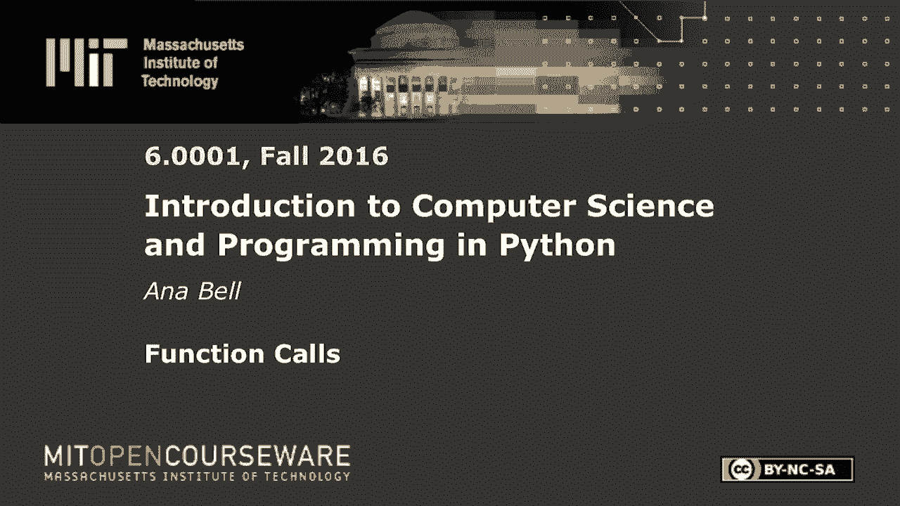
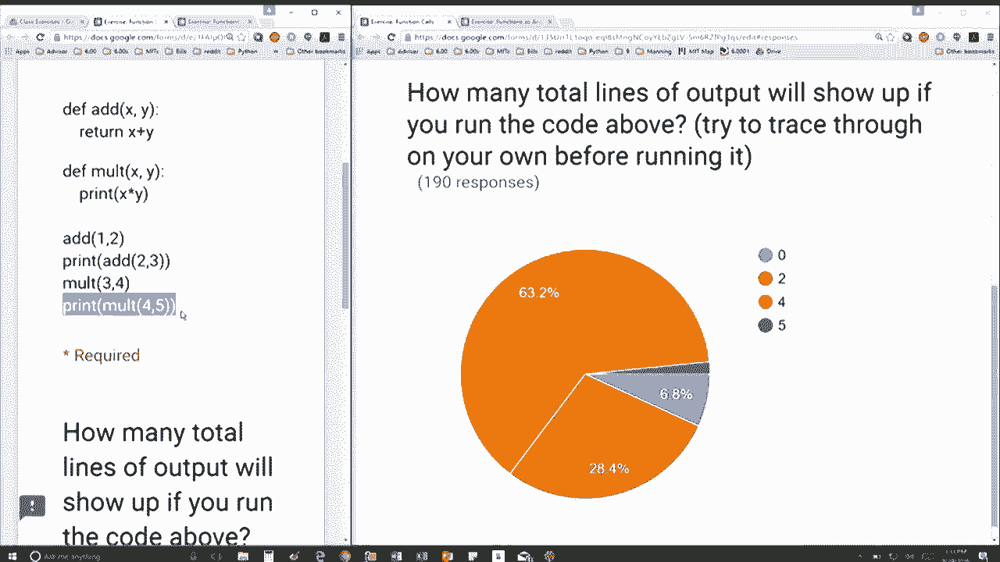

# P15：L4.2- 函数调用 - ShowMeAI - BV1Dw411f7KK

the following content is provided under，a Creative Commons license your support。

will help MIT OpenCourseWare continue to，offer high quality educational resources，for free。

to make a donation or view additional，materials from hundreds of MIT courses。

I have two functions here one is ad and，one is multiply the add function returns。

the sum of X plus y and the multiply，function just prints the value of x。

times y what doesn't return the value，instead it's going to implicitly return。

none right because we don't have any，return statement inside mult。

so there are four lines here and the，question was how many total lines of。

output will show up if you run the code，okay so how many lines in the console。

show up so when I do first add one two，it's going to go inside this function。

here and it's a it says X is 1 Y is 2，and return 3 so I'm replacing this line。

with 3 but notice I'm never printing it，out so this line of code will not print。

out anything instead if I do so I did so，the next line is if I print add 2 plus 3。

then I'm going to get 5 and I'm going to，print that out so that's one one thing。

I'm printing out next line says multiply，3 & 4 so I'm going to go inside my multi。

function and say X is 3 y is 4 so I'm，going to print 12 3 times 4 is 12 so。

that's another thing that gets printed，out and I'm not doing anything with the。

output or the sorry I'm not doing，anything with a return from mult。

so that line is is done and the last one，mult，5 so first I'm going to go in here X is。

4 y is 5 and I'm printing 20 so that's，another print and the return of this。

function is going to be none right and。

the main thing here is I'm going to，print the return of this function so I'm。

also going to print out none so that's，another one so in total I'm going to。

have four different things printed out。