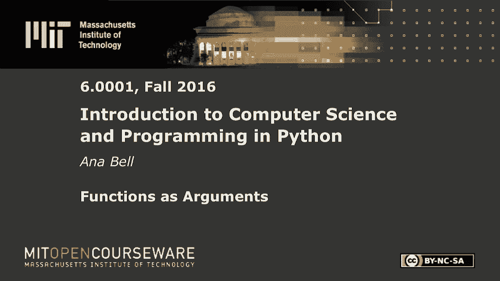
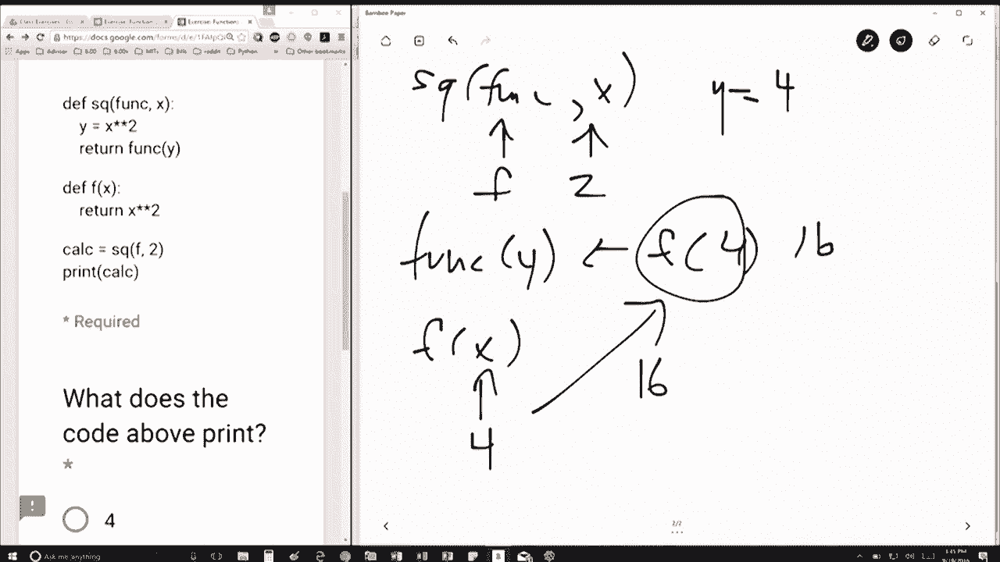

# 【双语字幕+资料下载】MIT 6.0001 ｜ 计算机科学与Python编程导论(2016·完整版) - P16：L4.3- 函数参数 - ShowMeAI - BV1Dw411f7KK

the following content is provided under，a Creative Commons license your support。

will help MIT OpenCourseWare continue to，offer high quality educational resources，for free。

to make a donation or view additional，materials from hundreds of MIT courses。

so here's um here's some code I'm，defining a function function named s Q。

and it takes in two parameters I'm，defining a function named f takes in one。

parameter and then I'm doing these two，lines the first one is just calling。

function SQ and the next one is just，printing the value so let's first see。

the first things we see here is to，function definitions right so we don't。

currently care about what's inside them，right now because we haven't made a。

function call yet so the first thing we，do is we have the function call calc。

equal sqf and - okay so inside SQ we're，going to have func and X and func。

is going to get mapped to F and X is，going to get mapped to - right so we're。

taking the variables in order and，mapping them to those F is func is F and。

X is - first thing the function does as，cute is create this variable Y is equal。

to x squared so we're going to have Y is，equal to 4 and then we're going to。

return func Y so func of Y this is going，to be we're just replacing the。

parameters f of 4 right so now this is，another function call we know what F is。

I thought this program knows what F is f，is going to be this part right here。

which returns x squared okay so in F X，gets mapped to whatever variable we put。

and we're going to return to whoever，called us which is over here 4 squared。

which is 16 okay so f of 4 gets replaced，with 16 and F of 4 was up here right。

we're just popping out of scopes now so。

f of 4 was up here so then this that，line there return func y is going to。

return 16 and whoever called us was down。