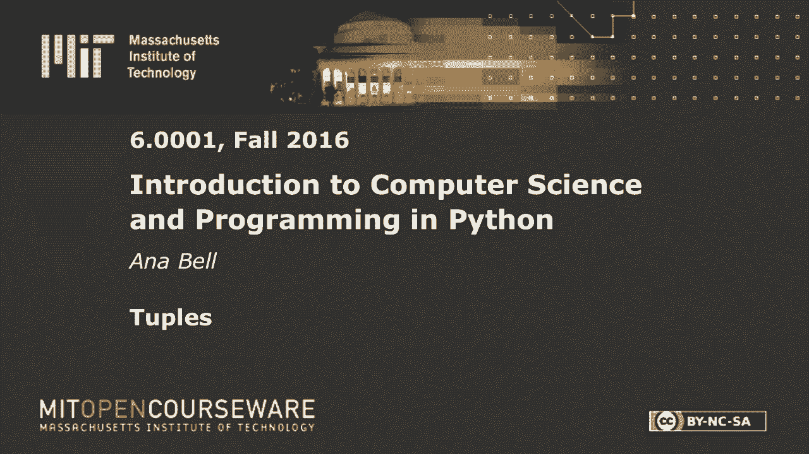
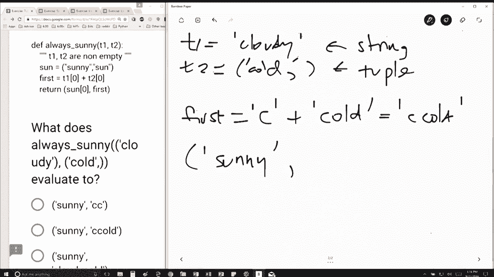

# 【双语字幕+资料下载】MIT 6.0001 ｜ 计算机科学与Python编程导论(2016·完整版) - P18：L5.2- 元组 - ShowMeAI - BV1Dw411f7KK

the following content is provided under，a Creative Commons license your support。

will help MIT OpenCourseWare continue to，offer high quality educational resources，for free。

to make a donation or view additional，materials from hundreds of MIT courses。

all right we've got we've got some good，competition here so let's let's actually。

work through it okay so I'm I have a，function called always sunny and it's。

going to take into two variables right，t1 and t2 and I'm calling it with cloudy。

and cold okay so when I do my function，call t1 is going to be equal to cloudy。

these are strings but I'm not going to，bother putting the quotes and t2 is。

equal to cold comma okay so remember，what I said with a comma it's a tuple。

without a comma it's a string so t1 is，actually going to be a string and t2 is。

actually a tuple okay so that's the，first sort of trick to this question so。

I've made my function call and I've，assigned t1 and t2 to be those those two。

values so the next line is Sun is equal，to sunny comma Sun so Sun is going to be。

this tuple of two strings the next line，is figuring out what first is so first。

is going to be so I'm looking at my t1，here it's a string right the fact that I。

have parentheses doesn't actually make a，difference when I'm talking about。

strings like that so when I'm indexing，into a string t1 at position 0 actually。

just gives me a C because it's a string，and t2 up position zero says okay well。

this is a tuple that contains only one，element that element being at position。

zero and that element is this string，cold right so this is a tuple so I'm。

taking everything right before the first，comma and that happens to be just the。

one element that's in there okay so this，is just the string C cold and then I'm。

returning here a tuple and the tuple I'm，returning is Sun at position zero so。

that's just sunny comma just doing what。

is what's in here and then first and，first was this string C cold okay so。

really the important thing about this，example was to make sure that you。

