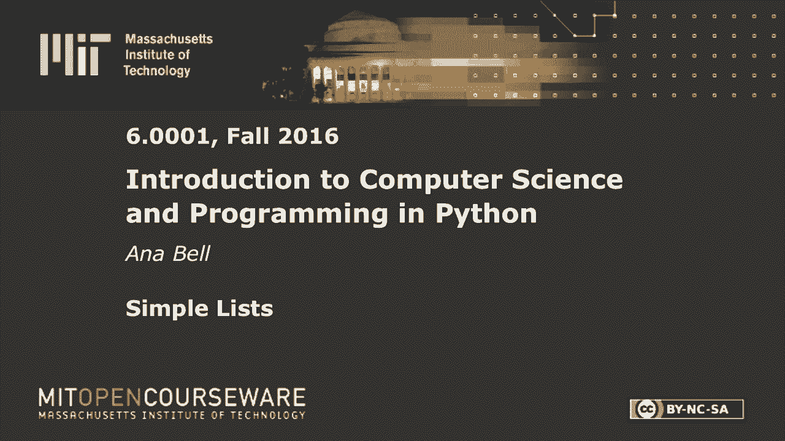
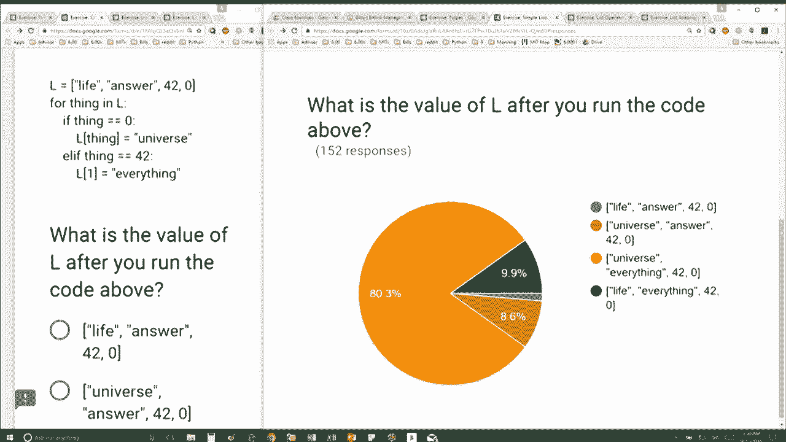

# 【双语字幕+资料下载】MIT 6.0001 ｜ 计算机科学与Python编程导论(2016·完整版) - P19：L5.3- 简单列表 - ShowMeAI - BV1Dw411f7KK

the following content is provided under，a Creative Commons license your support。

will help MIT OpenCourseWare continue to，offer high quality educational resources，for free。

to make a donation or view additional，materials from hundreds of MIT courses。

so we have a list l originally life，answer 42 and 0 in this example if you。

don't know Hitchhiker's Guide to the，galaxy，that's why 42 is important as as a。

scientist if I didn't have example 1 at，least one example with the number 42 I'd。

probably hear about it，so here it is okay so we have this，original list L which contains the。

string life the string answer 42 the，number 42 and the number zero here I'm。

writing a loop that iterates over every，element directly in L right so I'm so。

originally thing I originally thing is，going to be a string life then thing is。

going to be the string answer then thing，is going to be the number 42 and so what。

am i doing inside the loop as I'm，iterating，well if thing is equal to zero that I'm。

going to do this and otherwise I'm gonna，do this so for the first two iterations。

when thing is equal to life for answer，I'm not doing anything as soon as I hit。

42 though I'm saying L at position 1 is，going to get this value here okay so。

when I've iterated over this element，here I'm saying L at position 1 I'm。

gonna change its value which says well，I'm gonna keep life the same but this is。

going to be everything and then we're，keeping the rest the same 42 and 0。

because we're only modifying L at，position 1 as soon as we do that we've。

finished with the loop when L was 42 and，then we go through 0 so now thing takes。

on the value 0 and we say if thing is，equal to 0 well we're good on that L at。

position thing is equal to universe so L，at position 0 is equal to universe so。

that says ok I'm gonna replace life with，universe and then everything else stays，the same 42。

and zero okay so that would be my answer。

