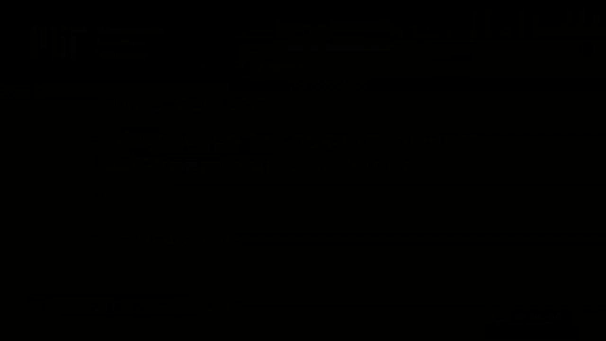
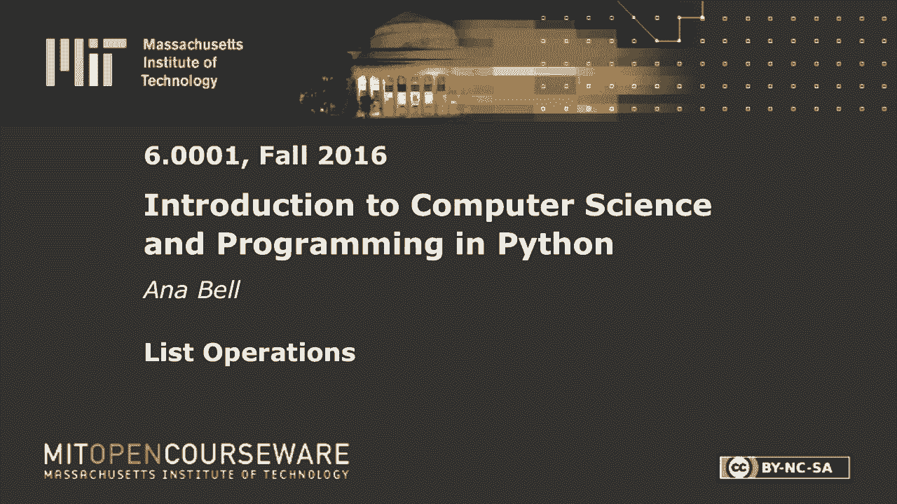
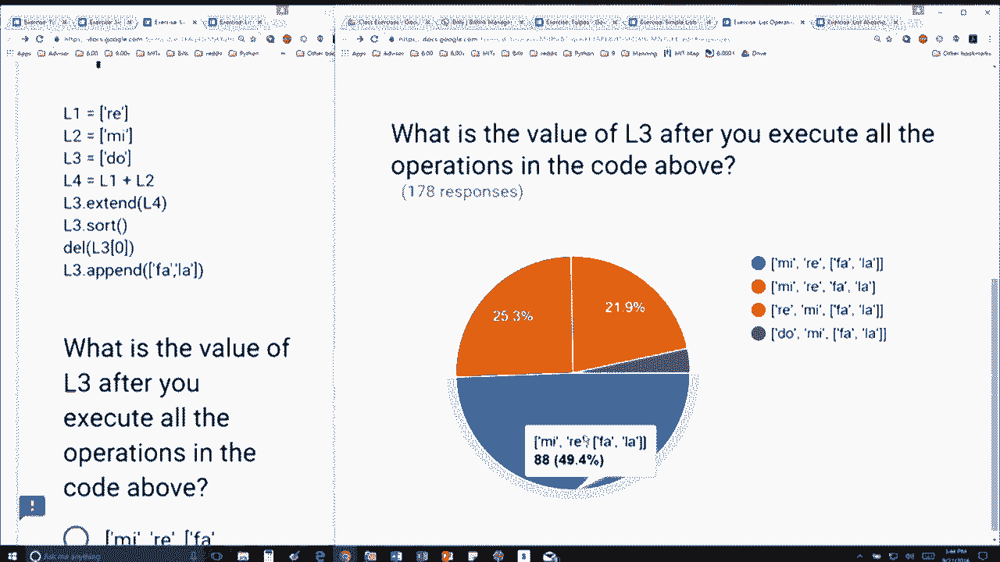
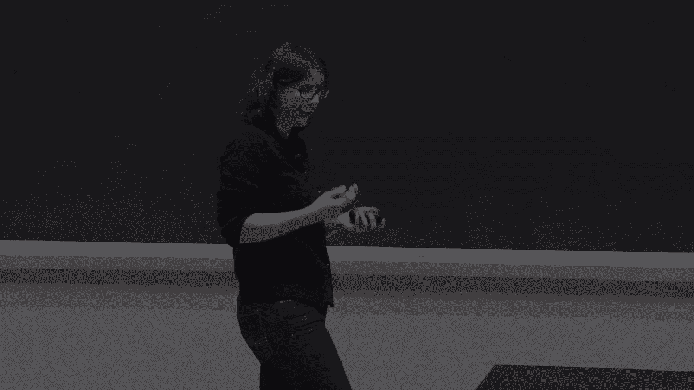

# P20：L5.4- 列表操作 - ShowMeAI - BV1Dw411f7KK

the following content is provided under，a Creative Commons license your support。

will help MIT OpenCourseWare continue to，offer high quality educational resources，for free。

to make a donation or view additional，materials from hundreds of MIT courses。

let's let's walk through it we have，three lists l1 is equal to R a l2 is。

equal to me L 3 is equal to dou L 4 is，equal to let's just do what is what it。

says here L 1 plus L 2 so it's going to，be the list array me me now extend is。

going to mutate the list so that means L，3 is going to be extended by whatever L。

4 is so L 3 is going to be okay what did，it have originally it had do doh and。

then it's going to be extended by all of，the elements inside L 4 which is Ray me，like that。

and once I've mutated it the old version，of L 3 is gone right this is the this is。

the L 3 down here that I'm going to work，with L 3 dot sort is going to start。

alphabetically so that's Doh me ray yep，and sort also mutates the list so the。

del is going to also mutate the list so，it's going to look in l3。

look at index 0 and it's going to delete，that that it's going to delete that。

element so it's going to mutate L 3 and，it's going to be me ray ok and once。

again I've mutated the list so the old，version is gone and lastly this is a。

tricky part I'm going to append to my，current l3 which looks like this another。

list so 2 L 3 I'm appending another list，okay so me ray and then the list fella。

is the answer which is red no sorry。

blue good you got me scared okay perfect，so if you didn't get this I would。

suggest you go through the Python tutor，or you just trace it out by hand just。

like I just did and hopefully it'll be，sort of a parent the more the more。

