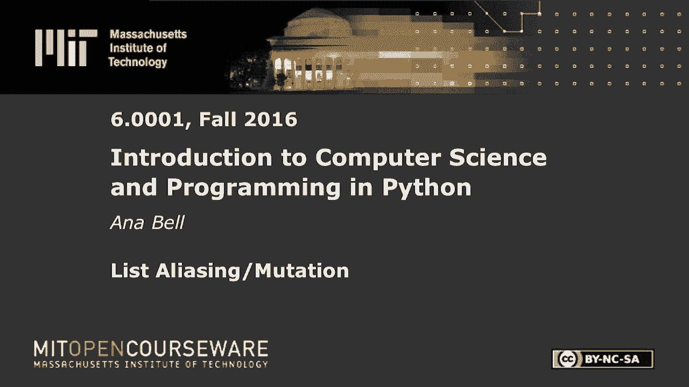
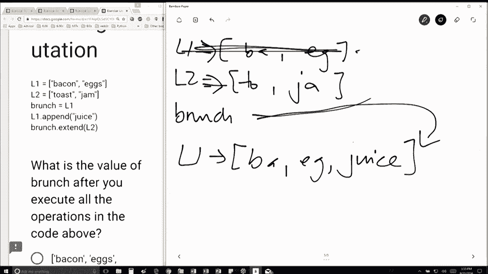

# 【双语字幕+资料下载】MIT 6.0001 ｜ 计算机科学与Python编程导论(2016·完整版) - P21：L5.5- 列表重命名与元素更改 - ShowMeAI - BV1Dw411f7KK

the following content is provided under，a Creative Commons license your support。

will help MIT OpenCourseWare continue to，offer high quality educational resources，for free。

to make a donation or view additional，materials from hundreds of MIT courses。

all right so let's see so first we have，L 1 is equal to bacon eggs I'm going to。

short for them sure hand this L 2 is，equal to toast and jam brunch I should。

actually make these arrows brunch is，equal to L 1 so this is just a liasing。

which means brunch is going to point to，whatever L 1 object points to and if I。

do L 1 dot append juice L 1 is now going，to be bacon eggs and juice okay this L 1。

has been mutated to be that and since，brunch still points to the same object。

that L 1 points to brunch is now going。

to point to there okay so when I do，brunch dot extend L 2 I'm going to take。

whatever brunch is which is this part，here and I'm going to extend it by L 2。

which is toast and jam okay so it's just，going to take a large list of those five。

elements because because of this side，effect issue where brunch was it was。

this pointing to the same thing that L 1，was pointing it to okay。

