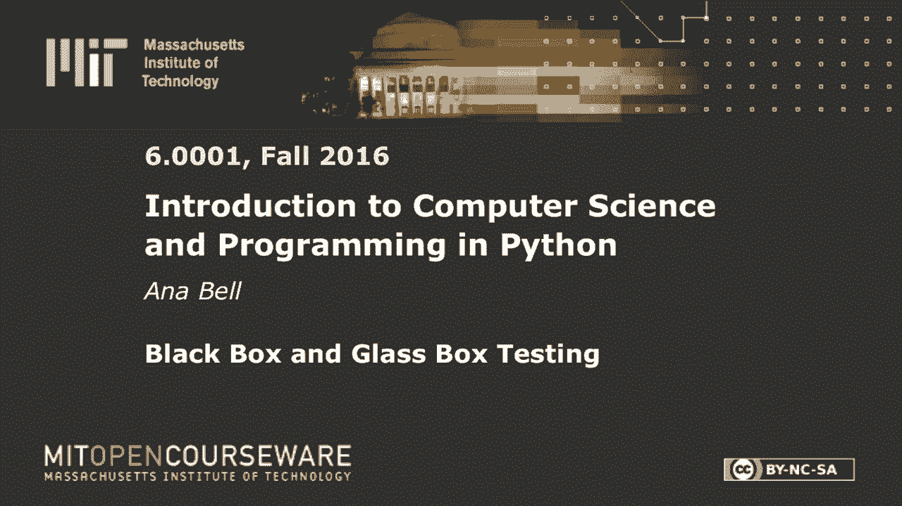
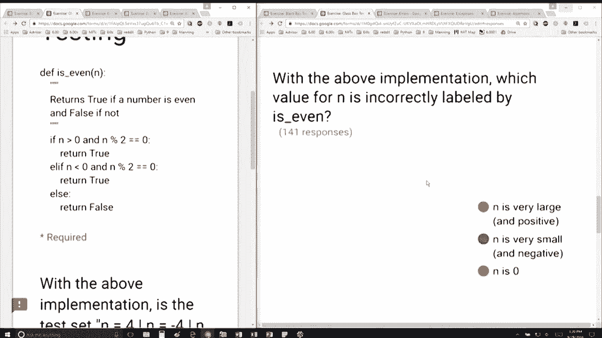

# P24：L7.2- 黑盒与白盒测试 - ShowMeAI - BV1Dw411f7KK

the following content is provided under，a Creative Commons license your support。

will help MIT OpenCourseWare continue to，offer high quality educational resources，for free。

to make a donation or view additional，materials from hundreds of MIT courses。

all right so we have this function is，even same one as before except now I'm。

giving you this implementation if n is，positive and n has a roommate and。

divided by twos remainder is 0 return，true so if n is even and positive return。

true the next one if n is negative and，divisible by 2 return true ok so far and。

otherwise return false question being，with that implementation is this test。

set and it's 4 and is minus 4 path，complete and the answer is yes because 4。

is an even number is is a positive，number and divisible by 2 minus 4 is an。

even number is a sorry minus 4 is a，negative number and divisible by 2 and 5。

would hit upon the else so the answer is，actually yes for that first question。

perfect second question with that，implementation which value for n is is。

incorrectly labeled by that program and，well and is very large still works and。

is very small still works and remember I，said you have to test boundary。

conditions in this case boundary，conditions for this program being when n。

