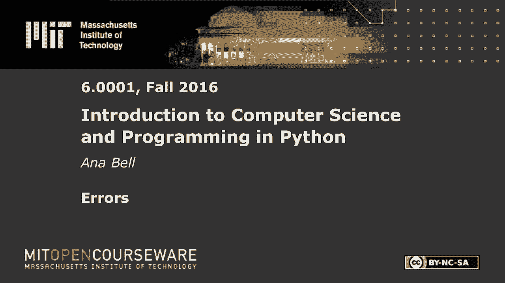
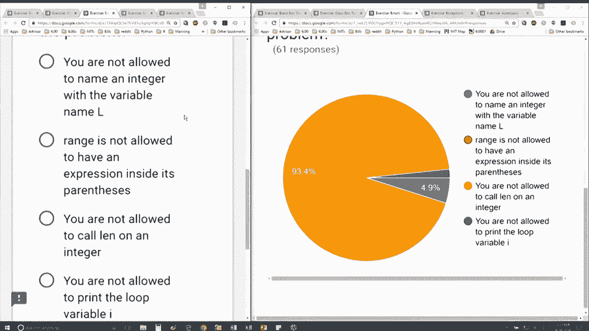

# 【双语字幕+资料下载】MIT 6.0001 ｜ 计算机科学与Python编程导论(2016·完整版) - P25：L7.3- 错误处理 - ShowMeAI - BV1Dw411f7KK

the following content is provided under，a Creative Commons license your support。

will help MIT OpenCourseWare continue to，offer high quality educational resources，for free。

to make a donation or view additional，materials from hundreds of MIT courses。

so let's see if you can figure out this，next error oh nice，looks like a hundred percent are getting。

it right so far so we have L is equal to，three for I in range length L print I。

and this is the error message I get，telling me the file the line and the。

actual line blind number in the actual，line that's wrong and then a description。

of the error type error okay and，everyone's getting it right which is。

what's the problem here we're not。

okay if you go through the other the，other choices you'll see that those you。

can actually do and you can even test。

