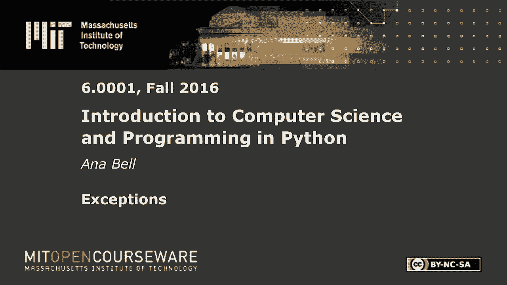
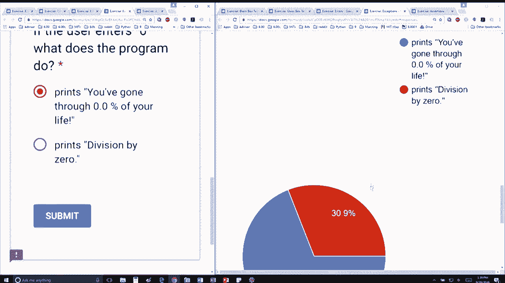

# 【双语字幕+资料下载】MIT 6.0001 ｜ 计算机科学与Python编程导论(2016·完整版) - P26：L7.4- 异常处理 - ShowMeAI - BV1Dw411f7KK

the following content is provided under，a Creative Commons license your support。

will help MIT OpenCourseWare continue to，offer high quality educational resources，for free。

to make a donation or view additional，materials from hundreds of MIT courses。

okay code looks a little bit daunting，but it's not that bad really the only。

part of the code that actually does，something is this part right here where。

we're trying to do this these three，lines the first being we get an input。

from the user that says hold ru we're，converting that to an integer we're。

gonna take that number that they gave，you that they gave us divided by 80 I'm。

assuming life expectancy is 80 and，multiply by hundred to get the percent。

gonna round it to one and then I'm gonna，print you've gone through that much。

percent of your life okay，so again we're dealing with user input。

which is unpredictable so we're gonna，catch first of all a value error and。

that's if the user doesn't enter a，number in that case we're gonna say oops。

you must enter a number and then we're，going to also catch the zero division。

error which says print divided by trying，to do a division by zero and otherwise。

we're how the last except that says，something went very wrong so it looks。

like people are getting it right the，question being if the user enters 20。

what does the program do okay so we're，giving a string and strings taken in as。

input and then trying to convert those，to an integer gives us a value error so。

it's going to go through this except，block here and print that which is great。

most of you guys are getting that right，and then the next one perfect I tricked。

some of you the next one says if the，well what does the program do we're。

gonna take in 0 we're gonna do 0 times，100 divided by 80 that's fine it's。

always going to be 0 we're gonna round，that to 1 and then we're gonna print。

that out so no zero division error no，value error everything went right so。

that means it's going to print out this，the first one okay so that's this one。

here so the zero division error only，happens when you're trying to divide，something by zero。

