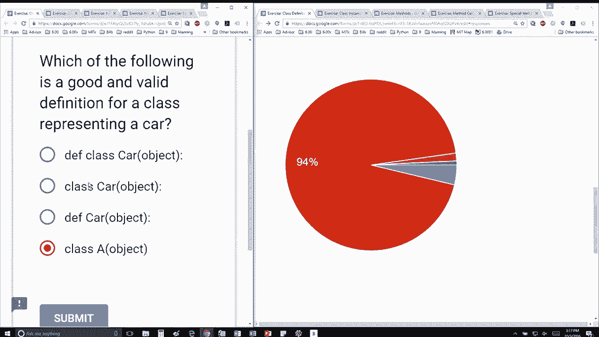

# 【双语字幕+资料下载】MIT 6.0001 ｜ 计算机科学与Python编程导论(2016·完整版) - P28：L8.2- 类的定义 - ShowMeAI - BV1Dw411f7KK

the following content is provided under，a Creative Commons license your support。

will help MIT OpenCourseWare continue to，offer high quality educational resources，for free。

to make a donation or view additional，materials from hundreds of MIT courses。

so which of the following is a good and，valid definition for class representing。

a car okay most of the people I think，have got it gotten it which is the red。

which says class car object that's，perfect okay so this defines a function。

this defines a class correctly but a is，just not descriptive name at all and。

