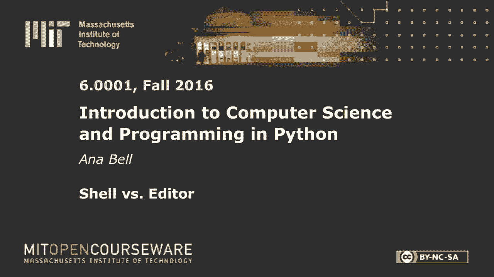

# P2：L1.2- shell与编辑器 - ShowMeAI - BV1Dw411f7KK

the following content is provided under，a Creative Commons license your support。

will help MIT OpenCourseWare continue to，offer high quality educational resources，for free。

to make a donation or view additional，materials from hundreds of MIT courses。

so the question was if you have this，these two these two lines right here。

which I'll just put them up here just so，it's bigger type five print three point。

zero minus one what is going to be the，output so if I run this in the editor so。

for these types of problems you can，always check yourself and this comes。

back to if you're new to programming，don't be afraid to try it out don't ask。

me don't ask your your neighbor just，type it into the into the shell and hit，answer is。

so the answer to this question is going，to 2。0 right and let's see are we right，yep。

great 75% of the people got it right，so if you didn't get it right just to。

explain again the reason why this。

doesn't get printed out is because we，never actually had a print statement。

okay so if you want to show something to。