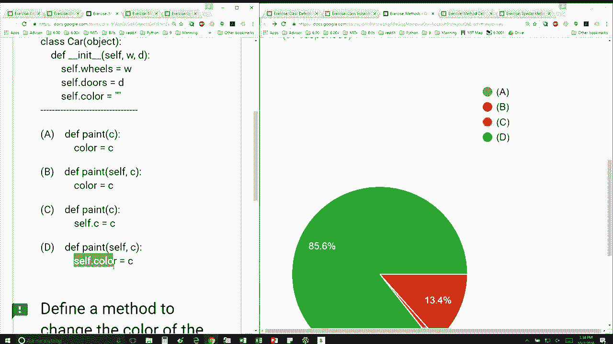

# P30：L8.4- 类方法 - ShowMeAI - BV1Dw411f7KK

the following content is provided under，a Creative Commons license your support。

will help MIT OpenCourseWare continue to，offer high quality educational resources，for free。

to make a donation or view additional，materials from hundreds of MIT courses。

so we're given this definition for car，we saw that in the previous slide I want。

to add a method that's going to change，the color of the car and these are my。

four four choices and it looks like you，guys are getting it getting it right。

which is awesome okay so to find a，method to change the color of the car。

which does this so we know that self has，to be the first parameter so we can。

automatically eliminate and see and it's，between B and D and remember I said you。

have to be conscious about whose data，attribute you're accessing and in this。

case we want to change the color of a，particular instance of the car right so。

we have to say self color instead of，just color if we just said color then。

color would refer to just a variable。

