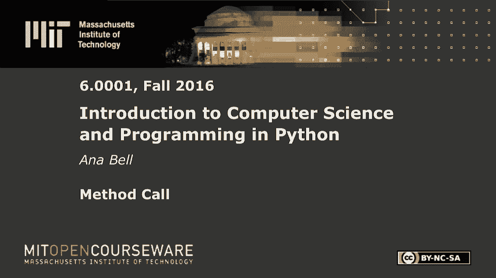
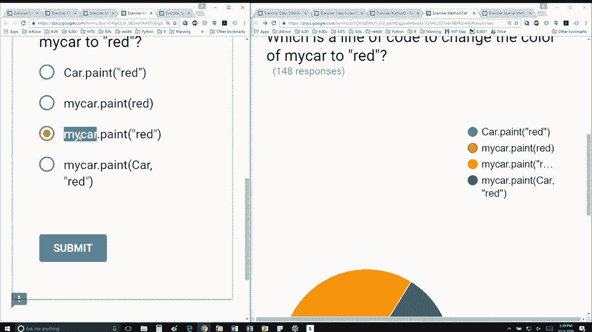
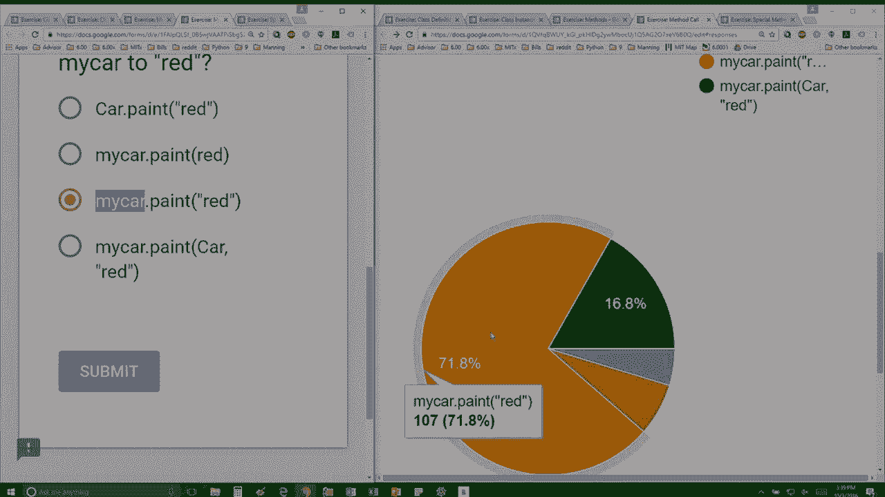

# 【双语字幕+资料下载】MIT 6.0001 ｜ 计算机科学与Python编程导论(2016·完整版) - P31：L8.5- 方法调用 - ShowMeAI - BV1Dw411f7KK

the following content is provided under，a Creative Commons license your support。

will help MIT OpenCourseWare continue to，offer high quality educational resources，for free。

to make a donation or view additional，materials from hundreds of MIT courses。

this is my definition including the，method to paint the car so to change its。

color and the question says you create a，car with this line here so you're。

initializing it with 4 comma 2 what's a，line of code that changes the color from。

whatever it initially is to read the，first one car dot paint red is sort of。

attempting to do the the way that we saw，on the right in the slides where you're。

calling the class name dot but it's，missing the self so we don't know what。

object to call it on so that one's out，of the running the second one is closer。

but we have red here as a variable as，opposed to a string so that one's not，not going to work。

the third one looks good and the fourth，one is just weird I don't think that one。

will work it's attempting to put a value，for self but you've already called my。

car dot instead of the instead of the，class class name dot so here this isn't。

going to work so since you already，called the object named dot method name。

you just have to give it the other。

parameter that it needs which is the。

