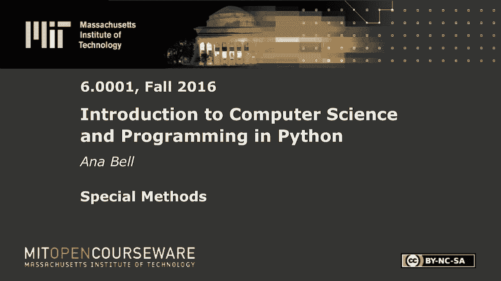
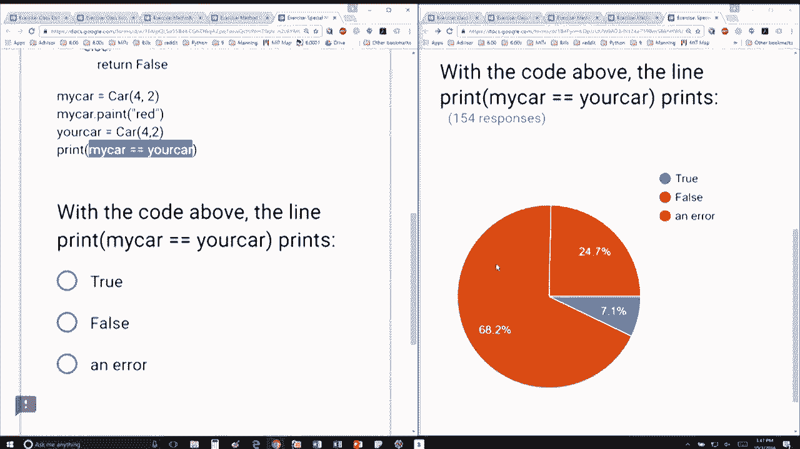

# 【双语字幕+资料下载】MIT 6.0001 ｜ 计算机科学与Python编程导论(2016·完整版) - P32：L8.6- 特殊函数(方法) - ShowMeAI - BV1Dw411f7KK

the following content is provided under，a Creative Commons license your support。

will help MIT OpenCourseWare continue to，offer high quality educational resources，for free。

to make a donation or view additional，materials from hundreds of MIT courses。

okay we have our class we've done pretty，much everything up until here and we're。

going to add this special function here，so we're implementing this underscore。

underscore EQ underscore underscore and，implementing this is going to is going。

so the way I've decided to compare two，types of cars is I'm saying the two cars。

are going to be equal if they have the，same number of wheels they have the same。

color and if they have the same number，of doors okay so if all of these are。

equal then return true and else return，false inside the actual program here I'm。

creating one car four wheels two doors，I'm changing its color to red I'm。

creating another car four wheels two，doors by default this new car or your。

car is going to have the color empty，string because that's how a new car gets。

initialized right so between my car in，your car the difference is going to be。

the color okay so the color is not going，to be the same they have the same number。

of wheels in the same number of doors so，when so because I implemented the equal。

method in my code this does not throw an，error this lets me proceed it compares。

four with four which is good two with，two which is good and then the colors。

don't match so it's going to say false。

