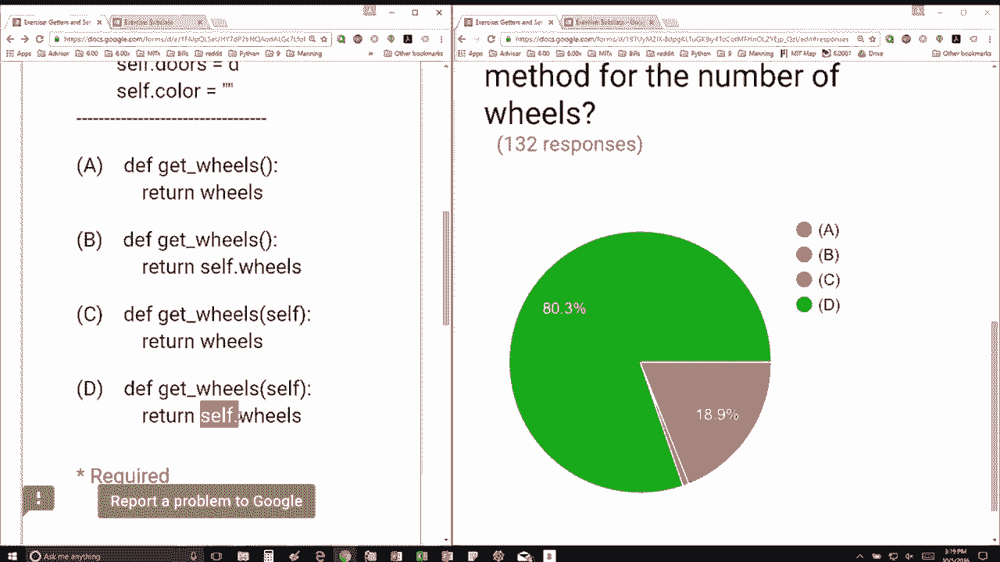

# 【双语字幕+资料下载】MIT 6.0001 ｜ 计算机科学与Python编程导论(2016·完整版) - P34：L9.2- get与set系列处理 - ShowMeAI - BV1Dw411f7KK

the following content is provided under，a Creative Commons license your support。

will help MIT OpenCourseWare continue to，offer high quality educational resources，for free。

to make a donation or view additional，materials from hundreds of MIT courses。

so we have a class car here object as as，usual the init method here takes himself。

as usual a WN daddy so so car gets，initialized with two parameters。

and we assign the wheels data attribute，to the first one and the door's data。

attribute to the second one and then，we're going to also assign a color data。

attribute to be the empty string so I'm，giving you four choices here and the。

question says which of the above is a，getter method for the number of wheels。

okay so get our method is something，that's going to get a data attribute a。

method is really just a function so of，course we're going to have DF get Wheels。

is a good name for it since the method，for this class we have to have self in。

the parameters so we know it's going to，be between C and D and so then what are。

we going to return the first one is，going to return wheels which in this。

particular case is just going to be a，variable that we haven't defined what。

it's a variable a getter returns a data，attribute over particular instance so we。

actually have to say self dot if we want，to return a data attribute of an。

instance as opposed to just a regular。

